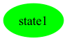

# Per-Product Report — Elevator

Generated by PerProductReportGenerator. For each valid Elevator configuration enumerated by Sat4JSolverFacade, this report shows the projected + SCC-repaired product-level FTS plus the test suites generated for state, all-transitions, and all-transition-pairs coverage.

Action sequences are written as `a -> b -> c -> ...`. Synthetic balancing actions (prefix `__balance__`) are not present in the final test cases.

**Features actually labelling transitions in the SPL FTS** (filter applied below): `Alarm, CardReader, ControlButtons, ExecutiveFloor, FirefighterService, Intercom, ManualDoorControl, MobileKey, PinPad`. Abstract / grouping features that do not label any transition are omitted from the per-product feature lists.

---

## Product 1

**Selected features:** selected = {ControlButtons, ExecutiveFloor, Intercom, PinPad}

**Repaired FTS:** 1 states, 0 transitions


### State coverage (1 test case, 0 transitions)

```
(empty)
```

### All-transitions coverage (1 test cases, 0 transitions total)

- **`Elevator_p1_trans_seg0`**: `(empty)`

### All-transition-pairs coverage (0 test cases, 0 transitions total)


## Product 2

**Selected features:** selected = {Alarm, ControlButtons, FirefighterService, ManualDoorControl}

**Repaired FTS:** 1 states, 0 transitions


### State coverage (1 test case, 0 transitions)

```
(empty)
```

### All-transitions coverage (1 test cases, 0 transitions total)

- **`Elevator_p2_trans_seg0`**: `(empty)`

### All-transition-pairs coverage (0 test cases, 0 transitions total)


## Product 3

**Selected features:** selected = {Alarm, ControlButtons, FirefighterService}

**Repaired FTS:** 1 states, 0 transitions


### State coverage (1 test case, 0 transitions)

```
(empty)
```

### All-transitions coverage (1 test cases, 0 transitions total)

- **`Elevator_p3_trans_seg0`**: `(empty)`

### All-transition-pairs coverage (0 test cases, 0 transitions total)


## Product 4

**Selected features:** selected = {ControlButtons, ExecutiveFloor, Intercom, MobileKey}

**Repaired FTS:** 1 states, 0 transitions


### State coverage (1 test case, 0 transitions)

```
(empty)
```

### All-transitions coverage (1 test cases, 0 transitions total)

- **`Elevator_p4_trans_seg0`**: `(empty)`

### All-transition-pairs coverage (0 test cases, 0 transitions total)


## Product 5

**Selected features:** selected = {Alarm, ControlButtons, FirefighterService, Intercom, ManualDoorControl}

**Repaired FTS:** 1 states, 0 transitions


### State coverage (1 test case, 0 transitions)

```
(empty)
```

### All-transitions coverage (1 test cases, 0 transitions total)

- **`Elevator_p5_trans_seg0`**: `(empty)`

### All-transition-pairs coverage (0 test cases, 0 transitions total)


## Product 6

**Selected features:** selected = {ControlButtons, ExecutiveFloor, Intercom, ManualDoorControl, PinPad}

**Repaired FTS:** 1 states, 0 transitions


### State coverage (1 test case, 0 transitions)

```
(empty)
```

### All-transitions coverage (1 test cases, 0 transitions total)

- **`Elevator_p6_trans_seg0`**: `(empty)`

### All-transition-pairs coverage (0 test cases, 0 transitions total)


## Product 7

**Selected features:** selected = {Alarm, ControlButtons, ManualDoorControl, PinPad}

**Repaired FTS:** 1 states, 0 transitions


### State coverage (1 test case, 0 transitions)

```
(empty)
```

### All-transitions coverage (1 test cases, 0 transitions total)

- **`Elevator_p7_trans_seg0`**: `(empty)`

### All-transition-pairs coverage (0 test cases, 0 transitions total)


## Product 8

**Selected features:** selected = {ControlButtons, FirefighterService, Intercom, ManualDoorControl}

**Repaired FTS:** 1 states, 0 transitions


### State coverage (1 test case, 0 transitions)

```
(empty)
```

### All-transitions coverage (1 test cases, 0 transitions total)

- **`Elevator_p8_trans_seg0`**: `(empty)`

### All-transition-pairs coverage (0 test cases, 0 transitions total)


## Product 9

**Selected features:** selected = {Alarm, ControlButtons, Intercom, MobileKey}

**Repaired FTS:** 1 states, 0 transitions


### State coverage (1 test case, 0 transitions)

```
(empty)
```

### All-transitions coverage (1 test cases, 0 transitions total)

- **`Elevator_p9_trans_seg0`**: `(empty)`

### All-transition-pairs coverage (0 test cases, 0 transitions total)


## Product 10

**Selected features:** selected = {ControlButtons, ExecutiveFloor, Intercom, ManualDoorControl, MobileKey}

**Repaired FTS:** 1 states, 0 transitions


### State coverage (1 test case, 0 transitions)

```
(empty)
```

### All-transitions coverage (1 test cases, 0 transitions total)

- **`Elevator_p10_trans_seg0`**: `(empty)`

### All-transition-pairs coverage (0 test cases, 0 transitions total)


## Product 11

**Selected features:** selected = {Alarm, CardReader, ControlButtons, Intercom}

**Repaired FTS:** 1 states, 0 transitions


### State coverage (1 test case, 0 transitions)

```
(empty)
```

### All-transitions coverage (1 test cases, 0 transitions total)

- **`Elevator_p11_trans_seg0`**: `(empty)`

### All-transition-pairs coverage (0 test cases, 0 transitions total)


## Product 12

**Selected features:** selected = {Alarm, ControlButtons, ExecutiveFloor, Intercom, ManualDoorControl, MobileKey}

**Repaired FTS:** 1 states, 0 transitions


### State coverage (1 test case, 0 transitions)

```
(empty)
```

### All-transitions coverage (1 test cases, 0 transitions total)

- **`Elevator_p12_trans_seg0`**: `(empty)`

### All-transition-pairs coverage (0 test cases, 0 transitions total)


## Product 13

**Selected features:** selected = {Alarm, CardReader, ControlButtons, ExecutiveFloor}

**Repaired FTS:** 1 states, 0 transitions


### State coverage (1 test case, 0 transitions)

```
(empty)
```

### All-transitions coverage (1 test cases, 0 transitions total)

- **`Elevator_p13_trans_seg0`**: `(empty)`

### All-transition-pairs coverage (0 test cases, 0 transitions total)


## Product 14

**Selected features:** selected = {Alarm, ControlButtons, PinPad}

**Repaired FTS:** 1 states, 0 transitions


### State coverage (1 test case, 0 transitions)

```
(empty)
```

### All-transitions coverage (1 test cases, 0 transitions total)

- **`Elevator_p14_trans_seg0`**: `(empty)`

### All-transition-pairs coverage (0 test cases, 0 transitions total)


## Product 15

**Selected features:** selected = {Alarm, ControlButtons, ExecutiveFloor, PinPad}

**Repaired FTS:** 1 states, 0 transitions


### State coverage (1 test case, 0 transitions)

```
(empty)
```

### All-transitions coverage (1 test cases, 0 transitions total)

- **`Elevator_p15_trans_seg0`**: `(empty)`

### All-transition-pairs coverage (0 test cases, 0 transitions total)


## Product 16

**Selected features:** selected = {ControlButtons, FirefighterService, Intercom}

**Repaired FTS:** 1 states, 0 transitions


### State coverage (1 test case, 0 transitions)

```
(empty)
```

### All-transitions coverage (1 test cases, 0 transitions total)

- **`Elevator_p16_trans_seg0`**: `(empty)`

### All-transition-pairs coverage (0 test cases, 0 transitions total)


## Product 17

**Selected features:** selected = {CardReader, ControlButtons, Intercom}

**Repaired FTS:** 1 states, 0 transitions


### State coverage (1 test case, 0 transitions)

```
(empty)
```

### All-transitions coverage (1 test cases, 0 transitions total)

- **`Elevator_p17_trans_seg0`**: `(empty)`

### All-transition-pairs coverage (0 test cases, 0 transitions total)


## Product 18

**Selected features:** selected = {Alarm, ControlButtons, ExecutiveFloor, Intercom, PinPad}

**Repaired FTS:** 1 states, 0 transitions


### State coverage (1 test case, 0 transitions)

```
(empty)
```

### All-transitions coverage (1 test cases, 0 transitions total)

- **`Elevator_p18_trans_seg0`**: `(empty)`

### All-transition-pairs coverage (0 test cases, 0 transitions total)


## Product 19

**Selected features:** selected = {Alarm, ControlButtons, ManualDoorControl, MobileKey}

**Repaired FTS:** 1 states, 0 transitions


### State coverage (1 test case, 0 transitions)

```
(empty)
```

### All-transitions coverage (1 test cases, 0 transitions total)

- **`Elevator_p19_trans_seg0`**: `(empty)`

### All-transition-pairs coverage (0 test cases, 0 transitions total)


## Product 20

**Selected features:** selected = {Alarm, ControlButtons, ExecutiveFloor, Intercom, ManualDoorControl, PinPad}

**Repaired FTS:** 1 states, 0 transitions


### State coverage (1 test case, 0 transitions)

```
(empty)
```

### All-transitions coverage (1 test cases, 0 transitions total)

- **`Elevator_p20_trans_seg0`**: `(empty)`

### All-transition-pairs coverage (0 test cases, 0 transitions total)


## Product 21

**Selected features:** selected = {Alarm, ControlButtons, MobileKey}

**Repaired FTS:** 1 states, 0 transitions


### State coverage (1 test case, 0 transitions)

```
(empty)
```

### All-transitions coverage (1 test cases, 0 transitions total)

- **`Elevator_p21_trans_seg0`**: `(empty)`

### All-transition-pairs coverage (0 test cases, 0 transitions total)


## Product 22

**Selected features:** selected = {Alarm, ControlButtons, FirefighterService, Intercom}

**Repaired FTS:** 1 states, 0 transitions


### State coverage (1 test case, 0 transitions)

```
(empty)
```

### All-transitions coverage (1 test cases, 0 transitions total)

- **`Elevator_p22_trans_seg0`**: `(empty)`

### All-transition-pairs coverage (0 test cases, 0 transitions total)


## Product 23

**Selected features:** selected = {Alarm, ControlButtons, ExecutiveFloor, ManualDoorControl, PinPad}

**Repaired FTS:** 1 states, 0 transitions



### State coverage (1 test case, 0 transitions)

```
(empty)
```

### All-transitions coverage (1 test cases, 0 transitions total)

- **`Elevator_p23_trans_seg0`**: `(empty)`

### All-transition-pairs coverage (0 test cases, 0 transitions total)


## Product 24

**Selected features:** selected = {Alarm, ControlButtons, ExecutiveFloor, MobileKey}

**Repaired FTS:** 1 states, 0 transitions


### State coverage (1 test case, 0 transitions)

```
(empty)
```

### All-transitions coverage (1 test cases, 0 transitions total)

- **`Elevator_p24_trans_seg0`**: `(empty)`

### All-transition-pairs coverage (0 test cases, 0 transitions total)


## Product 25

**Selected features:** selected = {Alarm, ControlButtons, Intercom, ManualDoorControl, PinPad}

**Repaired FTS:** 1 states, 0 transitions


### State coverage (1 test case, 0 transitions)

```
(empty)
```

### All-transitions coverage (1 test cases, 0 transitions total)

- **`Elevator_p25_trans_seg0`**: `(empty)`

### All-transition-pairs coverage (0 test cases, 0 transitions total)


## Product 26

**Selected features:** selected = {Alarm, ControlButtons, ExecutiveFloor, ManualDoorControl, MobileKey}

**Repaired FTS:** 1 states, 0 transitions


### State coverage (1 test case, 0 transitions)

```
(empty)
```

### All-transitions coverage (1 test cases, 0 transitions total)

- **`Elevator_p26_trans_seg0`**: `(empty)`

### All-transition-pairs coverage (0 test cases, 0 transitions total)


## Product 27

**Selected features:** selected = {ControlButtons, Intercom, ManualDoorControl, PinPad}

**Repaired FTS:** 1 states, 0 transitions


### State coverage (1 test case, 0 transitions)

```
(empty)
```

### All-transitions coverage (1 test cases, 0 transitions total)

- **`Elevator_p27_trans_seg0`**: `(empty)`

### All-transition-pairs coverage (0 test cases, 0 transitions total)


## Product 28

**Selected features:** selected = {ControlButtons, Intercom, MobileKey}

**Repaired FTS:** 1 states, 0 transitions


### State coverage (1 test case, 0 transitions)

```
(empty)
```

### All-transitions coverage (1 test cases, 0 transitions total)

- **`Elevator_p28_trans_seg0`**: `(empty)`

### All-transition-pairs coverage (0 test cases, 0 transitions total)


## Product 29

**Selected features:** selected = {ControlButtons, Intercom, ManualDoorControl, MobileKey}

**Repaired FTS:** 1 states, 0 transitions


### State coverage (1 test case, 0 transitions)

```
(empty)
```

### All-transitions coverage (1 test cases, 0 transitions total)

- **`Elevator_p29_trans_seg0`**: `(empty)`

### All-transition-pairs coverage (0 test cases, 0 transitions total)


## Product 30

**Selected features:** selected = {Alarm, ControlButtons, Intercom, PinPad}

**Repaired FTS:** 1 states, 0 transitions


### State coverage (1 test case, 0 transitions)

```
(empty)
```

### All-transitions coverage (1 test cases, 0 transitions total)

- **`Elevator_p30_trans_seg0`**: `(empty)`

### All-transition-pairs coverage (0 test cases, 0 transitions total)


## Product 31

**Selected features:** selected = {Alarm, CardReader, ControlButtons, ExecutiveFloor, ManualDoorControl}

**Repaired FTS:** 1 states, 0 transitions


### State coverage (1 test case, 0 transitions)

```
(empty)
```

### All-transitions coverage (1 test cases, 0 transitions total)

- **`Elevator_p31_trans_seg0`**: `(empty)`

### All-transition-pairs coverage (0 test cases, 0 transitions total)


## Product 32

**Selected features:** selected = {Alarm, CardReader, ControlButtons, ManualDoorControl}

**Repaired FTS:** 1 states, 0 transitions


### State coverage (1 test case, 0 transitions)

```
(empty)
```

### All-transitions coverage (1 test cases, 0 transitions total)

- **`Elevator_p32_trans_seg0`**: `(empty)`

### All-transition-pairs coverage (0 test cases, 0 transitions total)


## Product 33

**Selected features:** selected = {Alarm, ControlButtons, Intercom, ManualDoorControl, MobileKey}

**Repaired FTS:** 1 states, 0 transitions


### State coverage (1 test case, 0 transitions)

```
(empty)
```

### All-transitions coverage (1 test cases, 0 transitions total)

- **`Elevator_p33_trans_seg0`**: `(empty)`

### All-transition-pairs coverage (0 test cases, 0 transitions total)


## Product 34

**Selected features:** selected = {Alarm, ControlButtons, ExecutiveFloor, Intercom, MobileKey}

**Repaired FTS:** 1 states, 0 transitions


### State coverage (1 test case, 0 transitions)

```
(empty)
```

### All-transitions coverage (1 test cases, 0 transitions total)

- **`Elevator_p34_trans_seg0`**: `(empty)`

### All-transition-pairs coverage (0 test cases, 0 transitions total)


## Product 35

**Selected features:** selected = {ControlButtons, Intercom, PinPad}

**Repaired FTS:** 1 states, 0 transitions


### State coverage (1 test case, 0 transitions)

```
(empty)
```

### All-transitions coverage (1 test cases, 0 transitions total)

- **`Elevator_p35_trans_seg0`**: `(empty)`

### All-transition-pairs coverage (0 test cases, 0 transitions total)


## Product 36

**Selected features:** selected = {CardReader, ControlButtons, Intercom, ManualDoorControl}

**Repaired FTS:** 1 states, 0 transitions


### State coverage (1 test case, 0 transitions)

```
(empty)
```

### All-transitions coverage (1 test cases, 0 transitions total)

- **`Elevator_p36_trans_seg0`**: `(empty)`

### All-transition-pairs coverage (0 test cases, 0 transitions total)


## Product 37

**Selected features:** selected = {Alarm, CardReader, ControlButtons, ExecutiveFloor, Intercom}

**Repaired FTS:** 1 states, 0 transitions


### State coverage (1 test case, 0 transitions)

```
(empty)
```

### All-transitions coverage (1 test cases, 0 transitions total)

- **`Elevator_p37_trans_seg0`**: `(empty)`

### All-transition-pairs coverage (0 test cases, 0 transitions total)


## Product 38

**Selected features:** selected = {Alarm, CardReader, ControlButtons, Intercom, ManualDoorControl}

**Repaired FTS:** 1 states, 0 transitions


### State coverage (1 test case, 0 transitions)

```
(empty)
```

### All-transitions coverage (1 test cases, 0 transitions total)

- **`Elevator_p38_trans_seg0`**: `(empty)`

### All-transition-pairs coverage (0 test cases, 0 transitions total)


## Product 39

**Selected features:** selected = {Alarm, CardReader, ControlButtons, ExecutiveFloor, Intercom, ManualDoorControl}

**Repaired FTS:** 1 states, 0 transitions


### State coverage (1 test case, 0 transitions)

```
(empty)
```

### All-transitions coverage (1 test cases, 0 transitions total)

- **`Elevator_p39_trans_seg0`**: `(empty)`

### All-transition-pairs coverage (0 test cases, 0 transitions total)


## Product 40

**Selected features:** selected = {CardReader, ControlButtons, ExecutiveFloor, Intercom, ManualDoorControl}

**Repaired FTS:** 1 states, 0 transitions


### State coverage (1 test case, 0 transitions)

```
(empty)
```

### All-transitions coverage (1 test cases, 0 transitions total)

- **`Elevator_p40_trans_seg0`**: `(empty)`

### All-transition-pairs coverage (0 test cases, 0 transitions total)


## Product 41

**Selected features:** selected = {Alarm, CardReader, ControlButtons}

**Repaired FTS:** 1 states, 0 transitions


### State coverage (1 test case, 0 transitions)

```
(empty)
```

### All-transitions coverage (1 test cases, 0 transitions total)

- **`Elevator_p41_trans_seg0`**: `(empty)`

### All-transition-pairs coverage (0 test cases, 0 transitions total)


## Product 42

**Selected features:** selected = {CardReader, ControlButtons, ExecutiveFloor, Intercom}

**Repaired FTS:** 1 states, 0 transitions


### State coverage (1 test case, 0 transitions)

```
(empty)
```

### All-transitions coverage (1 test cases, 0 transitions total)

- **`Elevator_p42_trans_seg0`**: `(empty)`

### All-transition-pairs coverage (0 test cases, 0 transitions total)


---

Total products: 42.
