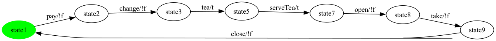
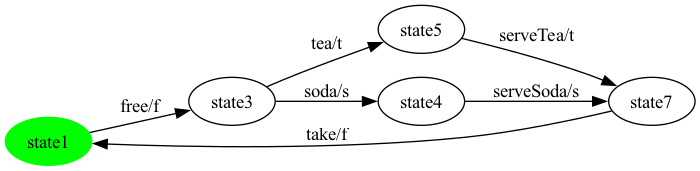
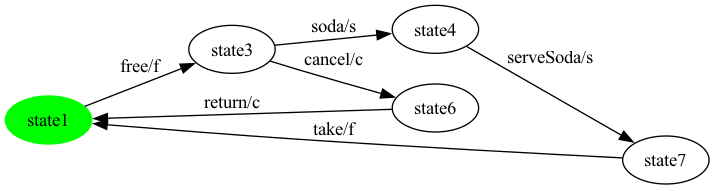
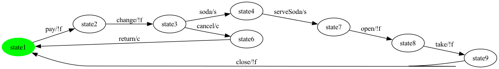
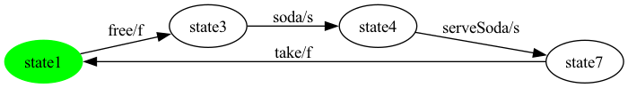

# Per-Product Report — SVM

Generated by PerProductReportGenerator. For each valid SVM configuration enumerated by Sat4JSolverFacade, this report shows the projected + SCC-repaired product-level FTS plus the test suites generated for state, all-transitions, and all-transition-pairs coverage.

Action sequences are written as `a -> b -> c -> ...`. Synthetic balancing actions (prefix `__balance__`) are not present in the final test cases.

**Features actually labelling transitions in the SPL FTS** (filter applied below): `c, f, s, t`. Abstract / grouping features that do not label any transition are omitted from the per-product feature lists.

---

## Product 1

**Selected features:** selected = {c, f, t}

**Repaired FTS:** 5 states, 6 transitions


### State coverage (1 test case, 6 transitions)

```
free -> tea -> serveTea -> take -> free -> cancel
```

### All-transitions coverage (2 test cases, 6 transitions total)

- **`SVM_p1_trans_seg0`**: `free -> cancel -> return`
- **`SVM_p1_trans_seg1`**: `tea -> serveTea -> take`

### All-transition-pairs coverage (1 test cases, 8 transitions total)

- **`SVM_p1_pair_seg0`**: `free -> tea -> serveTea -> take -> free -> cancel -> return -> free`

## Product 2

**Selected features:** selected = {s, t}

**Repaired FTS:** 8 states, 9 transitions


### State coverage (1 test case, 10 transitions)

```
pay -> change -> soda -> serveSoda -> open -> take -> close -> pay -> change -> tea
```

### All-transitions coverage (2 test cases, 9 transitions total)

- **`SVM_p2_trans_seg0`**: `pay -> change -> tea -> serveTea`
- **`SVM_p2_trans_seg1`**: `soda -> serveSoda -> open -> take -> close`

### All-transition-pairs coverage (2 test cases, 12 transitions total)

- **`SVM_p2_pair_seg0`**: `pay -> change -> tea -> serveTea -> open -> take -> close -> pay`
- **`SVM_p2_pair_seg1`**: `change -> soda -> serveSoda -> open`

## Product 3

**Selected features:** selected = {s}

**Repaired FTS:** 7 states, 7 transitions


### State coverage (1 test case, 6 transitions)

```
pay -> change -> soda -> serveSoda -> open -> take
```

### All-transitions coverage (1 test cases, 7 transitions total)

- **`SVM_p3_trans_seg0`**: `pay -> change -> soda -> serveSoda -> open -> take -> close`

### All-transition-pairs coverage (1 test cases, 8 transitions total)

- **`SVM_p3_pair_seg0`**: `pay -> change -> soda -> serveSoda -> open -> take -> close -> pay`

## Product 4

**Selected features:** selected = {t}

**Repaired FTS:** 7 states, 7 transitions



### State coverage (1 test case, 6 transitions)

```
pay -> change -> tea -> serveTea -> open -> take
```

### All-transitions coverage (1 test cases, 7 transitions total)

- **`SVM_p4_trans_seg0`**: `pay -> change -> tea -> serveTea -> open -> take -> close`

### All-transition-pairs coverage (1 test cases, 8 transitions total)

- **`SVM_p4_pair_seg0`**: `pay -> change -> tea -> serveTea -> open -> take -> close -> pay`

## Product 5

**Selected features:** selected = {f, s, t}

**Repaired FTS:** 5 states, 6 transitions



### State coverage (1 test case, 6 transitions)

```
free -> soda -> serveSoda -> take -> free -> tea
```

### All-transitions coverage (2 test cases, 6 transitions total)

- **`SVM_p5_trans_seg0`**: `free -> tea -> serveTea`
- **`SVM_p5_trans_seg1`**: `soda -> serveSoda -> take`

### All-transition-pairs coverage (1 test cases, 8 transitions total)

- **`SVM_p5_pair_seg0`**: `free -> tea -> serveTea -> take -> free -> soda -> serveSoda -> take`

## Product 6

**Selected features:** selected = {c, f, s}

**Repaired FTS:** 5 states, 6 transitions



### State coverage (1 test case, 6 transitions)

```
free -> soda -> serveSoda -> take -> free -> cancel
```

### All-transitions coverage (2 test cases, 6 transitions total)

- **`SVM_p6_trans_seg0`**: `free -> cancel -> return`
- **`SVM_p6_trans_seg1`**: `soda -> serveSoda -> take`

### All-transition-pairs coverage (1 test cases, 8 transitions total)

- **`SVM_p6_pair_seg0`**: `free -> cancel -> return -> free -> soda -> serveSoda -> take -> free`

## Product 7

**Selected features:** selected = {c, s}

**Repaired FTS:** 8 states, 9 transitions



### State coverage (1 test case, 10 transitions)

```
pay -> change -> soda -> serveSoda -> open -> take -> close -> pay -> change -> cancel
```

### All-transitions coverage (2 test cases, 9 transitions total)

- **`SVM_p7_trans_seg0`**: `pay -> change -> cancel -> return`
- **`SVM_p7_trans_seg1`**: `soda -> serveSoda -> open -> take -> close`

### All-transition-pairs coverage (2 test cases, 12 transitions total)

- **`SVM_p7_pair_seg0`**: `pay -> change -> soda -> serveSoda -> open -> take -> close -> pay`
- **`SVM_p7_pair_seg1`**: `change -> cancel -> return -> pay`

## Product 8

**Selected features:** selected = {f, t}

**Repaired FTS:** 4 states, 4 transitions


### State coverage (1 test case, 3 transitions)

```
free -> tea -> serveTea
```

### All-transitions coverage (1 test cases, 4 transitions total)

- **`SVM_p8_trans_seg0`**: `free -> tea -> serveTea -> take`

### All-transition-pairs coverage (1 test cases, 5 transitions total)

- **`SVM_p8_pair_seg0`**: `free -> tea -> serveTea -> take -> free`

## Product 9

**Selected features:** selected = {c, f, s, t}

**Repaired FTS:** 6 states, 8 transitions


### State coverage (1 test case, 10 transitions)

```
free -> soda -> serveSoda -> take -> free -> tea -> serveTea -> take -> free -> cancel
```

### All-transitions coverage (2 test cases, 8 transitions total)

- **`SVM_p9_trans_seg0`**: `cancel -> return -> free -> tea -> serveTea`
- **`SVM_p9_trans_seg1`**: `soda -> serveSoda -> take`

### All-transition-pairs coverage (1 test cases, 11 transitions total)

- **`SVM_p9_pair_seg0`**: `free -> tea -> serveTea -> take -> free -> cancel -> return -> free -> soda -> serveSoda -> take`

## Product 10

**Selected features:** selected = {c, s, t}

**Repaired FTS:** 9 states, 11 transitions


### State coverage (1 test case, 17 transitions)

```
pay -> change -> soda -> serveSoda -> open -> take -> close -> pay -> change -> tea -> serveTea -> open -> take -> close -> pay -> change -> cancel
```

### All-transitions coverage (3 test cases, 11 transitions total)

- **`SVM_p10_trans_seg0`**: `pay -> change -> cancel -> return`
- **`SVM_p10_trans_seg1`**: `tea -> serveTea`
- **`SVM_p10_trans_seg2`**: `soda -> serveSoda -> open -> take -> close`

### All-transition-pairs coverage (3 test cases, 16 transitions total)

- **`SVM_p10_pair_seg0`**: `pay -> change -> tea -> serveTea -> open -> take -> close -> pay`
- **`SVM_p10_pair_seg1`**: `change -> cancel -> return -> pay`
- **`SVM_p10_pair_seg2`**: `change -> soda -> serveSoda -> open`

## Product 11

**Selected features:** selected = {c, t}

**Repaired FTS:** 8 states, 9 transitions


### State coverage (1 test case, 10 transitions)

```
pay -> change -> tea -> serveTea -> open -> take -> close -> pay -> change -> cancel
```

### All-transitions coverage (2 test cases, 9 transitions total)

- **`SVM_p11_trans_seg0`**: `pay -> change -> cancel -> return`
- **`SVM_p11_trans_seg1`**: `tea -> serveTea -> open -> take -> close`

### All-transition-pairs coverage (2 test cases, 12 transitions total)

- **`SVM_p11_pair_seg0`**: `pay -> change -> tea -> serveTea -> open -> take -> close -> pay`
- **`SVM_p11_pair_seg1`**: `change -> cancel -> return -> pay`

## Product 12

**Selected features:** selected = {f, s}

**Repaired FTS:** 4 states, 4 transitions



### State coverage (1 test case, 3 transitions)

```
free -> soda -> serveSoda
```

### All-transitions coverage (1 test cases, 4 transitions total)

- **`SVM_p12_trans_seg0`**: `free -> soda -> serveSoda -> take`

### All-transition-pairs coverage (1 test cases, 5 transitions total)

- **`SVM_p12_pair_seg0`**: `free -> soda -> serveSoda -> take -> free`

---

Total products: 12.
