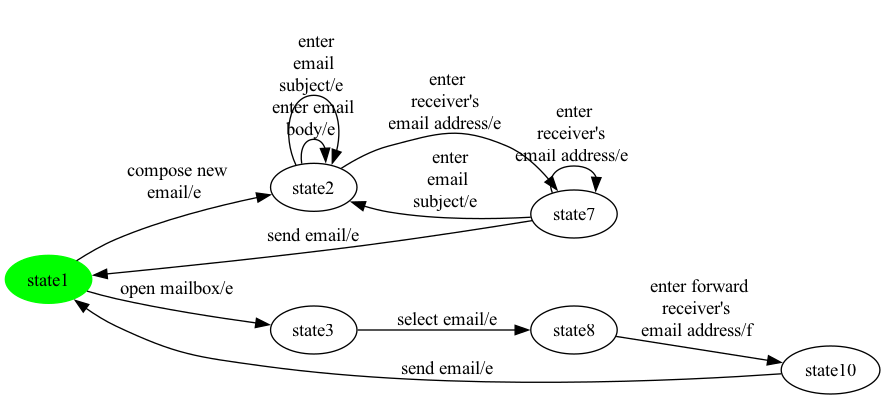
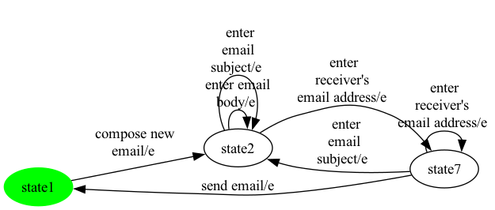
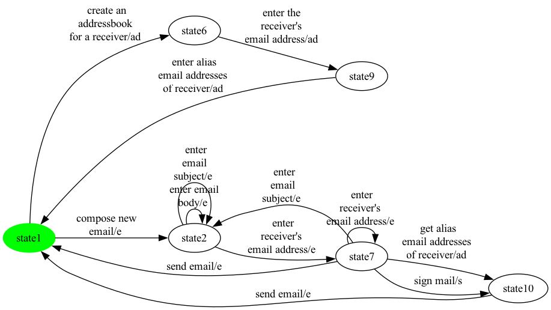
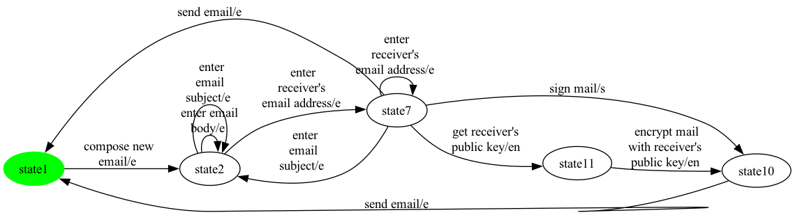
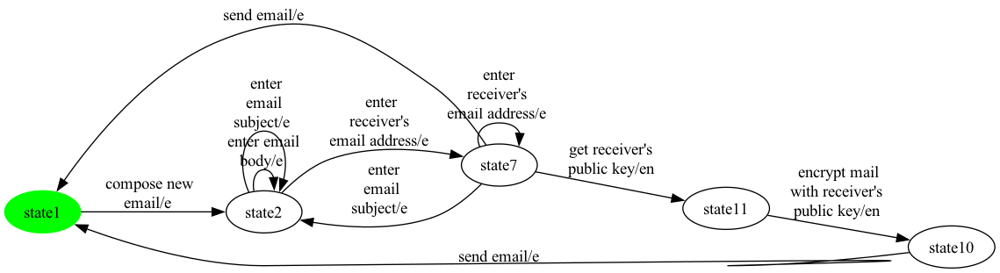
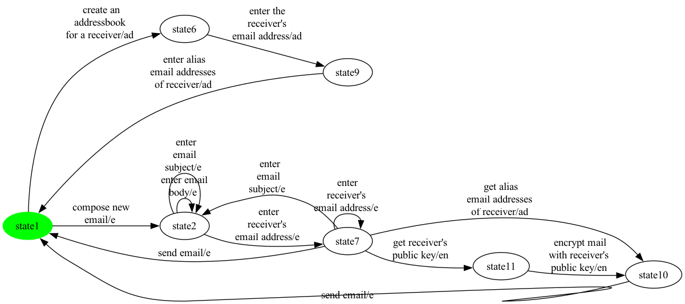
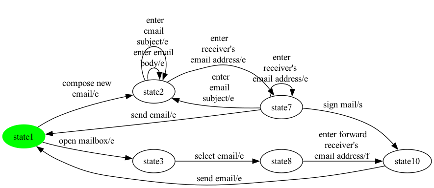
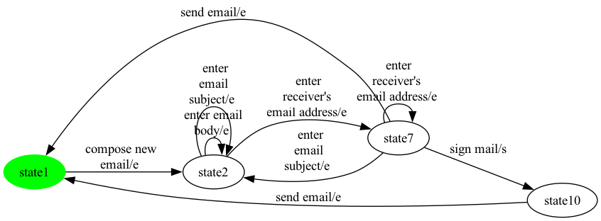
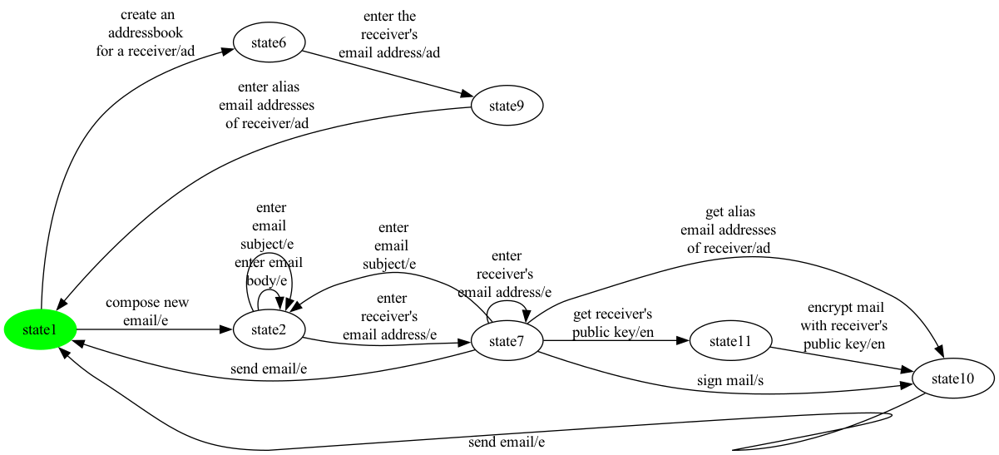
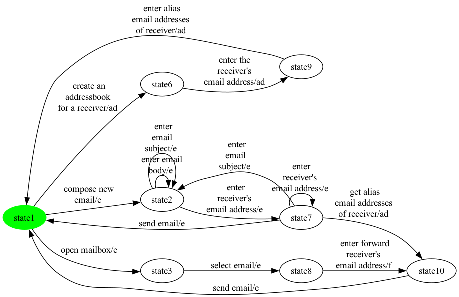

# Per-Product Report — eMail

Generated by PerProductReportGenerator. For each valid eMail configuration enumerated by Sat4JSolverFacade, this report shows the projected + SCC-repaired product-level FTS plus the test suites generated for state, all-transitions, and all-transition-pairs coverage.

Action sequences are written as `a -> b -> c -> ...`. Synthetic balancing actions (prefix `__balance__`) are not present in the final test cases.

**Features actually labelling transitions in the SPL FTS** (filter applied below): `ad, au, e, en, f, s`. Abstract / grouping features that do not label any transition are omitted from the per-product feature lists.

---

## Product 1

**Selected features:** selected = {e, f}

**Repaired FTS:** 6 states, 11 transitions



### State coverage (1 test case, 6 transitions)

```
compose new 
email -> enter 
receiver's 
email address -> send email -> open mailbox -> select email -> enter forward 
receiver's 
email address
```

### All-transitions coverage (2 test cases, 11 transitions total)

- **`eMail_p1_trans_seg0`**: `open mailbox -> select email -> enter forward 
receiver's 
email address -> send email -> compose new 
email -> enter email 
body -> enter
 email 
subject -> enter 
receiver's 
email address -> enter
 email 
subject`
- **`eMail_p1_trans_seg1`**: `enter 
receiver's 
email address -> send email`

### All-transition-pairs coverage (5 test cases, 30 transitions total)

- **`eMail_p1_pair_seg0`**: `compose new 
email -> enter
 email 
subject -> enter
 email 
subject -> enter email 
body -> enter 
receiver's 
email address -> enter 
receiver's 
email address -> send email -> compose new 
email -> enter email 
body -> enter email 
body -> enter
 email 
subject -> enter 
receiver's 
email address -> send email -> open mailbox -> select email -> enter forward 
receiver's 
email address -> send email -> open mailbox`
- **`eMail_p1_pair_seg1`**: `send email -> compose new 
email -> enter 
receiver's 
email address -> enter
 email 
subject -> enter
 email 
subject`
- **`eMail_p1_pair_seg2`**: `enter
 email 
subject -> enter email 
body`
- **`eMail_p1_pair_seg3`**: `enter 
receiver's 
email address -> enter 
receiver's 
email address -> enter
 email 
subject -> enter 
receiver's 
email address`
- **`eMail_p1_pair_seg4`**: `open mailbox`

## Product 2

**Selected features:** selected = {e, s}

**Repaired FTS:** 4 states, 9 transitions


### State coverage (1 test case, 3 transitions)

```
compose new 
email -> enter 
receiver's 
email address -> sign mail
```

### All-transitions coverage (3 test cases, 9 transitions total)

- **`eMail_p2_trans_seg0`**: `compose new 
email -> enter email 
body -> enter
 email 
subject`
- **`eMail_p2_trans_seg1`**: `send email`
- **`eMail_p2_trans_seg2`**: `enter
 email 
subject -> enter 
receiver's 
email address -> enter 
receiver's 
email address -> sign mail -> send email`

### All-transition-pairs coverage (4 test cases, 27 transitions total)

- **`eMail_p2_pair_seg0`**: `compose new 
email -> enter 
receiver's 
email address -> enter 
receiver's 
email address -> enter 
receiver's 
email address -> send email -> compose new 
email -> enter
 email 
subject -> enter
 email 
subject -> enter email 
body -> enter 
receiver's 
email address -> sign mail -> send email -> compose new 
email -> enter email 
body -> enter email 
body -> enter
 email 
subject -> enter 
receiver's 
email address -> send email`
- **`eMail_p2_pair_seg1`**: `enter 
receiver's 
email address -> sign mail`
- **`eMail_p2_pair_seg2`**: `enter 
receiver's 
email address -> enter
 email 
subject -> enter
 email 
subject`
- **`eMail_p2_pair_seg3`**: `enter
 email 
subject -> enter 
receiver's 
email address -> enter
 email 
subject -> enter email 
body`

## Product 3

**Selected features:** selected = {au, e}

**Repaired FTS:** 3 states, 7 transitions



### State coverage (1 test case, 2 transitions)

```
compose new 
email -> enter 
receiver's 
email address
```

### All-transitions coverage (2 test cases, 7 transitions total)

- **`eMail_p3_trans_seg0`**: `compose new 
email -> enter email 
body -> enter
 email 
subject -> enter 
receiver's 
email address -> enter
 email 
subject`
- **`eMail_p3_trans_seg1`**: `enter 
receiver's 
email address -> send email`

### All-transition-pairs coverage (4 test cases, 23 transitions total)

- **`eMail_p3_pair_seg0`**: `compose new 
email -> enter 
receiver's 
email address -> enter 
receiver's 
email address -> enter 
receiver's 
email address -> send email`
- **`eMail_p3_pair_seg1`**: `compose new 
email -> enter
 email 
subject -> enter
 email 
subject -> enter email 
body -> enter 
receiver's 
email address -> send email -> compose new 
email -> enter email 
body -> enter email 
body -> enter
 email 
subject -> enter 
receiver's 
email address -> enter
 email 
subject -> enter
 email 
subject`
- **`eMail_p3_pair_seg2`**: `enter
 email 
subject -> enter email 
body`
- **`eMail_p3_pair_seg3`**: `enter 
receiver's 
email address -> enter
 email 
subject -> enter 
receiver's 
email address`

## Product 4

**Selected features:** selected = {au, e, f}

**Repaired FTS:** 6 states, 11 transitions


### State coverage (1 test case, 6 transitions)

```
open mailbox -> select email -> enter forward 
receiver's 
email address -> send email -> compose new 
email -> enter 
receiver's 
email address
```

### All-transitions coverage (2 test cases, 11 transitions total)

- **`eMail_p4_trans_seg0`**: `open mailbox -> select email -> enter forward 
receiver's 
email address -> send email -> compose new 
email -> enter email 
body -> enter
 email 
subject -> enter 
receiver's 
email address -> enter
 email 
subject`
- **`eMail_p4_trans_seg1`**: `enter 
receiver's 
email address -> send email`

### All-transition-pairs coverage (5 test cases, 30 transitions total)

- **`eMail_p4_pair_seg0`**: `compose new 
email -> enter
 email 
subject -> enter
 email 
subject -> enter email 
body -> enter 
receiver's 
email address -> enter 
receiver's 
email address -> send email -> compose new 
email -> enter email 
body -> enter email 
body -> enter
 email 
subject -> enter 
receiver's 
email address -> send email -> open mailbox -> select email -> enter forward 
receiver's 
email address -> send email -> open mailbox`
- **`eMail_p4_pair_seg1`**: `send email -> compose new 
email -> enter 
receiver's 
email address -> enter
 email 
subject -> enter
 email 
subject`
- **`eMail_p4_pair_seg2`**: `enter
 email 
subject -> enter email 
body`
- **`eMail_p4_pair_seg3`**: `enter 
receiver's 
email address -> enter 
receiver's 
email address -> enter
 email 
subject -> enter 
receiver's 
email address`
- **`eMail_p4_pair_seg4`**: `open mailbox`

## Product 5

**Selected features:** selected = {ad, au, e, s}

**Repaired FTS:** 6 states, 13 transitions



### State coverage (1 test case, 6 transitions)

```
create an 
addressbook 
for a receiver -> enter the  
receiver's 
email address -> enter alias 
email addresses 
of receiver -> compose new 
email -> enter 
receiver's 
email address -> sign mail
```

### All-transitions coverage (4 test cases, 13 transitions total)

- **`eMail_p5_trans_seg0`**: `create an 
addressbook 
for a receiver -> enter the  
receiver's 
email address -> enter alias 
email addresses 
of receiver -> compose new 
email`
- **`eMail_p5_trans_seg1`**: `send email`
- **`eMail_p5_trans_seg2`**: `sign mail`
- **`eMail_p5_trans_seg3`**: `enter
 email 
subject -> enter email 
body -> enter
 email 
subject -> enter 
receiver's 
email address -> enter 
receiver's 
email address -> get alias 
email addresses 
of receiver -> send email`

### All-transition-pairs coverage (8 test cases, 40 transitions total)

- **`eMail_p5_pair_seg0`**: `compose new 
email -> enter
 email 
subject -> enter
 email 
subject -> enter email 
body -> enter 
receiver's 
email address -> sign mail -> send email -> create an 
addressbook 
for a receiver -> enter the  
receiver's 
email address -> enter alias 
email addresses 
of receiver -> create an 
addressbook 
for a receiver`
- **`eMail_p5_pair_seg1`**: `create an 
addressbook 
for a receiver`
- **`eMail_p5_pair_seg2`**: `enter 
receiver's 
email address -> get alias 
email addresses 
of receiver -> send email -> compose new 
email -> enter email 
body -> enter email 
body -> enter
 email 
subject -> enter 
receiver's 
email address -> enter 
receiver's 
email address -> send email -> compose new 
email -> enter 
receiver's 
email address -> enter
 email 
subject -> enter
 email 
subject`
- **`eMail_p5_pair_seg3`**: `enter alias 
email addresses 
of receiver -> compose new 
email`
- **`eMail_p5_pair_seg4`**: `enter
 email 
subject -> enter email 
body`
- **`eMail_p5_pair_seg5`**: `enter 
receiver's 
email address -> sign mail`
- **`eMail_p5_pair_seg6`**: `enter 
receiver's 
email address -> get alias 
email addresses 
of receiver`
- **`eMail_p5_pair_seg7`**: `enter 
receiver's 
email address -> enter 
receiver's 
email address -> enter
 email 
subject -> enter 
receiver's 
email address -> send email -> create an 
addressbook 
for a receiver`

## Product 6

**Selected features:** selected = {ad, au, e, f, s}

**Repaired FTS:** 8 states, 16 transitions


### State coverage (1 test case, 9 transitions)

```
open mailbox -> select email -> enter forward 
receiver's 
email address -> send email -> create an 
addressbook 
for a receiver -> enter the  
receiver's 
email address -> enter alias 
email addresses 
of receiver -> compose new 
email -> enter 
receiver's 
email address
```

### All-transitions coverage (4 test cases, 16 transitions total)

- **`eMail_p6_trans_seg0`**: `open mailbox -> select email -> enter forward 
receiver's 
email address -> send email -> create an 
addressbook 
for a receiver -> enter the  
receiver's 
email address -> enter alias 
email addresses 
of receiver -> compose new 
email`
- **`eMail_p6_trans_seg1`**: `sign mail`
- **`eMail_p6_trans_seg2`**: `get alias 
email addresses 
of receiver`
- **`eMail_p6_trans_seg3`**: `enter
 email 
subject -> enter email 
body -> enter
 email 
subject -> enter 
receiver's 
email address -> enter 
receiver's 
email address -> send email`

### All-transition-pairs coverage (11 test cases, 49 transitions total)

- **`eMail_p6_pair_seg0`**: `compose new 
email -> enter
 email 
subject -> enter
 email 
subject -> enter email 
body -> enter 
receiver's 
email address -> sign mail -> send email -> create an 
addressbook 
for a receiver -> enter the  
receiver's 
email address -> enter alias 
email addresses 
of receiver -> create an 
addressbook 
for a receiver`
- **`eMail_p6_pair_seg1`**: `enter 
receiver's 
email address -> get alias 
email addresses 
of receiver -> send email -> open mailbox -> select email -> enter forward 
receiver's 
email address -> send email -> compose new 
email -> enter email 
body -> enter email 
body -> enter
 email 
subject -> enter 
receiver's 
email address -> enter 
receiver's 
email address -> send email -> compose new 
email -> enter 
receiver's 
email address -> send email -> create an 
addressbook 
for a receiver`
- **`eMail_p6_pair_seg2`**: `send email -> open mailbox`
- **`eMail_p6_pair_seg3`**: `open mailbox`
- **`eMail_p6_pair_seg4`**: `create an 
addressbook 
for a receiver`
- **`eMail_p6_pair_seg5`**: `enter alias 
email addresses 
of receiver -> compose new 
email`
- **`eMail_p6_pair_seg6`**: `enter
 email 
subject -> enter
 email 
subject`
- **`eMail_p6_pair_seg7`**: `enter 
receiver's 
email address -> sign mail`
- **`eMail_p6_pair_seg8`**: `enter 
receiver's 
email address -> enter 
receiver's 
email address -> enter
 email 
subject -> enter 
receiver's 
email address -> enter
 email 
subject -> enter email 
body`
- **`eMail_p6_pair_seg9`**: `enter 
receiver's 
email address -> get alias 
email addresses 
of receiver`
- **`eMail_p6_pair_seg10`**: `enter alias 
email addresses 
of receiver -> open mailbox`

## Product 7

**Selected features:** selected = {ad, e, s}

**Repaired FTS:** 6 states, 13 transitions



### State coverage (1 test case, 6 transitions)

```
create an 
addressbook 
for a receiver -> enter the  
receiver's 
email address -> enter alias 
email addresses 
of receiver -> compose new 
email -> enter 
receiver's 
email address -> sign mail
```

### All-transitions coverage (4 test cases, 13 transitions total)

- **`eMail_p7_trans_seg0`**: `create an 
addressbook 
for a receiver -> enter the  
receiver's 
email address -> enter alias 
email addresses 
of receiver -> compose new 
email`
- **`eMail_p7_trans_seg1`**: `send email`
- **`eMail_p7_trans_seg2`**: `sign mail`
- **`eMail_p7_trans_seg3`**: `enter
 email 
subject -> enter email 
body -> enter
 email 
subject -> enter 
receiver's 
email address -> enter 
receiver's 
email address -> get alias 
email addresses 
of receiver -> send email`

### All-transition-pairs coverage (8 test cases, 40 transitions total)

- **`eMail_p7_pair_seg0`**: `compose new 
email -> enter
 email 
subject -> enter
 email 
subject -> enter email 
body -> enter 
receiver's 
email address -> sign mail -> send email -> create an 
addressbook 
for a receiver -> enter the  
receiver's 
email address -> enter alias 
email addresses 
of receiver -> create an 
addressbook 
for a receiver`
- **`eMail_p7_pair_seg1`**: `create an 
addressbook 
for a receiver`
- **`eMail_p7_pair_seg2`**: `enter 
receiver's 
email address -> get alias 
email addresses 
of receiver -> send email -> compose new 
email -> enter email 
body -> enter email 
body -> enter
 email 
subject -> enter 
receiver's 
email address -> enter 
receiver's 
email address -> send email -> compose new 
email -> enter 
receiver's 
email address -> enter
 email 
subject -> enter
 email 
subject`
- **`eMail_p7_pair_seg3`**: `enter alias 
email addresses 
of receiver -> compose new 
email`
- **`eMail_p7_pair_seg4`**: `enter
 email 
subject -> enter email 
body`
- **`eMail_p7_pair_seg5`**: `enter 
receiver's 
email address -> sign mail`
- **`eMail_p7_pair_seg6`**: `enter 
receiver's 
email address -> get alias 
email addresses 
of receiver`
- **`eMail_p7_pair_seg7`**: `enter 
receiver's 
email address -> enter 
receiver's 
email address -> enter
 email 
subject -> enter 
receiver's 
email address -> send email -> create an 
addressbook 
for a receiver`

## Product 8

**Selected features:** selected = {au, e, en, s}

**Repaired FTS:** 5 states, 11 transitions


### State coverage (1 test case, 4 transitions)

```
compose new 
email -> enter 
receiver's 
email address -> get receiver's  
public key -> encrypt mail 
with receiver's 
public key
```

### All-transitions coverage (4 test cases, 11 transitions total)

- **`eMail_p8_trans_seg0`**: `compose new 
email -> enter email 
body -> enter
 email 
subject`
- **`eMail_p8_trans_seg1`**: `send email`
- **`eMail_p8_trans_seg2`**: `get receiver's  
public key -> encrypt mail 
with receiver's 
public key`
- **`eMail_p8_trans_seg3`**: `enter
 email 
subject -> enter 
receiver's 
email address -> enter 
receiver's 
email address -> sign mail -> send email`

### All-transition-pairs coverage (6 test cases, 33 transitions total)

- **`eMail_p8_pair_seg0`**: `compose new 
email -> enter
 email 
subject -> enter
 email 
subject -> enter email 
body -> enter 
receiver's 
email address -> sign mail -> send email -> compose new 
email -> enter email 
body -> enter email 
body -> enter
 email 
subject -> enter 
receiver's 
email address -> enter 
receiver's 
email address -> send email -> compose new 
email -> enter 
receiver's 
email address -> get receiver's  
public key -> encrypt mail 
with receiver's 
public key -> send email`
- **`eMail_p8_pair_seg1`**: `enter 
receiver's 
email address -> send email`
- **`eMail_p8_pair_seg2`**: `enter 
receiver's 
email address -> sign mail`
- **`eMail_p8_pair_seg3`**: `enter 
receiver's 
email address -> get receiver's  
public key`
- **`eMail_p8_pair_seg4`**: `enter 
receiver's 
email address -> enter 
receiver's 
email address -> enter
 email 
subject -> enter
 email 
subject`
- **`eMail_p8_pair_seg5`**: `enter
 email 
subject -> enter 
receiver's 
email address -> enter
 email 
subject -> enter email 
body`

## Product 9

**Selected features:** selected = {ad, e, f, s}

**Repaired FTS:** 8 states, 16 transitions


### State coverage (1 test case, 10 transitions)

```
compose new 
email -> enter 
receiver's 
email address -> sign mail -> send email -> open mailbox -> select email -> enter forward 
receiver's 
email address -> send email -> create an 
addressbook 
for a receiver -> enter the  
receiver's 
email address
```

### All-transitions coverage (4 test cases, 16 transitions total)

- **`eMail_p9_trans_seg0`**: `open mailbox -> select email -> enter forward 
receiver's 
email address -> send email -> create an 
addressbook 
for a receiver -> enter the  
receiver's 
email address -> enter alias 
email addresses 
of receiver -> compose new 
email`
- **`eMail_p9_trans_seg1`**: `sign mail`
- **`eMail_p9_trans_seg2`**: `get alias 
email addresses 
of receiver`
- **`eMail_p9_trans_seg3`**: `enter
 email 
subject -> enter email 
body -> enter
 email 
subject -> enter 
receiver's 
email address -> enter 
receiver's 
email address -> send email`

### All-transition-pairs coverage (11 test cases, 49 transitions total)

- **`eMail_p9_pair_seg0`**: `compose new 
email -> enter
 email 
subject -> enter
 email 
subject -> enter email 
body -> enter 
receiver's 
email address -> sign mail -> send email -> create an 
addressbook 
for a receiver -> enter the  
receiver's 
email address -> enter alias 
email addresses 
of receiver -> create an 
addressbook 
for a receiver`
- **`eMail_p9_pair_seg1`**: `enter 
receiver's 
email address -> get alias 
email addresses 
of receiver -> send email -> open mailbox -> select email -> enter forward 
receiver's 
email address -> send email -> compose new 
email -> enter email 
body -> enter email 
body -> enter
 email 
subject -> enter 
receiver's 
email address -> enter 
receiver's 
email address -> send email -> compose new 
email -> enter 
receiver's 
email address -> send email -> create an 
addressbook 
for a receiver`
- **`eMail_p9_pair_seg2`**: `send email -> open mailbox`
- **`eMail_p9_pair_seg3`**: `open mailbox`
- **`eMail_p9_pair_seg4`**: `create an 
addressbook 
for a receiver`
- **`eMail_p9_pair_seg5`**: `enter alias 
email addresses 
of receiver -> compose new 
email`
- **`eMail_p9_pair_seg6`**: `enter
 email 
subject -> enter
 email 
subject`
- **`eMail_p9_pair_seg7`**: `enter 
receiver's 
email address -> sign mail`
- **`eMail_p9_pair_seg8`**: `enter 
receiver's 
email address -> enter 
receiver's 
email address -> enter
 email 
subject -> enter 
receiver's 
email address -> enter
 email 
subject -> enter email 
body`
- **`eMail_p9_pair_seg9`**: `enter 
receiver's 
email address -> get alias 
email addresses 
of receiver`
- **`eMail_p9_pair_seg10`**: `enter alias 
email addresses 
of receiver -> open mailbox`

## Product 10

**Selected features:** selected = {e, f, s}

**Repaired FTS:** 6 states, 12 transitions


### State coverage (1 test case, 6 transitions)

```
compose new 
email -> enter 
receiver's 
email address -> sign mail -> send email -> open mailbox -> select email
```

### All-transitions coverage (3 test cases, 12 transitions total)

- **`eMail_p10_trans_seg0`**: `open mailbox -> select email -> enter forward 
receiver's 
email address -> send email -> compose new 
email -> enter email 
body -> enter
 email 
subject`
- **`eMail_p10_trans_seg1`**: `sign mail`
- **`eMail_p10_trans_seg2`**: `enter
 email 
subject -> enter 
receiver's 
email address -> enter 
receiver's 
email address -> send email`

### All-transition-pairs coverage (5 test cases, 33 transitions total)

- **`eMail_p10_pair_seg0`**: `compose new 
email -> enter
 email 
subject -> enter
 email 
subject -> enter email 
body -> enter 
receiver's 
email address -> sign mail -> send email -> open mailbox -> select email -> enter forward 
receiver's 
email address -> send email -> compose new 
email -> enter email 
body -> enter email 
body -> enter
 email 
subject -> enter 
receiver's 
email address -> enter 
receiver's 
email address -> send email -> compose new 
email -> enter 
receiver's 
email address -> enter
 email 
subject -> enter
 email 
subject`
- **`eMail_p10_pair_seg1`**: `enter
 email 
subject -> enter email 
body`
- **`eMail_p10_pair_seg2`**: `enter 
receiver's 
email address -> sign mail`
- **`eMail_p10_pair_seg3`**: `enter 
receiver's 
email address -> enter 
receiver's 
email address -> enter
 email 
subject -> enter 
receiver's 
email address -> send email -> open mailbox`
- **`eMail_p10_pair_seg4`**: `open mailbox`

## Product 11

**Selected features:** selected = {e, en}

**Repaired FTS:** 5 states, 10 transitions


### State coverage (1 test case, 4 transitions)

```
compose new 
email -> enter 
receiver's 
email address -> get receiver's  
public key -> encrypt mail 
with receiver's 
public key
```

### All-transitions coverage (3 test cases, 10 transitions total)

- **`eMail_p11_trans_seg0`**: `compose new 
email -> enter email 
body -> enter
 email 
subject`
- **`eMail_p11_trans_seg1`**: `send email`
- **`eMail_p11_trans_seg2`**: `enter
 email 
subject -> enter 
receiver's 
email address -> enter 
receiver's 
email address -> get receiver's  
public key -> encrypt mail 
with receiver's 
public key -> send email`

### All-transition-pairs coverage (4 test cases, 28 transitions total)

- **`eMail_p11_pair_seg0`**: `compose new 
email -> enter
 email 
subject -> enter
 email 
subject -> enter email 
body -> enter 
receiver's 
email address -> enter 
receiver's 
email address -> send email -> compose new 
email -> enter email 
body -> enter email 
body -> enter
 email 
subject -> enter 
receiver's 
email address -> get receiver's  
public key -> encrypt mail 
with receiver's 
public key -> send email -> compose new 
email -> enter 
receiver's 
email address -> send email`
- **`eMail_p11_pair_seg1`**: `enter 
receiver's 
email address -> get receiver's  
public key`
- **`eMail_p11_pair_seg2`**: `enter 
receiver's 
email address -> enter 
receiver's 
email address -> enter
 email 
subject -> enter
 email 
subject`
- **`eMail_p11_pair_seg3`**: `enter
 email 
subject -> enter 
receiver's 
email address -> enter
 email 
subject -> enter email 
body`

## Product 12

**Selected features:** selected = {ad, au, e}

**Repaired FTS:** 6 states, 12 transitions


### State coverage (1 test case, 6 transitions)

```
create an 
addressbook 
for a receiver -> enter the  
receiver's 
email address -> enter alias 
email addresses 
of receiver -> compose new 
email -> enter 
receiver's 
email address -> get alias 
email addresses 
of receiver
```

### All-transitions coverage (3 test cases, 12 transitions total)

- **`eMail_p12_trans_seg0`**: `create an 
addressbook 
for a receiver -> enter the  
receiver's 
email address -> enter alias 
email addresses 
of receiver -> compose new 
email -> enter email 
body -> enter
 email 
subject`
- **`eMail_p12_trans_seg1`**: `send email`
- **`eMail_p12_trans_seg2`**: `enter
 email 
subject -> enter 
receiver's 
email address -> enter 
receiver's 
email address -> get alias 
email addresses 
of receiver -> send email`

### All-transition-pairs coverage (7 test cases, 36 transitions total)

- **`eMail_p12_pair_seg0`**: `compose new 
email -> enter
 email 
subject -> enter
 email 
subject -> enter email 
body -> enter 
receiver's 
email address -> get alias 
email addresses 
of receiver -> send email -> create an 
addressbook 
for a receiver -> enter the  
receiver's 
email address -> enter alias 
email addresses 
of receiver -> create an 
addressbook 
for a receiver`
- **`eMail_p12_pair_seg1`**: `send email -> compose new 
email -> enter email 
body -> enter email 
body -> enter
 email 
subject -> enter 
receiver's 
email address -> enter 
receiver's 
email address -> send email -> compose new 
email -> enter 
receiver's 
email address -> enter
 email 
subject -> enter
 email 
subject`
- **`eMail_p12_pair_seg2`**: `enter alias 
email addresses 
of receiver -> compose new 
email`
- **`eMail_p12_pair_seg3`**: `enter
 email 
subject -> enter email 
body`
- **`eMail_p12_pair_seg4`**: `enter 
receiver's 
email address -> get alias 
email addresses 
of receiver`
- **`eMail_p12_pair_seg5`**: `enter 
receiver's 
email address -> enter 
receiver's 
email address -> enter
 email 
subject -> enter 
receiver's 
email address -> send email -> create an 
addressbook 
for a receiver`
- **`eMail_p12_pair_seg6`**: `create an 
addressbook 
for a receiver`

## Product 13

**Selected features:** selected = {au, e, en}

**Repaired FTS:** 5 states, 10 transitions



### State coverage (1 test case, 4 transitions)

```
compose new 
email -> enter 
receiver's 
email address -> get receiver's  
public key -> encrypt mail 
with receiver's 
public key
```

### All-transitions coverage (3 test cases, 10 transitions total)

- **`eMail_p13_trans_seg0`**: `compose new 
email -> enter email 
body -> enter
 email 
subject`
- **`eMail_p13_trans_seg1`**: `send email`
- **`eMail_p13_trans_seg2`**: `enter
 email 
subject -> enter 
receiver's 
email address -> enter 
receiver's 
email address -> get receiver's  
public key -> encrypt mail 
with receiver's 
public key -> send email`

### All-transition-pairs coverage (4 test cases, 28 transitions total)

- **`eMail_p13_pair_seg0`**: `compose new 
email -> enter
 email 
subject -> enter
 email 
subject -> enter email 
body -> enter 
receiver's 
email address -> enter 
receiver's 
email address -> send email -> compose new 
email -> enter email 
body -> enter email 
body -> enter
 email 
subject -> enter 
receiver's 
email address -> get receiver's  
public key -> encrypt mail 
with receiver's 
public key -> send email -> compose new 
email -> enter 
receiver's 
email address -> send email`
- **`eMail_p13_pair_seg1`**: `enter 
receiver's 
email address -> get receiver's  
public key`
- **`eMail_p13_pair_seg2`**: `enter 
receiver's 
email address -> enter 
receiver's 
email address -> enter
 email 
subject -> enter
 email 
subject`
- **`eMail_p13_pair_seg3`**: `enter
 email 
subject -> enter 
receiver's 
email address -> enter
 email 
subject -> enter email 
body`

## Product 14

**Selected features:** selected = {ad, e, en}

**Repaired FTS:** 7 states, 14 transitions



### State coverage (1 test case, 7 transitions)

```
create an 
addressbook 
for a receiver -> enter the  
receiver's 
email address -> enter alias 
email addresses 
of receiver -> compose new 
email -> enter 
receiver's 
email address -> get receiver's  
public key -> encrypt mail 
with receiver's 
public key
```

### All-transitions coverage (4 test cases, 14 transitions total)

- **`eMail_p14_trans_seg0`**: `create an 
addressbook 
for a receiver -> enter the  
receiver's 
email address -> enter alias 
email addresses 
of receiver -> compose new 
email`
- **`eMail_p14_trans_seg1`**: `send email`
- **`eMail_p14_trans_seg2`**: `get receiver's  
public key -> encrypt mail 
with receiver's 
public key`
- **`eMail_p14_trans_seg3`**: `enter
 email 
subject -> enter email 
body -> enter
 email 
subject -> enter 
receiver's 
email address -> enter 
receiver's 
email address -> get alias 
email addresses 
of receiver -> send email`

### All-transition-pairs coverage (8 test cases, 41 transitions total)

- **`eMail_p14_pair_seg0`**: `compose new 
email -> enter
 email 
subject -> enter
 email 
subject -> enter email 
body -> enter 
receiver's 
email address -> get alias 
email addresses 
of receiver -> send email -> create an 
addressbook 
for a receiver -> enter the  
receiver's 
email address -> enter alias 
email addresses 
of receiver -> create an 
addressbook 
for a receiver`
- **`eMail_p14_pair_seg1`**: `create an 
addressbook 
for a receiver`
- **`eMail_p14_pair_seg2`**: `enter 
receiver's 
email address -> enter 
receiver's 
email address -> send email -> compose new 
email -> enter email 
body -> enter email 
body -> enter
 email 
subject -> enter 
receiver's 
email address -> get receiver's  
public key -> encrypt mail 
with receiver's 
public key -> send email -> compose new 
email -> enter 
receiver's 
email address -> enter
 email 
subject -> enter
 email 
subject`
- **`eMail_p14_pair_seg3`**: `enter alias 
email addresses 
of receiver -> compose new 
email`
- **`eMail_p14_pair_seg4`**: `enter
 email 
subject -> enter email 
body`
- **`eMail_p14_pair_seg5`**: `enter 
receiver's 
email address -> get alias 
email addresses 
of receiver`
- **`eMail_p14_pair_seg6`**: `enter 
receiver's 
email address -> get receiver's  
public key`
- **`eMail_p14_pair_seg7`**: `enter 
receiver's 
email address -> enter 
receiver's 
email address -> enter
 email 
subject -> enter 
receiver's 
email address -> send email -> create an 
addressbook 
for a receiver`

## Product 15

**Selected features:** selected = {au, e, f, s}

**Repaired FTS:** 6 states, 12 transitions



### State coverage (1 test case, 6 transitions)

```
open mailbox -> select email -> enter forward 
receiver's 
email address -> send email -> compose new 
email -> enter 
receiver's 
email address
```

### All-transitions coverage (3 test cases, 12 transitions total)

- **`eMail_p15_trans_seg0`**: `open mailbox -> select email -> enter forward 
receiver's 
email address -> send email -> compose new 
email -> enter email 
body -> enter
 email 
subject`
- **`eMail_p15_trans_seg1`**: `sign mail`
- **`eMail_p15_trans_seg2`**: `enter
 email 
subject -> enter 
receiver's 
email address -> enter 
receiver's 
email address -> send email`

### All-transition-pairs coverage (5 test cases, 33 transitions total)

- **`eMail_p15_pair_seg0`**: `compose new 
email -> enter
 email 
subject -> enter
 email 
subject -> enter email 
body -> enter 
receiver's 
email address -> sign mail -> send email -> open mailbox -> select email -> enter forward 
receiver's 
email address -> send email -> compose new 
email -> enter email 
body -> enter email 
body -> enter
 email 
subject -> enter 
receiver's 
email address -> enter 
receiver's 
email address -> send email -> compose new 
email -> enter 
receiver's 
email address -> enter
 email 
subject -> enter
 email 
subject`
- **`eMail_p15_pair_seg1`**: `enter
 email 
subject -> enter email 
body`
- **`eMail_p15_pair_seg2`**: `enter 
receiver's 
email address -> sign mail`
- **`eMail_p15_pair_seg3`**: `enter 
receiver's 
email address -> enter 
receiver's 
email address -> enter
 email 
subject -> enter 
receiver's 
email address -> send email -> open mailbox`
- **`eMail_p15_pair_seg4`**: `open mailbox`

## Product 16

**Selected features:** selected = {ad, au, e, f}

**Repaired FTS:** 8 states, 15 transitions


### State coverage (1 test case, 9 transitions)

```
open mailbox -> select email -> enter forward 
receiver's 
email address -> send email -> create an 
addressbook 
for a receiver -> enter the  
receiver's 
email address -> enter alias 
email addresses 
of receiver -> compose new 
email -> enter 
receiver's 
email address
```

### All-transitions coverage (3 test cases, 15 transitions total)

- **`eMail_p16_trans_seg0`**: `open mailbox -> select email -> enter forward 
receiver's 
email address -> send email -> create an 
addressbook 
for a receiver -> enter the  
receiver's 
email address -> enter alias 
email addresses 
of receiver -> compose new 
email`
- **`eMail_p16_trans_seg1`**: `enter
 email 
subject -> enter email 
body -> enter
 email 
subject -> enter 
receiver's 
email address -> enter 
receiver's 
email address -> get alias 
email addresses 
of receiver`
- **`eMail_p16_trans_seg2`**: `send email`

### All-transition-pairs coverage (10 test cases, 45 transitions total)

- **`eMail_p16_pair_seg0`**: `compose new 
email -> enter
 email 
subject -> enter
 email 
subject -> enter email 
body -> enter 
receiver's 
email address -> get alias 
email addresses 
of receiver -> send email -> create an 
addressbook 
for a receiver -> enter the  
receiver's 
email address -> enter alias 
email addresses 
of receiver -> create an 
addressbook 
for a receiver`
- **`eMail_p16_pair_seg1`**: `open mailbox -> select email -> enter forward 
receiver's 
email address -> send email -> open mailbox`
- **`eMail_p16_pair_seg2`**: `enter 
receiver's 
email address -> send email -> compose new 
email -> enter email 
body -> enter email 
body -> enter
 email 
subject -> enter 
receiver's 
email address -> enter 
receiver's 
email address -> get alias 
email addresses 
of receiver`
- **`eMail_p16_pair_seg3`**: `enter alias 
email addresses 
of receiver -> compose new 
email -> enter 
receiver's 
email address -> send email -> open mailbox`
- **`eMail_p16_pair_seg4`**: `enter 
receiver's 
email address -> enter 
receiver's 
email address -> enter
 email 
subject -> enter 
receiver's 
email address -> enter
 email 
subject -> enter email 
body`
- **`eMail_p16_pair_seg5`**: `enter alias 
email addresses 
of receiver -> open mailbox`
- **`eMail_p16_pair_seg6`**: `send email -> compose new 
email`
- **`eMail_p16_pair_seg7`**: `enter
 email 
subject -> enter
 email 
subject`
- **`eMail_p16_pair_seg8`**: `send email -> create an 
addressbook 
for a receiver`
- **`eMail_p16_pair_seg9`**: `create an 
addressbook 
for a receiver`

## Product 17

**Selected features:** selected = {ad, au, e, en}

**Repaired FTS:** 7 states, 14 transitions


### State coverage (1 test case, 7 transitions)

```
create an 
addressbook 
for a receiver -> enter the  
receiver's 
email address -> enter alias 
email addresses 
of receiver -> compose new 
email -> enter 
receiver's 
email address -> get receiver's  
public key -> encrypt mail 
with receiver's 
public key
```

### All-transitions coverage (4 test cases, 14 transitions total)

- **`eMail_p17_trans_seg0`**: `create an 
addressbook 
for a receiver -> enter the  
receiver's 
email address -> enter alias 
email addresses 
of receiver -> compose new 
email`
- **`eMail_p17_trans_seg1`**: `send email`
- **`eMail_p17_trans_seg2`**: `get receiver's  
public key -> encrypt mail 
with receiver's 
public key`
- **`eMail_p17_trans_seg3`**: `enter
 email 
subject -> enter email 
body -> enter
 email 
subject -> enter 
receiver's 
email address -> enter 
receiver's 
email address -> get alias 
email addresses 
of receiver -> send email`

### All-transition-pairs coverage (8 test cases, 41 transitions total)

- **`eMail_p17_pair_seg0`**: `compose new 
email -> enter
 email 
subject -> enter
 email 
subject -> enter email 
body -> enter 
receiver's 
email address -> get alias 
email addresses 
of receiver -> send email -> create an 
addressbook 
for a receiver -> enter the  
receiver's 
email address -> enter alias 
email addresses 
of receiver -> create an 
addressbook 
for a receiver`
- **`eMail_p17_pair_seg1`**: `create an 
addressbook 
for a receiver`
- **`eMail_p17_pair_seg2`**: `enter 
receiver's 
email address -> enter 
receiver's 
email address -> send email -> compose new 
email -> enter email 
body -> enter email 
body -> enter
 email 
subject -> enter 
receiver's 
email address -> get receiver's  
public key -> encrypt mail 
with receiver's 
public key -> send email -> compose new 
email -> enter 
receiver's 
email address -> enter
 email 
subject -> enter
 email 
subject`
- **`eMail_p17_pair_seg3`**: `enter alias 
email addresses 
of receiver -> compose new 
email`
- **`eMail_p17_pair_seg4`**: `enter
 email 
subject -> enter email 
body`
- **`eMail_p17_pair_seg5`**: `enter 
receiver's 
email address -> get alias 
email addresses 
of receiver`
- **`eMail_p17_pair_seg6`**: `enter 
receiver's 
email address -> get receiver's  
public key`
- **`eMail_p17_pair_seg7`**: `enter 
receiver's 
email address -> enter 
receiver's 
email address -> enter
 email 
subject -> enter 
receiver's 
email address -> send email -> create an 
addressbook 
for a receiver`

## Product 18

**Selected features:** selected = {ad, e, f}

**Repaired FTS:** 8 states, 15 transitions


### State coverage (1 test case, 10 transitions)

```
compose new 
email -> enter 
receiver's 
email address -> get alias 
email addresses 
of receiver -> send email -> open mailbox -> select email -> enter forward 
receiver's 
email address -> send email -> create an 
addressbook 
for a receiver -> enter the  
receiver's 
email address
```

### All-transitions coverage (3 test cases, 15 transitions total)

- **`eMail_p18_trans_seg0`**: `open mailbox -> select email -> enter forward 
receiver's 
email address -> send email -> create an 
addressbook 
for a receiver -> enter the  
receiver's 
email address -> enter alias 
email addresses 
of receiver -> compose new 
email`
- **`eMail_p18_trans_seg1`**: `enter
 email 
subject -> enter email 
body -> enter
 email 
subject -> enter 
receiver's 
email address -> enter 
receiver's 
email address -> get alias 
email addresses 
of receiver`
- **`eMail_p18_trans_seg2`**: `send email`

### All-transition-pairs coverage (10 test cases, 45 transitions total)

- **`eMail_p18_pair_seg0`**: `compose new 
email -> enter
 email 
subject -> enter
 email 
subject -> enter email 
body -> enter 
receiver's 
email address -> get alias 
email addresses 
of receiver -> send email -> create an 
addressbook 
for a receiver -> enter the  
receiver's 
email address -> enter alias 
email addresses 
of receiver -> create an 
addressbook 
for a receiver`
- **`eMail_p18_pair_seg1`**: `open mailbox -> select email -> enter forward 
receiver's 
email address -> send email -> open mailbox`
- **`eMail_p18_pair_seg2`**: `enter 
receiver's 
email address -> send email -> compose new 
email -> enter email 
body -> enter email 
body -> enter
 email 
subject -> enter 
receiver's 
email address -> enter 
receiver's 
email address -> get alias 
email addresses 
of receiver`
- **`eMail_p18_pair_seg3`**: `enter alias 
email addresses 
of receiver -> compose new 
email -> enter 
receiver's 
email address -> send email -> open mailbox`
- **`eMail_p18_pair_seg4`**: `enter 
receiver's 
email address -> enter 
receiver's 
email address -> enter
 email 
subject -> enter 
receiver's 
email address -> enter
 email 
subject -> enter email 
body`
- **`eMail_p18_pair_seg5`**: `enter alias 
email addresses 
of receiver -> open mailbox`
- **`eMail_p18_pair_seg6`**: `send email -> compose new 
email`
- **`eMail_p18_pair_seg7`**: `enter
 email 
subject -> enter
 email 
subject`
- **`eMail_p18_pair_seg8`**: `send email -> create an 
addressbook 
for a receiver`
- **`eMail_p18_pair_seg9`**: `create an 
addressbook 
for a receiver`

## Product 19

**Selected features:** selected = {au, e, s}

**Repaired FTS:** 4 states, 9 transitions



### State coverage (1 test case, 3 transitions)

```
compose new 
email -> enter 
receiver's 
email address -> sign mail
```

### All-transitions coverage (3 test cases, 9 transitions total)

- **`eMail_p19_trans_seg0`**: `compose new 
email -> enter email 
body -> enter
 email 
subject`
- **`eMail_p19_trans_seg1`**: `send email`
- **`eMail_p19_trans_seg2`**: `enter
 email 
subject -> enter 
receiver's 
email address -> enter 
receiver's 
email address -> sign mail -> send email`

### All-transition-pairs coverage (4 test cases, 27 transitions total)

- **`eMail_p19_pair_seg0`**: `compose new 
email -> enter 
receiver's 
email address -> enter 
receiver's 
email address -> enter 
receiver's 
email address -> send email -> compose new 
email -> enter
 email 
subject -> enter
 email 
subject -> enter email 
body -> enter 
receiver's 
email address -> sign mail -> send email -> compose new 
email -> enter email 
body -> enter email 
body -> enter
 email 
subject -> enter 
receiver's 
email address -> send email`
- **`eMail_p19_pair_seg1`**: `enter 
receiver's 
email address -> sign mail`
- **`eMail_p19_pair_seg2`**: `enter 
receiver's 
email address -> enter
 email 
subject -> enter
 email 
subject`
- **`eMail_p19_pair_seg3`**: `enter
 email 
subject -> enter 
receiver's 
email address -> enter
 email 
subject -> enter email 
body`

## Product 20

**Selected features:** selected = {ad, au, e, en, s}

**Repaired FTS:** 7 states, 15 transitions



### State coverage (1 test case, 7 transitions)

```
create an 
addressbook 
for a receiver -> enter the  
receiver's 
email address -> enter alias 
email addresses 
of receiver -> compose new 
email -> enter 
receiver's 
email address -> get receiver's  
public key -> encrypt mail 
with receiver's 
public key
```

### All-transitions coverage (5 test cases, 15 transitions total)

- **`eMail_p20_trans_seg0`**: `create an 
addressbook 
for a receiver -> enter the  
receiver's 
email address -> enter alias 
email addresses 
of receiver -> compose new 
email`
- **`eMail_p20_trans_seg1`**: `send email`
- **`eMail_p20_trans_seg2`**: `get receiver's  
public key -> encrypt mail 
with receiver's 
public key`
- **`eMail_p20_trans_seg3`**: `sign mail`
- **`eMail_p20_trans_seg4`**: `enter
 email 
subject -> enter email 
body -> enter
 email 
subject -> enter 
receiver's 
email address -> enter 
receiver's 
email address -> get alias 
email addresses 
of receiver -> send email`

### All-transition-pairs coverage (10 test cases, 46 transitions total)

- **`eMail_p20_pair_seg0`**: `compose new 
email -> enter
 email 
subject -> enter
 email 
subject -> enter email 
body -> enter 
receiver's 
email address -> sign mail -> send email -> create an 
addressbook 
for a receiver -> enter the  
receiver's 
email address -> enter alias 
email addresses 
of receiver -> create an 
addressbook 
for a receiver`
- **`eMail_p20_pair_seg1`**: `enter 
receiver's 
email address -> send email -> compose new 
email -> enter email 
body -> enter email 
body -> enter
 email 
subject -> enter 
receiver's 
email address -> get alias 
email addresses 
of receiver -> send email -> compose new 
email -> enter 
receiver's 
email address -> enter 
receiver's 
email address -> sign mail`
- **`eMail_p20_pair_seg2`**: `enter 
receiver's 
email address -> get alias 
email addresses 
of receiver`
- **`eMail_p20_pair_seg3`**: `enter alias 
email addresses 
of receiver -> compose new 
email`
- **`eMail_p20_pair_seg4`**: `enter
 email 
subject -> enter
 email 
subject`
- **`eMail_p20_pair_seg5`**: `enter 
receiver's 
email address -> get receiver's  
public key -> encrypt mail 
with receiver's 
public key -> send email`
- **`eMail_p20_pair_seg6`**: `enter 
receiver's 
email address -> get receiver's  
public key`
- **`eMail_p20_pair_seg7`**: `enter 
receiver's 
email address -> enter
 email 
subject -> enter email 
body`
- **`eMail_p20_pair_seg8`**: `enter 
receiver's 
email address -> enter 
receiver's 
email address -> enter
 email 
subject -> enter 
receiver's 
email address -> send email -> create an 
addressbook 
for a receiver`
- **`eMail_p20_pair_seg9`**: `create an 
addressbook 
for a receiver`

## Product 21

**Selected features:** selected = {e, en, s}

**Repaired FTS:** 5 states, 11 transitions


### State coverage (1 test case, 4 transitions)

```
compose new 
email -> enter 
receiver's 
email address -> get receiver's  
public key -> encrypt mail 
with receiver's 
public key
```

### All-transitions coverage (4 test cases, 11 transitions total)

- **`eMail_p21_trans_seg0`**: `compose new 
email -> enter email 
body -> enter
 email 
subject`
- **`eMail_p21_trans_seg1`**: `send email`
- **`eMail_p21_trans_seg2`**: `get receiver's  
public key -> encrypt mail 
with receiver's 
public key`
- **`eMail_p21_trans_seg3`**: `enter
 email 
subject -> enter 
receiver's 
email address -> enter 
receiver's 
email address -> sign mail -> send email`

### All-transition-pairs coverage (6 test cases, 33 transitions total)

- **`eMail_p21_pair_seg0`**: `compose new 
email -> enter
 email 
subject -> enter
 email 
subject -> enter email 
body -> enter 
receiver's 
email address -> sign mail -> send email -> compose new 
email -> enter email 
body -> enter email 
body -> enter
 email 
subject -> enter 
receiver's 
email address -> enter 
receiver's 
email address -> send email -> compose new 
email -> enter 
receiver's 
email address -> get receiver's  
public key -> encrypt mail 
with receiver's 
public key -> send email`
- **`eMail_p21_pair_seg1`**: `enter 
receiver's 
email address -> send email`
- **`eMail_p21_pair_seg2`**: `enter 
receiver's 
email address -> sign mail`
- **`eMail_p21_pair_seg3`**: `enter 
receiver's 
email address -> get receiver's  
public key`
- **`eMail_p21_pair_seg4`**: `enter 
receiver's 
email address -> enter 
receiver's 
email address -> enter
 email 
subject -> enter
 email 
subject`
- **`eMail_p21_pair_seg5`**: `enter
 email 
subject -> enter 
receiver's 
email address -> enter
 email 
subject -> enter email 
body`

## Product 22

**Selected features:** selected = {ad, e}

**Repaired FTS:** 6 states, 12 transitions



### State coverage (1 test case, 6 transitions)

```
create an 
addressbook 
for a receiver -> enter the  
receiver's 
email address -> enter alias 
email addresses 
of receiver -> compose new 
email -> enter 
receiver's 
email address -> get alias 
email addresses 
of receiver
```

### All-transitions coverage (3 test cases, 12 transitions total)

- **`eMail_p22_trans_seg0`**: `create an 
addressbook 
for a receiver -> enter the  
receiver's 
email address -> enter alias 
email addresses 
of receiver -> compose new 
email -> enter email 
body -> enter
 email 
subject`
- **`eMail_p22_trans_seg1`**: `send email`
- **`eMail_p22_trans_seg2`**: `enter
 email 
subject -> enter 
receiver's 
email address -> enter 
receiver's 
email address -> get alias 
email addresses 
of receiver -> send email`

### All-transition-pairs coverage (7 test cases, 36 transitions total)

- **`eMail_p22_pair_seg0`**: `compose new 
email -> enter
 email 
subject -> enter
 email 
subject -> enter email 
body -> enter 
receiver's 
email address -> get alias 
email addresses 
of receiver -> send email -> create an 
addressbook 
for a receiver -> enter the  
receiver's 
email address -> enter alias 
email addresses 
of receiver -> create an 
addressbook 
for a receiver`
- **`eMail_p22_pair_seg1`**: `send email -> compose new 
email -> enter email 
body -> enter email 
body -> enter
 email 
subject -> enter 
receiver's 
email address -> enter 
receiver's 
email address -> send email -> compose new 
email -> enter 
receiver's 
email address -> enter
 email 
subject -> enter
 email 
subject`
- **`eMail_p22_pair_seg2`**: `enter alias 
email addresses 
of receiver -> compose new 
email`
- **`eMail_p22_pair_seg3`**: `enter
 email 
subject -> enter email 
body`
- **`eMail_p22_pair_seg4`**: `enter 
receiver's 
email address -> get alias 
email addresses 
of receiver`
- **`eMail_p22_pair_seg5`**: `enter 
receiver's 
email address -> enter 
receiver's 
email address -> enter
 email 
subject -> enter 
receiver's 
email address -> send email -> create an 
addressbook 
for a receiver`
- **`eMail_p22_pair_seg6`**: `create an 
addressbook 
for a receiver`

## Product 23

**Selected features:** selected = {ad, e, en, s}

**Repaired FTS:** 7 states, 15 transitions


### State coverage (1 test case, 7 transitions)

```
create an 
addressbook 
for a receiver -> enter the  
receiver's 
email address -> enter alias 
email addresses 
of receiver -> compose new 
email -> enter 
receiver's 
email address -> get receiver's  
public key -> encrypt mail 
with receiver's 
public key
```

### All-transitions coverage (5 test cases, 15 transitions total)

- **`eMail_p23_trans_seg0`**: `create an 
addressbook 
for a receiver -> enter the  
receiver's 
email address -> enter alias 
email addresses 
of receiver -> compose new 
email`
- **`eMail_p23_trans_seg1`**: `send email`
- **`eMail_p23_trans_seg2`**: `get receiver's  
public key -> encrypt mail 
with receiver's 
public key`
- **`eMail_p23_trans_seg3`**: `sign mail`
- **`eMail_p23_trans_seg4`**: `enter
 email 
subject -> enter email 
body -> enter
 email 
subject -> enter 
receiver's 
email address -> enter 
receiver's 
email address -> get alias 
email addresses 
of receiver -> send email`

### All-transition-pairs coverage (10 test cases, 46 transitions total)

- **`eMail_p23_pair_seg0`**: `compose new 
email -> enter
 email 
subject -> enter
 email 
subject -> enter email 
body -> enter 
receiver's 
email address -> sign mail -> send email -> create an 
addressbook 
for a receiver -> enter the  
receiver's 
email address -> enter alias 
email addresses 
of receiver -> create an 
addressbook 
for a receiver`
- **`eMail_p23_pair_seg1`**: `enter 
receiver's 
email address -> send email -> compose new 
email -> enter email 
body -> enter email 
body -> enter
 email 
subject -> enter 
receiver's 
email address -> get alias 
email addresses 
of receiver -> send email -> compose new 
email -> enter 
receiver's 
email address -> enter 
receiver's 
email address -> sign mail`
- **`eMail_p23_pair_seg2`**: `enter 
receiver's 
email address -> get alias 
email addresses 
of receiver`
- **`eMail_p23_pair_seg3`**: `enter alias 
email addresses 
of receiver -> compose new 
email`
- **`eMail_p23_pair_seg4`**: `enter
 email 
subject -> enter
 email 
subject`
- **`eMail_p23_pair_seg5`**: `enter 
receiver's 
email address -> get receiver's  
public key -> encrypt mail 
with receiver's 
public key -> send email`
- **`eMail_p23_pair_seg6`**: `enter 
receiver's 
email address -> get receiver's  
public key`
- **`eMail_p23_pair_seg7`**: `enter 
receiver's 
email address -> enter
 email 
subject -> enter email 
body`
- **`eMail_p23_pair_seg8`**: `enter 
receiver's 
email address -> enter 
receiver's 
email address -> enter
 email 
subject -> enter 
receiver's 
email address -> send email -> create an 
addressbook 
for a receiver`
- **`eMail_p23_pair_seg9`**: `create an 
addressbook 
for a receiver`

---

Total products: 23.
