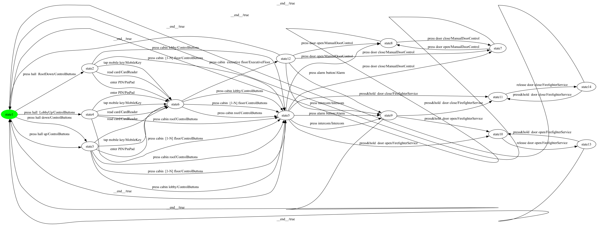
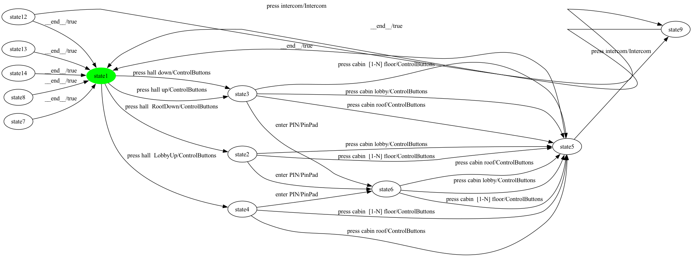
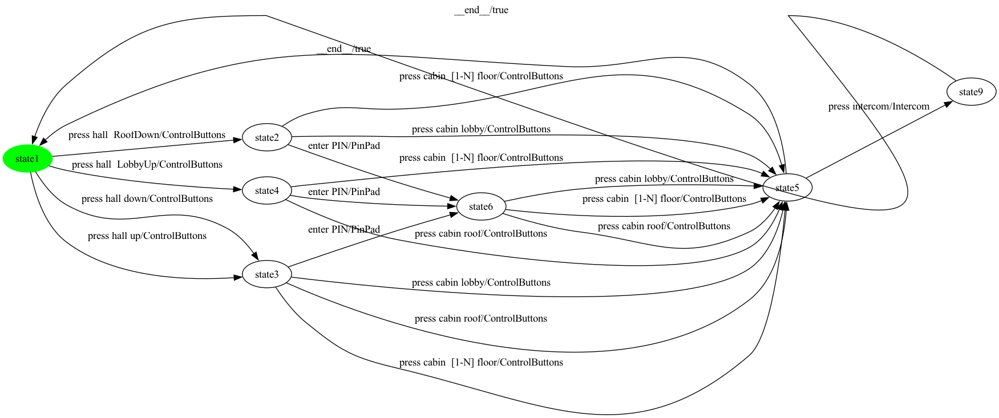

# Full Pipeline Walkthrough — Elevator (product 7)

Four-stage rendering of the full conversion-to-balancing pipeline on one hand-picked product of Elevator. Each step shows the FTS as a PNG and a one-paragraph summary of what changed.

**Chosen configuration:** selected = {ControlButtons, Intercom, PinPad}

## Step 1 — SPL-level FTS (canonical input)

**Size:** 14 states, 49 transitions

Bisimulation-minimized FTS produced by MxeToFtsConverter. Feature expressions are retained on every transition for traceability. Synthetic '__end__' transitions (back-to-INIT for mixed-terminal ESG vertices) appear here if the source ESG has any '['-only-edge vertices.

## Step 2 — Projected FTS (after applying the configuration)

**Size:** 12 states, 26 transitions

FExpressionPreservingProjection keeps transitions whose feature expression evaluates to true under the configuration. 23 transition(s) dropped relative to step 1. Resulting graph has 6 strongly-connected component(s). If that count is 1 the next step is a no-op; otherwise it removes the parts of the graph the initial state cannot reach AND return from.

## Step 3 — Strongly-connected projected FTS

**Size:** 7 states, 20 transitions

InitialSccFilter keeps only the SCC containing the initial state and drops every other state plus the transitions touching them. 5 state(s) and 6 transition(s) removed. Result is strongly connected by construction — every state can reach every other state.

## Step 4 — Strongly-connected + balanced FTS

**Size:** 7 states, 34 transitions

EulerianBalancer applies a directed Chinese Postman strategy: for each pair of imbalanced states it finds a shortest path of real transitions and doubles each transition along it (action label is suffixed with '__dup__N'). The cycle thus stays contiguous and every traversal is a real action. 14 doubled transition(s) inserted (dashed-red in the image); 0 direct synthetic fallback edge(s) when no real path existed; 20 original transition(s) preserved; 7 total state(s). The doubled edges are filtered from coverage measurement (their action carries the '__dup__' marker), but they DO appear in the test case as another occurrence of the underlying real action — a property useful for mutation detection.

