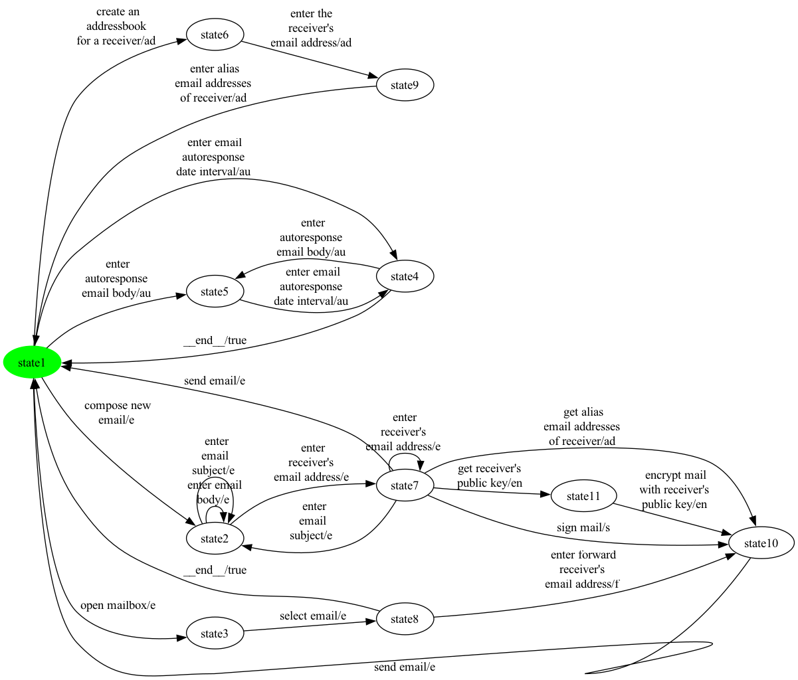
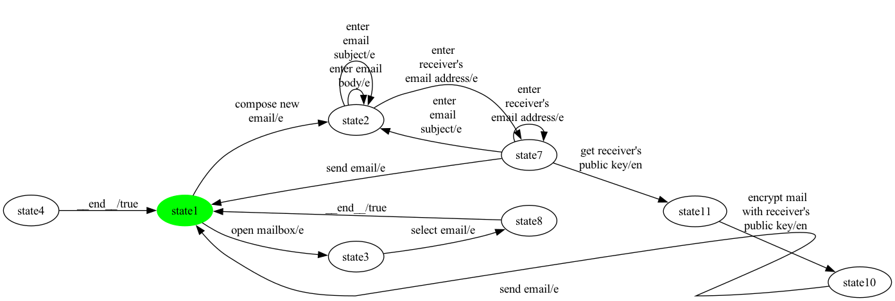
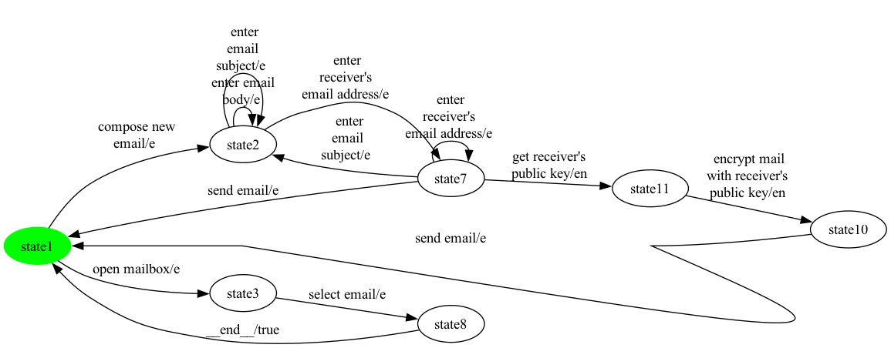

# Full Pipeline Walkthrough — eMail (product 7)

Four-stage rendering of the full conversion-to-balancing pipeline on one hand-picked product of eMail. Each step shows the FTS as a PNG and a one-paragraph summary of what changed.

**Chosen configuration:** selected = {e, en}

## Step 1 — SPL-level FTS (canonical input)

**Size:** 11 states, 24 transitions

Bisimulation-minimized FTS produced by MxeToFtsConverter. Feature expressions are retained on every transition for traceability. Synthetic '__end__' transitions (back-to-INIT for mixed-terminal ESG vertices) appear here if the source ESG has any '['-only-edge vertices.

## Step 2 — Projected FTS (after applying the configuration)

**Size:** 8 states, 14 transitions

FExpressionPreservingProjection keeps transitions whose feature expression evaluates to true under the configuration. 10 transition(s) dropped relative to step 1. Resulting graph has 2 strongly-connected component(s). If that count is 1 the next step is a no-op; otherwise it removes the parts of the graph the initial state cannot reach AND return from.

## Step 3 — Strongly-connected projected FTS

**Size:** 7 states, 13 transitions

InitialSccFilter keeps only the SCC containing the initial state and drops every other state plus the transitions touching them. 1 state(s) and 1 transition(s) removed. Result is strongly connected by construction — every state can reach every other state.

## Step 4 — Strongly-connected + balanced FTS

**Size:** 7 states, 15 transitions

EulerianBalancer adds 2 synthetic '__balance__N' transitions so every state has in-degree = out-degree, the second precondition for Hierholzer's Euler-cycle algorithm. 13 real transition(s) preserved, 2 synthetic balancing transition(s) inserted; 7 total state(s).

