# Per-Product All-States Coverage — Elevator

## How the all-states test case is built

Given an SPL-level FTS plus one product configuration, [`StateCoverageGenerator.generate(fts, config, id)`](../../../vibes-testgeneration/src/main/java/be/vibes/testgeneration/coverage/StateCoverageGenerator.java) runs five steps. The algorithm is the analog of the ESG-Fx-side `EulerCycleGeneratorForEventCoverage` (event coverage on an ESG = state coverage on its FTS conversion); the structural objective is different from all-transitions, so the pipeline diverges after the SCC repair.

**Step 1 — Project onto the product.** Same as all-transitions: `FExpressionPreservingProjection.project(fts, config)` keeps every transition whose feature expression evaluates true under the product, then a forward BFS drops states unreachable from the initial state.

**Step 2 — Repair strong connectivity.** Same as all-transitions: `InitialSccFilter.keepInitialScc(projected)` keeps the SCC containing the initial state. State coverage requires only that every state in the repaired FTS be reachable AND able to return to wherever the walk decides to keep going — strong connectivity guarantees both at once.

**Step 3 — Greedy walk.** Starting at the initial state, at every step pick any outgoing transition whose target has not yet been visited. Implementation in [`pickUnvisitedNeighbour(...)`](../../../vibes-testgeneration/src/main/java/be/vibes/testgeneration/coverage/StateCoverageGenerator.java) — first match wins; iteration order is the FTS's natural outgoing-transition order, which is stable across runs given the deterministic VIBeS state-name ordering. Walk extends, every newly-visited target enters the `visited` set.

**Step 4 — BFS reroute when stuck.** When `pickUnvisitedNeighbour` returns `null` (every outgoing of the current state goes to a state we've already visited), the walk is stuck. [`ShortestPaths.shortestPathToAny(fts, current, remaining)`](../../../vibes-testgeneration/src/main/java/be/vibes/testgeneration/graph/ShortestPaths.java) runs a BFS from the current state and returns the path to the **nearest** state in the still-uncovered set. The path is appended to the walk; every state along the path is marked visited (the reroute incidentally covers intermediates too). Strong connectivity from step 2 guarantees that a path always exists.

**Step 5 — Repeat until covered, then wrap.** Steps 3+4 alternate until every state in the repaired FTS is in `visited`; the final transition list is enqueued into `be.vibes.ts.TestCase`. For display the cycle is split at initial-state returns via `TestCaseSplitter.splitAtInitialReturns(...)`. Synthetics (`__end__`) are hidden in the rendered sequence; `__dup__` and `__balance__` cannot occur (the state-coverage pipeline performs no balancing).

**Why BFS over Dijkstra.** All transitions are unit-weight (no edge cost distinguishes them at this layer), so BFS yields the optimal shortest path without paying for a priority queue. If we ever want to bias the walk (e.g. prefer paths that exercise more `__dup__` candidates, or paths that discharge dangerous feature expressions first), we'd switch to weighted Dijkstra — the API in `ShortestPaths` is structured to accept a weight function in a follow-up.

**Coverage claim.** Step 5 terminates iff every state is visited, and step 5 always terminates because (a) strong connectivity from step 2 guarantees BFS finds a path to any uncovered state, and (b) every iteration removes at least one state from `remaining`. State coverage is therefore **100% on the repaired FTS** by construction.

**Why this is generally shorter than all-transitions.** A walk that visits every state is bounded below by `|V| - 1` transitions (visit-once tree); an Euler cycle visiting every transition is bounded below by `|E|`. In real FTSs `|E|` is typically 1.5–4× `|V|`, so state-coverage walks are shorter — but they leave many edges un-exercised, weakening mutation detection. That trade-off is what RQ3 quantifies.

---

## Products

Each product below shows the repaired FTS with the state-coverage walk overlaid. **Legend:**

- **darkblue solid bold** — real transition picked by the **greedy** phase (target was unvisited at selection time);
- **darkorange solid bold** — real transition picked as part of a **BFS-reroute** shortest path (the greedy phase was stuck at a state with no unvisited neighbour);
- **red dashed bold** — synthetic transition (`__end__`) that the walk happens to traverse; same convention as in the all-transitions report;
- **light grey** — real transition not in the walk; **faint dashed red** — synthetic transition not in the walk. All transitions shown are present in the projected FTS exactly as drawn — none are synthesized for this report; the colour only encodes which phase of the algorithm picked them.

Test cases below are obtained by splitting the walk at every visit to the initial state — `__end__` and `__balance__N` are hidden from the displayed action sequence, `__dup__N` is stripped (the latter two never appear in a state-coverage walk since no balancing is performed).

### Product 1

**Selected features:** selected = {ControlButtons, ExecutiveFloor, Intercom, PinPad}

**Repaired FTS:** 8 states, 23 transitions (20 real / 3 `__end__`).

**State-coverage walk:** 10 transition step(s) — 4 unique greedy edge(s), 3 BFS-reroute segment(s). State coverage on the repaired FTS: **8/8 = 100.0%**.

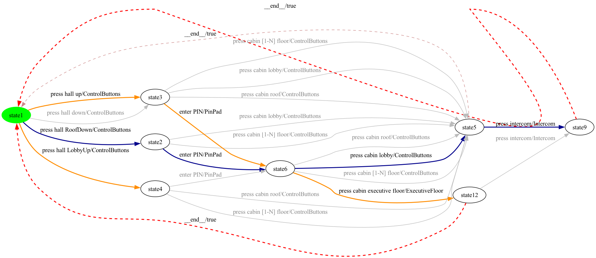

**Generated test cases** (3 trip(s) from initial back to initial, hidden synthetics removed):

- **test case 1**: `press hall RoofDown -> enter PIN -> press cabin lobby -> press intercom`
- **test case 2**: `press hall up -> enter PIN -> press cabin executive floor`
- **test case 3**: `press hall LobbyUp`

### Product 2

**Selected features:** selected = {Alarm, ControlButtons, MobileKey}

**Repaired FTS:** 7 states, 20 transitions (18 real / 2 `__end__`).

**State-coverage walk:** 9 transition step(s) — 4 unique greedy edge(s), 2 BFS-reroute segment(s). State coverage on the repaired FTS: **7/7 = 100.0%**.

**Generated test cases** (3 trip(s) from initial back to initial, hidden synthetics removed):

- **test case 1**: `press hall RoofDown -> press cabin lobby -> press alarm button`
- **test case 2**: `press hall up -> tap mobile key -> press cabin lobby`
- **test case 3**: `press hall LobbyUp`

### Product 3

**Selected features:** selected = {Alarm, CardReader, ControlButtons, ExecutiveFloor}

**Repaired FTS:** 8 states, 23 transitions (20 real / 3 `__end__`).

**State-coverage walk:** 9 transition step(s) — 5 unique greedy edge(s), 2 BFS-reroute segment(s). State coverage on the repaired FTS: **8/8 = 100.0%**.

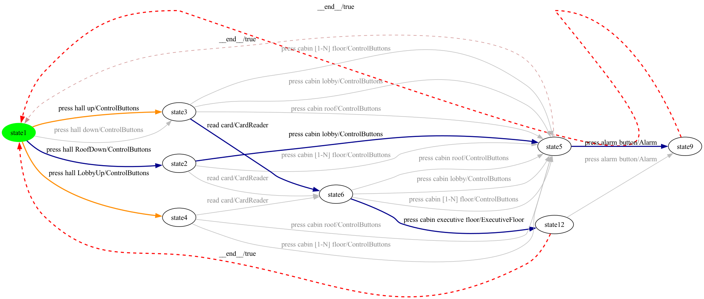

**Generated test cases** (3 trip(s) from initial back to initial, hidden synthetics removed):

- **test case 1**: `press hall RoofDown -> press cabin lobby -> press alarm button`
- **test case 2**: `press hall up -> read card -> press cabin executive floor`
- **test case 3**: `press hall LobbyUp`

### Product 4

**Selected features:** selected = {ControlButtons, Intercom, ManualDoorControl, MobileKey}

**Repaired FTS:** 9 states, 26 transitions (22 real / 4 `__end__`).

**State-coverage walk:** 11 transition step(s) — 5 unique greedy edge(s), 3 BFS-reroute segment(s). State coverage on the repaired FTS: **9/9 = 100.0%**.

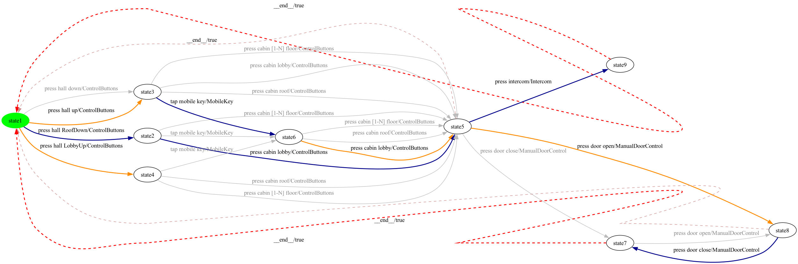

**Generated test cases** (3 trip(s) from initial back to initial, hidden synthetics removed):

- **test case 1**: `press hall RoofDown -> press cabin lobby -> press intercom`
- **test case 2**: `press hall up -> tap mobile key -> press cabin lobby -> press door open -> press door close`
- **test case 3**: `press hall LobbyUp`

### Product 5

**Selected features:** selected = {Alarm, ControlButtons, FirefighterService}

**Repaired FTS:** 10 states, 24 transitions (20 real / 4 `__end__`).

**State-coverage walk:** 12 transition step(s) — 6 unique greedy edge(s), 3 BFS-reroute segment(s). State coverage on the repaired FTS: **10/10 = 100.0%**.

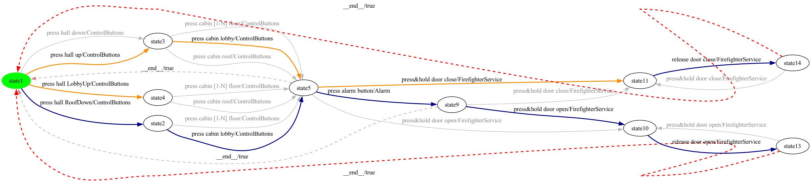

**Generated test cases** (3 trip(s) from initial back to initial, hidden synthetics removed):

- **test case 1**: `press hall RoofDown -> press cabin lobby -> press alarm button -> press&hold door open -> release door open`
- **test case 2**: `press hall up -> press cabin lobby -> press&hold door close -> release door close`
- **test case 3**: `press hall LobbyUp`

### Product 6

**Selected features:** selected = {CardReader, ControlButtons, Intercom, ManualDoorControl}

**Repaired FTS:** 9 states, 26 transitions (22 real / 4 `__end__`).

**State-coverage walk:** 11 transition step(s) — 5 unique greedy edge(s), 3 BFS-reroute segment(s). State coverage on the repaired FTS: **9/9 = 100.0%**.

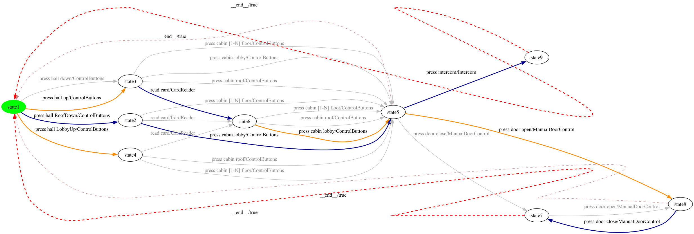

**Generated test cases** (3 trip(s) from initial back to initial, hidden synthetics removed):

- **test case 1**: `press hall RoofDown -> press cabin lobby -> press intercom`
- **test case 2**: `press hall up -> read card -> press cabin lobby -> press door open -> press door close`
- **test case 3**: `press hall LobbyUp`

### Product 7

**Selected features:** selected = {Alarm, ControlButtons, ExecutiveFloor, Intercom, MobileKey}

**Repaired FTS:** 8 states, 25 transitions (22 real / 3 `__end__`).

**State-coverage walk:** 9 transition step(s) — 5 unique greedy edge(s), 2 BFS-reroute segment(s). State coverage on the repaired FTS: **8/8 = 100.0%**.

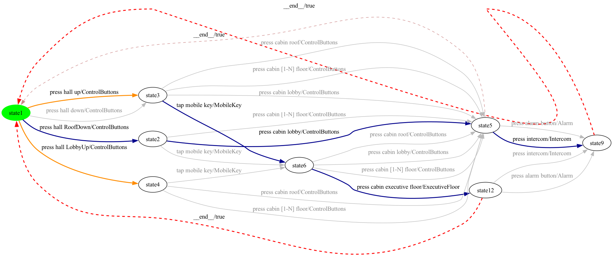

**Generated test cases** (3 trip(s) from initial back to initial, hidden synthetics removed):

- **test case 1**: `press hall RoofDown -> press cabin lobby -> press intercom`
- **test case 2**: `press hall up -> tap mobile key -> press cabin executive floor`
- **test case 3**: `press hall LobbyUp`

### Product 8

**Selected features:** selected = {Alarm, ControlButtons, ExecutiveFloor, ManualDoorControl, PinPad}

**Repaired FTS:** 10 states, 31 transitions (26 real / 5 `__end__`).

**State-coverage walk:** 13 transition step(s) — 5 unique greedy edge(s), 4 BFS-reroute segment(s). State coverage on the repaired FTS: **10/10 = 100.0%**.

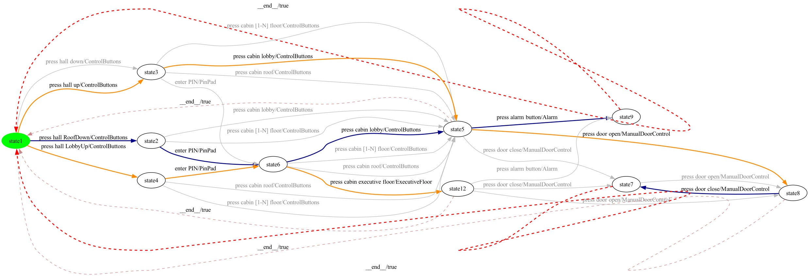

**Generated test cases** (3 trip(s) from initial back to initial, hidden synthetics removed):

- **test case 1**: `press hall RoofDown -> enter PIN -> press cabin lobby -> press alarm button`
- **test case 2**: `press hall up -> press cabin lobby -> press door open -> press door close`
- **test case 3**: `press hall LobbyUp -> enter PIN -> press cabin executive floor`

### Product 9

**Selected features:** selected = {ControlButtons, ExecutiveFloor, Intercom, ManualDoorControl, PinPad}

**Repaired FTS:** 10 states, 31 transitions (26 real / 5 `__end__`).

**State-coverage walk:** 13 transition step(s) — 5 unique greedy edge(s), 4 BFS-reroute segment(s). State coverage on the repaired FTS: **10/10 = 100.0%**.

**Generated test cases** (3 trip(s) from initial back to initial, hidden synthetics removed):

- **test case 1**: `press hall RoofDown -> enter PIN -> press cabin lobby -> press intercom`
- **test case 2**: `press hall up -> press cabin lobby -> press door open -> press door close`
- **test case 3**: `press hall LobbyUp -> enter PIN -> press cabin executive floor`

### Product 10

**Selected features:** selected = {ControlButtons, FirefighterService, Intercom}

**Repaired FTS:** 10 states, 24 transitions (20 real / 4 `__end__`).

**State-coverage walk:** 12 transition step(s) — 6 unique greedy edge(s), 3 BFS-reroute segment(s). State coverage on the repaired FTS: **10/10 = 100.0%**.

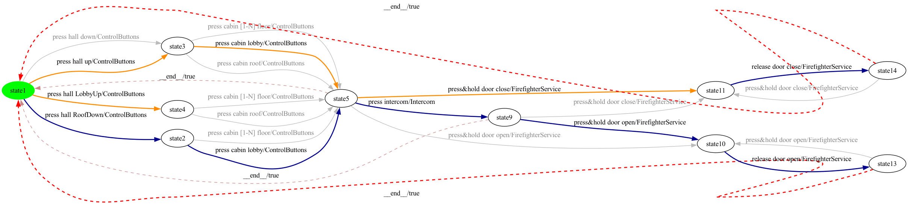

**Generated test cases** (3 trip(s) from initial back to initial, hidden synthetics removed):

- **test case 1**: `press hall RoofDown -> press cabin lobby -> press intercom -> press&hold door open -> release door open`
- **test case 2**: `press hall up -> press cabin lobby -> press&hold door close -> release door close`
- **test case 3**: `press hall LobbyUp`

### Product 11

**Selected features:** selected = {Alarm, ControlButtons, FirefighterService, Intercom, ManualDoorControl}

**Repaired FTS:** 12 states, 31 transitions (25 real / 6 `__end__`).

**State-coverage walk:** 15 transition step(s) — 7 unique greedy edge(s), 4 BFS-reroute segment(s). State coverage on the repaired FTS: **12/12 = 100.0%**.

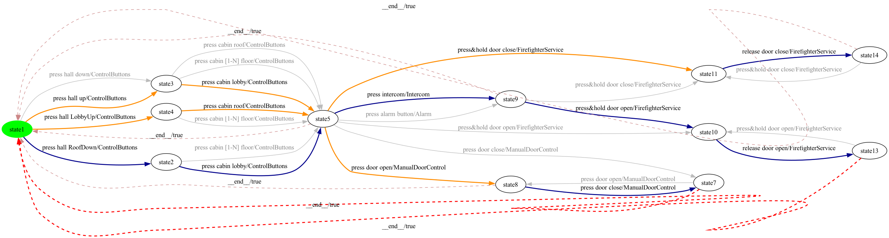

**Generated test cases** (3 trip(s) from initial back to initial, hidden synthetics removed):

- **test case 1**: `press hall RoofDown -> press cabin lobby -> press intercom -> press&hold door open -> release door open`
- **test case 2**: `press hall up -> press cabin lobby -> press door open -> press door close`
- **test case 3**: `press hall LobbyUp -> press cabin roof -> press&hold door close -> release door close`

### Product 12

**Selected features:** selected = {Alarm, ControlButtons, ExecutiveFloor, PinPad}

**Repaired FTS:** 8 states, 23 transitions (20 real / 3 `__end__`).

**State-coverage walk:** 10 transition step(s) — 4 unique greedy edge(s), 3 BFS-reroute segment(s). State coverage on the repaired FTS: **8/8 = 100.0%**.

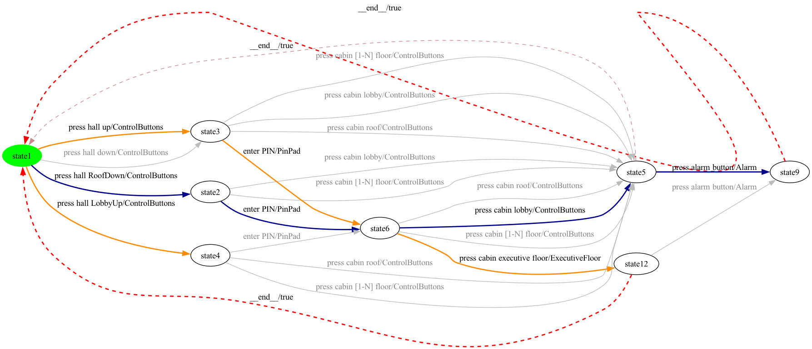

**Generated test cases** (3 trip(s) from initial back to initial, hidden synthetics removed):

- **test case 1**: `press hall RoofDown -> enter PIN -> press cabin lobby -> press alarm button`
- **test case 2**: `press hall up -> enter PIN -> press cabin executive floor`
- **test case 3**: `press hall LobbyUp`

### Product 13

**Selected features:** selected = {Alarm, ControlButtons, FirefighterService, ManualDoorControl}

**Repaired FTS:** 12 states, 30 transitions (24 real / 6 `__end__`).

**State-coverage walk:** 15 transition step(s) — 7 unique greedy edge(s), 4 BFS-reroute segment(s). State coverage on the repaired FTS: **12/12 = 100.0%**.

**Generated test cases** (3 trip(s) from initial back to initial, hidden synthetics removed):

- **test case 1**: `press hall RoofDown -> press cabin lobby -> press alarm button -> press&hold door open -> release door open`
- **test case 2**: `press hall up -> press cabin lobby -> press door open -> press door close`
- **test case 3**: `press hall LobbyUp -> press cabin roof -> press&hold door close -> release door close`

### Product 14

**Selected features:** selected = {Alarm, CardReader, ControlButtons, ExecutiveFloor, Intercom}

**Repaired FTS:** 8 states, 25 transitions (22 real / 3 `__end__`).

**State-coverage walk:** 9 transition step(s) — 5 unique greedy edge(s), 2 BFS-reroute segment(s). State coverage on the repaired FTS: **8/8 = 100.0%**.

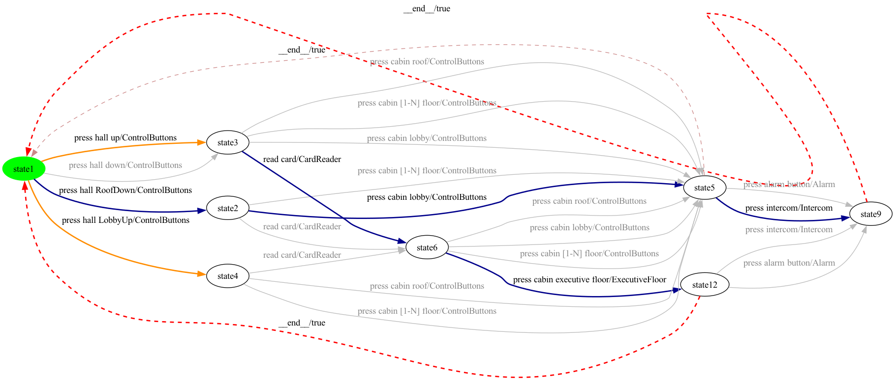

**Generated test cases** (3 trip(s) from initial back to initial, hidden synthetics removed):

- **test case 1**: `press hall RoofDown -> press cabin lobby -> press intercom`
- **test case 2**: `press hall up -> read card -> press cabin executive floor`
- **test case 3**: `press hall LobbyUp`

### Product 15

**Selected features:** selected = {ControlButtons, FirefighterService, Intercom, ManualDoorControl}

**Repaired FTS:** 12 states, 30 transitions (24 real / 6 `__end__`).

**State-coverage walk:** 15 transition step(s) — 7 unique greedy edge(s), 4 BFS-reroute segment(s). State coverage on the repaired FTS: **12/12 = 100.0%**.

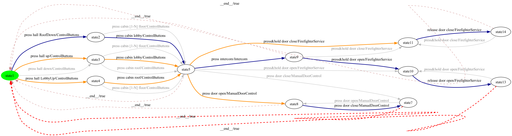

**Generated test cases** (3 trip(s) from initial back to initial, hidden synthetics removed):

- **test case 1**: `press hall RoofDown -> press cabin lobby -> press intercom -> press&hold door open -> release door open`
- **test case 2**: `press hall up -> press cabin lobby -> press door open -> press door close`
- **test case 3**: `press hall LobbyUp -> press cabin roof -> press&hold door close -> release door close`

### Product 16

**Selected features:** selected = {Alarm, CardReader, ControlButtons}

**Repaired FTS:** 7 states, 20 transitions (18 real / 2 `__end__`).

**State-coverage walk:** 9 transition step(s) — 4 unique greedy edge(s), 2 BFS-reroute segment(s). State coverage on the repaired FTS: **7/7 = 100.0%**.

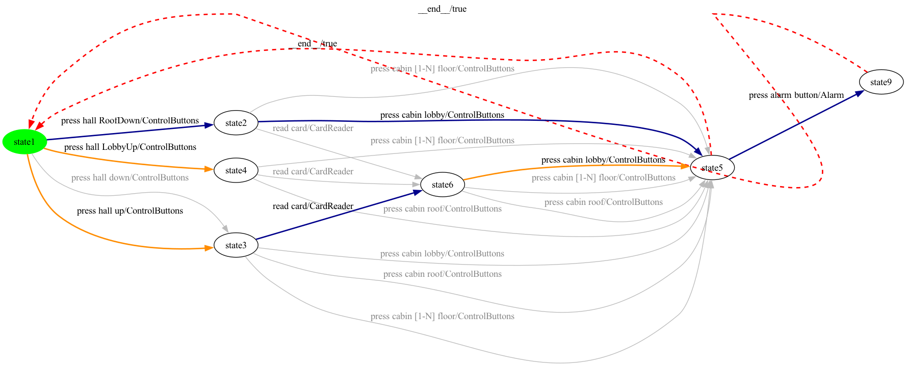

**Generated test cases** (3 trip(s) from initial back to initial, hidden synthetics removed):

- **test case 1**: `press hall RoofDown -> press cabin lobby -> press alarm button`
- **test case 2**: `press hall up -> read card -> press cabin lobby`
- **test case 3**: `press hall LobbyUp`

### Product 17

**Selected features:** selected = {Alarm, CardReader, ControlButtons, Intercom}

**Repaired FTS:** 7 states, 21 transitions (19 real / 2 `__end__`).

**State-coverage walk:** 9 transition step(s) — 4 unique greedy edge(s), 2 BFS-reroute segment(s). State coverage on the repaired FTS: **7/7 = 100.0%**.

**Generated test cases** (3 trip(s) from initial back to initial, hidden synthetics removed):

- **test case 1**: `press hall RoofDown -> press cabin lobby -> press intercom`
- **test case 2**: `press hall up -> read card -> press cabin lobby`
- **test case 3**: `press hall LobbyUp`

### Product 18

**Selected features:** selected = {Alarm, ControlButtons, ExecutiveFloor, MobileKey}

**Repaired FTS:** 8 states, 23 transitions (20 real / 3 `__end__`).

**State-coverage walk:** 9 transition step(s) — 5 unique greedy edge(s), 2 BFS-reroute segment(s). State coverage on the repaired FTS: **8/8 = 100.0%**.

**Generated test cases** (3 trip(s) from initial back to initial, hidden synthetics removed):

- **test case 1**: `press hall RoofDown -> press cabin lobby -> press alarm button`
- **test case 2**: `press hall up -> tap mobile key -> press cabin executive floor`
- **test case 3**: `press hall LobbyUp`

### Product 19

**Selected features:** selected = {Alarm, ControlButtons, ManualDoorControl, MobileKey}

**Repaired FTS:** 9 states, 26 transitions (22 real / 4 `__end__`).

**State-coverage walk:** 11 transition step(s) — 5 unique greedy edge(s), 3 BFS-reroute segment(s). State coverage on the repaired FTS: **9/9 = 100.0%**.

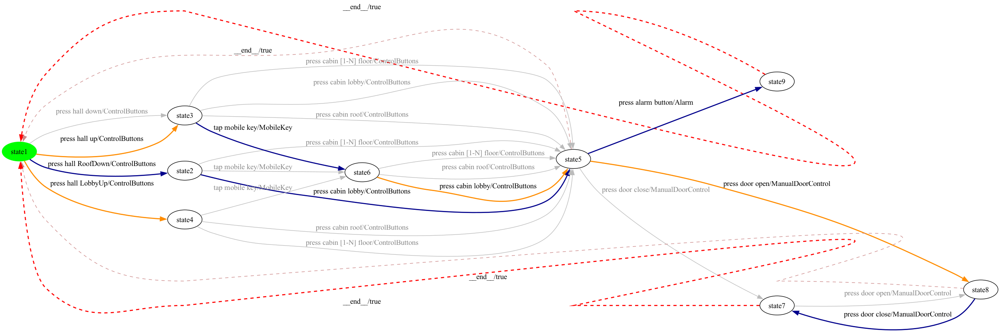

**Generated test cases** (3 trip(s) from initial back to initial, hidden synthetics removed):

- **test case 1**: `press hall RoofDown -> press cabin lobby -> press alarm button`
- **test case 2**: `press hall up -> tap mobile key -> press cabin lobby -> press door open -> press door close`
- **test case 3**: `press hall LobbyUp`

### Product 20

**Selected features:** selected = {Alarm, ControlButtons, ExecutiveFloor, ManualDoorControl, MobileKey}

**Repaired FTS:** 10 states, 31 transitions (26 real / 5 `__end__`).

**State-coverage walk:** 11 transition step(s) — 7 unique greedy edge(s), 2 BFS-reroute segment(s). State coverage on the repaired FTS: **10/10 = 100.0%**.

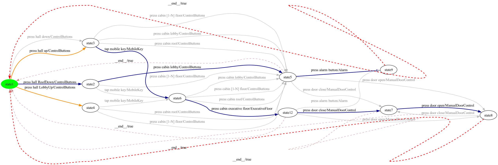

**Generated test cases** (3 trip(s) from initial back to initial, hidden synthetics removed):

- **test case 1**: `press hall RoofDown -> press cabin lobby -> press alarm button`
- **test case 2**: `press hall up -> tap mobile key -> press cabin executive floor -> press door close -> press door open`
- **test case 3**: `press hall LobbyUp`

### Product 21

**Selected features:** selected = {CardReader, ControlButtons, Intercom}

**Repaired FTS:** 7 states, 20 transitions (18 real / 2 `__end__`).

**State-coverage walk:** 9 transition step(s) — 4 unique greedy edge(s), 2 BFS-reroute segment(s). State coverage on the repaired FTS: **7/7 = 100.0%**.

**Generated test cases** (3 trip(s) from initial back to initial, hidden synthetics removed):

- **test case 1**: `press hall RoofDown -> press cabin lobby -> press intercom`
- **test case 2**: `press hall up -> read card -> press cabin lobby`
- **test case 3**: `press hall LobbyUp`

### Product 22

**Selected features:** selected = {Alarm, ControlButtons, ExecutiveFloor, Intercom, PinPad}

**Repaired FTS:** 8 states, 25 transitions (22 real / 3 `__end__`).

**State-coverage walk:** 10 transition step(s) — 4 unique greedy edge(s), 3 BFS-reroute segment(s). State coverage on the repaired FTS: **8/8 = 100.0%**.

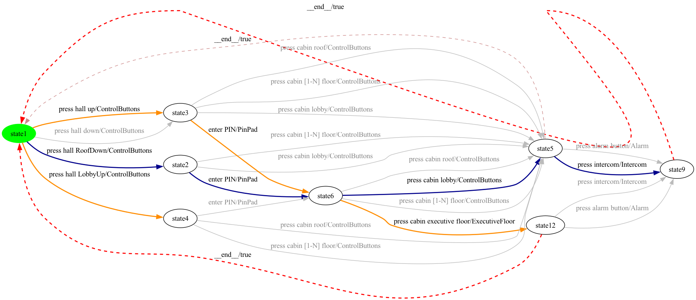

**Generated test cases** (3 trip(s) from initial back to initial, hidden synthetics removed):

- **test case 1**: `press hall RoofDown -> enter PIN -> press cabin lobby -> press intercom`
- **test case 2**: `press hall up -> enter PIN -> press cabin executive floor`
- **test case 3**: `press hall LobbyUp`

### Product 23

**Selected features:** selected = {Alarm, CardReader, ControlButtons, ExecutiveFloor, Intercom, ManualDoorControl}

**Repaired FTS:** 10 states, 33 transitions (28 real / 5 `__end__`).

**State-coverage walk:** 11 transition step(s) — 7 unique greedy edge(s), 2 BFS-reroute segment(s). State coverage on the repaired FTS: **10/10 = 100.0%**.

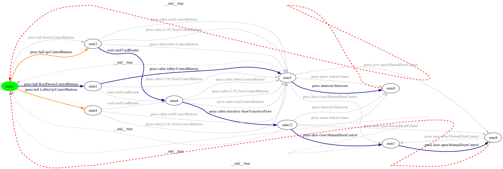

**Generated test cases** (3 trip(s) from initial back to initial, hidden synthetics removed):

- **test case 1**: `press hall RoofDown -> press cabin lobby -> press intercom`
- **test case 2**: `press hall up -> read card -> press cabin executive floor -> press door close -> press door open`
- **test case 3**: `press hall LobbyUp`

### Product 24

**Selected features:** selected = {Alarm, ControlButtons, ExecutiveFloor, Intercom, ManualDoorControl, MobileKey}

**Repaired FTS:** 10 states, 33 transitions (28 real / 5 `__end__`).

**State-coverage walk:** 11 transition step(s) — 7 unique greedy edge(s), 2 BFS-reroute segment(s). State coverage on the repaired FTS: **10/10 = 100.0%**.

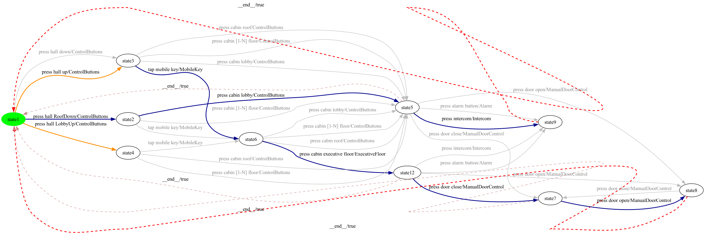

**Generated test cases** (3 trip(s) from initial back to initial, hidden synthetics removed):

- **test case 1**: `press hall RoofDown -> press cabin lobby -> press intercom`
- **test case 2**: `press hall up -> tap mobile key -> press cabin executive floor -> press door close -> press door open`
- **test case 3**: `press hall LobbyUp`

### Product 25

**Selected features:** selected = {Alarm, CardReader, ControlButtons, Intercom, ManualDoorControl}

**Repaired FTS:** 9 states, 27 transitions (23 real / 4 `__end__`).

**State-coverage walk:** 11 transition step(s) — 5 unique greedy edge(s), 3 BFS-reroute segment(s). State coverage on the repaired FTS: **9/9 = 100.0%**.

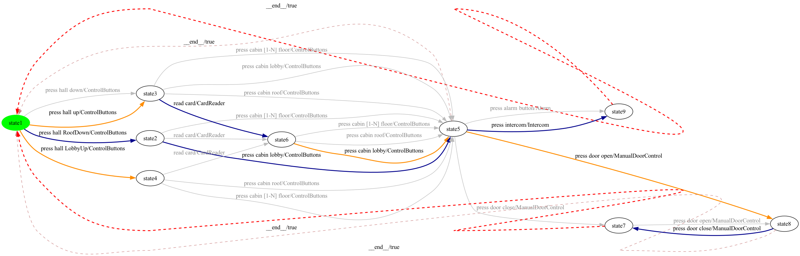

**Generated test cases** (3 trip(s) from initial back to initial, hidden synthetics removed):

- **test case 1**: `press hall RoofDown -> press cabin lobby -> press intercom`
- **test case 2**: `press hall up -> read card -> press cabin lobby -> press door open -> press door close`
- **test case 3**: `press hall LobbyUp`

### Product 26

**Selected features:** selected = {CardReader, ControlButtons, ExecutiveFloor, Intercom, ManualDoorControl}

**Repaired FTS:** 10 states, 31 transitions (26 real / 5 `__end__`).

**State-coverage walk:** 11 transition step(s) — 7 unique greedy edge(s), 2 BFS-reroute segment(s). State coverage on the repaired FTS: **10/10 = 100.0%**.

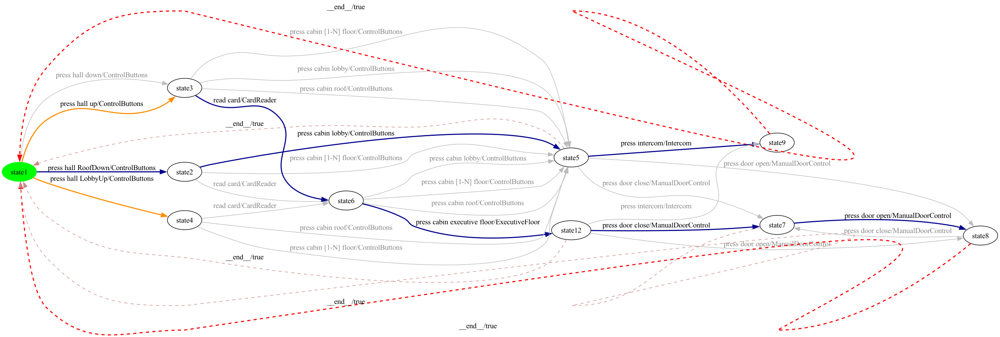

**Generated test cases** (3 trip(s) from initial back to initial, hidden synthetics removed):

- **test case 1**: `press hall RoofDown -> press cabin lobby -> press intercom`
- **test case 2**: `press hall up -> read card -> press cabin executive floor -> press door close -> press door open`
- **test case 3**: `press hall LobbyUp`

### Product 27

**Selected features:** selected = {Alarm, ControlButtons, Intercom, ManualDoorControl, MobileKey}

**Repaired FTS:** 9 states, 27 transitions (23 real / 4 `__end__`).

**State-coverage walk:** 11 transition step(s) — 5 unique greedy edge(s), 3 BFS-reroute segment(s). State coverage on the repaired FTS: **9/9 = 100.0%**.

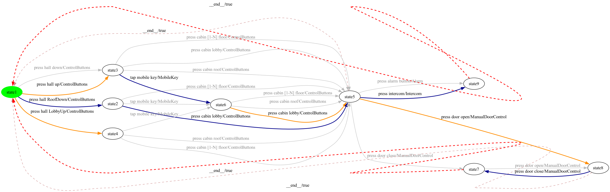

**Generated test cases** (3 trip(s) from initial back to initial, hidden synthetics removed):

- **test case 1**: `press hall RoofDown -> press cabin lobby -> press intercom`
- **test case 2**: `press hall up -> tap mobile key -> press cabin lobby -> press door open -> press door close`
- **test case 3**: `press hall LobbyUp`

### Product 28

**Selected features:** selected = {Alarm, ControlButtons, FirefighterService, Intercom}

**Repaired FTS:** 10 states, 25 transitions (21 real / 4 `__end__`).

**State-coverage walk:** 12 transition step(s) — 6 unique greedy edge(s), 3 BFS-reroute segment(s). State coverage on the repaired FTS: **10/10 = 100.0%**.

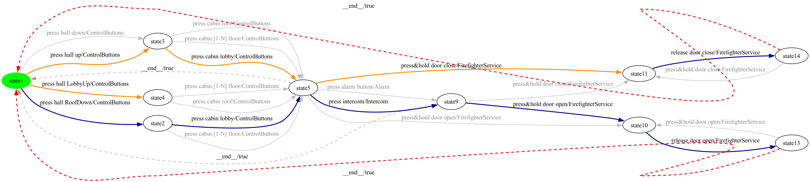

**Generated test cases** (3 trip(s) from initial back to initial, hidden synthetics removed):

- **test case 1**: `press hall RoofDown -> press cabin lobby -> press intercom -> press&hold door open -> release door open`
- **test case 2**: `press hall up -> press cabin lobby -> press&hold door close -> release door close`
- **test case 3**: `press hall LobbyUp`

### Product 29

**Selected features:** selected = {CardReader, ControlButtons, ExecutiveFloor, Intercom}

**Repaired FTS:** 8 states, 23 transitions (20 real / 3 `__end__`).

**State-coverage walk:** 9 transition step(s) — 5 unique greedy edge(s), 2 BFS-reroute segment(s). State coverage on the repaired FTS: **8/8 = 100.0%**.

**Generated test cases** (3 trip(s) from initial back to initial, hidden synthetics removed):

- **test case 1**: `press hall RoofDown -> press cabin lobby -> press intercom`
- **test case 2**: `press hall up -> read card -> press cabin executive floor`
- **test case 3**: `press hall LobbyUp`

### Product 30

**Selected features:** selected = {ControlButtons, Intercom, MobileKey}

**Repaired FTS:** 7 states, 20 transitions (18 real / 2 `__end__`).

**State-coverage walk:** 9 transition step(s) — 4 unique greedy edge(s), 2 BFS-reroute segment(s). State coverage on the repaired FTS: **7/7 = 100.0%**.

**Generated test cases** (3 trip(s) from initial back to initial, hidden synthetics removed):

- **test case 1**: `press hall RoofDown -> press cabin lobby -> press intercom`
- **test case 2**: `press hall up -> tap mobile key -> press cabin lobby`
- **test case 3**: `press hall LobbyUp`

### Product 31

**Selected features:** selected = {Alarm, CardReader, ControlButtons, ManualDoorControl}

**Repaired FTS:** 9 states, 26 transitions (22 real / 4 `__end__`).

**State-coverage walk:** 11 transition step(s) — 5 unique greedy edge(s), 3 BFS-reroute segment(s). State coverage on the repaired FTS: **9/9 = 100.0%**.

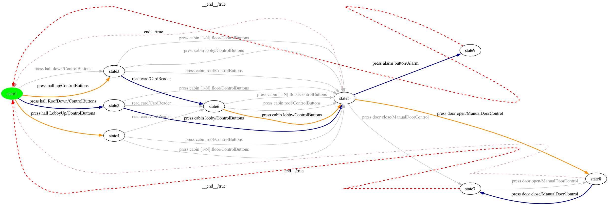

**Generated test cases** (3 trip(s) from initial back to initial, hidden synthetics removed):

- **test case 1**: `press hall RoofDown -> press cabin lobby -> press alarm button`
- **test case 2**: `press hall up -> read card -> press cabin lobby -> press door open -> press door close`
- **test case 3**: `press hall LobbyUp`

### Product 32

**Selected features:** selected = {ControlButtons, Intercom, ManualDoorControl, PinPad}

**Repaired FTS:** 9 states, 26 transitions (22 real / 4 `__end__`).

**State-coverage walk:** 11 transition step(s) — 5 unique greedy edge(s), 3 BFS-reroute segment(s). State coverage on the repaired FTS: **9/9 = 100.0%**.

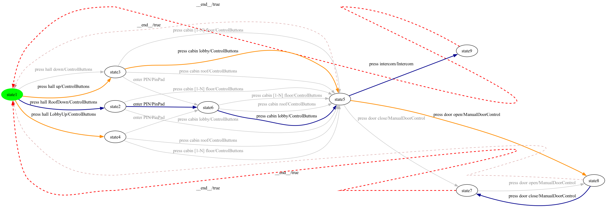

**Generated test cases** (3 trip(s) from initial back to initial, hidden synthetics removed):

- **test case 1**: `press hall RoofDown -> enter PIN -> press cabin lobby -> press intercom`
- **test case 2**: `press hall up -> press cabin lobby -> press door open -> press door close`
- **test case 3**: `press hall LobbyUp`

### Product 33

**Selected features:** selected = {ControlButtons, ExecutiveFloor, Intercom, ManualDoorControl, MobileKey}

**Repaired FTS:** 10 states, 31 transitions (26 real / 5 `__end__`).

**State-coverage walk:** 11 transition step(s) — 7 unique greedy edge(s), 2 BFS-reroute segment(s). State coverage on the repaired FTS: **10/10 = 100.0%**.

**Generated test cases** (3 trip(s) from initial back to initial, hidden synthetics removed):

- **test case 1**: `press hall RoofDown -> press cabin lobby -> press intercom`
- **test case 2**: `press hall up -> tap mobile key -> press cabin executive floor -> press door close -> press door open`
- **test case 3**: `press hall LobbyUp`

### Product 34

**Selected features:** selected = {Alarm, CardReader, ControlButtons, ExecutiveFloor, ManualDoorControl}

**Repaired FTS:** 10 states, 31 transitions (26 real / 5 `__end__`).

**State-coverage walk:** 11 transition step(s) — 7 unique greedy edge(s), 2 BFS-reroute segment(s). State coverage on the repaired FTS: **10/10 = 100.0%**.

**Generated test cases** (3 trip(s) from initial back to initial, hidden synthetics removed):

- **test case 1**: `press hall RoofDown -> press cabin lobby -> press alarm button`
- **test case 2**: `press hall up -> read card -> press cabin executive floor -> press door close -> press door open`
- **test case 3**: `press hall LobbyUp`

### Product 35

**Selected features:** selected = {Alarm, ControlButtons, Intercom, MobileKey}

**Repaired FTS:** 7 states, 21 transitions (19 real / 2 `__end__`).

**State-coverage walk:** 9 transition step(s) — 4 unique greedy edge(s), 2 BFS-reroute segment(s). State coverage on the repaired FTS: **7/7 = 100.0%**.

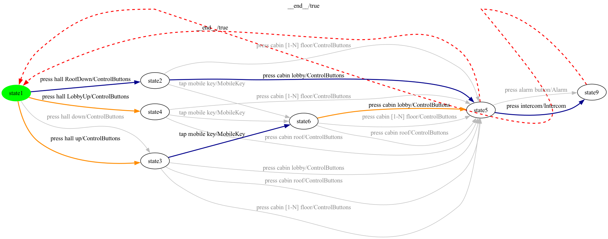

**Generated test cases** (3 trip(s) from initial back to initial, hidden synthetics removed):

- **test case 1**: `press hall RoofDown -> press cabin lobby -> press intercom`
- **test case 2**: `press hall up -> tap mobile key -> press cabin lobby`
- **test case 3**: `press hall LobbyUp`

### Product 36

**Selected features:** selected = {Alarm, ControlButtons, Intercom, PinPad}

**Repaired FTS:** 7 states, 21 transitions (19 real / 2 `__end__`).

**State-coverage walk:** 9 transition step(s) — 4 unique greedy edge(s), 2 BFS-reroute segment(s). State coverage on the repaired FTS: **7/7 = 100.0%**.

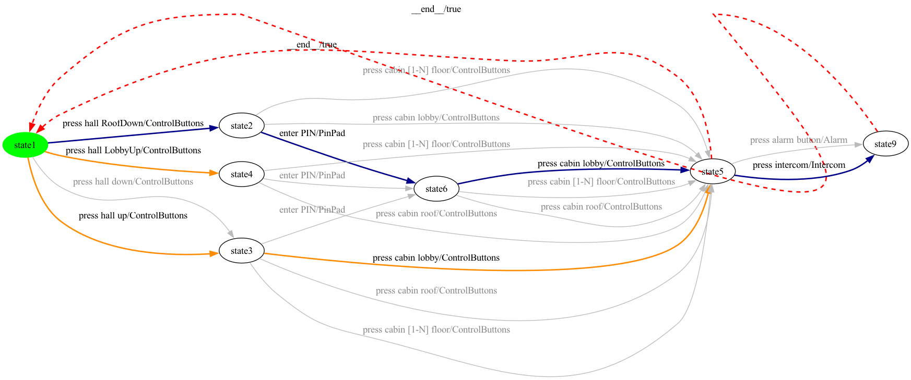

**Generated test cases** (3 trip(s) from initial back to initial, hidden synthetics removed):

- **test case 1**: `press hall RoofDown -> enter PIN -> press cabin lobby -> press intercom`
- **test case 2**: `press hall up -> press cabin lobby`
- **test case 3**: `press hall LobbyUp`

### Product 37

**Selected features:** selected = {ControlButtons, ExecutiveFloor, Intercom, MobileKey}

**Repaired FTS:** 8 states, 23 transitions (20 real / 3 `__end__`).

**State-coverage walk:** 9 transition step(s) — 5 unique greedy edge(s), 2 BFS-reroute segment(s). State coverage on the repaired FTS: **8/8 = 100.0%**.

**Generated test cases** (3 trip(s) from initial back to initial, hidden synthetics removed):

- **test case 1**: `press hall RoofDown -> press cabin lobby -> press intercom`
- **test case 2**: `press hall up -> tap mobile key -> press cabin executive floor`
- **test case 3**: `press hall LobbyUp`

### Product 38

**Selected features:** selected = {Alarm, ControlButtons, PinPad}

**Repaired FTS:** 7 states, 20 transitions (18 real / 2 `__end__`).

**State-coverage walk:** 9 transition step(s) — 4 unique greedy edge(s), 2 BFS-reroute segment(s). State coverage on the repaired FTS: **7/7 = 100.0%**.

**Generated test cases** (3 trip(s) from initial back to initial, hidden synthetics removed):

- **test case 1**: `press hall RoofDown -> enter PIN -> press cabin lobby -> press alarm button`
- **test case 2**: `press hall up -> press cabin lobby`
- **test case 3**: `press hall LobbyUp`

### Product 39

**Selected features:** selected = {ControlButtons, Intercom, PinPad}

**Repaired FTS:** 7 states, 20 transitions (18 real / 2 `__end__`).

**State-coverage walk:** 9 transition step(s) — 4 unique greedy edge(s), 2 BFS-reroute segment(s). State coverage on the repaired FTS: **7/7 = 100.0%**.

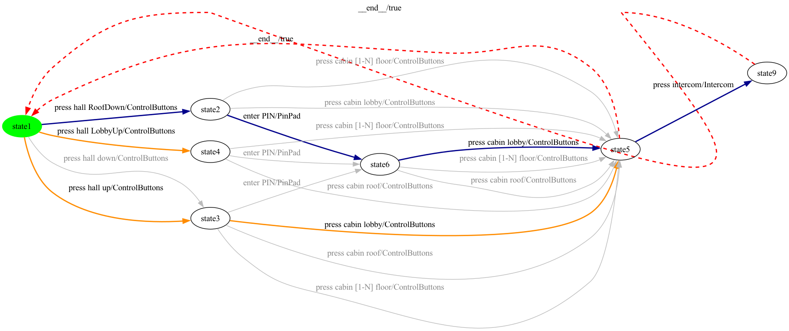

**Generated test cases** (3 trip(s) from initial back to initial, hidden synthetics removed):

- **test case 1**: `press hall RoofDown -> enter PIN -> press cabin lobby -> press intercom`
- **test case 2**: `press hall up -> press cabin lobby`
- **test case 3**: `press hall LobbyUp`

### Product 40

**Selected features:** selected = {Alarm, ControlButtons, ManualDoorControl, PinPad}

**Repaired FTS:** 9 states, 26 transitions (22 real / 4 `__end__`).

**State-coverage walk:** 11 transition step(s) — 5 unique greedy edge(s), 3 BFS-reroute segment(s). State coverage on the repaired FTS: **9/9 = 100.0%**.

**Generated test cases** (3 trip(s) from initial back to initial, hidden synthetics removed):

- **test case 1**: `press hall RoofDown -> enter PIN -> press cabin lobby -> press alarm button`
- **test case 2**: `press hall up -> press cabin lobby -> press door open -> press door close`
- **test case 3**: `press hall LobbyUp`

### Product 41

**Selected features:** selected = {Alarm, ControlButtons, ExecutiveFloor, Intercom, ManualDoorControl, PinPad}

**Repaired FTS:** 10 states, 33 transitions (28 real / 5 `__end__`).

**State-coverage walk:** 13 transition step(s) — 5 unique greedy edge(s), 4 BFS-reroute segment(s). State coverage on the repaired FTS: **10/10 = 100.0%**.

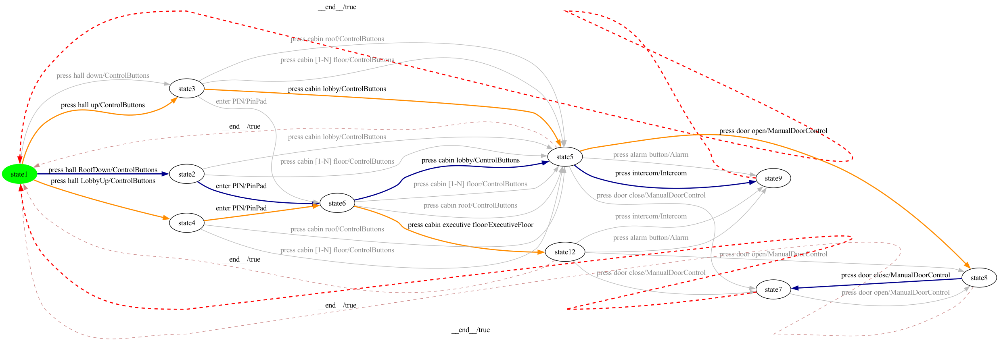

**Generated test cases** (3 trip(s) from initial back to initial, hidden synthetics removed):

- **test case 1**: `press hall RoofDown -> enter PIN -> press cabin lobby -> press intercom`
- **test case 2**: `press hall up -> press cabin lobby -> press door open -> press door close`
- **test case 3**: `press hall LobbyUp -> enter PIN -> press cabin executive floor`

### Product 42

**Selected features:** selected = {Alarm, ControlButtons, Intercom, ManualDoorControl, PinPad}

**Repaired FTS:** 9 states, 27 transitions (23 real / 4 `__end__`).

**State-coverage walk:** 11 transition step(s) — 5 unique greedy edge(s), 3 BFS-reroute segment(s). State coverage on the repaired FTS: **9/9 = 100.0%**.

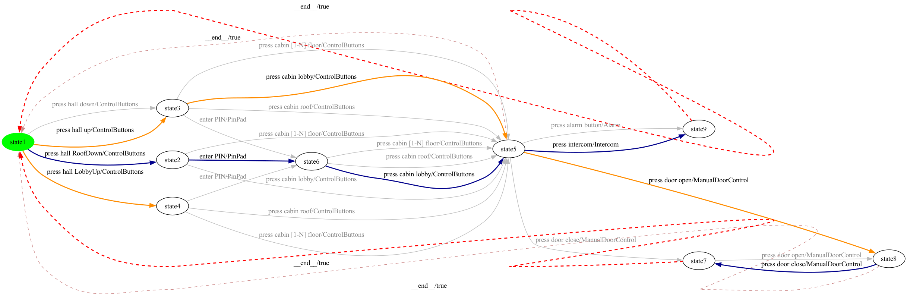

**Generated test cases** (3 trip(s) from initial back to initial, hidden synthetics removed):

- **test case 1**: `press hall RoofDown -> enter PIN -> press cabin lobby -> press intercom`
- **test case 2**: `press hall up -> press cabin lobby -> press door open -> press door close`
- **test case 3**: `press hall LobbyUp`

---

Total products: 42.
