# Per-Product All-States Coverage — eMail

## How the all-states test case is built

Given an SPL-level FTS plus one product configuration, [`StateCoverageGenerator.generate(fts, config, id)`](../../../vibes-testgeneration/src/main/java/be/vibes/testgeneration/coverage/StateCoverageGenerator.java) runs five steps. The algorithm is the analog of the ESG-Fx-side `EulerCycleGeneratorForEventCoverage` (event coverage on an ESG = state coverage on its FTS conversion); the structural objective is different from all-transitions, so the pipeline diverges after the SCC repair.

**Step 1 — Project onto the product.** Same as all-transitions: `FExpressionPreservingProjection.project(fts, config)` keeps every transition whose feature expression evaluates true under the product, then a forward BFS drops states unreachable from the initial state.

**Step 2 — Repair strong connectivity.** Same as all-transitions: `InitialSccFilter.keepInitialScc(projected)` keeps the SCC containing the initial state. State coverage requires only that every state in the repaired FTS be reachable AND able to return to wherever the walk decides to keep going — strong connectivity guarantees both at once.

**Step 3 — Greedy walk.** Starting at the initial state, at every step pick any outgoing transition whose target has not yet been visited. Implementation in [`pickUnvisitedNeighbour(...)`](../../../vibes-testgeneration/src/main/java/be/vibes/testgeneration/coverage/StateCoverageGenerator.java) — first match wins; iteration order is the FTS's natural outgoing-transition order, which is stable across runs given the deterministic VIBeS state-name ordering. Walk extends, every newly-visited target enters the `visited` set.

**Step 4 — BFS reroute when stuck.** When `pickUnvisitedNeighbour` returns `null` (every outgoing of the current state goes to a state we've already visited), the walk is stuck. [`ShortestPaths.shortestPathToAny(fts, current, remaining)`](../../../vibes-testgeneration/src/main/java/be/vibes/testgeneration/graph/ShortestPaths.java) runs a BFS from the current state and returns the path to the **nearest** state in the still-uncovered set. The path is appended to the walk; every state along the path is marked visited (the reroute incidentally covers intermediates too). Strong connectivity from step 2 guarantees that a path always exists.

**Step 5 — Repeat until covered, then wrap.** Steps 3+4 alternate until every state in the repaired FTS is in `visited`; the final transition list is enqueued into `be.vibes.ts.TestCase`. For display the cycle is split at initial-state returns via `TestCaseSplitter.splitAtInitialReturns(...)`. Synthetics (`__end__`) are hidden in the rendered sequence; `__dup__` and `__balance__` cannot occur (the state-coverage pipeline performs no balancing).

**Why BFS over Dijkstra.** All transitions are unit-weight (no edge cost distinguishes them at this layer), so BFS yields the optimal shortest path without paying for a priority queue. If we ever want to bias the walk (e.g. prefer paths that exercise more `__dup__` candidates, or paths that discharge dangerous feature expressions first), we'd switch to weighted Dijkstra — the API in `ShortestPaths` is structured to accept a weight function in a follow-up.

**Coverage claim.** Step 5 terminates iff every state is visited, and step 5 always terminates because (a) strong connectivity from step 2 guarantees BFS finds a path to any uncovered state, and (b) every iteration removes at least one state from `remaining`. State coverage is therefore **100% on the repaired FTS** by construction.

**Why this is generally shorter than all-transitions.** A walk that visits every state is bounded below by `|V| - 1` transitions (visit-once tree); an Euler cycle visiting every transition is bounded below by `|E|`. In real FTSs `|E|` is typically 1.5–4× `|V|`, so state-coverage walks are shorter — but they leave many edges un-exercised, weakening mutation detection. That trade-off is what RQ3 quantifies.

---

## Products

Each product below shows the repaired FTS with the state-coverage walk overlaid: **darkblue bold** transitions are picked by the greedy phase (target was unvisited at the time of selection); **red dashed** transitions are picked by the BFS-reroute phase (the walk was stuck at a state with no unvisited neighbour, and BFS rerouted to the nearest unvisited state); **grey** transitions are not in the walk. Test cases below are obtained by splitting the walk at every visit to the initial state — `__end__` and `__balance__N` are hidden, `__dup__N` is stripped (the latter two never appear in a state-coverage walk since no balancing is performed).

### Product 1

**Selected features:** selected = {e, s}

**Repaired FTS:** 6 states, 12 transitions (11 real / 1 `__end__`).

**State-coverage walk:** 6 transition step(s) — 4 unique greedy edge(s), 1 BFS-reroute segment(s). State coverage on the repaired FTS: **6/6 = 100.0%**.

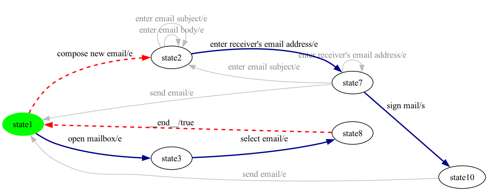

**Generated test cases** (2 trip(s) from initial back to initial, hidden synthetics removed):

- **test case 1**: `open mailbox -> select email`
- **test case 2**: `compose new email -> enter receiver's email address -> sign mail`

### Product 2

**Selected features:** selected = {ad, e}

**Repaired FTS:** 8 states, 15 transitions (14 real / 1 `__end__`).

**State-coverage walk:** 9 transition step(s) — 5 unique greedy edge(s), 2 BFS-reroute segment(s). State coverage on the repaired FTS: **8/8 = 100.0%**.

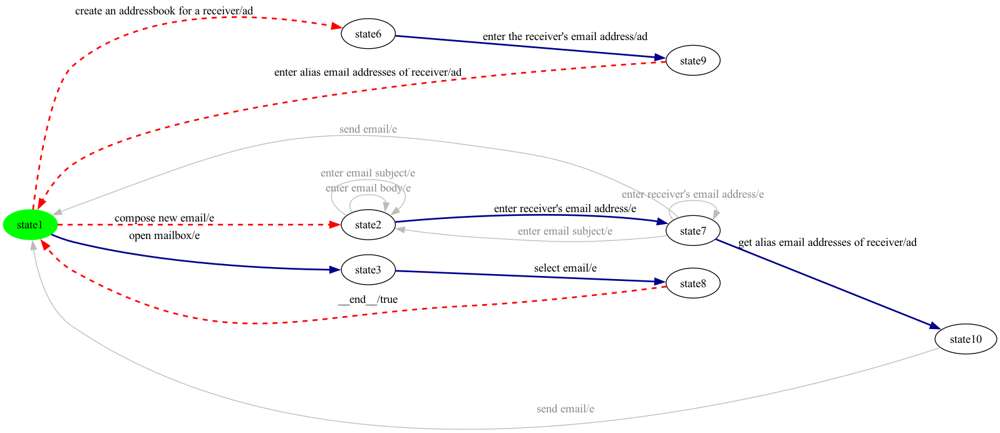

**Generated test cases** (3 trip(s) from initial back to initial, hidden synthetics removed):

- **test case 1**: `open mailbox -> select email`
- **test case 2**: `create an addressbook for a receiver -> enter the receiver's email address -> enter alias email addresses of receiver`
- **test case 3**: `compose new email -> enter receiver's email address -> get alias email addresses of receiver`

### Product 3

**Selected features:** selected = {ad, au, e}

**Repaired FTS:** 10 states, 20 transitions (18 real / 2 `__end__`).

**State-coverage walk:** 13 transition step(s) — 6 unique greedy edge(s), 3 BFS-reroute segment(s). State coverage on the repaired FTS: **10/10 = 100.0%**.

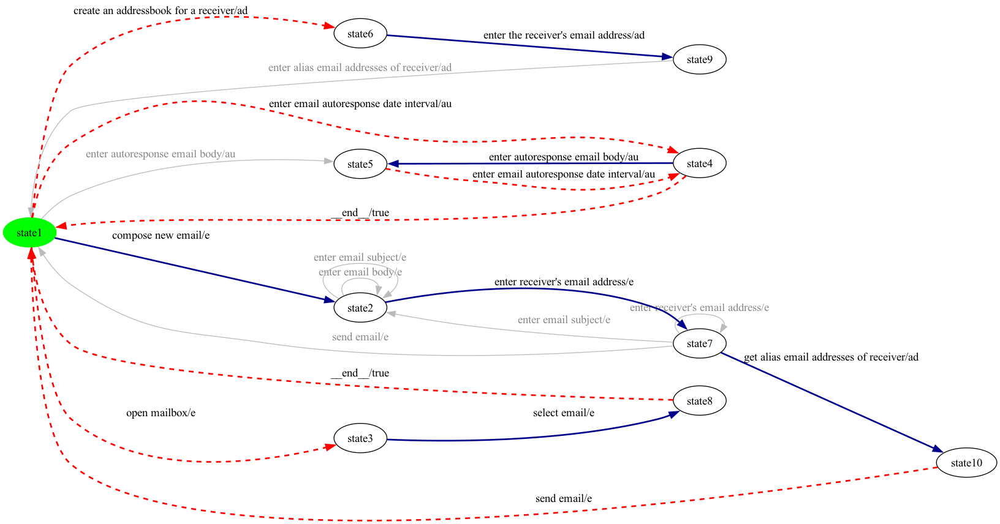

**Generated test cases** (4 trip(s) from initial back to initial, hidden synthetics removed):

- **test case 1**: `compose new email -> enter receiver's email address -> get alias email addresses of receiver -> send email`
- **test case 2**: `open mailbox -> select email`
- **test case 3**: `enter email autoresponse date interval -> enter autoresponse email body -> enter email autoresponse date interval`
- **test case 4**: `create an addressbook for a receiver -> enter the receiver's email address`

### Product 4

**Selected features:** selected = {ad, au, e, en, s}

**Repaired FTS:** 11 states, 23 transitions (21 real / 2 `__end__`).

**State-coverage walk:** 17 transition step(s) — 6 unique greedy edge(s), 4 BFS-reroute segment(s). State coverage on the repaired FTS: **11/11 = 100.0%**.

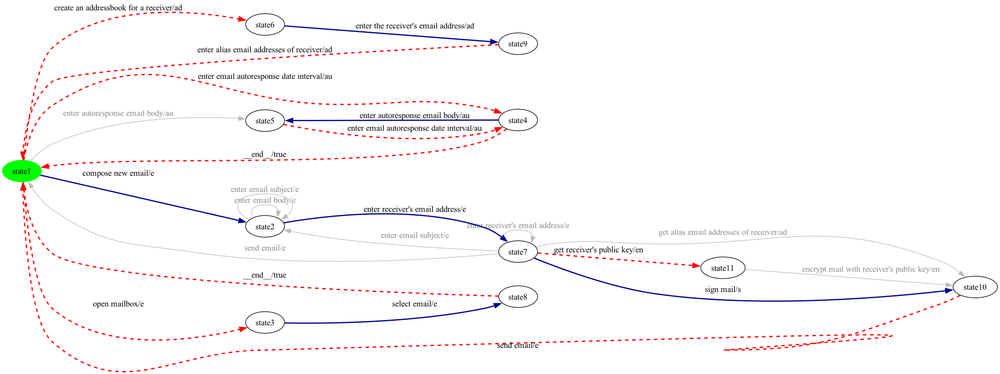

**Generated test cases** (5 trip(s) from initial back to initial, hidden synthetics removed):

- **test case 1**: `compose new email -> enter receiver's email address -> sign mail -> send email`
- **test case 2**: `open mailbox -> select email`
- **test case 3**: `enter email autoresponse date interval -> enter autoresponse email body -> enter email autoresponse date interval`
- **test case 4**: `create an addressbook for a receiver -> enter the receiver's email address -> enter alias email addresses of receiver`
- **test case 5**: `compose new email -> enter receiver's email address -> get receiver's public key`

### Product 5

**Selected features:** selected = {e, en, s}

**Repaired FTS:** 7 states, 14 transitions (13 real / 1 `__end__`).

**State-coverage walk:** 7 transition step(s) — 5 unique greedy edge(s), 1 BFS-reroute segment(s). State coverage on the repaired FTS: **7/7 = 100.0%**.

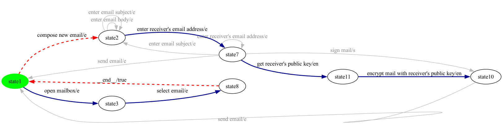

**Generated test cases** (2 trip(s) from initial back to initial, hidden synthetics removed):

- **test case 1**: `open mailbox -> select email`
- **test case 2**: `compose new email -> enter receiver's email address -> get receiver's public key -> encrypt mail with receiver's public key`

### Product 6

**Selected features:** selected = {au, e, en, s}

**Repaired FTS:** 9 states, 19 transitions (17 real / 2 `__end__`).

**State-coverage walk:** 14 transition step(s) — 5 unique greedy edge(s), 3 BFS-reroute segment(s). State coverage on the repaired FTS: **9/9 = 100.0%**.

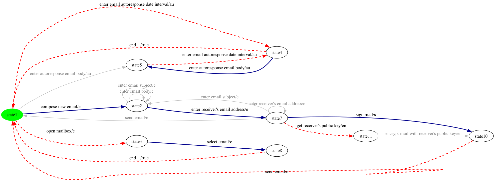

**Generated test cases** (4 trip(s) from initial back to initial, hidden synthetics removed):

- **test case 1**: `compose new email -> enter receiver's email address -> sign mail -> send email`
- **test case 2**: `open mailbox -> select email`
- **test case 3**: `enter email autoresponse date interval -> enter autoresponse email body -> enter email autoresponse date interval`
- **test case 4**: `compose new email -> enter receiver's email address -> get receiver's public key`

### Product 7

**Selected features:** selected = {ad, au, e, f, s}

**Repaired FTS:** 10 states, 22 transitions (20 real / 2 `__end__`).

**State-coverage walk:** 13 transition step(s) — 6 unique greedy edge(s), 3 BFS-reroute segment(s). State coverage on the repaired FTS: **10/10 = 100.0%**.

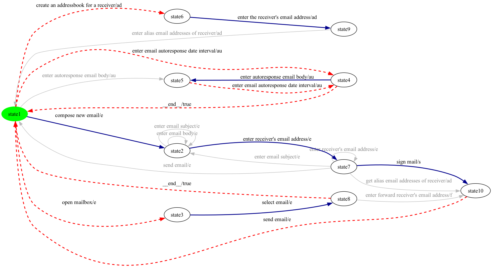

**Generated test cases** (4 trip(s) from initial back to initial, hidden synthetics removed):

- **test case 1**: `compose new email -> enter receiver's email address -> sign mail -> send email`
- **test case 2**: `open mailbox -> select email`
- **test case 3**: `enter email autoresponse date interval -> enter autoresponse email body -> enter email autoresponse date interval`
- **test case 4**: `create an addressbook for a receiver -> enter the receiver's email address`

### Product 8

**Selected features:** selected = {e, f, s}

**Repaired FTS:** 6 states, 13 transitions (12 real / 1 `__end__`).

**State-coverage walk:** 6 transition step(s) — 4 unique greedy edge(s), 1 BFS-reroute segment(s). State coverage on the repaired FTS: **6/6 = 100.0%**.

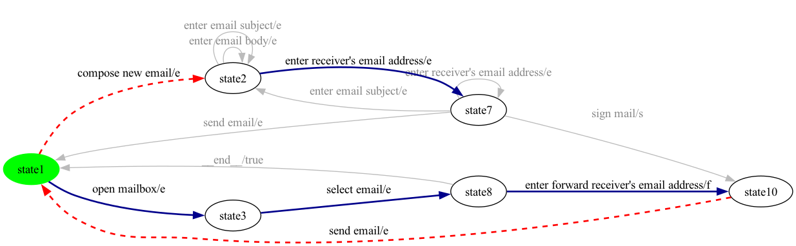

**Generated test cases** (2 trip(s) from initial back to initial, hidden synthetics removed):

- **test case 1**: `open mailbox -> select email -> enter forward receiver's email address -> send email`
- **test case 2**: `compose new email -> enter receiver's email address`

### Product 9

**Selected features:** selected = {au, e}

**Repaired FTS:** 7 states, 15 transitions (13 real / 2 `__end__`).

**State-coverage walk:** 9 transition step(s) — 4 unique greedy edge(s), 2 BFS-reroute segment(s). State coverage on the repaired FTS: **7/7 = 100.0%**.

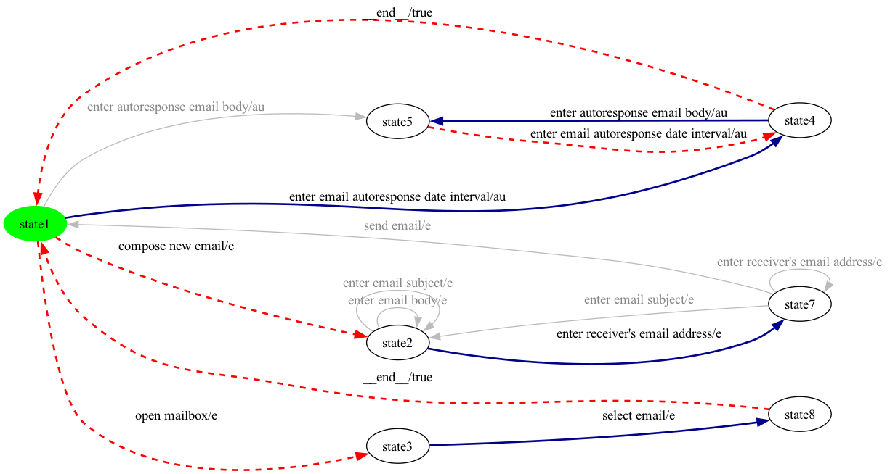

**Generated test cases** (3 trip(s) from initial back to initial, hidden synthetics removed):

- **test case 1**: `enter email autoresponse date interval -> enter autoresponse email body -> enter email autoresponse date interval`
- **test case 2**: `open mailbox -> select email`
- **test case 3**: `compose new email -> enter receiver's email address`

### Product 10

**Selected features:** selected = {ad, e, f}

**Repaired FTS:** 8 states, 16 transitions (15 real / 1 `__end__`).

**State-coverage walk:** 9 transition step(s) — 5 unique greedy edge(s), 2 BFS-reroute segment(s). State coverage on the repaired FTS: **8/8 = 100.0%**.

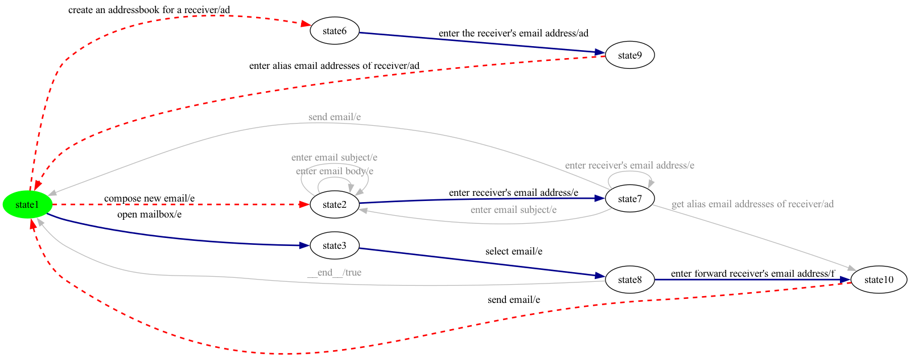

**Generated test cases** (3 trip(s) from initial back to initial, hidden synthetics removed):

- **test case 1**: `open mailbox -> select email -> enter forward receiver's email address -> send email`
- **test case 2**: `create an addressbook for a receiver -> enter the receiver's email address -> enter alias email addresses of receiver`
- **test case 3**: `compose new email -> enter receiver's email address`

### Product 11

**Selected features:** selected = {ad, au, e, f}

**Repaired FTS:** 10 states, 21 transitions (19 real / 2 `__end__`).

**State-coverage walk:** 13 transition step(s) — 6 unique greedy edge(s), 3 BFS-reroute segment(s). State coverage on the repaired FTS: **10/10 = 100.0%**.

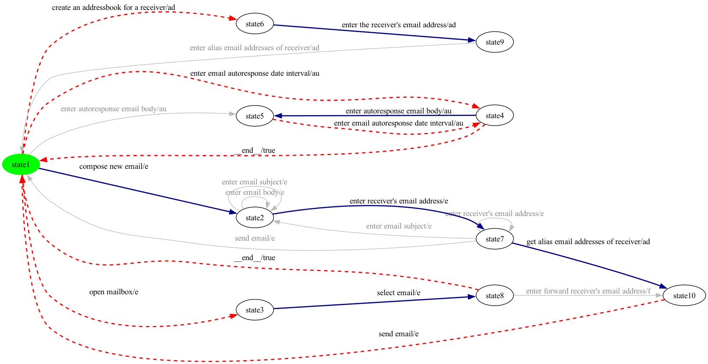

**Generated test cases** (4 trip(s) from initial back to initial, hidden synthetics removed):

- **test case 1**: `compose new email -> enter receiver's email address -> get alias email addresses of receiver -> send email`
- **test case 2**: `open mailbox -> select email`
- **test case 3**: `enter email autoresponse date interval -> enter autoresponse email body -> enter email autoresponse date interval`
- **test case 4**: `create an addressbook for a receiver -> enter the receiver's email address`

### Product 12

**Selected features:** selected = {ad, e, en}

**Repaired FTS:** 9 states, 17 transitions (16 real / 1 `__end__`).

**State-coverage walk:** 10 transition step(s) — 6 unique greedy edge(s), 2 BFS-reroute segment(s). State coverage on the repaired FTS: **9/9 = 100.0%**.

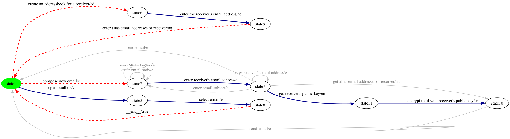

**Generated test cases** (3 trip(s) from initial back to initial, hidden synthetics removed):

- **test case 1**: `open mailbox -> select email`
- **test case 2**: `create an addressbook for a receiver -> enter the receiver's email address -> enter alias email addresses of receiver`
- **test case 3**: `compose new email -> enter receiver's email address -> get receiver's public key -> encrypt mail with receiver's public key`

### Product 13

**Selected features:** selected = {ad, e, s}

**Repaired FTS:** 8 states, 16 transitions (15 real / 1 `__end__`).

**State-coverage walk:** 9 transition step(s) — 5 unique greedy edge(s), 2 BFS-reroute segment(s). State coverage on the repaired FTS: **8/8 = 100.0%**.

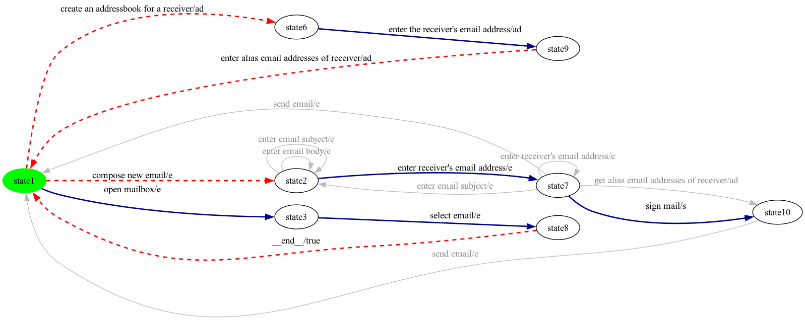

**Generated test cases** (3 trip(s) from initial back to initial, hidden synthetics removed):

- **test case 1**: `open mailbox -> select email`
- **test case 2**: `create an addressbook for a receiver -> enter the receiver's email address -> enter alias email addresses of receiver`
- **test case 3**: `compose new email -> enter receiver's email address -> sign mail`

### Product 14

**Selected features:** selected = {au, e, f, s}

**Repaired FTS:** 8 states, 18 transitions (16 real / 2 `__end__`).

**State-coverage walk:** 9 transition step(s) — 5 unique greedy edge(s), 2 BFS-reroute segment(s). State coverage on the repaired FTS: **8/8 = 100.0%**.

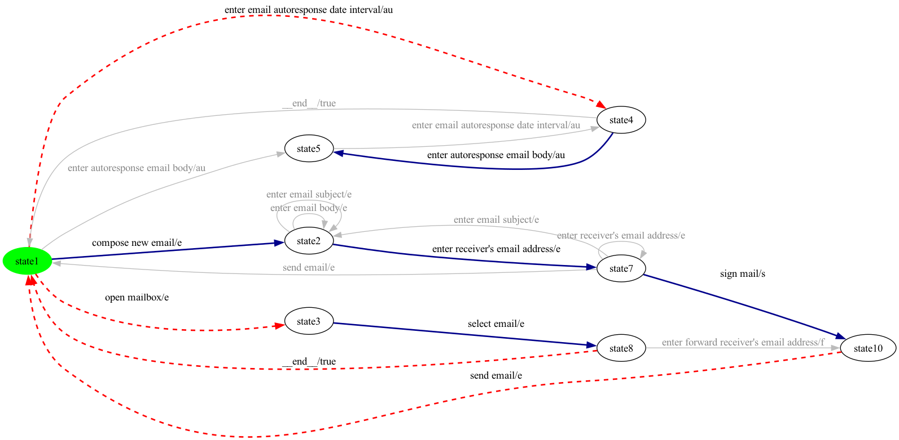

**Generated test cases** (3 trip(s) from initial back to initial, hidden synthetics removed):

- **test case 1**: `compose new email -> enter receiver's email address -> sign mail -> send email`
- **test case 2**: `open mailbox -> select email`
- **test case 3**: `enter email autoresponse date interval -> enter autoresponse email body`

### Product 15

**Selected features:** selected = {e, en}

**Repaired FTS:** 7 states, 13 transitions (12 real / 1 `__end__`).

**State-coverage walk:** 7 transition step(s) — 5 unique greedy edge(s), 1 BFS-reroute segment(s). State coverage on the repaired FTS: **7/7 = 100.0%**.

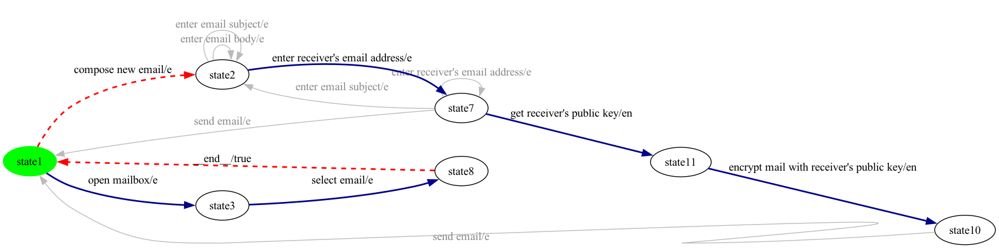

**Generated test cases** (2 trip(s) from initial back to initial, hidden synthetics removed):

- **test case 1**: `open mailbox -> select email`
- **test case 2**: `compose new email -> enter receiver's email address -> get receiver's public key -> encrypt mail with receiver's public key`

### Product 16

**Selected features:** selected = {au, e, f}

**Repaired FTS:** 8 states, 17 transitions (15 real / 2 `__end__`).

**State-coverage walk:** 9 transition step(s) — 5 unique greedy edge(s), 2 BFS-reroute segment(s). State coverage on the repaired FTS: **8/8 = 100.0%**.

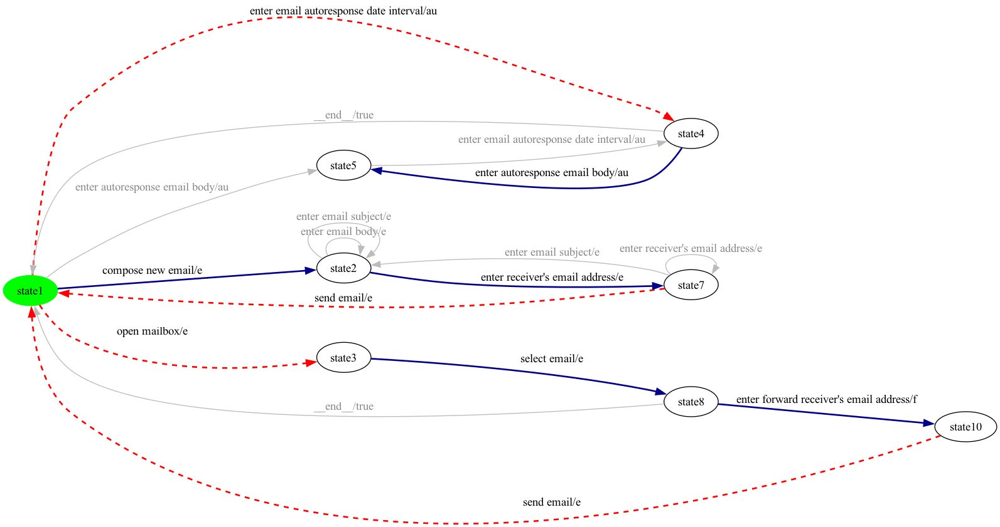

**Generated test cases** (3 trip(s) from initial back to initial, hidden synthetics removed):

- **test case 1**: `compose new email -> enter receiver's email address -> send email`
- **test case 2**: `open mailbox -> select email -> enter forward receiver's email address -> send email`
- **test case 3**: `enter email autoresponse date interval -> enter autoresponse email body`

### Product 17

**Selected features:** selected = {ad, e, f, s}

**Repaired FTS:** 8 states, 17 transitions (16 real / 1 `__end__`).

**State-coverage walk:** 9 transition step(s) — 5 unique greedy edge(s), 2 BFS-reroute segment(s). State coverage on the repaired FTS: **8/8 = 100.0%**.

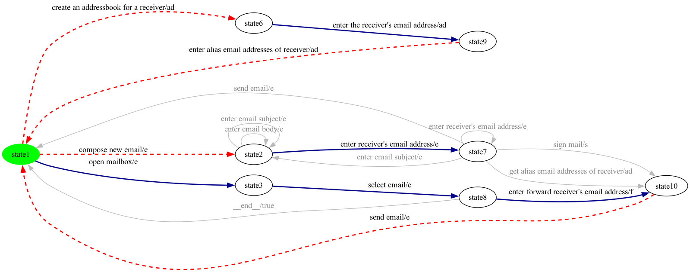

**Generated test cases** (3 trip(s) from initial back to initial, hidden synthetics removed):

- **test case 1**: `open mailbox -> select email -> enter forward receiver's email address -> send email`
- **test case 2**: `create an addressbook for a receiver -> enter the receiver's email address -> enter alias email addresses of receiver`
- **test case 3**: `compose new email -> enter receiver's email address`

### Product 18

**Selected features:** selected = {ad, au, e, en}

**Repaired FTS:** 11 states, 22 transitions (20 real / 2 `__end__`).

**State-coverage walk:** 17 transition step(s) — 6 unique greedy edge(s), 4 BFS-reroute segment(s). State coverage on the repaired FTS: **11/11 = 100.0%**.

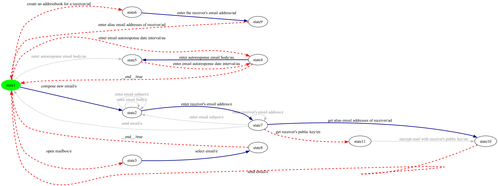

**Generated test cases** (5 trip(s) from initial back to initial, hidden synthetics removed):

- **test case 1**: `compose new email -> enter receiver's email address -> get alias email addresses of receiver -> send email`
- **test case 2**: `open mailbox -> select email`
- **test case 3**: `enter email autoresponse date interval -> enter autoresponse email body -> enter email autoresponse date interval`
- **test case 4**: `create an addressbook for a receiver -> enter the receiver's email address -> enter alias email addresses of receiver`
- **test case 5**: `compose new email -> enter receiver's email address -> get receiver's public key`

### Product 19

**Selected features:** selected = {au, e, en}

**Repaired FTS:** 9 states, 18 transitions (16 real / 2 `__end__`).

**State-coverage walk:** 10 transition step(s) — 6 unique greedy edge(s), 2 BFS-reroute segment(s). State coverage on the repaired FTS: **9/9 = 100.0%**.

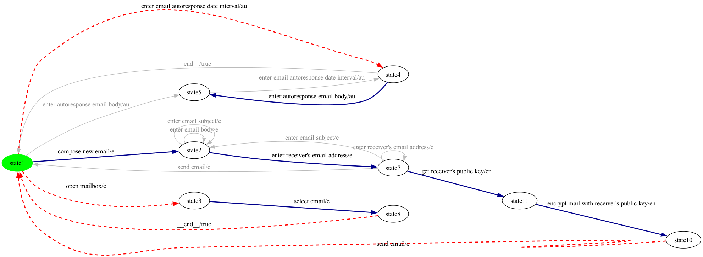

**Generated test cases** (3 trip(s) from initial back to initial, hidden synthetics removed):

- **test case 1**: `compose new email -> enter receiver's email address -> get receiver's public key -> encrypt mail with receiver's public key -> send email`
- **test case 2**: `open mailbox -> select email`
- **test case 3**: `enter email autoresponse date interval -> enter autoresponse email body`

### Product 20

**Selected features:** selected = {e, f}

**Repaired FTS:** 6 states, 12 transitions (11 real / 1 `__end__`).

**State-coverage walk:** 6 transition step(s) — 4 unique greedy edge(s), 1 BFS-reroute segment(s). State coverage on the repaired FTS: **6/6 = 100.0%**.

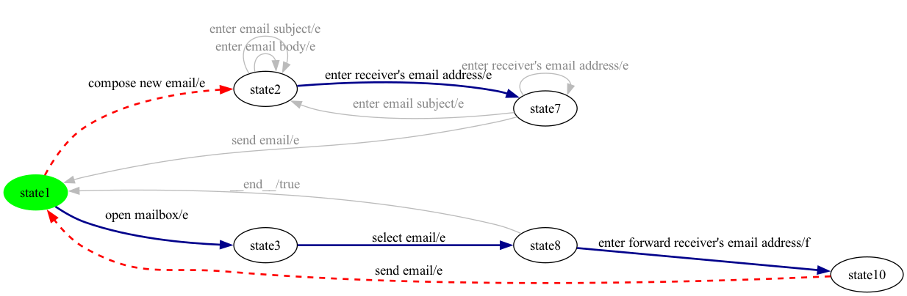

**Generated test cases** (2 trip(s) from initial back to initial, hidden synthetics removed):

- **test case 1**: `open mailbox -> select email -> enter forward receiver's email address -> send email`
- **test case 2**: `compose new email -> enter receiver's email address`

### Product 21

**Selected features:** selected = {ad, e, en, s}

**Repaired FTS:** 9 states, 18 transitions (17 real / 1 `__end__`).

**State-coverage walk:** 10 transition step(s) — 6 unique greedy edge(s), 2 BFS-reroute segment(s). State coverage on the repaired FTS: **9/9 = 100.0%**.

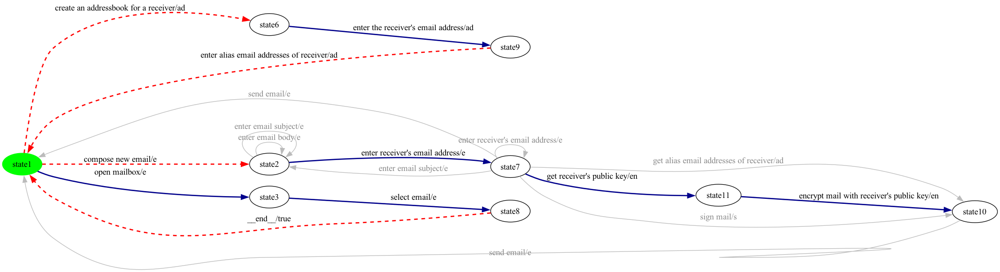

**Generated test cases** (3 trip(s) from initial back to initial, hidden synthetics removed):

- **test case 1**: `open mailbox -> select email`
- **test case 2**: `create an addressbook for a receiver -> enter the receiver's email address -> enter alias email addresses of receiver`
- **test case 3**: `compose new email -> enter receiver's email address -> get receiver's public key -> encrypt mail with receiver's public key`

### Product 22

**Selected features:** selected = {ad, au, e, s}

**Repaired FTS:** 10 states, 21 transitions (19 real / 2 `__end__`).

**State-coverage walk:** 13 transition step(s) — 6 unique greedy edge(s), 3 BFS-reroute segment(s). State coverage on the repaired FTS: **10/10 = 100.0%**.

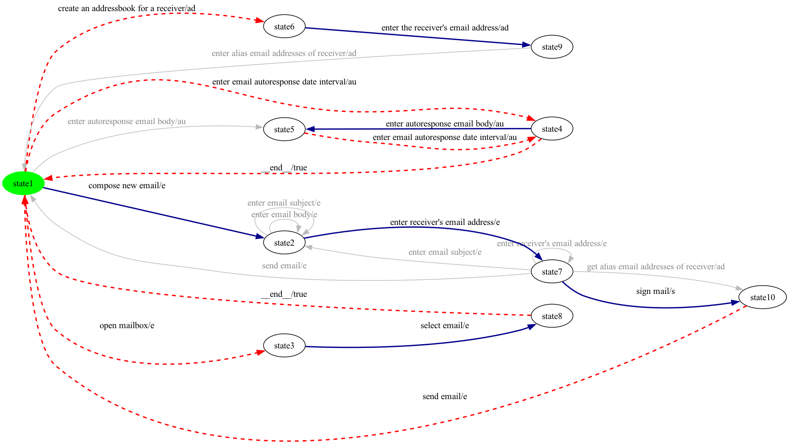

**Generated test cases** (4 trip(s) from initial back to initial, hidden synthetics removed):

- **test case 1**: `compose new email -> enter receiver's email address -> sign mail -> send email`
- **test case 2**: `open mailbox -> select email`
- **test case 3**: `enter email autoresponse date interval -> enter autoresponse email body -> enter email autoresponse date interval`
- **test case 4**: `create an addressbook for a receiver -> enter the receiver's email address`

### Product 23

**Selected features:** selected = {au, e, s}

**Repaired FTS:** 8 states, 17 transitions (15 real / 2 `__end__`).

**State-coverage walk:** 9 transition step(s) — 5 unique greedy edge(s), 2 BFS-reroute segment(s). State coverage on the repaired FTS: **8/8 = 100.0%**.

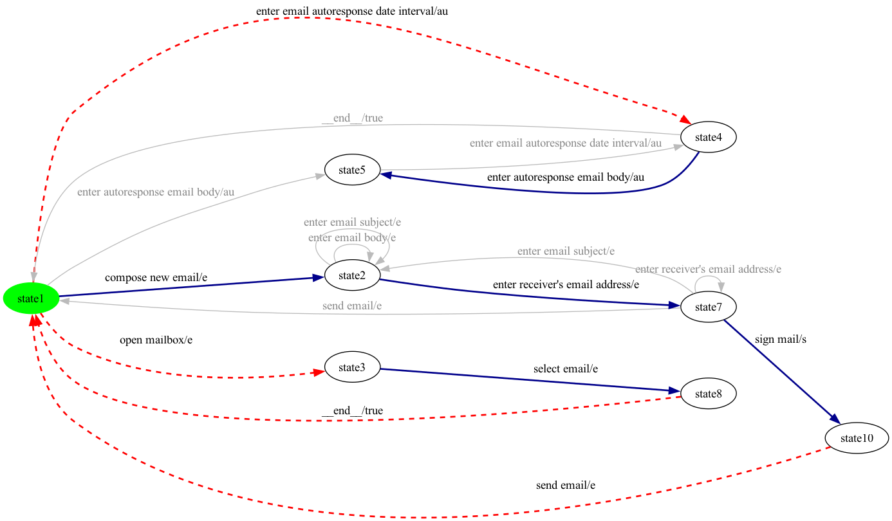

**Generated test cases** (3 trip(s) from initial back to initial, hidden synthetics removed):

- **test case 1**: `compose new email -> enter receiver's email address -> sign mail -> send email`
- **test case 2**: `open mailbox -> select email`
- **test case 3**: `enter email autoresponse date interval -> enter autoresponse email body`

---

Total products: 23.
