# Per-Product All-Transition-Pairs Coverage — Elevator

## How the all-transition-pairs test suite is built

**Why a fresh transformation, not `vibes-transformation`.** The legacy `vibes-transformation` module (not in the root pom) is an I/O and format-conversion layer (AUT &harr; LTS, XML readers, Dot printers, structural pruning) operating on the obsolete `be.unamur.transitionsystem.*` namespace; it does not contain anything for pair-graph / k-tuple coverage transformation and is dormant. The L=2 pair graph here is the FTS analog of the ESG-Fx-side `TransformedESGFxGenerator` (from the user's prior published study); we re-implement against the current `be.vibes.ts.*` types directly.

**Reduction insight.** The pair-coverage problem on FTS *F* reduces to the edge-coverage problem on a transformed FTS *P(F)* — the *pair graph*. A Hierholzer Euler cycle on *P(F)* visits every edge of *P(F)* exactly once, which by construction means every contiguous transition pair of *F* is exercised in the resulting test sequence.

**Step 1 — Project onto the product.** Same as the other criteria: `FExpressionPreservingProjection.project(fts, config)` keeps transitions whose feature expression evaluates true; reachability filter drops unreachable states.

**Step 2 — Repair strong connectivity on the original FTS.** Same as the other criteria: `InitialSccFilter.keepInitialScc(projected)`.

**Step 3 — Build the pair graph.** [`PairGraphTransformer.transform(repaired)`](../../../vibes-testgeneration/src/main/java/be/vibes/testgeneration/coverage/PairGraphTransformer.java) produces a pair graph *P(F)* whose:

- **node** = original transition (named `p_<source>_<action>_<target>`), plus a synthetic `INIT` node representing "no transition executed yet";
- **edge** `INIT -> p(t)` (labelled `action(t)`) for every original transition `t` starting at the original initial state;
- **edge** `p(t1) -> p(t2)` (labelled `action(t2)`) for every ordered pair `(t1, t2)` with `target(t1) == source(t2)`.

Complexity: enumerate via an outgoing-by-source index on the original FTS, so the construction is *O(|T| + sum_s out_deg(s))* rather than *O(|T|^2)*. The transformer also returns a side-map `pairStateToOriginalTransition` used in step 6 to translate the pair-graph cycle back to original transitions.

**Step 4 — Balance (no SCC precheck).** The pair graph is intentionally not strongly connected at this point: INIT has out-degree N (one per original initial-state transition) and in-degree 0. Running the usual `InitialSccFilter` here would discard everything except INIT. [`EulerianBalancer.balanceWithoutPrecheck(pairGraph)`](../../../vibes-testgeneration/src/main/java/be/vibes/testgeneration/graph/EulerianBalancer.java) skips the SCC check and supplies the missing INIT-incoming edges as synthetic `__balance__N` edges — exactly enough to make every pair-graph state in-balanced AND restore strong connectivity. The balanced pair graph is verified to be strongly connected after this step; if it isn't, the projection has produced an unrepaired pair-graph fragment (does not happen on the three MVP SPLs).

**Step 5 — Hierholzer Euler cycle on the balanced pair graph.** [`HierholzerEulerCycle.compute(balanced)`](../../../vibes-testgeneration/src/main/java/be/vibes/testgeneration/graph/HierholzerEulerCycle.java) returns one contiguous cycle visiting every pair-graph edge exactly once. By the reduction insight above, every contiguous transition pair of the original FTS is covered.

**Step 6 — Split + translate back.** Synthetic `__balance__N` edges in the pair-graph cycle cannot be replayed in the original FTS (they encode "teleport back to INIT"), so the cycle is split at every synthetic edge. Each non-synthetic segment is translated: each pair-graph edge `p(t1) -> p(t2)` corresponds to executing `t2` in the original FTS (the side-map gives us `t2` from the edge's target pair-state). One subtlety: the FIRST pair-graph edge of a non-INIT-starting segment carries a real pair `(t_Y, t_X)` that would otherwise be split across two test cases by the synthetic teleport. To preserve coverage we PREPEND `t_Y` to the segment (the test case then starts mid-FTS at `source(t_Y)` — legal as long as the executor is reset between test cases).

**Step 7 — Wrap into a List<TestCase>.** Unlike all-transitions and all-states (which return one TestCase), this generator returns a *suite* because the pair graph naturally yields multiple test cases (one per real segment between synthetic teleports). For display each TestCase is additionally split at every visit to the original repaired FTS's initial state via `TestCaseSplitter.splitAtInitialReturns(...)` — same operational test-case semantics as the other two reports.

**Coverage claim.** Hierholzer visits every pair-graph edge exactly once → every contiguous original transition pair is covered, by construction. The pair-graph reachable-pair count is the denominator; pairs that exist only via dropped transitions (post-projection) are NOT in the denominator, which is the correct semantics for product-level coverage.

---

## Products

Three FTS images per product: (a) the repaired original FTS — source of the pair info; (b) the pair graph BEFORE balancing — INIT is source-only and the graph is not Eulerian; (c) the pair graph AFTER balancing — synthetic edges (`__balance__N`) added back to INIT shown as dashed-red. Generated test cases are listed underneath, split at every visit to the original repaired FTS's initial state. Synthetic actions are hidden / `__dup__N` is stripped, same convention as the other reports.

### Product 1

**Selected features:** selected = {ControlButtons, ExecutiveFloor, Intercom, PinPad}

**Repaired FTS:** 8 states, 23 transitions (20 real / 3 `__end__`).

**Pair graph (raw):** 21 nodes (incl. INIT), 41 edges (every edge = one contiguous transition pair in the original FTS; the subset starting at INIT correspond to pairs `(start, t)` for any original initial-state outgoing `t`).

**Pair graph (balanced):** 21 nodes, 63 edges (22 synthetic `__balance__N` added to restore in-balance at INIT).

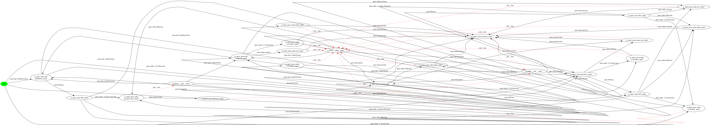

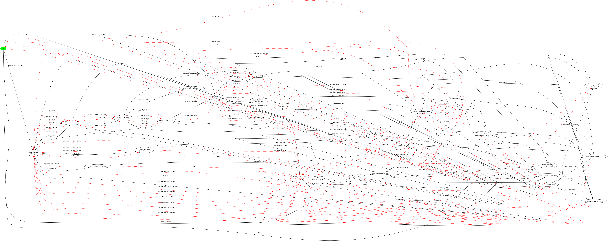

**Generated test suite** — 20 unique test case(s) after action-sequence dedup (20 pair-graph segment(s), 55 raw real step(s); pair-graph cycle has 63 edge(s) total, 22 synthetic dropped at translation). Operationally-identical trips (same action sequence, possibly different transition-level pairs) are listed once.

- **test case 1**: `press hall down -> press cabin lobby -> press intercom`
- **test case 2**: `press hall RoofDown -> enter PIN -> press cabin [1-N] floor -> press intercom`
- **test case 3**: `press hall down -> press cabin roof -> press intercom`
- **test case 4**: `press hall down -> enter PIN -> press cabin roof -> press intercom`
- **test case 5**: `press hall down -> press cabin [1-N] floor -> press intercom`
- **test case 6**: `enter PIN -> press cabin [1-N] floor`
- **test case 7**: `press hall up -> press cabin lobby`
- **test case 8**: `enter PIN -> press cabin lobby -> press intercom`
- **test case 9**: `enter PIN -> press cabin executive floor -> press intercom`
- **test case 10**: `press hall RoofDown -> press cabin [1-N] floor -> press intercom`
- **test case 11**: `enter PIN -> press cabin roof`
- **test case 12**: `press hall up -> press cabin roof`
- **test case 13**: `press hall up -> enter PIN -> press cabin executive floor`
- **test case 14**: `press hall up -> press cabin [1-N] floor`
- **test case 15**: `press hall LobbyUp -> press cabin roof -> press intercom`
- **test case 16**: `enter PIN -> press cabin lobby`
- **test case 17**: `press hall LobbyUp -> enter PIN -> press cabin lobby`
- **test case 18**: `press hall LobbyUp -> press cabin [1-N] floor -> press intercom`
- **test case 19**: `enter PIN -> press cabin executive floor`
- **test case 20**: `press hall RoofDown -> press cabin lobby -> press intercom`

### Product 2

**Selected features:** selected = {Alarm, ControlButtons, MobileKey}

**Repaired FTS:** 7 states, 20 transitions (18 real / 2 `__end__`).

**Pair graph (raw):** 19 nodes (incl. INIT), 37 edges (every edge = one contiguous transition pair in the original FTS; the subset starting at INIT correspond to pairs `(start, t)` for any original initial-state outgoing `t`).

**Pair graph (balanced):** 19 nodes, 56 edges (19 synthetic `__balance__N` added to restore in-balance at INIT).

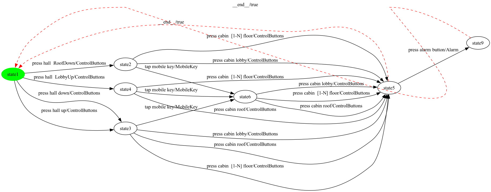

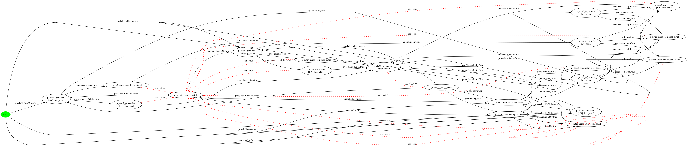

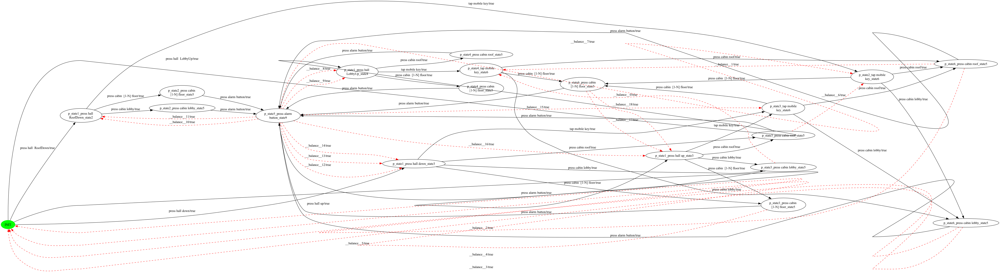

**Generated test suite** — 18 unique test case(s) after action-sequence dedup (18 pair-graph segment(s), 50 raw real step(s); pair-graph cycle has 56 edge(s) total, 19 synthetic dropped at translation). Operationally-identical trips (same action sequence, possibly different transition-level pairs) are listed once.

- **test case 1**: `press hall down -> press cabin lobby -> press alarm button`
- **test case 2**: `tap mobile key -> press cabin roof -> press alarm button`
- **test case 3**: `press hall LobbyUp -> press cabin roof -> press alarm button`
- **test case 4**: `press hall LobbyUp -> tap mobile key -> press cabin roof`
- **test case 5**: `tap mobile key -> press cabin lobby -> press alarm button`
- **test case 6**: `press hall RoofDown -> press cabin [1-N] floor -> press alarm button`
- **test case 7**: `press hall RoofDown -> press cabin lobby -> press alarm button`
- **test case 8**: `press hall down -> press cabin roof -> press alarm button`
- **test case 9**: `press hall down -> press cabin [1-N] floor -> press alarm button`
- **test case 10**: `press hall down -> tap mobile key -> press cabin [1-N] floor -> press alarm button`
- **test case 11**: `tap mobile key -> press cabin lobby`
- **test case 12**: `press hall up -> press cabin lobby`
- **test case 13**: `tap mobile key -> press cabin [1-N] floor`
- **test case 14**: `press hall up -> tap mobile key -> press cabin roof`
- **test case 15**: `press hall LobbyUp -> press cabin [1-N] floor -> press alarm button`
- **test case 16**: `press hall up -> press cabin roof`
- **test case 17**: `press hall RoofDown -> tap mobile key -> press cabin [1-N] floor`
- **test case 18**: `press hall up -> press cabin [1-N] floor`

### Product 3

**Selected features:** selected = {Alarm, CardReader, ControlButtons, ExecutiveFloor}

**Repaired FTS:** 8 states, 23 transitions (20 real / 3 `__end__`).

**Pair graph (raw):** 21 nodes (incl. INIT), 41 edges (every edge = one contiguous transition pair in the original FTS; the subset starting at INIT correspond to pairs `(start, t)` for any original initial-state outgoing `t`).

**Pair graph (balanced):** 21 nodes, 63 edges (22 synthetic `__balance__N` added to restore in-balance at INIT).

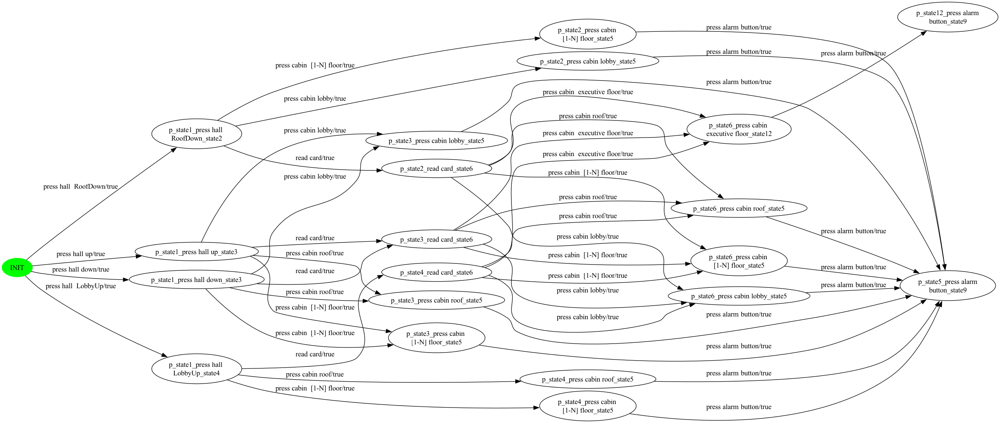

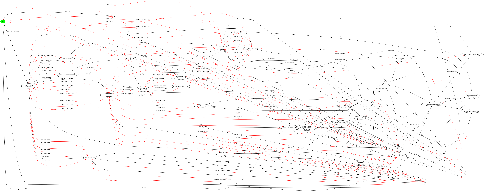

**Generated test suite** — 21 unique test case(s) after action-sequence dedup (21 pair-graph segment(s), 57 raw real step(s); pair-graph cycle has 63 edge(s) total, 22 synthetic dropped at translation). Operationally-identical trips (same action sequence, possibly different transition-level pairs) are listed once.

- **test case 1**: `press hall down -> press cabin lobby -> press alarm button`
- **test case 2**: `press hall down -> press cabin roof -> press alarm button`
- **test case 3**: `press hall down -> press cabin [1-N] floor -> press alarm button`
- **test case 4**: `press hall down -> read card -> press cabin executive floor -> press alarm button`
- **test case 5**: `press hall up -> press cabin lobby`
- **test case 6**: `read card -> press cabin [1-N] floor -> press alarm button`
- **test case 7**: `read card -> press cabin lobby -> press alarm button`
- **test case 8**: `read card -> press cabin [1-N] floor`
- **test case 9**: `press hall up -> press cabin roof`
- **test case 10**: `press hall RoofDown -> read card -> press cabin executive floor`
- **test case 11**: `read card -> press cabin roof -> press alarm button`
- **test case 12**: `read card -> press cabin roof`
- **test case 13**: `press hall LobbyUp -> press cabin roof -> press alarm button`
- **test case 14**: `read card -> press cabin executive floor`
- **test case 15**: `press hall RoofDown -> press cabin [1-N] floor -> press alarm button`
- **test case 16**: `press hall up -> press cabin [1-N] floor`
- **test case 17**: `press hall RoofDown -> press cabin lobby -> press alarm button`
- **test case 18**: `read card -> press cabin lobby`
- **test case 19**: `press hall LobbyUp -> press cabin [1-N] floor -> press alarm button`
- **test case 20**: `press hall up -> read card -> press cabin lobby`
- **test case 21**: `press hall LobbyUp -> read card -> press cabin roof`

### Product 4

**Selected features:** selected = {ControlButtons, Intercom, ManualDoorControl, MobileKey}

**Repaired FTS:** 9 states, 26 transitions (22 real / 4 `__end__`).

**Pair graph (raw):** 23 nodes (incl. INIT), 61 edges (every edge = one contiguous transition pair in the original FTS; the subset starting at INIT correspond to pairs `(start, t)` for any original initial-state outgoing `t`).

**Pair graph (balanced):** 23 nodes, 91 edges (30 synthetic `__balance__N` added to restore in-balance at INIT).

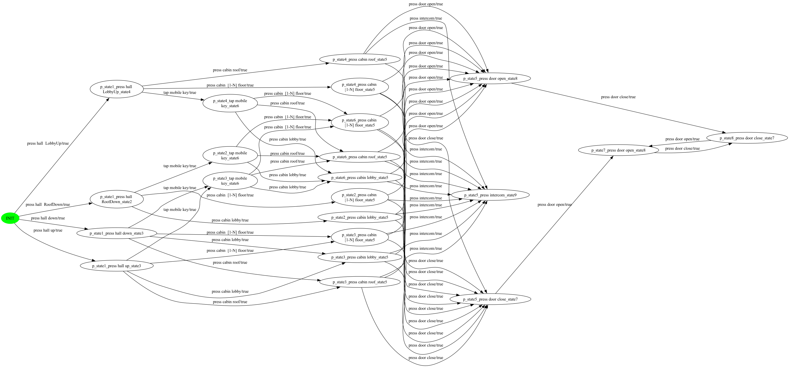

**Generated test suite** — 26 unique test case(s) after action-sequence dedup (26 pair-graph segment(s), 79 raw real step(s); pair-graph cycle has 91 edge(s) total, 30 synthetic dropped at translation). Operationally-identical trips (same action sequence, possibly different transition-level pairs) are listed once.

- **test case 1**: `press hall RoofDown -> press cabin lobby -> press door open -> press door close -> press door open -> press door close`
- **test case 2**: `press hall down -> press cabin lobby -> press door open`
- **test case 3**: `press cabin roof -> press door open`
- **test case 4**: `press cabin roof -> press intercom`
- **test case 5**: `press hall down -> press cabin roof -> press intercom`
- **test case 6**: `press hall up -> press cabin lobby -> press intercom`
- **test case 7**: `press hall LobbyUp -> press cabin roof -> press door close -> press door open`
- **test case 8**: `press cabin lobby -> press door close`
- **test case 9**: `press hall down -> press cabin [1-N] floor -> press door open`
- **test case 10**: `tap mobile key -> press cabin [1-N] floor -> press intercom`
- **test case 11**: `tap mobile key -> press cabin roof -> press door close`
- **test case 12**: `press hall down -> tap mobile key -> press cabin [1-N] floor -> press door close`
- **test case 13**: `tap mobile key -> press cabin roof -> press intercom`
- **test case 14**: `tap mobile key -> press cabin lobby -> press door open`
- **test case 15**: `tap mobile key -> press cabin roof -> press door open`
- **test case 16**: `press cabin lobby -> press intercom`
- **test case 17**: `press hall LobbyUp -> tap mobile key -> press cabin lobby -> press intercom`
- **test case 18**: `press hall LobbyUp -> press cabin [1-N] floor -> press door close`
- **test case 19**: `press cabin [1-N] floor -> press door close`
- **test case 20**: `press cabin [1-N] floor -> press door open`
- **test case 21**: `press cabin [1-N] floor -> press intercom`
- **test case 22**: `press hall RoofDown -> press cabin [1-N] floor -> press intercom`
- **test case 23**: `press hall up -> press cabin roof -> press door close`
- **test case 24**: `press hall up -> tap mobile key -> press cabin lobby -> press door close`
- **test case 25**: `press hall up -> press cabin [1-N] floor -> press intercom`
- **test case 26**: `press hall RoofDown -> tap mobile key -> press cabin [1-N] floor -> press door open`

### Product 5

**Selected features:** selected = {Alarm, ControlButtons, FirefighterService}

**Repaired FTS:** 10 states, 24 transitions (20 real / 4 `__end__`).

**Pair graph (raw):** 21 nodes (incl. INIT), 45 edges (every edge = one contiguous transition pair in the original FTS; the subset starting at INIT correspond to pairs `(start, t)` for any original initial-state outgoing `t`).

**Pair graph (balanced):** 21 nodes, 66 edges (21 synthetic `__balance__N` added to restore in-balance at INIT).

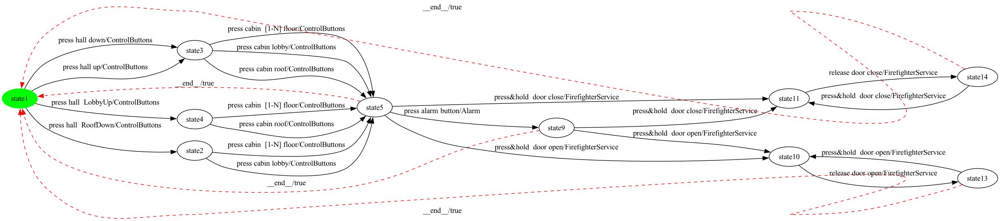

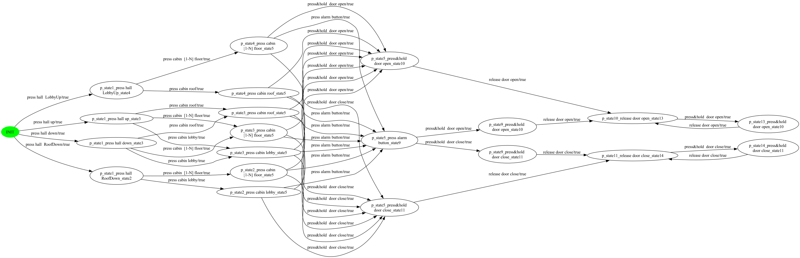

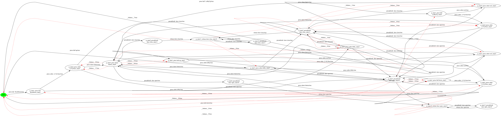

**Generated test suite** — 18 unique test case(s) after action-sequence dedup (18 pair-graph segment(s), 56 raw real step(s); pair-graph cycle has 66 edge(s) total, 21 synthetic dropped at translation). Operationally-identical trips (same action sequence, possibly different transition-level pairs) are listed once.

- **test case 1**: `press hall down -> press cabin lobby -> press&hold door close -> release door close -> press&hold door close -> release door close`
- **test case 2**: `press cabin lobby -> press alarm button -> press&hold door close -> release door close`
- **test case 3**: `press cabin roof -> press alarm button -> press&hold door open -> release door open -> press&hold door open -> release door open`
- **test case 4**: `press hall up -> press cabin lobby -> press&hold door open -> release door open`
- **test case 5**: `press hall LobbyUp -> press cabin roof -> press&hold door close`
- **test case 6**: `press cabin roof -> press&hold door open`
- **test case 7**: `press hall RoofDown -> press cabin [1-N] floor -> press&hold door open`
- **test case 8**: `press hall LobbyUp -> press cabin [1-N] floor -> press&hold door close`
- **test case 9**: `press cabin lobby -> press alarm button`
- **test case 10**: `press hall RoofDown -> press cabin lobby -> press&hold door close`
- **test case 11**: `press cabin lobby -> press&hold door open`
- **test case 12**: `press cabin [1-N] floor -> press&hold door close`
- **test case 13**: `press cabin [1-N] floor -> press alarm button`
- **test case 14**: `press cabin [1-N] floor -> press&hold door open`
- **test case 15**: `press hall down -> press cabin roof -> press alarm button`
- **test case 16**: `press hall up -> press cabin [1-N] floor -> press&hold door open`
- **test case 17**: `press hall down -> press cabin [1-N] floor -> press alarm button`
- **test case 18**: `press hall up -> press cabin roof -> press&hold door close`

### Product 6

**Selected features:** selected = {CardReader, ControlButtons, Intercom, ManualDoorControl}

**Repaired FTS:** 9 states, 26 transitions (22 real / 4 `__end__`).

**Pair graph (raw):** 23 nodes (incl. INIT), 61 edges (every edge = one contiguous transition pair in the original FTS; the subset starting at INIT correspond to pairs `(start, t)` for any original initial-state outgoing `t`).

**Pair graph (balanced):** 23 nodes, 91 edges (30 synthetic `__balance__N` added to restore in-balance at INIT).

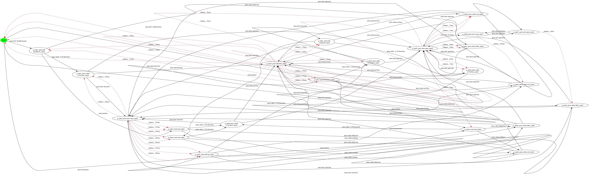

**Generated test suite** — 26 unique test case(s) after action-sequence dedup (26 pair-graph segment(s), 79 raw real step(s); pair-graph cycle has 91 edge(s) total, 30 synthetic dropped at translation). Operationally-identical trips (same action sequence, possibly different transition-level pairs) are listed once.

- **test case 1**: `press hall RoofDown -> read card -> press cabin [1-N] floor -> press intercom`
- **test case 2**: `press hall down -> press cabin lobby -> press door open -> press door close -> press door open -> press door close`
- **test case 3**: `press cabin roof -> press intercom`
- **test case 4**: `press hall up -> press cabin lobby -> press intercom`
- **test case 5**: `press hall LobbyUp -> read card -> press cabin [1-N] floor -> press door close -> press door open`
- **test case 6**: `press cabin lobby -> press door close`
- **test case 7**: `read card -> press cabin lobby -> press door open`
- **test case 8**: `press cabin roof -> press door open`
- **test case 9**: `press hall LobbyUp -> press cabin roof -> press door close`
- **test case 10**: `read card -> press cabin roof -> press door close`
- **test case 11**: `read card -> press cabin lobby -> press intercom`
- **test case 12**: `press hall RoofDown -> press cabin lobby -> press door open`
- **test case 13**: `press cabin lobby -> press intercom`
- **test case 14**: `press hall RoofDown -> press cabin [1-N] floor -> press door close`
- **test case 15**: `read card -> press cabin roof -> press intercom`
- **test case 16**: `press cabin [1-N] floor -> press door open`
- **test case 17**: `read card -> press cabin [1-N] floor -> press door open`
- **test case 18**: `press cabin [1-N] floor -> press door close`
- **test case 19**: `press cabin [1-N] floor -> press intercom`
- **test case 20**: `press hall down -> press cabin roof -> press door open`
- **test case 21**: `press hall down -> read card -> press cabin lobby -> press door close`
- **test case 22**: `press hall up -> press cabin roof -> press door close`
- **test case 23**: `press hall up -> press cabin [1-N] floor -> press intercom`
- **test case 24**: `press hall down -> press cabin [1-N] floor -> press door close`
- **test case 25**: `press hall up -> read card -> press cabin roof -> press door open`
- **test case 26**: `press hall LobbyUp -> press cabin [1-N] floor -> press door open`

### Product 7

**Selected features:** selected = {Alarm, ControlButtons, ExecutiveFloor, Intercom, MobileKey}

**Repaired FTS:** 8 states, 25 transitions (22 real / 3 `__end__`).

**Pair graph (raw):** 23 nodes (incl. INIT), 52 edges (every edge = one contiguous transition pair in the original FTS; the subset starting at INIT correspond to pairs `(start, t)` for any original initial-state outgoing `t`).

**Pair graph (balanced):** 23 nodes, 78 edges (26 synthetic `__balance__N` added to restore in-balance at INIT).

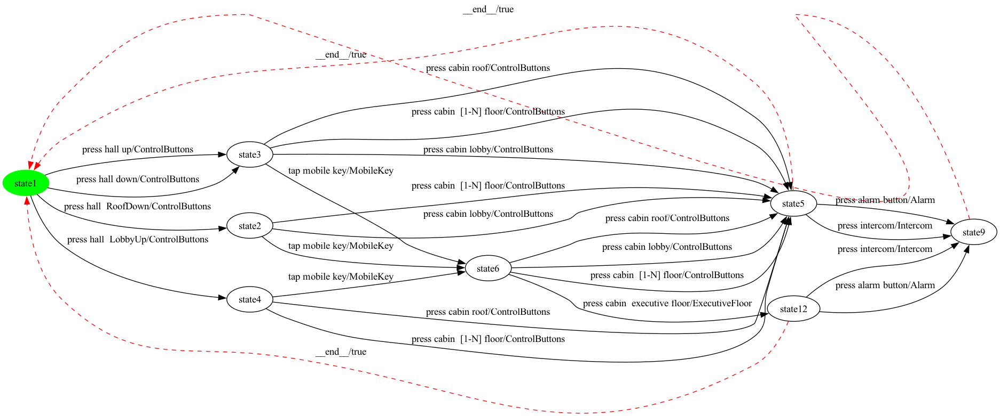

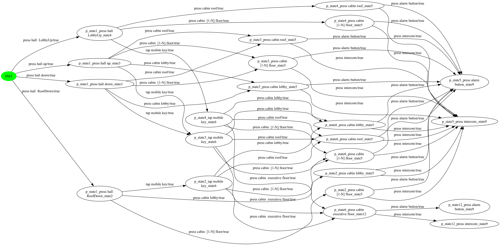

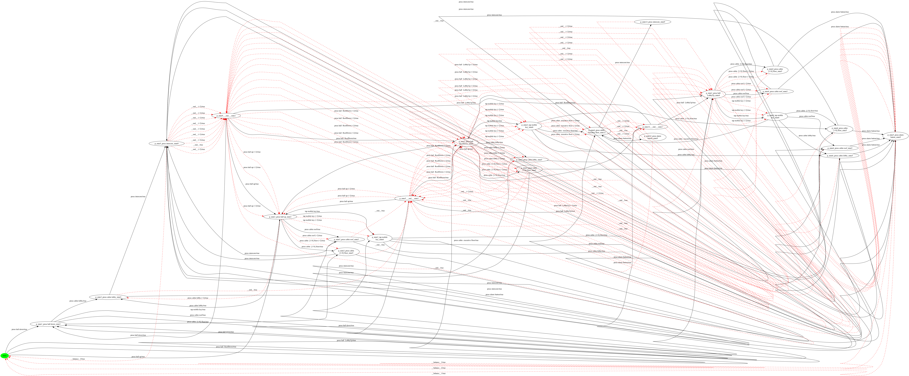

**Generated test suite** — 25 unique test case(s) after action-sequence dedup (25 pair-graph segment(s), 72 raw real step(s); pair-graph cycle has 78 edge(s) total, 26 synthetic dropped at translation). Operationally-identical trips (same action sequence, possibly different transition-level pairs) are listed once.

- **test case 1**: `press hall RoofDown -> press cabin lobby -> press alarm button`
- **test case 2**: `press hall RoofDown -> press cabin [1-N] floor -> press alarm button`
- **test case 3**: `press hall RoofDown -> tap mobile key -> press cabin roof -> press alarm button`
- **test case 4**: `press hall down -> press cabin lobby -> press alarm button`
- **test case 5**: `press hall down -> press cabin roof -> press intercom`
- **test case 6**: `press cabin [1-N] floor -> press intercom`
- **test case 7**: `press hall down -> press cabin [1-N] floor -> press alarm button`
- **test case 8**: `press hall down -> tap mobile key -> press cabin [1-N] floor -> press intercom`
- **test case 9**: `press hall up -> press cabin lobby -> press intercom`
- **test case 10**: `press hall LobbyUp -> press cabin roof -> press alarm button`
- **test case 11**: `tap mobile key -> press cabin roof -> press intercom`
- **test case 12**: `tap mobile key -> press cabin lobby -> press intercom`
- **test case 13**: `tap mobile key -> press cabin [1-N] floor -> press alarm button`
- **test case 14**: `tap mobile key -> press cabin executive floor -> press alarm button`
- **test case 15**: `tap mobile key -> press cabin [1-N] floor`
- **test case 16**: `press hall up -> press cabin roof -> press alarm button`
- **test case 17**: `tap mobile key -> press cabin executive floor -> press intercom`
- **test case 18**: `press cabin lobby -> press intercom`
- **test case 19**: `press hall LobbyUp -> tap mobile key -> press cabin roof`
- **test case 20**: `tap mobile key -> press cabin lobby -> press alarm button`
- **test case 21**: `press hall up -> press cabin [1-N] floor -> press intercom`
- **test case 22**: `press hall LobbyUp -> press cabin [1-N] floor -> press alarm button`
- **test case 23**: `press hall up -> tap mobile key -> press cabin lobby`
- **test case 24**: `tap mobile key -> press cabin executive floor`
- **test case 25**: `press cabin roof -> press intercom`

### Product 8

**Selected features:** selected = {Alarm, ControlButtons, ExecutiveFloor, ManualDoorControl, PinPad}

**Repaired FTS:** 10 states, 31 transitions (26 real / 5 `__end__`).

**Pair graph (raw):** 27 nodes (incl. INIT), 69 edges (every edge = one contiguous transition pair in the original FTS; the subset starting at INIT correspond to pairs `(start, t)` for any original initial-state outgoing `t`).

**Pair graph (balanced):** 27 nodes, 102 edges (33 synthetic `__balance__N` added to restore in-balance at INIT).

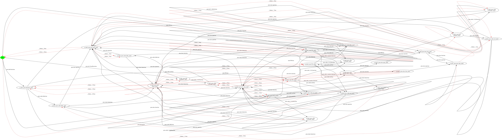

**Generated test suite** — 29 unique test case(s) after action-sequence dedup (29 pair-graph segment(s), 90 raw real step(s); pair-graph cycle has 102 edge(s) total, 33 synthetic dropped at translation). Operationally-identical trips (same action sequence, possibly different transition-level pairs) are listed once.

- **test case 1**: `press hall RoofDown -> press cabin lobby -> press door open -> press door close -> press door open -> press door close`
- **test case 2**: `press hall down -> press cabin lobby -> press door open`
- **test case 3**: `press cabin roof -> press alarm button`
- **test case 4**: `press hall LobbyUp -> press cabin roof -> press door open`
- **test case 5**: `press cabin lobby -> press alarm button`
- **test case 6**: `press hall RoofDown -> enter PIN -> press cabin lobby -> press door open`
- **test case 7**: `press cabin lobby -> press door close -> press door open`
- **test case 8**: `press hall RoofDown -> press cabin [1-N] floor -> press door close`
- **test case 9**: `enter PIN -> press cabin [1-N] floor -> press door close`
- **test case 10**: `enter PIN -> press cabin [1-N] floor -> press alarm button`
- **test case 11**: `press cabin [1-N] floor -> press door open`
- **test case 12**: `enter PIN -> press cabin [1-N] floor -> press door open`
- **test case 13**: `enter PIN -> press cabin roof -> press alarm button`
- **test case 14**: `press hall down -> press cabin roof -> press door open`
- **test case 15**: `press cabin [1-N] floor -> press door close`
- **test case 16**: `enter PIN -> press cabin executive floor -> press door open -> press door close`
- **test case 17**: `press hall LobbyUp -> press cabin [1-N] floor -> press alarm button`
- **test case 18**: `press hall down -> enter PIN -> press cabin lobby -> press door close`
- **test case 19**: `enter PIN -> press cabin roof -> press door close`
- **test case 20**: `press cabin [1-N] floor -> press alarm button`
- **test case 21**: `press hall down -> press cabin [1-N] floor -> press alarm button`
- **test case 22**: `press cabin roof -> press door close`
- **test case 23**: `press hall up -> press cabin lobby -> press door close`
- **test case 24**: `press hall up -> press cabin roof -> press alarm button`
- **test case 25**: `enter PIN -> press cabin executive floor -> press door close -> press door open`
- **test case 26**: `press hall up -> press cabin [1-N] floor -> press door close`
- **test case 27**: `press hall up -> enter PIN -> press cabin executive floor -> press alarm button`
- **test case 28**: `press hall LobbyUp -> enter PIN -> press cabin lobby -> press alarm button`
- **test case 29**: `enter PIN -> press cabin roof -> press door open`

### Product 9

**Selected features:** selected = {ControlButtons, ExecutiveFloor, Intercom, ManualDoorControl, PinPad}

**Repaired FTS:** 10 states, 31 transitions (26 real / 5 `__end__`).

**Pair graph (raw):** 27 nodes (incl. INIT), 69 edges (every edge = one contiguous transition pair in the original FTS; the subset starting at INIT correspond to pairs `(start, t)` for any original initial-state outgoing `t`).

**Pair graph (balanced):** 27 nodes, 102 edges (33 synthetic `__balance__N` added to restore in-balance at INIT).

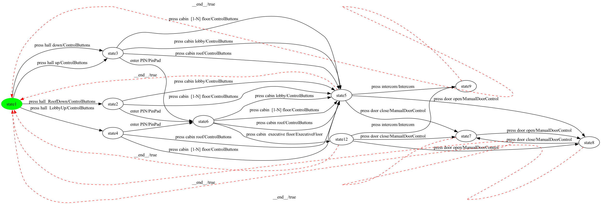

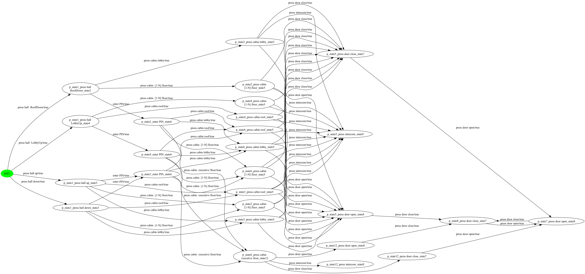

**Generated test suite** — 28 unique test case(s) after action-sequence dedup (28 pair-graph segment(s), 88 raw real step(s); pair-graph cycle has 102 edge(s) total, 33 synthetic dropped at translation). Operationally-identical trips (same action sequence, possibly different transition-level pairs) are listed once.

- **test case 1**: `press hall RoofDown -> press cabin lobby -> press door open -> press door close -> press door open -> press door close`
- **test case 2**: `enter PIN -> press cabin [1-N] floor -> press intercom`
- **test case 3**: `press hall down -> press cabin lobby -> press door open`
- **test case 4**: `press cabin roof -> press door open`
- **test case 5**: `press cabin lobby -> press intercom`
- **test case 6**: `press hall LobbyUp -> press cabin roof -> press intercom`
- **test case 7**: `press hall LobbyUp -> press cabin [1-N] floor -> press door close -> press door open`
- **test case 8**: `press hall RoofDown -> enter PIN -> press cabin lobby -> press door open`
- **test case 9**: `press cabin lobby -> press door close`
- **test case 10**: `enter PIN -> press cabin executive floor -> press door open -> press door close`
- **test case 11**: `enter PIN -> press cabin roof -> press door close`
- **test case 12**: `enter PIN -> press cabin [1-N] floor -> press door close`
- **test case 13**: `enter PIN -> press cabin executive floor -> press door close -> press door open`
- **test case 14**: `press cabin roof -> press door close`
- **test case 15**: `enter PIN -> press cabin roof -> press intercom`
- **test case 16**: `press hall RoofDown -> press cabin [1-N] floor -> press door close`
- **test case 17**: `press cabin [1-N] floor -> press door open`
- **test case 18**: `enter PIN -> press cabin [1-N] floor -> press door open`
- **test case 19**: `enter PIN -> press cabin roof -> press door open`
- **test case 20**: `press cabin [1-N] floor -> press intercom`
- **test case 21**: `press hall up -> press cabin lobby -> press door close`
- **test case 22**: `press hall down -> press cabin roof -> press intercom`
- **test case 23**: `press hall down -> enter PIN -> press cabin lobby -> press intercom`
- **test case 24**: `press hall down -> press cabin [1-N] floor -> press door close`
- **test case 25**: `press hall up -> press cabin roof -> press door open`
- **test case 26**: `press hall LobbyUp -> enter PIN -> press cabin lobby -> press door close`
- **test case 27**: `press hall up -> press cabin [1-N] floor -> press intercom`
- **test case 28**: `press hall up -> enter PIN -> press cabin executive floor -> press intercom`

### Product 10

**Selected features:** selected = {ControlButtons, FirefighterService, Intercom}

**Repaired FTS:** 10 states, 24 transitions (20 real / 4 `__end__`).

**Pair graph (raw):** 21 nodes (incl. INIT), 45 edges (every edge = one contiguous transition pair in the original FTS; the subset starting at INIT correspond to pairs `(start, t)` for any original initial-state outgoing `t`).

**Pair graph (balanced):** 21 nodes, 66 edges (21 synthetic `__balance__N` added to restore in-balance at INIT).

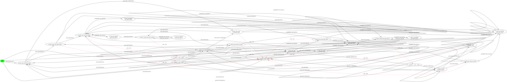

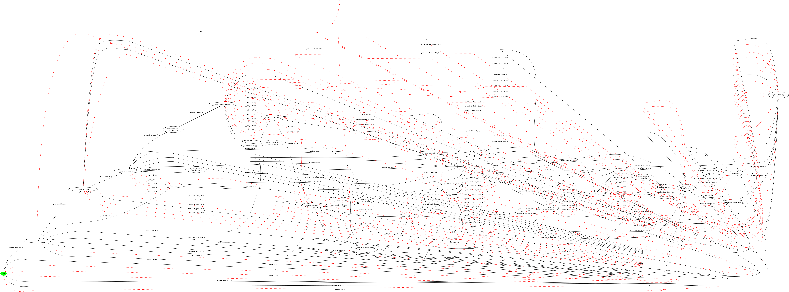

**Generated test suite** — 18 unique test case(s) after action-sequence dedup (18 pair-graph segment(s), 56 raw real step(s); pair-graph cycle has 66 edge(s) total, 21 synthetic dropped at translation). Operationally-identical trips (same action sequence, possibly different transition-level pairs) are listed once.

- **test case 1**: `press hall down -> press cabin lobby -> press&hold door close -> release door close -> press&hold door close -> release door close`
- **test case 2**: `press cabin lobby -> press intercom -> press&hold door open -> release door open -> press&hold door open -> release door open`
- **test case 3**: `press hall up -> press cabin lobby -> press&hold door open -> release door open`
- **test case 4**: `press hall LobbyUp -> press cabin roof -> press intercom -> press&hold door close -> release door close`
- **test case 5**: `press cabin roof -> press&hold door close`
- **test case 6**: `press cabin roof -> press&hold door open`
- **test case 7**: `press hall RoofDown -> press cabin [1-N] floor -> press&hold door open`
- **test case 8**: `press hall LobbyUp -> press cabin [1-N] floor -> press&hold door close`
- **test case 9**: `press cabin lobby -> press intercom`
- **test case 10**: `press hall RoofDown -> press cabin lobby -> press&hold door close`
- **test case 11**: `press cabin lobby -> press&hold door open`
- **test case 12**: `press cabin [1-N] floor -> press&hold door close`
- **test case 13**: `press cabin [1-N] floor -> press&hold door open`
- **test case 14**: `press hall down -> press cabin roof -> press intercom`
- **test case 15**: `press cabin [1-N] floor -> press intercom`
- **test case 16**: `press hall up -> press cabin [1-N] floor -> press&hold door open`
- **test case 17**: `press hall down -> press cabin [1-N] floor -> press intercom`
- **test case 18**: `press hall up -> press cabin roof -> press&hold door close`

### Product 11

**Selected features:** selected = {Alarm, ControlButtons, FirefighterService, Intercom, ManualDoorControl}

**Repaired FTS:** 12 states, 31 transitions (25 real / 6 `__end__`).

**Pair graph (raw):** 26 nodes (incl. INIT), 72 edges (every edge = one contiguous transition pair in the original FTS; the subset starting at INIT correspond to pairs `(start, t)` for any original initial-state outgoing `t`).

**Pair graph (balanced):** 26 nodes, 114 edges (42 synthetic `__balance__N` added to restore in-balance at INIT).

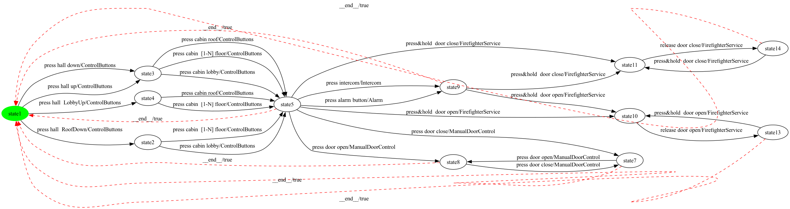

**Generated test suite** — 33 unique test case(s) after action-sequence dedup (33 pair-graph segment(s), 92 raw real step(s); pair-graph cycle has 114 edge(s) total, 42 synthetic dropped at translation). Operationally-identical trips (same action sequence, possibly different transition-level pairs) are listed once.

- **test case 1**: `press hall RoofDown -> press cabin lobby -> press door open -> press door close -> press door open -> press door close`
- **test case 2**: `press cabin [1-N] floor -> press&hold door close -> release door close -> press&hold door close -> release door close`
- **test case 3**: `press cabin lobby -> press&hold door close`
- **test case 4**: `press cabin lobby -> press door open`
- **test case 5**: `press cabin [1-N] floor -> press door close -> press door open`
- **test case 6**: `press cabin lobby -> press alarm button -> press&hold door close -> release door close`
- **test case 7**: `press cabin lobby -> press intercom -> press&hold door open -> release door open -> press&hold door open -> release door open`
- **test case 8**: `press cabin lobby -> press alarm button -> press&hold door open`
- **test case 9**: `press cabin [1-N] floor -> press&hold door open -> release door open`
- **test case 10**: `press cabin roof -> press alarm button`
- **test case 11**: `press hall down -> press cabin lobby -> press door close`
- **test case 12**: `press cabin [1-N] floor -> press door close`
- **test case 13**: `press cabin [1-N] floor -> press alarm button`
- **test case 14**: `press cabin roof -> press&hold door open`
- **test case 15**: `press cabin lobby -> press&hold door open`
- **test case 16**: `press cabin lobby -> press intercom -> press&hold door close`
- **test case 17**: `press hall down -> press cabin roof -> press intercom`
- **test case 18**: `press hall LobbyUp -> press cabin roof -> press&hold door close`
- **test case 19**: `press cabin lobby -> press door close`
- **test case 20**: `press cabin [1-N] floor -> press door open`
- **test case 21**: `press cabin [1-N] floor -> press&hold door open`
- **test case 22**: `press cabin [1-N] floor -> press intercom`
- **test case 23**: `press hall RoofDown -> press cabin [1-N] floor -> press&hold door close`
- **test case 24**: `press cabin roof -> press door open`
- **test case 25**: `press hall down -> press cabin [1-N] floor -> press door open`
- **test case 26**: `press hall up -> press cabin lobby -> press&hold door open`
- **test case 27**: `press cabin [1-N] floor -> press&hold door close`
- **test case 28**: `press cabin roof -> press intercom`
- **test case 29**: `press cabin roof -> press&hold door close`
- **test case 30**: `press cabin roof -> press door close`
- **test case 31**: `press hall up -> press cabin roof -> press door open`
- **test case 32**: `press hall LobbyUp -> press cabin [1-N] floor -> press alarm button`
- **test case 33**: `press hall up -> press cabin [1-N] floor -> press intercom`

### Product 12

**Selected features:** selected = {Alarm, ControlButtons, ExecutiveFloor, PinPad}

**Repaired FTS:** 8 states, 23 transitions (20 real / 3 `__end__`).

**Pair graph (raw):** 21 nodes (incl. INIT), 41 edges (every edge = one contiguous transition pair in the original FTS; the subset starting at INIT correspond to pairs `(start, t)` for any original initial-state outgoing `t`).

**Pair graph (balanced):** 21 nodes, 63 edges (22 synthetic `__balance__N` added to restore in-balance at INIT).

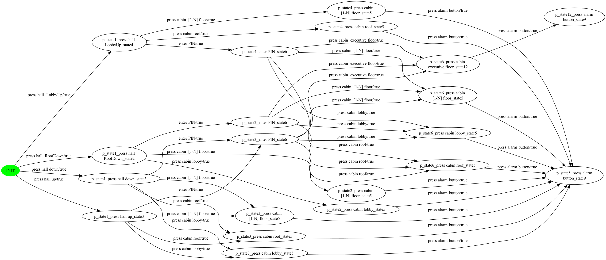

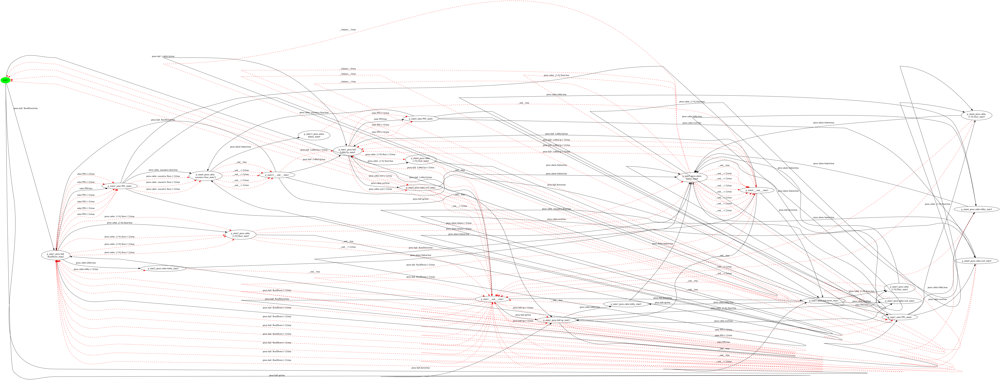

**Generated test suite** — 20 unique test case(s) after action-sequence dedup (20 pair-graph segment(s), 55 raw real step(s); pair-graph cycle has 63 edge(s) total, 22 synthetic dropped at translation). Operationally-identical trips (same action sequence, possibly different transition-level pairs) are listed once.

- **test case 1**: `press hall down -> press cabin lobby -> press alarm button`
- **test case 2**: `press hall down -> press cabin roof -> press alarm button`
- **test case 3**: `press hall down -> enter PIN -> press cabin roof -> press alarm button`
- **test case 4**: `press hall down -> press cabin [1-N] floor -> press alarm button`
- **test case 5**: `enter PIN -> press cabin [1-N] floor -> press alarm button`
- **test case 6**: `enter PIN -> press cabin executive floor -> press alarm button`
- **test case 7**: `press hall up -> press cabin lobby`
- **test case 8**: `enter PIN -> press cabin lobby -> press alarm button`
- **test case 9**: `enter PIN -> press cabin roof`
- **test case 10**: `press hall LobbyUp -> press cabin roof -> press alarm button`
- **test case 11**: `enter PIN -> press cabin [1-N] floor`
- **test case 12**: `press hall up -> press cabin roof`
- **test case 13**: `press hall RoofDown -> enter PIN -> press cabin lobby`
- **test case 14**: `press hall LobbyUp -> enter PIN -> press cabin lobby`
- **test case 15**: `press hall LobbyUp -> press cabin [1-N] floor -> press alarm button`
- **test case 16**: `enter PIN -> press cabin executive floor`
- **test case 17**: `press hall RoofDown -> press cabin [1-N] floor -> press alarm button`
- **test case 18**: `press hall up -> enter PIN -> press cabin [1-N] floor`
- **test case 19**: `press hall up -> press cabin [1-N] floor`
- **test case 20**: `press hall RoofDown -> press cabin lobby -> press alarm button`

### Product 13

**Selected features:** selected = {Alarm, ControlButtons, FirefighterService, ManualDoorControl}

**Repaired FTS:** 12 states, 30 transitions (24 real / 6 `__end__`).

**Pair graph (raw):** 25 nodes (incl. INIT), 63 edges (every edge = one contiguous transition pair in the original FTS; the subset starting at INIT correspond to pairs `(start, t)` for any original initial-state outgoing `t`).

**Pair graph (balanced):** 25 nodes, 98 edges (35 synthetic `__balance__N` added to restore in-balance at INIT).

**Generated test suite** — 26 unique test case(s) after action-sequence dedup (26 pair-graph segment(s), 76 raw real step(s); pair-graph cycle has 98 edge(s) total, 35 synthetic dropped at translation). Operationally-identical trips (same action sequence, possibly different transition-level pairs) are listed once.

- **test case 1**: `press hall RoofDown -> press cabin lobby -> press door open -> press door close -> press door open -> press door close`
- **test case 2**: `press cabin [1-N] floor -> press&hold door close -> release door close -> press&hold door close -> release door close`
- **test case 3**: `press cabin lobby -> press&hold door close`
- **test case 4**: `press cabin roof -> press alarm button -> press&hold door close -> release door close`
- **test case 5**: `press cabin lobby -> press door open`
- **test case 6**: `press hall down -> press cabin lobby -> press alarm button -> press&hold door open -> release door open -> press&hold door open -> release door open`
- **test case 7**: `press cabin lobby -> press alarm button`
- **test case 8**: `press hall down -> press cabin roof -> press&hold door open -> release door open`
- **test case 9**: `press cabin roof -> press&hold door close`
- **test case 10**: `press cabin roof -> press&hold door open`
- **test case 11**: `press cabin [1-N] floor -> press door close -> press door open`
- **test case 12**: `press cabin lobby -> press door close`
- **test case 13**: `press cabin [1-N] floor -> press&hold door open`
- **test case 14**: `press cabin [1-N] floor -> press&hold door close`
- **test case 15**: `press cabin roof -> press door open`
- **test case 16**: `press hall up -> press cabin lobby -> press&hold door open`
- **test case 17**: `press cabin [1-N] floor -> press alarm button`
- **test case 18**: `press hall down -> press cabin [1-N] floor -> press door open`
- **test case 19**: `press hall LobbyUp -> press cabin roof -> press door close`
- **test case 20**: `press cabin [1-N] floor -> press door close`
- **test case 21**: `press cabin lobby -> press&hold door open`
- **test case 22**: `press hall LobbyUp -> press cabin [1-N] floor -> press door open`
- **test case 23**: `press hall RoofDown -> press cabin [1-N] floor -> press door open`
- **test case 24**: `press hall up -> press cabin roof -> press alarm button`
- **test case 25**: `press cabin roof -> press door close`
- **test case 26**: `press hall up -> press cabin [1-N] floor -> press&hold door open`

### Product 14

**Selected features:** selected = {Alarm, CardReader, ControlButtons, ExecutiveFloor, Intercom}

**Repaired FTS:** 8 states, 25 transitions (22 real / 3 `__end__`).

**Pair graph (raw):** 23 nodes (incl. INIT), 52 edges (every edge = one contiguous transition pair in the original FTS; the subset starting at INIT correspond to pairs `(start, t)` for any original initial-state outgoing `t`).

**Pair graph (balanced):** 23 nodes, 78 edges (26 synthetic `__balance__N` added to restore in-balance at INIT).

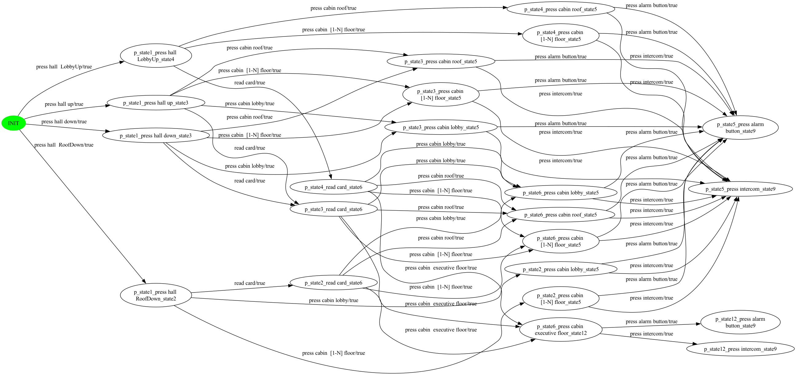

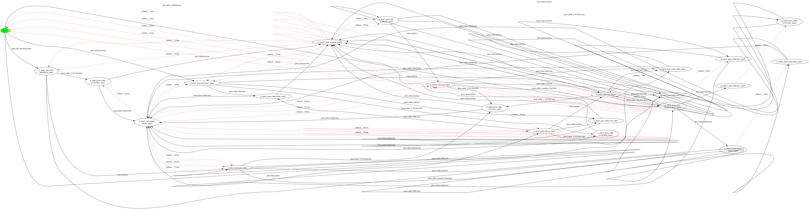

**Generated test suite** — 25 unique test case(s) after action-sequence dedup (25 pair-graph segment(s), 72 raw real step(s); pair-graph cycle has 78 edge(s) total, 26 synthetic dropped at translation). Operationally-identical trips (same action sequence, possibly different transition-level pairs) are listed once.

- **test case 1**: `press hall RoofDown -> read card -> press cabin [1-N] floor -> press intercom`
- **test case 2**: `press hall down -> press cabin lobby -> press alarm button`
- **test case 3**: `press hall down -> press cabin roof -> press intercom`
- **test case 4**: `press hall up -> press cabin lobby -> press intercom`
- **test case 5**: `press hall LobbyUp -> read card -> press cabin executive floor -> press alarm button`
- **test case 6**: `press cabin lobby -> press alarm button`
- **test case 7**: `read card -> press cabin executive floor -> press intercom`
- **test case 8**: `press cabin [1-N] floor -> press intercom`
- **test case 9**: `press hall LobbyUp -> press cabin roof -> press alarm button`
- **test case 10**: `read card -> press cabin lobby -> press intercom`
- **test case 11**: `press hall LobbyUp -> press cabin [1-N] floor -> press alarm button`
- **test case 12**: `read card -> press cabin roof -> press alarm button`
- **test case 13**: `read card -> press cabin [1-N] floor -> press alarm button`
- **test case 14**: `read card -> press cabin lobby -> press alarm button`
- **test case 15**: `read card -> press cabin roof -> press intercom`
- **test case 16**: `press hall RoofDown -> press cabin lobby -> press intercom`
- **test case 17**: `press hall RoofDown -> press cabin [1-N] floor -> press alarm button`
- **test case 18**: `press hall down -> read card -> press cabin executive floor`
- **test case 19**: `press cabin roof -> press intercom`
- **test case 20**: `press hall down -> press cabin [1-N] floor -> press alarm button`
- **test case 21**: `press hall up -> press cabin roof -> press alarm button`
- **test case 22**: `press hall up -> read card -> press cabin roof`
- **test case 23**: `read card -> press cabin lobby`
- **test case 24**: `read card -> press cabin [1-N] floor`
- **test case 25**: `press hall up -> press cabin [1-N] floor -> press intercom`

### Product 15

**Selected features:** selected = {ControlButtons, FirefighterService, Intercom, ManualDoorControl}

**Repaired FTS:** 12 states, 30 transitions (24 real / 6 `__end__`).

**Pair graph (raw):** 25 nodes (incl. INIT), 63 edges (every edge = one contiguous transition pair in the original FTS; the subset starting at INIT correspond to pairs `(start, t)` for any original initial-state outgoing `t`).

**Pair graph (balanced):** 25 nodes, 98 edges (35 synthetic `__balance__N` added to restore in-balance at INIT).

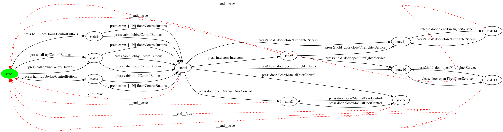

**Generated test suite** — 28 unique test case(s) after action-sequence dedup (28 pair-graph segment(s), 80 raw real step(s); pair-graph cycle has 98 edge(s) total, 35 synthetic dropped at translation). Operationally-identical trips (same action sequence, possibly different transition-level pairs) are listed once.

- **test case 1**: `press hall RoofDown -> press cabin lobby -> press door open -> press door close -> press door open -> press door close`
- **test case 2**: `press cabin roof -> press&hold door open -> release door open -> press&hold door open -> release door open`
- **test case 3**: `press cabin lobby -> press&hold door close -> release door close -> press&hold door close -> release door close`
- **test case 4**: `press cabin lobby -> press&hold door close`
- **test case 5**: `press cabin roof -> press&hold door close`
- **test case 6**: `press cabin roof -> press&hold door open`
- **test case 7**: `press cabin [1-N] floor -> press door close -> press door open`
- **test case 8**: `press cabin lobby -> press door open`
- **test case 9**: `press hall down -> press cabin lobby -> press intercom -> press&hold door open -> release door open`
- **test case 10**: `press cabin lobby -> press&hold door open`
- **test case 11**: `press cabin [1-N] floor -> press&hold door open`
- **test case 12**: `press cabin [1-N] floor -> press intercom -> press&hold door close -> release door close`
- **test case 13**: `press cabin lobby -> press door close`
- **test case 14**: `press cabin [1-N] floor -> press&hold door close`
- **test case 15**: `press cabin roof -> press door open`
- **test case 16**: `press hall up -> press cabin lobby -> press&hold door open`
- **test case 17**: `press hall LobbyUp -> press cabin roof -> press intercom`
- **test case 18**: `press cabin roof -> press door close`
- **test case 19**: `press cabin [1-N] floor -> press door close`
- **test case 20**: `press cabin [1-N] floor -> press door open`
- **test case 21**: `press hall LobbyUp -> press cabin [1-N] floor -> press door open`
- **test case 22**: `press hall RoofDown -> press cabin [1-N] floor -> press&hold door close`
- **test case 23**: `press cabin lobby -> press intercom`
- **test case 24**: `press hall down -> press cabin roof -> press intercom`
- **test case 25**: `press hall down -> press cabin [1-N] floor -> press door open`
- **test case 26**: `press cabin [1-N] floor -> press intercom`
- **test case 27**: `press hall up -> press cabin roof -> press door open`
- **test case 28**: `press hall up -> press cabin [1-N] floor -> press&hold door open`

### Product 16

**Selected features:** selected = {Alarm, CardReader, ControlButtons}

**Repaired FTS:** 7 states, 20 transitions (18 real / 2 `__end__`).

**Pair graph (raw):** 19 nodes (incl. INIT), 37 edges (every edge = one contiguous transition pair in the original FTS; the subset starting at INIT correspond to pairs `(start, t)` for any original initial-state outgoing `t`).

**Pair graph (balanced):** 19 nodes, 56 edges (19 synthetic `__balance__N` added to restore in-balance at INIT).

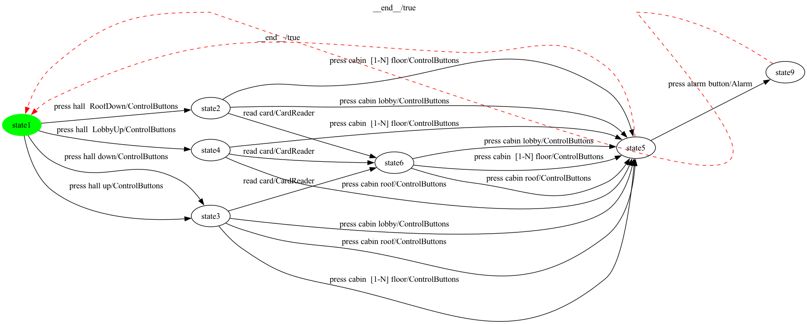

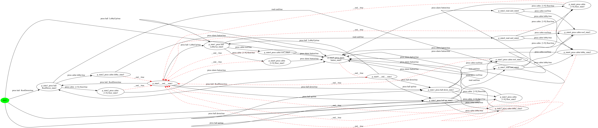

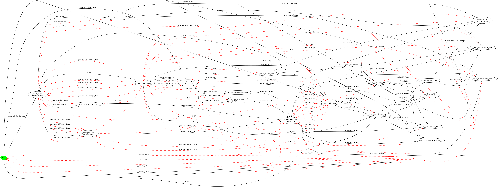

**Generated test suite** — 18 unique test case(s) after action-sequence dedup (18 pair-graph segment(s), 50 raw real step(s); pair-graph cycle has 56 edge(s) total, 19 synthetic dropped at translation). Operationally-identical trips (same action sequence, possibly different transition-level pairs) are listed once.

- **test case 1**: `press hall down -> press cabin lobby -> press alarm button`
- **test case 2**: `press hall RoofDown -> read card -> press cabin lobby -> press alarm button`
- **test case 3**: `press hall RoofDown -> press cabin [1-N] floor -> press alarm button`
- **test case 4**: `press hall down -> press cabin roof -> press alarm button`
- **test case 5**: `press hall down -> press cabin [1-N] floor -> press alarm button`
- **test case 6**: `press hall down -> read card -> press cabin [1-N] floor -> press alarm button`
- **test case 7**: `read card -> press cabin [1-N] floor`
- **test case 8**: `press hall up -> press cabin lobby`
- **test case 9**: `read card -> press cabin roof -> press alarm button`
- **test case 10**: `read card -> press cabin roof`
- **test case 11**: `press hall up -> press cabin roof`
- **test case 12**: `press hall LobbyUp -> press cabin roof -> press alarm button`
- **test case 13**: `press hall up -> press cabin [1-N] floor`
- **test case 14**: `press hall LobbyUp -> press cabin [1-N] floor -> press alarm button`
- **test case 15**: `read card -> press cabin lobby`
- **test case 16**: `press hall LobbyUp -> read card -> press cabin roof`
- **test case 17**: `press hall RoofDown -> press cabin lobby -> press alarm button`
- **test case 18**: `press hall up -> read card -> press cabin lobby`

### Product 17

**Selected features:** selected = {Alarm, CardReader, ControlButtons, Intercom}

**Repaired FTS:** 7 states, 21 transitions (19 real / 2 `__end__`).

**Pair graph (raw):** 20 nodes (incl. INIT), 47 edges (every edge = one contiguous transition pair in the original FTS; the subset starting at INIT correspond to pairs `(start, t)` for any original initial-state outgoing `t`).

**Pair graph (balanced):** 20 nodes, 70 edges (23 synthetic `__balance__N` added to restore in-balance at INIT).

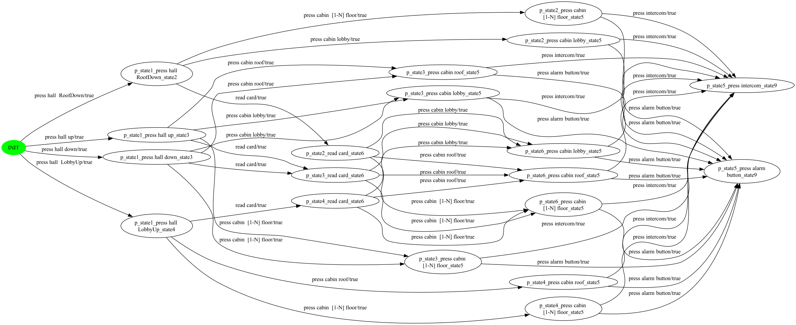

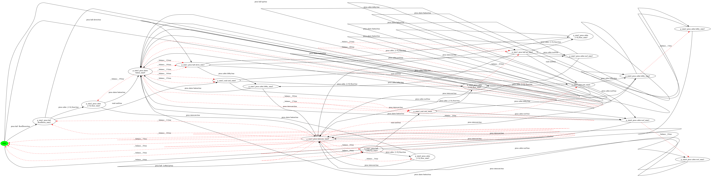

**Generated test suite** — 22 unique test case(s) after action-sequence dedup (22 pair-graph segment(s), 64 raw real step(s); pair-graph cycle has 70 edge(s) total, 23 synthetic dropped at translation). Operationally-identical trips (same action sequence, possibly different transition-level pairs) are listed once.

- **test case 1**: `press hall down -> press cabin lobby -> press intercom`
- **test case 2**: `read card -> press cabin [1-N] floor -> press alarm button`
- **test case 3**: `press hall down -> press cabin roof -> press intercom`
- **test case 4**: `press cabin [1-N] floor -> press alarm button`
- **test case 5**: `press hall down -> press cabin [1-N] floor -> press alarm button`
- **test case 6**: `press hall down -> read card -> press cabin roof -> press intercom`
- **test case 7**: `press hall up -> press cabin lobby -> press alarm button`
- **test case 8**: `read card -> press cabin lobby -> press intercom`
- **test case 9**: `press hall LobbyUp -> press cabin roof -> press intercom`
- **test case 10**: `press hall RoofDown -> read card -> press cabin [1-N] floor -> press intercom`
- **test case 11**: `press hall LobbyUp -> press cabin [1-N] floor -> press intercom`
- **test case 12**: `press hall LobbyUp -> read card -> press cabin [1-N] floor`
- **test case 13**: `press hall up -> press cabin roof -> press alarm button`
- **test case 14**: `read card -> press cabin roof -> press alarm button`
- **test case 15**: `read card -> press cabin lobby -> press alarm button`
- **test case 16**: `read card -> press cabin roof`
- **test case 17**: `press cabin roof -> press alarm button`
- **test case 18**: `press hall up -> press cabin [1-N] floor -> press intercom`
- **test case 19**: `press hall RoofDown -> press cabin [1-N] floor -> press intercom`
- **test case 20**: `press hall RoofDown -> press cabin lobby -> press alarm button`
- **test case 21**: `press hall up -> read card -> press cabin lobby`
- **test case 22**: `press cabin lobby -> press intercom`

### Product 18

**Selected features:** selected = {Alarm, ControlButtons, ExecutiveFloor, MobileKey}

**Repaired FTS:** 8 states, 23 transitions (20 real / 3 `__end__`).

**Pair graph (raw):** 21 nodes (incl. INIT), 41 edges (every edge = one contiguous transition pair in the original FTS; the subset starting at INIT correspond to pairs `(start, t)` for any original initial-state outgoing `t`).

**Pair graph (balanced):** 21 nodes, 63 edges (22 synthetic `__balance__N` added to restore in-balance at INIT).

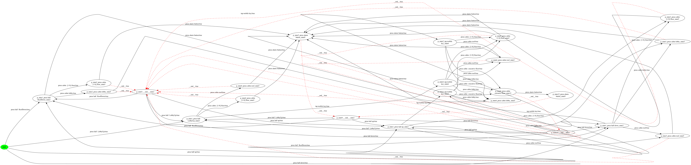

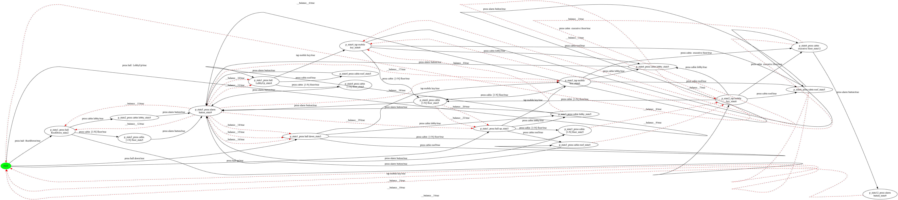

**Generated test suite** — 19 unique test case(s) after action-sequence dedup (19 pair-graph segment(s), 53 raw real step(s); pair-graph cycle has 63 edge(s) total, 22 synthetic dropped at translation). Operationally-identical trips (same action sequence, possibly different transition-level pairs) are listed once.

- **test case 1**: `press hall down -> press cabin lobby -> press alarm button`
- **test case 2**: `press hall LobbyUp -> press cabin roof -> press alarm button`
- **test case 3**: `press hall LobbyUp -> tap mobile key -> press cabin roof -> press alarm button`
- **test case 4**: `press hall RoofDown -> press cabin [1-N] floor -> press alarm button`
- **test case 5**: `press hall RoofDown -> press cabin lobby -> press alarm button`
- **test case 6**: `press hall down -> press cabin roof -> press alarm button`
- **test case 7**: `press hall down -> press cabin [1-N] floor -> press alarm button`
- **test case 8**: `press hall down -> tap mobile key -> press cabin [1-N] floor -> press alarm button`
- **test case 9**: `tap mobile key -> press cabin lobby -> press alarm button`
- **test case 10**: `tap mobile key -> press cabin roof`
- **test case 11**: `press hall up -> press cabin lobby`
- **test case 12**: `tap mobile key -> press cabin lobby`
- **test case 13**: `press hall LobbyUp -> press cabin [1-N] floor -> press alarm button`
- **test case 14**: `press hall up -> tap mobile key -> press cabin executive floor -> press alarm button`
- **test case 15**: `press hall RoofDown -> tap mobile key -> press cabin lobby`
- **test case 16**: `tap mobile key -> press cabin [1-N] floor`
- **test case 17**: `press hall up -> press cabin roof`
- **test case 18**: `tap mobile key -> press cabin executive floor`
- **test case 19**: `press hall up -> press cabin [1-N] floor`

### Product 19

**Selected features:** selected = {Alarm, ControlButtons, ManualDoorControl, MobileKey}

**Repaired FTS:** 9 states, 26 transitions (22 real / 4 `__end__`).

**Pair graph (raw):** 23 nodes (incl. INIT), 61 edges (every edge = one contiguous transition pair in the original FTS; the subset starting at INIT correspond to pairs `(start, t)` for any original initial-state outgoing `t`).

**Pair graph (balanced):** 23 nodes, 91 edges (30 synthetic `__balance__N` added to restore in-balance at INIT).

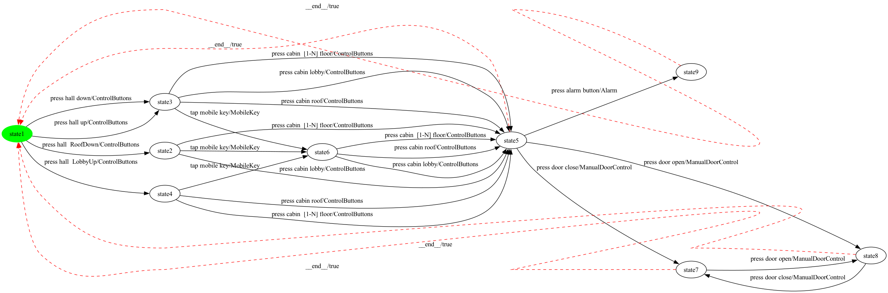

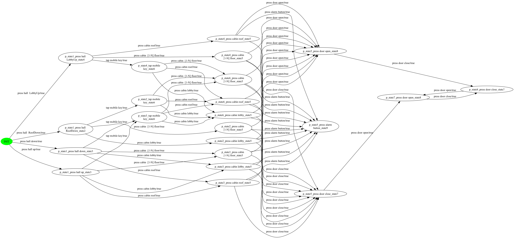

**Generated test suite** — 27 unique test case(s) after action-sequence dedup (27 pair-graph segment(s), 81 raw real step(s); pair-graph cycle has 91 edge(s) total, 30 synthetic dropped at translation). Operationally-identical trips (same action sequence, possibly different transition-level pairs) are listed once.

- **test case 1**: `press hall RoofDown -> press cabin lobby -> press door open -> press door close -> press door open -> press door close`
- **test case 2**: `press hall down -> press cabin lobby -> press door open`
- **test case 3**: `press cabin roof -> press alarm button`
- **test case 4**: `press hall up -> press cabin lobby -> press alarm button`
- **test case 5**: `press hall LobbyUp -> press cabin roof -> press door open`
- **test case 6**: `press cabin roof -> press door close -> press door open`
- **test case 7**: `press cabin lobby -> press door close`
- **test case 8**: `press hall down -> press cabin roof -> press door open`
- **test case 9**: `tap mobile key -> press cabin [1-N] floor -> press door close`
- **test case 10**: `press hall down -> press cabin [1-N] floor -> press door open`
- **test case 11**: `tap mobile key -> press cabin roof -> press alarm button`
- **test case 12**: `tap mobile key -> press cabin roof -> press door close`
- **test case 13**: `tap mobile key -> press cabin [1-N] floor -> press alarm button`
- **test case 14**: `tap mobile key -> press cabin lobby -> press door open`
- **test case 15**: `press cabin lobby -> press alarm button`
- **test case 16**: `press hall LobbyUp -> tap mobile key -> press cabin lobby -> press door close`
- **test case 17**: `press cabin roof -> press door close`
- **test case 18**: `press cabin [1-N] floor -> press door close`
- **test case 19**: `press cabin [1-N] floor -> press alarm button`
- **test case 20**: `press hall LobbyUp -> press cabin [1-N] floor -> press door close`
- **test case 21**: `press hall up -> press cabin roof -> press alarm button`
- **test case 22**: `press hall RoofDown -> press cabin [1-N] floor -> press door open`
- **test case 23**: `press hall up -> press cabin [1-N] floor -> press alarm button`
- **test case 24**: `press hall RoofDown -> tap mobile key -> press cabin [1-N] floor -> press door open`
- **test case 25**: `press hall up -> tap mobile key -> press cabin lobby -> press alarm button`
- **test case 26**: `press hall down -> tap mobile key -> press cabin roof -> press door open`
- **test case 27**: `press cabin [1-N] floor -> press door open`

### Product 20

**Selected features:** selected = {Alarm, ControlButtons, ExecutiveFloor, ManualDoorControl, MobileKey}

**Repaired FTS:** 10 states, 31 transitions (26 real / 5 `__end__`).

**Pair graph (raw):** 27 nodes (incl. INIT), 69 edges (every edge = one contiguous transition pair in the original FTS; the subset starting at INIT correspond to pairs `(start, t)` for any original initial-state outgoing `t`).

**Pair graph (balanced):** 27 nodes, 102 edges (33 synthetic `__balance__N` added to restore in-balance at INIT).

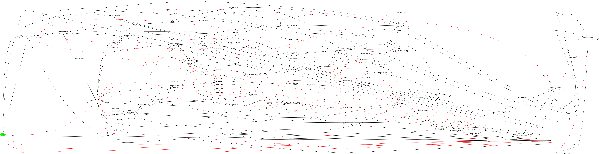

**Generated test suite** — 29 unique test case(s) after action-sequence dedup (29 pair-graph segment(s), 90 raw real step(s); pair-graph cycle has 102 edge(s) total, 33 synthetic dropped at translation). Operationally-identical trips (same action sequence, possibly different transition-level pairs) are listed once.

- **test case 1**: `press hall RoofDown -> press cabin lobby -> press door open -> press door close -> press door open -> press door close`
- **test case 2**: `press hall down -> press cabin lobby -> press door open`
- **test case 3**: `press cabin roof -> press alarm button`
- **test case 4**: `tap mobile key -> press cabin roof -> press alarm button`
- **test case 5**: `tap mobile key -> press cabin lobby -> press door open`
- **test case 6**: `press cabin lobby -> press alarm button`
- **test case 7**: `tap mobile key -> press cabin [1-N] floor -> press door close -> press door open`
- **test case 8**: `press hall LobbyUp -> press cabin roof -> press door open`
- **test case 9**: `press cabin lobby -> press door close`
- **test case 10**: `press hall down -> press cabin roof -> press door open`
- **test case 11**: `tap mobile key -> press cabin [1-N] floor -> press alarm button`
- **test case 12**: `press hall LobbyUp -> tap mobile key -> press cabin roof -> press door close`
- **test case 13**: `tap mobile key -> press cabin [1-N] floor -> press door open`
- **test case 14**: `tap mobile key -> press cabin lobby -> press door close`
- **test case 15**: `tap mobile key -> press cabin roof -> press door open`
- **test case 16**: `tap mobile key -> press cabin executive floor -> press door open -> press door close`
- **test case 17**: `press hall up -> press cabin lobby -> press door close`
- **test case 18**: `press cabin roof -> press door close`
- **test case 19**: `press cabin [1-N] floor -> press door close`
- **test case 20**: `press cabin [1-N] floor -> press alarm button`
- **test case 21**: `press hall RoofDown -> press cabin [1-N] floor -> press door open`
- **test case 22**: `press hall up -> press cabin roof -> press alarm button`
- **test case 23**: `press hall RoofDown -> tap mobile key -> press cabin executive floor -> press alarm button`
- **test case 24**: `press hall LobbyUp -> press cabin [1-N] floor -> press alarm button`
- **test case 25**: `press hall down -> press cabin [1-N] floor -> press door close`
- **test case 26**: `press hall up -> tap mobile key -> press cabin lobby -> press alarm button`
- **test case 27**: `press hall down -> tap mobile key -> press cabin executive floor -> press door close -> press door open`
- **test case 28**: `press hall up -> press cabin [1-N] floor -> press door open`
- **test case 29**: `press cabin [1-N] floor -> press door open`

### Product 21

**Selected features:** selected = {CardReader, ControlButtons, Intercom}

**Repaired FTS:** 7 states, 20 transitions (18 real / 2 `__end__`).

**Pair graph (raw):** 19 nodes (incl. INIT), 37 edges (every edge = one contiguous transition pair in the original FTS; the subset starting at INIT correspond to pairs `(start, t)` for any original initial-state outgoing `t`).

**Pair graph (balanced):** 19 nodes, 56 edges (19 synthetic `__balance__N` added to restore in-balance at INIT).

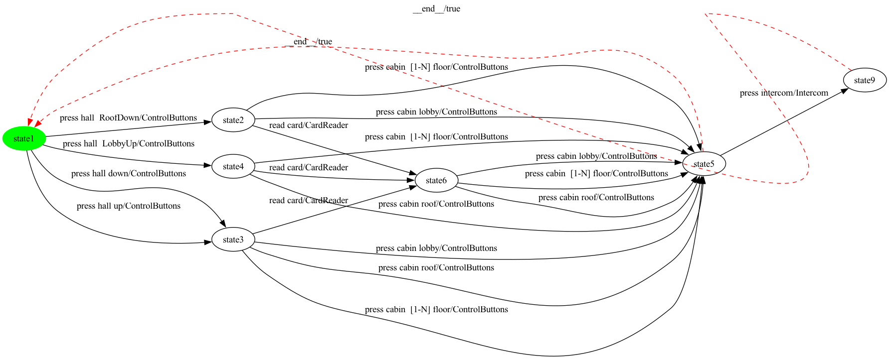

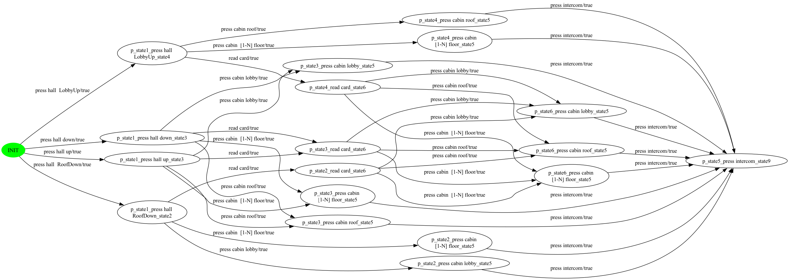

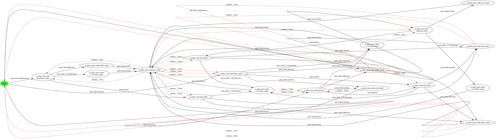

**Generated test suite** — 17 unique test case(s) after action-sequence dedup (17 pair-graph segment(s), 48 raw real step(s); pair-graph cycle has 56 edge(s) total, 19 synthetic dropped at translation). Operationally-identical trips (same action sequence, possibly different transition-level pairs) are listed once.

- **test case 1**: `press hall down -> press cabin lobby -> press intercom`
- **test case 2**: `press hall LobbyUp -> press cabin roof -> press intercom`
- **test case 3**: `press hall RoofDown -> read card -> press cabin lobby -> press intercom`
- **test case 4**: `press hall RoofDown -> press cabin [1-N] floor -> press intercom`
- **test case 5**: `press hall down -> press cabin roof -> press intercom`
- **test case 6**: `press hall down -> press cabin [1-N] floor -> press intercom`
- **test case 7**: `press hall down -> read card -> press cabin [1-N] floor -> press intercom`
- **test case 8**: `read card -> press cabin [1-N] floor`
- **test case 9**: `press hall up -> press cabin lobby`
- **test case 10**: `read card -> press cabin roof -> press intercom`
- **test case 11**: `read card -> press cabin roof`
- **test case 12**: `press hall up -> press cabin roof`
- **test case 13**: `press hall up -> press cabin [1-N] floor`
- **test case 14**: `press hall LobbyUp -> press cabin [1-N] floor -> press intercom`
- **test case 15**: `press hall up -> read card -> press cabin lobby`
- **test case 16**: `press hall LobbyUp -> read card -> press cabin lobby`
- **test case 17**: `press hall RoofDown -> press cabin lobby -> press intercom`

### Product 22

**Selected features:** selected = {Alarm, ControlButtons, ExecutiveFloor, Intercom, PinPad}

**Repaired FTS:** 8 states, 25 transitions (22 real / 3 `__end__`).

**Pair graph (raw):** 23 nodes (incl. INIT), 52 edges (every edge = one contiguous transition pair in the original FTS; the subset starting at INIT correspond to pairs `(start, t)` for any original initial-state outgoing `t`).

**Pair graph (balanced):** 23 nodes, 78 edges (26 synthetic `__balance__N` added to restore in-balance at INIT).

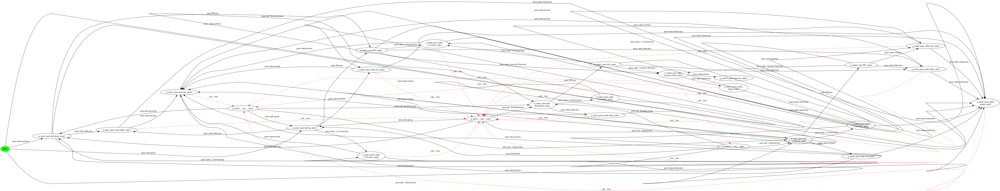

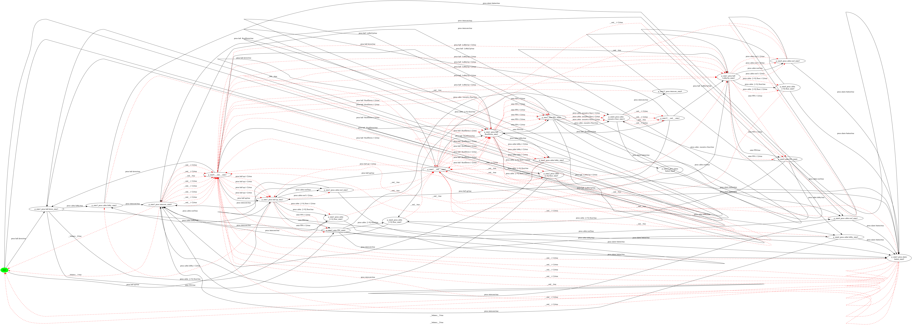

**Generated test suite** — 26 unique test case(s) after action-sequence dedup (26 pair-graph segment(s), 74 raw real step(s); pair-graph cycle has 78 edge(s) total, 26 synthetic dropped at translation). Operationally-identical trips (same action sequence, possibly different transition-level pairs) are listed once.

- **test case 1**: `press hall RoofDown -> press cabin lobby -> press alarm button`
- **test case 2**: `press hall down -> press cabin lobby -> press alarm button`
- **test case 3**: `enter PIN -> press cabin [1-N] floor -> press intercom`
- **test case 4**: `press hall down -> press cabin roof -> press intercom`
- **test case 5**: `press hall up -> press cabin lobby -> press intercom`
- **test case 6**: `press hall LobbyUp -> press cabin roof -> press alarm button`
- **test case 7**: `enter PIN -> press cabin executive floor -> press alarm button`
- **test case 8**: `press cabin lobby -> press intercom`
- **test case 9**: `press hall LobbyUp -> press cabin [1-N] floor -> press intercom`
- **test case 10**: `press hall LobbyUp -> enter PIN -> press cabin roof -> press alarm button`
- **test case 11**: `enter PIN -> press cabin lobby -> press intercom`
- **test case 12**: `press hall RoofDown -> enter PIN -> press cabin lobby -> press alarm button`
- **test case 13**: `enter PIN -> press cabin [1-N] floor -> press alarm button`
- **test case 14**: `enter PIN -> press cabin executive floor -> press intercom`
- **test case 15**: `press cabin [1-N] floor -> press alarm button`
- **test case 16**: `enter PIN -> press cabin roof -> press intercom`
- **test case 17**: `press hall RoofDown -> press cabin [1-N] floor -> press alarm button`
- **test case 18**: `press cabin [1-N] floor -> press intercom`
- **test case 19**: `press hall down -> enter PIN -> press cabin [1-N] floor`
- **test case 20**: `press hall up -> press cabin roof -> press alarm button`
- **test case 21**: `press hall up -> enter PIN -> press cabin roof`
- **test case 22**: `enter PIN -> press cabin lobby`
- **test case 23**: `enter PIN -> press cabin executive floor`
- **test case 24**: `press cabin roof -> press intercom`
- **test case 25**: `press hall down -> press cabin [1-N] floor -> press alarm button`
- **test case 26**: `press hall up -> press cabin [1-N] floor -> press intercom`

### Product 23

**Selected features:** selected = {Alarm, CardReader, ControlButtons, ExecutiveFloor, Intercom, ManualDoorControl}

**Repaired FTS:** 10 states, 33 transitions (28 real / 5 `__end__`).

**Pair graph (raw):** 29 nodes (incl. INIT), 80 edges (every edge = one contiguous transition pair in the original FTS; the subset starting at INIT correspond to pairs `(start, t)` for any original initial-state outgoing `t`).

**Pair graph (balanced):** 29 nodes, 124 edges (44 synthetic `__balance__N` added to restore in-balance at INIT).

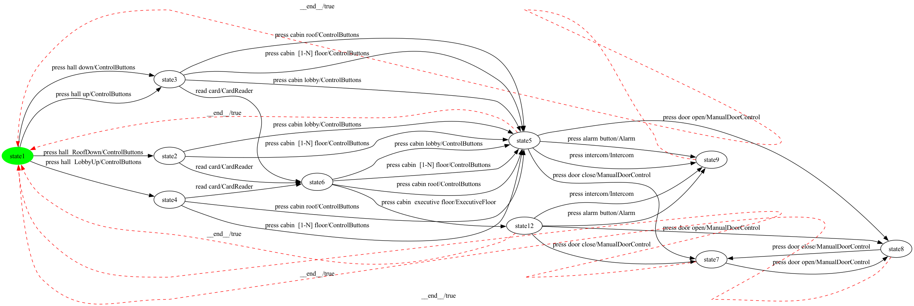

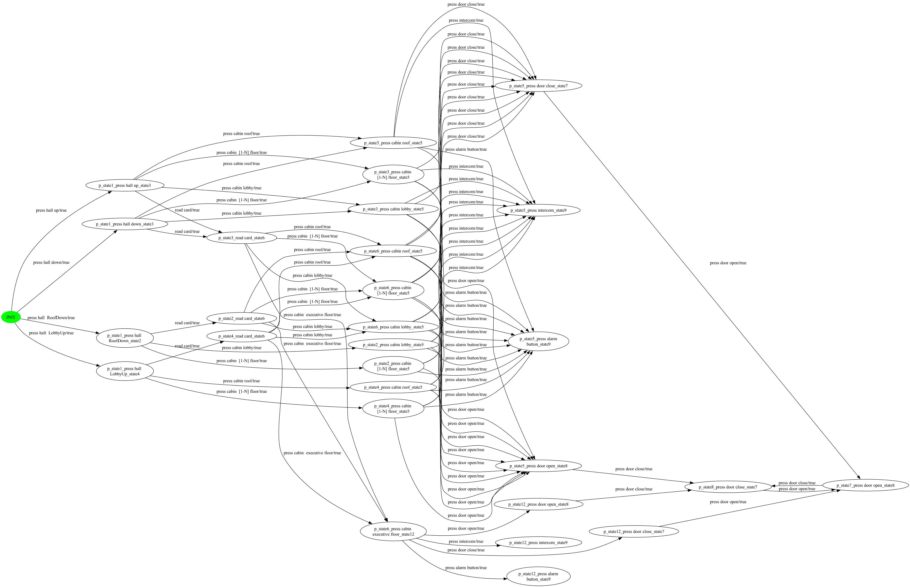

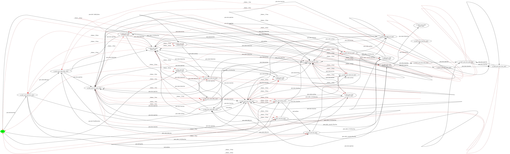

**Generated test suite** — 35 unique test case(s) after action-sequence dedup (35 pair-graph segment(s), 102 raw real step(s); pair-graph cycle has 124 edge(s) total, 44 synthetic dropped at translation). Operationally-identical trips (same action sequence, possibly different transition-level pairs) are listed once.

- **test case 1**: `press hall RoofDown -> read card -> press cabin [1-N] floor -> press intercom`
- **test case 2**: `press cabin [1-N] floor -> press door open -> press door close -> press door open -> press door close`
- **test case 3**: `press hall down -> press cabin lobby -> press door open`
- **test case 4**: `press cabin roof -> press alarm button`
- **test case 5**: `press hall up -> press cabin lobby -> press alarm button`
- **test case 6**: `press hall LobbyUp -> read card -> press cabin executive floor -> press door open -> press door close`
- **test case 7**: `press hall LobbyUp -> press cabin roof -> press door open`
- **test case 8**: `press cabin roof -> press intercom`
- **test case 9**: `press cabin [1-N] floor -> press alarm button`
- **test case 10**: `press hall LobbyUp -> press cabin [1-N] floor -> press door close -> press door open`
- **test case 11**: `press cabin lobby -> press intercom`
- **test case 12**: `press cabin roof -> press door open`
- **test case 13**: `press cabin roof -> press door close`
- **test case 14**: `read card -> press cabin executive floor -> press alarm button`
- **test case 15**: `press cabin [1-N] floor -> press intercom`
- **test case 16**: `read card -> press cabin [1-N] floor -> press door close`
- **test case 17**: `read card -> press cabin lobby -> press door open`
- **test case 18**: `press cabin lobby -> press door open`
- **test case 19**: `press cabin lobby -> press alarm button`
- **test case 20**: `press hall RoofDown -> press cabin lobby -> press intercom`
- **test case 21**: `read card -> press cabin lobby -> press intercom`
- **test case 22**: `read card -> press cabin roof -> press alarm button`
- **test case 23**: `press hall RoofDown -> press cabin [1-N] floor -> press door close`
- **test case 24**: `read card -> press cabin roof -> press door close`
- **test case 25**: `press cabin lobby -> press door close`
- **test case 26**: `press cabin [1-N] floor -> press door open`
- **test case 27**: `press cabin executive floor -> press door close -> press door open`
- **test case 28**: `press hall up -> press cabin roof -> press door close`
- **test case 29**: `press hall up -> press cabin [1-N] floor -> press door close`
- **test case 30**: `press hall up -> read card -> press cabin executive floor -> press intercom`
- **test case 31**: `press hall down -> press cabin roof -> press alarm button`
- **test case 32**: `press hall down -> read card -> press cabin [1-N] floor -> press door open`
- **test case 33**: `read card -> press cabin roof -> press door open`
- **test case 34**: `read card -> press cabin lobby -> press alarm button`
- **test case 35**: `press hall down -> press cabin [1-N] floor -> press intercom`

### Product 24

**Selected features:** selected = {Alarm, ControlButtons, ExecutiveFloor, Intercom, ManualDoorControl, MobileKey}

**Repaired FTS:** 10 states, 33 transitions (28 real / 5 `__end__`).

**Pair graph (raw):** 29 nodes (incl. INIT), 80 edges (every edge = one contiguous transition pair in the original FTS; the subset starting at INIT correspond to pairs `(start, t)` for any original initial-state outgoing `t`).

**Pair graph (balanced):** 29 nodes, 124 edges (44 synthetic `__balance__N` added to restore in-balance at INIT).

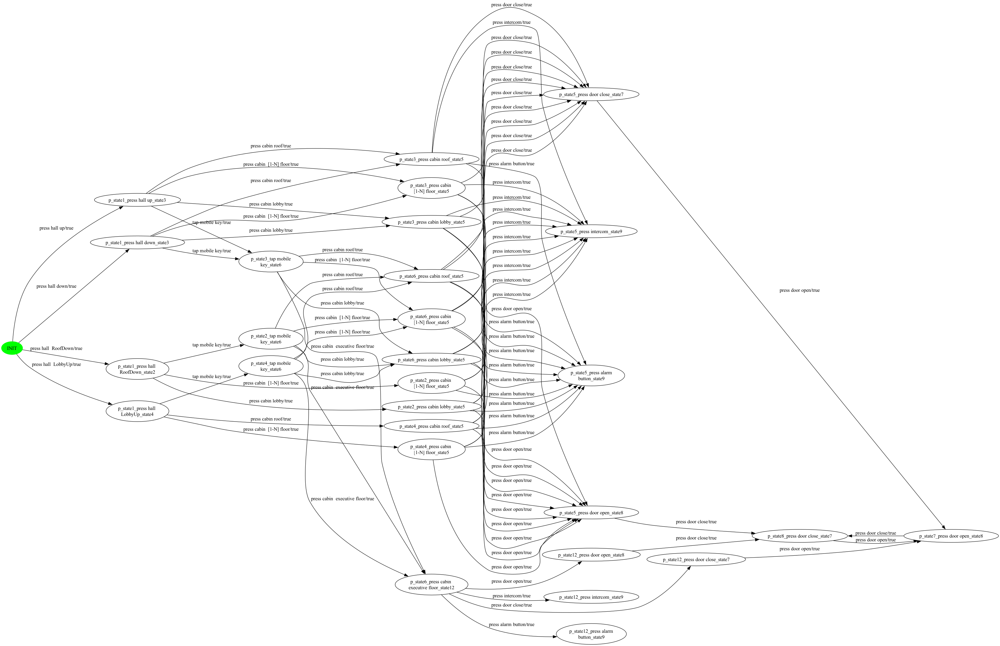

**Generated test suite** — 34 unique test case(s) after action-sequence dedup (34 pair-graph segment(s), 100 raw real step(s); pair-graph cycle has 124 edge(s) total, 44 synthetic dropped at translation). Operationally-identical trips (same action sequence, possibly different transition-level pairs) are listed once.

- **test case 1**: `press hall RoofDown -> press cabin lobby -> press door open -> press door close -> press door open -> press door close`
- **test case 2**: `press hall down -> press cabin lobby -> press door open`
- **test case 3**: `press cabin roof -> press alarm button`
- **test case 4**: `tap mobile key -> press cabin roof -> press alarm button`
- **test case 5**: `tap mobile key -> press cabin lobby -> press door open`
- **test case 6**: `press cabin roof -> press door open`
- **test case 7**: `press cabin roof -> press intercom`
- **test case 8**: `press cabin [1-N] floor -> press door close -> press door open`
- **test case 9**: `press cabin lobby -> press alarm button`
- **test case 10**: `press hall LobbyUp -> press cabin roof -> press door close`
- **test case 11**: `press hall down -> press cabin roof -> press intercom`
- **test case 12**: `press cabin [1-N] floor -> press door open`
- **test case 13**: `press hall LobbyUp -> tap mobile key -> press cabin [1-N] floor -> press intercom`
- **test case 14**: `press cabin [1-N] floor -> press alarm button`
- **test case 15**: `press hall RoofDown -> press cabin [1-N] floor -> press door close`
- **test case 16**: `tap mobile key -> press cabin [1-N] floor -> press door close`
- **test case 17**: `tap mobile key -> press cabin roof -> press door close`
- **test case 18**: `press hall RoofDown -> tap mobile key -> press cabin [1-N] floor -> press alarm button`
- **test case 19**: `press cabin lobby -> press intercom`
- **test case 20**: `press cabin roof -> press door close`
- **test case 21**: `press cabin lobby -> press door close`
- **test case 22**: `press cabin [1-N] floor -> press intercom`
- **test case 23**: `tap mobile key -> press cabin roof -> press door open`
- **test case 24**: `tap mobile key -> press cabin lobby -> press intercom`
- **test case 25**: `press cabin executive floor -> press door open -> press door close`
- **test case 26**: `tap mobile key -> press cabin executive floor -> press alarm button`
- **test case 27**: `press hall up -> press cabin lobby -> press intercom`
- **test case 28**: `press hall LobbyUp -> press cabin [1-N] floor -> press alarm button`
- **test case 29**: `press hall up -> press cabin roof -> press alarm button`
- **test case 30**: `press hall down -> press cabin [1-N] floor -> press door close`
- **test case 31**: `press hall up -> tap mobile key -> press cabin lobby -> press alarm button`
- **test case 32**: `press hall down -> tap mobile key -> press cabin executive floor -> press intercom`
- **test case 33**: `tap mobile key -> press cabin executive floor -> press door close -> press door open`
- **test case 34**: `press hall up -> press cabin [1-N] floor -> press intercom`

### Product 25

**Selected features:** selected = {Alarm, CardReader, ControlButtons, Intercom, ManualDoorControl}

**Repaired FTS:** 9 states, 27 transitions (23 real / 4 `__end__`).

**Pair graph (raw):** 24 nodes (incl. INIT), 71 edges (every edge = one contiguous transition pair in the original FTS; the subset starting at INIT correspond to pairs `(start, t)` for any original initial-state outgoing `t`).

**Pair graph (balanced):** 24 nodes, 111 edges (40 synthetic `__balance__N` added to restore in-balance at INIT).

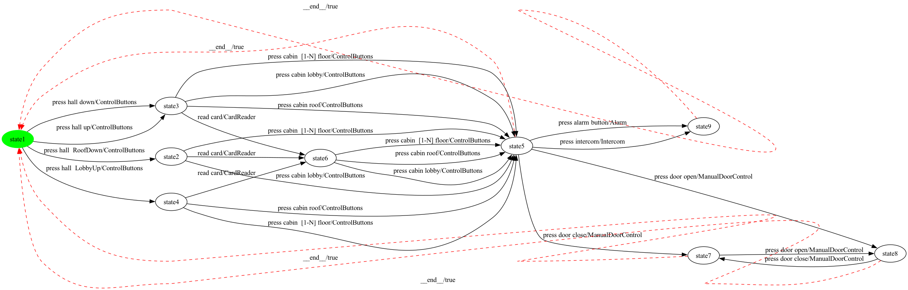

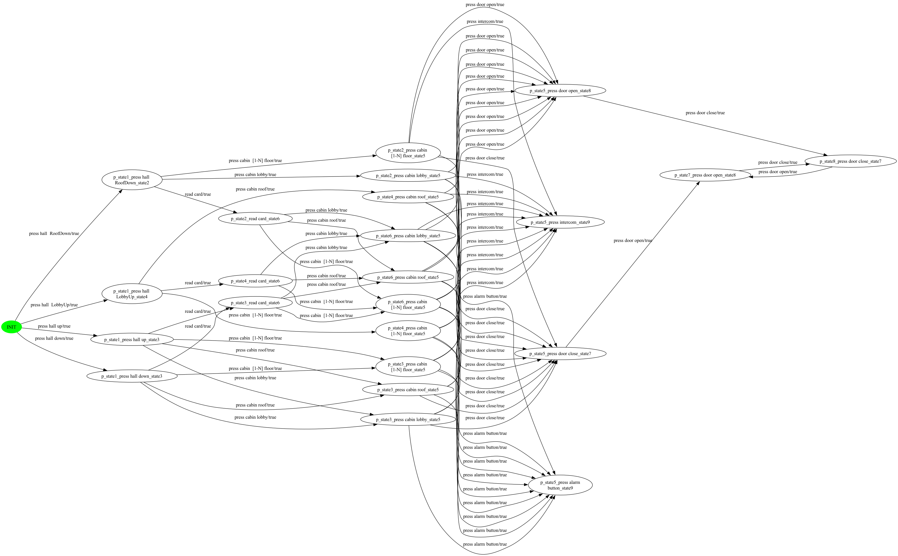

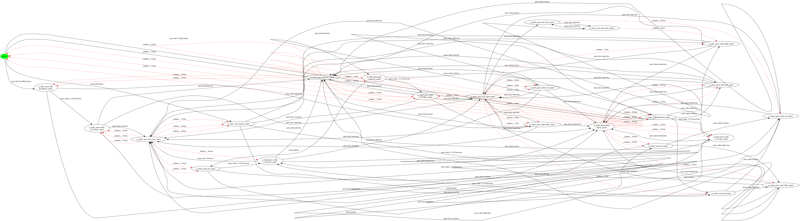

**Generated test suite** — 32 unique test case(s) after action-sequence dedup (32 pair-graph segment(s), 91 raw real step(s); pair-graph cycle has 111 edge(s) total, 40 synthetic dropped at translation). Operationally-identical trips (same action sequence, possibly different transition-level pairs) are listed once.

- **test case 1**: `press hall RoofDown -> read card -> press cabin [1-N] floor -> press intercom`
- **test case 2**: `press cabin [1-N] floor -> press door close -> press door open -> press door close -> press door open`
- **test case 3**: `press cabin lobby -> press door open -> press door close`
- **test case 4**: `press cabin roof -> press alarm button`
- **test case 5**: `press cabin lobby -> press door open`
- **test case 6**: `press cabin lobby -> press alarm button`
- **test case 7**: `press cabin [1-N] floor -> press door open`
- **test case 8**: `press cabin [1-N] floor -> press alarm button`
- **test case 9**: `press hall down -> press cabin lobby -> press intercom`
- **test case 10**: `press cabin [1-N] floor -> press intercom`
- **test case 11**: `press hall down -> press cabin roof -> press intercom`
- **test case 12**: `press hall up -> press cabin lobby -> press door close`
- **test case 13**: `read card -> press cabin [1-N] floor -> press door close`
- **test case 14**: `read card -> press cabin lobby -> press intercom`
- **test case 15**: `press hall LobbyUp -> read card -> press cabin roof -> press door close`
- **test case 16**: `press cabin [1-N] floor -> press door close`
- **test case 17**: `press hall down -> read card -> press cabin [1-N] floor -> press alarm button`
- **test case 18**: `press hall down -> press cabin [1-N] floor -> press door close`
- **test case 19**: `press cabin roof -> press door open`
- **test case 20**: `press cabin roof -> press intercom`
- **test case 21**: `press hall LobbyUp -> press cabin roof -> press door close`
- **test case 22**: `press cabin lobby -> press intercom`
- **test case 23**: `press hall LobbyUp -> press cabin [1-N] floor -> press alarm button`
- **test case 24**: `press cabin roof -> press door close`
- **test case 25**: `press hall up -> press cabin roof -> press alarm button`
- **test case 26**: `read card -> press cabin lobby -> press door close`
- **test case 27**: `press hall up -> press cabin [1-N] floor -> press intercom`
- **test case 28**: `press hall RoofDown -> press cabin lobby -> press door close`
- **test case 29**: `press hall up -> read card -> press cabin roof -> press door open`
- **test case 30**: `read card -> press cabin lobby -> press alarm button`
- **test case 31**: `read card -> press cabin roof -> press intercom`
- **test case 32**: `press hall RoofDown -> press cabin [1-N] floor -> press intercom`

### Product 26

**Selected features:** selected = {CardReader, ControlButtons, ExecutiveFloor, Intercom, ManualDoorControl}

**Repaired FTS:** 10 states, 31 transitions (26 real / 5 `__end__`).

**Pair graph (raw):** 27 nodes (incl. INIT), 69 edges (every edge = one contiguous transition pair in the original FTS; the subset starting at INIT correspond to pairs `(start, t)` for any original initial-state outgoing `t`).

**Pair graph (balanced):** 27 nodes, 102 edges (33 synthetic `__balance__N` added to restore in-balance at INIT).

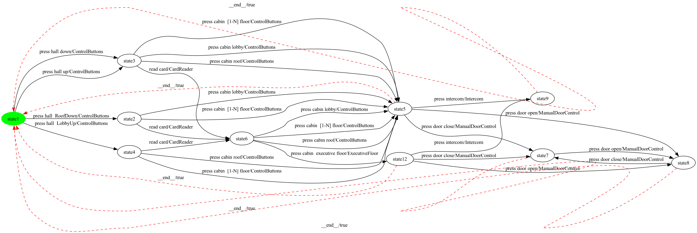

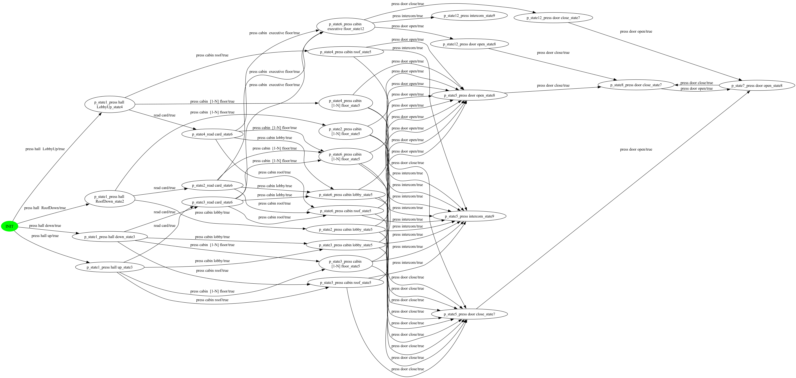

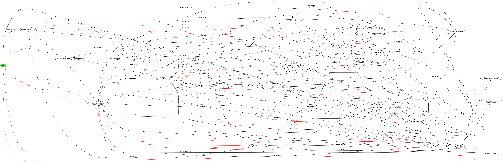

**Generated test suite** — 29 unique test case(s) after action-sequence dedup (29 pair-graph segment(s), 90 raw real step(s); pair-graph cycle has 102 edge(s) total, 33 synthetic dropped at translation). Operationally-identical trips (same action sequence, possibly different transition-level pairs) are listed once.

- **test case 1**: `press hall RoofDown -> read card -> press cabin [1-N] floor -> press intercom`
- **test case 2**: `press hall down -> press cabin lobby -> press door open -> press door close -> press door open -> press door close`
- **test case 3**: `read card -> press cabin executive floor -> press door open -> press door close`
- **test case 4**: `read card -> press cabin lobby -> press door open`
- **test case 5**: `press cabin roof -> press door open`
- **test case 6**: `press cabin lobby -> press door open`
- **test case 7**: `press cabin lobby -> press intercom`
- **test case 8**: `press hall LobbyUp -> read card -> press cabin executive floor -> press door close -> press door open`
- **test case 9**: `press hall LobbyUp -> press cabin roof -> press intercom`
- **test case 10**: `press hall RoofDown -> press cabin lobby -> press door close -> press door open`
- **test case 11**: `press cabin roof -> press door close`
- **test case 12**: `read card -> press cabin roof -> press door close`
- **test case 13**: `read card -> press cabin [1-N] floor -> press door close`
- **test case 14**: `read card -> press cabin lobby -> press intercom`
- **test case 15**: `press hall RoofDown -> press cabin [1-N] floor -> press door close`
- **test case 16**: `read card -> press cabin roof -> press intercom`
- **test case 17**: `press cabin [1-N] floor -> press door open`
- **test case 18**: `read card -> press cabin executive floor -> press intercom`
- **test case 19**: `press hall up -> press cabin lobby -> press door close`
- **test case 20**: `read card -> press cabin [1-N] floor -> press door open`
- **test case 21**: `press cabin [1-N] floor -> press door close`
- **test case 22**: `press cabin [1-N] floor -> press intercom`
- **test case 23**: `press hall down -> press cabin roof -> press intercom`
- **test case 24**: `press hall down -> read card -> press cabin roof -> press door open`
- **test case 25**: `press hall down -> press cabin [1-N] floor -> press door close`
- **test case 26**: `press hall up -> press cabin roof -> press door close`
- **test case 27**: `press hall up -> read card -> press cabin lobby -> press door close`
- **test case 28**: `press hall up -> press cabin [1-N] floor -> press intercom`
- **test case 29**: `press hall LobbyUp -> press cabin [1-N] floor -> press door open`

### Product 27

**Selected features:** selected = {Alarm, ControlButtons, Intercom, ManualDoorControl, MobileKey}

**Repaired FTS:** 9 states, 27 transitions (23 real / 4 `__end__`).

**Pair graph (raw):** 24 nodes (incl. INIT), 71 edges (every edge = one contiguous transition pair in the original FTS; the subset starting at INIT correspond to pairs `(start, t)` for any original initial-state outgoing `t`).

**Pair graph (balanced):** 24 nodes, 111 edges (40 synthetic `__balance__N` added to restore in-balance at INIT).

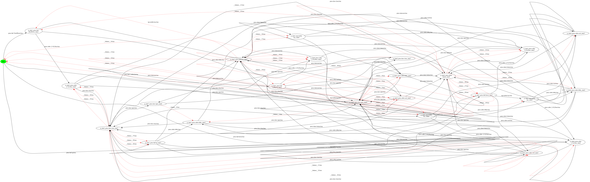

**Generated test suite** — 30 unique test case(s) after action-sequence dedup (30 pair-graph segment(s), 87 raw real step(s); pair-graph cycle has 111 edge(s) total, 40 synthetic dropped at translation). Operationally-identical trips (same action sequence, possibly different transition-level pairs) are listed once.

- **test case 1**: `press hall RoofDown -> press cabin lobby -> press door open -> press door close -> press door open -> press door close`
- **test case 2**: `press hall LobbyUp -> press cabin roof -> press alarm button`
- **test case 3**: `press hall RoofDown -> press cabin [1-N] floor -> press door close -> press door open`
- **test case 4**: `press cabin lobby -> press door open`
- **test case 5**: `press cabin lobby -> press alarm button`
- **test case 6**: `press hall RoofDown -> tap mobile key -> press cabin roof -> press alarm button`
- **test case 7**: `press cabin roof -> press door close`
- **test case 8**: `press cabin roof -> press intercom`
- **test case 9**: `press cabin [1-N] floor -> press door close`
- **test case 10**: `press cabin roof -> press door open`
- **test case 11**: `press cabin [1-N] floor -> press intercom`
- **test case 12**: `press cabin [1-N] floor -> press alarm button`
- **test case 13**: `press cabin [1-N] floor -> press door open`
- **test case 14**: `tap mobile key -> press cabin [1-N] floor -> press intercom`
- **test case 15**: `press hall down -> press cabin lobby -> press intercom`
- **test case 16**: `press hall up -> press cabin lobby -> press door close`
- **test case 17**: `tap mobile key -> press cabin roof -> press intercom`
- **test case 18**: `press hall LobbyUp -> tap mobile key -> press cabin lobby -> press intercom`
- **test case 19**: `tap mobile key -> press cabin lobby -> press door close`
- **test case 20**: `tap mobile key -> press cabin [1-N] floor -> press door close`
- **test case 21**: `press hall down -> press cabin roof -> press door close`
- **test case 22**: `press hall up -> press cabin roof -> press alarm button`
- **test case 23**: `press hall down -> press cabin [1-N] floor -> press door close`
- **test case 24**: `press hall up -> press cabin [1-N] floor -> press intercom`
- **test case 25**: `press hall LobbyUp -> press cabin [1-N] floor -> press door open`
- **test case 26**: `press hall down -> tap mobile key -> press cabin [1-N] floor -> press door open`
- **test case 27**: `press cabin lobby -> press door close`
- **test case 28**: `press hall up -> tap mobile key -> press cabin lobby -> press alarm button`
- **test case 29**: `tap mobile key -> press cabin roof -> press door open`
- **test case 30**: `press cabin lobby -> press intercom`

### Product 28

**Selected features:** selected = {Alarm, ControlButtons, FirefighterService, Intercom}

**Repaired FTS:** 10 states, 25 transitions (21 real / 4 `__end__`).

**Pair graph (raw):** 22 nodes (incl. INIT), 54 edges (every edge = one contiguous transition pair in the original FTS; the subset starting at INIT correspond to pairs `(start, t)` for any original initial-state outgoing `t`).

**Pair graph (balanced):** 22 nodes, 82 edges (28 synthetic `__balance__N` added to restore in-balance at INIT).

**Generated test suite** — 24 unique test case(s) after action-sequence dedup (24 pair-graph segment(s), 70 raw real step(s); pair-graph cycle has 82 edge(s) total, 28 synthetic dropped at translation). Operationally-identical trips (same action sequence, possibly different transition-level pairs) are listed once.

- **test case 1**: `press hall RoofDown -> press cabin lobby -> press alarm button -> press&hold door close -> release door close -> press&hold door close -> release door close`
- **test case 2**: `press cabin lobby -> press&hold door close -> release door close`
- **test case 3**: `press cabin lobby -> press alarm button -> press&hold door open -> release door open -> press&hold door open -> release door open`
- **test case 4**: `press cabin [1-N] floor -> press&hold door open -> release door open`
- **test case 5**: `press cabin [1-N] floor -> press intercom -> press&hold door open`
- **test case 6**: `press hall up -> press cabin lobby -> press intercom -> press&hold door close`
- **test case 7**: `press cabin roof -> press&hold door open`
- **test case 8**: `press cabin [1-N] floor -> press&hold door close`
- **test case 9**: `press cabin roof -> press alarm button`
- **test case 10**: `press cabin roof -> press intercom`
- **test case 11**: `press hall RoofDown -> press cabin [1-N] floor -> press&hold door open`
- **test case 12**: `press hall down -> press cabin lobby -> press&hold door open`
- **test case 13**: `press hall up -> press cabin roof -> press&hold door close`
- **test case 14**: `press cabin roof -> press&hold door close`
- **test case 15**: `press hall LobbyUp -> press cabin roof -> press intercom`
- **test case 16**: `press cabin lobby -> press&hold door close`
- **test case 17**: `press cabin lobby -> press&hold door open`
- **test case 18**: `press hall LobbyUp -> press cabin [1-N] floor -> press alarm button`
- **test case 19**: `press cabin [1-N] floor -> press alarm button`
- **test case 20**: `press cabin lobby -> press intercom`
- **test case 21**: `press cabin [1-N] floor -> press intercom`
- **test case 22**: `press hall down -> press cabin roof -> press alarm button`
- **test case 23**: `press hall up -> press cabin [1-N] floor -> press intercom`
- **test case 24**: `press hall down -> press cabin [1-N] floor -> press&hold door open`

### Product 29

**Selected features:** selected = {CardReader, ControlButtons, ExecutiveFloor, Intercom}

**Repaired FTS:** 8 states, 23 transitions (20 real / 3 `__end__`).

**Pair graph (raw):** 21 nodes (incl. INIT), 41 edges (every edge = one contiguous transition pair in the original FTS; the subset starting at INIT correspond to pairs `(start, t)` for any original initial-state outgoing `t`).

**Pair graph (balanced):** 21 nodes, 63 edges (22 synthetic `__balance__N` added to restore in-balance at INIT).

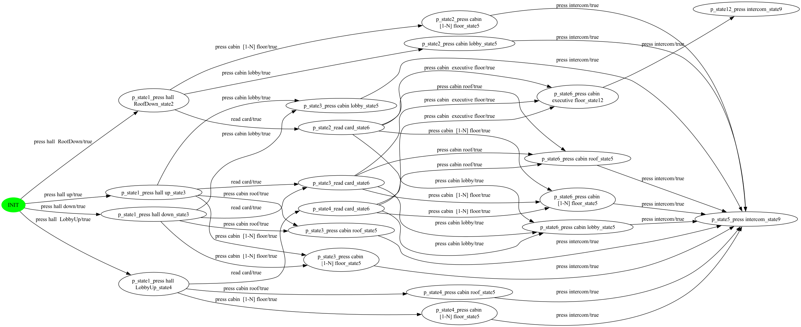

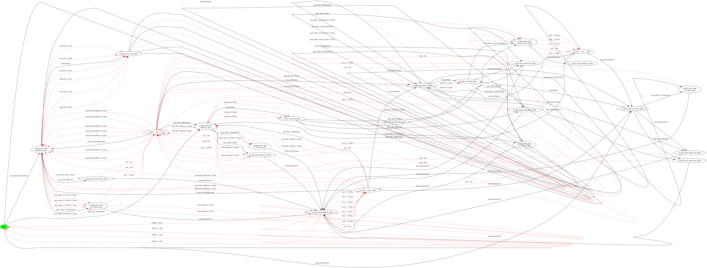

**Generated test suite** — 20 unique test case(s) after action-sequence dedup (20 pair-graph segment(s), 55 raw real step(s); pair-graph cycle has 63 edge(s) total, 22 synthetic dropped at translation). Operationally-identical trips (same action sequence, possibly different transition-level pairs) are listed once.

- **test case 1**: `press hall down -> press cabin lobby -> press intercom`
- **test case 2**: `press hall RoofDown -> read card -> press cabin lobby -> press intercom`
- **test case 3**: `press hall down -> press cabin roof -> press intercom`
- **test case 4**: `press hall down -> press cabin [1-N] floor -> press intercom`
- **test case 5**: `press hall down -> read card -> press cabin executive floor -> press intercom`
- **test case 6**: `press hall RoofDown -> press cabin [1-N] floor -> press intercom`
- **test case 7**: `read card -> press cabin [1-N] floor -> press intercom`
- **test case 8**: `read card -> press cabin executive floor`
- **test case 9**: `read card -> press cabin [1-N] floor`
- **test case 10**: `press hall up -> press cabin lobby`
- **test case 11**: `read card -> press cabin roof -> press intercom`
- **test case 12**: `read card -> press cabin roof`
- **test case 13**: `press hall up -> press cabin roof`
- **test case 14**: `press hall up -> press cabin [1-N] floor`
- **test case 15**: `press hall LobbyUp -> press cabin roof -> press intercom`
- **test case 16**: `press hall LobbyUp -> press cabin [1-N] floor -> press intercom`
- **test case 17**: `press hall up -> read card -> press cabin lobby`
- **test case 18**: `press hall RoofDown -> press cabin lobby -> press intercom`
- **test case 19**: `read card -> press cabin lobby`
- **test case 20**: `press hall LobbyUp -> read card -> press cabin roof`

### Product 30

**Selected features:** selected = {ControlButtons, Intercom, MobileKey}

**Repaired FTS:** 7 states, 20 transitions (18 real / 2 `__end__`).

**Pair graph (raw):** 19 nodes (incl. INIT), 37 edges (every edge = one contiguous transition pair in the original FTS; the subset starting at INIT correspond to pairs `(start, t)` for any original initial-state outgoing `t`).

**Pair graph (balanced):** 19 nodes, 56 edges (19 synthetic `__balance__N` added to restore in-balance at INIT).

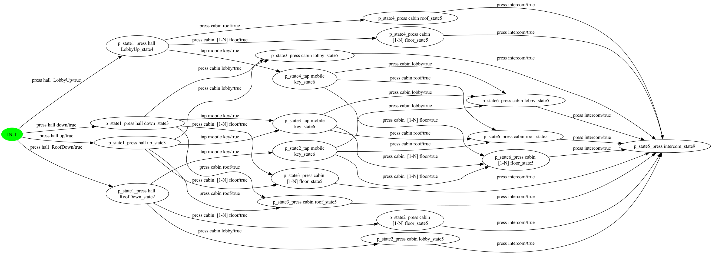

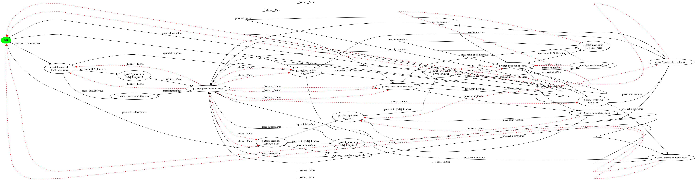

**Generated test suite** — 19 unique test case(s) after action-sequence dedup (19 pair-graph segment(s), 52 raw real step(s); pair-graph cycle has 56 edge(s) total, 19 synthetic dropped at translation). Operationally-identical trips (same action sequence, possibly different transition-level pairs) are listed once.

- **test case 1**: `press hall down -> press cabin lobby -> press intercom`
- **test case 2**: `tap mobile key -> press cabin roof -> press intercom`
- **test case 3**: `tap mobile key -> press cabin lobby -> press intercom`
- **test case 4**: `press hall LobbyUp -> press cabin roof -> press intercom`
- **test case 5**: `press hall LobbyUp -> tap mobile key -> press cabin roof`
- **test case 6**: `tap mobile key -> press cabin lobby`
- **test case 7**: `press hall up -> press cabin lobby`
- **test case 8**: `tap mobile key -> press cabin [1-N] floor -> press intercom`
- **test case 9**: `press hall RoofDown -> press cabin [1-N] floor -> press intercom`
- **test case 10**: `press hall RoofDown -> press cabin lobby -> press intercom`
- **test case 11**: `press hall down -> press cabin roof -> press intercom`
- **test case 12**: `press hall down -> press cabin [1-N] floor -> press intercom`
- **test case 13**: `press hall down -> tap mobile key -> press cabin [1-N] floor`
- **test case 14**: `press hall up -> tap mobile key -> press cabin lobby`
- **test case 15**: `press hall LobbyUp -> press cabin [1-N] floor -> press intercom`
- **test case 16**: `tap mobile key -> press cabin roof`
- **test case 17**: `press hall RoofDown -> tap mobile key -> press cabin [1-N] floor`
- **test case 18**: `press hall up -> press cabin roof`
- **test case 19**: `press hall up -> press cabin [1-N] floor`

### Product 31

**Selected features:** selected = {Alarm, CardReader, ControlButtons, ManualDoorControl}

**Repaired FTS:** 9 states, 26 transitions (22 real / 4 `__end__`).

**Pair graph (raw):** 23 nodes (incl. INIT), 61 edges (every edge = one contiguous transition pair in the original FTS; the subset starting at INIT correspond to pairs `(start, t)` for any original initial-state outgoing `t`).

**Pair graph (balanced):** 23 nodes, 91 edges (30 synthetic `__balance__N` added to restore in-balance at INIT).

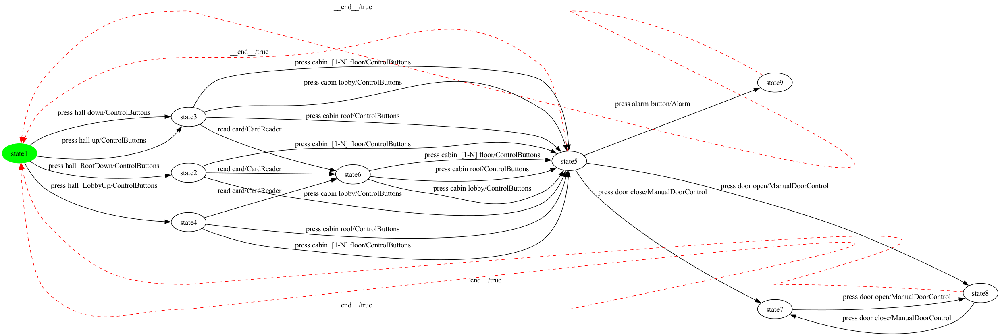

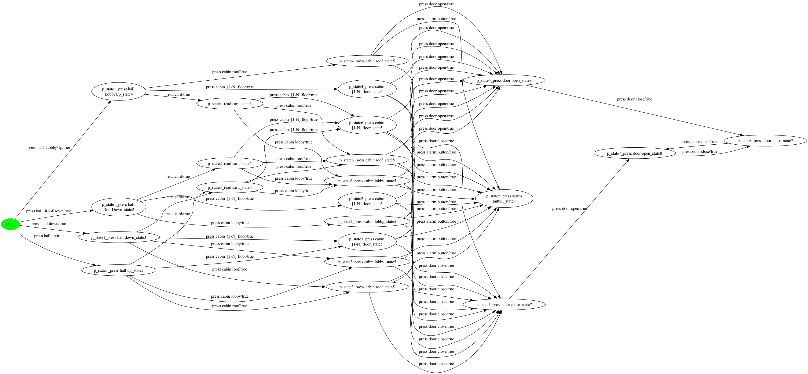

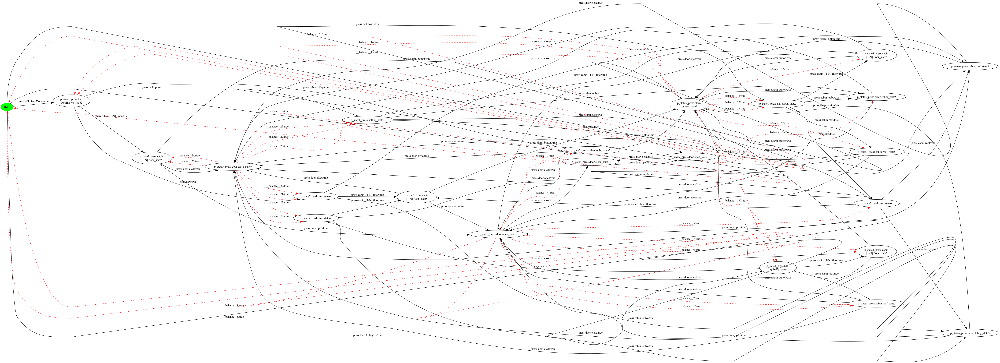

**Generated test suite** — 27 unique test case(s) after action-sequence dedup (27 pair-graph segment(s), 81 raw real step(s); pair-graph cycle has 91 edge(s) total, 30 synthetic dropped at translation). Operationally-identical trips (same action sequence, possibly different transition-level pairs) are listed once.

- **test case 1**: `press hall RoofDown -> read card -> press cabin [1-N] floor -> press door close -> press door open -> press door close -> press door open`
- **test case 2**: `press cabin lobby -> press door open -> press door close`
- **test case 3**: `press hall down -> press cabin lobby -> press alarm button`
- **test case 4**: `press hall up -> press cabin lobby -> press door close`
- **test case 5**: `read card -> press cabin lobby -> press door open`
- **test case 6**: `press cabin roof -> press alarm button`
- **test case 7**: `press hall LobbyUp -> read card -> press cabin [1-N] floor -> press alarm button`
- **test case 8**: `press hall LobbyUp -> press cabin roof -> press door open`
- **test case 9**: `press cabin roof -> press door close`
- **test case 10**: `read card -> press cabin roof -> press alarm button`
- **test case 11**: `press hall RoofDown -> press cabin lobby -> press door open`
- **test case 12**: `press cabin lobby -> press alarm button`
- **test case 13**: `press hall RoofDown -> press cabin [1-N] floor -> press door close`
- **test case 14**: `read card -> press cabin lobby -> press door close`
- **test case 15**: `read card -> press cabin roof -> press door close`
- **test case 16**: `press cabin [1-N] floor -> press alarm button`
- **test case 17**: `press cabin [1-N] floor -> press door open`
- **test case 18**: `press cabin lobby -> press door close`
- **test case 19**: `read card -> press cabin [1-N] floor -> press door open`
- **test case 20**: `press cabin [1-N] floor -> press door close`
- **test case 21**: `press hall up -> press cabin roof -> press door open`
- **test case 22**: `press hall down -> press cabin roof -> press door close`
- **test case 23**: `press hall up -> press cabin [1-N] floor -> press alarm button`
- **test case 24**: `press hall down -> read card -> press cabin lobby -> press alarm button`
- **test case 25**: `press hall down -> press cabin [1-N] floor -> press door close`
- **test case 26**: `press hall up -> read card -> press cabin roof -> press door open`
- **test case 27**: `press hall LobbyUp -> press cabin [1-N] floor -> press door open`

### Product 32

**Selected features:** selected = {ControlButtons, Intercom, ManualDoorControl, PinPad}

**Repaired FTS:** 9 states, 26 transitions (22 real / 4 `__end__`).

**Pair graph (raw):** 23 nodes (incl. INIT), 61 edges (every edge = one contiguous transition pair in the original FTS; the subset starting at INIT correspond to pairs `(start, t)` for any original initial-state outgoing `t`).

**Pair graph (balanced):** 23 nodes, 91 edges (30 synthetic `__balance__N` added to restore in-balance at INIT).

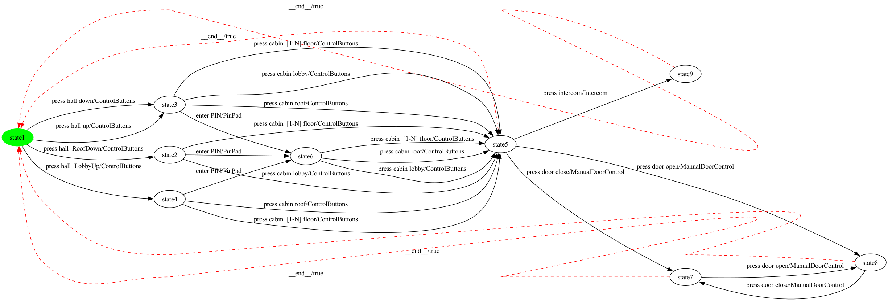

**Generated test suite** — 25 unique test case(s) after action-sequence dedup (25 pair-graph segment(s), 77 raw real step(s); pair-graph cycle has 91 edge(s) total, 30 synthetic dropped at translation). Operationally-identical trips (same action sequence, possibly different transition-level pairs) are listed once.

- **test case 1**: `press hall RoofDown -> press cabin lobby -> press door open -> press door close -> press door open -> press door close`
- **test case 2**: `press cabin roof -> press intercom`
- **test case 3**: `press hall down -> press cabin lobby -> press door open`
- **test case 4**: `press cabin roof -> press door open`
- **test case 5**: `press hall up -> press cabin lobby -> press intercom`
- **test case 6**: `press hall LobbyUp -> press cabin roof -> press door close -> press door open`
- **test case 7**: `press cabin lobby -> press door close`
- **test case 8**: `enter PIN -> press cabin [1-N] floor -> press intercom`
- **test case 9**: `press hall LobbyUp -> press cabin [1-N] floor -> press door close`
- **test case 10**: `enter PIN -> press cabin roof -> press door close`
- **test case 11**: `enter PIN -> press cabin lobby -> press door open`
- **test case 12**: `press cabin lobby -> press intercom`
- **test case 13**: `press hall RoofDown -> enter PIN -> press cabin [1-N] floor -> press door close`
- **test case 14**: `enter PIN -> press cabin roof -> press intercom`
- **test case 15**: `press hall RoofDown -> press cabin [1-N] floor -> press door close`
- **test case 16**: `press cabin [1-N] floor -> press door open`
- **test case 17**: `press cabin [1-N] floor -> press intercom`
- **test case 18**: `enter PIN -> press cabin [1-N] floor -> press door open`
- **test case 19**: `press hall down -> press cabin roof -> press door open`
- **test case 20**: `press hall LobbyUp -> enter PIN -> press cabin lobby -> press intercom`
- **test case 21**: `press hall down -> enter PIN -> press cabin lobby -> press door close`
- **test case 22**: `press hall up -> press cabin roof -> press door close`
- **test case 23**: `press hall up -> press cabin [1-N] floor -> press intercom`
- **test case 24**: `press hall down -> press cabin [1-N] floor -> press door close`
- **test case 25**: `press hall up -> enter PIN -> press cabin roof -> press door open`

### Product 33

**Selected features:** selected = {ControlButtons, ExecutiveFloor, Intercom, ManualDoorControl, MobileKey}

**Repaired FTS:** 10 states, 31 transitions (26 real / 5 `__end__`).

**Pair graph (raw):** 27 nodes (incl. INIT), 69 edges (every edge = one contiguous transition pair in the original FTS; the subset starting at INIT correspond to pairs `(start, t)` for any original initial-state outgoing `t`).

**Pair graph (balanced):** 27 nodes, 102 edges (33 synthetic `__balance__N` added to restore in-balance at INIT).

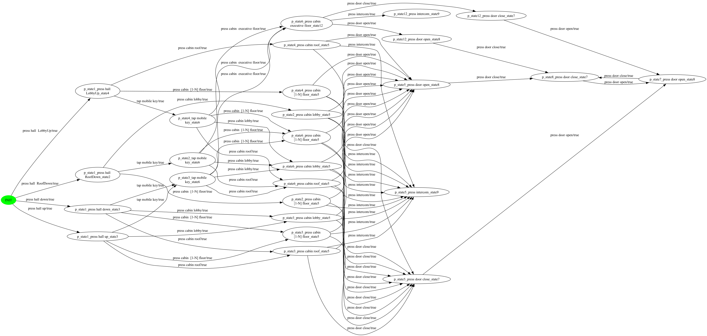

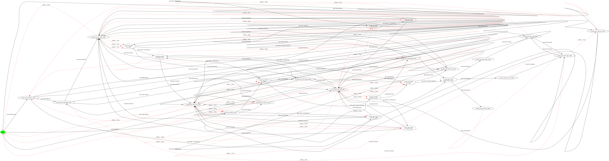

**Generated test suite** — 29 unique test case(s) after action-sequence dedup (29 pair-graph segment(s), 90 raw real step(s); pair-graph cycle has 102 edge(s) total, 33 synthetic dropped at translation). Operationally-identical trips (same action sequence, possibly different transition-level pairs) are listed once.

- **test case 1**: `press hall RoofDown -> press cabin lobby -> press door open -> press door close -> press door open -> press door close`
- **test case 2**: `press hall down -> press cabin lobby -> press door open`
- **test case 3**: `press cabin roof -> press door open`
- **test case 4**: `press cabin lobby -> press intercom`
- **test case 5**: `press hall down -> press cabin roof -> press intercom`
- **test case 6**: `press hall up -> press cabin lobby -> press intercom`
- **test case 7**: `tap mobile key -> press cabin roof -> press door close -> press door open`
- **test case 8**: `press cabin lobby -> press door close`
- **test case 9**: `press hall down -> press cabin [1-N] floor -> press door open`
- **test case 10**: `tap mobile key -> press cabin [1-N] floor -> press intercom`
- **test case 11**: `tap mobile key -> press cabin lobby -> press door open`
- **test case 12**: `tap mobile key -> press cabin [1-N] floor -> press door close`
- **test case 13**: `tap mobile key -> press cabin roof -> press intercom`
- **test case 14**: `tap mobile key -> press cabin [1-N] floor -> press door open`
- **test case 15**: `tap mobile key -> press cabin roof -> press door open`
- **test case 16**: `tap mobile key -> press cabin lobby -> press intercom`
- **test case 17**: `press hall LobbyUp -> press cabin roof -> press intercom`
- **test case 18**: `press hall LobbyUp -> tap mobile key -> press cabin executive floor -> press door open -> press door close`
- **test case 19**: `press hall down -> tap mobile key -> press cabin executive floor -> press door close -> press door open`
- **test case 20**: `press cabin roof -> press door close`
- **test case 21**: `press cabin [1-N] floor -> press door close`
- **test case 22**: `press cabin [1-N] floor -> press door open`
- **test case 23**: `press cabin [1-N] floor -> press intercom`
- **test case 24**: `press hall RoofDown -> press cabin [1-N] floor -> press intercom`
- **test case 25**: `press hall up -> press cabin roof -> press door close`
- **test case 26**: `press hall up -> tap mobile key -> press cabin lobby -> press door close`
- **test case 27**: `press hall up -> press cabin [1-N] floor -> press intercom`
- **test case 28**: `press hall RoofDown -> tap mobile key -> press cabin executive floor -> press intercom`
- **test case 29**: `press hall LobbyUp -> press cabin [1-N] floor -> press door open`

### Product 34

**Selected features:** selected = {Alarm, CardReader, ControlButtons, ExecutiveFloor, ManualDoorControl}

**Repaired FTS:** 10 states, 31 transitions (26 real / 5 `__end__`).

**Pair graph (raw):** 27 nodes (incl. INIT), 69 edges (every edge = one contiguous transition pair in the original FTS; the subset starting at INIT correspond to pairs `(start, t)` for any original initial-state outgoing `t`).

**Pair graph (balanced):** 27 nodes, 102 edges (33 synthetic `__balance__N` added to restore in-balance at INIT).

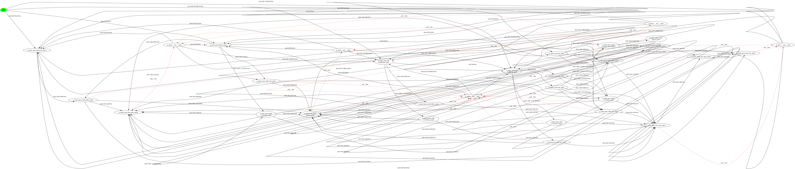

**Generated test suite** — 30 unique test case(s) after action-sequence dedup (30 pair-graph segment(s), 92 raw real step(s); pair-graph cycle has 102 edge(s) total, 33 synthetic dropped at translation). Operationally-identical trips (same action sequence, possibly different transition-level pairs) are listed once.

- **test case 1**: `press hall RoofDown -> read card -> press cabin [1-N] floor -> press door close -> press door open -> press door close -> press door open`
- **test case 2**: `press cabin lobby -> press door open -> press door close`
- **test case 3**: `press hall down -> press cabin lobby -> press alarm button`
- **test case 4**: `press hall LobbyUp -> read card -> press cabin executive floor -> press door open -> press door close`
- **test case 5**: `press hall LobbyUp -> press cabin roof -> press alarm button`
- **test case 6**: `press hall RoofDown -> press cabin lobby -> press door open`
- **test case 7**: `press cabin roof -> press door open`
- **test case 8**: `press cabin lobby -> press alarm button`
- **test case 9**: `press hall RoofDown -> press cabin [1-N] floor -> press door close`
- **test case 10**: `read card -> press cabin executive floor -> press alarm button`
- **test case 11**: `press hall up -> press cabin lobby -> press door close`
- **test case 12**: `read card -> press cabin [1-N] floor -> press alarm button`
- **test case 13**: `press cabin [1-N] floor -> press door open`
- **test case 14**: `press cabin lobby -> press door close`
- **test case 15**: `read card -> press cabin lobby -> press door open`
- **test case 16**: `read card -> press cabin executive floor -> press door close -> press door open`
- **test case 17**: `press cabin roof -> press door close`
- **test case 18**: `read card -> press cabin roof -> press alarm button`
- **test case 19**: `press hall down -> press cabin roof -> press door open`
- **test case 20**: `read card -> press cabin [1-N] floor -> press door open`
- **test case 21**: `press cabin [1-N] floor -> press door close`
- **test case 22**: `press cabin [1-N] floor -> press alarm button`
- **test case 23**: `press hall down -> read card -> press cabin roof -> press door close`
- **test case 24**: `press hall down -> press cabin [1-N] floor -> press alarm button`
- **test case 25**: `press hall up -> press cabin roof -> press alarm button`
- **test case 26**: `read card -> press cabin lobby -> press door close`
- **test case 27**: `press hall up -> press cabin [1-N] floor -> press door close`
- **test case 28**: `press hall up -> read card -> press cabin lobby -> press alarm button`
- **test case 29**: `read card -> press cabin roof -> press door open`
- **test case 30**: `press hall LobbyUp -> press cabin [1-N] floor -> press door open`

### Product 35

**Selected features:** selected = {Alarm, ControlButtons, Intercom, MobileKey}

**Repaired FTS:** 7 states, 21 transitions (19 real / 2 `__end__`).

**Pair graph (raw):** 20 nodes (incl. INIT), 47 edges (every edge = one contiguous transition pair in the original FTS; the subset starting at INIT correspond to pairs `(start, t)` for any original initial-state outgoing `t`).

**Pair graph (balanced):** 20 nodes, 70 edges (23 synthetic `__balance__N` added to restore in-balance at INIT).

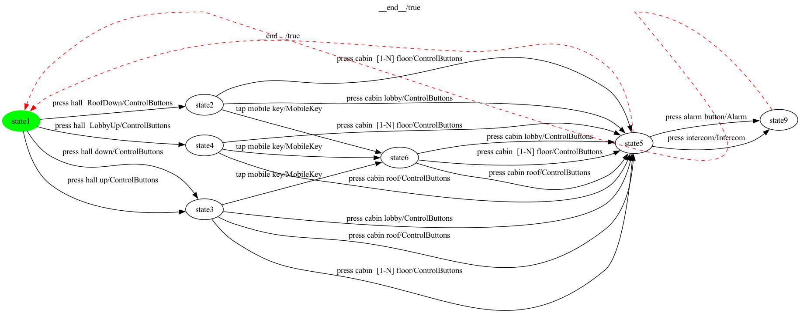

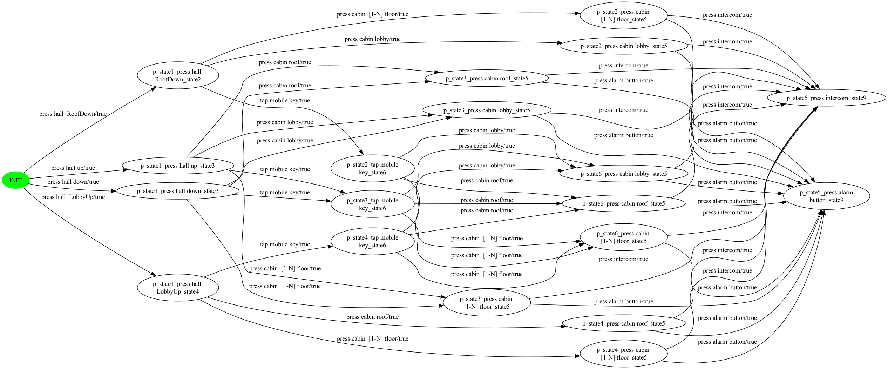

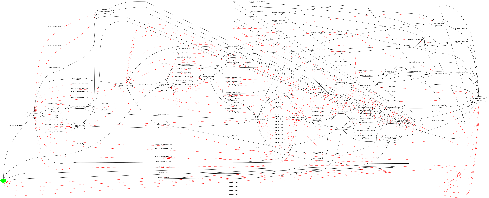

**Generated test suite** — 23 unique test case(s) after action-sequence dedup (23 pair-graph segment(s), 66 raw real step(s); pair-graph cycle has 70 edge(s) total, 23 synthetic dropped at translation). Operationally-identical trips (same action sequence, possibly different transition-level pairs) are listed once.

- **test case 1**: `press hall down -> press cabin lobby -> press intercom`
- **test case 2**: `tap mobile key -> press cabin roof -> press intercom`
- **test case 3**: `press cabin lobby -> press intercom`
- **test case 4**: `press cabin [1-N] floor -> press alarm button`
- **test case 5**: `press hall LobbyUp -> press cabin roof -> press intercom`
- **test case 6**: `press hall up -> press cabin lobby -> press alarm button`
- **test case 7**: `press hall RoofDown -> press cabin [1-N] floor -> press alarm button`
- **test case 8**: `press hall RoofDown -> press cabin lobby -> press alarm button`
- **test case 9**: `press hall down -> press cabin roof -> press intercom`
- **test case 10**: `press hall LobbyUp -> tap mobile key -> press cabin lobby -> press intercom`
- **test case 11**: `press hall RoofDown -> tap mobile key -> press cabin roof -> press alarm button`
- **test case 12**: `press hall down -> press cabin [1-N] floor -> press alarm button`
- **test case 13**: `press hall down -> tap mobile key -> press cabin [1-N] floor -> press alarm button`
- **test case 14**: `tap mobile key -> press cabin lobby -> press alarm button`
- **test case 15**: `press cabin [1-N] floor -> press intercom`
- **test case 16**: `tap mobile key -> press cabin lobby`
- **test case 17**: `tap mobile key -> press cabin [1-N] floor -> press intercom`
- **test case 18**: `tap mobile key -> press cabin [1-N] floor`
- **test case 19**: `press hall up -> tap mobile key -> press cabin roof`
- **test case 20**: `press cabin roof -> press alarm button`
- **test case 21**: `press hall up -> press cabin roof -> press alarm button`
- **test case 22**: `press hall up -> press cabin [1-N] floor -> press intercom`
- **test case 23**: `press hall LobbyUp -> press cabin [1-N] floor -> press intercom`

### Product 36

**Selected features:** selected = {Alarm, ControlButtons, Intercom, PinPad}

**Repaired FTS:** 7 states, 21 transitions (19 real / 2 `__end__`).

**Pair graph (raw):** 20 nodes (incl. INIT), 47 edges (every edge = one contiguous transition pair in the original FTS; the subset starting at INIT correspond to pairs `(start, t)` for any original initial-state outgoing `t`).

**Pair graph (balanced):** 20 nodes, 70 edges (23 synthetic `__balance__N` added to restore in-balance at INIT).

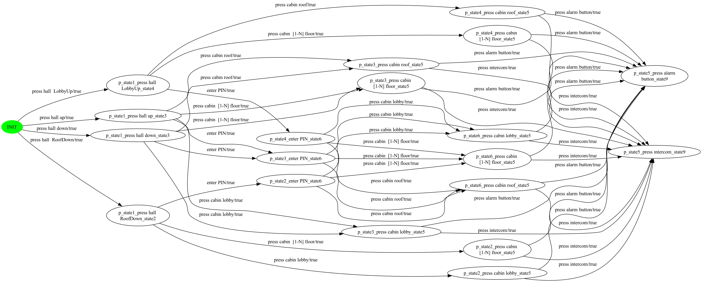

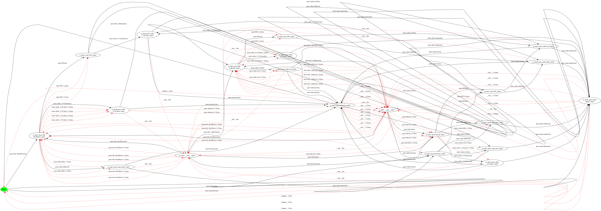

**Generated test suite** — 23 unique test case(s) after action-sequence dedup (23 pair-graph segment(s), 66 raw real step(s); pair-graph cycle has 70 edge(s) total, 23 synthetic dropped at translation). Operationally-identical trips (same action sequence, possibly different transition-level pairs) are listed once.

- **test case 1**: `press hall down -> press cabin lobby -> press intercom`
- **test case 2**: `enter PIN -> press cabin roof -> press intercom`
- **test case 3**: `press cabin [1-N] floor -> press alarm button`
- **test case 4**: `press hall down -> press cabin roof -> press intercom`
- **test case 5**: `press hall up -> press cabin lobby -> press alarm button`
- **test case 6**: `press hall down -> enter PIN -> press cabin lobby -> press intercom`
- **test case 7**: `press hall LobbyUp -> press cabin roof -> press intercom`
- **test case 8**: `press hall RoofDown -> enter PIN -> press cabin [1-N] floor -> press alarm button`
- **test case 9**: `press hall down -> press cabin [1-N] floor -> press alarm button`
- **test case 10**: `enter PIN -> press cabin [1-N] floor -> press intercom`
- **test case 11**: `press hall LobbyUp -> press cabin [1-N] floor -> press intercom`
- **test case 12**: `press hall LobbyUp -> enter PIN -> press cabin roof -> press alarm button`
- **test case 13**: `enter PIN -> press cabin lobby -> press alarm button`
- **test case 14**: `enter PIN -> press cabin lobby`
- **test case 15**: `press cabin lobby -> press intercom`
- **test case 16**: `press hall RoofDown -> press cabin [1-N] floor -> press alarm button`
- **test case 17**: `enter PIN -> press cabin roof`
- **test case 18**: `press cabin roof -> press alarm button`
- **test case 19**: `press cabin [1-N] floor -> press intercom`
- **test case 20**: `press hall RoofDown -> press cabin lobby -> press alarm button`
- **test case 21**: `press hall up -> press cabin roof -> press alarm button`
- **test case 22**: `press hall up -> enter PIN -> press cabin [1-N] floor`
- **test case 23**: `press hall up -> press cabin [1-N] floor -> press intercom`

### Product 37

**Selected features:** selected = {ControlButtons, ExecutiveFloor, Intercom, MobileKey}

**Repaired FTS:** 8 states, 23 transitions (20 real / 3 `__end__`).

**Pair graph (raw):** 21 nodes (incl. INIT), 41 edges (every edge = one contiguous transition pair in the original FTS; the subset starting at INIT correspond to pairs `(start, t)` for any original initial-state outgoing `t`).

**Pair graph (balanced):** 21 nodes, 63 edges (22 synthetic `__balance__N` added to restore in-balance at INIT).

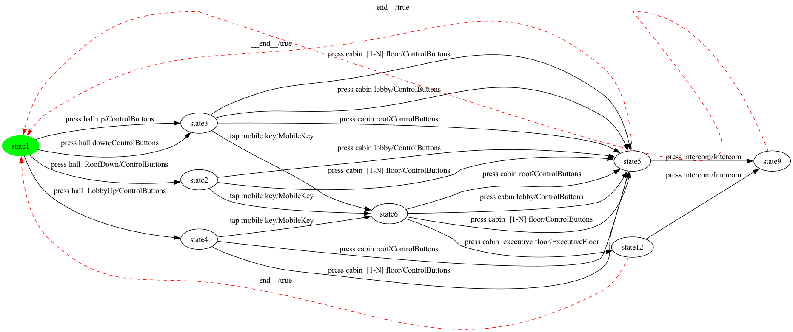

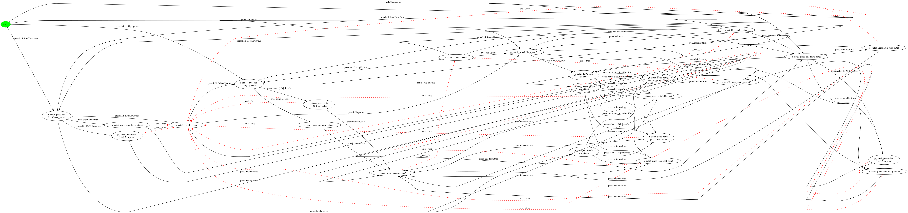

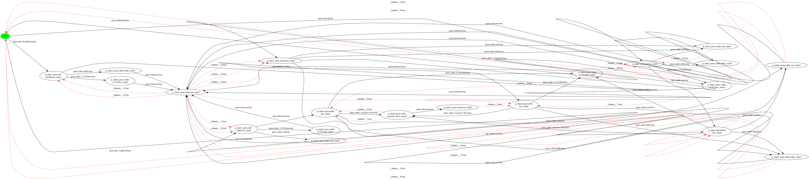

**Generated test suite** — 20 unique test case(s) after action-sequence dedup (20 pair-graph segment(s), 55 raw real step(s); pair-graph cycle has 63 edge(s) total, 22 synthetic dropped at translation). Operationally-identical trips (same action sequence, possibly different transition-level pairs) are listed once.

- **test case 1**: `press hall down -> press cabin lobby -> press intercom`
- **test case 2**: `tap mobile key -> press cabin roof -> press intercom`
- **test case 3**: `press hall LobbyUp -> press cabin roof -> press intercom`
- **test case 4**: `press hall LobbyUp -> tap mobile key -> press cabin roof`
- **test case 5**: `press hall up -> press cabin lobby`
- **test case 6**: `tap mobile key -> press cabin lobby -> press intercom`
- **test case 7**: `press hall RoofDown -> press cabin [1-N] floor -> press intercom`
- **test case 8**: `press hall RoofDown -> press cabin lobby -> press intercom`
- **test case 9**: `press hall down -> press cabin roof -> press intercom`
- **test case 10**: `press hall down -> press cabin [1-N] floor -> press intercom`
- **test case 11**: `press hall down -> tap mobile key -> press cabin [1-N] floor -> press intercom`
- **test case 12**: `tap mobile key -> press cabin lobby`
- **test case 13**: `press hall LobbyUp -> press cabin [1-N] floor -> press intercom`
- **test case 14**: `tap mobile key -> press cabin roof`
- **test case 15**: `press hall RoofDown -> tap mobile key -> press cabin [1-N] floor`
- **test case 16**: `press hall up -> tap mobile key -> press cabin executive floor -> press intercom`
- **test case 17**: `tap mobile key -> press cabin executive floor`
- **test case 18**: `tap mobile key -> press cabin [1-N] floor`
- **test case 19**: `press hall up -> press cabin roof`
- **test case 20**: `press hall up -> press cabin [1-N] floor`

### Product 38

**Selected features:** selected = {Alarm, ControlButtons, PinPad}

**Repaired FTS:** 7 states, 20 transitions (18 real / 2 `__end__`).

**Pair graph (raw):** 19 nodes (incl. INIT), 37 edges (every edge = one contiguous transition pair in the original FTS; the subset starting at INIT correspond to pairs `(start, t)` for any original initial-state outgoing `t`).

**Pair graph (balanced):** 19 nodes, 56 edges (19 synthetic `__balance__N` added to restore in-balance at INIT).

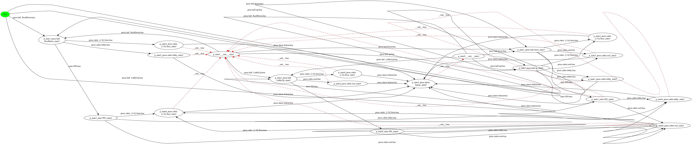

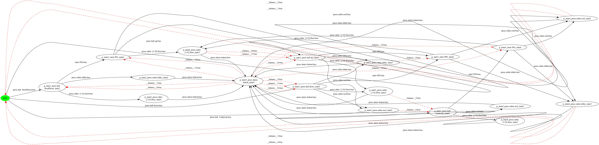

**Generated test suite** — 18 unique test case(s) after action-sequence dedup (18 pair-graph segment(s), 50 raw real step(s); pair-graph cycle has 56 edge(s) total, 19 synthetic dropped at translation). Operationally-identical trips (same action sequence, possibly different transition-level pairs) are listed once.

- **test case 1**: `press hall down -> press cabin lobby -> press alarm button`
- **test case 2**: `press hall RoofDown -> enter PIN -> press cabin [1-N] floor -> press alarm button`
- **test case 3**: `press hall RoofDown -> press cabin [1-N] floor -> press alarm button`
- **test case 4**: `press hall down -> press cabin roof -> press alarm button`
- **test case 5**: `press hall down -> enter PIN -> press cabin roof -> press alarm button`
- **test case 6**: `press hall down -> press cabin [1-N] floor -> press alarm button`
- **test case 7**: `enter PIN -> press cabin [1-N] floor`
- **test case 8**: `press hall up -> press cabin lobby`
- **test case 9**: `enter PIN -> press cabin lobby -> press alarm button`
- **test case 10**: `enter PIN -> press cabin roof`
- **test case 11**: `press hall up -> press cabin roof`
- **test case 12**: `press hall LobbyUp -> press cabin roof -> press alarm button`
- **test case 13**: `enter PIN -> press cabin lobby`
- **test case 14**: `press hall LobbyUp -> press cabin [1-N] floor -> press alarm button`
- **test case 15**: `press hall RoofDown -> press cabin lobby -> press alarm button`
- **test case 16**: `press hall up -> enter PIN -> press cabin [1-N] floor`
- **test case 17**: `press hall up -> press cabin [1-N] floor`
- **test case 18**: `press hall LobbyUp -> enter PIN -> press cabin lobby`

### Product 39

**Selected features:** selected = {ControlButtons, Intercom, PinPad}

**Repaired FTS:** 7 states, 20 transitions (18 real / 2 `__end__`).

**Pair graph (raw):** 19 nodes (incl. INIT), 37 edges (every edge = one contiguous transition pair in the original FTS; the subset starting at INIT correspond to pairs `(start, t)` for any original initial-state outgoing `t`).

**Pair graph (balanced):** 19 nodes, 56 edges (19 synthetic `__balance__N` added to restore in-balance at INIT).

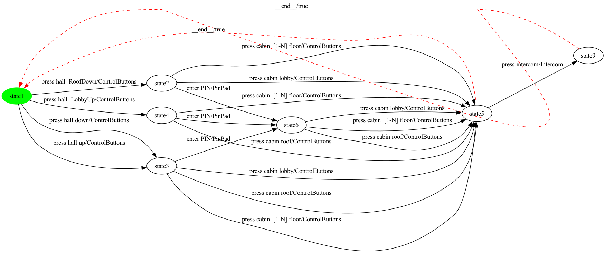

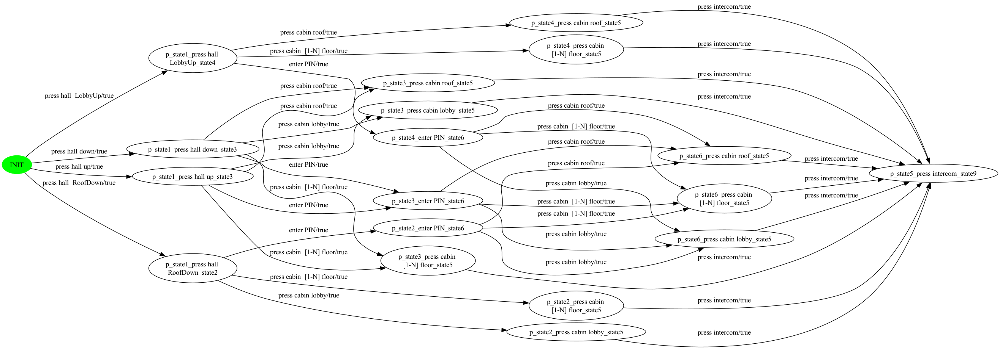

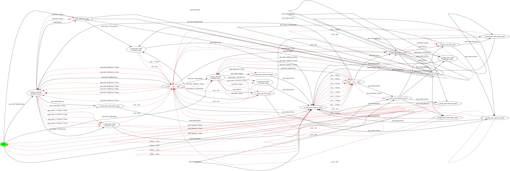

**Generated test suite** — 18 unique test case(s) after action-sequence dedup (18 pair-graph segment(s), 50 raw real step(s); pair-graph cycle has 56 edge(s) total, 19 synthetic dropped at translation). Operationally-identical trips (same action sequence, possibly different transition-level pairs) are listed once.

- **test case 1**: `press hall down -> press cabin lobby -> press intercom`
- **test case 2**: `press hall LobbyUp -> press cabin roof -> press intercom`
- **test case 3**: `press hall RoofDown -> enter PIN -> press cabin [1-N] floor -> press intercom`
- **test case 4**: `press hall RoofDown -> press cabin [1-N] floor -> press intercom`
- **test case 5**: `press hall down -> press cabin roof -> press intercom`
- **test case 6**: `press hall down -> enter PIN -> press cabin roof -> press intercom`
- **test case 7**: `press hall down -> press cabin [1-N] floor -> press intercom`
- **test case 8**: `enter PIN -> press cabin [1-N] floor`
- **test case 9**: `press hall up -> press cabin lobby`
- **test case 10**: `enter PIN -> press cabin lobby -> press intercom`
- **test case 11**: `enter PIN -> press cabin roof`
- **test case 12**: `press hall up -> press cabin roof`
- **test case 13**: `press hall up -> enter PIN -> press cabin [1-N] floor`
- **test case 14**: `press hall up -> press cabin [1-N] floor`
- **test case 15**: `press hall LobbyUp -> press cabin [1-N] floor -> press intercom`
- **test case 16**: `enter PIN -> press cabin lobby`
- **test case 17**: `press hall LobbyUp -> enter PIN -> press cabin lobby`
- **test case 18**: `press hall RoofDown -> press cabin lobby -> press intercom`

### Product 40

**Selected features:** selected = {Alarm, ControlButtons, ManualDoorControl, PinPad}

**Repaired FTS:** 9 states, 26 transitions (22 real / 4 `__end__`).

**Pair graph (raw):** 23 nodes (incl. INIT), 61 edges (every edge = one contiguous transition pair in the original FTS; the subset starting at INIT correspond to pairs `(start, t)` for any original initial-state outgoing `t`).

**Pair graph (balanced):** 23 nodes, 91 edges (30 synthetic `__balance__N` added to restore in-balance at INIT).

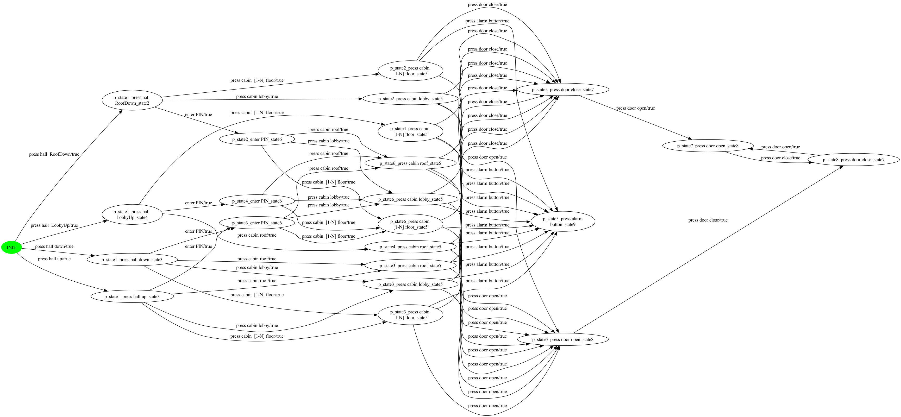

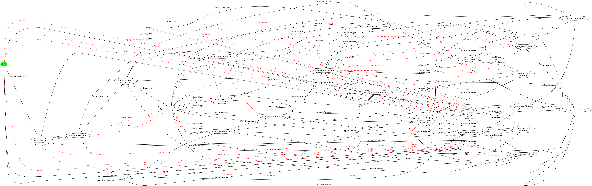

**Generated test suite** — 25 unique test case(s) after action-sequence dedup (25 pair-graph segment(s), 77 raw real step(s); pair-graph cycle has 91 edge(s) total, 30 synthetic dropped at translation). Operationally-identical trips (same action sequence, possibly different transition-level pairs) are listed once.

- **test case 1**: `press hall RoofDown -> press cabin lobby -> press door open -> press door close -> press door open -> press door close`
- **test case 2**: `press hall down -> press cabin lobby -> press door open`
- **test case 3**: `press cabin roof -> press alarm button`
- **test case 4**: `press hall up -> press cabin lobby -> press alarm button`
- **test case 5**: `press hall LobbyUp -> press cabin roof -> press door open`
- **test case 6**: `press cabin roof -> press door close -> press door open`
- **test case 7**: `press cabin lobby -> press door close`
- **test case 8**: `enter PIN -> press cabin [1-N] floor -> press door close`
- **test case 9**: `enter PIN -> press cabin roof -> press alarm button`
- **test case 10**: `press hall LobbyUp -> press cabin [1-N] floor -> press door close`
- **test case 11**: `enter PIN -> press cabin lobby -> press door open`
- **test case 12**: `press cabin lobby -> press alarm button`
- **test case 13**: `press hall RoofDown -> enter PIN -> press cabin [1-N] floor -> press alarm button`
- **test case 14**: `press hall RoofDown -> press cabin [1-N] floor -> press door close`
- **test case 15**: `enter PIN -> press cabin roof -> press door close`
- **test case 16**: `press cabin [1-N] floor -> press alarm button`
- **test case 17**: `press cabin [1-N] floor -> press door open`
- **test case 18**: `enter PIN -> press cabin [1-N] floor -> press door open`
- **test case 19**: `press hall down -> press cabin roof -> press door open`
- **test case 20**: `press hall LobbyUp -> enter PIN -> press cabin lobby -> press door close`
- **test case 21**: `press hall up -> press cabin roof -> press door close`
- **test case 22**: `press hall up -> enter PIN -> press cabin lobby -> press alarm button`
- **test case 23**: `press hall down -> press cabin [1-N] floor -> press door close`
- **test case 24**: `press hall up -> press cabin [1-N] floor -> press alarm button`
- **test case 25**: `press hall down -> enter PIN -> press cabin roof -> press door open`

### Product 41

**Selected features:** selected = {Alarm, ControlButtons, ExecutiveFloor, Intercom, ManualDoorControl, PinPad}

**Repaired FTS:** 10 states, 33 transitions (28 real / 5 `__end__`).

**Pair graph (raw):** 29 nodes (incl. INIT), 80 edges (every edge = one contiguous transition pair in the original FTS; the subset starting at INIT correspond to pairs `(start, t)` for any original initial-state outgoing `t`).

**Pair graph (balanced):** 29 nodes, 124 edges (44 synthetic `__balance__N` added to restore in-balance at INIT).

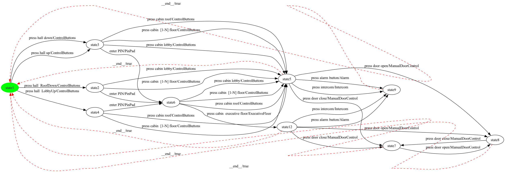

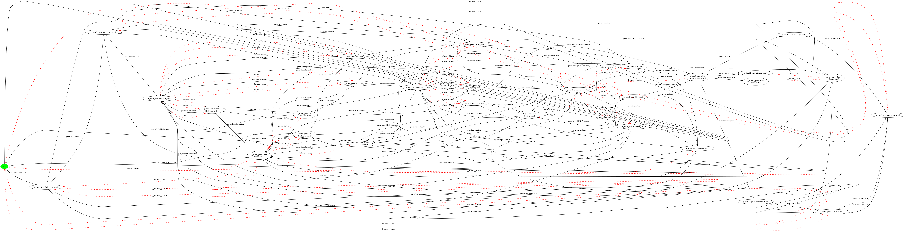

**Generated test suite** — 33 unique test case(s) after action-sequence dedup (33 pair-graph segment(s), 98 raw real step(s); pair-graph cycle has 124 edge(s) total, 44 synthetic dropped at translation). Operationally-identical trips (same action sequence, possibly different transition-level pairs) are listed once.

- **test case 1**: `press hall RoofDown -> press cabin lobby -> press door open -> press door close -> press door open -> press door close`
- **test case 2**: `press hall down -> press cabin lobby -> press door open`
- **test case 3**: `press cabin roof -> press alarm button`
- **test case 4**: `press hall up -> press cabin lobby -> press alarm button`
- **test case 5**: `press hall LobbyUp -> press cabin roof -> press door open`
- **test case 6**: `press cabin roof -> press intercom`
- **test case 7**: `press cabin roof -> press door open`
- **test case 8**: `press cabin roof -> press door close -> press door open`
- **test case 9**: `press cabin lobby -> press intercom`
- **test case 10**: `enter PIN -> press cabin lobby -> press door open`
- **test case 11**: `press cabin lobby -> press alarm button`
- **test case 12**: `press hall LobbyUp -> press cabin [1-N] floor -> press door close`
- **test case 13**: `enter PIN -> press cabin [1-N] floor -> press intercom`
- **test case 14**: `enter PIN -> press cabin [1-N] floor -> press door close`
- **test case 15**: `enter PIN -> press cabin executive floor -> press door open -> press door close`
- **test case 16**: `press hall LobbyUp -> enter PIN -> press cabin roof -> press alarm button`
- **test case 17**: `press hall RoofDown -> enter PIN -> press cabin executive floor -> press alarm button`
- **test case 18**: `press cabin [1-N] floor -> press door open`
- **test case 19**: `enter PIN -> press cabin roof -> press door close`
- **test case 20**: `enter PIN -> press cabin lobby -> press intercom`
- **test case 21**: `press cabin [1-N] floor -> press alarm button`
- **test case 22**: `press hall RoofDown -> press cabin [1-N] floor -> press door close`
- **test case 23**: `press cabin executive floor -> press door close -> press door open`
- **test case 24**: `press cabin lobby -> press door close`
- **test case 25**: `press cabin [1-N] floor -> press intercom`
- **test case 26**: `enter PIN -> press cabin [1-N] floor -> press door open`
- **test case 27**: `enter PIN -> press cabin roof -> press door open`
- **test case 28**: `press hall up -> press cabin roof -> press door close`
- **test case 29**: `press hall up -> enter PIN -> press cabin lobby -> press alarm button`
- **test case 30**: `press hall down -> press cabin roof -> press alarm button`
- **test case 31**: `press hall down -> enter PIN -> press cabin executive floor -> press intercom`
- **test case 32**: `press hall down -> press cabin [1-N] floor -> press door close`
- **test case 33**: `press hall up -> press cabin [1-N] floor -> press intercom`

### Product 42

**Selected features:** selected = {Alarm, ControlButtons, Intercom, ManualDoorControl, PinPad}

**Repaired FTS:** 9 states, 27 transitions (23 real / 4 `__end__`).

**Pair graph (raw):** 24 nodes (incl. INIT), 71 edges (every edge = one contiguous transition pair in the original FTS; the subset starting at INIT correspond to pairs `(start, t)` for any original initial-state outgoing `t`).

**Pair graph (balanced):** 24 nodes, 111 edges (40 synthetic `__balance__N` added to restore in-balance at INIT).

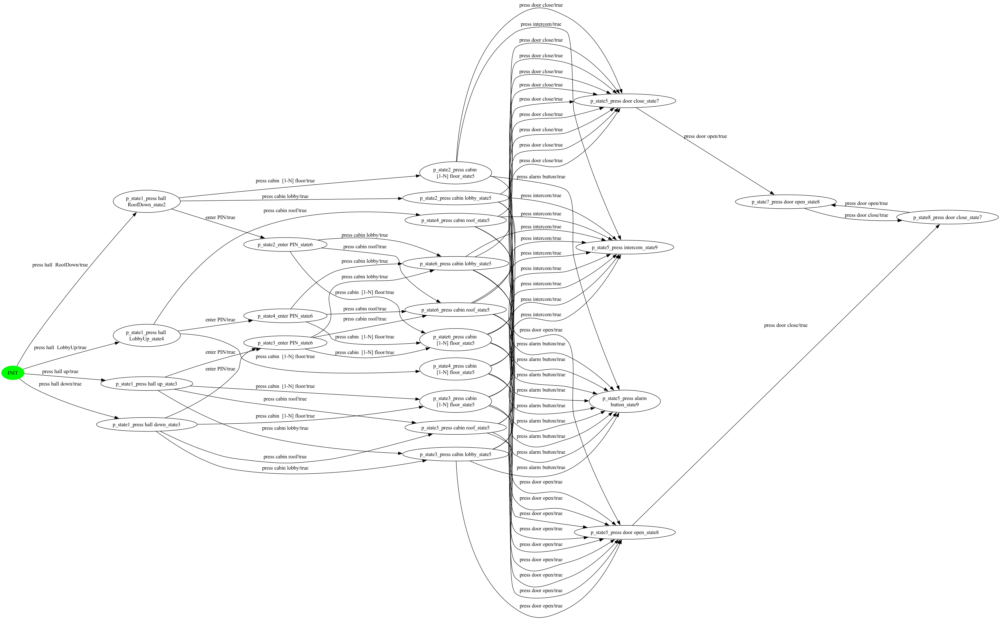

**Generated test suite** — 32 unique test case(s) after action-sequence dedup (32 pair-graph segment(s), 91 raw real step(s); pair-graph cycle has 111 edge(s) total, 40 synthetic dropped at translation). Operationally-identical trips (same action sequence, possibly different transition-level pairs) are listed once.

- **test case 1**: `press hall RoofDown -> press cabin lobby -> press door open -> press door close -> press door open -> press door close`
- **test case 2**: `press cabin roof -> press alarm button`
- **test case 3**: `press cabin lobby -> press door open`
- **test case 4**: `press cabin [1-N] floor -> press door open`
- **test case 5**: `press cabin roof -> press door open`
- **test case 6**: `press cabin roof -> press intercom`
- **test case 7**: `press cabin [1-N] floor -> press door close -> press door open`
- **test case 8**: `press cabin lobby -> press alarm button`
- **test case 9**: `press cabin [1-N] floor -> press alarm button`
- **test case 10**: `press hall down -> press cabin lobby -> press intercom`
- **test case 11**: `press cabin [1-N] floor -> press intercom`
- **test case 12**: `press hall down -> press cabin roof -> press intercom`
- **test case 13**: `press hall up -> press cabin lobby -> press door close`
- **test case 14**: `enter PIN -> press cabin lobby -> press intercom`
- **test case 15**: `press hall LobbyUp -> press cabin roof -> press door close`
- **test case 16**: `enter PIN -> press cabin [1-N] floor -> press intercom`
- **test case 17**: `press hall LobbyUp -> press cabin [1-N] floor -> press alarm button`
- **test case 18**: `press hall down -> enter PIN -> press cabin [1-N] floor -> press door close`
- **test case 19**: `press cabin [1-N] floor -> press door close`
- **test case 20**: `press hall down -> press cabin [1-N] floor -> press door close`
- **test case 21**: `press cabin lobby -> press intercom`
- **test case 22**: `press hall LobbyUp -> enter PIN -> press cabin [1-N] floor -> press alarm button`
- **test case 23**: `press cabin roof -> press door close`
- **test case 24**: `press cabin lobby -> press door close`
- **test case 25**: `press hall up -> press cabin roof -> press alarm button`
- **test case 26**: `enter PIN -> press cabin roof -> press door close`
- **test case 27**: `press hall up -> enter PIN -> press cabin roof -> press intercom`
- **test case 28**: `press hall RoofDown -> enter PIN -> press cabin roof -> press door open`
- **test case 29**: `enter PIN -> press cabin lobby -> press alarm button`
- **test case 30**: `enter PIN -> press cabin lobby -> press door close`
- **test case 31**: `press hall up -> press cabin [1-N] floor -> press intercom`
- **test case 32**: `press hall RoofDown -> press cabin [1-N] floor -> press intercom`

---

Total products: 42.
