# Per-Product All-Transition-Pairs Coverage — SVM

## How the all-transition-pairs test suite is built

**Why a fresh transformation, not `vibes-transformation`.** The legacy `vibes-transformation` module (not in the root pom) is an I/O and format-conversion layer (AUT &harr; LTS, XML readers, Dot printers, structural pruning) operating on the obsolete `be.unamur.transitionsystem.*` namespace; it does not contain anything for pair-graph / k-tuple coverage transformation and is dormant. The L=2 pair graph here is the FTS analog of the ESG-Fx-side `TransformedESGFxGenerator` (from the user's prior published study); we re-implement against the current `be.vibes.ts.*` types directly.

**Reduction insight.** The pair-coverage problem on FTS *F* reduces to the edge-coverage problem on a transformed FTS *P(F)* — the *pair graph*. A Hierholzer Euler cycle on *P(F)* visits every edge of *P(F)* exactly once, which by construction means every contiguous transition pair of *F* is exercised in the resulting test sequence.

**Step 1 — Project onto the product.** Same as the other criteria: `FExpressionPreservingProjection.project(fts, config)` keeps transitions whose feature expression evaluates true; reachability filter drops unreachable states.

**Step 2 — Repair strong connectivity on the original FTS.** Same as the other criteria: `InitialSccFilter.keepInitialScc(projected)`.

**Step 3 — Build the pair graph.** [`PairGraphTransformer.transform(repaired)`](../../../vibes-testgeneration/src/main/java/be/vibes/testgeneration/coverage/PairGraphTransformer.java) produces a pair graph *P(F)* whose:

- **node** = original transition (named `p_<source>_<action>_<target>`), plus a synthetic `INIT` node representing "no transition executed yet";
- **edge** `INIT -> p(t)` (labelled `action(t)`) for every original transition `t` starting at the original initial state;
- **edge** `p(t1) -> p(t2)` (labelled `action(t2)`) for every ordered pair `(t1, t2)` with `target(t1) == source(t2)`.

Complexity: enumerate via an outgoing-by-source index on the original FTS, so the construction is *O(|T| + sum_s out_deg(s))* rather than *O(|T|^2)*. The transformer also returns a side-map `pairStateToOriginalTransition` used in step 6 to translate the pair-graph cycle back to original transitions.

**Step 4 — Balance (no SCC precheck).** The pair graph is intentionally not strongly connected at this point: INIT has out-degree N (one per original initial-state transition) and in-degree 0. Running the usual `InitialSccFilter` here would discard everything except INIT. [`EulerianBalancer.balanceWithoutPrecheck(pairGraph)`](../../../vibes-testgeneration/src/main/java/be/vibes/testgeneration/graph/EulerianBalancer.java) skips the SCC check and supplies the missing INIT-incoming edges as synthetic `__balance__N` edges — exactly enough to make every pair-graph state in-balanced AND restore strong connectivity. The balanced pair graph is verified to be strongly connected after this step; if it isn't, the projection has produced an unrepaired pair-graph fragment (does not happen on the three MVP SPLs).

**Step 5 — Hierholzer Euler cycle on the balanced pair graph.** [`HierholzerEulerCycle.compute(balanced)`](../../../vibes-testgeneration/src/main/java/be/vibes/testgeneration/graph/HierholzerEulerCycle.java) returns one contiguous cycle visiting every pair-graph edge exactly once. By the reduction insight above, every contiguous transition pair of the original FTS is covered.

**Step 6 — Split + translate back.** Synthetic `__balance__N` edges in the pair-graph cycle cannot be replayed in the original FTS (they encode "teleport back to INIT"), so the cycle is split at every synthetic edge. Each non-synthetic segment is translated: each pair-graph edge `p(t1) -> p(t2)` corresponds to executing `t2` in the original FTS (the side-map gives us `t2` from the edge's target pair-state). One subtlety: the FIRST pair-graph edge of a non-INIT-starting segment carries a real pair `(t_Y, t_X)` that would otherwise be split across two test cases by the synthetic teleport. To preserve coverage we PREPEND `t_Y` to the segment (the test case then starts mid-FTS at `source(t_Y)` — legal as long as the executor is reset between test cases).

**Step 7 — Wrap into a List<TestCase>.** Unlike all-transitions and all-states (which return one TestCase), this generator returns a *suite* because the pair graph naturally yields multiple test cases (one per real segment between synthetic teleports). For display each TestCase is additionally split at every visit to the original repaired FTS's initial state via `TestCaseSplitter.splitAtInitialReturns(...)` — same operational test-case semantics as the other two reports.

**Coverage claim.** Hierholzer visits every pair-graph edge exactly once → every contiguous original transition pair is covered, by construction. The pair-graph reachable-pair count is the denominator; pairs that exist only via dropped transitions (post-projection) are NOT in the denominator, which is the correct semantics for product-level coverage.

---

## Products

Three FTS images per product: (a) the repaired original FTS — source of the pair info; (b) the pair graph BEFORE balancing — INIT is source-only and the graph is not Eulerian; (c) the pair graph AFTER balancing — synthetic edges (`__balance__N`) added back to INIT shown as dashed-red. Generated test cases are listed underneath, split at every visit to the original repaired FTS's initial state. Synthetic actions are hidden / `__dup__N` is stripped, same convention as the other reports.

### Product 1

**Selected features:** selected = {c, f, t}

**Repaired FTS:** 5 states, 6 transitions (6 real / 0 `__end__`).

**Pair graph (raw):** 7 nodes (incl. INIT), 8 edges (every edge = one contiguous transition pair in the original FTS; the subset starting at INIT correspond to pairs `(start, t)` for any original initial-state outgoing `t`).

**Pair graph (balanced):** 7 nodes, 9 edges (1 synthetic `__balance__N` added to restore in-balance at INIT).

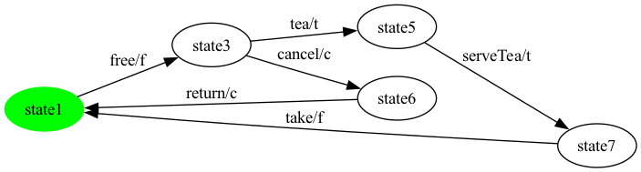

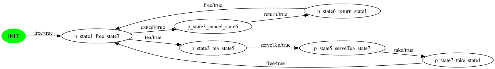

**Generated test suite** — 3 unique test case(s) after action-sequence dedup (1 pair-graph segment(s), 8 raw real step(s); pair-graph cycle has 9 edge(s) total, 1 synthetic dropped at translation). Operationally-identical trips (same action sequence, possibly different transition-level pairs) are listed once.

- **test case 1**: `free -> tea -> serveTea -> take`
- **test case 2**: `free -> cancel -> return`
- **test case 3**: `free`

### Product 2

**Selected features:** selected = {s, t}

**Repaired FTS:** 8 states, 9 transitions (9 real / 0 `__end__`).

**Pair graph (raw):** 10 nodes (incl. INIT), 11 edges (every edge = one contiguous transition pair in the original FTS; the subset starting at INIT correspond to pairs `(start, t)` for any original initial-state outgoing `t`).

**Pair graph (balanced):** 10 nodes, 13 edges (2 synthetic `__balance__N` added to restore in-balance at INIT).

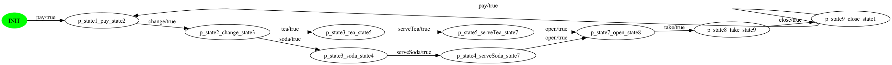

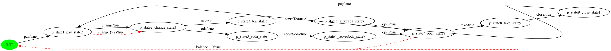

**Generated test suite** — 3 unique test case(s) after action-sequence dedup (2 pair-graph segment(s), 12 raw real step(s); pair-graph cycle has 13 edge(s) total, 2 synthetic dropped at translation). Operationally-identical trips (same action sequence, possibly different transition-level pairs) are listed once.

- **test case 1**: `pay -> change -> tea -> serveTea -> open -> take -> close`
- **test case 2**: `pay`
- **test case 3**: `change -> soda -> serveSoda -> open`

### Product 3

**Selected features:** selected = {s}

**Repaired FTS:** 7 states, 7 transitions (7 real / 0 `__end__`).

**Pair graph (raw):** 8 nodes (incl. INIT), 8 edges (every edge = one contiguous transition pair in the original FTS; the subset starting at INIT correspond to pairs `(start, t)` for any original initial-state outgoing `t`).

**Pair graph (balanced):** 8 nodes, 9 edges (1 synthetic `__balance__N` added to restore in-balance at INIT).

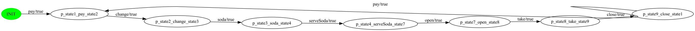

**Generated test suite** — 2 unique test case(s) after action-sequence dedup (1 pair-graph segment(s), 8 raw real step(s); pair-graph cycle has 9 edge(s) total, 1 synthetic dropped at translation). Operationally-identical trips (same action sequence, possibly different transition-level pairs) are listed once.

- **test case 1**: `pay -> change -> soda -> serveSoda -> open -> take -> close`
- **test case 2**: `pay`

### Product 4

**Selected features:** selected = {t}

**Repaired FTS:** 7 states, 7 transitions (7 real / 0 `__end__`).

**Pair graph (raw):** 8 nodes (incl. INIT), 8 edges (every edge = one contiguous transition pair in the original FTS; the subset starting at INIT correspond to pairs `(start, t)` for any original initial-state outgoing `t`).

**Pair graph (balanced):** 8 nodes, 9 edges (1 synthetic `__balance__N` added to restore in-balance at INIT).

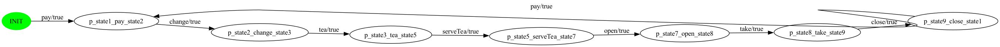

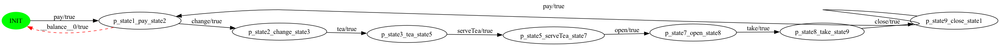

**Generated test suite** — 2 unique test case(s) after action-sequence dedup (1 pair-graph segment(s), 8 raw real step(s); pair-graph cycle has 9 edge(s) total, 1 synthetic dropped at translation). Operationally-identical trips (same action sequence, possibly different transition-level pairs) are listed once.

- **test case 1**: `pay -> change -> tea -> serveTea -> open -> take -> close`
- **test case 2**: `pay`

### Product 5

**Selected features:** selected = {f, s, t}

**Repaired FTS:** 5 states, 6 transitions (6 real / 0 `__end__`).

**Pair graph (raw):** 7 nodes (incl. INIT), 8 edges (every edge = one contiguous transition pair in the original FTS; the subset starting at INIT correspond to pairs `(start, t)` for any original initial-state outgoing `t`).

**Pair graph (balanced):** 7 nodes, 9 edges (1 synthetic `__balance__N` added to restore in-balance at INIT).

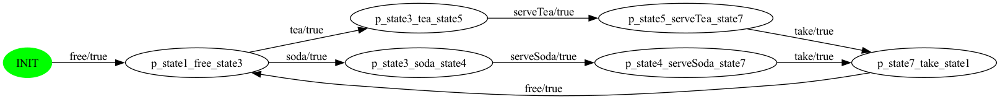

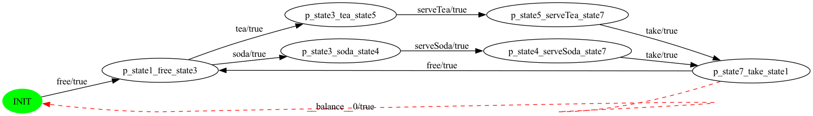

**Generated test suite** — 2 unique test case(s) after action-sequence dedup (1 pair-graph segment(s), 8 raw real step(s); pair-graph cycle has 9 edge(s) total, 1 synthetic dropped at translation). Operationally-identical trips (same action sequence, possibly different transition-level pairs) are listed once.

- **test case 1**: `free -> tea -> serveTea -> take`
- **test case 2**: `free -> soda -> serveSoda -> take`

### Product 6

**Selected features:** selected = {c, f, s}

**Repaired FTS:** 5 states, 6 transitions (6 real / 0 `__end__`).

**Pair graph (raw):** 7 nodes (incl. INIT), 8 edges (every edge = one contiguous transition pair in the original FTS; the subset starting at INIT correspond to pairs `(start, t)` for any original initial-state outgoing `t`).

**Pair graph (balanced):** 7 nodes, 9 edges (1 synthetic `__balance__N` added to restore in-balance at INIT).

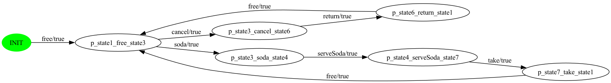

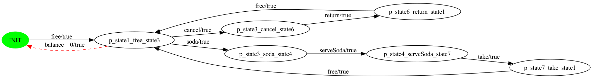

**Generated test suite** — 3 unique test case(s) after action-sequence dedup (1 pair-graph segment(s), 8 raw real step(s); pair-graph cycle has 9 edge(s) total, 1 synthetic dropped at translation). Operationally-identical trips (same action sequence, possibly different transition-level pairs) are listed once.

- **test case 1**: `free -> cancel -> return`
- **test case 2**: `free -> soda -> serveSoda -> take`
- **test case 3**: `free`

### Product 7

**Selected features:** selected = {c, s}

**Repaired FTS:** 8 states, 9 transitions (9 real / 0 `__end__`).

**Pair graph (raw):** 10 nodes (incl. INIT), 11 edges (every edge = one contiguous transition pair in the original FTS; the subset starting at INIT correspond to pairs `(start, t)` for any original initial-state outgoing `t`).

**Pair graph (balanced):** 10 nodes, 13 edges (2 synthetic `__balance__N` added to restore in-balance at INIT).

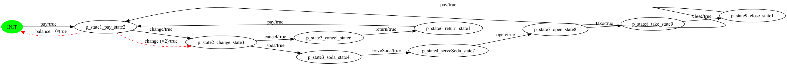

**Generated test suite** — 3 unique test case(s) after action-sequence dedup (2 pair-graph segment(s), 12 raw real step(s); pair-graph cycle has 13 edge(s) total, 2 synthetic dropped at translation). Operationally-identical trips (same action sequence, possibly different transition-level pairs) are listed once.

- **test case 1**: `pay -> change -> soda -> serveSoda -> open -> take -> close`
- **test case 2**: `pay`
- **test case 3**: `change -> cancel -> return`

### Product 8

**Selected features:** selected = {f, t}

**Repaired FTS:** 4 states, 4 transitions (4 real / 0 `__end__`).

**Pair graph (raw):** 5 nodes (incl. INIT), 5 edges (every edge = one contiguous transition pair in the original FTS; the subset starting at INIT correspond to pairs `(start, t)` for any original initial-state outgoing `t`).

**Pair graph (balanced):** 5 nodes, 6 edges (1 synthetic `__balance__N` added to restore in-balance at INIT).

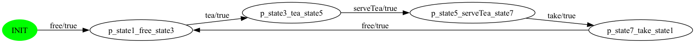

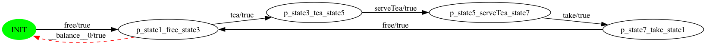

**Generated test suite** — 2 unique test case(s) after action-sequence dedup (1 pair-graph segment(s), 5 raw real step(s); pair-graph cycle has 6 edge(s) total, 1 synthetic dropped at translation). Operationally-identical trips (same action sequence, possibly different transition-level pairs) are listed once.

- **test case 1**: `free -> tea -> serveTea -> take`
- **test case 2**: `free`

### Product 9

**Selected features:** selected = {c, f, s, t}

**Repaired FTS:** 6 states, 8 transitions (8 real / 0 `__end__`).

**Pair graph (raw):** 9 nodes (incl. INIT), 11 edges (every edge = one contiguous transition pair in the original FTS; the subset starting at INIT correspond to pairs `(start, t)` for any original initial-state outgoing `t`).

**Pair graph (balanced):** 9 nodes, 12 edges (1 synthetic `__balance__N` added to restore in-balance at INIT).

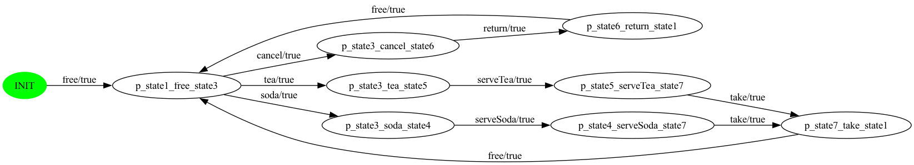

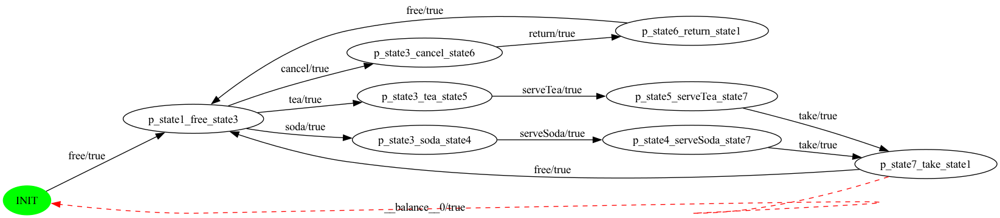

**Generated test suite** — 3 unique test case(s) after action-sequence dedup (1 pair-graph segment(s), 11 raw real step(s); pair-graph cycle has 12 edge(s) total, 1 synthetic dropped at translation). Operationally-identical trips (same action sequence, possibly different transition-level pairs) are listed once.

- **test case 1**: `free -> tea -> serveTea -> take`
- **test case 2**: `free -> cancel -> return`
- **test case 3**: `free -> soda -> serveSoda -> take`

### Product 10

**Selected features:** selected = {c, s, t}

**Repaired FTS:** 9 states, 11 transitions (11 real / 0 `__end__`).

**Pair graph (raw):** 12 nodes (incl. INIT), 14 edges (every edge = one contiguous transition pair in the original FTS; the subset starting at INIT correspond to pairs `(start, t)` for any original initial-state outgoing `t`).

**Pair graph (balanced):** 12 nodes, 17 edges (3 synthetic `__balance__N` added to restore in-balance at INIT).

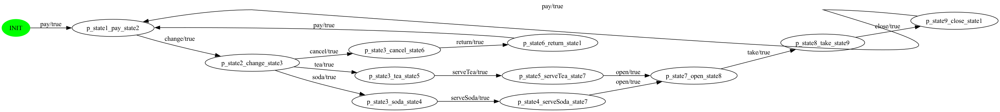

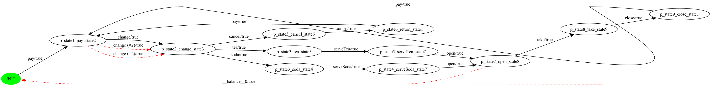

**Generated test suite** — 4 unique test case(s) after action-sequence dedup (3 pair-graph segment(s), 16 raw real step(s); pair-graph cycle has 17 edge(s) total, 3 synthetic dropped at translation). Operationally-identical trips (same action sequence, possibly different transition-level pairs) are listed once.

- **test case 1**: `pay -> change -> tea -> serveTea -> open -> take -> close`
- **test case 2**: `pay`
- **test case 3**: `change -> cancel -> return`
- **test case 4**: `change -> soda -> serveSoda -> open`

### Product 11

**Selected features:** selected = {c, t}

**Repaired FTS:** 8 states, 9 transitions (9 real / 0 `__end__`).

**Pair graph (raw):** 10 nodes (incl. INIT), 11 edges (every edge = one contiguous transition pair in the original FTS; the subset starting at INIT correspond to pairs `(start, t)` for any original initial-state outgoing `t`).

**Pair graph (balanced):** 10 nodes, 13 edges (2 synthetic `__balance__N` added to restore in-balance at INIT).

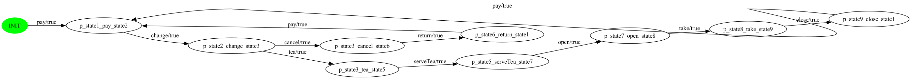

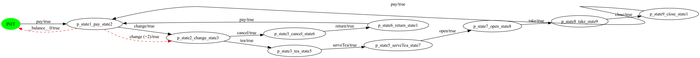

**Generated test suite** — 3 unique test case(s) after action-sequence dedup (2 pair-graph segment(s), 12 raw real step(s); pair-graph cycle has 13 edge(s) total, 2 synthetic dropped at translation). Operationally-identical trips (same action sequence, possibly different transition-level pairs) are listed once.

- **test case 1**: `pay -> change -> tea -> serveTea -> open -> take -> close`
- **test case 2**: `pay`
- **test case 3**: `change -> cancel -> return`

### Product 12

**Selected features:** selected = {f, s}

**Repaired FTS:** 4 states, 4 transitions (4 real / 0 `__end__`).

**Pair graph (raw):** 5 nodes (incl. INIT), 5 edges (every edge = one contiguous transition pair in the original FTS; the subset starting at INIT correspond to pairs `(start, t)` for any original initial-state outgoing `t`).

**Pair graph (balanced):** 5 nodes, 6 edges (1 synthetic `__balance__N` added to restore in-balance at INIT).

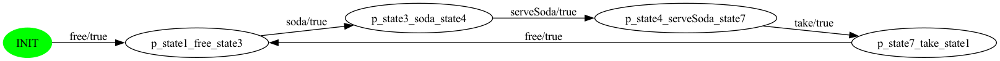

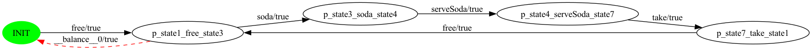

**Generated test suite** — 2 unique test case(s) after action-sequence dedup (1 pair-graph segment(s), 5 raw real step(s); pair-graph cycle has 6 edge(s) total, 1 synthetic dropped at translation). Operationally-identical trips (same action sequence, possibly different transition-level pairs) are listed once.

- **test case 1**: `free -> soda -> serveSoda -> take`
- **test case 2**: `free`

---

Total products: 12.
