# Per-Product All-Transition-Pairs Coverage — eMail

## How the all-transition-pairs test suite is built

**Why a fresh transformation, not `vibes-transformation`.** The legacy `vibes-transformation` module (not in the root pom) is an I/O and format-conversion layer (AUT &harr; LTS, XML readers, Dot printers, structural pruning) operating on the obsolete `be.unamur.transitionsystem.*` namespace; it does not contain anything for pair-graph / k-tuple coverage transformation and is dormant. The L=2 pair graph here is the FTS analog of the ESG-Fx-side `TransformedESGFxGenerator` (from the user's prior published study); we re-implement against the current `be.vibes.ts.*` types directly.

**Reduction insight.** The pair-coverage problem on FTS *F* reduces to the edge-coverage problem on a transformed FTS *P(F)* — the *pair graph*. A Hierholzer Euler cycle on *P(F)* visits every edge of *P(F)* exactly once, which by construction means every contiguous transition pair of *F* is exercised in the resulting test sequence.

**Step 1 — Project onto the product.** Same as the other criteria: `FExpressionPreservingProjection.project(fts, config)` keeps transitions whose feature expression evaluates true; reachability filter drops unreachable states.

**Step 2 — Repair strong connectivity on the original FTS.** Same as the other criteria: `InitialSccFilter.keepInitialScc(projected)`.

**Step 3 — Build the pair graph.** [`PairGraphTransformer.transform(repaired)`](../../../vibes-testgeneration/src/main/java/be/vibes/testgeneration/coverage/PairGraphTransformer.java) produces a pair graph *P(F)* whose:

- **node** = original transition (named `p_<source>_<action>_<target>`), plus a synthetic `INIT` node representing "no transition executed yet";
- **edge** `INIT -> p(t)` (labelled `action(t)`) for every original transition `t` starting at the original initial state;
- **edge** `p(t1) -> p(t2)` (labelled `action(t2)`) for every ordered pair `(t1, t2)` with `target(t1) == source(t2)`.

Complexity: enumerate via an outgoing-by-source index on the original FTS, so the construction is *O(|T| + sum_s out_deg(s))* rather than *O(|T|^2)*. The transformer also returns a side-map `pairStateToOriginalTransition` used in step 6 to translate the pair-graph cycle back to original transitions.

**Step 4 — Balance (no SCC precheck).** The pair graph is intentionally not strongly connected at this point: INIT has out-degree N (one per original initial-state transition) and in-degree 0. Running the usual `InitialSccFilter` here would discard everything except INIT. [`EulerianBalancer.balanceWithoutPrecheck(pairGraph)`](../../../vibes-testgeneration/src/main/java/be/vibes/testgeneration/graph/EulerianBalancer.java) skips the SCC check and supplies the missing INIT-incoming edges as synthetic `__balance__N` edges — exactly enough to make every pair-graph state in-balanced AND restore strong connectivity. The balanced pair graph is verified to be strongly connected after this step; if it isn't, the projection has produced an unrepaired pair-graph fragment (does not happen on the three MVP SPLs).

**Step 5 — Hierholzer Euler cycle on the balanced pair graph.** [`HierholzerEulerCycle.compute(balanced)`](../../../vibes-testgeneration/src/main/java/be/vibes/testgeneration/graph/HierholzerEulerCycle.java) returns one contiguous cycle visiting every pair-graph edge exactly once. By the reduction insight above, every contiguous transition pair of the original FTS is covered.

**Step 6 — Split + translate back.** Synthetic `__balance__N` edges in the pair-graph cycle cannot be replayed in the original FTS (they encode "teleport back to INIT"), so the cycle is split at every synthetic edge. Each non-synthetic segment is translated: each pair-graph edge `p(t1) -> p(t2)` corresponds to executing `t2` in the original FTS (the side-map gives us `t2` from the edge's target pair-state). One subtlety: the FIRST pair-graph edge of a non-INIT-starting segment carries a real pair `(t_Y, t_X)` that would otherwise be split across two test cases by the synthetic teleport. To preserve coverage we PREPEND `t_Y` to the segment (the test case then starts mid-FTS at `source(t_Y)` — legal as long as the executor is reset between test cases).

**Step 7 — Wrap into a List<TestCase>.** Unlike all-transitions and all-states (which return one TestCase), this generator returns a *suite* because the pair graph naturally yields multiple test cases (one per real segment between synthetic teleports). For display each TestCase is additionally split at every visit to the original repaired FTS's initial state via `TestCaseSplitter.splitAtInitialReturns(...)` — same operational test-case semantics as the other two reports.

**Coverage claim.** Hierholzer visits every pair-graph edge exactly once → every contiguous original transition pair is covered, by construction. The pair-graph reachable-pair count is the denominator; pairs that exist only via dropped transitions (post-projection) are NOT in the denominator, which is the correct semantics for product-level coverage.

---

## Products

Three FTS images per product: (a) the repaired original FTS — source of the pair info; (b) the pair graph BEFORE balancing — INIT is source-only and the graph is not Eulerian; (c) the pair graph AFTER balancing — synthetic edges (`__balance__N`) added back to INIT shown as dashed-red. Generated test cases are listed underneath, split at every visit to the original repaired FTS's initial state. Synthetic actions are hidden / `__dup__N` is stripped, same convention as the other reports.

### Product 1

**Selected features:** selected = {e, s}

**Repaired FTS:** 6 states, 12 transitions (11 real / 1 `__end__`).

**Pair graph (raw):** 12 nodes (incl. INIT), 28 edges (every edge = one contiguous transition pair in the original FTS; the subset starting at INIT correspond to pairs `(start, t)` for any original initial-state outgoing `t`).

**Pair graph (balanced):** 12 nodes, 39 edges (11 synthetic `__balance__N` added to restore in-balance at INIT).

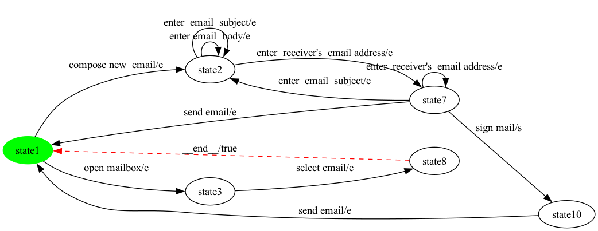

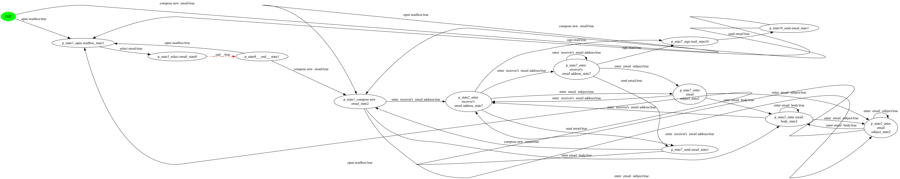

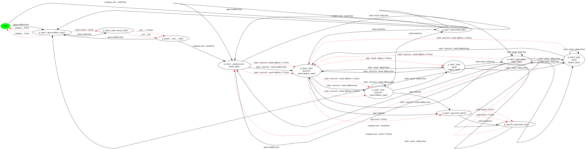

**Generated test suite** — 12 unique test case(s) after action-sequence dedup (9 pair-graph segment(s), 35 raw real step(s); pair-graph cycle has 39 edge(s) total, 11 synthetic dropped at translation). Operationally-identical trips (same action sequence, possibly different transition-level pairs) are listed once.

- **test case 1**: `compose new email -> enter email subject -> enter email subject -> enter email body`
- **test case 2**: `enter receiver's email address -> sign mail -> send email`
- **test case 3**: `open mailbox -> select email`
- **test case 4**: `open mailbox`
- **test case 5**: `send email`
- **test case 6**: `compose new email -> enter email body -> enter receiver's email address`
- **test case 7**: `enter receiver's email address -> send email`
- **test case 8**: `compose new email -> enter receiver's email address`
- **test case 9**: `enter receiver's email address -> sign mail`
- **test case 10**: `enter receiver's email address -> enter receiver's email address -> enter receiver's email address -> enter email subject -> enter email subject`
- **test case 11**: `enter receiver's email address -> enter email subject -> enter receiver's email address`
- **test case 12**: `enter email subject -> enter email body -> enter email body -> enter email subject -> enter receiver's email address -> send email`

### Product 2

**Selected features:** selected = {ad, e}

**Repaired FTS:** 8 states, 15 transitions (14 real / 1 `__end__`).

**Pair graph (raw):** 15 nodes (incl. INIT), 36 edges (every edge = one contiguous transition pair in the original FTS; the subset starting at INIT correspond to pairs `(start, t)` for any original initial-state outgoing `t`).

**Pair graph (balanced):** 15 nodes, 56 edges (20 synthetic `__balance__N` added to restore in-balance at INIT).

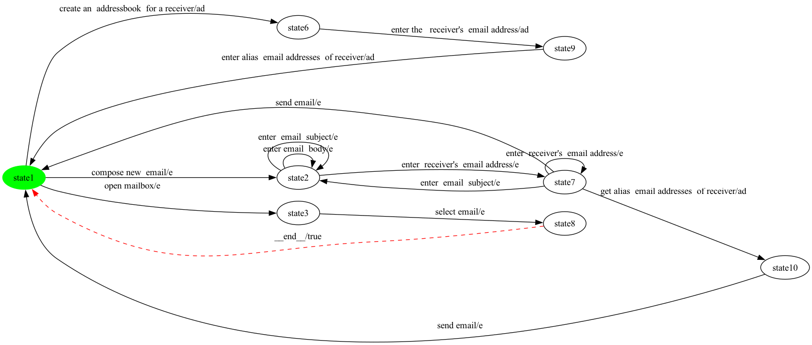

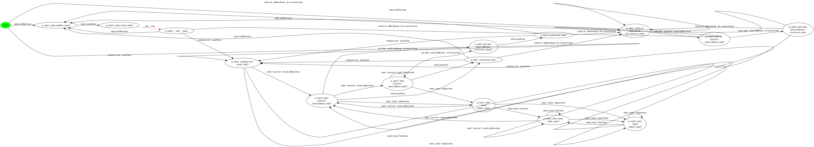

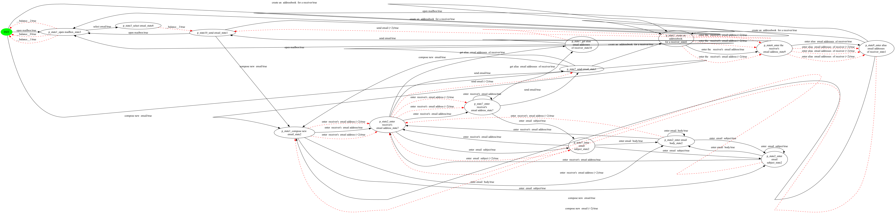

**Generated test suite** — 15 unique test case(s) after action-sequence dedup (15 pair-graph segment(s), 48 raw real step(s); pair-graph cycle has 56 edge(s) total, 20 synthetic dropped at translation). Operationally-identical trips (same action sequence, possibly different transition-level pairs) are listed once.

- **test case 1**: `compose new email -> enter email subject -> enter email subject -> enter email body`
- **test case 2**: `enter receiver's email address -> get alias email addresses of receiver`
- **test case 3**: `send email`
- **test case 4**: `create an addressbook for a receiver`
- **test case 5**: `enter alias email addresses of receiver`
- **test case 6**: `compose new email -> enter email body -> enter receiver's email address`
- **test case 7**: `enter receiver's email address -> send email`
- **test case 8**: `compose new email`
- **test case 9**: `enter receiver's email address -> get alias email addresses of receiver -> send email`
- **test case 10**: `open mailbox -> select email`
- **test case 11**: `compose new email -> enter receiver's email address -> enter receiver's email address -> enter receiver's email address -> enter email subject -> enter email subject`
- **test case 12**: `enter receiver's email address -> enter email subject -> enter receiver's email address`
- **test case 13**: `enter email subject -> enter email body -> enter email body -> enter email subject -> enter receiver's email address`
- **test case 14**: `open mailbox`
- **test case 15**: `create an addressbook for a receiver -> enter the receiver's email address -> enter alias email addresses of receiver`

### Product 3

**Selected features:** selected = {ad, au, e}

**Repaired FTS:** 10 states, 20 transitions (18 real / 2 `__end__`).

**Pair graph (raw):** 19 nodes (incl. INIT), 48 edges (every edge = one contiguous transition pair in the original FTS; the subset starting at INIT correspond to pairs `(start, t)` for any original initial-state outgoing `t`).

**Pair graph (balanced):** 19 nodes, 71 edges (23 synthetic `__balance__N` added to restore in-balance at INIT).

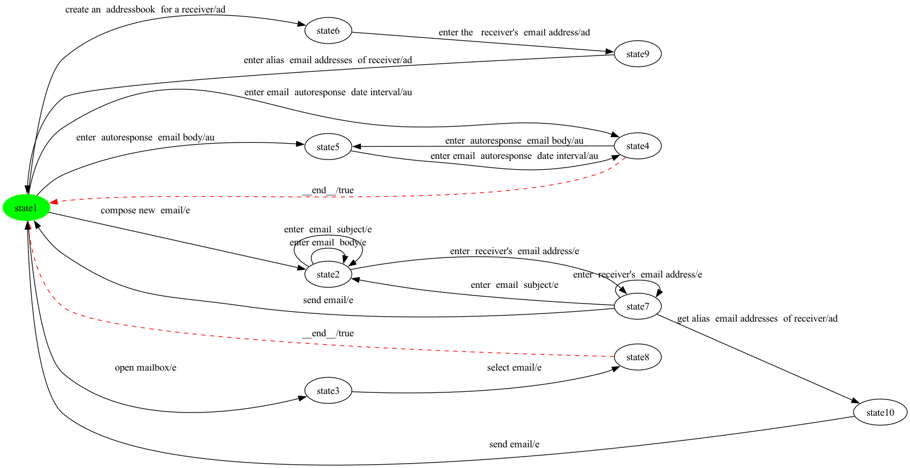

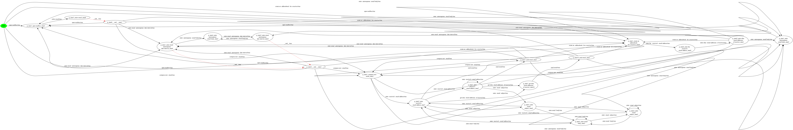

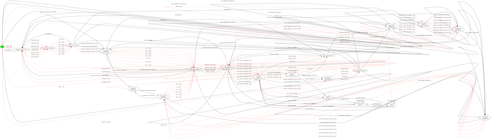

**Generated test suite** — 18 unique test case(s) after action-sequence dedup (20 pair-graph segment(s), 63 raw real step(s); pair-graph cycle has 71 edge(s) total, 23 synthetic dropped at translation). Operationally-identical trips (same action sequence, possibly different transition-level pairs) are listed once.

- **test case 1**: `enter email autoresponse date interval -> enter autoresponse email body -> enter email autoresponse date interval -> enter autoresponse email body`
- **test case 2**: `compose new email -> enter email subject -> enter email subject -> enter email body -> enter receiver's email address -> get alias email addresses of receiver`
- **test case 3**: `send email`
- **test case 4**: `create an addressbook for a receiver`
- **test case 5**: `enter alias email addresses of receiver`
- **test case 6**: `compose new email -> enter email body -> enter email body -> enter email subject -> enter receiver's email address -> enter receiver's email address -> send email`
- **test case 7**: `enter email autoresponse date interval`
- **test case 8**: `enter receiver's email address -> get alias email addresses of receiver -> send email`
- **test case 9**: `open mailbox -> select email`
- **test case 10**: `compose new email -> enter receiver's email address -> send email`
- **test case 11**: `enter autoresponse email body -> enter email autoresponse date interval`
- **test case 12**: `open mailbox`
- **test case 13**: `compose new email`
- **test case 14**: `enter receiver's email address -> enter email subject -> enter email subject`
- **test case 15**: `enter autoresponse email body`
- **test case 16**: `enter receiver's email address -> enter receiver's email address -> enter email subject -> enter receiver's email address`
- **test case 17**: `enter email subject -> enter email body`
- **test case 18**: `create an addressbook for a receiver -> enter the receiver's email address -> enter alias email addresses of receiver`

### Product 4

**Selected features:** selected = {ad, au, e, en, s}

**Repaired FTS:** 11 states, 23 transitions (21 real / 2 `__end__`).

**Pair graph (raw):** 22 nodes (incl. INIT), 55 edges (every edge = one contiguous transition pair in the original FTS; the subset starting at INIT correspond to pairs `(start, t)` for any original initial-state outgoing `t`).

**Pair graph (balanced):** 22 nodes, 93 edges (38 synthetic `__balance__N` added to restore in-balance at INIT).

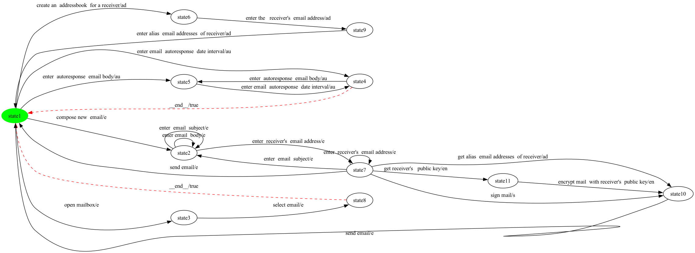

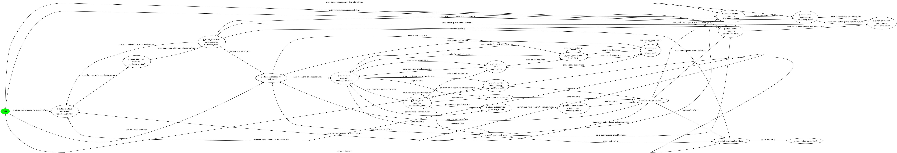

**Generated test suite** — 22 unique test case(s) after action-sequence dedup (23 pair-graph segment(s), 71 raw real step(s); pair-graph cycle has 93 edge(s) total, 38 synthetic dropped at translation). Operationally-identical trips (same action sequence, possibly different transition-level pairs) are listed once.

- **test case 1**: `enter email autoresponse date interval -> enter autoresponse email body -> enter email autoresponse date interval -> enter autoresponse email body`
- **test case 2**: `enter autoresponse email body -> enter email autoresponse date interval`
- **test case 3**: `enter receiver's email address -> sign mail -> send email`
- **test case 4**: `enter autoresponse email body`
- **test case 5**: `compose new email -> enter email body -> enter email subject -> enter email subject -> enter receiver's email address -> sign mail`
- **test case 6**: `compose new email -> enter email subject -> enter email body -> enter receiver's email address -> get alias email addresses of receiver -> send email`
- **test case 7**: `create an addressbook for a receiver`
- **test case 8**: `enter receiver's email address -> send email`
- **test case 9**: `compose new email -> enter receiver's email address`
- **test case 10**: `send email`
- **test case 11**: `compose new email`
- **test case 12**: `enter alias email addresses of receiver`
- **test case 13**: `enter email autoresponse date interval`
- **test case 14**: `enter receiver's email address -> get receiver's public key -> encrypt mail with receiver's public key -> send email`
- **test case 15**: `enter receiver's email address -> enter receiver's email address -> send email`
- **test case 16**: `open mailbox -> select email`
- **test case 17**: `open mailbox`
- **test case 18**: `enter receiver's email address -> enter email subject -> enter email body -> enter email body`
- **test case 19**: `create an addressbook for a receiver -> enter the receiver's email address -> enter alias email addresses of receiver`
- **test case 20**: `enter email subject -> enter receiver's email address -> enter receiver's email address -> get alias email addresses of receiver`
- **test case 21**: `enter receiver's email address -> get receiver's public key`
- **test case 22**: `enter receiver's email address -> enter email subject -> enter email subject`

### Product 5

**Selected features:** selected = {e, en, s}

**Repaired FTS:** 7 states, 14 transitions (13 real / 1 `__end__`).

**Pair graph (raw):** 14 nodes (incl. INIT), 32 edges (every edge = one contiguous transition pair in the original FTS; the subset starting at INIT correspond to pairs `(start, t)` for any original initial-state outgoing `t`).

**Pair graph (balanced):** 14 nodes, 48 edges (16 synthetic `__balance__N` added to restore in-balance at INIT).

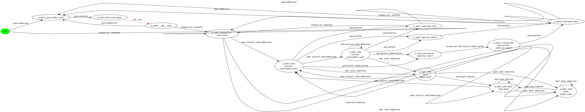

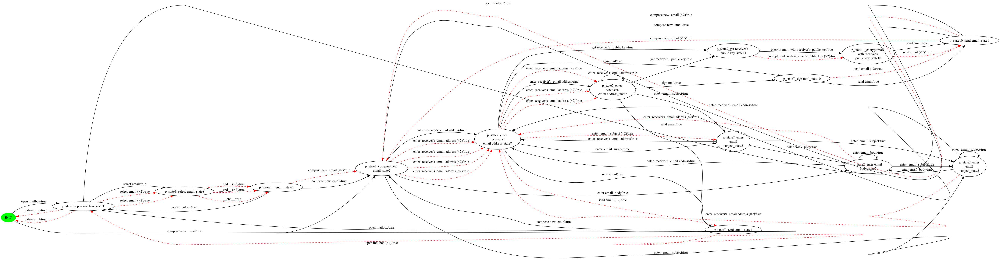

**Generated test suite** — 12 unique test case(s) after action-sequence dedup (9 pair-graph segment(s), 39 raw real step(s); pair-graph cycle has 48 edge(s) total, 16 synthetic dropped at translation). Operationally-identical trips (same action sequence, possibly different transition-level pairs) are listed once.

- **test case 1**: `compose new email -> enter email subject -> enter email subject -> enter email body`
- **test case 2**: `enter receiver's email address -> sign mail -> send email`
- **test case 3**: `open mailbox -> select email`
- **test case 4**: `enter receiver's email address -> send email`
- **test case 5**: `compose new email -> enter email body -> enter receiver's email address`
- **test case 6**: `enter receiver's email address -> sign mail`
- **test case 7**: `enter receiver's email address -> get receiver's public key -> encrypt mail with receiver's public key -> send email`
- **test case 8**: `compose new email -> enter receiver's email address -> enter receiver's email address -> enter receiver's email address -> enter email subject -> enter email subject`
- **test case 9**: `enter receiver's email address -> get receiver's public key`
- **test case 10**: `enter receiver's email address -> enter email subject -> enter receiver's email address`
- **test case 11**: `enter email subject -> enter email body -> enter email body -> enter email subject -> enter receiver's email address -> send email`
- **test case 12**: `open mailbox`

### Product 6

**Selected features:** selected = {au, e, en, s}

**Repaired FTS:** 9 states, 19 transitions (17 real / 2 `__end__`).

**Pair graph (raw):** 18 nodes (incl. INIT), 42 edges (every edge = one contiguous transition pair in the original FTS; the subset starting at INIT correspond to pairs `(start, t)` for any original initial-state outgoing `t`).

**Pair graph (balanced):** 18 nodes, 57 edges (15 synthetic `__balance__N` added to restore in-balance at INIT).

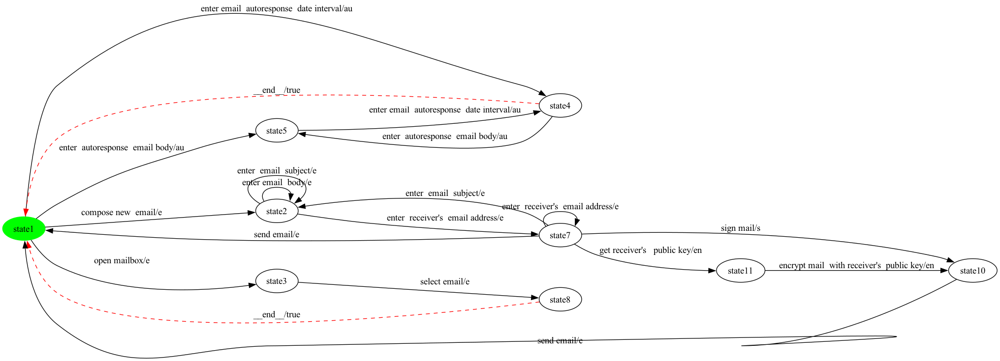

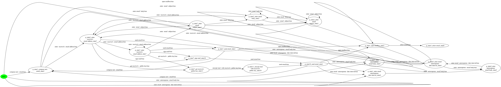

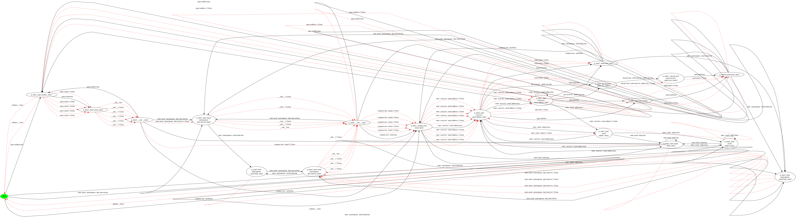

**Generated test suite** — 16 unique test case(s) after action-sequence dedup (13 pair-graph segment(s), 50 raw real step(s); pair-graph cycle has 57 edge(s) total, 15 synthetic dropped at translation). Operationally-identical trips (same action sequence, possibly different transition-level pairs) are listed once.

- **test case 1**: `enter email autoresponse date interval -> enter autoresponse email body -> enter email autoresponse date interval -> enter autoresponse email body`
- **test case 2**: `compose new email -> enter email subject -> enter email subject -> enter email body -> enter receiver's email address -> sign mail -> send email`
- **test case 3**: `open mailbox -> select email`
- **test case 4**: `send email`
- **test case 5**: `compose new email -> enter email body -> enter email body -> enter email subject`
- **test case 6**: `enter receiver's email address -> send email`
- **test case 7**: `enter email autoresponse date interval`
- **test case 8**: `enter email subject -> enter email subject -> enter receiver's email address -> enter receiver's email address -> sign mail`
- **test case 9**: `open mailbox`
- **test case 10**: `enter autoresponse email body -> enter email autoresponse date interval`
- **test case 11**: `enter receiver's email address -> get receiver's public key -> encrypt mail with receiver's public key`
- **test case 12**: `enter autoresponse email body`
- **test case 13**: `compose new email -> enter receiver's email address -> get receiver's public key`
- **test case 14**: `encrypt mail with receiver's public key -> send email`
- **test case 15**: `enter receiver's email address -> enter receiver's email address -> enter email subject -> enter receiver's email address -> send email`
- **test case 16**: `enter receiver's email address -> enter email subject -> enter email body`

### Product 7

**Selected features:** selected = {ad, au, e, f, s}

**Repaired FTS:** 10 states, 22 transitions (20 real / 2 `__end__`).

**Pair graph (raw):** 21 nodes (incl. INIT), 53 edges (every edge = one contiguous transition pair in the original FTS; the subset starting at INIT correspond to pairs `(start, t)` for any original initial-state outgoing `t`).

**Pair graph (balanced):** 21 nodes, 93 edges (40 synthetic `__balance__N` added to restore in-balance at INIT).

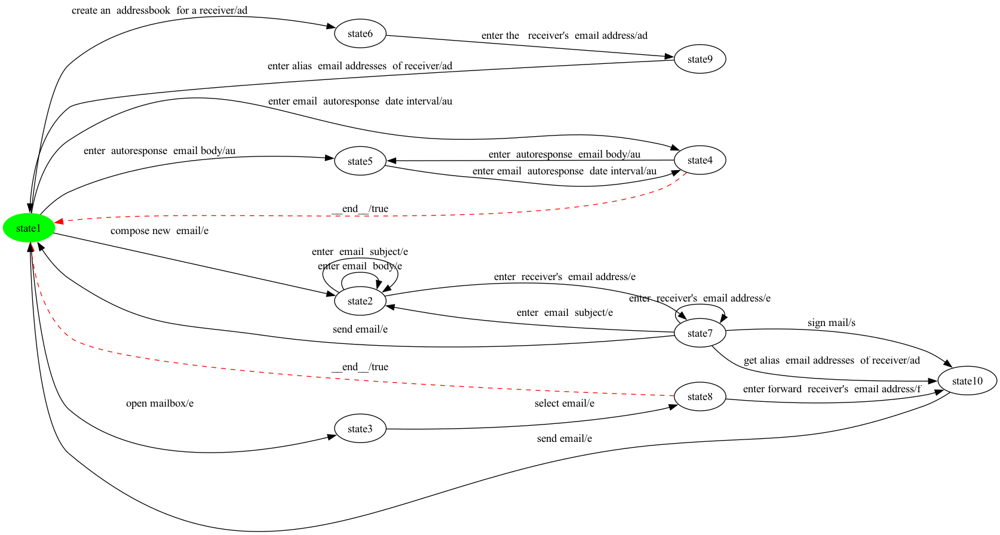

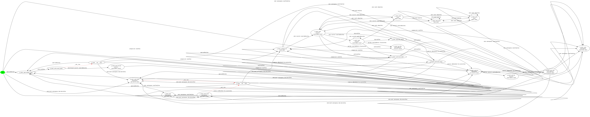

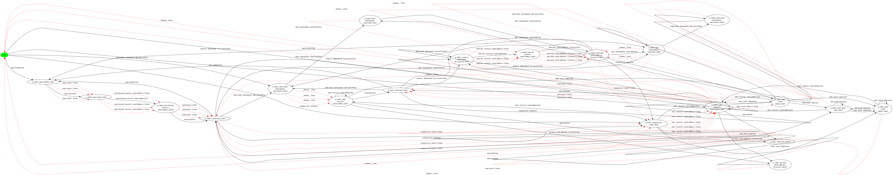

**Generated test suite** — 20 unique test case(s) after action-sequence dedup (19 pair-graph segment(s), 66 raw real step(s); pair-graph cycle has 93 edge(s) total, 40 synthetic dropped at translation). Operationally-identical trips (same action sequence, possibly different transition-level pairs) are listed once.

- **test case 1**: `enter email autoresponse date interval -> enter autoresponse email body -> enter email autoresponse date interval -> enter autoresponse email body`
- **test case 2**: `enter autoresponse email body -> enter email autoresponse date interval`
- **test case 3**: `compose new email -> enter email body -> enter email subject -> enter email subject -> enter receiver's email address -> sign mail -> send email`
- **test case 4**: `enter autoresponse email body`
- **test case 5**: `enter alias email addresses of receiver`
- **test case 6**: `compose new email -> enter email subject -> enter email body -> enter receiver's email address -> get alias email addresses of receiver`
- **test case 7**: `send email`
- **test case 8**: `create an addressbook for a receiver`
- **test case 9**: `enter receiver's email address -> send email`
- **test case 10**: `enter email autoresponse date interval`
- **test case 11**: `enter receiver's email address -> sign mail`
- **test case 12**: `open mailbox -> select email -> enter forward receiver's email address -> send email`
- **test case 13**: `open mailbox`
- **test case 14**: `compose new email`
- **test case 15**: `compose new email -> enter receiver's email address`
- **test case 16**: `enter receiver's email address -> enter receiver's email address -> send email`
- **test case 17**: `enter receiver's email address -> enter email subject -> enter email body -> enter email body`
- **test case 18**: `create an addressbook for a receiver -> enter the receiver's email address -> enter alias email addresses of receiver`
- **test case 19**: `enter email subject -> enter receiver's email address -> enter receiver's email address -> get alias email addresses of receiver -> send email`
- **test case 20**: `enter receiver's email address -> enter email subject -> enter email subject`

### Product 8

**Selected features:** selected = {e, f, s}

**Repaired FTS:** 6 states, 13 transitions (12 real / 1 `__end__`).

**Pair graph (raw):** 13 nodes (incl. INIT), 30 edges (every edge = one contiguous transition pair in the original FTS; the subset starting at INIT correspond to pairs `(start, t)` for any original initial-state outgoing `t`).

**Pair graph (balanced):** 13 nodes, 40 edges (10 synthetic `__balance__N` added to restore in-balance at INIT).

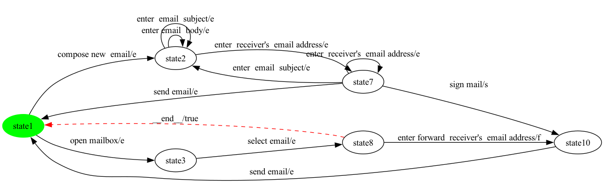

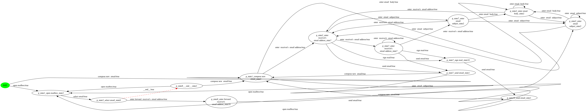

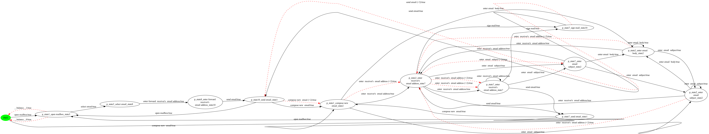

**Generated test suite** — 11 unique test case(s) after action-sequence dedup (8 pair-graph segment(s), 36 raw real step(s); pair-graph cycle has 40 edge(s) total, 10 synthetic dropped at translation). Operationally-identical trips (same action sequence, possibly different transition-level pairs) are listed once.

- **test case 1**: `compose new email -> enter email subject -> enter email subject -> enter email body`
- **test case 2**: `enter receiver's email address -> sign mail -> send email`
- **test case 3**: `open mailbox -> select email -> enter forward receiver's email address -> send email`
- **test case 4**: `compose new email -> enter email body -> enter receiver's email address`
- **test case 5**: `enter receiver's email address -> send email`
- **test case 6**: `compose new email -> enter receiver's email address`
- **test case 7**: `enter receiver's email address -> sign mail`
- **test case 8**: `enter receiver's email address -> enter receiver's email address -> enter receiver's email address -> enter email subject -> enter email subject`
- **test case 9**: `enter receiver's email address -> enter email subject -> enter receiver's email address`
- **test case 10**: `enter email subject -> enter email body -> enter email body -> enter email subject -> enter receiver's email address -> send email`
- **test case 11**: `open mailbox`

### Product 9

**Selected features:** selected = {au, e}

**Repaired FTS:** 7 states, 15 transitions (13 real / 2 `__end__`).

**Pair graph (raw):** 14 nodes (incl. INIT), 31 edges (every edge = one contiguous transition pair in the original FTS; the subset starting at INIT correspond to pairs `(start, t)` for any original initial-state outgoing `t`).

**Pair graph (balanced):** 14 nodes, 41 edges (10 synthetic `__balance__N` added to restore in-balance at INIT).

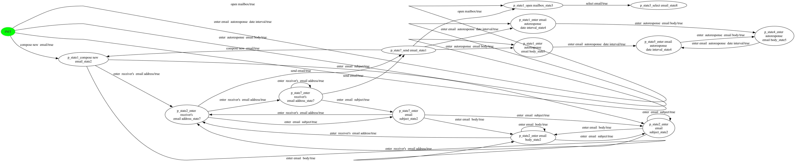

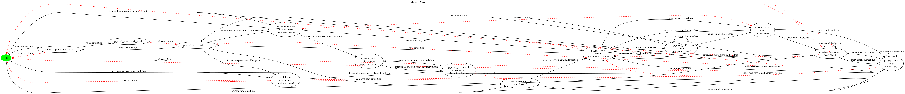

**Generated test suite** — 13 unique test case(s) after action-sequence dedup (10 pair-graph segment(s), 37 raw real step(s); pair-graph cycle has 41 edge(s) total, 10 synthetic dropped at translation). Operationally-identical trips (same action sequence, possibly different transition-level pairs) are listed once.

- **test case 1**: `enter email autoresponse date interval -> enter autoresponse email body -> enter email autoresponse date interval -> enter autoresponse email body`
- **test case 2**: `compose new email -> enter email subject -> enter email subject -> enter email body -> enter receiver's email address`
- **test case 3**: `enter receiver's email address -> send email`
- **test case 4**: `enter email autoresponse date interval`
- **test case 5**: `enter email subject -> enter email subject`
- **test case 6**: `enter receiver's email address -> enter receiver's email address -> enter receiver's email address -> enter email subject -> enter receiver's email address -> send email`
- **test case 7**: `enter autoresponse email body -> enter email autoresponse date interval`
- **test case 8**: `compose new email -> enter email body -> enter email body -> enter email subject -> enter receiver's email address`
- **test case 9**: `send email`
- **test case 10**: `compose new email -> enter receiver's email address -> enter email subject -> enter email body`
- **test case 11**: `open mailbox -> select email`
- **test case 12**: `open mailbox`
- **test case 13**: `enter autoresponse email body`

### Product 10

**Selected features:** selected = {ad, e, f}

**Repaired FTS:** 8 states, 16 transitions (15 real / 1 `__end__`).

**Pair graph (raw):** 16 nodes (incl. INIT), 38 edges (every edge = one contiguous transition pair in the original FTS; the subset starting at INIT correspond to pairs `(start, t)` for any original initial-state outgoing `t`).

**Pair graph (balanced):** 16 nodes, 69 edges (31 synthetic `__balance__N` added to restore in-balance at INIT).

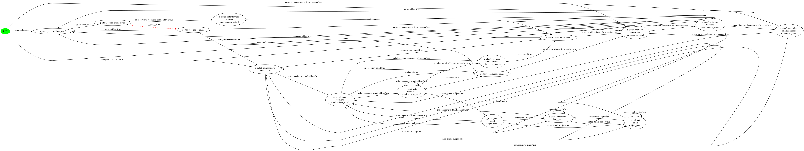

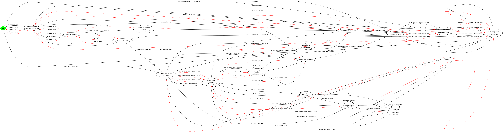

**Generated test suite** — 17 unique test case(s) after action-sequence dedup (18 pair-graph segment(s), 53 raw real step(s); pair-graph cycle has 69 edge(s) total, 31 synthetic dropped at translation). Operationally-identical trips (same action sequence, possibly different transition-level pairs) are listed once.

- **test case 1**: `compose new email -> enter email subject -> enter email subject -> enter email body`
- **test case 2**: `enter receiver's email address -> get alias email addresses of receiver`
- **test case 3**: `send email`
- **test case 4**: `create an addressbook for a receiver`
- **test case 5**: `enter alias email addresses of receiver`
- **test case 6**: `compose new email -> enter email body -> enter receiver's email address`
- **test case 7**: `enter receiver's email address -> send email`
- **test case 8**: `compose new email`
- **test case 9**: `enter receiver's email address -> enter receiver's email address -> get alias email addresses of receiver -> send email`
- **test case 10**: `create an addressbook for a receiver -> enter the receiver's email address -> enter alias email addresses of receiver`
- **test case 11**: `open mailbox`
- **test case 12**: `enter forward receiver's email address -> send email`
- **test case 13**: `open mailbox -> select email -> enter forward receiver's email address`
- **test case 14**: `compose new email -> enter receiver's email address`
- **test case 15**: `enter receiver's email address -> enter receiver's email address -> enter email subject -> enter email subject`
- **test case 16**: `enter receiver's email address -> enter email subject -> enter receiver's email address`
- **test case 17**: `enter email subject -> enter email body -> enter email body -> enter email subject -> enter receiver's email address`

### Product 11

**Selected features:** selected = {ad, au, e, f}

**Repaired FTS:** 10 states, 21 transitions (19 real / 2 `__end__`).

**Pair graph (raw):** 20 nodes (incl. INIT), 50 edges (every edge = one contiguous transition pair in the original FTS; the subset starting at INIT correspond to pairs `(start, t)` for any original initial-state outgoing `t`).

**Pair graph (balanced):** 20 nodes, 87 edges (37 synthetic `__balance__N` added to restore in-balance at INIT).

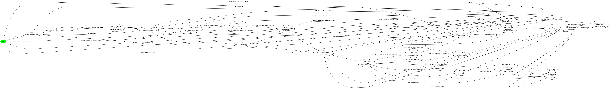

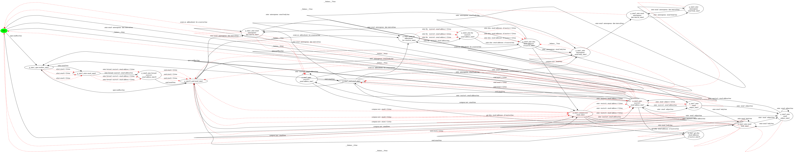

**Generated test suite** — 21 unique test case(s) after action-sequence dedup (20 pair-graph segment(s), 63 raw real step(s); pair-graph cycle has 87 edge(s) total, 37 synthetic dropped at translation). Operationally-identical trips (same action sequence, possibly different transition-level pairs) are listed once.

- **test case 1**: `enter email autoresponse date interval -> enter autoresponse email body -> enter email autoresponse date interval -> enter autoresponse email body`
- **test case 2**: `enter autoresponse email body -> enter email autoresponse date interval`
- **test case 3**: `compose new email -> enter email body -> enter email subject -> enter email subject -> enter receiver's email address -> get alias email addresses of receiver`
- **test case 4**: `send email`
- **test case 5**: `enter autoresponse email body`
- **test case 6**: `enter alias email addresses of receiver`
- **test case 7**: `compose new email -> enter email subject -> enter email body -> enter receiver's email address -> send email`
- **test case 8**: `create an addressbook for a receiver`
- **test case 9**: `enter email autoresponse date interval`
- **test case 10**: `enter receiver's email address -> enter receiver's email address -> send email`
- **test case 11**: `compose new email`
- **test case 12**: `open mailbox`
- **test case 13**: `enter forward receiver's email address -> send email`
- **test case 14**: `open mailbox -> select email`
- **test case 15**: `enter receiver's email address -> get alias email addresses of receiver -> send email`
- **test case 16**: `compose new email -> enter receiver's email address`
- **test case 17**: `select email -> enter forward receiver's email address`
- **test case 18**: `enter receiver's email address -> enter email subject -> enter email body -> enter email body`
- **test case 19**: `enter email subject -> enter receiver's email address -> enter receiver's email address -> enter email subject -> enter email subject`
- **test case 20**: `enter the receiver's email address -> enter alias email addresses of receiver`
- **test case 21**: `create an addressbook for a receiver -> enter the receiver's email address`

### Product 12

**Selected features:** selected = {ad, e, en}

**Repaired FTS:** 9 states, 17 transitions (16 real / 1 `__end__`).

**Pair graph (raw):** 17 nodes (incl. INIT), 40 edges (every edge = one contiguous transition pair in the original FTS; the subset starting at INIT correspond to pairs `(start, t)` for any original initial-state outgoing `t`).

**Pair graph (balanced):** 17 nodes, 69 edges (29 synthetic `__balance__N` added to restore in-balance at INIT).

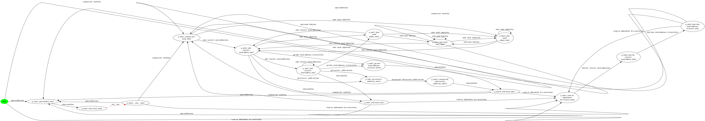

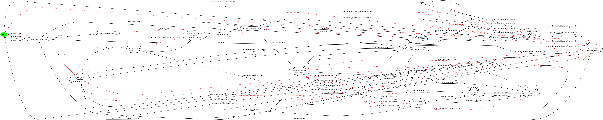

**Generated test suite** — 18 unique test case(s) after action-sequence dedup (21 pair-graph segment(s), 58 raw real step(s); pair-graph cycle has 69 edge(s) total, 29 synthetic dropped at translation). Operationally-identical trips (same action sequence, possibly different transition-level pairs) are listed once.

- **test case 1**: `compose new email -> enter email subject -> enter email subject -> enter email body`
- **test case 2**: `enter receiver's email address -> get alias email addresses of receiver`
- **test case 3**: `send email`
- **test case 4**: `create an addressbook for a receiver`
- **test case 5**: `enter alias email addresses of receiver`
- **test case 6**: `compose new email -> enter email body -> enter receiver's email address`
- **test case 7**: `enter receiver's email address -> send email`
- **test case 8**: `compose new email`
- **test case 9**: `enter receiver's email address -> get alias email addresses of receiver -> send email`
- **test case 10**: `enter receiver's email address -> enter receiver's email address -> get receiver's public key -> encrypt mail with receiver's public key -> send email`
- **test case 11**: `enter the receiver's email address -> enter alias email addresses of receiver`
- **test case 12**: `compose new email -> enter receiver's email address -> get receiver's public key`
- **test case 13**: `open mailbox -> select email`
- **test case 14**: `create an addressbook for a receiver -> enter the receiver's email address`
- **test case 15**: `open mailbox`
- **test case 16**: `enter receiver's email address -> enter receiver's email address -> enter email subject -> enter email subject`
- **test case 17**: `enter receiver's email address -> enter email subject -> enter receiver's email address`
- **test case 18**: `enter email subject -> enter email body -> enter email body -> enter email subject -> enter receiver's email address`

### Product 13

**Selected features:** selected = {ad, e, s}

**Repaired FTS:** 8 states, 16 transitions (15 real / 1 `__end__`).

**Pair graph (raw):** 16 nodes (incl. INIT), 39 edges (every edge = one contiguous transition pair in the original FTS; the subset starting at INIT correspond to pairs `(start, t)` for any original initial-state outgoing `t`).

**Pair graph (balanced):** 16 nodes, 68 edges (29 synthetic `__balance__N` added to restore in-balance at INIT).

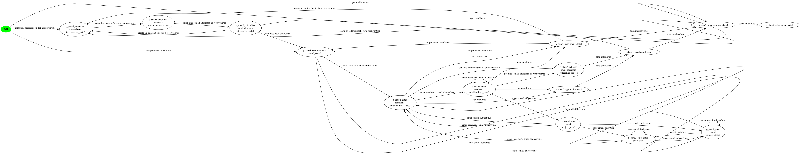

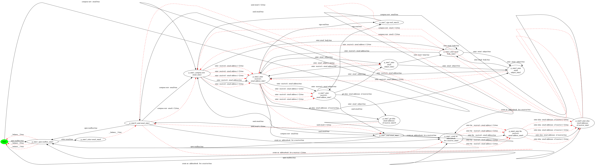

**Generated test suite** — 18 unique test case(s) after action-sequence dedup (19 pair-graph segment(s), 55 raw real step(s); pair-graph cycle has 68 edge(s) total, 29 synthetic dropped at translation). Operationally-identical trips (same action sequence, possibly different transition-level pairs) are listed once.

- **test case 1**: `compose new email -> enter email subject -> enter email subject -> enter email body`
- **test case 2**: `enter receiver's email address -> sign mail -> send email`
- **test case 3**: `enter alias email addresses of receiver`
- **test case 4**: `create an addressbook for a receiver`
- **test case 5**: `compose new email -> enter email body -> enter receiver's email address -> get alias email addresses of receiver`
- **test case 6**: `send email`
- **test case 7**: `compose new email`
- **test case 8**: `enter receiver's email address -> send email`
- **test case 9**: `compose new email -> enter receiver's email address`
- **test case 10**: `enter receiver's email address -> sign mail`
- **test case 11**: `open mailbox -> select email`
- **test case 12**: `enter receiver's email address -> get alias email addresses of receiver -> send email`
- **test case 13**: `enter receiver's email address -> enter receiver's email address -> enter receiver's email address -> enter email subject -> enter email subject`
- **test case 14**: `create an addressbook for a receiver -> enter the receiver's email address`
- **test case 15**: `enter receiver's email address -> enter email subject -> enter receiver's email address`
- **test case 16**: `enter email subject -> enter email body -> enter email body -> enter email subject -> enter receiver's email address`
- **test case 17**: `open mailbox`
- **test case 18**: `enter the receiver's email address -> enter alias email addresses of receiver`

### Product 14

**Selected features:** selected = {au, e, f, s}

**Repaired FTS:** 8 states, 18 transitions (16 real / 2 `__end__`).

**Pair graph (raw):** 17 nodes (incl. INIT), 40 edges (every edge = one contiguous transition pair in the original FTS; the subset starting at INIT correspond to pairs `(start, t)` for any original initial-state outgoing `t`).

**Pair graph (balanced):** 17 nodes, 61 edges (21 synthetic `__balance__N` added to restore in-balance at INIT).

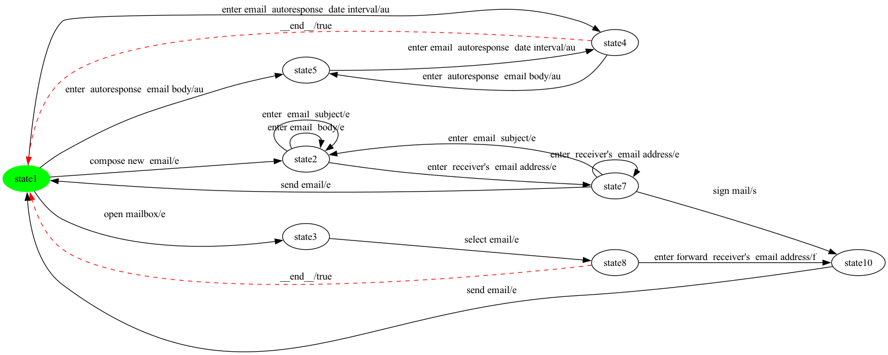

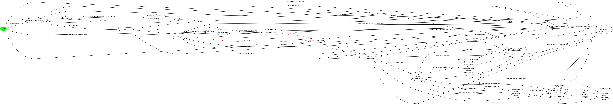

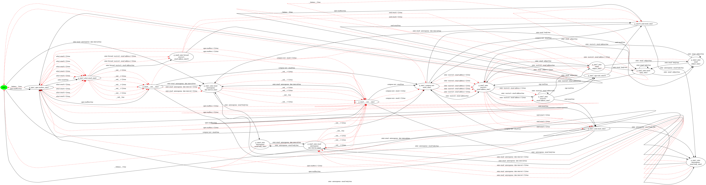

**Generated test suite** — 16 unique test case(s) after action-sequence dedup (14 pair-graph segment(s), 50 raw real step(s); pair-graph cycle has 61 edge(s) total, 21 synthetic dropped at translation). Operationally-identical trips (same action sequence, possibly different transition-level pairs) are listed once.

- **test case 1**: `enter email autoresponse date interval -> enter autoresponse email body -> enter email autoresponse date interval -> enter autoresponse email body`
- **test case 2**: `compose new email -> enter email subject -> enter email subject -> enter email body -> enter receiver's email address -> sign mail -> send email`
- **test case 3**: `open mailbox -> select email`
- **test case 4**: `enter forward receiver's email address -> send email`
- **test case 5**: `compose new email -> enter email body -> enter email body -> enter email subject -> enter receiver's email address -> enter receiver's email address -> send email`
- **test case 6**: `enter email autoresponse date interval`
- **test case 7**: `enter email subject -> enter email subject`
- **test case 8**: `open mailbox`
- **test case 9**: `select email -> enter forward receiver's email address`
- **test case 10**: `compose new email -> enter receiver's email address -> send email`
- **test case 11**: `enter autoresponse email body -> enter email autoresponse date interval`
- **test case 12**: `enter receiver's email address -> sign mail`
- **test case 13**: `enter autoresponse email body`
- **test case 14**: `send email`
- **test case 15**: `compose new email`
- **test case 16**: `enter receiver's email address -> enter receiver's email address -> enter email subject -> enter receiver's email address -> enter email subject -> enter email body`

### Product 15

**Selected features:** selected = {e, en}

**Repaired FTS:** 7 states, 13 transitions (12 real / 1 `__end__`).

**Pair graph (raw):** 13 nodes (incl. INIT), 29 edges (every edge = one contiguous transition pair in the original FTS; the subset starting at INIT correspond to pairs `(start, t)` for any original initial-state outgoing `t`).

**Pair graph (balanced):** 13 nodes, 41 edges (12 synthetic `__balance__N` added to restore in-balance at INIT).

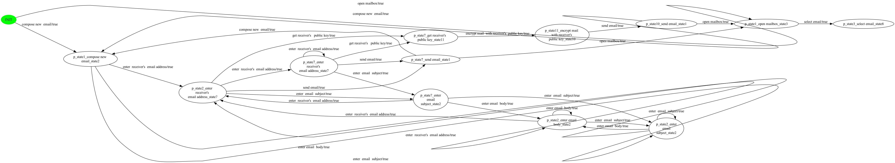

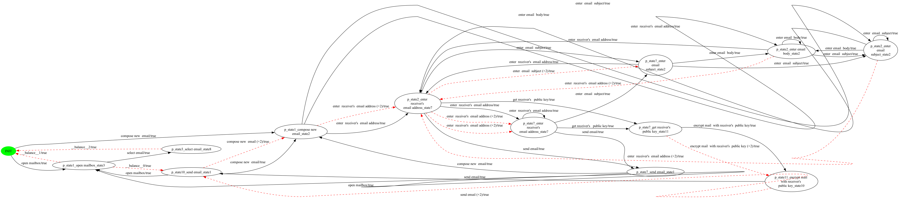

**Generated test suite** — 12 unique test case(s) after action-sequence dedup (10 pair-graph segment(s), 37 raw real step(s); pair-graph cycle has 41 edge(s) total, 12 synthetic dropped at translation). Operationally-identical trips (same action sequence, possibly different transition-level pairs) are listed once.

- **test case 1**: `compose new email -> enter email subject -> enter email subject -> enter email body`
- **test case 2**: `enter receiver's email address -> send email`
- **test case 3**: `compose new email -> enter email body -> enter receiver's email address -> enter receiver's email address -> get receiver's public key -> encrypt mail with receiver's public key`
- **test case 4**: `send email`
- **test case 5**: `open mailbox -> select email`
- **test case 6**: `open mailbox`
- **test case 7**: `compose new email`
- **test case 8**: `enter receiver's email address -> enter receiver's email address -> enter email subject -> enter email subject`
- **test case 9**: `enter receiver's email address -> get receiver's public key`
- **test case 10**: `encrypt mail with receiver's public key -> send email`
- **test case 11**: `compose new email -> enter receiver's email address -> enter email subject -> enter receiver's email address`
- **test case 12**: `enter email subject -> enter email body -> enter email body -> enter email subject -> enter receiver's email address -> send email`

### Product 16

**Selected features:** selected = {au, e, f}

**Repaired FTS:** 8 states, 17 transitions (15 real / 2 `__end__`).

**Pair graph (raw):** 16 nodes (incl. INIT), 37 edges (every edge = one contiguous transition pair in the original FTS; the subset starting at INIT correspond to pairs `(start, t)` for any original initial-state outgoing `t`).

**Pair graph (balanced):** 16 nodes, 62 edges (25 synthetic `__balance__N` added to restore in-balance at INIT).

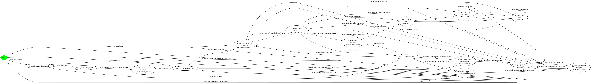

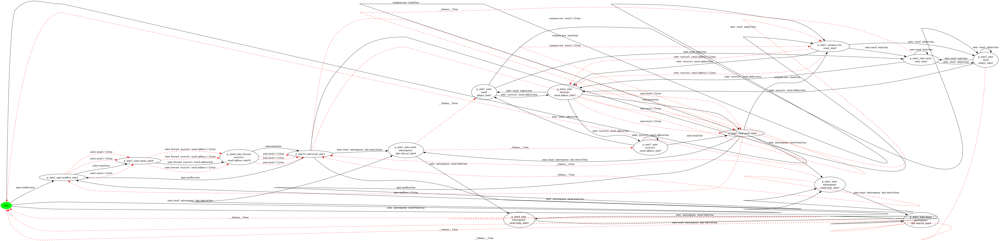

**Generated test suite** — 15 unique test case(s) after action-sequence dedup (14 pair-graph segment(s), 47 raw real step(s); pair-graph cycle has 62 edge(s) total, 25 synthetic dropped at translation). Operationally-identical trips (same action sequence, possibly different transition-level pairs) are listed once.

- **test case 1**: `enter email autoresponse date interval -> enter autoresponse email body -> enter email autoresponse date interval -> enter autoresponse email body`
- **test case 2**: `compose new email -> enter email subject -> enter email subject -> enter email body -> enter receiver's email address -> enter receiver's email address -> send email`
- **test case 3**: `enter email autoresponse date interval`
- **test case 4**: `enter email subject -> enter email subject -> enter receiver's email address -> send email`
- **test case 5**: `enter autoresponse email body -> enter email autoresponse date interval`
- **test case 6**: `open mailbox -> select email`
- **test case 7**: `enter forward receiver's email address -> send email`
- **test case 8**: `open mailbox`
- **test case 9**: `send email`
- **test case 10**: `compose new email -> enter email body -> enter email body -> enter email subject`
- **test case 11**: `enter autoresponse email body`
- **test case 12**: `compose new email -> enter receiver's email address`
- **test case 13**: `compose new email`
- **test case 14**: `select email -> enter forward receiver's email address`
- **test case 15**: `enter receiver's email address -> enter receiver's email address -> enter email subject -> enter receiver's email address -> enter email subject -> enter email body`

### Product 17

**Selected features:** selected = {ad, e, f, s}

**Repaired FTS:** 8 states, 17 transitions (16 real / 1 `__end__`).

**Pair graph (raw):** 17 nodes (incl. INIT), 41 edges (every edge = one contiguous transition pair in the original FTS; the subset starting at INIT correspond to pairs `(start, t)` for any original initial-state outgoing `t`).

**Pair graph (balanced):** 17 nodes, 69 edges (28 synthetic `__balance__N` added to restore in-balance at INIT).

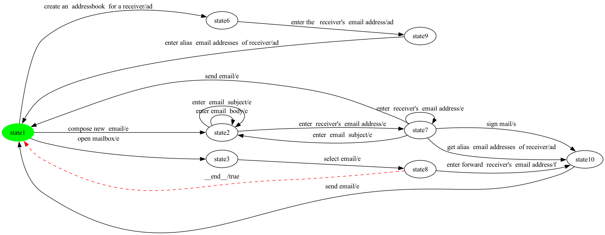

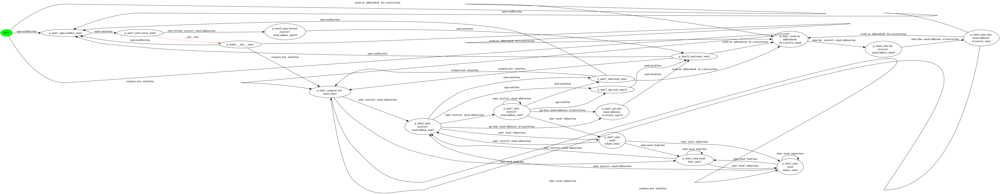

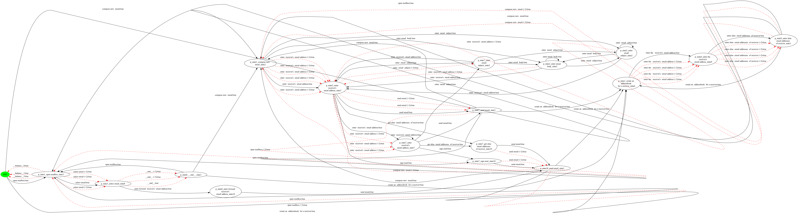

**Generated test suite** — 18 unique test case(s) after action-sequence dedup (18 pair-graph segment(s), 56 raw real step(s); pair-graph cycle has 69 edge(s) total, 28 synthetic dropped at translation). Operationally-identical trips (same action sequence, possibly different transition-level pairs) are listed once.

- **test case 1**: `compose new email -> enter email subject -> enter email subject -> enter email body`
- **test case 2**: `enter receiver's email address -> sign mail -> send email`
- **test case 3**: `enter alias email addresses of receiver`
- **test case 4**: `create an addressbook for a receiver`
- **test case 5**: `compose new email -> enter email body -> enter receiver's email address -> get alias email addresses of receiver`
- **test case 6**: `send email`
- **test case 7**: `compose new email`
- **test case 8**: `enter receiver's email address -> send email`
- **test case 9**: `compose new email -> enter receiver's email address`
- **test case 10**: `enter receiver's email address -> sign mail`
- **test case 11**: `open mailbox -> select email -> enter forward receiver's email address -> send email`
- **test case 12**: `enter receiver's email address -> get alias email addresses of receiver -> send email`
- **test case 13**: `enter receiver's email address -> enter receiver's email address -> enter receiver's email address -> enter email subject -> enter email subject`
- **test case 14**: `create an addressbook for a receiver -> enter the receiver's email address`
- **test case 15**: `enter receiver's email address -> enter email subject -> enter receiver's email address`
- **test case 16**: `enter email subject -> enter email body -> enter email body -> enter email subject -> enter receiver's email address`
- **test case 17**: `open mailbox`
- **test case 18**: `enter the receiver's email address -> enter alias email addresses of receiver`

### Product 18

**Selected features:** selected = {ad, au, e, en}

**Repaired FTS:** 11 states, 22 transitions (20 real / 2 `__end__`).

**Pair graph (raw):** 21 nodes (incl. INIT), 52 edges (every edge = one contiguous transition pair in the original FTS; the subset starting at INIT correspond to pairs `(start, t)` for any original initial-state outgoing `t`).

**Pair graph (balanced):** 21 nodes, 83 edges (31 synthetic `__balance__N` added to restore in-balance at INIT).

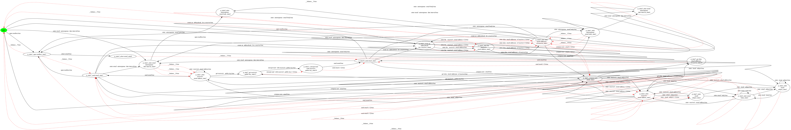

**Generated test suite** — 22 unique test case(s) after action-sequence dedup (23 pair-graph segment(s), 69 raw real step(s); pair-graph cycle has 83 edge(s) total, 31 synthetic dropped at translation). Operationally-identical trips (same action sequence, possibly different transition-level pairs) are listed once.

- **test case 1**: `enter email autoresponse date interval -> enter autoresponse email body -> enter email autoresponse date interval -> enter autoresponse email body`
- **test case 2**: `enter autoresponse email body -> enter email autoresponse date interval`
- **test case 3**: `compose new email -> enter email body -> enter email subject -> enter email subject -> enter receiver's email address -> get alias email addresses of receiver`
- **test case 4**: `send email`
- **test case 5**: `enter autoresponse email body`
- **test case 6**: `compose new email -> enter email subject -> enter email body -> enter receiver's email address -> send email`
- **test case 7**: `compose new email -> enter receiver's email address`
- **test case 8**: `create an addressbook for a receiver`
- **test case 9**: `enter alias email addresses of receiver`
- **test case 10**: `compose new email`
- **test case 11**: `enter receiver's email address -> enter email subject -> enter email body -> enter email body`
- **test case 12**: `open mailbox -> select email`
- **test case 13**: `enter email autoresponse date interval`
- **test case 14**: `enter receiver's email address -> get receiver's public key -> encrypt mail with receiver's public key`
- **test case 15**: `open mailbox`
- **test case 16**: `create an addressbook for a receiver -> enter the receiver's email address`
- **test case 17**: `enter the receiver's email address -> enter alias email addresses of receiver`
- **test case 18**: `enter email subject -> enter receiver's email address -> enter receiver's email address -> enter receiver's email address -> send email`
- **test case 19**: `enter receiver's email address -> get alias email addresses of receiver -> send email`
- **test case 20**: `enter receiver's email address -> get receiver's public key`
- **test case 21**: `encrypt mail with receiver's public key -> send email`
- **test case 22**: `enter receiver's email address -> enter email subject -> enter email subject`

### Product 19

**Selected features:** selected = {au, e, en}

**Repaired FTS:** 9 states, 18 transitions (16 real / 2 `__end__`).

**Pair graph (raw):** 17 nodes (incl. INIT), 39 edges (every edge = one contiguous transition pair in the original FTS; the subset starting at INIT correspond to pairs `(start, t)` for any original initial-state outgoing `t`).

**Pair graph (balanced):** 17 nodes, 52 edges (13 synthetic `__balance__N` added to restore in-balance at INIT).

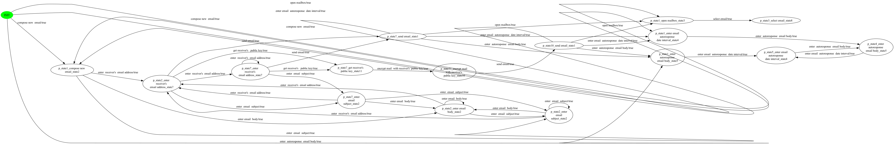

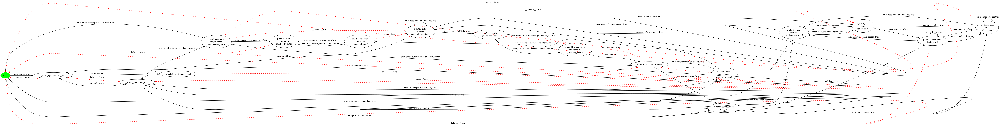

**Generated test suite** — 14 unique test case(s) after action-sequence dedup (13 pair-graph segment(s), 48 raw real step(s); pair-graph cycle has 52 edge(s) total, 13 synthetic dropped at translation). Operationally-identical trips (same action sequence, possibly different transition-level pairs) are listed once.

- **test case 1**: `enter email autoresponse date interval -> enter autoresponse email body -> enter email autoresponse date interval -> enter autoresponse email body`
- **test case 2**: `compose new email -> enter email subject -> enter email subject -> enter email body -> enter receiver's email address -> enter receiver's email address -> send email`
- **test case 3**: `enter email autoresponse date interval`
- **test case 4**: `enter email subject -> enter email subject -> enter receiver's email address -> get receiver's public key -> encrypt mail with receiver's public key`
- **test case 5**: `send email`
- **test case 6**: `open mailbox -> select email`
- **test case 7**: `compose new email -> enter email body -> enter email body -> enter email subject`
- **test case 8**: `open mailbox`
- **test case 9**: `enter autoresponse email body -> enter email autoresponse date interval`
- **test case 10**: `enter receiver's email address -> get receiver's public key`
- **test case 11**: `encrypt mail with receiver's public key -> send email`
- **test case 12**: `enter autoresponse email body`
- **test case 13**: `enter receiver's email address -> enter receiver's email address -> enter email subject -> enter receiver's email address -> send email`
- **test case 14**: `compose new email -> enter receiver's email address -> enter email subject -> enter email body`

### Product 20

**Selected features:** selected = {e, f}

**Repaired FTS:** 6 states, 12 transitions (11 real / 1 `__end__`).

**Pair graph (raw):** 12 nodes (incl. INIT), 27 edges (every edge = one contiguous transition pair in the original FTS; the subset starting at INIT correspond to pairs `(start, t)` for any original initial-state outgoing `t`).

**Pair graph (balanced):** 12 nodes, 36 edges (9 synthetic `__balance__N` added to restore in-balance at INIT).

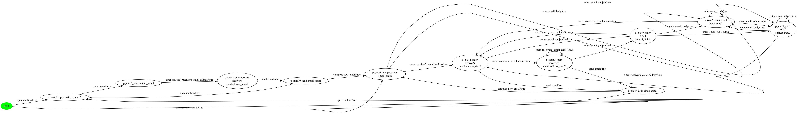

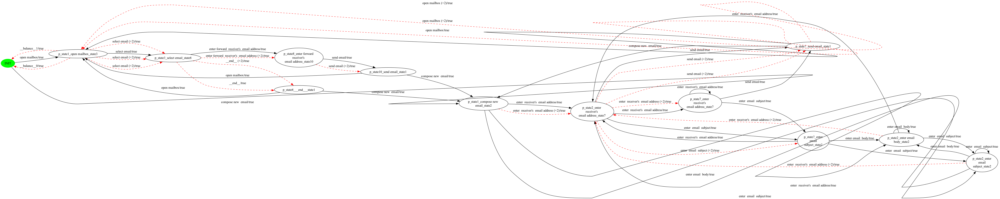

**Generated test suite** — 8 unique test case(s) after action-sequence dedup (6 pair-graph segment(s), 31 raw real step(s); pair-graph cycle has 36 edge(s) total, 9 synthetic dropped at translation). Operationally-identical trips (same action sequence, possibly different transition-level pairs) are listed once.

- **test case 1**: `compose new email -> enter email subject -> enter email subject -> enter email body`
- **test case 2**: `enter receiver's email address -> send email`
- **test case 3**: `compose new email -> enter email body -> enter receiver's email address -> enter receiver's email address -> enter receiver's email address -> enter email subject -> enter email subject`
- **test case 4**: `open mailbox -> select email -> enter forward receiver's email address -> send email`
- **test case 5**: `open mailbox`
- **test case 6**: `send email`
- **test case 7**: `compose new email -> enter receiver's email address -> enter email subject -> enter receiver's email address`
- **test case 8**: `enter email subject -> enter email body -> enter email body -> enter email subject -> enter receiver's email address`

### Product 21

**Selected features:** selected = {ad, e, en, s}

**Repaired FTS:** 9 states, 18 transitions (17 real / 1 `__end__`).

**Pair graph (raw):** 18 nodes (incl. INIT), 43 edges (every edge = one contiguous transition pair in the original FTS; the subset starting at INIT correspond to pairs `(start, t)` for any original initial-state outgoing `t`).

**Pair graph (balanced):** 18 nodes, 75 edges (32 synthetic `__balance__N` added to restore in-balance at INIT).

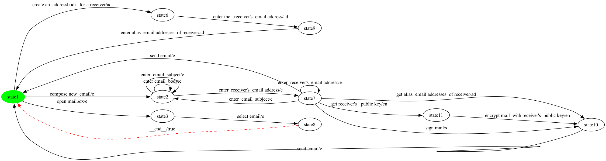

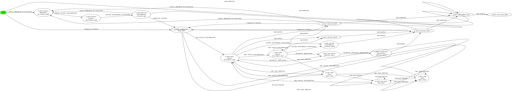

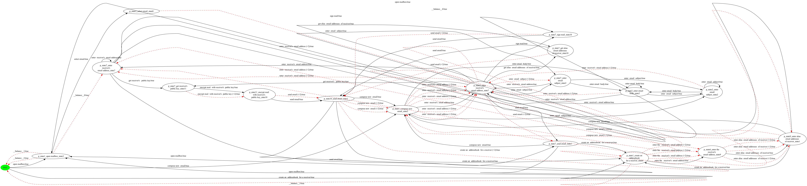

**Generated test suite** — 19 unique test case(s) after action-sequence dedup (19 pair-graph segment(s), 59 raw real step(s); pair-graph cycle has 75 edge(s) total, 32 synthetic dropped at translation). Operationally-identical trips (same action sequence, possibly different transition-level pairs) are listed once.

- **test case 1**: `compose new email -> enter email subject -> enter email subject -> enter email body`
- **test case 2**: `enter receiver's email address -> sign mail -> send email`
- **test case 3**: `enter alias email addresses of receiver`
- **test case 4**: `create an addressbook for a receiver`
- **test case 5**: `compose new email -> enter email body -> enter receiver's email address -> get alias email addresses of receiver`
- **test case 6**: `send email`
- **test case 7**: `compose new email`
- **test case 8**: `enter receiver's email address -> send email`
- **test case 9**: `compose new email -> enter receiver's email address`
- **test case 10**: `enter receiver's email address -> sign mail`
- **test case 11**: `open mailbox -> select email`
- **test case 12**: `enter receiver's email address -> get alias email addresses of receiver -> send email`
- **test case 13**: `enter receiver's email address -> enter receiver's email address -> get receiver's public key -> encrypt mail with receiver's public key -> send email`
- **test case 14**: `enter receiver's email address -> get receiver's public key`
- **test case 15**: `create an addressbook for a receiver -> enter the receiver's email address -> enter alias email addresses of receiver`
- **test case 16**: `open mailbox`
- **test case 17**: `enter receiver's email address -> enter receiver's email address -> enter email subject -> enter email subject`
- **test case 18**: `enter receiver's email address -> enter email subject -> enter receiver's email address`
- **test case 19**: `enter email subject -> enter email body -> enter email body -> enter email subject -> enter receiver's email address`

### Product 22

**Selected features:** selected = {ad, au, e, s}

**Repaired FTS:** 10 states, 21 transitions (19 real / 2 `__end__`).

**Pair graph (raw):** 20 nodes (incl. INIT), 51 edges (every edge = one contiguous transition pair in the original FTS; the subset starting at INIT correspond to pairs `(start, t)` for any original initial-state outgoing `t`).

**Pair graph (balanced):** 20 nodes, 78 edges (27 synthetic `__balance__N` added to restore in-balance at INIT).

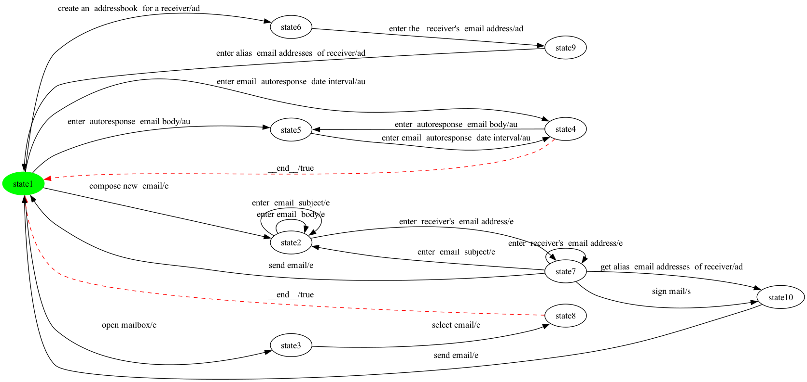

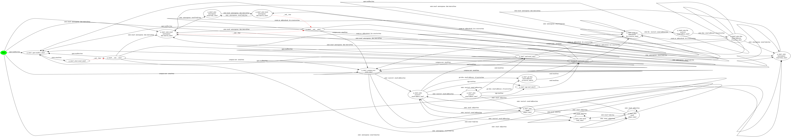

**Generated test suite** — 20 unique test case(s) after action-sequence dedup (21 pair-graph segment(s), 66 raw real step(s); pair-graph cycle has 78 edge(s) total, 27 synthetic dropped at translation). Operationally-identical trips (same action sequence, possibly different transition-level pairs) are listed once.

- **test case 1**: `enter email autoresponse date interval -> enter autoresponse email body -> enter email autoresponse date interval -> enter autoresponse email body`
- **test case 2**: `enter autoresponse email body -> enter email autoresponse date interval`
- **test case 3**: `compose new email -> enter email body -> enter email subject -> enter email subject -> enter receiver's email address -> sign mail -> send email`
- **test case 4**: `enter autoresponse email body`
- **test case 5**: `compose new email -> enter email subject -> enter email body -> enter receiver's email address -> get alias email addresses of receiver -> send email`
- **test case 6**: `create an addressbook for a receiver`
- **test case 7**: `enter alias email addresses of receiver`
- **test case 8**: `compose new email`
- **test case 9**: `enter receiver's email address -> send email`
- **test case 10**: `enter email autoresponse date interval`
- **test case 11**: `enter receiver's email address -> sign mail`
- **test case 12**: `open mailbox -> select email`
- **test case 13**: `send email`
- **test case 14**: `open mailbox`
- **test case 15**: `compose new email -> enter receiver's email address -> enter email subject -> enter email body -> enter email body`
- **test case 16**: `enter the receiver's email address -> enter alias email addresses of receiver`
- **test case 17**: `create an addressbook for a receiver -> enter the receiver's email address`
- **test case 18**: `enter email subject -> enter receiver's email address -> enter receiver's email address -> enter receiver's email address -> send email`
- **test case 19**: `enter receiver's email address -> get alias email addresses of receiver`
- **test case 20**: `enter receiver's email address -> enter email subject -> enter email subject`

### Product 23

**Selected features:** selected = {au, e, s}

**Repaired FTS:** 8 states, 17 transitions (15 real / 2 `__end__`).

**Pair graph (raw):** 16 nodes (incl. INIT), 38 edges (every edge = one contiguous transition pair in the original FTS; the subset starting at INIT correspond to pairs `(start, t)` for any original initial-state outgoing `t`).

**Pair graph (balanced):** 16 nodes, 50 edges (12 synthetic `__balance__N` added to restore in-balance at INIT).

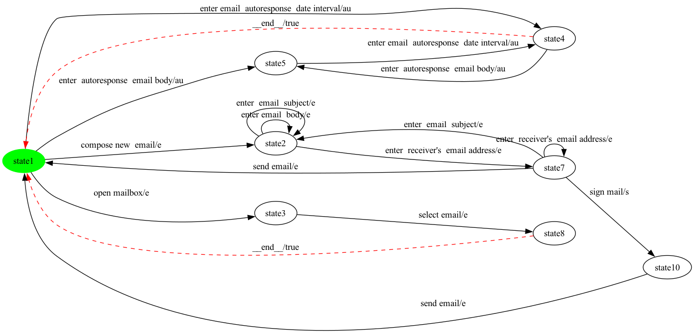

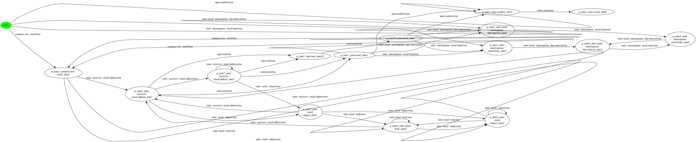

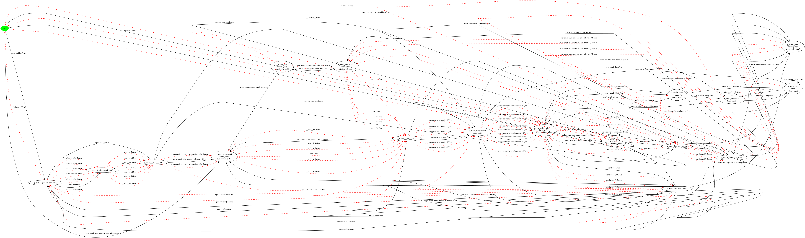

**Generated test suite** — 13 unique test case(s) after action-sequence dedup (12 pair-graph segment(s), 46 raw real step(s); pair-graph cycle has 50 edge(s) total, 12 synthetic dropped at translation). Operationally-identical trips (same action sequence, possibly different transition-level pairs) are listed once.

- **test case 1**: `enter email autoresponse date interval -> enter autoresponse email body -> enter email autoresponse date interval -> enter autoresponse email body`
- **test case 2**: `compose new email -> enter email subject -> enter email subject -> enter email body -> enter receiver's email address -> sign mail -> send email`
- **test case 3**: `open mailbox -> select email`
- **test case 4**: `send email`
- **test case 5**: `compose new email -> enter email body -> enter email body -> enter email subject -> enter receiver's email address -> enter receiver's email address -> send email`
- **test case 6**: `enter email autoresponse date interval`
- **test case 7**: `enter email subject -> enter email subject`
- **test case 8**: `open mailbox`
- **test case 9**: `enter autoresponse email body -> enter email autoresponse date interval`
- **test case 10**: `enter receiver's email address -> sign mail`
- **test case 11**: `enter autoresponse email body`
- **test case 12**: `enter receiver's email address -> enter receiver's email address -> enter email subject -> enter receiver's email address -> send email`
- **test case 13**: `compose new email -> enter receiver's email address -> enter email subject -> enter email body`

---

Total products: 23.
