# Per-Product All-Transitions Coverage — Elevator

## How the all-transitions test case is built (M4 pipeline)

Given an SPL-level FTS plus one product configuration, the generator runs five steps. All five live in the `vibes-testgeneration` module; the orchestrator is [`TransitionCoverageGenerator.generate(...)`](../../../vibes-testgeneration/src/main/java/be/vibes/testgeneration/coverage/TransitionCoverageGenerator.java).

**Step 1 — Project onto the product.** [`FExpressionPreservingProjection.project(fts, config)`](../../../vibes-testgeneration/src/main/java/be/vibes/testgeneration/product/FExpressionPreservingProjection.java) keeps every transition `t` whose feature expression evaluates true under the product (`fts.getFExpression(t).assign(config).applySimplification().isTrue()`); the original (un-assigned) `FExpression` is preserved on the kept transition for traceability. A forward BFS from the initial state then drops states unreachable from it. Output: a product-level `FeaturedTransitionSystem`.

**Step 2 — Repair strong connectivity.** [`InitialSccFilter.keepInitialScc(projected)`](../../../vibes-testgeneration/src/main/java/be/vibes/testgeneration/graph/InitialSccFilter.java) runs [Tarjan's SCC](../../../vibes-testgeneration/src/main/java/be/vibes/testgeneration/graph/StronglyConnectedComponents.java), keeps the SCC containing the initial state, and drops every other state (and its transitions). The result is strongly connected by construction — the precondition for any Eulerian-cycle algorithm. In the three MVP SPLs this step is currently a no-op (the projection already produced a single SCC reachable from initial); we still run it as an invariant check and to keep the pipeline robust for larger SPLs.

**Step 3 — Balance for an Euler cycle.** [`EulerianBalancer.balance(repaired)`](../../../vibes-testgeneration/src/main/java/be/vibes/testgeneration/graph/EulerianBalancer.java) makes the graph Eulerian by enforcing `in-degree == out-degree` at every state. The approach is a directed **Chinese Postman**: for each pair of imbalanced states `(u, v)` (`u` has excess outgoing, `v` has excess incoming) it finds a shortest path of real transitions from `v` to `u` via BFS, then **doubles** every transition along that path. Doubled transitions get a unique action name `<original>__dup__N` so they survive VIBeS' dedup but their semantic action is the original — coverage measurement strips the suffix. Where no real path exists (e.g. the pair-graph from M6) the balancer falls back to a direct synthetic `__balance__N` edge.

**Step 4 — Trace the Euler cycle.** [`HierholzerEulerCycle.compute(balanced)`](../../../vibes-testgeneration/src/main/java/be/vibes/testgeneration/graph/HierholzerEulerCycle.java) walks the balanced graph using Hierholzer's algorithm: DFS until a sub-cycle closes, splice in additional sub-cycles from unvisited transitions, repeat. The output is one contiguous sequence of transitions that visits every edge of the balanced graph exactly once and returns to the initial state.

**Step 5 — Wrap into a TestCase, then split into trips.** The cycle is enqueued into `be.vibes.ts.TestCase`. For display the cycle is split at every visit to the initial state via [`TestCaseSplitter.splitAtInitialReturns(...)`](../../../vibes-testgeneration/src/main/java/be/vibes/testgeneration/product/TestCaseSplitter.java); each trip from initial back to initial is one test case in the operational sense (boot the SUT, run actions, return to reset). When rendering the action sequence, `__end__` and `__balance__N` transitions are hidden (synthetic reset markers, not real SUT events) and `<action>__dup__N` is shown as `<action>` (a real second traversal). All synthetics are still filtered from coverage measurement via `EulerianBalancer.isSyntheticAction(...)`.

**Coverage claim (by construction).** Every real transition in the projected FTS appears in the balanced FTS (balancing only adds, never removes). The Hierholzer cycle visits every transition of the balanced graph exactly once. Therefore the cycle's real (non-synthetic) transitions cover **100% of the projected FTS' real transitions**. This is a structural invariant, not an empirical observation.

---

## Products

Each product below shows the projected FTS (left, synthetic `__end__` transitions dashed-red) and the balanced FTS (right, Chinese-Postman doubled transitions `<action>__dup__N` dashed-red). The generated all-transitions test case is listed underneath, segmented at every synthetic action (the action sequence between two synthetic boundaries is one self-contained sub-walk on real SUT events).

### Product 1

**Selected features:** selected = {ControlButtons, ExecutiveFloor, Intercom, PinPad}

**Projected FTS:** 8 states, 23 transitions (20 real / 3 `__end__`).

**Repaired FTS (after `InitialSccFilter`):** 8 states, 23 transitions (20 real / 3 `__end__`).

**Balanced FTS:** 8 states, 43 transitions (20 real / 12 `__end__` / 20 `__dup__` / 0 `__balance__`).

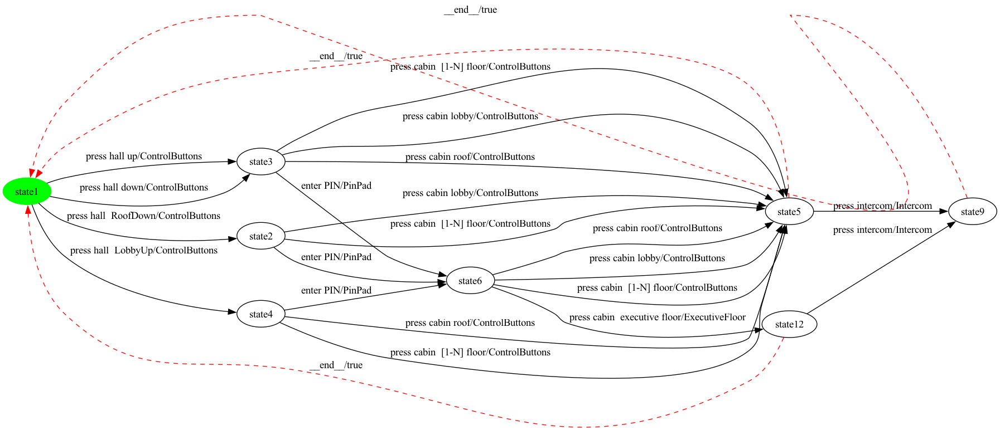

**All-transitions coverage on the repaired FTS:** **20/20 = 100.0%** (43 raw cycle step(s): 20 real, 12 `__end__`, 20 `__dup__`, 0 `__balance__`).

**Generated test cases** (12 trip(s) from initial back to initial, hidden synthetics removed):

- **test case 1**: `press hall RoofDown -> press cabin [1-N] floor -> press intercom`
- **test case 2**: `press hall RoofDown -> press cabin lobby`
- **test case 3**: `press hall RoofDown -> enter PIN -> press cabin lobby`
- **test case 4**: `press hall RoofDown -> enter PIN -> press cabin [1-N] floor`
- **test case 5**: `press hall RoofDown -> enter PIN -> press cabin roof`
- **test case 6**: `press hall up -> enter PIN -> press cabin executive floor -> press intercom`
- **test case 7**: `press hall down -> press cabin lobby`
- **test case 8**: `press hall up -> press cabin roof`
- **test case 9**: `press hall up -> press cabin [1-N] floor`
- **test case 10**: `press hall LobbyUp -> press cabin roof`
- **test case 11**: `press hall LobbyUp -> press cabin [1-N] floor`
- **test case 12**: `press hall LobbyUp -> enter PIN -> press cabin executive floor`

### Product 2

**Selected features:** selected = {Alarm, ControlButtons, MobileKey}

**Projected FTS:** 7 states, 20 transitions (18 real / 2 `__end__`).

**Repaired FTS (after `InitialSccFilter`):** 7 states, 20 transitions (18 real / 2 `__end__`).

**Balanced FTS:** 7 states, 34 transitions (18 real / 10 `__end__` / 14 `__dup__` / 0 `__balance__`).

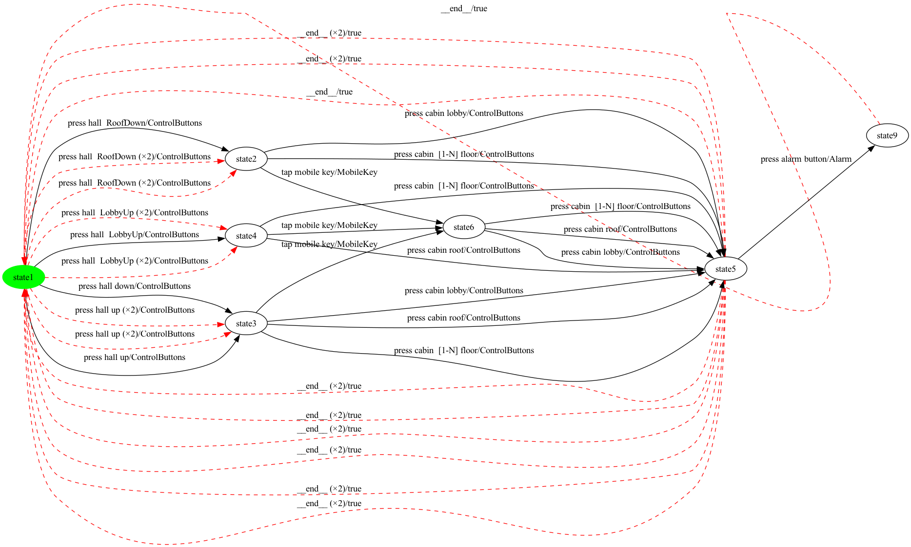

**All-transitions coverage on the repaired FTS:** **18/18 = 100.0%** (34 raw cycle step(s): 18 real, 10 `__end__`, 14 `__dup__`, 0 `__balance__`).

**Generated test cases** (10 trip(s) from initial back to initial, hidden synthetics removed):

- **test case 1**: `press hall RoofDown -> tap mobile key -> press cabin lobby -> press alarm button`
- **test case 2**: `press hall RoofDown -> press cabin [1-N] floor`
- **test case 3**: `press hall RoofDown -> press cabin lobby`
- **test case 4**: `press hall up -> press cabin lobby`
- **test case 5**: `press hall up -> press cabin roof`
- **test case 6**: `press hall down -> press cabin [1-N] floor`
- **test case 7**: `press hall up -> tap mobile key -> press cabin [1-N] floor`
- **test case 8**: `press hall LobbyUp -> press cabin roof`
- **test case 9**: `press hall LobbyUp -> press cabin [1-N] floor`
- **test case 10**: `press hall LobbyUp -> tap mobile key -> press cabin roof`

### Product 3

**Selected features:** selected = {Alarm, CardReader, ControlButtons, ExecutiveFloor}

**Projected FTS:** 8 states, 23 transitions (20 real / 3 `__end__`).

**Repaired FTS (after `InitialSccFilter`):** 8 states, 23 transitions (20 real / 3 `__end__`).

**Balanced FTS:** 8 states, 43 transitions (20 real / 12 `__end__` / 20 `__dup__` / 0 `__balance__`).

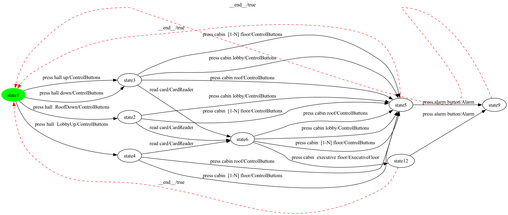

**All-transitions coverage on the repaired FTS:** **20/20 = 100.0%** (43 raw cycle step(s): 20 real, 12 `__end__`, 20 `__dup__`, 0 `__balance__`).

**Generated test cases** (12 trip(s) from initial back to initial, hidden synthetics removed):

- **test case 1**: `press hall RoofDown -> press cabin [1-N] floor -> press alarm button`
- **test case 2**: `press hall RoofDown -> press cabin lobby`
- **test case 3**: `press hall RoofDown -> read card -> press cabin lobby`
- **test case 4**: `press hall RoofDown -> read card -> press cabin [1-N] floor`
- **test case 5**: `press hall RoofDown -> read card -> press cabin roof`
- **test case 6**: `press hall up -> read card -> press cabin executive floor -> press alarm button`
- **test case 7**: `press hall down -> press cabin lobby`
- **test case 8**: `press hall up -> press cabin roof`
- **test case 9**: `press hall up -> press cabin [1-N] floor`
- **test case 10**: `press hall LobbyUp -> press cabin roof`
- **test case 11**: `press hall LobbyUp -> press cabin [1-N] floor`
- **test case 12**: `press hall LobbyUp -> read card -> press cabin executive floor`

### Product 4

**Selected features:** selected = {ControlButtons, Intercom, ManualDoorControl, MobileKey}

**Projected FTS:** 9 states, 26 transitions (22 real / 4 `__end__`).

**Repaired FTS (after `InitialSccFilter`):** 9 states, 26 transitions (22 real / 4 `__end__`).

**Balanced FTS:** 9 states, 38 transitions (22 real / 10 `__end__` / 12 `__dup__` / 0 `__balance__`).

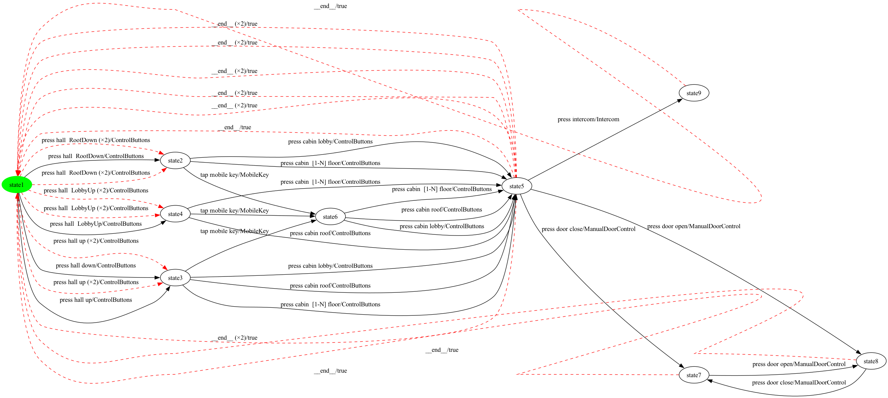

**All-transitions coverage on the repaired FTS:** **22/22 = 100.0%** (38 raw cycle step(s): 22 real, 10 `__end__`, 12 `__dup__`, 0 `__balance__`).

**Generated test cases** (10 trip(s) from initial back to initial, hidden synthetics removed):

- **test case 1**: `press hall RoofDown -> press cabin lobby -> press intercom`
- **test case 2**: `press hall RoofDown -> press cabin [1-N] floor -> press door open -> press door close`
- **test case 3**: `press hall RoofDown -> tap mobile key -> press cabin lobby -> press door close -> press door open`
- **test case 4**: `press hall up -> tap mobile key -> press cabin [1-N] floor`
- **test case 5**: `press hall up -> press cabin lobby`
- **test case 6**: `press hall down -> press cabin roof`
- **test case 7**: `press hall up -> press cabin [1-N] floor`
- **test case 8**: `press hall LobbyUp -> press cabin roof`
- **test case 9**: `press hall LobbyUp -> press cabin [1-N] floor`
- **test case 10**: `press hall LobbyUp -> tap mobile key -> press cabin roof`

### Product 5

**Selected features:** selected = {Alarm, ControlButtons, FirefighterService}

**Projected FTS:** 10 states, 24 transitions (20 real / 4 `__end__`).

**Repaired FTS (after `InitialSccFilter`):** 10 states, 24 transitions (20 real / 4 `__end__`).

**Balanced FTS:** 10 states, 49 transitions (20 real / 10 `__end__` / 25 `__dup__` / 0 `__balance__`).

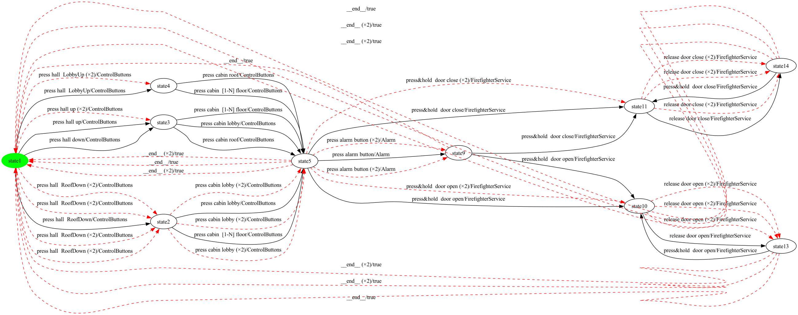

**All-transitions coverage on the repaired FTS:** **20/20 = 100.0%** (49 raw cycle step(s): 20 real, 10 `__end__`, 25 `__dup__`, 0 `__balance__`).

**Generated test cases** (10 trip(s) from initial back to initial, hidden synthetics removed):

- **test case 1**: `press hall RoofDown -> press cabin lobby -> press alarm button -> press&hold door close -> release door close`
- **test case 2**: `press hall RoofDown -> press cabin lobby -> press alarm button`
- **test case 3**: `press hall RoofDown -> press cabin lobby -> press alarm button -> press&hold door open -> release door open`
- **test case 4**: `press hall RoofDown -> press cabin [1-N] floor -> press&hold door open -> release door open`
- **test case 5**: `press hall RoofDown -> press cabin lobby -> press&hold door open -> release door open -> press&hold door open -> release door open`
- **test case 6**: `press hall up -> press cabin lobby -> press&hold door close -> release door close`
- **test case 7**: `press hall down -> press cabin roof -> press&hold door close -> release door close -> press&hold door close -> release door close`
- **test case 8**: `press hall up -> press cabin [1-N] floor`
- **test case 9**: `press hall LobbyUp -> press cabin roof`
- **test case 10**: `press hall LobbyUp -> press cabin [1-N] floor`

### Product 6

**Selected features:** selected = {CardReader, ControlButtons, Intercom, ManualDoorControl}

**Projected FTS:** 9 states, 26 transitions (22 real / 4 `__end__`).

**Repaired FTS (after `InitialSccFilter`):** 9 states, 26 transitions (22 real / 4 `__end__`).

**Balanced FTS:** 9 states, 38 transitions (22 real / 10 `__end__` / 12 `__dup__` / 0 `__balance__`).

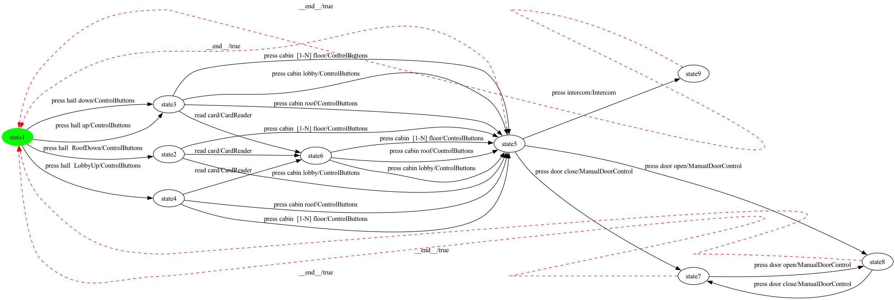

**All-transitions coverage on the repaired FTS:** **22/22 = 100.0%** (38 raw cycle step(s): 22 real, 10 `__end__`, 12 `__dup__`, 0 `__balance__`).

**Generated test cases** (10 trip(s) from initial back to initial, hidden synthetics removed):

- **test case 1**: `press hall RoofDown -> press cabin lobby -> press intercom`
- **test case 2**: `press hall RoofDown -> press cabin [1-N] floor -> press door open -> press door close`
- **test case 3**: `press hall RoofDown -> read card -> press cabin lobby -> press door close -> press door open`
- **test case 4**: `press hall up -> press cabin lobby`
- **test case 5**: `press hall up -> press cabin roof`
- **test case 6**: `press hall down -> press cabin [1-N] floor`
- **test case 7**: `press hall up -> read card -> press cabin [1-N] floor`
- **test case 8**: `press hall LobbyUp -> press cabin roof`
- **test case 9**: `press hall LobbyUp -> press cabin [1-N] floor`
- **test case 10**: `press hall LobbyUp -> read card -> press cabin roof`

### Product 7

**Selected features:** selected = {Alarm, ControlButtons, ExecutiveFloor, Intercom, MobileKey}

**Projected FTS:** 8 states, 25 transitions (22 real / 3 `__end__`).

**Repaired FTS (after `InitialSccFilter`):** 8 states, 25 transitions (22 real / 3 `__end__`).

**Balanced FTS:** 8 states, 49 transitions (22 real / 13 `__end__` / 24 `__dup__` / 0 `__balance__`).

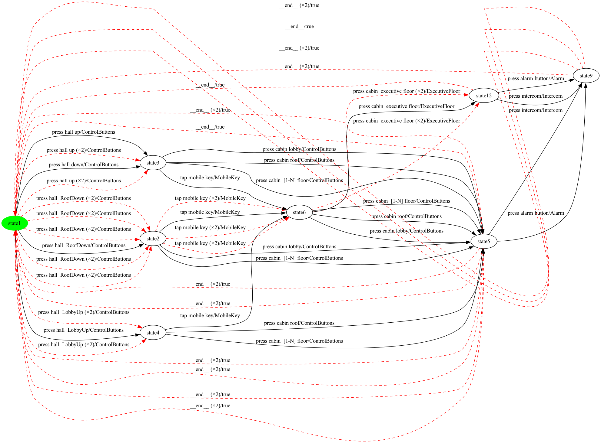

**All-transitions coverage on the repaired FTS:** **22/22 = 100.0%** (49 raw cycle step(s): 22 real, 13 `__end__`, 24 `__dup__`, 0 `__balance__`).

**Generated test cases** (13 trip(s) from initial back to initial, hidden synthetics removed):

- **test case 1**: `press hall RoofDown -> press cabin lobby -> press intercom`
- **test case 2**: `press hall RoofDown -> press cabin [1-N] floor -> press alarm button`
- **test case 3**: `press hall RoofDown -> tap mobile key -> press cabin lobby`
- **test case 4**: `press hall RoofDown -> tap mobile key -> press cabin [1-N] floor`
- **test case 5**: `press hall RoofDown -> tap mobile key -> press cabin roof`
- **test case 6**: `press hall RoofDown -> tap mobile key -> press cabin executive floor -> press intercom`
- **test case 7**: `press hall up -> tap mobile key -> press cabin executive floor -> press alarm button`
- **test case 8**: `press hall up -> press cabin lobby`
- **test case 9**: `press hall up -> press cabin roof`
- **test case 10**: `press hall down -> press cabin [1-N] floor`
- **test case 11**: `press hall LobbyUp -> press cabin roof`
- **test case 12**: `press hall LobbyUp -> press cabin [1-N] floor`
- **test case 13**: `press hall LobbyUp -> tap mobile key -> press cabin executive floor`

### Product 8

**Selected features:** selected = {Alarm, ControlButtons, ExecutiveFloor, ManualDoorControl, PinPad}

**Projected FTS:** 10 states, 31 transitions (26 real / 5 `__end__`).

**Repaired FTS (after `InitialSccFilter`):** 10 states, 31 transitions (26 real / 5 `__end__`).

**Balanced FTS:** 10 states, 57 transitions (26 real / 14 `__end__` / 26 `__dup__` / 0 `__balance__`).

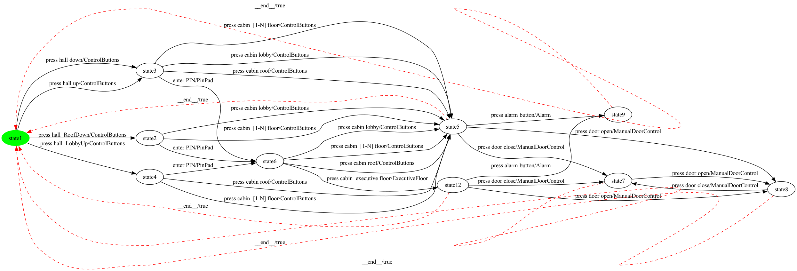

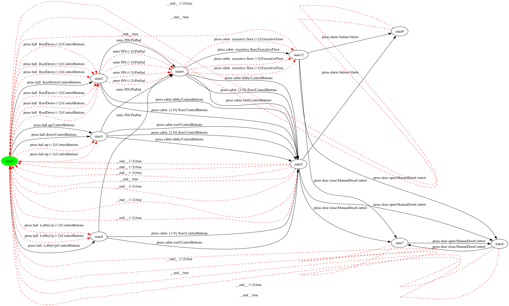

**All-transitions coverage on the repaired FTS:** **26/26 = 100.0%** (57 raw cycle step(s): 26 real, 14 `__end__`, 26 `__dup__`, 0 `__balance__`).

**Generated test cases** (14 trip(s) from initial back to initial, hidden synthetics removed):

- **test case 1**: `press hall RoofDown -> enter PIN -> press cabin lobby -> press alarm button`
- **test case 2**: `press hall RoofDown -> enter PIN -> press cabin [1-N] floor -> press door open -> press door close`
- **test case 3**: `press hall RoofDown -> enter PIN -> press cabin roof -> press door close`
- **test case 4**: `press hall RoofDown -> enter PIN -> press cabin executive floor -> press alarm button`
- **test case 5**: `press hall RoofDown -> enter PIN -> press cabin executive floor -> press door close -> press door open`
- **test case 6**: `press hall RoofDown -> press cabin lobby`
- **test case 7**: `press hall RoofDown -> press cabin [1-N] floor`
- **test case 8**: `press hall up -> press cabin lobby`
- **test case 9**: `press hall up -> press cabin roof`
- **test case 10**: `press hall down -> press cabin [1-N] floor`
- **test case 11**: `press hall up -> enter PIN -> press cabin executive floor -> press door open`
- **test case 12**: `press hall LobbyUp -> press cabin roof`
- **test case 13**: `press hall LobbyUp -> press cabin [1-N] floor`
- **test case 14**: `press hall LobbyUp -> enter PIN -> press cabin executive floor`

### Product 9

**Selected features:** selected = {ControlButtons, ExecutiveFloor, Intercom, ManualDoorControl, PinPad}

**Projected FTS:** 10 states, 31 transitions (26 real / 5 `__end__`).

**Repaired FTS (after `InitialSccFilter`):** 10 states, 31 transitions (26 real / 5 `__end__`).

**Balanced FTS:** 10 states, 57 transitions (26 real / 14 `__end__` / 26 `__dup__` / 0 `__balance__`).

**All-transitions coverage on the repaired FTS:** **26/26 = 100.0%** (57 raw cycle step(s): 26 real, 14 `__end__`, 26 `__dup__`, 0 `__balance__`).

**Generated test cases** (14 trip(s) from initial back to initial, hidden synthetics removed):

- **test case 1**: `press hall RoofDown -> enter PIN -> press cabin lobby -> press intercom`
- **test case 2**: `press hall RoofDown -> enter PIN -> press cabin [1-N] floor -> press door open -> press door close`
- **test case 3**: `press hall RoofDown -> enter PIN -> press cabin roof -> press door close`
- **test case 4**: `press hall RoofDown -> enter PIN -> press cabin executive floor -> press door close -> press door open`
- **test case 5**: `press hall RoofDown -> enter PIN -> press cabin executive floor -> press door open`
- **test case 6**: `press hall RoofDown -> press cabin lobby`
- **test case 7**: `press hall RoofDown -> press cabin [1-N] floor`
- **test case 8**: `press hall up -> press cabin lobby`
- **test case 9**: `press hall up -> press cabin roof`
- **test case 10**: `press hall down -> press cabin [1-N] floor`
- **test case 11**: `press hall up -> enter PIN -> press cabin executive floor -> press intercom`
- **test case 12**: `press hall LobbyUp -> press cabin roof`
- **test case 13**: `press hall LobbyUp -> press cabin [1-N] floor`
- **test case 14**: `press hall LobbyUp -> enter PIN -> press cabin executive floor`

### Product 10

**Selected features:** selected = {ControlButtons, FirefighterService, Intercom}

**Projected FTS:** 10 states, 24 transitions (20 real / 4 `__end__`).

**Repaired FTS (after `InitialSccFilter`):** 10 states, 24 transitions (20 real / 4 `__end__`).

**Balanced FTS:** 10 states, 49 transitions (20 real / 10 `__end__` / 25 `__dup__` / 0 `__balance__`).

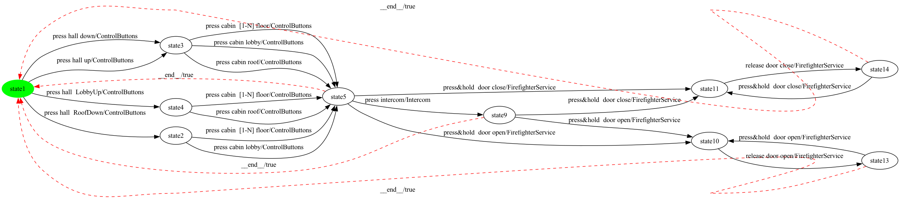

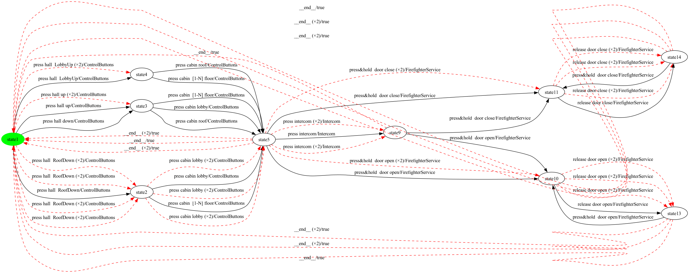

**All-transitions coverage on the repaired FTS:** **20/20 = 100.0%** (49 raw cycle step(s): 20 real, 10 `__end__`, 25 `__dup__`, 0 `__balance__`).

**Generated test cases** (10 trip(s) from initial back to initial, hidden synthetics removed):

- **test case 1**: `press hall RoofDown -> press cabin lobby -> press intercom -> press&hold door close -> release door close`
- **test case 2**: `press hall RoofDown -> press cabin lobby -> press intercom`
- **test case 3**: `press hall RoofDown -> press cabin lobby -> press intercom -> press&hold door open -> release door open`
- **test case 4**: `press hall RoofDown -> press cabin [1-N] floor -> press&hold door open -> release door open`
- **test case 5**: `press hall RoofDown -> press cabin lobby -> press&hold door open -> release door open -> press&hold door open -> release door open`
- **test case 6**: `press hall up -> press cabin lobby -> press&hold door close -> release door close`
- **test case 7**: `press hall down -> press cabin roof -> press&hold door close -> release door close -> press&hold door close -> release door close`
- **test case 8**: `press hall up -> press cabin [1-N] floor`
- **test case 9**: `press hall LobbyUp -> press cabin roof`
- **test case 10**: `press hall LobbyUp -> press cabin [1-N] floor`

### Product 11

**Selected features:** selected = {Alarm, ControlButtons, FirefighterService, Intercom, ManualDoorControl}

**Projected FTS:** 12 states, 31 transitions (25 real / 6 `__end__`).

**Repaired FTS (after `InitialSccFilter`):** 12 states, 31 transitions (25 real / 6 `__end__`).

**Balanced FTS:** 12 states, 48 transitions (25 real / 9 `__end__` / 17 `__dup__` / 0 `__balance__`).

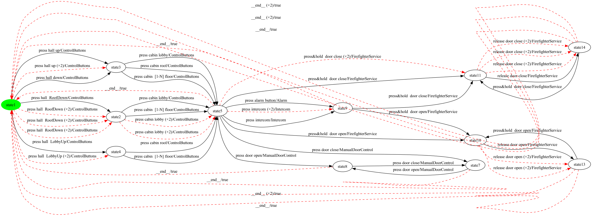

**All-transitions coverage on the repaired FTS:** **25/25 = 100.0%** (48 raw cycle step(s): 25 real, 9 `__end__`, 17 `__dup__`, 0 `__balance__`).

**Generated test cases** (9 trip(s) from initial back to initial, hidden synthetics removed):

- **test case 1**: `press hall RoofDown -> press cabin lobby -> press intercom -> press&hold door open -> release door open`
- **test case 2**: `press hall RoofDown -> press cabin lobby -> press alarm button -> press&hold door close -> release door close`
- **test case 3**: `press hall RoofDown -> press cabin lobby -> press intercom`
- **test case 4**: `press hall RoofDown -> press cabin [1-N] floor -> press door open -> press door close`
- **test case 5**: `press hall up -> press cabin lobby -> press door close -> press door open`
- **test case 6**: `press hall up -> press cabin roof -> press&hold door open -> release door open -> press&hold door open -> release door open`
- **test case 7**: `press hall down -> press cabin [1-N] floor -> press&hold door close -> release door close`
- **test case 8**: `press hall LobbyUp -> press cabin roof -> press&hold door close -> release door close -> press&hold door close -> release door close`
- **test case 9**: `press hall LobbyUp -> press cabin [1-N] floor`

### Product 12

**Selected features:** selected = {Alarm, ControlButtons, ExecutiveFloor, PinPad}

**Projected FTS:** 8 states, 23 transitions (20 real / 3 `__end__`).

**Repaired FTS (after `InitialSccFilter`):** 8 states, 23 transitions (20 real / 3 `__end__`).

**Balanced FTS:** 8 states, 43 transitions (20 real / 12 `__end__` / 20 `__dup__` / 0 `__balance__`).

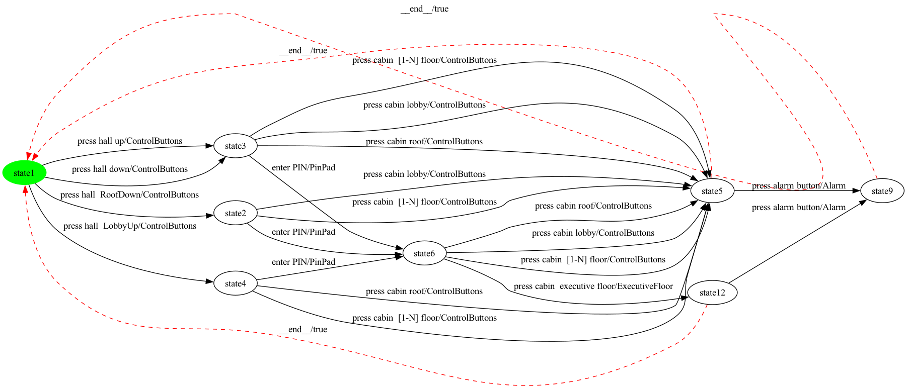

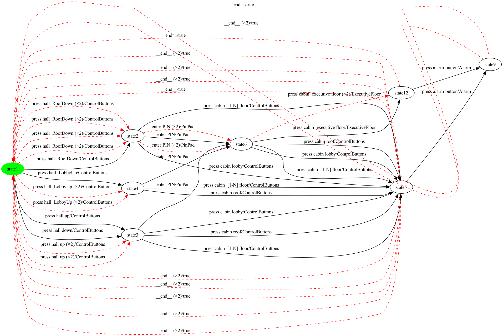

**All-transitions coverage on the repaired FTS:** **20/20 = 100.0%** (43 raw cycle step(s): 20 real, 12 `__end__`, 20 `__dup__`, 0 `__balance__`).

**Generated test cases** (12 trip(s) from initial back to initial, hidden synthetics removed):

- **test case 1**: `press hall RoofDown -> press cabin [1-N] floor -> press alarm button`
- **test case 2**: `press hall RoofDown -> press cabin lobby`
- **test case 3**: `press hall RoofDown -> enter PIN -> press cabin lobby`
- **test case 4**: `press hall RoofDown -> enter PIN -> press cabin [1-N] floor`
- **test case 5**: `press hall RoofDown -> enter PIN -> press cabin roof`
- **test case 6**: `press hall up -> enter PIN -> press cabin executive floor -> press alarm button`
- **test case 7**: `press hall down -> press cabin lobby`
- **test case 8**: `press hall up -> press cabin roof`
- **test case 9**: `press hall up -> press cabin [1-N] floor`
- **test case 10**: `press hall LobbyUp -> press cabin roof`
- **test case 11**: `press hall LobbyUp -> press cabin [1-N] floor`
- **test case 12**: `press hall LobbyUp -> enter PIN -> press cabin executive floor`

### Product 13

**Selected features:** selected = {Alarm, ControlButtons, FirefighterService, ManualDoorControl}

**Projected FTS:** 12 states, 30 transitions (24 real / 6 `__end__`).

**Repaired FTS (after `InitialSccFilter`):** 12 states, 30 transitions (24 real / 6 `__end__`).

**Balanced FTS:** 12 states, 46 transitions (24 real / 9 `__end__` / 16 `__dup__` / 0 `__balance__`).

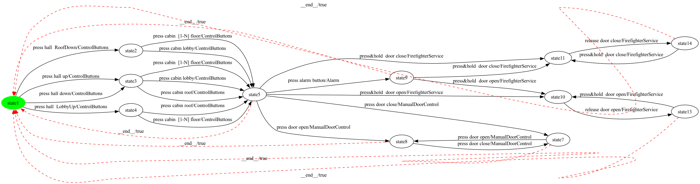

**All-transitions coverage on the repaired FTS:** **24/24 = 100.0%** (46 raw cycle step(s): 24 real, 9 `__end__`, 16 `__dup__`, 0 `__balance__`).

**Generated test cases** (9 trip(s) from initial back to initial, hidden synthetics removed):

- **test case 1**: `press hall RoofDown -> press cabin lobby -> press alarm button -> press&hold door open -> release door open`
- **test case 2**: `press hall RoofDown -> press cabin lobby -> press alarm button -> press&hold door close -> release door close`
- **test case 3**: `press hall RoofDown -> press cabin lobby -> press alarm button`
- **test case 4**: `press hall RoofDown -> press cabin [1-N] floor -> press door open -> press door close`
- **test case 5**: `press hall up -> press cabin lobby -> press door close -> press door open`
- **test case 6**: `press hall up -> press cabin roof -> press&hold door open -> release door open -> press&hold door open -> release door open`
- **test case 7**: `press hall down -> press cabin [1-N] floor -> press&hold door close -> release door close -> press&hold door close -> release door close`
- **test case 8**: `press hall LobbyUp -> press cabin roof`
- **test case 9**: `press hall LobbyUp -> press cabin [1-N] floor`

### Product 14

**Selected features:** selected = {Alarm, CardReader, ControlButtons, ExecutiveFloor, Intercom}

**Projected FTS:** 8 states, 25 transitions (22 real / 3 `__end__`).

**Repaired FTS (after `InitialSccFilter`):** 8 states, 25 transitions (22 real / 3 `__end__`).

**Balanced FTS:** 8 states, 49 transitions (22 real / 13 `__end__` / 24 `__dup__` / 0 `__balance__`).

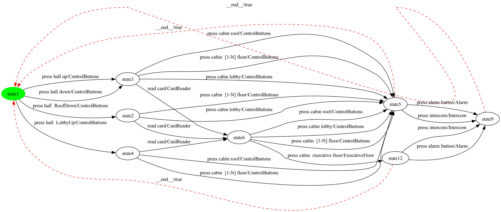

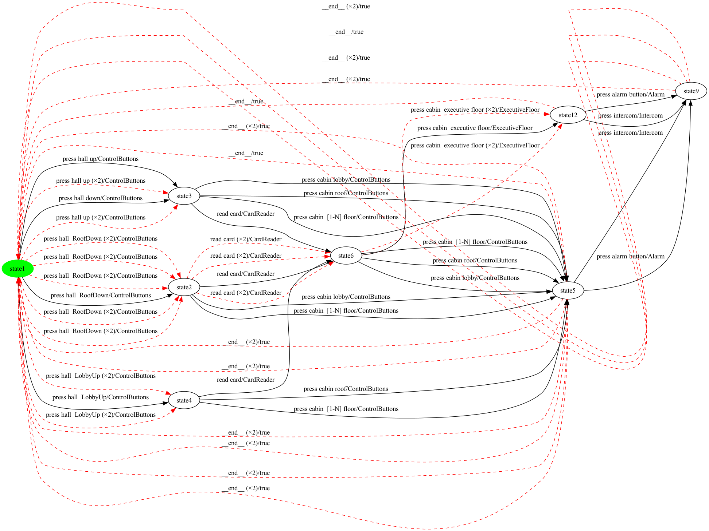

**All-transitions coverage on the repaired FTS:** **22/22 = 100.0%** (49 raw cycle step(s): 22 real, 13 `__end__`, 24 `__dup__`, 0 `__balance__`).

**Generated test cases** (13 trip(s) from initial back to initial, hidden synthetics removed):

- **test case 1**: `press hall RoofDown -> press cabin lobby -> press intercom`
- **test case 2**: `press hall RoofDown -> press cabin [1-N] floor -> press alarm button`
- **test case 3**: `press hall RoofDown -> read card -> press cabin lobby`
- **test case 4**: `press hall RoofDown -> read card -> press cabin [1-N] floor`
- **test case 5**: `press hall RoofDown -> read card -> press cabin roof`
- **test case 6**: `press hall RoofDown -> read card -> press cabin executive floor -> press intercom`
- **test case 7**: `press hall up -> press cabin lobby`
- **test case 8**: `press hall up -> press cabin roof`
- **test case 9**: `press hall up -> press cabin [1-N] floor`
- **test case 10**: `press hall down -> read card -> press cabin executive floor -> press alarm button`
- **test case 11**: `press hall LobbyUp -> press cabin roof`
- **test case 12**: `press hall LobbyUp -> press cabin [1-N] floor`
- **test case 13**: `press hall LobbyUp -> read card -> press cabin executive floor`

### Product 15

**Selected features:** selected = {ControlButtons, FirefighterService, Intercom, ManualDoorControl}

**Projected FTS:** 12 states, 30 transitions (24 real / 6 `__end__`).

**Repaired FTS (after `InitialSccFilter`):** 12 states, 30 transitions (24 real / 6 `__end__`).

**Balanced FTS:** 12 states, 46 transitions (24 real / 9 `__end__` / 16 `__dup__` / 0 `__balance__`).

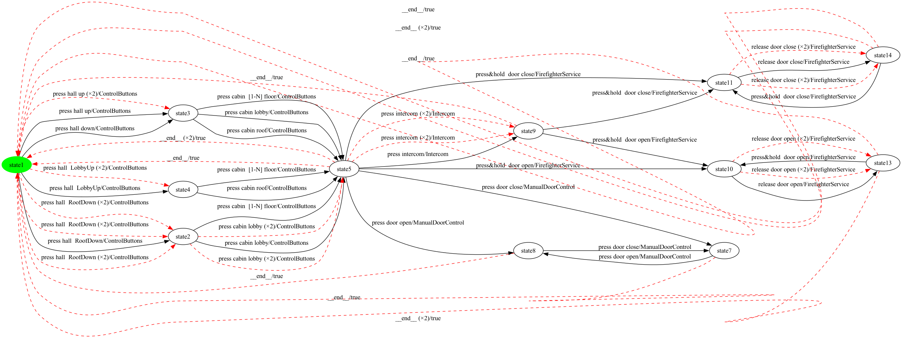

**All-transitions coverage on the repaired FTS:** **24/24 = 100.0%** (46 raw cycle step(s): 24 real, 9 `__end__`, 16 `__dup__`, 0 `__balance__`).

**Generated test cases** (9 trip(s) from initial back to initial, hidden synthetics removed):

- **test case 1**: `press hall RoofDown -> press cabin lobby -> press intercom -> press&hold door open -> release door open`
- **test case 2**: `press hall RoofDown -> press cabin lobby -> press intercom -> press&hold door close -> release door close`
- **test case 3**: `press hall RoofDown -> press cabin lobby -> press intercom`
- **test case 4**: `press hall RoofDown -> press cabin [1-N] floor -> press door open -> press door close`
- **test case 5**: `press hall up -> press cabin lobby -> press door close -> press door open`
- **test case 6**: `press hall up -> press cabin roof -> press&hold door open -> release door open -> press&hold door open -> release door open`
- **test case 7**: `press hall down -> press cabin [1-N] floor -> press&hold door close -> release door close -> press&hold door close -> release door close`
- **test case 8**: `press hall LobbyUp -> press cabin roof`
- **test case 9**: `press hall LobbyUp -> press cabin [1-N] floor`

### Product 16

**Selected features:** selected = {Alarm, CardReader, ControlButtons}

**Projected FTS:** 7 states, 20 transitions (18 real / 2 `__end__`).

**Repaired FTS (after `InitialSccFilter`):** 7 states, 20 transitions (18 real / 2 `__end__`).

**Balanced FTS:** 7 states, 34 transitions (18 real / 10 `__end__` / 14 `__dup__` / 0 `__balance__`).

**All-transitions coverage on the repaired FTS:** **18/18 = 100.0%** (34 raw cycle step(s): 18 real, 10 `__end__`, 14 `__dup__`, 0 `__balance__`).

**Generated test cases** (10 trip(s) from initial back to initial, hidden synthetics removed):

- **test case 1**: `press hall RoofDown -> press cabin [1-N] floor -> press alarm button`
- **test case 2**: `press hall RoofDown -> press cabin lobby`
- **test case 3**: `press hall RoofDown -> read card -> press cabin lobby`
- **test case 4**: `press hall up -> read card -> press cabin [1-N] floor`
- **test case 5**: `press hall up -> press cabin lobby`
- **test case 6**: `press hall down -> press cabin roof`
- **test case 7**: `press hall up -> press cabin [1-N] floor`
- **test case 8**: `press hall LobbyUp -> press cabin roof`
- **test case 9**: `press hall LobbyUp -> press cabin [1-N] floor`
- **test case 10**: `press hall LobbyUp -> read card -> press cabin roof`

### Product 17

**Selected features:** selected = {Alarm, CardReader, ControlButtons, Intercom}

**Projected FTS:** 7 states, 21 transitions (19 real / 2 `__end__`).

**Repaired FTS (after `InitialSccFilter`):** 7 states, 21 transitions (19 real / 2 `__end__`).

**Balanced FTS:** 7 states, 35 transitions (19 real / 10 `__end__` / 14 `__dup__` / 0 `__balance__`).

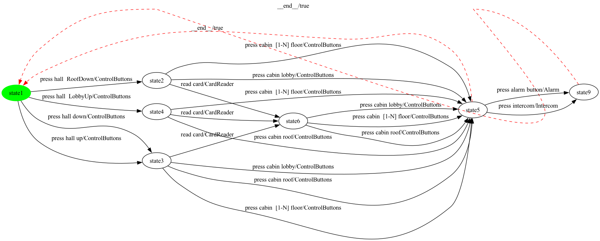

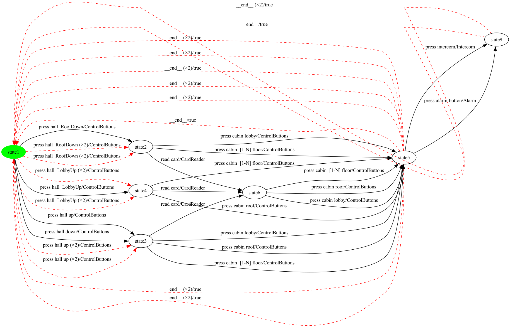

**All-transitions coverage on the repaired FTS:** **19/19 = 100.0%** (35 raw cycle step(s): 19 real, 10 `__end__`, 14 `__dup__`, 0 `__balance__`).

**Generated test cases** (10 trip(s) from initial back to initial, hidden synthetics removed):

- **test case 1**: `press hall RoofDown -> press cabin [1-N] floor -> press intercom`
- **test case 2**: `press hall RoofDown -> press cabin lobby -> press alarm button`
- **test case 3**: `press hall RoofDown -> read card -> press cabin lobby`
- **test case 4**: `press hall up -> read card -> press cabin [1-N] floor`
- **test case 5**: `press hall up -> press cabin lobby`
- **test case 6**: `press hall down -> press cabin roof`
- **test case 7**: `press hall up -> press cabin [1-N] floor`
- **test case 8**: `press hall LobbyUp -> press cabin roof`
- **test case 9**: `press hall LobbyUp -> press cabin [1-N] floor`
- **test case 10**: `press hall LobbyUp -> read card -> press cabin roof`

### Product 18

**Selected features:** selected = {Alarm, ControlButtons, ExecutiveFloor, MobileKey}

**Projected FTS:** 8 states, 23 transitions (20 real / 3 `__end__`).

**Repaired FTS (after `InitialSccFilter`):** 8 states, 23 transitions (20 real / 3 `__end__`).

**Balanced FTS:** 8 states, 43 transitions (20 real / 12 `__end__` / 20 `__dup__` / 0 `__balance__`).

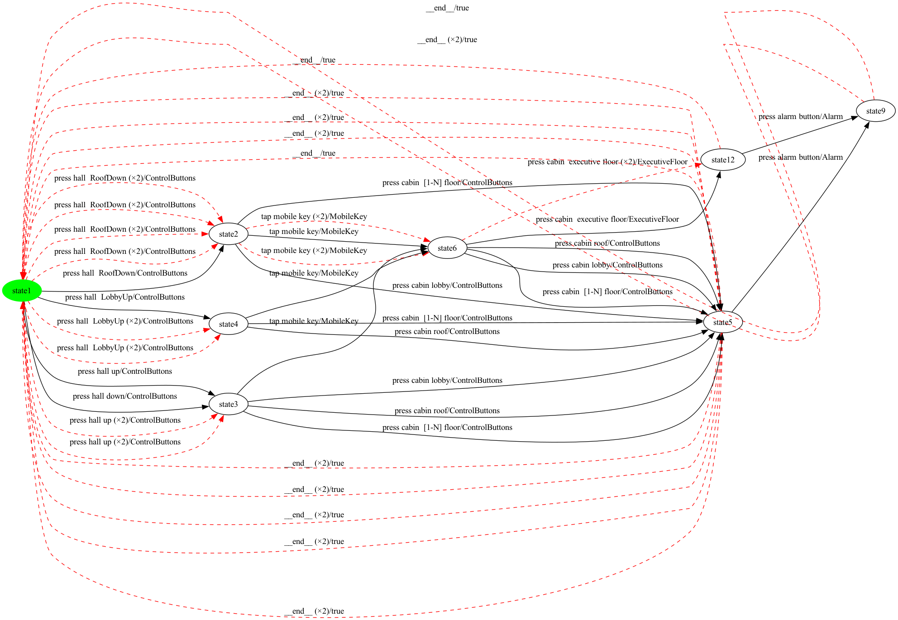

**All-transitions coverage on the repaired FTS:** **20/20 = 100.0%** (43 raw cycle step(s): 20 real, 12 `__end__`, 20 `__dup__`, 0 `__balance__`).

**Generated test cases** (12 trip(s) from initial back to initial, hidden synthetics removed):

- **test case 1**: `press hall RoofDown -> tap mobile key -> press cabin lobby -> press alarm button`
- **test case 2**: `press hall RoofDown -> tap mobile key -> press cabin [1-N] floor`
- **test case 3**: `press hall RoofDown -> tap mobile key -> press cabin roof`
- **test case 4**: `press hall RoofDown -> press cabin [1-N] floor`
- **test case 5**: `press hall RoofDown -> press cabin lobby`
- **test case 6**: `press hall up -> press cabin lobby`
- **test case 7**: `press hall down -> press cabin roof`
- **test case 8**: `press hall up -> press cabin [1-N] floor`
- **test case 9**: `press hall up -> tap mobile key -> press cabin executive floor -> press alarm button`
- **test case 10**: `press hall LobbyUp -> press cabin roof`
- **test case 11**: `press hall LobbyUp -> press cabin [1-N] floor`
- **test case 12**: `press hall LobbyUp -> tap mobile key -> press cabin executive floor`

### Product 19

**Selected features:** selected = {Alarm, ControlButtons, ManualDoorControl, MobileKey}

**Projected FTS:** 9 states, 26 transitions (22 real / 4 `__end__`).

**Repaired FTS (after `InitialSccFilter`):** 9 states, 26 transitions (22 real / 4 `__end__`).

**Balanced FTS:** 9 states, 38 transitions (22 real / 10 `__end__` / 12 `__dup__` / 0 `__balance__`).

**All-transitions coverage on the repaired FTS:** **22/22 = 100.0%** (38 raw cycle step(s): 22 real, 10 `__end__`, 12 `__dup__`, 0 `__balance__`).

**Generated test cases** (10 trip(s) from initial back to initial, hidden synthetics removed):

- **test case 1**: `press hall RoofDown -> press cabin lobby -> press alarm button`
- **test case 2**: `press hall RoofDown -> press cabin [1-N] floor -> press door open -> press door close`
- **test case 3**: `press hall RoofDown -> tap mobile key -> press cabin lobby -> press door close -> press door open`
- **test case 4**: `press hall up -> tap mobile key -> press cabin [1-N] floor`
- **test case 5**: `press hall up -> press cabin lobby`
- **test case 6**: `press hall down -> press cabin roof`
- **test case 7**: `press hall up -> press cabin [1-N] floor`
- **test case 8**: `press hall LobbyUp -> press cabin roof`
- **test case 9**: `press hall LobbyUp -> press cabin [1-N] floor`
- **test case 10**: `press hall LobbyUp -> tap mobile key -> press cabin roof`

### Product 20

**Selected features:** selected = {Alarm, ControlButtons, ExecutiveFloor, ManualDoorControl, MobileKey}

**Projected FTS:** 10 states, 31 transitions (26 real / 5 `__end__`).

**Repaired FTS (after `InitialSccFilter`):** 10 states, 31 transitions (26 real / 5 `__end__`).

**Balanced FTS:** 10 states, 57 transitions (26 real / 14 `__end__` / 26 `__dup__` / 0 `__balance__`).

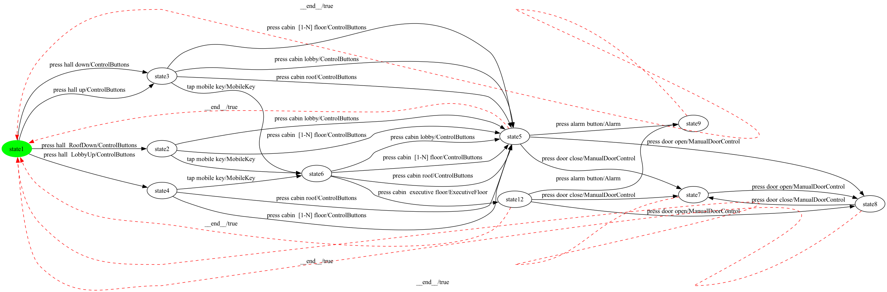

**All-transitions coverage on the repaired FTS:** **26/26 = 100.0%** (57 raw cycle step(s): 26 real, 14 `__end__`, 26 `__dup__`, 0 `__balance__`).

**Generated test cases** (14 trip(s) from initial back to initial, hidden synthetics removed):

- **test case 1**: `press hall RoofDown -> press cabin lobby -> press alarm button`
- **test case 2**: `press hall RoofDown -> press cabin [1-N] floor -> press door open -> press door close`
- **test case 3**: `press hall RoofDown -> tap mobile key -> press cabin lobby -> press door close`
- **test case 4**: `press hall RoofDown -> tap mobile key -> press cabin [1-N] floor`
- **test case 5**: `press hall RoofDown -> tap mobile key -> press cabin roof`
- **test case 6**: `press hall RoofDown -> tap mobile key -> press cabin executive floor -> press alarm button`
- **test case 7**: `press hall RoofDown -> tap mobile key -> press cabin executive floor -> press door close -> press door open`
- **test case 8**: `press hall up -> tap mobile key -> press cabin executive floor -> press door open`
- **test case 9**: `press hall up -> press cabin lobby`
- **test case 10**: `press hall down -> press cabin roof`
- **test case 11**: `press hall up -> press cabin [1-N] floor`
- **test case 12**: `press hall LobbyUp -> press cabin roof`
- **test case 13**: `press hall LobbyUp -> press cabin [1-N] floor`
- **test case 14**: `press hall LobbyUp -> tap mobile key -> press cabin executive floor`

### Product 21

**Selected features:** selected = {CardReader, ControlButtons, Intercom}

**Projected FTS:** 7 states, 20 transitions (18 real / 2 `__end__`).

**Repaired FTS (after `InitialSccFilter`):** 7 states, 20 transitions (18 real / 2 `__end__`).

**Balanced FTS:** 7 states, 34 transitions (18 real / 10 `__end__` / 14 `__dup__` / 0 `__balance__`).

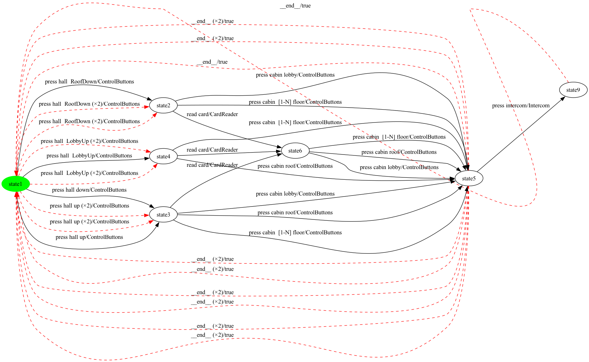

**All-transitions coverage on the repaired FTS:** **18/18 = 100.0%** (34 raw cycle step(s): 18 real, 10 `__end__`, 14 `__dup__`, 0 `__balance__`).

**Generated test cases** (10 trip(s) from initial back to initial, hidden synthetics removed):

- **test case 1**: `press hall RoofDown -> press cabin [1-N] floor -> press intercom`
- **test case 2**: `press hall RoofDown -> press cabin lobby`
- **test case 3**: `press hall RoofDown -> read card -> press cabin lobby`
- **test case 4**: `press hall up -> read card -> press cabin [1-N] floor`
- **test case 5**: `press hall up -> press cabin lobby`
- **test case 6**: `press hall down -> press cabin roof`
- **test case 7**: `press hall up -> press cabin [1-N] floor`
- **test case 8**: `press hall LobbyUp -> press cabin roof`
- **test case 9**: `press hall LobbyUp -> press cabin [1-N] floor`
- **test case 10**: `press hall LobbyUp -> read card -> press cabin roof`

### Product 22

**Selected features:** selected = {Alarm, ControlButtons, ExecutiveFloor, Intercom, PinPad}

**Projected FTS:** 8 states, 25 transitions (22 real / 3 `__end__`).

**Repaired FTS (after `InitialSccFilter`):** 8 states, 25 transitions (22 real / 3 `__end__`).

**Balanced FTS:** 8 states, 49 transitions (22 real / 13 `__end__` / 24 `__dup__` / 0 `__balance__`).

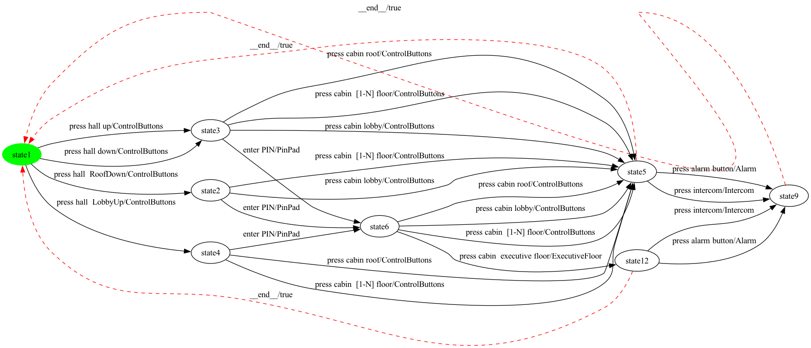

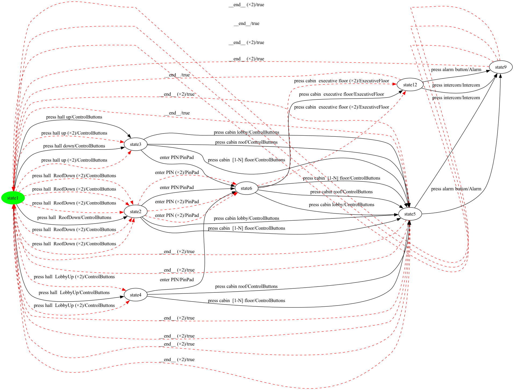

**All-transitions coverage on the repaired FTS:** **22/22 = 100.0%** (49 raw cycle step(s): 22 real, 13 `__end__`, 24 `__dup__`, 0 `__balance__`).

**Generated test cases** (13 trip(s) from initial back to initial, hidden synthetics removed):

- **test case 1**: `press hall RoofDown -> enter PIN -> press cabin lobby -> press intercom`
- **test case 2**: `press hall RoofDown -> enter PIN -> press cabin [1-N] floor -> press alarm button`
- **test case 3**: `press hall RoofDown -> enter PIN -> press cabin roof`
- **test case 4**: `press hall RoofDown -> enter PIN -> press cabin executive floor -> press intercom`
- **test case 5**: `press hall RoofDown -> press cabin lobby`
- **test case 6**: `press hall RoofDown -> press cabin [1-N] floor`
- **test case 7**: `press hall up -> press cabin lobby`
- **test case 8**: `press hall up -> press cabin roof`
- **test case 9**: `press hall up -> press cabin [1-N] floor`
- **test case 10**: `press hall down -> enter PIN -> press cabin executive floor -> press alarm button`
- **test case 11**: `press hall LobbyUp -> press cabin roof`
- **test case 12**: `press hall LobbyUp -> press cabin [1-N] floor`
- **test case 13**: `press hall LobbyUp -> enter PIN -> press cabin executive floor`

### Product 23

**Selected features:** selected = {Alarm, CardReader, ControlButtons, ExecutiveFloor, Intercom, ManualDoorControl}

**Projected FTS:** 10 states, 33 transitions (28 real / 5 `__end__`).

**Repaired FTS (after `InitialSccFilter`):** 10 states, 33 transitions (28 real / 5 `__end__`).

**Balanced FTS:** 10 states, 63 transitions (28 real / 15 `__end__` / 30 `__dup__` / 0 `__balance__`).

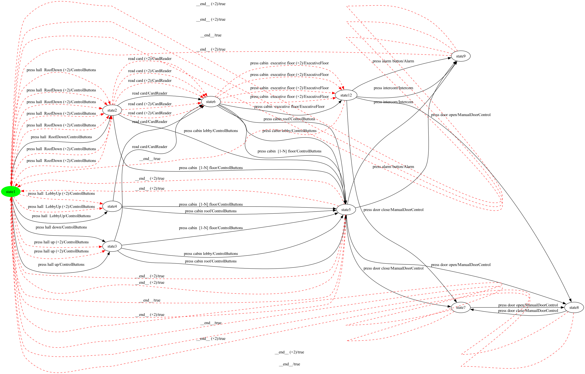

**All-transitions coverage on the repaired FTS:** **28/28 = 100.0%** (63 raw cycle step(s): 28 real, 15 `__end__`, 30 `__dup__`, 0 `__balance__`).

**Generated test cases** (15 trip(s) from initial back to initial, hidden synthetics removed):

- **test case 1**: `press hall RoofDown -> press cabin lobby -> press intercom`
- **test case 2**: `press hall RoofDown -> press cabin [1-N] floor -> press alarm button`
- **test case 3**: `press hall RoofDown -> read card -> press cabin lobby -> press door open -> press door close`
- **test case 4**: `press hall RoofDown -> read card -> press cabin [1-N] floor -> press door close`
- **test case 5**: `press hall RoofDown -> read card -> press cabin roof`
- **test case 6**: `press hall RoofDown -> read card -> press cabin executive floor -> press intercom`
- **test case 7**: `press hall RoofDown -> read card -> press cabin executive floor -> press alarm button`
- **test case 8**: `press hall RoofDown -> read card -> press cabin executive floor -> press door close -> press door open`
- **test case 9**: `press hall up -> press cabin lobby`
- **test case 10**: `press hall up -> press cabin roof`
- **test case 11**: `press hall up -> press cabin [1-N] floor`
- **test case 12**: `press hall down -> read card -> press cabin executive floor -> press door open`
- **test case 13**: `press hall LobbyUp -> press cabin roof`
- **test case 14**: `press hall LobbyUp -> press cabin [1-N] floor`
- **test case 15**: `press hall LobbyUp -> read card -> press cabin executive floor`

### Product 24

**Selected features:** selected = {Alarm, ControlButtons, ExecutiveFloor, Intercom, ManualDoorControl, MobileKey}

**Projected FTS:** 10 states, 33 transitions (28 real / 5 `__end__`).

**Repaired FTS (after `InitialSccFilter`):** 10 states, 33 transitions (28 real / 5 `__end__`).

**Balanced FTS:** 10 states, 63 transitions (28 real / 15 `__end__` / 30 `__dup__` / 0 `__balance__`).

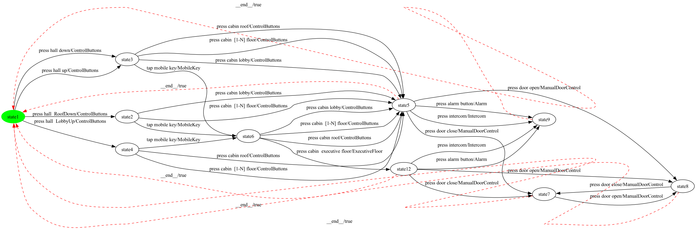

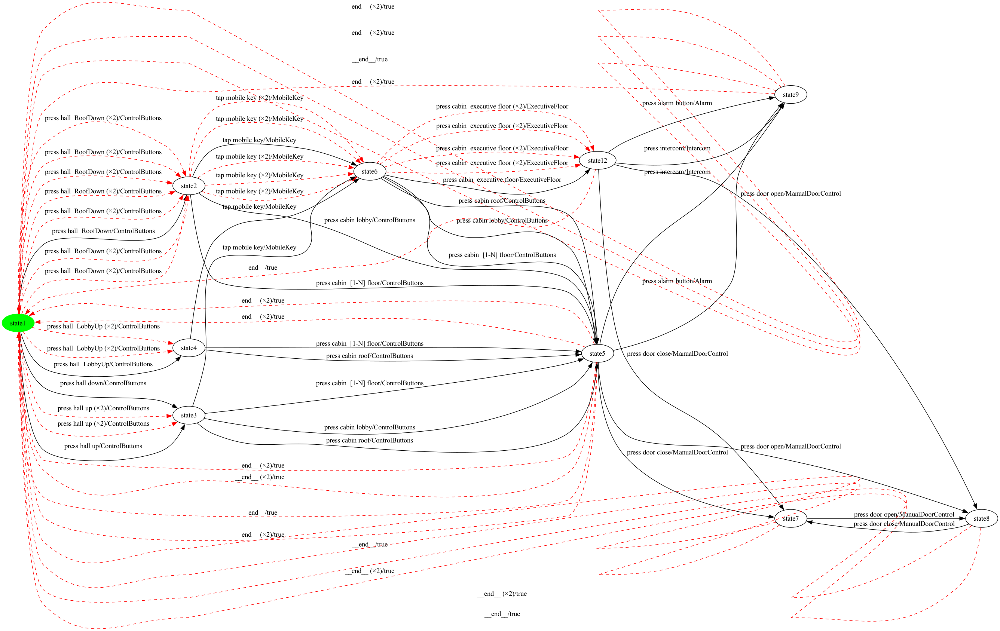

**All-transitions coverage on the repaired FTS:** **28/28 = 100.0%** (63 raw cycle step(s): 28 real, 15 `__end__`, 30 `__dup__`, 0 `__balance__`).

**Generated test cases** (15 trip(s) from initial back to initial, hidden synthetics removed):

- **test case 1**: `press hall RoofDown -> press cabin lobby -> press intercom`
- **test case 2**: `press hall RoofDown -> press cabin [1-N] floor -> press alarm button`
- **test case 3**: `press hall RoofDown -> tap mobile key -> press cabin lobby -> press door open -> press door close`
- **test case 4**: `press hall RoofDown -> tap mobile key -> press cabin [1-N] floor -> press door close`
- **test case 5**: `press hall RoofDown -> tap mobile key -> press cabin roof`
- **test case 6**: `press hall RoofDown -> tap mobile key -> press cabin executive floor -> press intercom`
- **test case 7**: `press hall RoofDown -> tap mobile key -> press cabin executive floor -> press alarm button`
- **test case 8**: `press hall RoofDown -> tap mobile key -> press cabin executive floor -> press door close -> press door open`
- **test case 9**: `press hall up -> tap mobile key -> press cabin executive floor -> press door open`
- **test case 10**: `press hall up -> press cabin lobby`
- **test case 11**: `press hall up -> press cabin roof`
- **test case 12**: `press hall down -> press cabin [1-N] floor`
- **test case 13**: `press hall LobbyUp -> press cabin roof`
- **test case 14**: `press hall LobbyUp -> press cabin [1-N] floor`
- **test case 15**: `press hall LobbyUp -> tap mobile key -> press cabin executive floor`

### Product 25

**Selected features:** selected = {Alarm, CardReader, ControlButtons, Intercom, ManualDoorControl}

**Projected FTS:** 9 states, 27 transitions (23 real / 4 `__end__`).

**Repaired FTS (after `InitialSccFilter`):** 9 states, 27 transitions (23 real / 4 `__end__`).

**Balanced FTS:** 9 states, 39 transitions (23 real / 10 `__end__` / 12 `__dup__` / 0 `__balance__`).

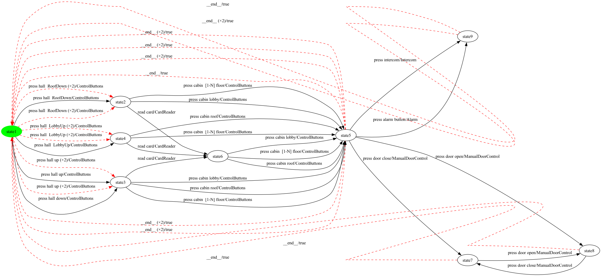

**All-transitions coverage on the repaired FTS:** **23/23 = 100.0%** (39 raw cycle step(s): 23 real, 10 `__end__`, 12 `__dup__`, 0 `__balance__`).

**Generated test cases** (10 trip(s) from initial back to initial, hidden synthetics removed):

- **test case 1**: `press hall RoofDown -> press cabin lobby -> press intercom`
- **test case 2**: `press hall RoofDown -> press cabin [1-N] floor -> press alarm button`
- **test case 3**: `press hall RoofDown -> read card -> press cabin lobby -> press door open -> press door close`
- **test case 4**: `press hall up -> press cabin lobby -> press door close -> press door open`
- **test case 5**: `press hall up -> press cabin roof`
- **test case 6**: `press hall down -> press cabin [1-N] floor`
- **test case 7**: `press hall up -> read card -> press cabin [1-N] floor`
- **test case 8**: `press hall LobbyUp -> press cabin roof`
- **test case 9**: `press hall LobbyUp -> press cabin [1-N] floor`
- **test case 10**: `press hall LobbyUp -> read card -> press cabin roof`

### Product 26

**Selected features:** selected = {CardReader, ControlButtons, ExecutiveFloor, Intercom, ManualDoorControl}

**Projected FTS:** 10 states, 31 transitions (26 real / 5 `__end__`).

**Repaired FTS (after `InitialSccFilter`):** 10 states, 31 transitions (26 real / 5 `__end__`).

**Balanced FTS:** 10 states, 57 transitions (26 real / 14 `__end__` / 26 `__dup__` / 0 `__balance__`).

**All-transitions coverage on the repaired FTS:** **26/26 = 100.0%** (57 raw cycle step(s): 26 real, 14 `__end__`, 26 `__dup__`, 0 `__balance__`).

**Generated test cases** (14 trip(s) from initial back to initial, hidden synthetics removed):

- **test case 1**: `press hall RoofDown -> press cabin lobby -> press intercom`
- **test case 2**: `press hall RoofDown -> press cabin [1-N] floor -> press door open -> press door close`
- **test case 3**: `press hall RoofDown -> read card -> press cabin lobby -> press door close`
- **test case 4**: `press hall RoofDown -> read card -> press cabin [1-N] floor`
- **test case 5**: `press hall RoofDown -> read card -> press cabin roof`
- **test case 6**: `press hall RoofDown -> read card -> press cabin executive floor -> press door close -> press door open`
- **test case 7**: `press hall RoofDown -> read card -> press cabin executive floor -> press door open`
- **test case 8**: `press hall up -> press cabin lobby`
- **test case 9**: `press hall up -> press cabin roof`
- **test case 10**: `press hall down -> press cabin [1-N] floor`
- **test case 11**: `press hall up -> read card -> press cabin executive floor -> press intercom`
- **test case 12**: `press hall LobbyUp -> press cabin roof`
- **test case 13**: `press hall LobbyUp -> press cabin [1-N] floor`
- **test case 14**: `press hall LobbyUp -> read card -> press cabin executive floor`

### Product 27

**Selected features:** selected = {Alarm, ControlButtons, Intercom, ManualDoorControl, MobileKey}

**Projected FTS:** 9 states, 27 transitions (23 real / 4 `__end__`).

**Repaired FTS (after `InitialSccFilter`):** 9 states, 27 transitions (23 real / 4 `__end__`).

**Balanced FTS:** 9 states, 39 transitions (23 real / 10 `__end__` / 12 `__dup__` / 0 `__balance__`).

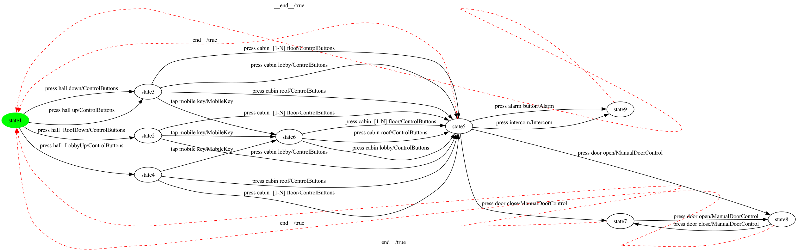

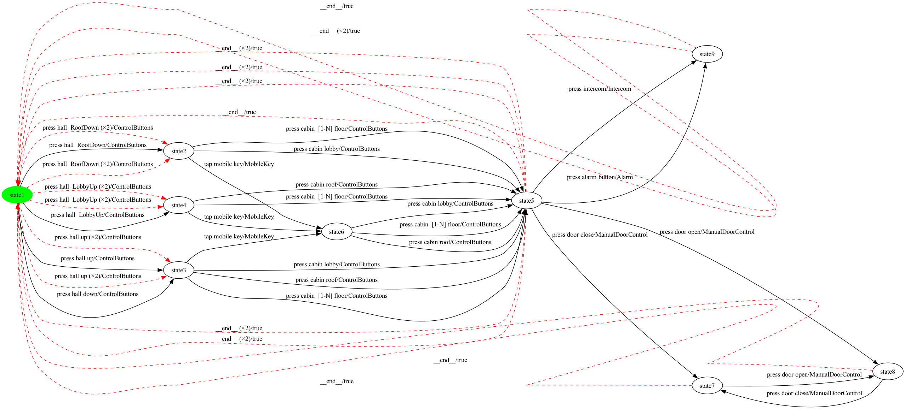

**All-transitions coverage on the repaired FTS:** **23/23 = 100.0%** (39 raw cycle step(s): 23 real, 10 `__end__`, 12 `__dup__`, 0 `__balance__`).

**Generated test cases** (10 trip(s) from initial back to initial, hidden synthetics removed):

- **test case 1**: `press hall RoofDown -> press cabin lobby -> press intercom`
- **test case 2**: `press hall RoofDown -> press cabin [1-N] floor -> press alarm button`
- **test case 3**: `press hall RoofDown -> tap mobile key -> press cabin lobby -> press door open -> press door close`
- **test case 4**: `press hall up -> tap mobile key -> press cabin [1-N] floor -> press door close -> press door open`
- **test case 5**: `press hall up -> press cabin lobby`
- **test case 6**: `press hall down -> press cabin roof`
- **test case 7**: `press hall up -> press cabin [1-N] floor`
- **test case 8**: `press hall LobbyUp -> press cabin roof`
- **test case 9**: `press hall LobbyUp -> press cabin [1-N] floor`
- **test case 10**: `press hall LobbyUp -> tap mobile key -> press cabin roof`

### Product 28

**Selected features:** selected = {Alarm, ControlButtons, FirefighterService, Intercom}

**Projected FTS:** 10 states, 25 transitions (21 real / 4 `__end__`).

**Repaired FTS (after `InitialSccFilter`):** 10 states, 25 transitions (21 real / 4 `__end__`).

**Balanced FTS:** 10 states, 44 transitions (21 real / 9 `__end__` / 19 `__dup__` / 0 `__balance__`).

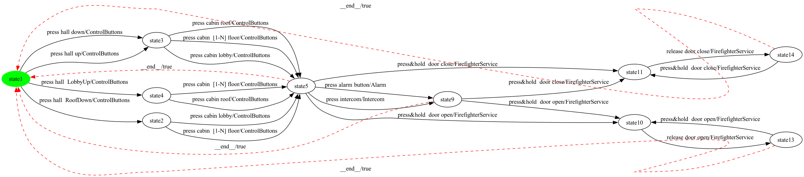

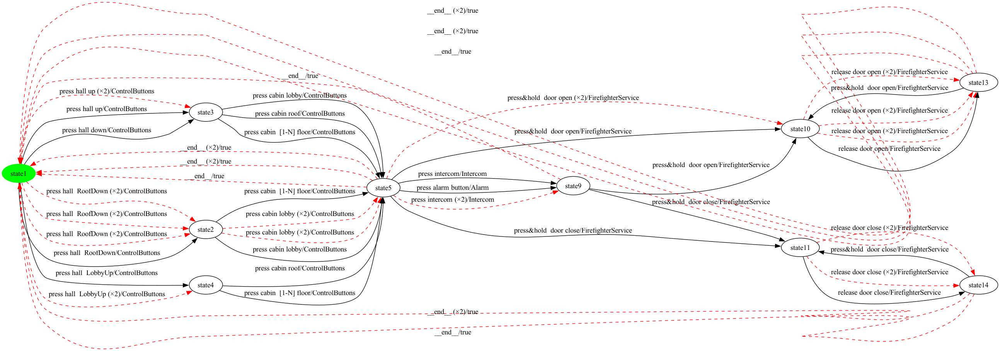

**All-transitions coverage on the repaired FTS:** **21/21 = 100.0%** (44 raw cycle step(s): 21 real, 9 `__end__`, 19 `__dup__`, 0 `__balance__`).

**Generated test cases** (9 trip(s) from initial back to initial, hidden synthetics removed):

- **test case 1**: `press hall RoofDown -> press cabin lobby -> press intercom -> press&hold door open -> release door open`
- **test case 2**: `press hall RoofDown -> press cabin lobby -> press intercom -> press&hold door close -> release door close`
- **test case 3**: `press hall RoofDown -> press cabin lobby -> press alarm button`
- **test case 4**: `press hall RoofDown -> press cabin [1-N] floor -> press&hold door open -> release door open`
- **test case 5**: `press hall up -> press cabin lobby -> press&hold door open -> release door open -> press&hold door open -> release door open`
- **test case 6**: `press hall down -> press cabin roof -> press&hold door close -> release door close -> press&hold door close -> release door close`
- **test case 7**: `press hall up -> press cabin [1-N] floor`
- **test case 8**: `press hall LobbyUp -> press cabin roof`
- **test case 9**: `press hall LobbyUp -> press cabin [1-N] floor`

### Product 29

**Selected features:** selected = {CardReader, ControlButtons, ExecutiveFloor, Intercom}

**Projected FTS:** 8 states, 23 transitions (20 real / 3 `__end__`).

**Repaired FTS (after `InitialSccFilter`):** 8 states, 23 transitions (20 real / 3 `__end__`).

**Balanced FTS:** 8 states, 43 transitions (20 real / 12 `__end__` / 20 `__dup__` / 0 `__balance__`).

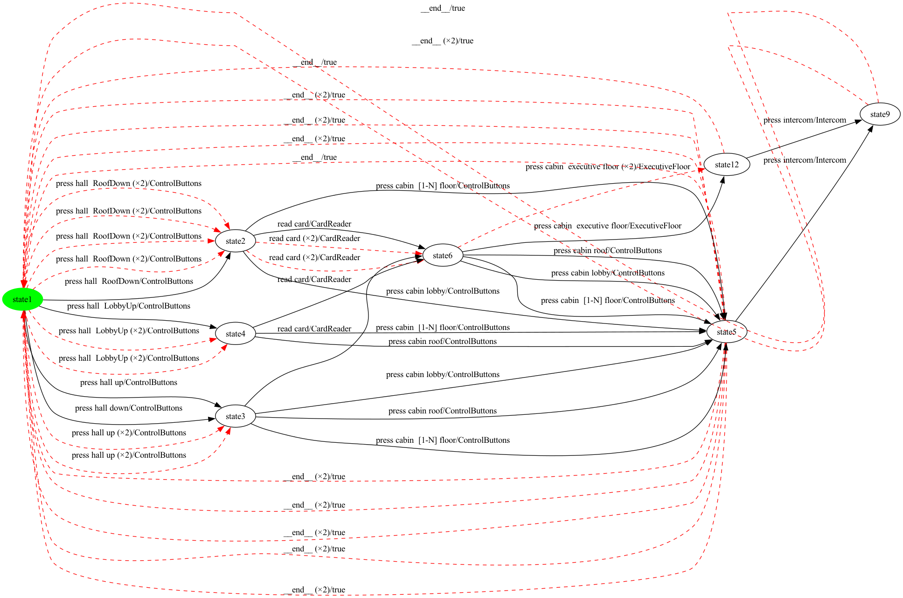

**All-transitions coverage on the repaired FTS:** **20/20 = 100.0%** (43 raw cycle step(s): 20 real, 12 `__end__`, 20 `__dup__`, 0 `__balance__`).

**Generated test cases** (12 trip(s) from initial back to initial, hidden synthetics removed):

- **test case 1**: `press hall RoofDown -> press cabin [1-N] floor -> press intercom`
- **test case 2**: `press hall RoofDown -> press cabin lobby`
- **test case 3**: `press hall RoofDown -> read card -> press cabin lobby`
- **test case 4**: `press hall RoofDown -> read card -> press cabin [1-N] floor`
- **test case 5**: `press hall RoofDown -> read card -> press cabin roof`
- **test case 6**: `press hall up -> read card -> press cabin executive floor -> press intercom`
- **test case 7**: `press hall down -> press cabin lobby`
- **test case 8**: `press hall up -> press cabin roof`
- **test case 9**: `press hall up -> press cabin [1-N] floor`
- **test case 10**: `press hall LobbyUp -> press cabin roof`
- **test case 11**: `press hall LobbyUp -> press cabin [1-N] floor`
- **test case 12**: `press hall LobbyUp -> read card -> press cabin executive floor`

### Product 30

**Selected features:** selected = {ControlButtons, Intercom, MobileKey}

**Projected FTS:** 7 states, 20 transitions (18 real / 2 `__end__`).

**Repaired FTS (after `InitialSccFilter`):** 7 states, 20 transitions (18 real / 2 `__end__`).

**Balanced FTS:** 7 states, 34 transitions (18 real / 10 `__end__` / 14 `__dup__` / 0 `__balance__`).

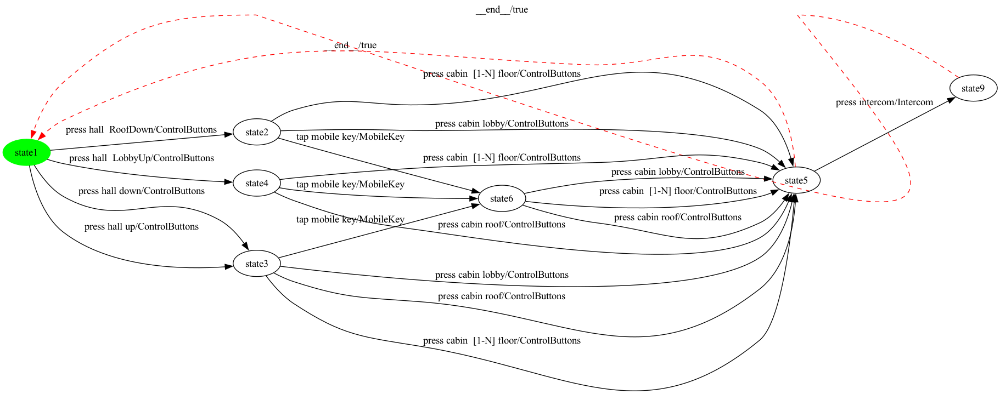

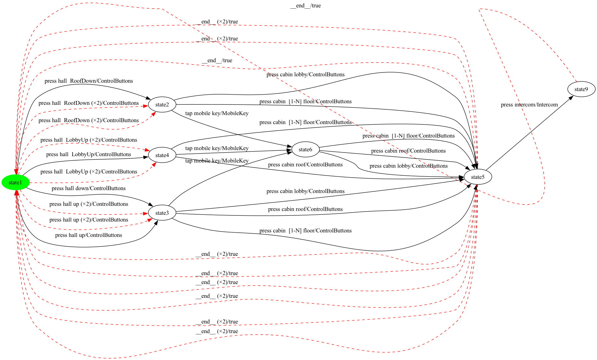

**All-transitions coverage on the repaired FTS:** **18/18 = 100.0%** (34 raw cycle step(s): 18 real, 10 `__end__`, 14 `__dup__`, 0 `__balance__`).

**Generated test cases** (10 trip(s) from initial back to initial, hidden synthetics removed):

- **test case 1**: `press hall RoofDown -> tap mobile key -> press cabin lobby -> press intercom`
- **test case 2**: `press hall RoofDown -> press cabin [1-N] floor`
- **test case 3**: `press hall RoofDown -> press cabin lobby`
- **test case 4**: `press hall up -> press cabin lobby`
- **test case 5**: `press hall up -> press cabin roof`
- **test case 6**: `press hall down -> press cabin [1-N] floor`
- **test case 7**: `press hall up -> tap mobile key -> press cabin [1-N] floor`
- **test case 8**: `press hall LobbyUp -> press cabin roof`
- **test case 9**: `press hall LobbyUp -> press cabin [1-N] floor`
- **test case 10**: `press hall LobbyUp -> tap mobile key -> press cabin roof`

### Product 31

**Selected features:** selected = {Alarm, CardReader, ControlButtons, ManualDoorControl}

**Projected FTS:** 9 states, 26 transitions (22 real / 4 `__end__`).

**Repaired FTS (after `InitialSccFilter`):** 9 states, 26 transitions (22 real / 4 `__end__`).

**Balanced FTS:** 9 states, 38 transitions (22 real / 10 `__end__` / 12 `__dup__` / 0 `__balance__`).

**All-transitions coverage on the repaired FTS:** **22/22 = 100.0%** (38 raw cycle step(s): 22 real, 10 `__end__`, 12 `__dup__`, 0 `__balance__`).

**Generated test cases** (10 trip(s) from initial back to initial, hidden synthetics removed):

- **test case 1**: `press hall RoofDown -> press cabin lobby -> press alarm button`
- **test case 2**: `press hall RoofDown -> press cabin [1-N] floor -> press door open -> press door close`
- **test case 3**: `press hall RoofDown -> read card -> press cabin lobby -> press door close -> press door open`
- **test case 4**: `press hall up -> press cabin lobby`
- **test case 5**: `press hall up -> press cabin roof`
- **test case 6**: `press hall down -> press cabin [1-N] floor`
- **test case 7**: `press hall up -> read card -> press cabin [1-N] floor`
- **test case 8**: `press hall LobbyUp -> press cabin roof`
- **test case 9**: `press hall LobbyUp -> press cabin [1-N] floor`
- **test case 10**: `press hall LobbyUp -> read card -> press cabin roof`

### Product 32

**Selected features:** selected = {ControlButtons, Intercom, ManualDoorControl, PinPad}

**Projected FTS:** 9 states, 26 transitions (22 real / 4 `__end__`).

**Repaired FTS (after `InitialSccFilter`):** 9 states, 26 transitions (22 real / 4 `__end__`).

**Balanced FTS:** 9 states, 38 transitions (22 real / 10 `__end__` / 12 `__dup__` / 0 `__balance__`).

**All-transitions coverage on the repaired FTS:** **22/22 = 100.0%** (38 raw cycle step(s): 22 real, 10 `__end__`, 12 `__dup__`, 0 `__balance__`).

**Generated test cases** (10 trip(s) from initial back to initial, hidden synthetics removed):

- **test case 1**: `press hall RoofDown -> enter PIN -> press cabin lobby -> press intercom`
- **test case 2**: `press hall RoofDown -> press cabin lobby -> press door open -> press door close`
- **test case 3**: `press hall RoofDown -> press cabin [1-N] floor -> press door close -> press door open`
- **test case 4**: `press hall up -> press cabin lobby`
- **test case 5**: `press hall up -> press cabin roof`
- **test case 6**: `press hall down -> press cabin [1-N] floor`
- **test case 7**: `press hall up -> enter PIN -> press cabin [1-N] floor`
- **test case 8**: `press hall LobbyUp -> press cabin roof`
- **test case 9**: `press hall LobbyUp -> press cabin [1-N] floor`
- **test case 10**: `press hall LobbyUp -> enter PIN -> press cabin roof`

### Product 33

**Selected features:** selected = {ControlButtons, ExecutiveFloor, Intercom, ManualDoorControl, MobileKey}

**Projected FTS:** 10 states, 31 transitions (26 real / 5 `__end__`).

**Repaired FTS (after `InitialSccFilter`):** 10 states, 31 transitions (26 real / 5 `__end__`).

**Balanced FTS:** 10 states, 57 transitions (26 real / 14 `__end__` / 26 `__dup__` / 0 `__balance__`).

**All-transitions coverage on the repaired FTS:** **26/26 = 100.0%** (57 raw cycle step(s): 26 real, 14 `__end__`, 26 `__dup__`, 0 `__balance__`).

**Generated test cases** (14 trip(s) from initial back to initial, hidden synthetics removed):

- **test case 1**: `press hall RoofDown -> press cabin lobby -> press intercom`
- **test case 2**: `press hall RoofDown -> press cabin [1-N] floor -> press door open -> press door close`
- **test case 3**: `press hall RoofDown -> tap mobile key -> press cabin lobby -> press door close`
- **test case 4**: `press hall RoofDown -> tap mobile key -> press cabin [1-N] floor`
- **test case 5**: `press hall RoofDown -> tap mobile key -> press cabin roof`
- **test case 6**: `press hall RoofDown -> tap mobile key -> press cabin executive floor -> press door close -> press door open`
- **test case 7**: `press hall RoofDown -> tap mobile key -> press cabin executive floor -> press door open`
- **test case 8**: `press hall up -> tap mobile key -> press cabin executive floor -> press intercom`
- **test case 9**: `press hall up -> press cabin lobby`
- **test case 10**: `press hall down -> press cabin roof`
- **test case 11**: `press hall up -> press cabin [1-N] floor`
- **test case 12**: `press hall LobbyUp -> press cabin roof`
- **test case 13**: `press hall LobbyUp -> press cabin [1-N] floor`
- **test case 14**: `press hall LobbyUp -> tap mobile key -> press cabin executive floor`

### Product 34

**Selected features:** selected = {Alarm, CardReader, ControlButtons, ExecutiveFloor, ManualDoorControl}

**Projected FTS:** 10 states, 31 transitions (26 real / 5 `__end__`).

**Repaired FTS (after `InitialSccFilter`):** 10 states, 31 transitions (26 real / 5 `__end__`).

**Balanced FTS:** 10 states, 57 transitions (26 real / 14 `__end__` / 26 `__dup__` / 0 `__balance__`).

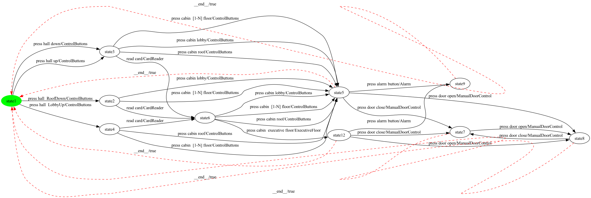

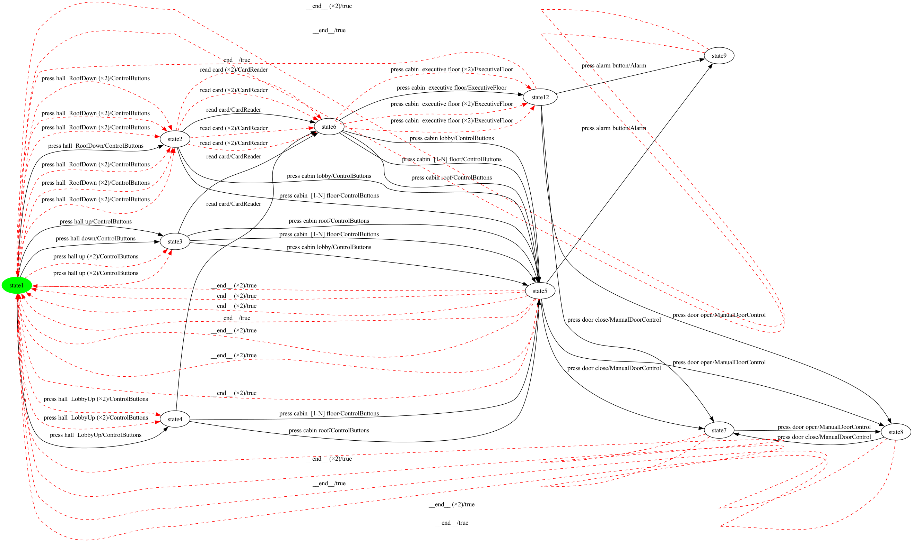

**All-transitions coverage on the repaired FTS:** **26/26 = 100.0%** (57 raw cycle step(s): 26 real, 14 `__end__`, 26 `__dup__`, 0 `__balance__`).

**Generated test cases** (14 trip(s) from initial back to initial, hidden synthetics removed):

- **test case 1**: `press hall RoofDown -> press cabin lobby -> press alarm button`
- **test case 2**: `press hall RoofDown -> press cabin [1-N] floor -> press door open -> press door close`
- **test case 3**: `press hall RoofDown -> read card -> press cabin lobby -> press door close`
- **test case 4**: `press hall RoofDown -> read card -> press cabin [1-N] floor`
- **test case 5**: `press hall RoofDown -> read card -> press cabin roof`
- **test case 6**: `press hall RoofDown -> read card -> press cabin executive floor -> press alarm button`
- **test case 7**: `press hall RoofDown -> read card -> press cabin executive floor -> press door close -> press door open`
- **test case 8**: `press hall up -> press cabin lobby`
- **test case 9**: `press hall up -> press cabin roof`
- **test case 10**: `press hall down -> press cabin [1-N] floor`
- **test case 11**: `press hall up -> read card -> press cabin executive floor -> press door open`
- **test case 12**: `press hall LobbyUp -> press cabin roof`
- **test case 13**: `press hall LobbyUp -> press cabin [1-N] floor`
- **test case 14**: `press hall LobbyUp -> read card -> press cabin executive floor`

### Product 35

**Selected features:** selected = {Alarm, ControlButtons, Intercom, MobileKey}

**Projected FTS:** 7 states, 21 transitions (19 real / 2 `__end__`).

**Repaired FTS (after `InitialSccFilter`):** 7 states, 21 transitions (19 real / 2 `__end__`).

**Balanced FTS:** 7 states, 35 transitions (19 real / 10 `__end__` / 14 `__dup__` / 0 `__balance__`).

**All-transitions coverage on the repaired FTS:** **19/19 = 100.0%** (35 raw cycle step(s): 19 real, 10 `__end__`, 14 `__dup__`, 0 `__balance__`).

**Generated test cases** (10 trip(s) from initial back to initial, hidden synthetics removed):

- **test case 1**: `press hall RoofDown -> tap mobile key -> press cabin lobby -> press intercom`
- **test case 2**: `press hall RoofDown -> press cabin [1-N] floor -> press alarm button`
- **test case 3**: `press hall RoofDown -> press cabin lobby`
- **test case 4**: `press hall up -> press cabin lobby`
- **test case 5**: `press hall up -> press cabin roof`
- **test case 6**: `press hall down -> press cabin [1-N] floor`
- **test case 7**: `press hall up -> tap mobile key -> press cabin [1-N] floor`
- **test case 8**: `press hall LobbyUp -> press cabin roof`
- **test case 9**: `press hall LobbyUp -> press cabin [1-N] floor`
- **test case 10**: `press hall LobbyUp -> tap mobile key -> press cabin roof`

### Product 36

**Selected features:** selected = {Alarm, ControlButtons, Intercom, PinPad}

**Projected FTS:** 7 states, 21 transitions (19 real / 2 `__end__`).

**Repaired FTS (after `InitialSccFilter`):** 7 states, 21 transitions (19 real / 2 `__end__`).

**Balanced FTS:** 7 states, 35 transitions (19 real / 10 `__end__` / 14 `__dup__` / 0 `__balance__`).

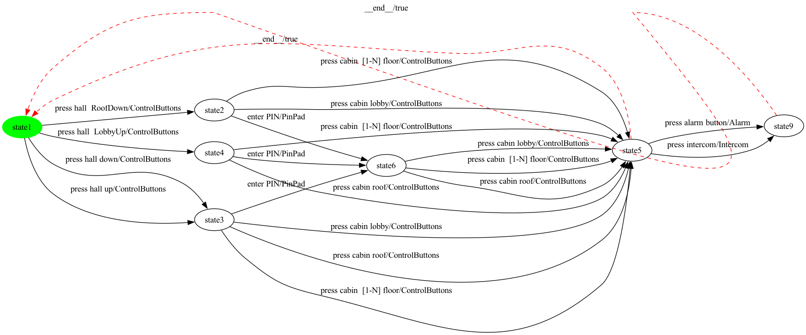

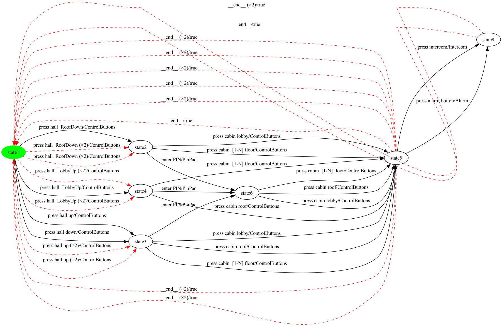

**All-transitions coverage on the repaired FTS:** **19/19 = 100.0%** (35 raw cycle step(s): 19 real, 10 `__end__`, 14 `__dup__`, 0 `__balance__`).

**Generated test cases** (10 trip(s) from initial back to initial, hidden synthetics removed):

- **test case 1**: `press hall RoofDown -> press cabin [1-N] floor -> press intercom`
- **test case 2**: `press hall RoofDown -> press cabin lobby -> press alarm button`
- **test case 3**: `press hall RoofDown -> enter PIN -> press cabin lobby`
- **test case 4**: `press hall up -> enter PIN -> press cabin [1-N] floor`
- **test case 5**: `press hall up -> press cabin lobby`
- **test case 6**: `press hall down -> press cabin roof`
- **test case 7**: `press hall up -> press cabin [1-N] floor`
- **test case 8**: `press hall LobbyUp -> press cabin roof`
- **test case 9**: `press hall LobbyUp -> press cabin [1-N] floor`
- **test case 10**: `press hall LobbyUp -> enter PIN -> press cabin roof`

### Product 37

**Selected features:** selected = {ControlButtons, ExecutiveFloor, Intercom, MobileKey}

**Projected FTS:** 8 states, 23 transitions (20 real / 3 `__end__`).

**Repaired FTS (after `InitialSccFilter`):** 8 states, 23 transitions (20 real / 3 `__end__`).

**Balanced FTS:** 8 states, 43 transitions (20 real / 12 `__end__` / 20 `__dup__` / 0 `__balance__`).

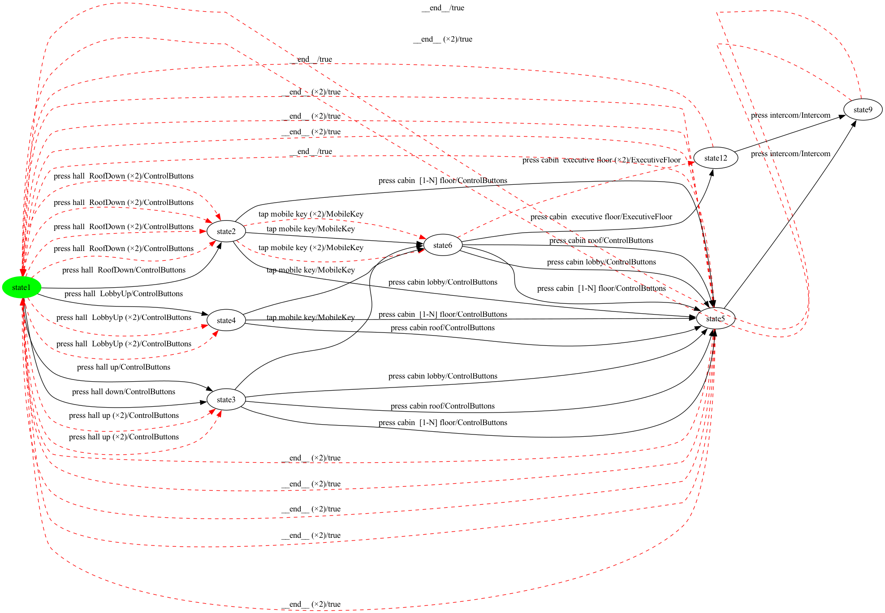

**All-transitions coverage on the repaired FTS:** **20/20 = 100.0%** (43 raw cycle step(s): 20 real, 12 `__end__`, 20 `__dup__`, 0 `__balance__`).

**Generated test cases** (12 trip(s) from initial back to initial, hidden synthetics removed):

- **test case 1**: `press hall RoofDown -> tap mobile key -> press cabin lobby -> press intercom`
- **test case 2**: `press hall RoofDown -> tap mobile key -> press cabin [1-N] floor`
- **test case 3**: `press hall RoofDown -> tap mobile key -> press cabin roof`
- **test case 4**: `press hall RoofDown -> press cabin [1-N] floor`
- **test case 5**: `press hall RoofDown -> press cabin lobby`
- **test case 6**: `press hall up -> press cabin lobby`
- **test case 7**: `press hall down -> press cabin roof`
- **test case 8**: `press hall up -> press cabin [1-N] floor`
- **test case 9**: `press hall up -> tap mobile key -> press cabin executive floor -> press intercom`
- **test case 10**: `press hall LobbyUp -> press cabin roof`
- **test case 11**: `press hall LobbyUp -> press cabin [1-N] floor`
- **test case 12**: `press hall LobbyUp -> tap mobile key -> press cabin executive floor`

### Product 38

**Selected features:** selected = {Alarm, ControlButtons, PinPad}

**Projected FTS:** 7 states, 20 transitions (18 real / 2 `__end__`).

**Repaired FTS (after `InitialSccFilter`):** 7 states, 20 transitions (18 real / 2 `__end__`).

**Balanced FTS:** 7 states, 34 transitions (18 real / 10 `__end__` / 14 `__dup__` / 0 `__balance__`).

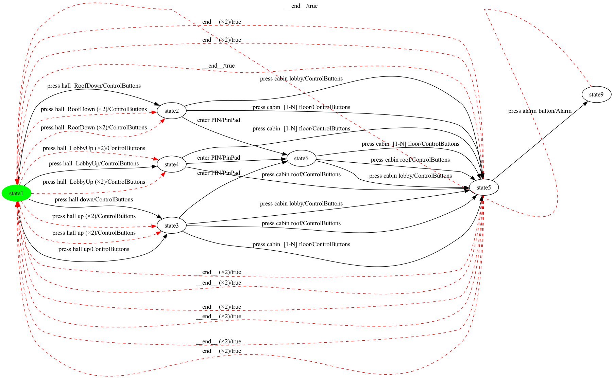

**All-transitions coverage on the repaired FTS:** **18/18 = 100.0%** (34 raw cycle step(s): 18 real, 10 `__end__`, 14 `__dup__`, 0 `__balance__`).

**Generated test cases** (10 trip(s) from initial back to initial, hidden synthetics removed):

- **test case 1**: `press hall RoofDown -> press cabin [1-N] floor -> press alarm button`
- **test case 2**: `press hall RoofDown -> press cabin lobby`
- **test case 3**: `press hall RoofDown -> enter PIN -> press cabin lobby`
- **test case 4**: `press hall up -> enter PIN -> press cabin [1-N] floor`
- **test case 5**: `press hall up -> press cabin lobby`
- **test case 6**: `press hall down -> press cabin roof`
- **test case 7**: `press hall up -> press cabin [1-N] floor`
- **test case 8**: `press hall LobbyUp -> press cabin roof`
- **test case 9**: `press hall LobbyUp -> press cabin [1-N] floor`
- **test case 10**: `press hall LobbyUp -> enter PIN -> press cabin roof`

### Product 39

**Selected features:** selected = {ControlButtons, Intercom, PinPad}

**Projected FTS:** 7 states, 20 transitions (18 real / 2 `__end__`).

**Repaired FTS (after `InitialSccFilter`):** 7 states, 20 transitions (18 real / 2 `__end__`).

**Balanced FTS:** 7 states, 34 transitions (18 real / 10 `__end__` / 14 `__dup__` / 0 `__balance__`).

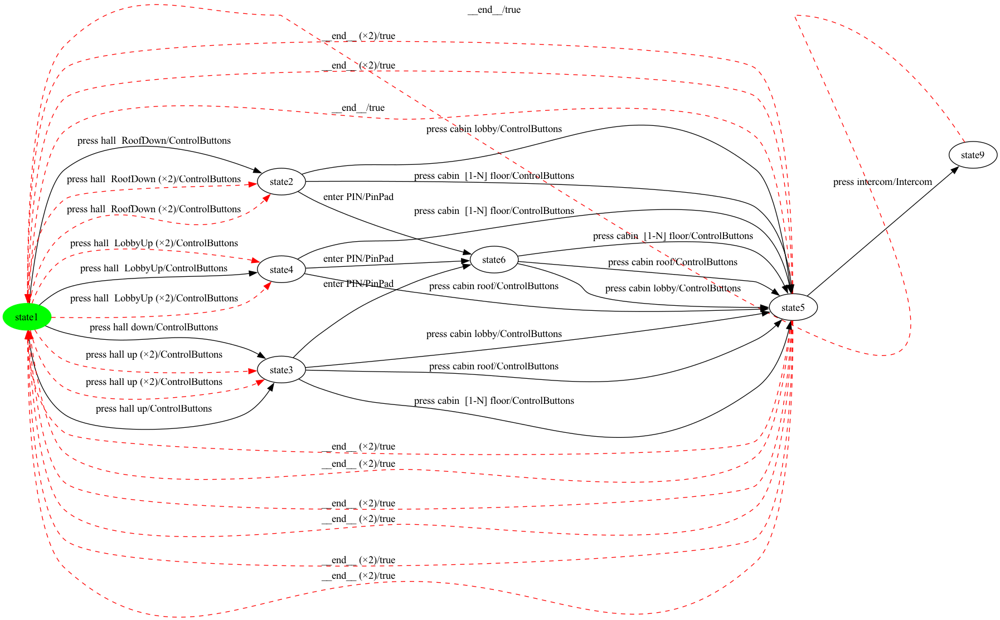

**All-transitions coverage on the repaired FTS:** **18/18 = 100.0%** (34 raw cycle step(s): 18 real, 10 `__end__`, 14 `__dup__`, 0 `__balance__`).

**Generated test cases** (10 trip(s) from initial back to initial, hidden synthetics removed):

- **test case 1**: `press hall RoofDown -> press cabin [1-N] floor -> press intercom`
- **test case 2**: `press hall RoofDown -> press cabin lobby`
- **test case 3**: `press hall RoofDown -> enter PIN -> press cabin lobby`
- **test case 4**: `press hall up -> enter PIN -> press cabin [1-N] floor`
- **test case 5**: `press hall up -> press cabin lobby`
- **test case 6**: `press hall down -> press cabin roof`
- **test case 7**: `press hall up -> press cabin [1-N] floor`
- **test case 8**: `press hall LobbyUp -> press cabin roof`
- **test case 9**: `press hall LobbyUp -> press cabin [1-N] floor`
- **test case 10**: `press hall LobbyUp -> enter PIN -> press cabin roof`

### Product 40

**Selected features:** selected = {Alarm, ControlButtons, ManualDoorControl, PinPad}

**Projected FTS:** 9 states, 26 transitions (22 real / 4 `__end__`).

**Repaired FTS (after `InitialSccFilter`):** 9 states, 26 transitions (22 real / 4 `__end__`).

**Balanced FTS:** 9 states, 38 transitions (22 real / 10 `__end__` / 12 `__dup__` / 0 `__balance__`).

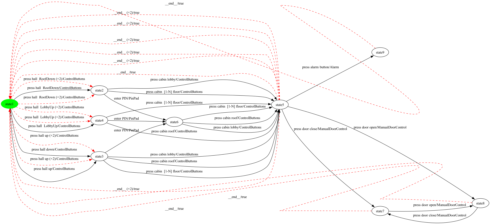

**All-transitions coverage on the repaired FTS:** **22/22 = 100.0%** (38 raw cycle step(s): 22 real, 10 `__end__`, 12 `__dup__`, 0 `__balance__`).

**Generated test cases** (10 trip(s) from initial back to initial, hidden synthetics removed):

- **test case 1**: `press hall RoofDown -> enter PIN -> press cabin lobby -> press alarm button`
- **test case 2**: `press hall RoofDown -> press cabin lobby -> press door open -> press door close`
- **test case 3**: `press hall RoofDown -> press cabin [1-N] floor -> press door close -> press door open`
- **test case 4**: `press hall up -> press cabin lobby`
- **test case 5**: `press hall up -> press cabin roof`
- **test case 6**: `press hall down -> press cabin [1-N] floor`
- **test case 7**: `press hall up -> enter PIN -> press cabin [1-N] floor`
- **test case 8**: `press hall LobbyUp -> press cabin roof`
- **test case 9**: `press hall LobbyUp -> press cabin [1-N] floor`
- **test case 10**: `press hall LobbyUp -> enter PIN -> press cabin roof`

### Product 41

**Selected features:** selected = {Alarm, ControlButtons, ExecutiveFloor, Intercom, ManualDoorControl, PinPad}

**Projected FTS:** 10 states, 33 transitions (28 real / 5 `__end__`).

**Repaired FTS (after `InitialSccFilter`):** 10 states, 33 transitions (28 real / 5 `__end__`).

**Balanced FTS:** 10 states, 63 transitions (28 real / 15 `__end__` / 30 `__dup__` / 0 `__balance__`).

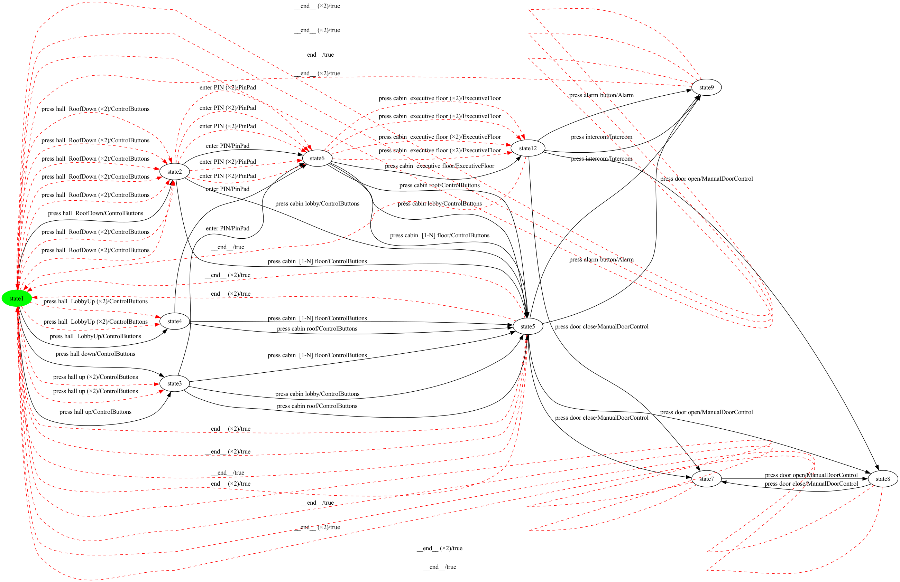

**All-transitions coverage on the repaired FTS:** **28/28 = 100.0%** (63 raw cycle step(s): 28 real, 15 `__end__`, 30 `__dup__`, 0 `__balance__`).

**Generated test cases** (15 trip(s) from initial back to initial, hidden synthetics removed):

- **test case 1**: `press hall RoofDown -> enter PIN -> press cabin lobby -> press intercom`
- **test case 2**: `press hall RoofDown -> enter PIN -> press cabin [1-N] floor -> press alarm button`
- **test case 3**: `press hall RoofDown -> enter PIN -> press cabin roof -> press door open -> press door close`
- **test case 4**: `press hall RoofDown -> enter PIN -> press cabin executive floor -> press intercom`
- **test case 5**: `press hall RoofDown -> enter PIN -> press cabin executive floor -> press alarm button`
- **test case 6**: `press hall RoofDown -> enter PIN -> press cabin executive floor -> press door close`
- **test case 7**: `press hall RoofDown -> press cabin lobby -> press door close -> press door open`
- **test case 8**: `press hall RoofDown -> press cabin [1-N] floor`
- **test case 9**: `press hall up -> press cabin lobby`
- **test case 10**: `press hall up -> press cabin roof`
- **test case 11**: `press hall up -> press cabin [1-N] floor`
- **test case 12**: `press hall down -> enter PIN -> press cabin executive floor -> press door open`
- **test case 13**: `press hall LobbyUp -> press cabin roof`
- **test case 14**: `press hall LobbyUp -> press cabin [1-N] floor`
- **test case 15**: `press hall LobbyUp -> enter PIN -> press cabin executive floor`

### Product 42

**Selected features:** selected = {Alarm, ControlButtons, Intercom, ManualDoorControl, PinPad}

**Projected FTS:** 9 states, 27 transitions (23 real / 4 `__end__`).

**Repaired FTS (after `InitialSccFilter`):** 9 states, 27 transitions (23 real / 4 `__end__`).

**Balanced FTS:** 9 states, 39 transitions (23 real / 10 `__end__` / 12 `__dup__` / 0 `__balance__`).

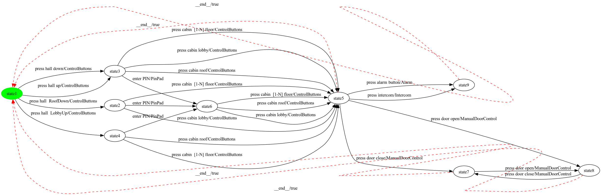

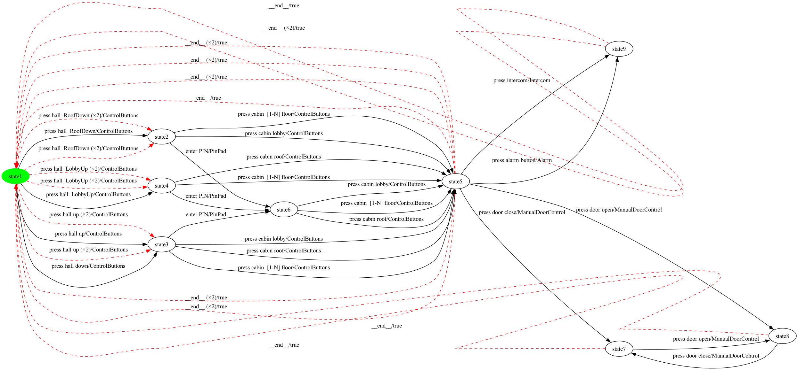

**All-transitions coverage on the repaired FTS:** **23/23 = 100.0%** (39 raw cycle step(s): 23 real, 10 `__end__`, 12 `__dup__`, 0 `__balance__`).

**Generated test cases** (10 trip(s) from initial back to initial, hidden synthetics removed):

- **test case 1**: `press hall RoofDown -> enter PIN -> press cabin lobby -> press intercom`
- **test case 2**: `press hall RoofDown -> press cabin lobby -> press alarm button`
- **test case 3**: `press hall RoofDown -> press cabin [1-N] floor -> press door open -> press door close`
- **test case 4**: `press hall up -> press cabin lobby -> press door close -> press door open`
- **test case 5**: `press hall up -> press cabin roof`
- **test case 6**: `press hall down -> press cabin [1-N] floor`
- **test case 7**: `press hall up -> enter PIN -> press cabin [1-N] floor`
- **test case 8**: `press hall LobbyUp -> press cabin roof`
- **test case 9**: `press hall LobbyUp -> press cabin [1-N] floor`
- **test case 10**: `press hall LobbyUp -> enter PIN -> press cabin roof`

---

Total products: 42.
