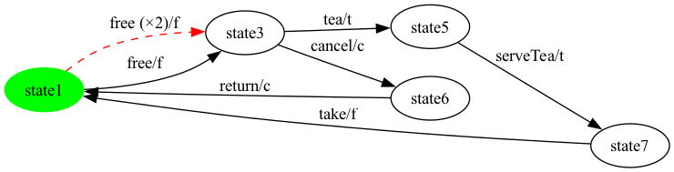
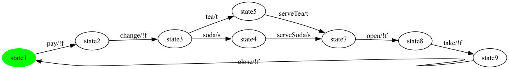
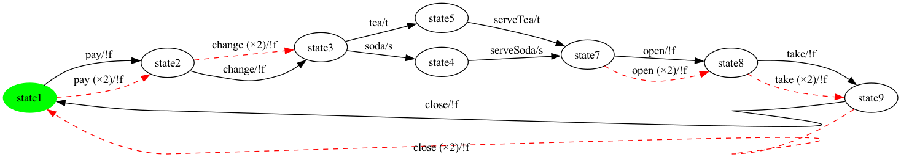
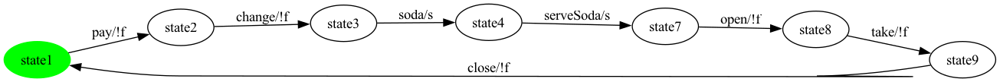
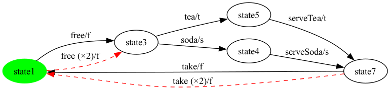
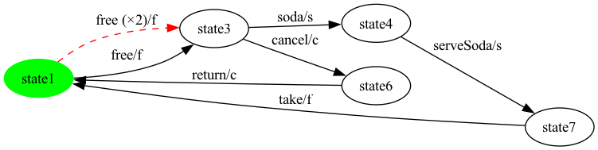
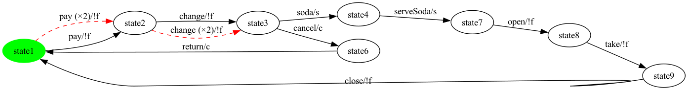
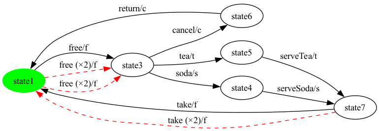
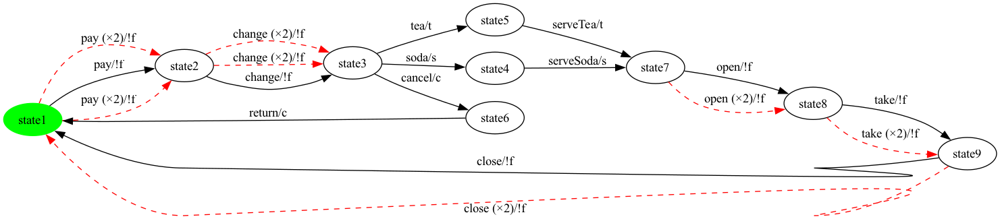
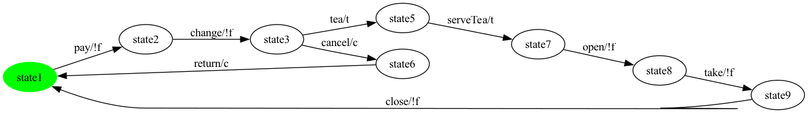

# Per-Product All-Transitions Coverage — SVM

## How the all-transitions test case is built (M4 pipeline)

Given an SPL-level FTS plus one product configuration, the generator runs five steps. All five live in the `vibes-testgeneration` module; the orchestrator is [`TransitionCoverageGenerator.generate(...)`](../../../vibes-testgeneration/src/main/java/be/vibes/testgeneration/coverage/TransitionCoverageGenerator.java).

**Step 1 — Project onto the product.** [`FExpressionPreservingProjection.project(fts, config)`](../../../vibes-testgeneration/src/main/java/be/vibes/testgeneration/product/FExpressionPreservingProjection.java) keeps every transition `t` whose feature expression evaluates true under the product (`fts.getFExpression(t).assign(config).applySimplification().isTrue()`); the original (un-assigned) `FExpression` is preserved on the kept transition for traceability. A forward BFS from the initial state then drops states unreachable from it. Output: a product-level `FeaturedTransitionSystem`.

**Step 2 — Repair strong connectivity.** [`InitialSccFilter.keepInitialScc(projected)`](../../../vibes-testgeneration/src/main/java/be/vibes/testgeneration/graph/InitialSccFilter.java) runs [Tarjan's SCC](../../../vibes-testgeneration/src/main/java/be/vibes/testgeneration/graph/StronglyConnectedComponents.java), keeps the SCC containing the initial state, and drops every other state (and its transitions). The result is strongly connected by construction — the precondition for any Eulerian-cycle algorithm. In the three MVP SPLs this step is currently a no-op (the projection already produced a single SCC reachable from initial); we still run it as an invariant check and to keep the pipeline robust for larger SPLs.

**Step 3 — Balance for an Euler cycle.** [`EulerianBalancer.balance(repaired)`](../../../vibes-testgeneration/src/main/java/be/vibes/testgeneration/graph/EulerianBalancer.java) makes the graph Eulerian by enforcing `in-degree == out-degree` at every state. The approach is a directed **Chinese Postman**: for each pair of imbalanced states `(u, v)` (`u` has excess outgoing, `v` has excess incoming) it finds a shortest path of real transitions from `v` to `u` via BFS, then **doubles** every transition along that path. Doubled transitions get a unique action name `<original>__dup__N` so they survive VIBeS' dedup but their semantic action is the original — coverage measurement strips the suffix. Where no real path exists (e.g. the pair-graph from M6) the balancer falls back to a direct synthetic `__balance__N` edge.

**Step 4 — Trace the Euler cycle.** [`HierholzerEulerCycle.compute(balanced)`](../../../vibes-testgeneration/src/main/java/be/vibes/testgeneration/graph/HierholzerEulerCycle.java) walks the balanced graph using Hierholzer's algorithm: DFS until a sub-cycle closes, splice in additional sub-cycles from unvisited transitions, repeat. The output is one contiguous sequence of transitions that visits every edge of the balanced graph exactly once and returns to the initial state.

**Step 5 — Wrap into a TestCase.** The cycle is enqueued into `be.vibes.ts.TestCase`. Synthetic actions (`__end__`, `__balance__N`, `<action>__dup__N`) remain in the test case so the executor can use them as test-case boundary markers (everything between two synthetics is one real-SUT sub-walk); they are filtered before coverage measurement via `EulerianBalancer.isSyntheticAction(...)`.

**Coverage claim (by construction).** Every real transition in the projected FTS appears in the balanced FTS (balancing only adds, never removes). The Hierholzer cycle visits every transition of the balanced graph exactly once. Therefore the cycle's real (non-synthetic) transitions cover **100% of the projected FTS' real transitions**. This is a structural invariant, not an empirical observation.

---

## Products

Each product below shows the projected FTS (left, synthetic `__end__` transitions dashed-red) and the balanced FTS (right, Chinese-Postman doubled transitions `<action>__dup__N` dashed-red). The generated all-transitions test case is listed underneath, segmented at every synthetic action (the action sequence between two synthetic boundaries is one self-contained sub-walk on real SUT events).


### Product 1

**Selected features:** selected = {c, f, t}

**Projected FTS:** 5 states, 6 transitions (6 real / 0 `__end__`).

**Repaired FTS (after `InitialSccFilter`):** 5 states, 6 transitions (6 real / 0 `__end__`).

**Balanced FTS:** 5 states, 7 transitions (6 real / 0 `__end__` / 1 `__dup__` / 0 `__balance__`).




**All-transitions test case (`SVM_p1_trans`)** — 7 step(s) total (6 real / 0 `__end__` / 1 `__dup__` / 0 `__balance__`). Real-transition coverage on the repaired FTS: **6/6 = 100.0%**.

Sub-walks between synthetic boundaries:

- **sub-walk 1**: `cancel -> return -> free -> tea -> serveTea -> take`

Full cycle (synthetic actions shown verbatim):

```
free(dup) -> cancel -> return -> free -> tea -> serveTea -> take
```


### Product 2

**Selected features:** selected = {s, t}

**Projected FTS:** 8 states, 9 transitions (9 real / 0 `__end__`).

**Repaired FTS (after `InitialSccFilter`):** 8 states, 9 transitions (9 real / 0 `__end__`).

**Balanced FTS:** 8 states, 14 transitions (9 real / 0 `__end__` / 5 `__dup__` / 0 `__balance__`).





**All-transitions test case (`SVM_p2_trans`)** — 14 step(s) total (9 real / 0 `__end__` / 5 `__dup__` / 0 `__balance__`). Real-transition coverage on the repaired FTS: **9/9 = 100.0%**.

Sub-walks between synthetic boundaries:

- **sub-walk 1**: `pay`
- **sub-walk 2**: `tea -> serveTea -> open -> take -> close`
- **sub-walk 3**: `change -> soda -> serveSoda`

Full cycle (synthetic actions shown verbatim):

```
pay -> change(dup) -> tea -> serveTea -> open -> take -> close -> pay(dup) -> change -> soda -> serveSoda -> open(dup) -> take(dup) -> close(dup)
```


### Product 3

**Selected features:** selected = {s}

**Projected FTS:** 7 states, 7 transitions (7 real / 0 `__end__`).

**Repaired FTS (after `InitialSccFilter`):** 7 states, 7 transitions (7 real / 0 `__end__`).

**Balanced FTS:** 7 states, 7 transitions (7 real / 0 `__end__` / 0 `__dup__` / 0 `__balance__`).




**All-transitions test case (`SVM_p3_trans`)** — 7 step(s) total (7 real / 0 `__end__` / 0 `__dup__` / 0 `__balance__`). Real-transition coverage on the repaired FTS: **7/7 = 100.0%**.

Sub-walks between synthetic boundaries:

- **sub-walk 1**: `pay -> change -> soda -> serveSoda -> open -> take -> close`

Full cycle (synthetic actions shown verbatim):

```
pay -> change -> soda -> serveSoda -> open -> take -> close
```


### Product 4

**Selected features:** selected = {t}

**Projected FTS:** 7 states, 7 transitions (7 real / 0 `__end__`).

**Repaired FTS (after `InitialSccFilter`):** 7 states, 7 transitions (7 real / 0 `__end__`).

**Balanced FTS:** 7 states, 7 transitions (7 real / 0 `__end__` / 0 `__dup__` / 0 `__balance__`).


**All-transitions test case (`SVM_p4_trans`)** — 7 step(s) total (7 real / 0 `__end__` / 0 `__dup__` / 0 `__balance__`). Real-transition coverage on the repaired FTS: **7/7 = 100.0%**.

Sub-walks between synthetic boundaries:

- **sub-walk 1**: `pay -> change -> tea -> serveTea -> open -> take -> close`

Full cycle (synthetic actions shown verbatim):

```
pay -> change -> tea -> serveTea -> open -> take -> close
```


### Product 5

**Selected features:** selected = {f, s, t}

**Projected FTS:** 5 states, 6 transitions (6 real / 0 `__end__`).

**Repaired FTS (after `InitialSccFilter`):** 5 states, 6 transitions (6 real / 0 `__end__`).

**Balanced FTS:** 5 states, 8 transitions (6 real / 0 `__end__` / 2 `__dup__` / 0 `__balance__`).




**All-transitions test case (`SVM_p5_trans`)** — 8 step(s) total (6 real / 0 `__end__` / 2 `__dup__` / 0 `__balance__`). Real-transition coverage on the repaired FTS: **6/6 = 100.0%**.

Sub-walks between synthetic boundaries:

- **sub-walk 1**: `free -> tea -> serveTea -> take`
- **sub-walk 2**: `soda -> serveSoda`

Full cycle (synthetic actions shown verbatim):

```
free -> tea -> serveTea -> take -> free(dup) -> soda -> serveSoda -> take(dup)
```


### Product 6

**Selected features:** selected = {c, f, s}

**Projected FTS:** 5 states, 6 transitions (6 real / 0 `__end__`).

**Repaired FTS (after `InitialSccFilter`):** 5 states, 6 transitions (6 real / 0 `__end__`).

**Balanced FTS:** 5 states, 7 transitions (6 real / 0 `__end__` / 1 `__dup__` / 0 `__balance__`).




**All-transitions test case (`SVM_p6_trans`)** — 7 step(s) total (6 real / 0 `__end__` / 1 `__dup__` / 0 `__balance__`). Real-transition coverage on the repaired FTS: **6/6 = 100.0%**.

Sub-walks between synthetic boundaries:

- **sub-walk 1**: `cancel -> return -> free -> soda -> serveSoda -> take`

Full cycle (synthetic actions shown verbatim):

```
free(dup) -> cancel -> return -> free -> soda -> serveSoda -> take
```


### Product 7

**Selected features:** selected = {c, s}

**Projected FTS:** 8 states, 9 transitions (9 real / 0 `__end__`).

**Repaired FTS (after `InitialSccFilter`):** 8 states, 9 transitions (9 real / 0 `__end__`).

**Balanced FTS:** 8 states, 11 transitions (9 real / 0 `__end__` / 2 `__dup__` / 0 `__balance__`).




**All-transitions test case (`SVM_p7_trans`)** — 11 step(s) total (9 real / 0 `__end__` / 2 `__dup__` / 0 `__balance__`). Real-transition coverage on the repaired FTS: **9/9 = 100.0%**.

Sub-walks between synthetic boundaries:

- **sub-walk 1**: `change -> cancel -> return -> pay`
- **sub-walk 2**: `soda -> serveSoda -> open -> take -> close`

Full cycle (synthetic actions shown verbatim):

```
pay(dup) -> change -> cancel -> return -> pay -> change(dup) -> soda -> serveSoda -> open -> take -> close
```


### Product 8

**Selected features:** selected = {f, t}

**Projected FTS:** 4 states, 4 transitions (4 real / 0 `__end__`).

**Repaired FTS (after `InitialSccFilter`):** 4 states, 4 transitions (4 real / 0 `__end__`).

**Balanced FTS:** 4 states, 4 transitions (4 real / 0 `__end__` / 0 `__dup__` / 0 `__balance__`).


**All-transitions test case (`SVM_p8_trans`)** — 4 step(s) total (4 real / 0 `__end__` / 0 `__dup__` / 0 `__balance__`). Real-transition coverage on the repaired FTS: **4/4 = 100.0%**.

Sub-walks between synthetic boundaries:

- **sub-walk 1**: `free -> tea -> serveTea -> take`

Full cycle (synthetic actions shown verbatim):

```
free -> tea -> serveTea -> take
```


### Product 9

**Selected features:** selected = {c, f, s, t}

**Projected FTS:** 6 states, 8 transitions (8 real / 0 `__end__`).

**Repaired FTS (after `InitialSccFilter`):** 6 states, 8 transitions (8 real / 0 `__end__`).

**Balanced FTS:** 6 states, 11 transitions (8 real / 0 `__end__` / 3 `__dup__` / 0 `__balance__`).




**All-transitions test case (`SVM_p9_trans`)** — 11 step(s) total (8 real / 0 `__end__` / 3 `__dup__` / 0 `__balance__`). Real-transition coverage on the repaired FTS: **8/8 = 100.0%**.

Sub-walks between synthetic boundaries:

- **sub-walk 1**: `free -> cancel -> return`
- **sub-walk 2**: `tea -> serveTea -> take`
- **sub-walk 3**: `soda -> serveSoda`

Full cycle (synthetic actions shown verbatim):

```
free -> cancel -> return -> free(dup) -> tea -> serveTea -> take -> free(dup) -> soda -> serveSoda -> take(dup)
```


### Product 10

**Selected features:** selected = {c, s, t}

**Projected FTS:** 9 states, 11 transitions (11 real / 0 `__end__`).

**Repaired FTS (after `InitialSccFilter`):** 9 states, 11 transitions (11 real / 0 `__end__`).

**Balanced FTS:** 9 states, 18 transitions (11 real / 0 `__end__` / 7 `__dup__` / 0 `__balance__`).




**All-transitions test case (`SVM_p10_trans`)** — 18 step(s) total (11 real / 0 `__end__` / 7 `__dup__` / 0 `__balance__`). Real-transition coverage on the repaired FTS: **11/11 = 100.0%**.

Sub-walks between synthetic boundaries:

- **sub-walk 1**: `cancel -> return -> pay`
- **sub-walk 2**: `tea -> serveTea -> open -> take -> close`
- **sub-walk 3**: `change -> soda -> serveSoda`

Full cycle (synthetic actions shown verbatim):

```
pay(dup) -> change(dup) -> cancel -> return -> pay -> change(dup) -> tea -> serveTea -> open -> take -> close -> pay(dup) -> change -> soda -> serveSoda -> open(dup) -> take(dup) -> close(dup)
```


### Product 11

**Selected features:** selected = {c, t}

**Projected FTS:** 8 states, 9 transitions (9 real / 0 `__end__`).

**Repaired FTS (after `InitialSccFilter`):** 8 states, 9 transitions (9 real / 0 `__end__`).

**Balanced FTS:** 8 states, 11 transitions (9 real / 0 `__end__` / 2 `__dup__` / 0 `__balance__`).




**All-transitions test case (`SVM_p11_trans`)** — 11 step(s) total (9 real / 0 `__end__` / 2 `__dup__` / 0 `__balance__`). Real-transition coverage on the repaired FTS: **9/9 = 100.0%**.

Sub-walks between synthetic boundaries:

- **sub-walk 1**: `change -> cancel -> return -> pay`
- **sub-walk 2**: `tea -> serveTea -> open -> take -> close`

Full cycle (synthetic actions shown verbatim):

```
pay(dup) -> change -> cancel -> return -> pay -> change(dup) -> tea -> serveTea -> open -> take -> close
```


### Product 12

**Selected features:** selected = {f, s}

**Projected FTS:** 4 states, 4 transitions (4 real / 0 `__end__`).

**Repaired FTS (after `InitialSccFilter`):** 4 states, 4 transitions (4 real / 0 `__end__`).

**Balanced FTS:** 4 states, 4 transitions (4 real / 0 `__end__` / 0 `__dup__` / 0 `__balance__`).


**All-transitions test case (`SVM_p12_trans`)** — 4 step(s) total (4 real / 0 `__end__` / 0 `__dup__` / 0 `__balance__`). Real-transition coverage on the repaired FTS: **4/4 = 100.0%**.

Sub-walks between synthetic boundaries:

- **sub-walk 1**: `free -> soda -> serveSoda -> take`

Full cycle (synthetic actions shown verbatim):

```
free -> soda -> serveSoda -> take
```

---

Total products: 12.
