# Per-Product All-Transitions Coverage — eMail

## How the all-transitions test case is built (M4 pipeline)

Given an SPL-level FTS plus one product configuration, the generator runs five steps. All five live in the `vibes-testgeneration` module; the orchestrator is [`TransitionCoverageGenerator.generate(...)`](../../../vibes-testgeneration/src/main/java/be/vibes/testgeneration/coverage/TransitionCoverageGenerator.java).

**Step 1 — Project onto the product.** [`FExpressionPreservingProjection.project(fts, config)`](../../../vibes-testgeneration/src/main/java/be/vibes/testgeneration/product/FExpressionPreservingProjection.java) keeps every transition `t` whose feature expression evaluates true under the product (`fts.getFExpression(t).assign(config).applySimplification().isTrue()`); the original (un-assigned) `FExpression` is preserved on the kept transition for traceability. A forward BFS from the initial state then drops states unreachable from it. Output: a product-level `FeaturedTransitionSystem`.

**Step 2 — Repair strong connectivity.** [`InitialSccFilter.keepInitialScc(projected)`](../../../vibes-testgeneration/src/main/java/be/vibes/testgeneration/graph/InitialSccFilter.java) runs [Tarjan's SCC](../../../vibes-testgeneration/src/main/java/be/vibes/testgeneration/graph/StronglyConnectedComponents.java), keeps the SCC containing the initial state, and drops every other state (and its transitions). The result is strongly connected by construction — the precondition for any Eulerian-cycle algorithm. In the three MVP SPLs this step is currently a no-op (the projection already produced a single SCC reachable from initial); we still run it as an invariant check and to keep the pipeline robust for larger SPLs.

**Step 3 — Balance for an Euler cycle.** [`EulerianBalancer.balance(repaired)`](../../../vibes-testgeneration/src/main/java/be/vibes/testgeneration/graph/EulerianBalancer.java) makes the graph Eulerian by enforcing `in-degree == out-degree` at every state. The approach is a directed **Chinese Postman**: for each pair of imbalanced states `(u, v)` (`u` has excess outgoing, `v` has excess incoming) it finds a shortest path of real transitions from `v` to `u` via BFS, then **doubles** every transition along that path. Doubled transitions get a unique action name `<original>__dup__N` so they survive VIBeS' dedup but their semantic action is the original — coverage measurement strips the suffix. Where no real path exists (e.g. the pair-graph from M6) the balancer falls back to a direct synthetic `__balance__N` edge.

**Step 4 — Trace the Euler cycle.** [`HierholzerEulerCycle.compute(balanced)`](../../../vibes-testgeneration/src/main/java/be/vibes/testgeneration/graph/HierholzerEulerCycle.java) walks the balanced graph using Hierholzer's algorithm: DFS until a sub-cycle closes, splice in additional sub-cycles from unvisited transitions, repeat. The output is one contiguous sequence of transitions that visits every edge of the balanced graph exactly once and returns to the initial state.

**Step 5 — Wrap into a TestCase, then split into trips.** The cycle is enqueued into `be.vibes.ts.TestCase`. For display the cycle is split at every visit to the initial state via [`TestCaseSplitter.splitAtInitialReturns(...)`](../../../vibes-testgeneration/src/main/java/be/vibes/testgeneration/product/TestCaseSplitter.java); each trip from initial back to initial is one test case in the operational sense (boot the SUT, run actions, return to reset). When rendering the action sequence, `__end__` and `__balance__N` transitions are hidden (synthetic reset markers, not real SUT events) and `<action>__dup__N` is shown as `<action>` (a real second traversal). All synthetics are still filtered from coverage measurement via `EulerianBalancer.isSyntheticAction(...)`.

**Coverage claim (by construction).** Every real transition in the projected FTS appears in the balanced FTS (balancing only adds, never removes). The Hierholzer cycle visits every transition of the balanced graph exactly once. Therefore the cycle's real (non-synthetic) transitions cover **100% of the projected FTS' real transitions**. This is a structural invariant, not an empirical observation.

---

## Products

Each product below shows the projected FTS (left, synthetic `__end__` transitions dashed-red) and the balanced FTS (right, Chinese-Postman doubled transitions `<action>__dup__N` dashed-red). The generated all-transitions test case is listed underneath, segmented at every synthetic action (the action sequence between two synthetic boundaries is one self-contained sub-walk on real SUT events).

### Product 1

**Selected features:** selected = {e, s}

**Projected FTS:** 6 states, 12 transitions (11 real / 1 `__end__`).

**Repaired FTS (after `InitialSccFilter`):** 6 states, 12 transitions (11 real / 1 `__end__`).

**Balanced FTS:** 6 states, 15 transitions (11 real / 1 `__end__` / 3 `__dup__` / 0 `__balance__`).

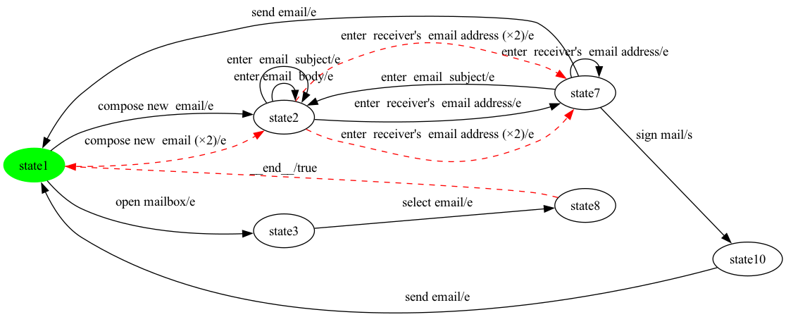

**All-transitions coverage on the repaired FTS:** **11/11 = 100.0%** (15 raw cycle step(s): 11 real, 1 `__end__`, 3 `__dup__`, 0 `__balance__`).

**Generated test cases** (3 trip(s) from initial back to initial, hidden synthetics removed):

- **test case 1**: `open mailbox -> select email`
- **test case 2**: `compose new email -> enter email body -> enter email subject -> enter receiver's email address -> send email`
- **test case 3**: `compose new email -> enter receiver's email address -> enter email subject -> enter receiver's email address -> enter receiver's email address -> sign mail -> send email`

### Product 2

**Selected features:** selected = {ad, e}

**Projected FTS:** 8 states, 15 transitions (14 real / 1 `__end__`).

**Repaired FTS (after `InitialSccFilter`):** 8 states, 15 transitions (14 real / 1 `__end__`).

**Balanced FTS:** 8 states, 18 transitions (14 real / 1 `__end__` / 3 `__dup__` / 0 `__balance__`).

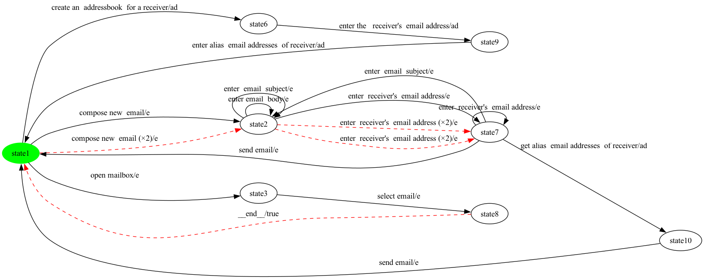

**All-transitions coverage on the repaired FTS:** **14/14 = 100.0%** (18 raw cycle step(s): 14 real, 1 `__end__`, 3 `__dup__`, 0 `__balance__`).

**Generated test cases** (4 trip(s) from initial back to initial, hidden synthetics removed):

- **test case 1**: `open mailbox -> select email`
- **test case 2**: `create an addressbook for a receiver -> enter the receiver's email address -> enter alias email addresses of receiver`
- **test case 3**: `compose new email -> enter receiver's email address -> send email`
- **test case 4**: `compose new email -> enter receiver's email address -> enter email subject -> enter email body -> enter email subject -> enter receiver's email address -> enter receiver's email address -> get alias email addresses of receiver -> send email`

### Product 3

**Selected features:** selected = {ad, au, e}

**Projected FTS:** 10 states, 20 transitions (18 real / 2 `__end__`).

**Repaired FTS (after `InitialSccFilter`):** 10 states, 20 transitions (18 real / 2 `__end__`).

**Balanced FTS:** 10 states, 25 transitions (18 real / 3 `__end__` / 5 `__dup__` / 0 `__balance__`).

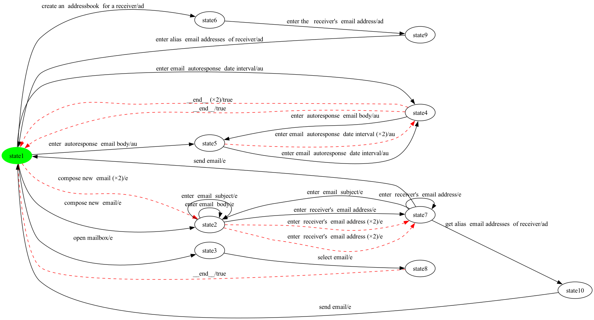

**All-transitions coverage on the repaired FTS:** **18/18 = 100.0%** (25 raw cycle step(s): 18 real, 3 `__end__`, 5 `__dup__`, 0 `__balance__`).

**Generated test cases** (6 trip(s) from initial back to initial, hidden synthetics removed):

- **test case 1**: `enter email autoresponse date interval -> enter autoresponse email body -> enter email autoresponse date interval`
- **test case 2**: `enter autoresponse email body -> enter email autoresponse date interval`
- **test case 3**: `open mailbox -> select email`
- **test case 4**: `create an addressbook for a receiver -> enter the receiver's email address -> enter alias email addresses of receiver`
- **test case 5**: `compose new email -> enter receiver's email address -> send email`
- **test case 6**: `compose new email -> enter receiver's email address -> enter email subject -> enter email body -> enter email subject -> enter receiver's email address -> enter receiver's email address -> get alias email addresses of receiver -> send email`

### Product 4

**Selected features:** selected = {ad, au, e, en, s}

**Projected FTS:** 11 states, 23 transitions (21 real / 2 `__end__`).

**Repaired FTS (after `InitialSccFilter`):** 11 states, 23 transitions (21 real / 2 `__end__`).

**Balanced FTS:** 11 states, 34 transitions (21 real / 3 `__end__` / 11 `__dup__` / 0 `__balance__`).

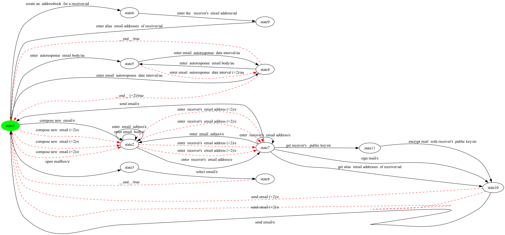

**All-transitions coverage on the repaired FTS:** **21/21 = 100.0%** (34 raw cycle step(s): 21 real, 3 `__end__`, 11 `__dup__`, 0 `__balance__`).

**Generated test cases** (8 trip(s) from initial back to initial, hidden synthetics removed):

- **test case 1**: `enter email autoresponse date interval -> enter autoresponse email body -> enter email autoresponse date interval`
- **test case 2**: `enter autoresponse email body -> enter email autoresponse date interval`
- **test case 3**: `open mailbox -> select email`
- **test case 4**: `create an addressbook for a receiver -> enter the receiver's email address -> enter alias email addresses of receiver`
- **test case 5**: `compose new email -> enter receiver's email address -> send email`
- **test case 6**: `compose new email -> enter receiver's email address -> get receiver's public key -> encrypt mail with receiver's public key -> send email`
- **test case 7**: `compose new email -> enter receiver's email address -> sign mail -> send email`
- **test case 8**: `compose new email -> enter receiver's email address -> enter email subject -> enter email body -> enter email subject -> enter receiver's email address -> enter receiver's email address -> get alias email addresses of receiver -> send email`

### Product 5

**Selected features:** selected = {e, en, s}

**Projected FTS:** 7 states, 14 transitions (13 real / 1 `__end__`).

**Repaired FTS (after `InitialSccFilter`):** 7 states, 14 transitions (13 real / 1 `__end__`).

**Balanced FTS:** 7 states, 20 transitions (13 real / 1 `__end__` / 6 `__dup__` / 0 `__balance__`).

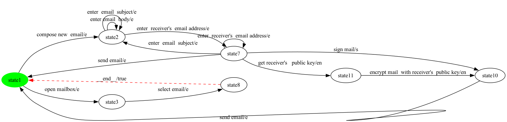

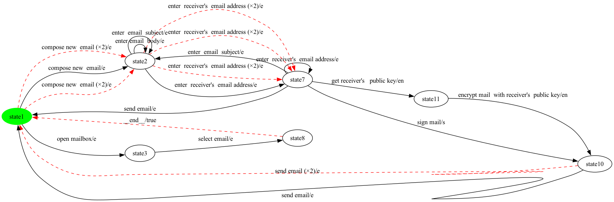

**All-transitions coverage on the repaired FTS:** **13/13 = 100.0%** (20 raw cycle step(s): 13 real, 1 `__end__`, 6 `__dup__`, 0 `__balance__`).

**Generated test cases** (4 trip(s) from initial back to initial, hidden synthetics removed):

- **test case 1**: `open mailbox -> select email`
- **test case 2**: `compose new email -> enter receiver's email address -> send email`
- **test case 3**: `compose new email -> enter receiver's email address -> get receiver's public key -> encrypt mail with receiver's public key -> send email`
- **test case 4**: `compose new email -> enter receiver's email address -> enter email subject -> enter email body -> enter email subject -> enter receiver's email address -> enter receiver's email address -> sign mail -> send email`

### Product 6

**Selected features:** selected = {au, e, en, s}

**Projected FTS:** 9 states, 19 transitions (17 real / 2 `__end__`).

**Repaired FTS (after `InitialSccFilter`):** 9 states, 19 transitions (17 real / 2 `__end__`).

**Balanced FTS:** 9 states, 27 transitions (17 real / 3 `__end__` / 8 `__dup__` / 0 `__balance__`).

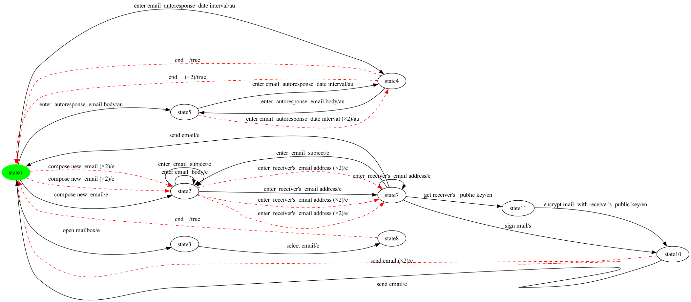

**All-transitions coverage on the repaired FTS:** **17/17 = 100.0%** (27 raw cycle step(s): 17 real, 3 `__end__`, 8 `__dup__`, 0 `__balance__`).

**Generated test cases** (6 trip(s) from initial back to initial, hidden synthetics removed):

- **test case 1**: `enter email autoresponse date interval -> enter autoresponse email body -> enter email autoresponse date interval`
- **test case 2**: `enter autoresponse email body -> enter email autoresponse date interval`
- **test case 3**: `open mailbox -> select email`
- **test case 4**: `compose new email -> enter receiver's email address -> send email`
- **test case 5**: `compose new email -> enter receiver's email address -> get receiver's public key -> encrypt mail with receiver's public key -> send email`
- **test case 6**: `compose new email -> enter receiver's email address -> enter email subject -> enter email body -> enter email subject -> enter receiver's email address -> enter receiver's email address -> sign mail -> send email`

### Product 7

**Selected features:** selected = {ad, au, e, f, s}

**Projected FTS:** 10 states, 22 transitions (20 real / 2 `__end__`).

**Repaired FTS (after `InitialSccFilter`):** 10 states, 22 transitions (20 real / 2 `__end__`).

**Balanced FTS:** 10 states, 36 transitions (20 real / 3 `__end__` / 14 `__dup__` / 0 `__balance__`).

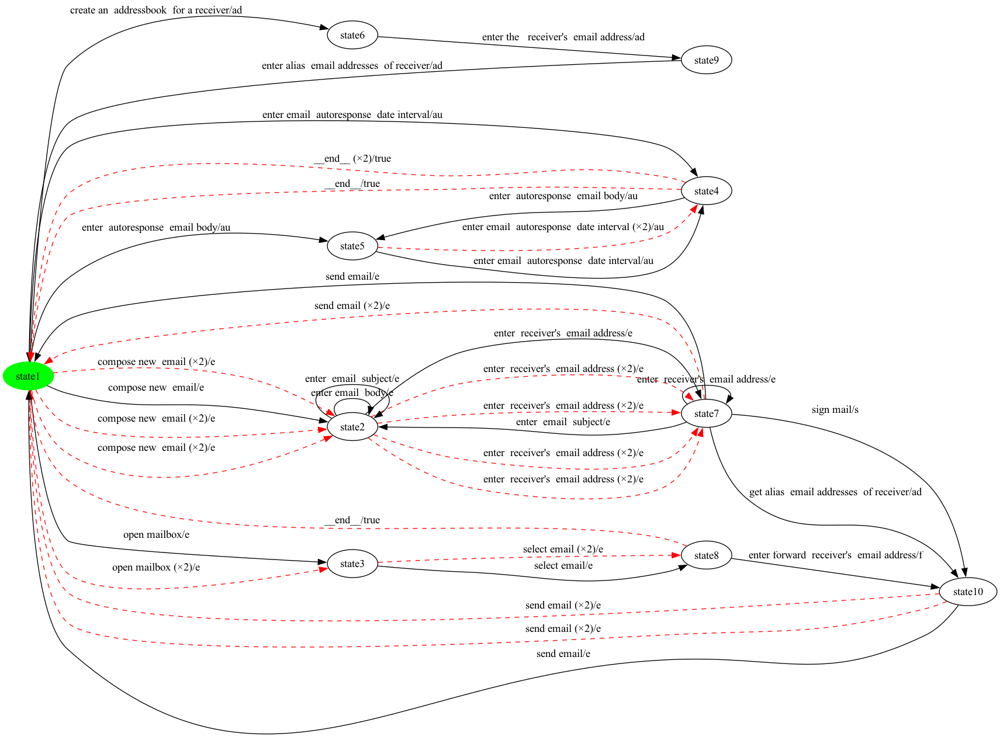

**All-transitions coverage on the repaired FTS:** **20/20 = 100.0%** (36 raw cycle step(s): 20 real, 3 `__end__`, 14 `__dup__`, 0 `__balance__`).

**Generated test cases** (9 trip(s) from initial back to initial, hidden synthetics removed):

- **test case 1**: `enter email autoresponse date interval -> enter autoresponse email body -> enter email autoresponse date interval`
- **test case 2**: `enter autoresponse email body -> enter email autoresponse date interval`
- **test case 3**: `open mailbox -> select email -> enter forward receiver's email address -> send email`
- **test case 4**: `open mailbox -> select email`
- **test case 5**: `create an addressbook for a receiver -> enter the receiver's email address -> enter alias email addresses of receiver`
- **test case 6**: `compose new email -> enter receiver's email address -> send email`
- **test case 7**: `compose new email -> enter receiver's email address -> send email`
- **test case 8**: `compose new email -> enter receiver's email address -> sign mail -> send email`
- **test case 9**: `compose new email -> enter receiver's email address -> enter email subject -> enter email body -> enter email subject -> enter receiver's email address -> enter receiver's email address -> get alias email addresses of receiver -> send email`

### Product 8

**Selected features:** selected = {e, f, s}

**Projected FTS:** 6 states, 13 transitions (12 real / 1 `__end__`).

**Repaired FTS (after `InitialSccFilter`):** 6 states, 13 transitions (12 real / 1 `__end__`).

**Balanced FTS:** 6 states, 22 transitions (12 real / 1 `__end__` / 9 `__dup__` / 0 `__balance__`).

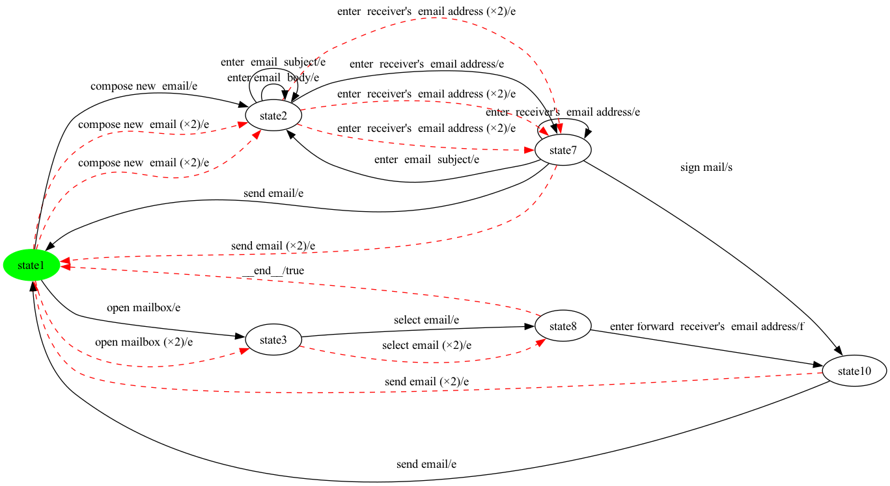

**All-transitions coverage on the repaired FTS:** **12/12 = 100.0%** (22 raw cycle step(s): 12 real, 1 `__end__`, 9 `__dup__`, 0 `__balance__`).

**Generated test cases** (5 trip(s) from initial back to initial, hidden synthetics removed):

- **test case 1**: `open mailbox -> select email -> enter forward receiver's email address -> send email`
- **test case 2**: `open mailbox -> select email`
- **test case 3**: `compose new email -> enter receiver's email address -> send email`
- **test case 4**: `compose new email -> enter receiver's email address -> send email`
- **test case 5**: `compose new email -> enter receiver's email address -> enter email subject -> enter email body -> enter email subject -> enter receiver's email address -> enter receiver's email address -> sign mail -> send email`

### Product 9

**Selected features:** selected = {au, e}

**Projected FTS:** 7 states, 15 transitions (13 real / 2 `__end__`).

**Repaired FTS (after `InitialSccFilter`):** 7 states, 15 transitions (13 real / 2 `__end__`).

**Balanced FTS:** 7 states, 21 transitions (13 real / 3 `__end__` / 6 `__dup__` / 0 `__balance__`).

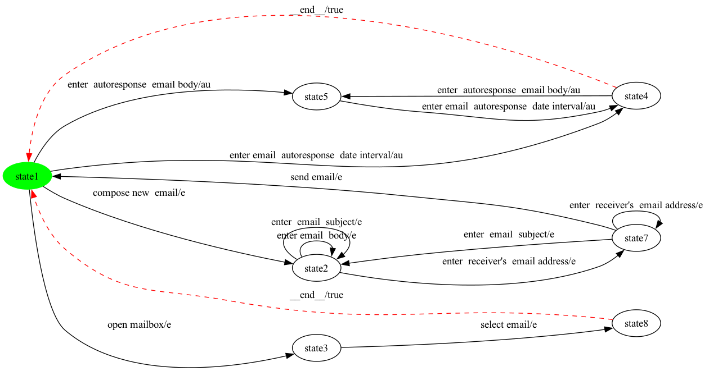

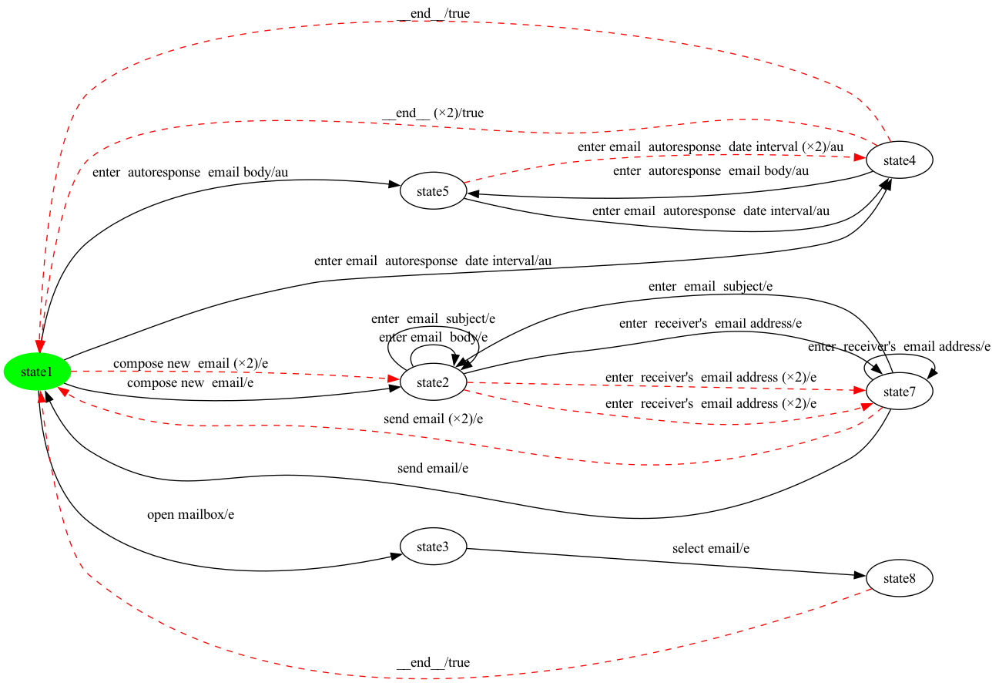

**All-transitions coverage on the repaired FTS:** **13/13 = 100.0%** (21 raw cycle step(s): 13 real, 3 `__end__`, 6 `__dup__`, 0 `__balance__`).

**Generated test cases** (5 trip(s) from initial back to initial, hidden synthetics removed):

- **test case 1**: `enter email autoresponse date interval -> enter autoresponse email body -> enter email autoresponse date interval`
- **test case 2**: `enter autoresponse email body -> enter email autoresponse date interval`
- **test case 3**: `open mailbox -> select email`
- **test case 4**: `compose new email -> enter receiver's email address -> send email`
- **test case 5**: `compose new email -> enter receiver's email address -> enter email subject -> enter email body -> enter email subject -> enter receiver's email address -> enter receiver's email address -> send email`

### Product 10

**Selected features:** selected = {ad, e, f}

**Projected FTS:** 8 states, 16 transitions (15 real / 1 `__end__`).

**Repaired FTS (after `InitialSccFilter`):** 8 states, 16 transitions (15 real / 1 `__end__`).

**Balanced FTS:** 8 states, 25 transitions (15 real / 1 `__end__` / 9 `__dup__` / 0 `__balance__`).

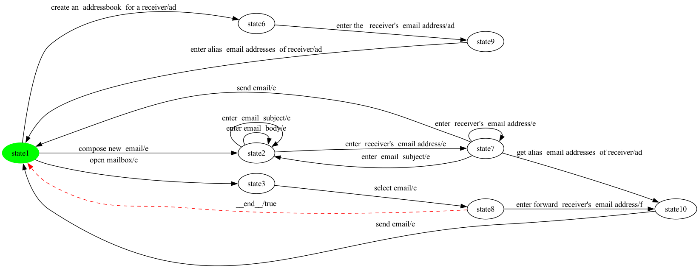

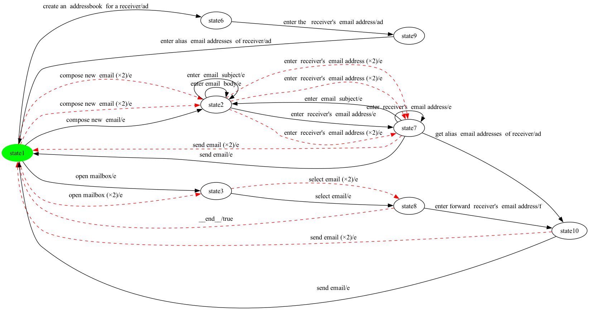

**All-transitions coverage on the repaired FTS:** **15/15 = 100.0%** (25 raw cycle step(s): 15 real, 1 `__end__`, 9 `__dup__`, 0 `__balance__`).

**Generated test cases** (6 trip(s) from initial back to initial, hidden synthetics removed):

- **test case 1**: `open mailbox -> select email -> enter forward receiver's email address -> send email`
- **test case 2**: `open mailbox -> select email`
- **test case 3**: `create an addressbook for a receiver -> enter the receiver's email address -> enter alias email addresses of receiver`
- **test case 4**: `compose new email -> enter receiver's email address -> send email`
- **test case 5**: `compose new email -> enter receiver's email address -> send email`
- **test case 6**: `compose new email -> enter receiver's email address -> enter email subject -> enter email body -> enter email subject -> enter receiver's email address -> enter receiver's email address -> get alias email addresses of receiver -> send email`

### Product 11

**Selected features:** selected = {ad, au, e, f}

**Projected FTS:** 10 states, 21 transitions (19 real / 2 `__end__`).

**Repaired FTS (after `InitialSccFilter`):** 10 states, 21 transitions (19 real / 2 `__end__`).

**Balanced FTS:** 10 states, 32 transitions (19 real / 3 `__end__` / 11 `__dup__` / 0 `__balance__`).

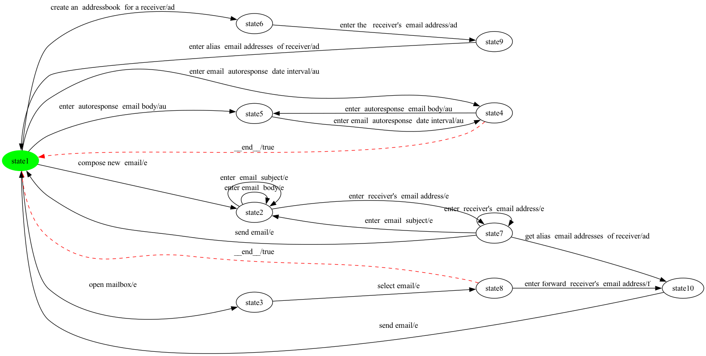

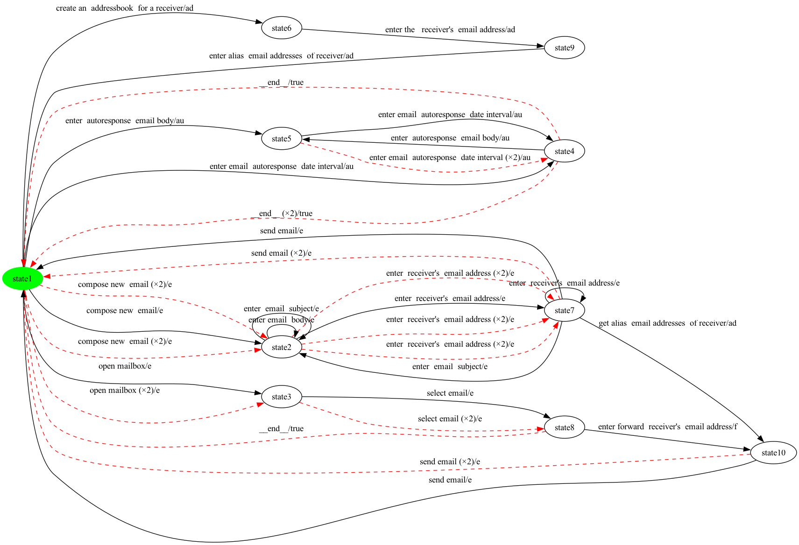

**All-transitions coverage on the repaired FTS:** **19/19 = 100.0%** (32 raw cycle step(s): 19 real, 3 `__end__`, 11 `__dup__`, 0 `__balance__`).

**Generated test cases** (8 trip(s) from initial back to initial, hidden synthetics removed):

- **test case 1**: `enter email autoresponse date interval -> enter autoresponse email body -> enter email autoresponse date interval`
- **test case 2**: `enter autoresponse email body -> enter email autoresponse date interval`
- **test case 3**: `open mailbox -> select email -> enter forward receiver's email address -> send email`
- **test case 4**: `open mailbox -> select email`
- **test case 5**: `create an addressbook for a receiver -> enter the receiver's email address -> enter alias email addresses of receiver`
- **test case 6**: `compose new email -> enter receiver's email address -> send email`
- **test case 7**: `compose new email -> enter receiver's email address -> send email`
- **test case 8**: `compose new email -> enter receiver's email address -> enter email subject -> enter email body -> enter email subject -> enter receiver's email address -> enter receiver's email address -> get alias email addresses of receiver -> send email`

### Product 12

**Selected features:** selected = {ad, e, en}

**Projected FTS:** 9 states, 17 transitions (16 real / 1 `__end__`).

**Repaired FTS (after `InitialSccFilter`):** 9 states, 17 transitions (16 real / 1 `__end__`).

**Balanced FTS:** 9 states, 23 transitions (16 real / 1 `__end__` / 6 `__dup__` / 0 `__balance__`).

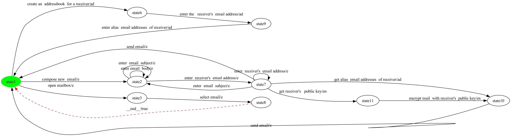

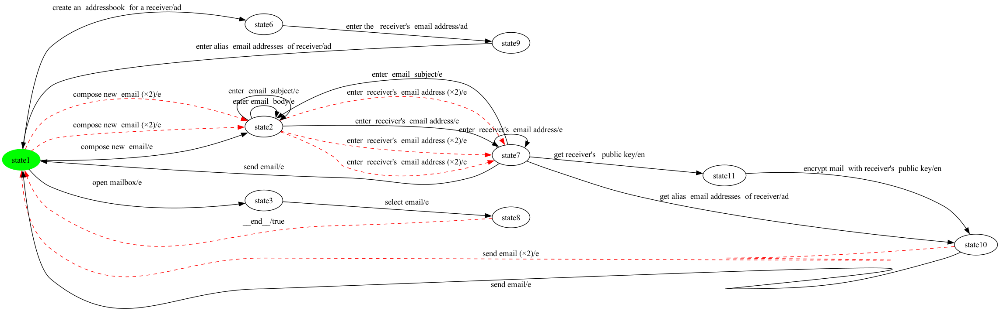

**All-transitions coverage on the repaired FTS:** **16/16 = 100.0%** (23 raw cycle step(s): 16 real, 1 `__end__`, 6 `__dup__`, 0 `__balance__`).

**Generated test cases** (5 trip(s) from initial back to initial, hidden synthetics removed):

- **test case 1**: `open mailbox -> select email`
- **test case 2**: `create an addressbook for a receiver -> enter the receiver's email address -> enter alias email addresses of receiver`
- **test case 3**: `compose new email -> enter receiver's email address -> send email`
- **test case 4**: `compose new email -> enter receiver's email address -> get receiver's public key -> encrypt mail with receiver's public key -> send email`
- **test case 5**: `compose new email -> enter receiver's email address -> enter email subject -> enter email body -> enter email subject -> enter receiver's email address -> enter receiver's email address -> get alias email addresses of receiver -> send email`

### Product 13

**Selected features:** selected = {ad, e, s}

**Projected FTS:** 8 states, 16 transitions (15 real / 1 `__end__`).

**Repaired FTS (after `InitialSccFilter`):** 8 states, 16 transitions (15 real / 1 `__end__`).

**Balanced FTS:** 8 states, 22 transitions (15 real / 1 `__end__` / 6 `__dup__` / 0 `__balance__`).

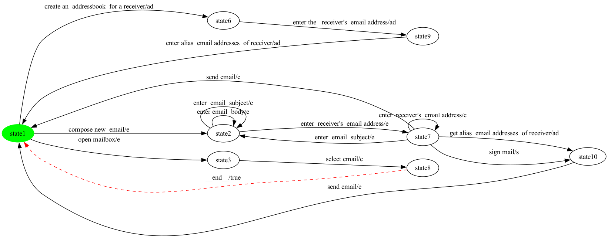

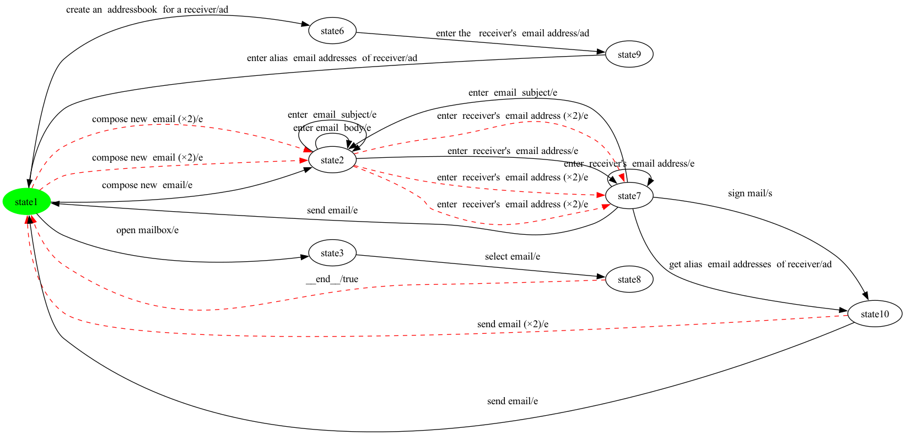

**All-transitions coverage on the repaired FTS:** **15/15 = 100.0%** (22 raw cycle step(s): 15 real, 1 `__end__`, 6 `__dup__`, 0 `__balance__`).

**Generated test cases** (5 trip(s) from initial back to initial, hidden synthetics removed):

- **test case 1**: `open mailbox -> select email`
- **test case 2**: `create an addressbook for a receiver -> enter the receiver's email address -> enter alias email addresses of receiver`
- **test case 3**: `compose new email -> enter receiver's email address -> send email`
- **test case 4**: `compose new email -> enter receiver's email address -> sign mail -> send email`
- **test case 5**: `compose new email -> enter receiver's email address -> enter email subject -> enter email body -> enter email subject -> enter receiver's email address -> enter receiver's email address -> get alias email addresses of receiver -> send email`

### Product 14

**Selected features:** selected = {au, e, f, s}

**Projected FTS:** 8 states, 18 transitions (16 real / 2 `__end__`).

**Repaired FTS (after `InitialSccFilter`):** 8 states, 18 transitions (16 real / 2 `__end__`).

**Balanced FTS:** 8 states, 29 transitions (16 real / 3 `__end__` / 11 `__dup__` / 0 `__balance__`).

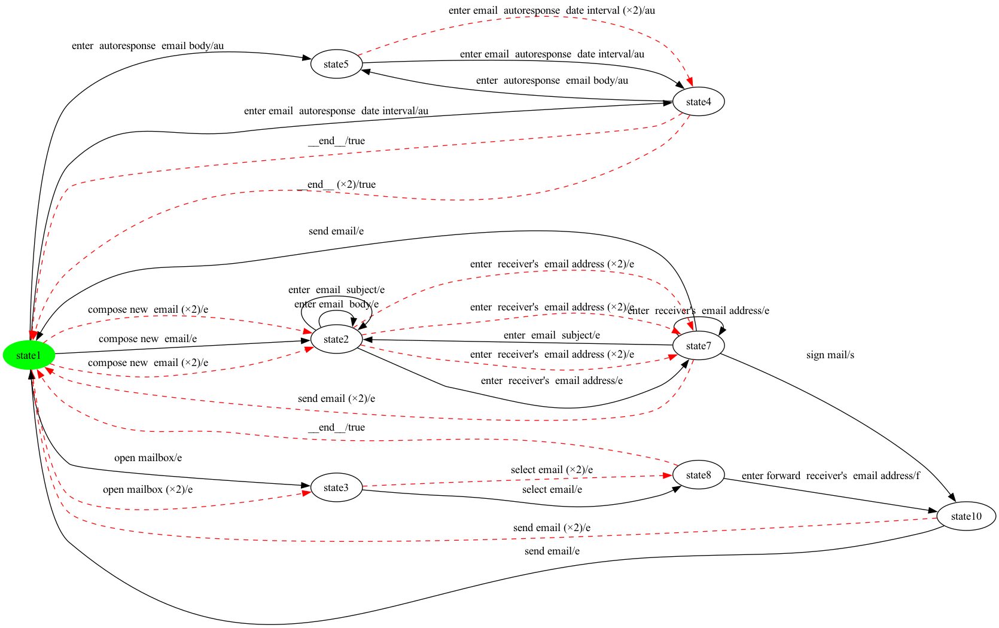

**All-transitions coverage on the repaired FTS:** **16/16 = 100.0%** (29 raw cycle step(s): 16 real, 3 `__end__`, 11 `__dup__`, 0 `__balance__`).

**Generated test cases** (7 trip(s) from initial back to initial, hidden synthetics removed):

- **test case 1**: `enter email autoresponse date interval -> enter autoresponse email body -> enter email autoresponse date interval`
- **test case 2**: `enter autoresponse email body -> enter email autoresponse date interval`
- **test case 3**: `open mailbox -> select email -> enter forward receiver's email address -> send email`
- **test case 4**: `open mailbox -> select email`
- **test case 5**: `compose new email -> enter receiver's email address -> send email`
- **test case 6**: `compose new email -> enter receiver's email address -> send email`
- **test case 7**: `compose new email -> enter receiver's email address -> enter email subject -> enter email body -> enter email subject -> enter receiver's email address -> enter receiver's email address -> sign mail -> send email`

### Product 15

**Selected features:** selected = {e, en}

**Projected FTS:** 7 states, 13 transitions (12 real / 1 `__end__`).

**Repaired FTS (after `InitialSccFilter`):** 7 states, 13 transitions (12 real / 1 `__end__`).

**Balanced FTS:** 7 states, 16 transitions (12 real / 1 `__end__` / 3 `__dup__` / 0 `__balance__`).

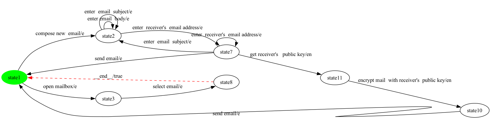

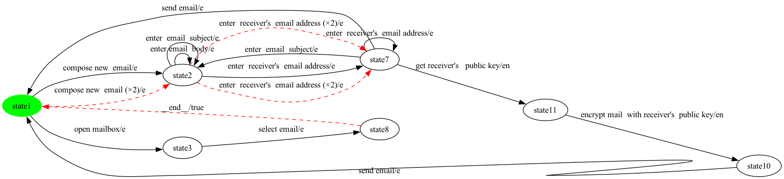

**All-transitions coverage on the repaired FTS:** **12/12 = 100.0%** (16 raw cycle step(s): 12 real, 1 `__end__`, 3 `__dup__`, 0 `__balance__`).

**Generated test cases** (3 trip(s) from initial back to initial, hidden synthetics removed):

- **test case 1**: `open mailbox -> select email`
- **test case 2**: `compose new email -> enter receiver's email address -> send email`
- **test case 3**: `compose new email -> enter receiver's email address -> enter email subject -> enter email body -> enter email subject -> enter receiver's email address -> enter receiver's email address -> get receiver's public key -> encrypt mail with receiver's public key -> send email`

### Product 16

**Selected features:** selected = {au, e, f}

**Projected FTS:** 8 states, 17 transitions (15 real / 2 `__end__`).

**Repaired FTS (after `InitialSccFilter`):** 8 states, 17 transitions (15 real / 2 `__end__`).

**Balanced FTS:** 8 states, 25 transitions (15 real / 3 `__end__` / 8 `__dup__` / 0 `__balance__`).

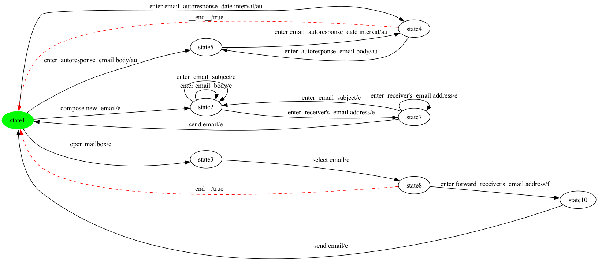

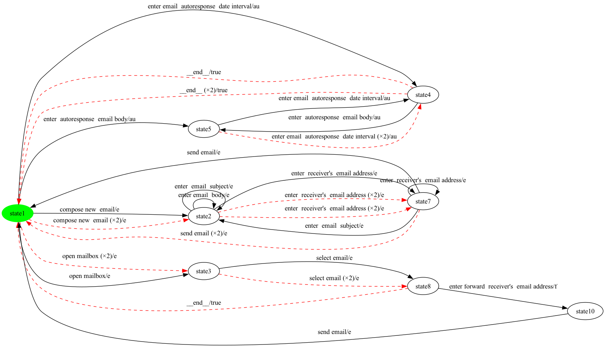

**All-transitions coverage on the repaired FTS:** **15/15 = 100.0%** (25 raw cycle step(s): 15 real, 3 `__end__`, 8 `__dup__`, 0 `__balance__`).

**Generated test cases** (6 trip(s) from initial back to initial, hidden synthetics removed):

- **test case 1**: `enter email autoresponse date interval -> enter autoresponse email body -> enter email autoresponse date interval`
- **test case 2**: `enter autoresponse email body -> enter email autoresponse date interval`
- **test case 3**: `open mailbox -> select email -> enter forward receiver's email address -> send email`
- **test case 4**: `open mailbox -> select email`
- **test case 5**: `compose new email -> enter receiver's email address -> send email`
- **test case 6**: `compose new email -> enter receiver's email address -> enter email subject -> enter email body -> enter email subject -> enter receiver's email address -> enter receiver's email address -> send email`

### Product 17

**Selected features:** selected = {ad, e, f, s}

**Projected FTS:** 8 states, 17 transitions (16 real / 1 `__end__`).

**Repaired FTS (after `InitialSccFilter`):** 8 states, 17 transitions (16 real / 1 `__end__`).

**Balanced FTS:** 8 states, 29 transitions (16 real / 1 `__end__` / 12 `__dup__` / 0 `__balance__`).

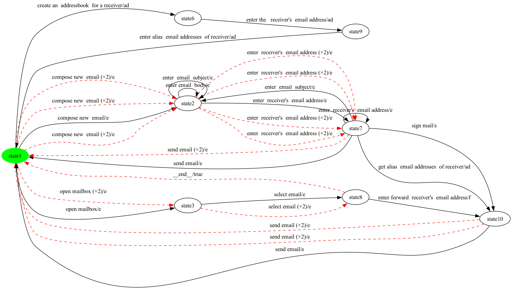

**All-transitions coverage on the repaired FTS:** **16/16 = 100.0%** (29 raw cycle step(s): 16 real, 1 `__end__`, 12 `__dup__`, 0 `__balance__`).

**Generated test cases** (7 trip(s) from initial back to initial, hidden synthetics removed):

- **test case 1**: `open mailbox -> select email -> enter forward receiver's email address -> send email`
- **test case 2**: `open mailbox -> select email`
- **test case 3**: `create an addressbook for a receiver -> enter the receiver's email address -> enter alias email addresses of receiver`
- **test case 4**: `compose new email -> enter receiver's email address -> send email`
- **test case 5**: `compose new email -> enter receiver's email address -> send email`
- **test case 6**: `compose new email -> enter receiver's email address -> sign mail -> send email`
- **test case 7**: `compose new email -> enter receiver's email address -> enter email subject -> enter email body -> enter email subject -> enter receiver's email address -> enter receiver's email address -> get alias email addresses of receiver -> send email`

### Product 18

**Selected features:** selected = {ad, au, e, en}

**Projected FTS:** 11 states, 22 transitions (20 real / 2 `__end__`).

**Repaired FTS (after `InitialSccFilter`):** 11 states, 22 transitions (20 real / 2 `__end__`).

**Balanced FTS:** 11 states, 30 transitions (20 real / 3 `__end__` / 8 `__dup__` / 0 `__balance__`).

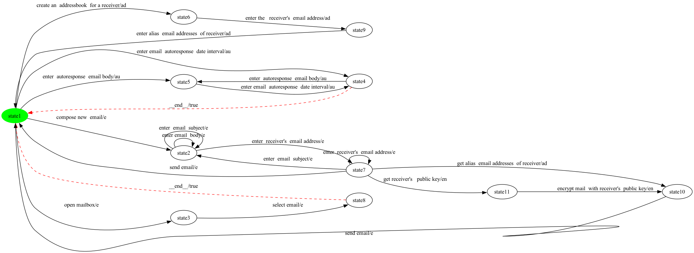

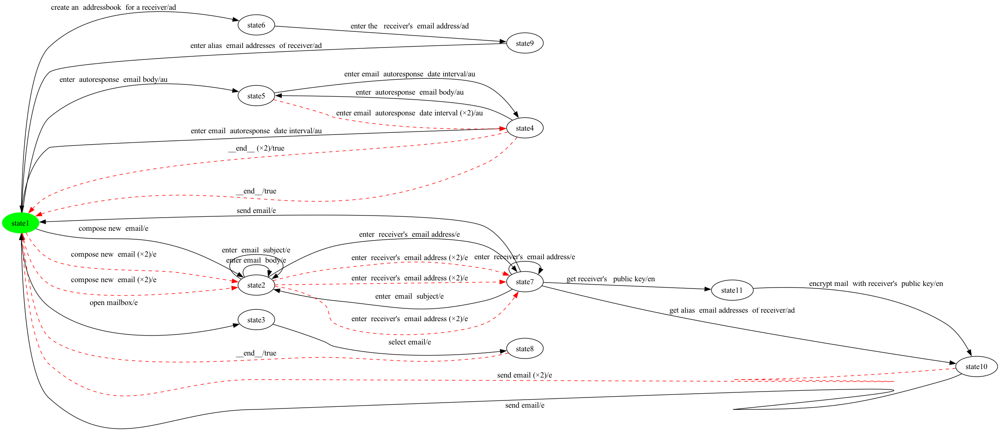

**All-transitions coverage on the repaired FTS:** **20/20 = 100.0%** (30 raw cycle step(s): 20 real, 3 `__end__`, 8 `__dup__`, 0 `__balance__`).

**Generated test cases** (7 trip(s) from initial back to initial, hidden synthetics removed):

- **test case 1**: `enter email autoresponse date interval -> enter autoresponse email body -> enter email autoresponse date interval`
- **test case 2**: `enter autoresponse email body -> enter email autoresponse date interval`
- **test case 3**: `open mailbox -> select email`
- **test case 4**: `create an addressbook for a receiver -> enter the receiver's email address -> enter alias email addresses of receiver`
- **test case 5**: `compose new email -> enter receiver's email address -> send email`
- **test case 6**: `compose new email -> enter receiver's email address -> get receiver's public key -> encrypt mail with receiver's public key -> send email`
- **test case 7**: `compose new email -> enter receiver's email address -> enter email subject -> enter email body -> enter email subject -> enter receiver's email address -> enter receiver's email address -> get alias email addresses of receiver -> send email`

### Product 19

**Selected features:** selected = {au, e, en}

**Projected FTS:** 9 states, 18 transitions (16 real / 2 `__end__`).

**Repaired FTS (after `InitialSccFilter`):** 9 states, 18 transitions (16 real / 2 `__end__`).

**Balanced FTS:** 9 states, 23 transitions (16 real / 3 `__end__` / 5 `__dup__` / 0 `__balance__`).

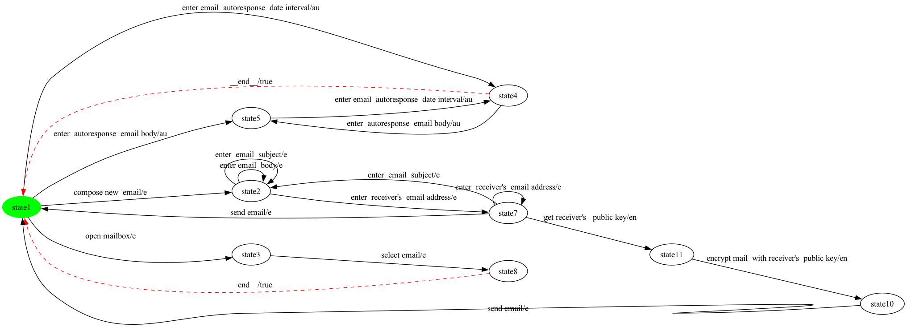

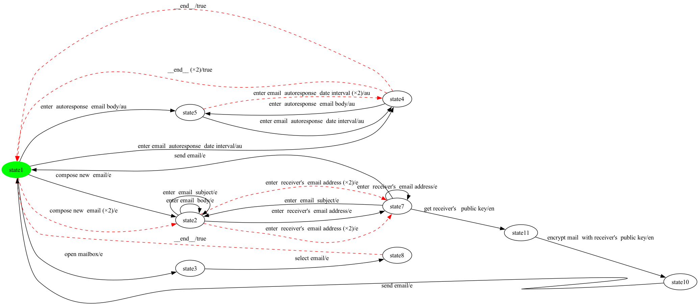

**All-transitions coverage on the repaired FTS:** **16/16 = 100.0%** (23 raw cycle step(s): 16 real, 3 `__end__`, 5 `__dup__`, 0 `__balance__`).

**Generated test cases** (5 trip(s) from initial back to initial, hidden synthetics removed):

- **test case 1**: `enter email autoresponse date interval -> enter autoresponse email body -> enter email autoresponse date interval`
- **test case 2**: `enter autoresponse email body -> enter email autoresponse date interval`
- **test case 3**: `open mailbox -> select email`
- **test case 4**: `compose new email -> enter receiver's email address -> send email`
- **test case 5**: `compose new email -> enter receiver's email address -> enter email subject -> enter email body -> enter email subject -> enter receiver's email address -> enter receiver's email address -> get receiver's public key -> encrypt mail with receiver's public key -> send email`

### Product 20

**Selected features:** selected = {e, f}

**Projected FTS:** 6 states, 12 transitions (11 real / 1 `__end__`).

**Repaired FTS (after `InitialSccFilter`):** 6 states, 12 transitions (11 real / 1 `__end__`).

**Balanced FTS:** 6 states, 18 transitions (11 real / 1 `__end__` / 6 `__dup__` / 0 `__balance__`).

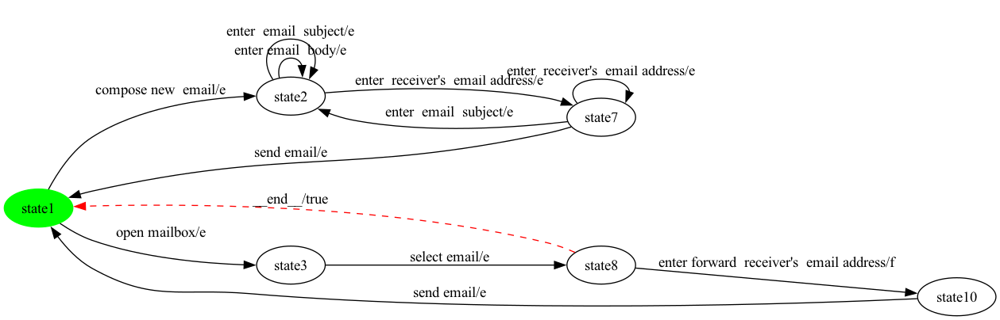

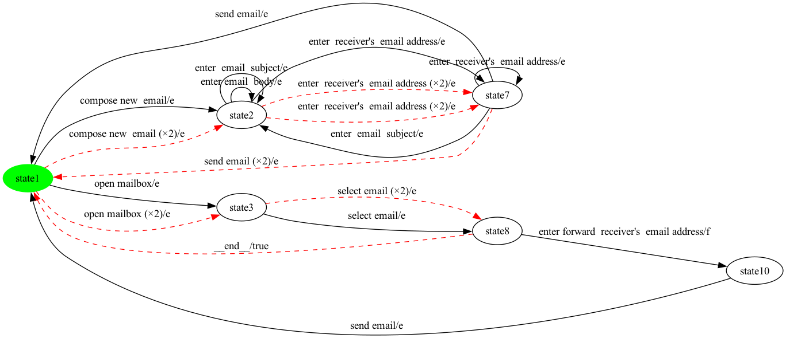

**All-transitions coverage on the repaired FTS:** **11/11 = 100.0%** (18 raw cycle step(s): 11 real, 1 `__end__`, 6 `__dup__`, 0 `__balance__`).

**Generated test cases** (4 trip(s) from initial back to initial, hidden synthetics removed):

- **test case 1**: `open mailbox -> select email -> enter forward receiver's email address -> send email`
- **test case 2**: `open mailbox -> select email`
- **test case 3**: `compose new email -> enter email body -> enter email subject -> enter receiver's email address -> send email`
- **test case 4**: `compose new email -> enter receiver's email address -> enter email subject -> enter receiver's email address -> enter receiver's email address -> send email`

### Product 21

**Selected features:** selected = {ad, e, en, s}

**Projected FTS:** 9 states, 18 transitions (17 real / 1 `__end__`).

**Repaired FTS (after `InitialSccFilter`):** 9 states, 18 transitions (17 real / 1 `__end__`).

**Balanced FTS:** 9 states, 27 transitions (17 real / 1 `__end__` / 9 `__dup__` / 0 `__balance__`).

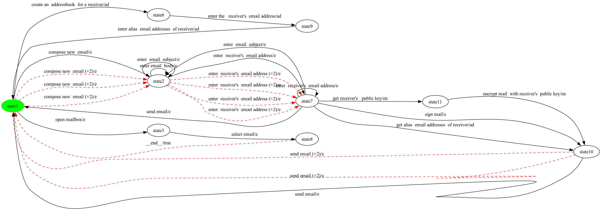

**All-transitions coverage on the repaired FTS:** **17/17 = 100.0%** (27 raw cycle step(s): 17 real, 1 `__end__`, 9 `__dup__`, 0 `__balance__`).

**Generated test cases** (6 trip(s) from initial back to initial, hidden synthetics removed):

- **test case 1**: `open mailbox -> select email`
- **test case 2**: `create an addressbook for a receiver -> enter the receiver's email address -> enter alias email addresses of receiver`
- **test case 3**: `compose new email -> enter receiver's email address -> send email`
- **test case 4**: `compose new email -> enter receiver's email address -> get receiver's public key -> encrypt mail with receiver's public key -> send email`
- **test case 5**: `compose new email -> enter receiver's email address -> sign mail -> send email`
- **test case 6**: `compose new email -> enter receiver's email address -> enter email subject -> enter email body -> enter email subject -> enter receiver's email address -> enter receiver's email address -> get alias email addresses of receiver -> send email`

### Product 22

**Selected features:** selected = {ad, au, e, s}

**Projected FTS:** 10 states, 21 transitions (19 real / 2 `__end__`).

**Repaired FTS (after `InitialSccFilter`):** 10 states, 21 transitions (19 real / 2 `__end__`).

**Balanced FTS:** 10 states, 29 transitions (19 real / 3 `__end__` / 8 `__dup__` / 0 `__balance__`).

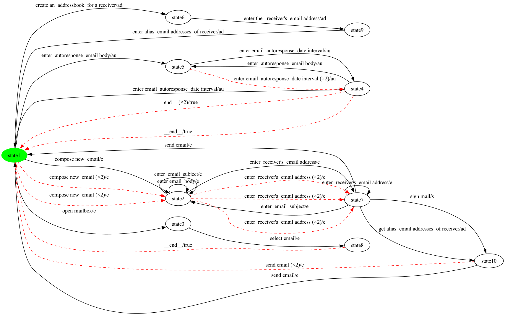

**All-transitions coverage on the repaired FTS:** **19/19 = 100.0%** (29 raw cycle step(s): 19 real, 3 `__end__`, 8 `__dup__`, 0 `__balance__`).

**Generated test cases** (7 trip(s) from initial back to initial, hidden synthetics removed):

- **test case 1**: `enter email autoresponse date interval -> enter autoresponse email body -> enter email autoresponse date interval`
- **test case 2**: `enter autoresponse email body -> enter email autoresponse date interval`
- **test case 3**: `open mailbox -> select email`
- **test case 4**: `create an addressbook for a receiver -> enter the receiver's email address -> enter alias email addresses of receiver`
- **test case 5**: `compose new email -> enter receiver's email address -> send email`
- **test case 6**: `compose new email -> enter receiver's email address -> sign mail -> send email`
- **test case 7**: `compose new email -> enter receiver's email address -> enter email subject -> enter email body -> enter email subject -> enter receiver's email address -> enter receiver's email address -> get alias email addresses of receiver -> send email`

### Product 23

**Selected features:** selected = {au, e, s}

**Projected FTS:** 8 states, 17 transitions (15 real / 2 `__end__`).

**Repaired FTS (after `InitialSccFilter`):** 8 states, 17 transitions (15 real / 2 `__end__`).

**Balanced FTS:** 8 states, 22 transitions (15 real / 3 `__end__` / 5 `__dup__` / 0 `__balance__`).

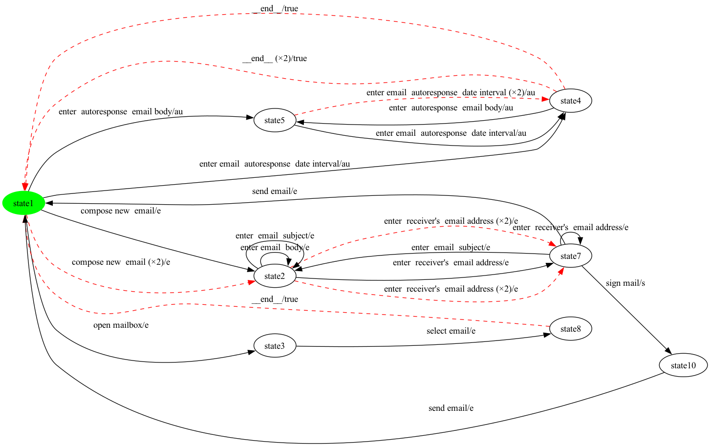

**All-transitions coverage on the repaired FTS:** **15/15 = 100.0%** (22 raw cycle step(s): 15 real, 3 `__end__`, 5 `__dup__`, 0 `__balance__`).

**Generated test cases** (5 trip(s) from initial back to initial, hidden synthetics removed):

- **test case 1**: `enter email autoresponse date interval -> enter autoresponse email body -> enter email autoresponse date interval`
- **test case 2**: `enter autoresponse email body -> enter email autoresponse date interval`
- **test case 3**: `open mailbox -> select email`
- **test case 4**: `compose new email -> enter receiver's email address -> send email`
- **test case 5**: `compose new email -> enter receiver's email address -> enter email subject -> enter email body -> enter email subject -> enter receiver's email address -> enter receiver's email address -> sign mail -> send email`

---

Total products: 23.
