# Per-Product Report — Elevator

Generated by PerProductReportGenerator. For each valid Elevator configuration enumerated by Sat4JSolverFacade, this report shows the projected + SCC-repaired product-level FTS plus the test suites generated for state, all-transitions, and all-transition-pairs coverage.

Action sequences are written as `a -> b -> c -> ...`. Synthetic balancing actions (prefix `__balance__`) are not present in the final test cases.

**Features actually labelling transitions in the SPL FTS** (filter applied below): `Alarm, CardReader, ControlButtons, ExecutiveFloor, FirefighterService, Intercom, ManualDoorControl, MobileKey, PinPad`. Abstract / grouping features that do not label any transition are omitted from the per-product feature lists.

---

## Product 1

**Selected features:** selected = {ControlButtons, ExecutiveFloor, Intercom, PinPad}

**Repaired FTS:** 8 states, 23 transitions

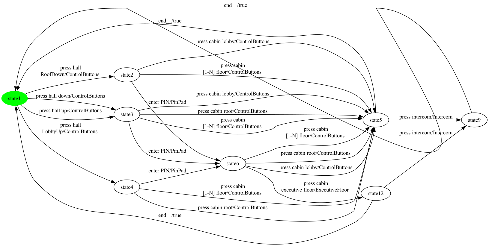

### State coverage (1 test case, 10 transitions)

```
press hall 
RoofDown -> enter PIN -> press cabin lobby -> press intercom -> __end__ -> press hall up -> enter PIN -> press cabin 
executive floor -> __end__ -> press hall 
LobbyUp
```

### All-transitions coverage (12 test cases, 20 transitions total)

- **`Elevator_p1_trans_seg0`**: `press hall 
RoofDown -> press cabin 
[1-N] floor -> press intercom`
- **`Elevator_p1_trans_seg1`**: `press cabin lobby`
- **`Elevator_p1_trans_seg2`**: `enter PIN -> press cabin lobby`
- **`Elevator_p1_trans_seg3`**: `press cabin 
[1-N] floor`
- **`Elevator_p1_trans_seg4`**: `press cabin roof`
- **`Elevator_p1_trans_seg5`**: `press hall up -> enter PIN -> press cabin 
executive floor -> press intercom`
- **`Elevator_p1_trans_seg6`**: `press hall down -> press cabin lobby`
- **`Elevator_p1_trans_seg7`**: `press cabin roof`
- **`Elevator_p1_trans_seg8`**: `press cabin 
[1-N] floor`
- **`Elevator_p1_trans_seg9`**: `press cabin roof`
- **`Elevator_p1_trans_seg10`**: `press cabin 
[1-N] floor`
- **`Elevator_p1_trans_seg11`**: `press hall 
LobbyUp -> enter PIN`

### All-transition-pairs coverage (32 test cases, 81 transitions total)

- **`Elevator_p1_pair_seg0`**: `press hall 
RoofDown`
- **`Elevator_p1_pair_seg1`**: `__end__ -> press hall down -> press cabin lobby`
- **`Elevator_p1_pair_seg2`**: `press hall 
RoofDown -> press cabin lobby -> press intercom`
- **`Elevator_p1_pair_seg3`**: `__end__ -> press hall 
RoofDown`
- **`Elevator_p1_pair_seg4`**: `enter PIN -> press cabin lobby -> press intercom`
- **`Elevator_p1_pair_seg5`**: `enter PIN -> press cabin 
[1-N] floor -> press intercom`
- **`Elevator_p1_pair_seg6`**: `__end__ -> press hall 
RoofDown`
- **`Elevator_p1_pair_seg7`**: `enter PIN -> press cabin 
executive floor`
- **`Elevator_p1_pair_seg8`**: `press hall 
LobbyUp -> press cabin roof`
- **`Elevator_p1_pair_seg9`**: `__end__ -> press hall 
LobbyUp`
- **`Elevator_p1_pair_seg10`**: `__end__ -> press hall up -> press cabin lobby -> press intercom`
- **`Elevator_p1_pair_seg11`**: `__end__ -> press hall up -> press cabin roof -> press intercom`
- **`Elevator_p1_pair_seg12`**: `__end__ -> press hall down -> press cabin roof`
- **`Elevator_p1_pair_seg13`**: `__end__ -> press hall 
RoofDown -> enter PIN -> press cabin roof`
- **`Elevator_p1_pair_seg14`**: `press cabin roof -> press intercom`
- **`Elevator_p1_pair_seg15`**: `press hall 
LobbyUp -> press cabin 
[1-N] floor`
- **`Elevator_p1_pair_seg16`**: `press hall 
RoofDown -> press cabin 
[1-N] floor -> press intercom`
- **`Elevator_p1_pair_seg17`**: `__end__ -> press hall 
LobbyUp`
- **`Elevator_p1_pair_seg18`**: `press cabin 
[1-N] floor -> press intercom`
- **`Elevator_p1_pair_seg19`**: `press hall down -> enter PIN -> press cabin 
[1-N] floor`
- **`Elevator_p1_pair_seg20`**: `press hall up -> enter PIN -> press cabin roof`
- **`Elevator_p1_pair_seg21`**: `enter PIN -> press cabin 
[1-N] floor`
- **`Elevator_p1_pair_seg22`**: `__end__ -> press hall 
LobbyUp`
- **`Elevator_p1_pair_seg23`**: `enter PIN -> press cabin 
executive floor`
- **`Elevator_p1_pair_seg24`**: `__end__ -> press hall down -> press cabin 
[1-N] floor`
- **`Elevator_p1_pair_seg25`**: `__end__ -> press hall up`
- **`Elevator_p1_pair_seg26`**: `enter PIN -> press cabin lobby`
- **`Elevator_p1_pair_seg27`**: `enter PIN -> press cabin 
executive floor -> press intercom`
- **`Elevator_p1_pair_seg28`**: `press hall 
LobbyUp -> enter PIN -> press cabin roof -> press intercom`
- **`Elevator_p1_pair_seg29`**: `press hall 
LobbyUp`
- **`Elevator_p1_pair_seg30`**: `enter PIN -> press cabin lobby`
- **`Elevator_p1_pair_seg31`**: `press hall up -> press cabin 
[1-N] floor -> press intercom`

## Product 2

**Selected features:** selected = {Alarm, ControlButtons, FirefighterService, ManualDoorControl}

**Repaired FTS:** 12 states, 30 transitions


### State coverage (1 test case, 15 transitions)

```
press hall 
RoofDown -> press cabin lobby -> press alarm
button -> press&hold 
door open -> release door open -> __end__ -> press hall up -> press cabin lobby -> press door open -> press door close -> __end__ -> press hall 
LobbyUp -> press cabin roof -> press&hold 
door close -> release door close
```

### All-transitions coverage (11 test cases, 24 transitions total)

- **`Elevator_p2_trans_seg0`**: `press&hold 
door open`
- **`Elevator_p2_trans_seg1`**: `press hall 
RoofDown`
- **`Elevator_p2_trans_seg2`**: `press alarm
button -> press&hold 
door close -> release door close`
- **`Elevator_p2_trans_seg3`**: `press cabin lobby`
- **`Elevator_p2_trans_seg4`**: `press cabin 
[1-N] floor -> press door open -> press door close`
- **`Elevator_p2_trans_seg5`**: `press cabin lobby -> press door close -> press door open`
- **`Elevator_p2_trans_seg6`**: `press hall up -> press cabin roof -> press&hold 
door open -> release door open -> press&hold 
door open`
- **`Elevator_p2_trans_seg7`**: `press hall down -> press cabin 
[1-N] floor -> press&hold 
door close`
- **`Elevator_p2_trans_seg8`**: `press&hold 
door close`
- **`Elevator_p2_trans_seg9`**: `press cabin roof`
- **`Elevator_p2_trans_seg10`**: `press hall 
LobbyUp -> press cabin 
[1-N] floor`

### All-transition-pairs coverage (66 test cases, 149 transitions total)

- **`Elevator_p2_pair_seg0`**: `press hall up`
- **`Elevator_p2_pair_seg1`**: `press cabin roof -> press&hold 
door open`
- **`Elevator_p2_pair_seg2`**: `release door open -> press&hold 
door open -> release door open`
- **`Elevator_p2_pair_seg3`**: `__end__ -> press hall up`
- **`Elevator_p2_pair_seg4`**: `press cabin roof -> press door open -> press door close -> press door open`
- **`Elevator_p2_pair_seg5`**: `__end__ -> press hall down -> press cabin lobby -> press&hold 
door close`
- **`Elevator_p2_pair_seg6`**: `__end__ -> press hall down -> press cabin roof`
- **`Elevator_p2_pair_seg7`**: `press cabin lobby -> press&hold 
door close`
- **`Elevator_p2_pair_seg8`**: `__end__ -> press hall 
LobbyUp`
- **`Elevator_p2_pair_seg9`**: `press cabin 
[1-N] floor -> press&hold 
door close`
- **`Elevator_p2_pair_seg10`**: `press hall 
LobbyUp -> press cabin 
[1-N] floor -> press door open`
- **`Elevator_p2_pair_seg11`**: `__end__ -> press hall up`
- **`Elevator_p2_pair_seg12`**: `press cabin roof -> press&hold 
door close -> release door close`
- **`Elevator_p2_pair_seg13`**: `press cabin 
[1-N] floor -> press door close -> press door open -> press door close`
- **`Elevator_p2_pair_seg14`**: `press cabin lobby -> press&hold 
door open`
- **`Elevator_p2_pair_seg15`**: `__end__ -> press hall down -> press cabin 
[1-N] floor -> press door open`
- **`Elevator_p2_pair_seg16`**: `__end__ -> press hall 
RoofDown -> press cabin lobby`
- **`Elevator_p2_pair_seg17`**: `press cabin 
[1-N] floor -> press&hold 
door open`
- **`Elevator_p2_pair_seg18`**: `__end__ -> press hall 
LobbyUp`
- **`Elevator_p2_pair_seg19`**: `press cabin 
[1-N] floor -> press alarm
button`
- **`Elevator_p2_pair_seg20`**: `press&hold 
door open -> release door open`
- **`Elevator_p2_pair_seg21`**: `press hall 
LobbyUp -> press cabin roof`
- **`Elevator_p2_pair_seg22`**: `press cabin lobby -> press door open`
- **`Elevator_p2_pair_seg23`**: `press cabin lobby -> press alarm
button -> press&hold 
door open`
- **`Elevator_p2_pair_seg24`**: `press alarm
button -> press&hold 
door close -> release door close`
- **`Elevator_p2_pair_seg25`**: `__end__ -> press hall 
RoofDown`
- **`Elevator_p2_pair_seg26`**: `__end__ -> press hall down`
- **`Elevator_p2_pair_seg27`**: `press cabin 
[1-N] floor -> press alarm
button`
- **`Elevator_p2_pair_seg28`**: `__end__ -> press hall 
RoofDown`
- **`Elevator_p2_pair_seg29`**: `__end__ -> press hall 
RoofDown`
- **`Elevator_p2_pair_seg30`**: `__end__ -> press hall 
LobbyUp`
- **`Elevator_p2_pair_seg31`**: `press hall up -> press cabin roof -> press door close`
- **`Elevator_p2_pair_seg32`**: `__end__ -> press hall up`
- **`Elevator_p2_pair_seg33`**: `press cabin roof -> press alarm
button`
- **`Elevator_p2_pair_seg34`**: `__end__ -> press hall up -> press cabin lobby -> press door open`
- **`Elevator_p2_pair_seg35`**: `press cabin lobby -> press alarm
button`
- **`Elevator_p2_pair_seg36`**: `__end__ -> press hall 
LobbyUp`
- **`Elevator_p2_pair_seg37`**: `press cabin roof -> press alarm
button`
- **`Elevator_p2_pair_seg38`**: `press hall 
LobbyUp`
- **`Elevator_p2_pair_seg39`**: `press cabin roof -> press door open`
- **`Elevator_p2_pair_seg40`**: `__end__ -> press hall 
LobbyUp`
- **`Elevator_p2_pair_seg41`**: `press cabin roof -> press&hold 
door close`
- **`Elevator_p2_pair_seg42`**: `__end__ -> press hall down`
- **`Elevator_p2_pair_seg43`**: `press cabin lobby -> press door close`
- **`Elevator_p2_pair_seg44`**: `press cabin lobby -> press&hold 
door open`
- **`Elevator_p2_pair_seg45`**: `press cabin 
[1-N] floor -> press&hold 
door close`
- **`Elevator_p2_pair_seg46`**: `press hall up -> press cabin 
[1-N] floor`
- **`Elevator_p2_pair_seg47`**: `press cabin lobby -> press door close`
- **`Elevator_p2_pair_seg48`**: `press cabin 
[1-N] floor -> press&hold 
door open`
- **`Elevator_p2_pair_seg49`**: `press cabin 
[1-N] floor -> press door close`
- **`Elevator_p2_pair_seg50`**: `__end__ -> press hall 
RoofDown`
- **`Elevator_p2_pair_seg51`**: `press cabin 
[1-N] floor -> press door open`
- **`Elevator_p2_pair_seg52`**: `press cabin roof -> press&hold 
door open -> release door open`
- **`Elevator_p2_pair_seg53`**: `__end__ -> press hall 
RoofDown`
- **`Elevator_p2_pair_seg54`**: `press cabin 
[1-N] floor -> press&hold 
door close`
- **`Elevator_p2_pair_seg55`**: `release door close -> press&hold 
door close -> release door close`
- **`Elevator_p2_pair_seg56`**: `__end__ -> press hall up`
- **`Elevator_p2_pair_seg57`**: `press cabin 
[1-N] floor -> press door close`
- **`Elevator_p2_pair_seg58`**: `__end__ -> press hall 
LobbyUp`
- **`Elevator_p2_pair_seg59`**: `press cabin roof -> press door close`
- **`Elevator_p2_pair_seg60`**: `__end__ -> press hall up`
- **`Elevator_p2_pair_seg61`**: `__end__ -> press hall down`
- **`Elevator_p2_pair_seg62`**: `press hall 
RoofDown`
- **`Elevator_p2_pair_seg63`**: `press cabin 
[1-N] floor -> press&hold 
door open`
- **`Elevator_p2_pair_seg64`**: `press hall 
RoofDown -> press cabin 
[1-N] floor -> press alarm
button`
- **`Elevator_p2_pair_seg65`**: `press hall down`

## Product 3

**Selected features:** selected = {Alarm, ControlButtons, FirefighterService}

**Repaired FTS:** 10 states, 24 transitions


### State coverage (1 test case, 12 transitions)

```
press hall 
RoofDown -> press cabin lobby -> press alarm
button -> press&hold 
door open -> release door open -> __end__ -> press hall up -> press cabin lobby -> press&hold 
door close -> release door close -> __end__ -> press hall 
LobbyUp
```

### All-transitions coverage (12 test cases, 20 transitions total)

- **`Elevator_p3_trans_seg0`**: `press&hold 
door close -> release door close`
- **`Elevator_p3_trans_seg1`**: `press hall 
RoofDown`
- **`Elevator_p3_trans_seg2`**: `press alarm
button`
- **`Elevator_p3_trans_seg3`**: `press&hold 
door open`
- **`Elevator_p3_trans_seg4`**: `press cabin 
[1-N] floor`
- **`Elevator_p3_trans_seg5`**: `press cabin lobby -> press&hold 
door open -> release door open -> press&hold 
door open`
- **`Elevator_p3_trans_seg6`**: `press hall up -> press cabin lobby`
- **`Elevator_p3_trans_seg7`**: `press hall down -> press cabin roof -> press&hold 
door close`
- **`Elevator_p3_trans_seg8`**: `press&hold 
door close`
- **`Elevator_p3_trans_seg9`**: `press cabin 
[1-N] floor`
- **`Elevator_p3_trans_seg10`**: `press cabin roof`
- **`Elevator_p3_trans_seg11`**: `press hall 
LobbyUp -> press cabin 
[1-N] floor`

### All-transition-pairs coverage (37 test cases, 94 transitions total)

- **`Elevator_p3_pair_seg0`**: `press hall 
RoofDown`
- **`Elevator_p3_pair_seg1`**: `press cabin lobby -> press alarm
button -> press&hold 
door close -> release door close`
- **`Elevator_p3_pair_seg2`**: `__end__ -> press hall 
LobbyUp -> press cabin roof`
- **`Elevator_p3_pair_seg3`**: `__end__ -> press hall down -> press cabin lobby -> press&hold 
door close`
- **`Elevator_p3_pair_seg4`**: `press cabin roof -> press alarm
button -> press&hold 
door open -> release door open -> press&hold 
door open -> release door open`
- **`Elevator_p3_pair_seg5`**: `__end__ -> press hall up -> press cabin lobby`
- **`Elevator_p3_pair_seg6`**: `press cabin roof -> press&hold 
door close`
- **`Elevator_p3_pair_seg7`**: `press cabin roof -> press&hold 
door open`
- **`Elevator_p3_pair_seg8`**: `__end__ -> press hall down`
- **`Elevator_p3_pair_seg9`**: `press cabin roof -> press&hold 
door open`
- **`Elevator_p3_pair_seg10`**: `press cabin 
[1-N] floor -> press&hold 
door open`
- **`Elevator_p3_pair_seg11`**: `__end__ -> press hall 
LobbyUp`
- **`Elevator_p3_pair_seg12`**: `press cabin lobby -> press&hold 
door close`
- **`Elevator_p3_pair_seg13`**: `__end__ -> press hall 
RoofDown -> press cabin lobby`
- **`Elevator_p3_pair_seg14`**: `press cabin lobby -> press&hold 
door open`
- **`Elevator_p3_pair_seg15`**: `press cabin 
[1-N] floor -> press&hold 
door open -> release door open`
- **`Elevator_p3_pair_seg16`**: `__end__ -> press hall 
RoofDown`
- **`Elevator_p3_pair_seg17`**: `press hall down`
- **`Elevator_p3_pair_seg18`**: `press cabin 
[1-N] floor -> press alarm
button`
- **`Elevator_p3_pair_seg19`**: `__end__ -> press hall 
RoofDown`
- **`Elevator_p3_pair_seg20`**: `press cabin 
[1-N] floor -> press&hold 
door close -> release door close`
- **`Elevator_p3_pair_seg21`**: `__end__ -> press hall 
RoofDown -> press cabin 
[1-N] floor`
- **`Elevator_p3_pair_seg22`**: `__end__ -> press hall 
LobbyUp -> press cabin 
[1-N] floor -> press&hold 
door close`
- **`Elevator_p3_pair_seg23`**: `__end__ -> press hall down -> press cabin roof -> press&hold 
door close`
- **`Elevator_p3_pair_seg24`**: `__end__ -> press hall up`
- **`Elevator_p3_pair_seg25`**: `press cabin lobby -> press alarm
button`
- **`Elevator_p3_pair_seg26`**: `__end__ -> press hall up`
- **`Elevator_p3_pair_seg27`**: `press cabin lobby -> press&hold 
door open`
- **`Elevator_p3_pair_seg28`**: `press hall up -> press cabin roof -> press alarm
button`
- **`Elevator_p3_pair_seg29`**: `__end__ -> press hall up -> press cabin 
[1-N] floor -> press&hold 
door close`
- **`Elevator_p3_pair_seg30`**: `release door close -> press&hold 
door close -> release door close`
- **`Elevator_p3_pair_seg31`**: `press cabin 
[1-N] floor -> press alarm
button`
- **`Elevator_p3_pair_seg32`**: `__end__ -> press hall down -> press cabin 
[1-N] floor`
- **`Elevator_p3_pair_seg33`**: `press cabin 
[1-N] floor -> press&hold 
door open`
- **`Elevator_p3_pair_seg34`**: `press hall 
LobbyUp`
- **`Elevator_p3_pair_seg35`**: `press cabin 
[1-N] floor -> press alarm
button`
- **`Elevator_p3_pair_seg36`**: `__end__ -> press hall 
LobbyUp`

## Product 4

**Selected features:** selected = {ControlButtons, ExecutiveFloor, Intercom, MobileKey}

**Repaired FTS:** 8 states, 23 transitions

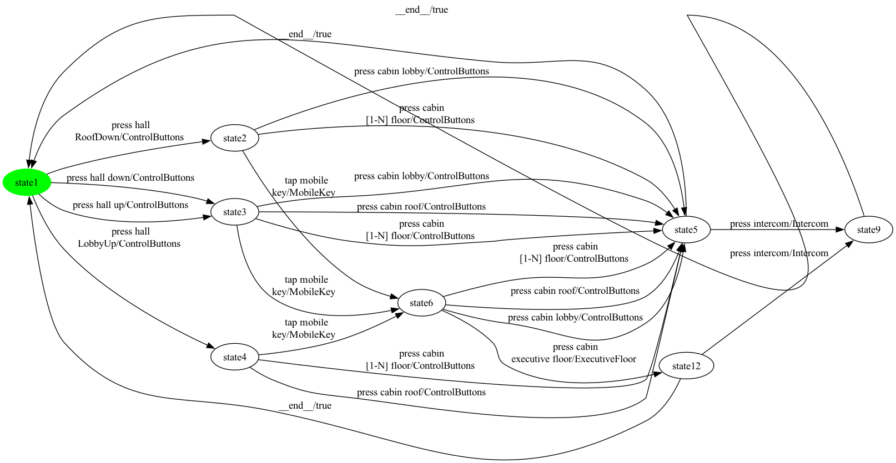

### State coverage (1 test case, 9 transitions)

```
press hall 
RoofDown -> press cabin lobby -> press intercom -> __end__ -> press hall up -> tap mobile
key -> press cabin 
executive floor -> __end__ -> press hall 
LobbyUp
```

### All-transitions coverage (12 test cases, 20 transitions total)

- **`Elevator_p4_trans_seg0`**: `press hall 
RoofDown -> tap mobile
key -> press cabin lobby -> press intercom`
- **`Elevator_p4_trans_seg1`**: `press cabin 
[1-N] floor`
- **`Elevator_p4_trans_seg2`**: `press cabin roof`
- **`Elevator_p4_trans_seg3`**: `press cabin 
[1-N] floor`
- **`Elevator_p4_trans_seg4`**: `press cabin lobby`
- **`Elevator_p4_trans_seg5`**: `press hall up -> press cabin lobby`
- **`Elevator_p4_trans_seg6`**: `press hall down -> press cabin roof`
- **`Elevator_p4_trans_seg7`**: `press cabin 
[1-N] floor`
- **`Elevator_p4_trans_seg8`**: `tap mobile
key -> press cabin 
executive floor -> press intercom`
- **`Elevator_p4_trans_seg9`**: `press cabin roof`
- **`Elevator_p4_trans_seg10`**: `press cabin 
[1-N] floor`
- **`Elevator_p4_trans_seg11`**: `press hall 
LobbyUp -> tap mobile
key`

### All-transition-pairs coverage (33 test cases, 82 transitions total)

- **`Elevator_p4_pair_seg0`**: `press hall 
RoofDown -> press cabin lobby`
- **`Elevator_p4_pair_seg1`**: `__end__ -> press hall down -> press cabin lobby`
- **`Elevator_p4_pair_seg2`**: `press cabin lobby -> press intercom`
- **`Elevator_p4_pair_seg3`**: `press cabin 
[1-N] floor -> press intercom`
- **`Elevator_p4_pair_seg4`**: `__end__ -> press hall 
RoofDown`
- **`Elevator_p4_pair_seg5`**: `press hall 
RoofDown -> press cabin 
[1-N] floor`
- **`Elevator_p4_pair_seg6`**: `tap mobile
key -> press cabin roof`
- **`Elevator_p4_pair_seg7`**: `tap mobile
key -> press cabin lobby -> press intercom`
- **`Elevator_p4_pair_seg8`**: `__end__ -> press hall up -> press cabin lobby -> press intercom`
- **`Elevator_p4_pair_seg9`**: `press hall up -> press cabin roof -> press intercom`
- **`Elevator_p4_pair_seg10`**: `__end__ -> press hall down -> press cabin roof`
- **`Elevator_p4_pair_seg11`**: `__end__ -> press hall 
RoofDown`
- **`Elevator_p4_pair_seg12`**: `tap mobile
key -> press cabin 
[1-N] floor -> press intercom`
- **`Elevator_p4_pair_seg13`**: `__end__ -> press hall 
LobbyUp -> press cabin roof`
- **`Elevator_p4_pair_seg14`**: `__end__ -> press hall 
RoofDown`
- **`Elevator_p4_pair_seg15`**: `press cabin roof -> press intercom`
- **`Elevator_p4_pair_seg16`**: `press hall down -> press cabin 
[1-N] floor`
- **`Elevator_p4_pair_seg17`**: `press hall 
RoofDown -> tap mobile
key -> press cabin 
executive floor`
- **`Elevator_p4_pair_seg18`**: `__end__ -> press hall 
LobbyUp`
- **`Elevator_p4_pair_seg19`**: `tap mobile
key -> press cabin 
[1-N] floor`
- **`Elevator_p4_pair_seg20`**: `__end__ -> press hall up -> press cabin 
[1-N] floor -> press intercom`
- **`Elevator_p4_pair_seg21`**: `press hall up`
- **`Elevator_p4_pair_seg22`**: `tap mobile
key -> press cabin 
[1-N] floor`
- **`Elevator_p4_pair_seg23`**: `press hall 
LobbyUp -> tap mobile
key -> press cabin roof`
- **`Elevator_p4_pair_seg24`**: `__end__ -> press hall 
LobbyUp`
- **`Elevator_p4_pair_seg25`**: `tap mobile
key -> press cabin lobby`
- **`Elevator_p4_pair_seg26`**: `tap mobile
key -> press cabin 
executive floor`
- **`Elevator_p4_pair_seg27`**: `__end__ -> press hall down -> tap mobile
key -> press cabin roof -> press intercom`
- **`Elevator_p4_pair_seg28`**: `press hall 
LobbyUp -> press cabin 
[1-N] floor`
- **`Elevator_p4_pair_seg29`**: `__end__ -> press hall up`
- **`Elevator_p4_pair_seg30`**: `tap mobile
key -> press cabin lobby`
- **`Elevator_p4_pair_seg31`**: `press hall up -> tap mobile
key -> press cabin 
executive floor -> press intercom`
- **`Elevator_p4_pair_seg32`**: `press cabin 
[1-N] floor -> press intercom`

## Product 5

**Selected features:** selected = {Alarm, ControlButtons, FirefighterService, Intercom, ManualDoorControl}

**Repaired FTS:** 12 states, 31 transitions


### State coverage (1 test case, 15 transitions)

```
press hall 
RoofDown -> press cabin lobby -> press intercom -> press&hold 
door open -> release door open -> __end__ -> press hall up -> press cabin lobby -> press door open -> press door close -> __end__ -> press hall 
LobbyUp -> press cabin roof -> press&hold 
door close -> release door close
```

### All-transitions coverage (12 test cases, 25 transitions total)

- **`Elevator_p5_trans_seg0`**: `press intercom -> press&hold 
door open -> release door open`
- **`Elevator_p5_trans_seg1`**: `press hall 
RoofDown`
- **`Elevator_p5_trans_seg2`**: `press alarm
button -> press&hold 
door close -> release door close`
- **`Elevator_p5_trans_seg3`**: `press cabin lobby`
- **`Elevator_p5_trans_seg4`**: `press cabin 
[1-N] floor -> press door open -> press door close`
- **`Elevator_p5_trans_seg5`**: `press hall up -> press cabin lobby -> press door close -> press door open`
- **`Elevator_p5_trans_seg6`**: `press cabin roof -> press&hold 
door open`
- **`Elevator_p5_trans_seg7`**: `press&hold 
door open`
- **`Elevator_p5_trans_seg8`**: `press hall down -> press cabin 
[1-N] floor`
- **`Elevator_p5_trans_seg9`**: `press cabin roof -> press&hold 
door close`
- **`Elevator_p5_trans_seg10`**: `press&hold 
door close`
- **`Elevator_p5_trans_seg11`**: `press hall 
LobbyUp -> press cabin 
[1-N] floor`

### All-transition-pairs coverage (71 test cases, 163 transitions total)

- **`Elevator_p5_pair_seg0`**: `press hall up`
- **`Elevator_p5_pair_seg1`**: `press cabin roof -> press&hold 
door open`
- **`Elevator_p5_pair_seg2`**: `release door open -> press&hold 
door open -> release door open`
- **`Elevator_p5_pair_seg3`**: `__end__ -> press hall up`
- **`Elevator_p5_pair_seg4`**: `press cabin roof -> press intercom -> press&hold 
door open -> release door open`
- **`Elevator_p5_pair_seg5`**: `__end__ -> press hall down -> press cabin lobby -> press&hold 
door close`
- **`Elevator_p5_pair_seg6`**: `__end__ -> press hall 
LobbyUp`
- **`Elevator_p5_pair_seg7`**: `__end__ -> press hall down`
- **`Elevator_p5_pair_seg8`**: `press cabin roof -> press door open -> press door close -> press door open`
- **`Elevator_p5_pair_seg9`**: `__end__ -> press hall down -> press cabin roof`
- **`Elevator_p5_pair_seg10`**: `press cabin lobby -> press&hold 
door close`
- **`Elevator_p5_pair_seg11`**: `press cabin 
[1-N] floor -> press&hold 
door close`
- **`Elevator_p5_pair_seg12`**: `press cabin 
[1-N] floor -> press door open`
- **`Elevator_p5_pair_seg13`**: `__end__ -> press hall up`
- **`Elevator_p5_pair_seg14`**: `press cabin roof -> press&hold 
door close -> release door close`
- **`Elevator_p5_pair_seg15`**: `__end__ -> press hall 
RoofDown`
- **`Elevator_p5_pair_seg16`**: `press hall 
LobbyUp -> press cabin 
[1-N] floor -> press door close -> press door open -> press door close`
- **`Elevator_p5_pair_seg17`**: `press cabin lobby -> press&hold 
door open`
- **`Elevator_p5_pair_seg18`**: `__end__ -> press hall 
LobbyUp`
- **`Elevator_p5_pair_seg19`**: `press cabin 
[1-N] floor -> press&hold 
door open`
- **`Elevator_p5_pair_seg20`**: `press cabin 
[1-N] floor -> press intercom -> press&hold 
door close -> release door close`
- **`Elevator_p5_pair_seg21`**: `press cabin 
[1-N] floor -> press alarm
button -> press&hold 
door open`
- **`Elevator_p5_pair_seg22`**: `press hall 
LobbyUp -> press cabin roof`
- **`Elevator_p5_pair_seg23`**: `press hall 
RoofDown -> press cabin lobby -> press intercom`
- **`Elevator_p5_pair_seg24`**: `__end__ -> press hall down -> press cabin 
[1-N] floor -> press door open`
- **`Elevator_p5_pair_seg25`**: `__end__ -> press hall 
RoofDown`
- **`Elevator_p5_pair_seg26`**: `__end__ -> press hall 
RoofDown`
- **`Elevator_p5_pair_seg27`**: `__end__ -> press hall up -> press cabin roof -> press door close`
- **`Elevator_p5_pair_seg28`**: `press cabin lobby -> press door open`
- **`Elevator_p5_pair_seg29`**: `press cabin lobby -> press alarm
button`
- **`Elevator_p5_pair_seg30`**: `__end__ -> press hall 
RoofDown`
- **`Elevator_p5_pair_seg31`**: `__end__ -> press hall 
LobbyUp`
- **`Elevator_p5_pair_seg32`**: `press cabin roof -> press alarm
button -> press&hold 
door close`
- **`Elevator_p5_pair_seg33`**: `__end__ -> press hall down`
- **`Elevator_p5_pair_seg34`**: `press cabin 
[1-N] floor -> press alarm
button`
- **`Elevator_p5_pair_seg35`**: `press hall up -> press cabin lobby -> press door open`
- **`Elevator_p5_pair_seg36`**: `__end__ -> press hall up`
- **`Elevator_p5_pair_seg37`**: `press cabin lobby -> press alarm
button`
- **`Elevator_p5_pair_seg38`**: `press hall 
LobbyUp`
- **`Elevator_p5_pair_seg39`**: `press cabin lobby -> press intercom`
- **`Elevator_p5_pair_seg40`**: `press cabin roof -> press alarm
button`
- **`Elevator_p5_pair_seg41`**: `press hall 
RoofDown`
- **`Elevator_p5_pair_seg42`**: `press cabin lobby -> press door close`
- **`Elevator_p5_pair_seg43`**: `press cabin lobby -> press&hold 
door open`
- **`Elevator_p5_pair_seg44`**: `press cabin lobby -> press door close`
- **`Elevator_p5_pair_seg45`**: `press cabin 
[1-N] floor -> press&hold 
door open`
- **`Elevator_p5_pair_seg46`**: `press cabin 
[1-N] floor -> press door close`
- **`Elevator_p5_pair_seg47`**: `press cabin 
[1-N] floor -> press door open`
- **`Elevator_p5_pair_seg48`**: `press cabin 
[1-N] floor -> press&hold 
door close`
- **`Elevator_p5_pair_seg49`**: `press cabin 
[1-N] floor -> press&hold 
door close`
- **`Elevator_p5_pair_seg50`**: `press hall up -> press cabin 
[1-N] floor`
- **`Elevator_p5_pair_seg51`**: `__end__ -> press hall up`
- **`Elevator_p5_pair_seg52`**: `__end__ -> press hall 
RoofDown`
- **`Elevator_p5_pair_seg53`**: `press cabin 
[1-N] floor -> press alarm
button`
- **`Elevator_p5_pair_seg54`**: `press hall down`
- **`Elevator_p5_pair_seg55`**: `__end__ -> press hall 
LobbyUp`
- **`Elevator_p5_pair_seg56`**: `press cabin roof -> press door open`
- **`Elevator_p5_pair_seg57`**: `__end__ -> press hall 
LobbyUp`
- **`Elevator_p5_pair_seg58`**: `press cabin roof -> press intercom`
- **`Elevator_p5_pair_seg59`**: `press cabin roof -> press&hold 
door close`
- **`Elevator_p5_pair_seg60`**: `release door close -> press&hold 
door close -> release door close`
- **`Elevator_p5_pair_seg61`**: `press cabin 
[1-N] floor -> press door close`
- **`Elevator_p5_pair_seg62`**: `__end__ -> press hall up`
- **`Elevator_p5_pair_seg63`**: `press cabin 
[1-N] floor -> press intercom`
- **`Elevator_p5_pair_seg64`**: `__end__ -> press hall 
LobbyUp`
- **`Elevator_p5_pair_seg65`**: `press cabin roof -> press&hold 
door open -> release door open`
- **`Elevator_p5_pair_seg66`**: `__end__ -> press hall 
RoofDown -> press cabin 
[1-N] floor`
- **`Elevator_p5_pair_seg67`**: `press cabin 
[1-N] floor -> press&hold 
door open`
- **`Elevator_p5_pair_seg68`**: `press cabin 
[1-N] floor -> press intercom`
- **`Elevator_p5_pair_seg69`**: `press cabin roof -> press door close`
- **`Elevator_p5_pair_seg70`**: `__end__ -> press hall down`

## Product 6

**Selected features:** selected = {ControlButtons, ExecutiveFloor, Intercom, ManualDoorControl, PinPad}

**Repaired FTS:** 10 states, 31 transitions

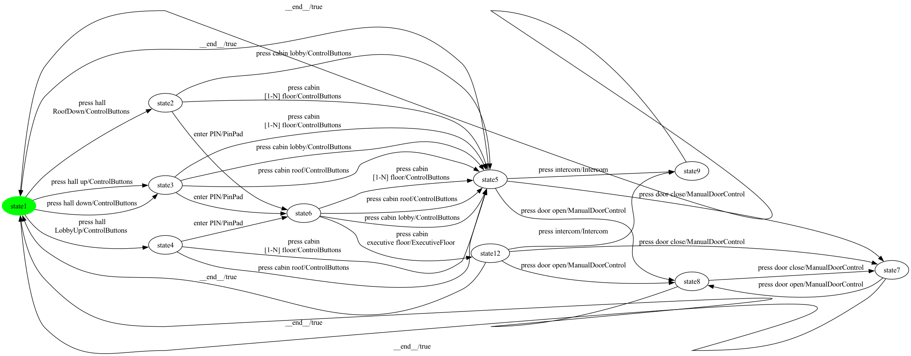

### State coverage (1 test case, 13 transitions)

```
press hall 
RoofDown -> enter PIN -> press cabin lobby -> press intercom -> __end__ -> press hall up -> press cabin lobby -> press door open -> press door close -> __end__ -> press hall 
LobbyUp -> enter PIN -> press cabin 
executive floor
```

### All-transitions coverage (15 test cases, 26 transitions total)

- **`Elevator_p6_trans_seg0`**: `press hall 
RoofDown -> enter PIN -> press cabin lobby -> press intercom`
- **`Elevator_p6_trans_seg1`**: `press cabin 
[1-N] floor -> press door open -> press door close`
- **`Elevator_p6_trans_seg2`**: `press cabin roof -> press door close`
- **`Elevator_p6_trans_seg3`**: `press cabin 
executive floor -> press door close -> press door open`
- **`Elevator_p6_trans_seg4`**: `press door open`
- **`Elevator_p6_trans_seg5`**: `press cabin lobby`
- **`Elevator_p6_trans_seg6`**: `press cabin 
[1-N] floor`
- **`Elevator_p6_trans_seg7`**: `press cabin lobby`
- **`Elevator_p6_trans_seg8`**: `press hall up -> press cabin roof`
- **`Elevator_p6_trans_seg9`**: `press hall down -> press cabin 
[1-N] floor`
- **`Elevator_p6_trans_seg10`**: `enter PIN`
- **`Elevator_p6_trans_seg11`**: `press intercom`
- **`Elevator_p6_trans_seg12`**: `press cabin roof`
- **`Elevator_p6_trans_seg13`**: `press cabin 
[1-N] floor`
- **`Elevator_p6_trans_seg14`**: `press hall 
LobbyUp -> enter PIN`

### All-transition-pairs coverage (59 test cases, 144 transitions total)

- **`Elevator_p6_pair_seg0`**: `press hall up`
- **`Elevator_p6_pair_seg1`**: `press cabin roof -> press intercom`
- **`Elevator_p6_pair_seg2`**: `__end__ -> press hall down -> press cabin lobby -> press door open -> press door close -> press door open`
- **`Elevator_p6_pair_seg3`**: `__end__ -> press hall down -> press cabin roof -> press door open`
- **`Elevator_p6_pair_seg4`**: `__end__ -> press hall down`
- **`Elevator_p6_pair_seg5`**: `enter PIN -> press cabin lobby -> press door close -> press door open`
- **`Elevator_p6_pair_seg6`**: `__end__ -> press hall up -> press cabin roof -> press door close`
- **`Elevator_p6_pair_seg7`**: `press cabin lobby -> press intercom`
- **`Elevator_p6_pair_seg8`**: `__end__ -> press hall 
RoofDown`
- **`Elevator_p6_pair_seg9`**: `press hall 
RoofDown -> press cabin lobby`
- **`Elevator_p6_pair_seg10`**: `enter PIN -> press cabin 
executive floor -> press intercom`
- **`Elevator_p6_pair_seg11`**: `press cabin lobby -> press door open`
- **`Elevator_p6_pair_seg12`**: `__end__ -> press hall 
RoofDown`
- **`Elevator_p6_pair_seg13`**: `press cabin lobby -> press door close`
- **`Elevator_p6_pair_seg14`**: `enter PIN -> press cabin lobby -> press door open`
- **`Elevator_p6_pair_seg15`**: `press cabin lobby -> press intercom`
- **`Elevator_p6_pair_seg16`**: `press hall up -> enter PIN`
- **`Elevator_p6_pair_seg17`**: `__end__ -> press hall 
LobbyUp`
- **`Elevator_p6_pair_seg18`**: `enter PIN -> press cabin 
[1-N] floor -> press intercom`
- **`Elevator_p6_pair_seg19`**: `press hall up -> press cabin lobby`
- **`Elevator_p6_pair_seg20`**: `__end__ -> press hall 
RoofDown`
- **`Elevator_p6_pair_seg21`**: `enter PIN -> press cabin roof -> press door close`
- **`Elevator_p6_pair_seg22`**: `press cabin roof -> press intercom`
- **`Elevator_p6_pair_seg23`**: `press cabin lobby -> press intercom`
- **`Elevator_p6_pair_seg24`**: `__end__ -> press hall up`
- **`Elevator_p6_pair_seg25`**: `press cabin lobby -> press door close`
- **`Elevator_p6_pair_seg26`**: `__end__ -> press hall up`
- **`Elevator_p6_pair_seg27`**: `press cabin 
[1-N] floor -> press door open`
- **`Elevator_p6_pair_seg28`**: `__end__ -> press hall 
RoofDown -> enter PIN -> press cabin 
executive floor`
- **`Elevator_p6_pair_seg29`**: `__end__ -> press hall down -> enter PIN -> press cabin 
[1-N] floor -> press door close`
- **`Elevator_p6_pair_seg30`**: `press cabin 
executive floor -> press door open`
- **`Elevator_p6_pair_seg31`**: `press door open -> press door close`
- **`Elevator_p6_pair_seg32`**: `press cabin 
[1-N] floor -> press door close`
- **`Elevator_p6_pair_seg33`**: `__end__ -> press hall 
RoofDown`
- **`Elevator_p6_pair_seg34`**: `press cabin 
[1-N] floor -> press door open`
- **`Elevator_p6_pair_seg35`**: `__end__ -> press hall 
LobbyUp`
- **`Elevator_p6_pair_seg36`**: `press cabin 
[1-N] floor -> press door open`
- **`Elevator_p6_pair_seg37`**: `press hall 
LobbyUp -> press cabin 
[1-N] floor -> press door close`
- **`Elevator_p6_pair_seg38`**: `press cabin 
[1-N] floor -> press intercom`
- **`Elevator_p6_pair_seg39`**: `press hall 
RoofDown -> press cabin 
[1-N] floor`
- **`Elevator_p6_pair_seg40`**: `__end__ -> press hall 
LobbyUp -> press cabin roof`
- **`Elevator_p6_pair_seg41`**: `__end__ -> press hall up -> press cabin 
[1-N] floor`
- **`Elevator_p6_pair_seg42`**: `press hall 
LobbyUp`
- **`Elevator_p6_pair_seg43`**: `press cabin roof -> press door open`
- **`Elevator_p6_pair_seg44`**: `press cabin roof -> press intercom`
- **`Elevator_p6_pair_seg45`**: `press cabin roof -> press door close`
- **`Elevator_p6_pair_seg46`**: `__end__ -> press hall 
LobbyUp`
- **`Elevator_p6_pair_seg47`**: `press hall 
RoofDown`
- **`Elevator_p6_pair_seg48`**: `press cabin 
[1-N] floor -> press intercom`
- **`Elevator_p6_pair_seg49`**: `__end__ -> press hall 
LobbyUp -> enter PIN -> press cabin 
[1-N] floor -> press door open`
- **`Elevator_p6_pair_seg50`**: `enter PIN -> press cabin roof`
- **`Elevator_p6_pair_seg51`**: `press hall down`
- **`Elevator_p6_pair_seg52`**: `enter PIN -> press cabin roof -> press door open`
- **`Elevator_p6_pair_seg53`**: `press door close -> press door open -> press door close`
- **`Elevator_p6_pair_seg54`**: `enter PIN -> press cabin 
executive floor -> press door close`
- **`Elevator_p6_pair_seg55`**: `__end__ -> press hall up`
- **`Elevator_p6_pair_seg56`**: `press cabin 
[1-N] floor -> press door close`
- **`Elevator_p6_pair_seg57`**: `__end__ -> press hall down -> press cabin 
[1-N] floor -> press intercom`
- **`Elevator_p6_pair_seg58`**: `enter PIN -> press cabin lobby`

## Product 7

**Selected features:** selected = {Alarm, ControlButtons, ManualDoorControl, PinPad}

**Repaired FTS:** 9 states, 26 transitions


### State coverage (1 test case, 11 transitions)

```
press hall 
RoofDown -> enter PIN -> press cabin lobby -> press alarm
button -> __end__ -> press hall up -> press cabin lobby -> press door open -> press door close -> __end__ -> press hall 
LobbyUp
```

### All-transitions coverage (10 test cases, 22 transitions total)

- **`Elevator_p7_trans_seg0`**: `enter PIN -> press cabin lobby -> press alarm
button`
- **`Elevator_p7_trans_seg1`**: `press hall 
RoofDown -> press cabin lobby -> press door open -> press door close`
- **`Elevator_p7_trans_seg2`**: `press cabin 
[1-N] floor -> press door close -> press door open`
- **`Elevator_p7_trans_seg3`**: `press hall up -> press cabin lobby`
- **`Elevator_p7_trans_seg4`**: `press cabin roof`
- **`Elevator_p7_trans_seg5`**: `press hall down -> press cabin 
[1-N] floor`
- **`Elevator_p7_trans_seg6`**: `enter PIN -> press cabin 
[1-N] floor`
- **`Elevator_p7_trans_seg7`**: `press cabin roof`
- **`Elevator_p7_trans_seg8`**: `press hall 
LobbyUp -> press cabin 
[1-N] floor`
- **`Elevator_p7_trans_seg9`**: `enter PIN -> press cabin roof`

### All-transition-pairs coverage (53 test cases, 126 transitions total)

- **`Elevator_p7_pair_seg0`**: `press hall 
RoofDown`
- **`Elevator_p7_pair_seg1`**: `press door open -> press door close -> press door open`
- **`Elevator_p7_pair_seg2`**: `__end__ -> press hall 
RoofDown`
- **`Elevator_p7_pair_seg3`**: `press cabin lobby -> press door open`
- **`Elevator_p7_pair_seg4`**: `press hall 
RoofDown -> press cabin lobby`
- **`Elevator_p7_pair_seg5`**: `__end__ -> press hall 
RoofDown`
- **`Elevator_p7_pair_seg6`**: `press cabin lobby -> press alarm
button`
- **`Elevator_p7_pair_seg7`**: `__end__ -> press hall down -> press cabin lobby -> press door open`
- **`Elevator_p7_pair_seg8`**: `press door close -> press door open -> press door close`
- **`Elevator_p7_pair_seg9`**: `press cabin lobby -> press door close`
- **`Elevator_p7_pair_seg10`**: `enter PIN -> press cabin lobby -> press door open`
- **`Elevator_p7_pair_seg11`**: `enter PIN -> press cabin 
[1-N] floor -> press door close`
- **`Elevator_p7_pair_seg12`**: `press cabin 
[1-N] floor -> press alarm
button`
- **`Elevator_p7_pair_seg13`**: `enter PIN -> press cabin roof`
- **`Elevator_p7_pair_seg14`**: `__end__ -> press hall 
RoofDown -> enter PIN`
- **`Elevator_p7_pair_seg15`**: `press cabin roof -> press alarm
button`
- **`Elevator_p7_pair_seg16`**: `press cabin 
[1-N] floor -> press door close`
- **`Elevator_p7_pair_seg17`**: `press cabin 
[1-N] floor -> press alarm
button`
- **`Elevator_p7_pair_seg18`**: `press hall up -> press cabin lobby -> press alarm
button`
- **`Elevator_p7_pair_seg19`**: `press hall 
LobbyUp -> press cabin roof`
- **`Elevator_p7_pair_seg20`**: `__end__ -> press hall 
LobbyUp`
- **`Elevator_p7_pair_seg21`**: `press cabin roof -> press alarm
button`
- **`Elevator_p7_pair_seg22`**: `press cabin lobby -> press door close`
- **`Elevator_p7_pair_seg23`**: `press hall 
RoofDown -> press cabin 
[1-N] floor -> press door open`
- **`Elevator_p7_pair_seg24`**: `__end__ -> press hall down -> press cabin roof`
- **`Elevator_p7_pair_seg25`**: `__end__ -> press hall up`
- **`Elevator_p7_pair_seg26`**: `press cabin roof -> press door open`
- **`Elevator_p7_pair_seg27`**: `press cabin roof -> press door close`
- **`Elevator_p7_pair_seg28`**: `__end__ -> press hall 
RoofDown`
- **`Elevator_p7_pair_seg29`**: `press hall up -> press cabin roof -> press alarm
button`
- **`Elevator_p7_pair_seg30`**: `__end__ -> press hall up`
- **`Elevator_p7_pair_seg31`**: `enter PIN -> press cabin 
[1-N] floor -> press door open`
- **`Elevator_p7_pair_seg32`**: `__end__ -> press hall up -> enter PIN -> press cabin roof -> press door close`
- **`Elevator_p7_pair_seg33`**: `press cabin roof -> press door open`
- **`Elevator_p7_pair_seg34`**: `press hall up -> press cabin 
[1-N] floor -> press door open`
- **`Elevator_p7_pair_seg35`**: `__end__ -> press hall 
LobbyUp`
- **`Elevator_p7_pair_seg36`**: `press cabin roof -> press door close`
- **`Elevator_p7_pair_seg37`**: `__end__ -> press hall 
LobbyUp`
- **`Elevator_p7_pair_seg38`**: `press cabin 
[1-N] floor -> press door close`
- **`Elevator_p7_pair_seg39`**: `press hall down -> enter PIN -> press cabin lobby -> press door close`
- **`Elevator_p7_pair_seg40`**: `__end__ -> press hall down -> press cabin 
[1-N] floor`
- **`Elevator_p7_pair_seg41`**: `press hall 
LobbyUp -> press cabin 
[1-N] floor -> press alarm
button`
- **`Elevator_p7_pair_seg42`**: `press cabin 
[1-N] floor -> press alarm
button`
- **`Elevator_p7_pair_seg43`**: `__end__ -> press hall down`
- **`Elevator_p7_pair_seg44`**: `press hall up`
- **`Elevator_p7_pair_seg45`**: `press cabin 
[1-N] floor -> press door close`
- **`Elevator_p7_pair_seg46`**: `__end__ -> press hall up`
- **`Elevator_p7_pair_seg47`**: `press hall 
LobbyUp`
- **`Elevator_p7_pair_seg48`**: `press cabin 
[1-N] floor -> press door open`
- **`Elevator_p7_pair_seg49`**: `enter PIN -> press cabin roof -> press door open`
- **`Elevator_p7_pair_seg50`**: `press hall 
LobbyUp -> enter PIN -> press cabin lobby -> press alarm
button`
- **`Elevator_p7_pair_seg51`**: `__end__ -> press hall 
LobbyUp`
- **`Elevator_p7_pair_seg52`**: `enter PIN -> press cabin 
[1-N] floor`

## Product 8

**Selected features:** selected = {ControlButtons, FirefighterService, Intercom, ManualDoorControl}

**Repaired FTS:** 12 states, 30 transitions

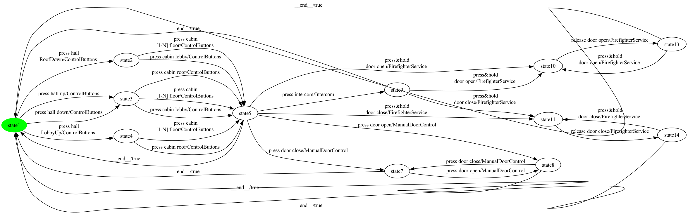

### State coverage (1 test case, 15 transitions)

```
press hall 
RoofDown -> press cabin lobby -> press intercom -> press&hold 
door open -> release door open -> __end__ -> press hall up -> press cabin lobby -> press door open -> press door close -> __end__ -> press hall 
LobbyUp -> press cabin roof -> press&hold 
door close -> release door close
```

### All-transitions coverage (11 test cases, 24 transitions total)

- **`Elevator_p8_trans_seg0`**: `press&hold 
door open`
- **`Elevator_p8_trans_seg1`**: `press hall 
RoofDown`
- **`Elevator_p8_trans_seg2`**: `press&hold 
door close -> release door close`
- **`Elevator_p8_trans_seg3`**: `press cabin lobby -> press intercom`
- **`Elevator_p8_trans_seg4`**: `press cabin 
[1-N] floor -> press door open -> press door close`
- **`Elevator_p8_trans_seg5`**: `press cabin lobby -> press door close -> press door open`
- **`Elevator_p8_trans_seg6`**: `press hall up -> press cabin roof -> press&hold 
door open -> release door open -> press&hold 
door open`
- **`Elevator_p8_trans_seg7`**: `press hall down -> press cabin 
[1-N] floor -> press&hold 
door close`
- **`Elevator_p8_trans_seg8`**: `press&hold 
door close`
- **`Elevator_p8_trans_seg9`**: `press cabin roof`
- **`Elevator_p8_trans_seg10`**: `press hall 
LobbyUp -> press cabin 
[1-N] floor`

### All-transition-pairs coverage (63 test cases, 146 transitions total)

- **`Elevator_p8_pair_seg0`**: `press hall up`
- **`Elevator_p8_pair_seg1`**: `press cabin roof -> press&hold 
door open`
- **`Elevator_p8_pair_seg2`**: `release door open -> press&hold 
door open -> release door open`
- **`Elevator_p8_pair_seg3`**: `__end__ -> press hall up`
- **`Elevator_p8_pair_seg4`**: `press cabin roof -> press intercom -> press&hold 
door open -> release door open`
- **`Elevator_p8_pair_seg5`**: `__end__ -> press hall down -> press cabin lobby -> press&hold 
door close`
- **`Elevator_p8_pair_seg6`**: `__end__ -> press hall down -> press cabin roof -> press door open -> press door close -> press door open`
- **`Elevator_p8_pair_seg7`**: `__end__ -> press hall down -> press cabin 
[1-N] floor -> press door open`
- **`Elevator_p8_pair_seg8`**: `__end__ -> press hall up`
- **`Elevator_p8_pair_seg9`**: `press hall 
RoofDown -> press cabin lobby -> press&hold 
door close`
- **`Elevator_p8_pair_seg10`**: `__end__ -> press hall 
LobbyUp`
- **`Elevator_p8_pair_seg11`**: `press cabin 
[1-N] floor -> press&hold 
door close`
- **`Elevator_p8_pair_seg12`**: `press hall 
LobbyUp -> press cabin 
[1-N] floor -> press door open`
- **`Elevator_p8_pair_seg13`**: `__end__ -> press hall 
RoofDown`
- **`Elevator_p8_pair_seg14`**: `press cabin 
[1-N] floor -> press door close -> press door open -> press door close`
- **`Elevator_p8_pair_seg15`**: `press cabin lobby -> press&hold 
door open`
- **`Elevator_p8_pair_seg16`**: `__end__ -> press hall 
LobbyUp`
- **`Elevator_p8_pair_seg17`**: `press cabin 
[1-N] floor -> press&hold 
door open`
- **`Elevator_p8_pair_seg18`**: `press cabin 
[1-N] floor -> press intercom -> press&hold 
door close -> release door close`
- **`Elevator_p8_pair_seg19`**: `__end__ -> press hall 
RoofDown`
- **`Elevator_p8_pair_seg20`**: `press cabin lobby -> press intercom`
- **`Elevator_p8_pair_seg21`**: `__end__ -> press hall down`
- **`Elevator_p8_pair_seg22`**: `__end__ -> press hall 
RoofDown`
- **`Elevator_p8_pair_seg23`**: `press cabin lobby -> press door open`
- **`Elevator_p8_pair_seg24`**: `press hall 
LobbyUp -> press cabin roof`
- **`Elevator_p8_pair_seg25`**: `__end__ -> press hall 
RoofDown`
- **`Elevator_p8_pair_seg26`**: `__end__ -> press hall 
LobbyUp`
- **`Elevator_p8_pair_seg27`**: `__end__ -> press hall 
LobbyUp`
- **`Elevator_p8_pair_seg28`**: `press hall up -> press cabin roof -> press&hold 
door close -> release door close`
- **`Elevator_p8_pair_seg29`**: `__end__ -> press hall down`
- **`Elevator_p8_pair_seg30`**: `press cabin roof -> press door close`
- **`Elevator_p8_pair_seg31`**: `press cabin lobby -> press door close`
- **`Elevator_p8_pair_seg32`**: `__end__ -> press hall 
RoofDown`
- **`Elevator_p8_pair_seg33`**: `press cabin 
[1-N] floor -> press&hold 
door open`
- **`Elevator_p8_pair_seg34`**: `__end__ -> press hall up -> press cabin lobby -> press door open`
- **`Elevator_p8_pair_seg35`**: `press cabin lobby -> press intercom`
- **`Elevator_p8_pair_seg36`**: `press cabin lobby -> press door close`
- **`Elevator_p8_pair_seg37`**: `press cabin 
[1-N] floor -> press door close`
- **`Elevator_p8_pair_seg38`**: `__end__ -> press hall 
LobbyUp`
- **`Elevator_p8_pair_seg39`**: `press cabin lobby -> press&hold 
door open`
- **`Elevator_p8_pair_seg40`**: `press cabin 
[1-N] floor -> press door open`
- **`Elevator_p8_pair_seg41`**: `press cabin roof -> press door open`
- **`Elevator_p8_pair_seg42`**: `press cabin roof -> press intercom`
- **`Elevator_p8_pair_seg43`**: `__end__ -> press hall up`
- **`Elevator_p8_pair_seg44`**: `press cabin 
[1-N] floor -> press&hold 
door close`
- **`Elevator_p8_pair_seg45`**: `press hall up -> press cabin 
[1-N] floor`
- **`Elevator_p8_pair_seg46`**: `press cabin 
[1-N] floor -> press door close`
- **`Elevator_p8_pair_seg47`**: `__end__ -> press hall up`
- **`Elevator_p8_pair_seg48`**: `press cabin 
[1-N] floor -> press intercom`
- **`Elevator_p8_pair_seg49`**: `press cabin roof -> press&hold 
door close`
- **`Elevator_p8_pair_seg50`**: `__end__ -> press hall up`
- **`Elevator_p8_pair_seg51`**: `press cabin 
[1-N] floor -> press&hold 
door open`
- **`Elevator_p8_pair_seg52`**: `press cabin 
[1-N] floor -> press&hold 
door close`
- **`Elevator_p8_pair_seg53`**: `release door close -> press&hold 
door close -> release door close`
- **`Elevator_p8_pair_seg54`**: `press&hold 
door open -> release door open`
- **`Elevator_p8_pair_seg55`**: `__end__ -> press hall 
RoofDown -> press cabin 
[1-N] floor -> press intercom`
- **`Elevator_p8_pair_seg56`**: `__end__ -> press hall 
LobbyUp`
- **`Elevator_p8_pair_seg57`**: `press cabin roof -> press&hold 
door open`
- **`Elevator_p8_pair_seg58`**: `press hall 
LobbyUp`
- **`Elevator_p8_pair_seg59`**: `press cabin roof -> press door close`
- **`Elevator_p8_pair_seg60`**: `__end__ -> press hall down`
- **`Elevator_p8_pair_seg61`**: `press hall 
RoofDown`
- **`Elevator_p8_pair_seg62`**: `press hall down`

## Product 9

**Selected features:** selected = {Alarm, ControlButtons, Intercom, MobileKey}

**Repaired FTS:** 7 states, 21 transitions

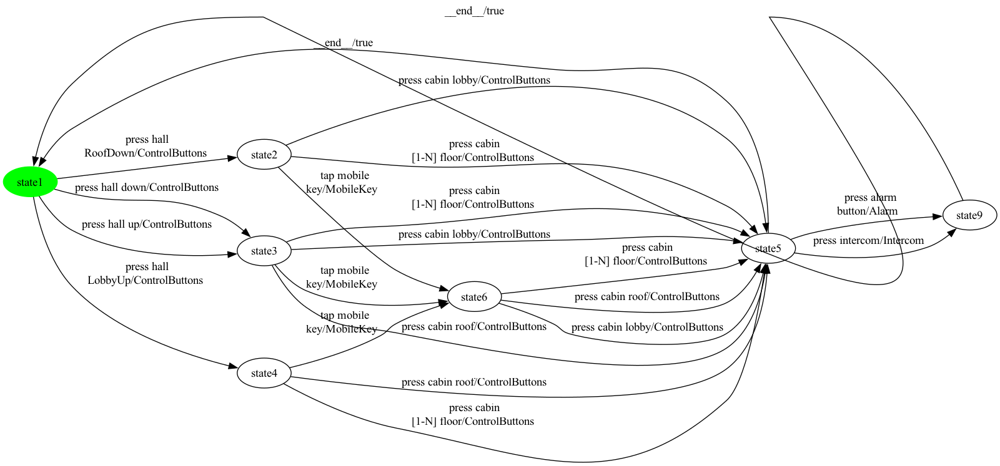

### State coverage (1 test case, 9 transitions)

```
press hall 
RoofDown -> press cabin lobby -> press intercom -> __end__ -> press hall up -> tap mobile
key -> press cabin lobby -> __end__ -> press hall 
LobbyUp
```

### All-transitions coverage (10 test cases, 19 transitions total)

- **`Elevator_p9_trans_seg0`**: `tap mobile
key -> press cabin lobby -> press intercom`
- **`Elevator_p9_trans_seg1`**: `press cabin 
[1-N] floor -> press alarm
button`
- **`Elevator_p9_trans_seg2`**: `press hall 
RoofDown -> press cabin lobby`
- **`Elevator_p9_trans_seg3`**: `press cabin lobby`
- **`Elevator_p9_trans_seg4`**: `press hall up -> press cabin roof`
- **`Elevator_p9_trans_seg5`**: `press hall down -> press cabin 
[1-N] floor`
- **`Elevator_p9_trans_seg6`**: `tap mobile
key -> press cabin 
[1-N] floor`
- **`Elevator_p9_trans_seg7`**: `press cabin roof`
- **`Elevator_p9_trans_seg8`**: `press hall 
LobbyUp -> press cabin 
[1-N] floor`
- **`Elevator_p9_trans_seg9`**: `tap mobile
key -> press cabin roof`

### All-transition-pairs coverage (34 test cases, 85 transitions total)

- **`Elevator_p9_pair_seg0`**: `press hall 
RoofDown`
- **`Elevator_p9_pair_seg1`**: `press cabin lobby -> press alarm
button`
- **`Elevator_p9_pair_seg2`**: `press hall 
RoofDown -> press cabin lobby`
- **`Elevator_p9_pair_seg3`**: `__end__ -> press hall down -> press cabin lobby -> press alarm
button`
- **`Elevator_p9_pair_seg4`**: `__end__ -> press hall 
RoofDown`
- **`Elevator_p9_pair_seg5`**: `press cabin lobby -> press intercom`
- **`Elevator_p9_pair_seg6`**: `press cabin 
[1-N] floor -> press alarm
button`
- **`Elevator_p9_pair_seg7`**: `press cabin 
[1-N] floor -> press intercom`
- **`Elevator_p9_pair_seg8`**: `press hall up -> press cabin lobby`
- **`Elevator_p9_pair_seg9`**: `press hall 
RoofDown -> press cabin 
[1-N] floor`
- **`Elevator_p9_pair_seg10`**: `press cabin lobby -> press intercom`
- **`Elevator_p9_pair_seg11`**: `press cabin roof -> press intercom`
- **`Elevator_p9_pair_seg12`**: `__end__ -> press hall up -> press cabin roof`
- **`Elevator_p9_pair_seg13`**: `__end__ -> press hall 
RoofDown`
- **`Elevator_p9_pair_seg14`**: `tap mobile
key -> press cabin roof`
- **`Elevator_p9_pair_seg15`**: `press hall 
RoofDown -> tap mobile
key -> press cabin lobby -> press intercom`
- **`Elevator_p9_pair_seg16`**: `__end__ -> press hall down -> press cabin roof -> press alarm
button`
- **`Elevator_p9_pair_seg17`**: `press hall down -> press cabin 
[1-N] floor -> press alarm
button`
- **`Elevator_p9_pair_seg18`**: `press hall 
LobbyUp -> press cabin roof`
- **`Elevator_p9_pair_seg19`**: `tap mobile
key -> press cabin 
[1-N] floor -> press intercom`
- **`Elevator_p9_pair_seg20`**: `press cabin roof -> press alarm
button`
- **`Elevator_p9_pair_seg21`**: `press cabin roof -> press intercom`
- **`Elevator_p9_pair_seg22`**: `tap mobile
key -> press cabin 
[1-N] floor -> press alarm
button`
- **`Elevator_p9_pair_seg23`**: `press hall down -> tap mobile
key -> press cabin 
[1-N] floor`
- **`Elevator_p9_pair_seg24`**: `__end__ -> press hall 
LobbyUp -> tap mobile
key -> press cabin roof -> press alarm
button`
- **`Elevator_p9_pair_seg25`**: `press hall up -> press cabin 
[1-N] floor`
- **`Elevator_p9_pair_seg26`**: `__end__ -> press hall up`
- **`Elevator_p9_pair_seg27`**: `press cabin 
[1-N] floor -> press intercom`
- **`Elevator_p9_pair_seg28`**: `__end__ -> press hall 
LobbyUp`
- **`Elevator_p9_pair_seg29`**: `tap mobile
key -> press cabin lobby`
- **`Elevator_p9_pair_seg30`**: `tap mobile
key -> press cabin roof -> press intercom`
- **`Elevator_p9_pair_seg31`**: `press hall up -> tap mobile
key -> press cabin lobby -> press alarm
button`
- **`Elevator_p9_pair_seg32`**: `press hall 
LobbyUp -> press cabin 
[1-N] floor -> press intercom`
- **`Elevator_p9_pair_seg33`**: `press cabin 
[1-N] floor -> press alarm
button`

## Product 10

**Selected features:** selected = {ControlButtons, ExecutiveFloor, Intercom, ManualDoorControl, MobileKey}

**Repaired FTS:** 10 states, 31 transitions


### State coverage (1 test case, 11 transitions)

```
press hall 
RoofDown -> press cabin lobby -> press intercom -> __end__ -> press hall up -> tap mobile
key -> press cabin 
executive floor -> press door close -> press door open -> __end__ -> press hall 
LobbyUp
```

### All-transitions coverage (15 test cases, 26 transitions total)

- **`Elevator_p10_trans_seg0`**: `press hall 
RoofDown -> press cabin lobby -> press intercom`
- **`Elevator_p10_trans_seg1`**: `press cabin 
[1-N] floor -> press door open -> press door close`
- **`Elevator_p10_trans_seg2`**: `tap mobile
key -> press cabin lobby -> press door close`
- **`Elevator_p10_trans_seg3`**: `press cabin 
[1-N] floor`
- **`Elevator_p10_trans_seg4`**: `press cabin roof`
- **`Elevator_p10_trans_seg5`**: `press cabin 
executive floor -> press door close -> press door open`
- **`Elevator_p10_trans_seg6`**: `press door open`
- **`Elevator_p10_trans_seg7`**: `tap mobile
key`
- **`Elevator_p10_trans_seg8`**: `press intercom`
- **`Elevator_p10_trans_seg9`**: `press hall up -> press cabin lobby`
- **`Elevator_p10_trans_seg10`**: `press hall down -> press cabin roof`
- **`Elevator_p10_trans_seg11`**: `press cabin 
[1-N] floor`
- **`Elevator_p10_trans_seg12`**: `press cabin roof`
- **`Elevator_p10_trans_seg13`**: `press cabin 
[1-N] floor`
- **`Elevator_p10_trans_seg14`**: `press hall 
LobbyUp -> tap mobile
key`

### All-transition-pairs coverage (60 test cases, 145 transitions total)

- **`Elevator_p10_pair_seg0`**: `press hall up`
- **`Elevator_p10_pair_seg1`**: `press cabin roof -> press intercom`
- **`Elevator_p10_pair_seg2`**: `__end__ -> press hall down -> press cabin lobby -> press door open -> press door close -> press door open`
- **`Elevator_p10_pair_seg3`**: `__end__ -> press hall down -> tap mobile
key -> press cabin 
[1-N] floor -> press intercom`
- **`Elevator_p10_pair_seg4`**: `__end__ -> press hall 
RoofDown`
- **`Elevator_p10_pair_seg5`**: `press cabin lobby -> press intercom`
- **`Elevator_p10_pair_seg6`**: `press cabin roof -> press door open`
- **`Elevator_p10_pair_seg7`**: `press hall up -> press cabin roof`
- **`Elevator_p10_pair_seg8`**: `__end__ -> press hall down`
- **`Elevator_p10_pair_seg9`**: `tap mobile
key -> press cabin lobby -> press door close -> press door open`
- **`Elevator_p10_pair_seg10`**: `__end__ -> press hall up`
- **`Elevator_p10_pair_seg11`**: `tap mobile
key -> press cabin roof -> press door close`
- **`Elevator_p10_pair_seg12`**: `press hall up -> tap mobile
key -> press cabin 
executive floor -> press intercom`
- **`Elevator_p10_pair_seg13`**: `__end__ -> press hall up`
- **`Elevator_p10_pair_seg14`**: `__end__ -> press hall 
LobbyUp`
- **`Elevator_p10_pair_seg15`**: `tap mobile
key -> press cabin 
[1-N] floor -> press door close`
- **`Elevator_p10_pair_seg16`**: `press hall 
RoofDown -> press cabin lobby`
- **`Elevator_p10_pair_seg17`**: `press hall up -> press cabin lobby`
- **`Elevator_p10_pair_seg18`**: `press cabin lobby -> press door open`
- **`Elevator_p10_pair_seg19`**: `__end__ -> press hall 
RoofDown`
- **`Elevator_p10_pair_seg20`**: `press cabin lobby -> press door close`
- **`Elevator_p10_pair_seg21`**: `press cabin 
[1-N] floor -> press door close`
- **`Elevator_p10_pair_seg22`**: `press cabin 
[1-N] floor -> press door open`
- **`Elevator_p10_pair_seg23`**: `press hall 
RoofDown -> press cabin 
[1-N] floor -> press intercom`
- **`Elevator_p10_pair_seg24`**: `press cabin lobby -> press intercom`
- **`Elevator_p10_pair_seg25`**: `__end__ -> press hall 
RoofDown`
- **`Elevator_p10_pair_seg26`**: `tap mobile
key -> press cabin roof -> press intercom`
- **`Elevator_p10_pair_seg27`**: `press hall 
LobbyUp -> tap mobile
key -> press cabin lobby -> press door open`
- **`Elevator_p10_pair_seg28`**: `tap mobile
key -> press cabin lobby -> press intercom`
- **`Elevator_p10_pair_seg29`**: `__end__ -> press hall up`
- **`Elevator_p10_pair_seg30`**: `press cabin lobby -> press door close`
- **`Elevator_p10_pair_seg31`**: `press hall 
RoofDown -> tap mobile
key`
- **`Elevator_p10_pair_seg32`**: `tap mobile
key -> press cabin 
[1-N] floor -> press door open`
- **`Elevator_p10_pair_seg33`**: `__end__ -> press hall 
RoofDown`
- **`Elevator_p10_pair_seg34`**: `__end__ -> press hall down -> press cabin roof -> press door close`
- **`Elevator_p10_pair_seg35`**: `press cabin 
executive floor -> press door open`
- **`Elevator_p10_pair_seg36`**: `__end__ -> press hall 
LobbyUp`
- **`Elevator_p10_pair_seg37`**: `tap mobile
key -> press cabin 
executive floor`
- **`Elevator_p10_pair_seg38`**: `press door open -> press door close`
- **`Elevator_p10_pair_seg39`**: `__end__ -> press hall 
RoofDown`
- **`Elevator_p10_pair_seg40`**: `tap mobile
key -> press cabin 
executive floor`
- **`Elevator_p10_pair_seg41`**: `press door close -> press door open -> press door close`
- **`Elevator_p10_pair_seg42`**: `__end__ -> press hall 
LobbyUp`
- **`Elevator_p10_pair_seg43`**: `tap mobile
key -> press cabin roof -> press door open`
- **`Elevator_p10_pair_seg44`**: `__end__ -> press hall 
LobbyUp -> press cabin 
[1-N] floor -> press door open`
- **`Elevator_p10_pair_seg45`**: `press cabin 
[1-N] floor -> press door close`
- **`Elevator_p10_pair_seg46`**: `press cabin 
[1-N] floor -> press door open`
- **`Elevator_p10_pair_seg47`**: `press cabin 
[1-N] floor -> press intercom`
- **`Elevator_p10_pair_seg48`**: `__end__ -> press hall 
LobbyUp -> press cabin roof`
- **`Elevator_p10_pair_seg49`**: `__end__ -> press hall up -> press cabin 
[1-N] floor`
- **`Elevator_p10_pair_seg50`**: `press hall 
LobbyUp`
- **`Elevator_p10_pair_seg51`**: `press cabin roof -> press door open`
- **`Elevator_p10_pair_seg52`**: `press cabin roof -> press intercom`
- **`Elevator_p10_pair_seg53`**: `press cabin roof -> press door close`
- **`Elevator_p10_pair_seg54`**: `press hall 
RoofDown`
- **`Elevator_p10_pair_seg55`**: `press cabin 
executive floor -> press door close`
- **`Elevator_p10_pair_seg56`**: `press hall down -> press cabin 
[1-N] floor -> press door close`
- **`Elevator_p10_pair_seg57`**: `__end__ -> press hall up`
- **`Elevator_p10_pair_seg58`**: `press cabin 
[1-N] floor -> press intercom`
- **`Elevator_p10_pair_seg59`**: `__end__ -> press hall down`

## Product 11

**Selected features:** selected = {Alarm, CardReader, ControlButtons, Intercom}

**Repaired FTS:** 7 states, 21 transitions

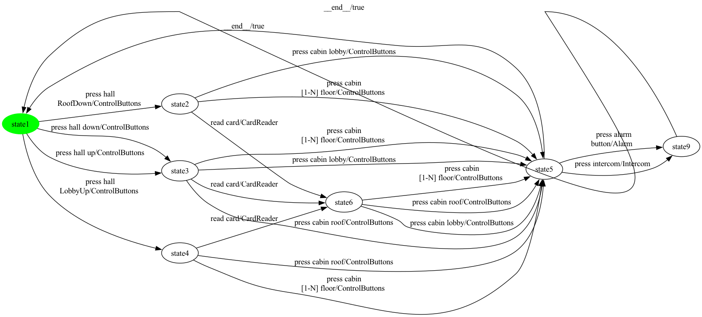

### State coverage (1 test case, 9 transitions)

```
press hall 
RoofDown -> press cabin lobby -> press intercom -> __end__ -> press hall up -> read card -> press cabin lobby -> __end__ -> press hall 
LobbyUp
```

### All-transitions coverage (10 test cases, 19 transitions total)

- **`Elevator_p11_trans_seg0`**: `press cabin 
[1-N] floor -> press intercom`
- **`Elevator_p11_trans_seg1`**: `press cabin lobby -> press alarm
button`
- **`Elevator_p11_trans_seg2`**: `press hall 
RoofDown -> read card -> press cabin lobby`
- **`Elevator_p11_trans_seg3`**: `read card -> press cabin 
[1-N] floor`
- **`Elevator_p11_trans_seg4`**: `press hall up -> press cabin lobby`
- **`Elevator_p11_trans_seg5`**: `press hall down -> press cabin roof`
- **`Elevator_p11_trans_seg6`**: `press cabin 
[1-N] floor`
- **`Elevator_p11_trans_seg7`**: `press cabin roof`
- **`Elevator_p11_trans_seg8`**: `press hall 
LobbyUp -> press cabin 
[1-N] floor`
- **`Elevator_p11_trans_seg9`**: `read card -> press cabin roof`

### All-transition-pairs coverage (36 test cases, 87 transitions total)

- **`Elevator_p11_pair_seg0`**: `press hall 
RoofDown`
- **`Elevator_p11_pair_seg1`**: `read card -> press cabin 
[1-N] floor -> press intercom`
- **`Elevator_p11_pair_seg2`**: `read card -> press cabin lobby -> press intercom`
- **`Elevator_p11_pair_seg3`**: `__end__ -> press hall 
RoofDown -> read card -> press cabin roof`
- **`Elevator_p11_pair_seg4`**: `__end__ -> press hall down -> press cabin lobby -> press alarm
button`
- **`Elevator_p11_pair_seg5`**: `press cabin lobby -> press alarm
button`
- **`Elevator_p11_pair_seg6`**: `press hall 
RoofDown -> press cabin lobby -> press intercom`
- **`Elevator_p11_pair_seg7`**: `press cabin 
[1-N] floor -> press alarm
button`
- **`Elevator_p11_pair_seg8`**: `press hall up -> press cabin lobby`
- **`Elevator_p11_pair_seg9`**: `__end__ -> press hall 
RoofDown`
- **`Elevator_p11_pair_seg10`**: `press cabin 
[1-N] floor -> press intercom`
- **`Elevator_p11_pair_seg11`**: `press cabin lobby -> press intercom`
- **`Elevator_p11_pair_seg12`**: `__end__ -> press hall up`
- **`Elevator_p11_pair_seg13`**: `press cabin roof -> press intercom`
- **`Elevator_p11_pair_seg14`**: `press hall up -> press cabin roof`
- **`Elevator_p11_pair_seg15`**: `press hall up -> press cabin 
[1-N] floor -> press alarm
button`
- **`Elevator_p11_pair_seg16`**: `__end__ -> press hall down -> press cabin roof -> press alarm
button`
- **`Elevator_p11_pair_seg17`**: `press hall down -> read card -> press cabin 
[1-N] floor -> press alarm
button`
- **`Elevator_p11_pair_seg18`**: `read card -> press cabin 
[1-N] floor`
- **`Elevator_p11_pair_seg19`**: `press hall 
RoofDown -> press cabin 
[1-N] floor`
- **`Elevator_p11_pair_seg20`**: `read card -> press cabin lobby`
- **`Elevator_p11_pair_seg21`**: `press hall 
LobbyUp -> read card -> press cabin roof -> press alarm
button`
- **`Elevator_p11_pair_seg22`**: `press hall 
LobbyUp -> press cabin roof`
- **`Elevator_p11_pair_seg23`**: `__end__ -> press hall 
LobbyUp`
- **`Elevator_p11_pair_seg24`**: `press cabin roof -> press alarm
button`
- **`Elevator_p11_pair_seg25`**: `press hall down -> press cabin 
[1-N] floor`
- **`Elevator_p11_pair_seg26`**: `__end__ -> press hall up`
- **`Elevator_p11_pair_seg27`**: `press cabin 
[1-N] floor -> press intercom`
- **`Elevator_p11_pair_seg28`**: `__end__ -> press hall 
LobbyUp`
- **`Elevator_p11_pair_seg29`**: `press cabin roof -> press intercom`
- **`Elevator_p11_pair_seg30`**: `press hall 
LobbyUp -> press cabin 
[1-N] floor`
- **`Elevator_p11_pair_seg31`**: `read card -> press cabin roof -> press intercom`
- **`Elevator_p11_pair_seg32`**: `press cabin 
[1-N] floor -> press intercom`
- **`Elevator_p11_pair_seg33`**: `press hall up -> read card -> press cabin lobby -> press alarm
button`
- **`Elevator_p11_pair_seg34`**: `press hall 
LobbyUp`
- **`Elevator_p11_pair_seg35`**: `press cabin 
[1-N] floor -> press alarm
button`

## Product 12

**Selected features:** selected = {Alarm, ControlButtons, ExecutiveFloor, Intercom, ManualDoorControl, MobileKey}

**Repaired FTS:** 10 states, 33 transitions


### State coverage (1 test case, 11 transitions)

```
press hall 
RoofDown -> press cabin lobby -> press intercom -> __end__ -> press hall up -> tap mobile
key -> press cabin 
executive floor -> press door close -> press door open -> __end__ -> press hall 
LobbyUp
```

### All-transitions coverage (17 test cases, 28 transitions total)

- **`Elevator_p12_trans_seg0`**: `press cabin lobby -> press intercom`
- **`Elevator_p12_trans_seg1`**: `press cabin 
[1-N] floor -> press alarm
button`
- **`Elevator_p12_trans_seg2`**: `press hall 
RoofDown`
- **`Elevator_p12_trans_seg3`**: `press cabin lobby -> press door open -> press door close`
- **`Elevator_p12_trans_seg4`**: `tap mobile
key -> press cabin 
[1-N] floor -> press door close`
- **`Elevator_p12_trans_seg5`**: `press cabin roof`
- **`Elevator_p12_trans_seg6`**: `press cabin 
executive floor -> press intercom`
- **`Elevator_p12_trans_seg7`**: `press alarm
button`
- **`Elevator_p12_trans_seg8`**: `press door close -> press door open`
- **`Elevator_p12_trans_seg9`**: `tap mobile
key`
- **`Elevator_p12_trans_seg10`**: `press door open`
- **`Elevator_p12_trans_seg11`**: `press cabin lobby`
- **`Elevator_p12_trans_seg12`**: `press hall up -> press cabin roof`
- **`Elevator_p12_trans_seg13`**: `press hall down -> press cabin 
[1-N] floor`
- **`Elevator_p12_trans_seg14`**: `press cabin roof`
- **`Elevator_p12_trans_seg15`**: `press cabin 
[1-N] floor`
- **`Elevator_p12_trans_seg16`**: `press hall 
LobbyUp -> tap mobile
key`

### All-transition-pairs coverage (73 test cases, 169 transitions total)

- **`Elevator_p12_pair_seg0`**: `press hall up`
- **`Elevator_p12_pair_seg1`**: `press cabin roof -> press intercom`
- **`Elevator_p12_pair_seg2`**: `__end__ -> press hall down -> press cabin lobby -> press door open -> press door close -> press door open`
- **`Elevator_p12_pair_seg3`**: `__end__ -> press hall down -> tap mobile
key`
- **`Elevator_p12_pair_seg4`**: `press cabin 
[1-N] floor -> press intercom`
- **`Elevator_p12_pair_seg5`**: `press cabin lobby -> press intercom`
- **`Elevator_p12_pair_seg6`**: `press hall 
RoofDown -> press cabin lobby -> press door open`
- **`Elevator_p12_pair_seg7`**: `press cabin roof -> press door open`
- **`Elevator_p12_pair_seg8`**: `__end__ -> press hall up`
- **`Elevator_p12_pair_seg9`**: `__end__ -> press hall down`
- **`Elevator_p12_pair_seg10`**: `tap mobile
key -> press cabin 
[1-N] floor -> press door close -> press door open`
- **`Elevator_p12_pair_seg11`**: `press hall up -> press cabin roof -> press door close`
- **`Elevator_p12_pair_seg12`**: `press cabin lobby -> press alarm
button`
- **`Elevator_p12_pair_seg13`**: `__end__ -> press hall 
RoofDown`
- **`Elevator_p12_pair_seg14`**: `press cabin lobby -> press door close`
- **`Elevator_p12_pair_seg15`**: `press cabin 
[1-N] floor -> press door close`
- **`Elevator_p12_pair_seg16`**: `press hall 
RoofDown -> press cabin 
[1-N] floor -> press door open`
- **`Elevator_p12_pair_seg17`**: `tap mobile
key -> press cabin lobby -> press door close`
- **`Elevator_p12_pair_seg18`**: `press cabin 
[1-N] floor -> press alarm
button`
- **`Elevator_p12_pair_seg19`**: `press cabin 
[1-N] floor -> press intercom`
- **`Elevator_p12_pair_seg20`**: `__end__ -> press hall 
RoofDown`
- **`Elevator_p12_pair_seg21`**: `tap mobile
key -> press cabin roof -> press door close`
- **`Elevator_p12_pair_seg22`**: `__end__ -> press hall 
RoofDown`
- **`Elevator_p12_pair_seg23`**: `press cabin roof -> press intercom`
- **`Elevator_p12_pair_seg24`**: `press cabin lobby -> press alarm
button`
- **`Elevator_p12_pair_seg25`**: `press cabin lobby -> press door open`
- **`Elevator_p12_pair_seg26`**: `__end__ -> press hall 
RoofDown`
- **`Elevator_p12_pair_seg27`**: `tap mobile
key -> press cabin lobby -> press intercom`
- **`Elevator_p12_pair_seg28`**: `tap mobile
key -> press cabin 
[1-N] floor`
- **`Elevator_p12_pair_seg29`**: `press cabin 
[1-N] floor -> press alarm
button`
- **`Elevator_p12_pair_seg30`**: `press cabin 
executive floor -> press alarm
button`
- **`Elevator_p12_pair_seg31`**: `press cabin 
executive floor -> press intercom`
- **`Elevator_p12_pair_seg32`**: `__end__ -> press hall up`
- **`Elevator_p12_pair_seg33`**: `tap mobile
key -> press cabin roof -> press alarm
button`
- **`Elevator_p12_pair_seg34`**: `press hall 
LobbyUp -> tap mobile
key -> press cabin 
[1-N] floor -> press door open`
- **`Elevator_p12_pair_seg35`**: `__end__ -> press hall 
LobbyUp`
- **`Elevator_p12_pair_seg36`**: `tap mobile
key -> press cabin lobby`
- **`Elevator_p12_pair_seg37`**: `__end__ -> press hall 
LobbyUp`
- **`Elevator_p12_pair_seg38`**: `tap mobile
key -> press cabin 
executive floor`
- **`Elevator_p12_pair_seg39`**: `__end__ -> press hall up -> tap mobile
key -> press cabin 
executive floor`
- **`Elevator_p12_pair_seg40`**: `__end__ -> press hall 
RoofDown`
- **`Elevator_p12_pair_seg41`**: `__end__ -> press hall down -> press cabin roof -> press alarm
button`
- **`Elevator_p12_pair_seg42`**: `tap mobile
key -> press cabin roof -> press door open`
- **`Elevator_p12_pair_seg43`**: `press hall 
RoofDown -> tap mobile
key`
- **`Elevator_p12_pair_seg44`**: `press cabin 
executive floor -> press door open`
- **`Elevator_p12_pair_seg45`**: `__end__ -> press hall 
LobbyUp`
- **`Elevator_p12_pair_seg46`**: `press hall up -> press cabin lobby -> press alarm
button`
- **`Elevator_p12_pair_seg47`**: `press cabin 
[1-N] floor -> press door open`
- **`Elevator_p12_pair_seg48`**: `press hall 
LobbyUp -> press cabin 
[1-N] floor -> press door close`
- **`Elevator_p12_pair_seg49`**: `tap mobile
key -> press cabin 
executive floor`
- **`Elevator_p12_pair_seg50`**: `press door open -> press door close`
- **`Elevator_p12_pair_seg51`**: `press cabin 
[1-N] floor -> press intercom`
- **`Elevator_p12_pair_seg52`**: `press cabin 
[1-N] floor -> press alarm
button`
- **`Elevator_p12_pair_seg53`**: `__end__ -> press hall 
LobbyUp -> press cabin roof`
- **`Elevator_p12_pair_seg54`**: `__end__ -> press hall up`
- **`Elevator_p12_pair_seg55`**: `press cabin lobby -> press intercom`
- **`Elevator_p12_pair_seg56`**: `press cabin lobby -> press door close`
- **`Elevator_p12_pair_seg57`**: `press cabin 
executive floor -> press door close -> press door open -> press door close`
- **`Elevator_p12_pair_seg58`**: `__end__ -> press hall 
LobbyUp`
- **`Elevator_p12_pair_seg59`**: `press cabin 
[1-N] floor -> press door open`
- **`Elevator_p12_pair_seg60`**: `press cabin 
[1-N] floor -> press alarm
button`
- **`Elevator_p12_pair_seg61`**: `press hall 
LobbyUp`
- **`Elevator_p12_pair_seg62`**: `press cabin roof -> press alarm
button`
- **`Elevator_p12_pair_seg63`**: `press hall 
RoofDown`
- **`Elevator_p12_pair_seg64`**: `press hall up -> press cabin 
[1-N] floor`
- **`Elevator_p12_pair_seg65`**: `press hall down -> press cabin 
[1-N] floor`
- **`Elevator_p12_pair_seg66`**: `press cabin 
[1-N] floor -> press door close`
- **`Elevator_p12_pair_seg67`**: `__end__ -> press hall up`
- **`Elevator_p12_pair_seg68`**: `press cabin 
[1-N] floor -> press intercom`
- **`Elevator_p12_pair_seg69`**: `press cabin roof -> press door open`
- **`Elevator_p12_pair_seg70`**: `press cabin roof -> press intercom`
- **`Elevator_p12_pair_seg71`**: `press cabin roof -> press door close`
- **`Elevator_p12_pair_seg72`**: `__end__ -> press hall down`

## Product 13

**Selected features:** selected = {Alarm, CardReader, ControlButtons, ExecutiveFloor}

**Repaired FTS:** 8 states, 23 transitions

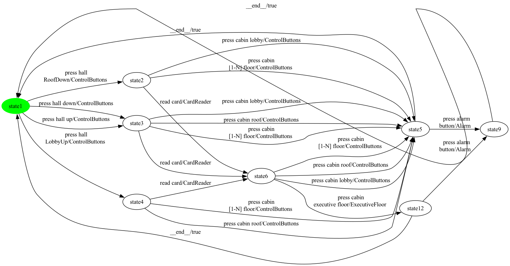

### State coverage (1 test case, 9 transitions)

```
press hall 
RoofDown -> press cabin lobby -> press alarm
button -> __end__ -> press hall up -> read card -> press cabin 
executive floor -> __end__ -> press hall 
LobbyUp
```

### All-transitions coverage (12 test cases, 20 transitions total)

- **`Elevator_p13_trans_seg0`**: `press hall 
RoofDown -> press cabin 
[1-N] floor -> press alarm
button`
- **`Elevator_p13_trans_seg1`**: `press cabin lobby`
- **`Elevator_p13_trans_seg2`**: `press cabin lobby`
- **`Elevator_p13_trans_seg3`**: `press cabin 
[1-N] floor`
- **`Elevator_p13_trans_seg4`**: `read card -> press cabin roof`
- **`Elevator_p13_trans_seg5`**: `press hall up -> read card -> press cabin 
executive floor -> press alarm
button`
- **`Elevator_p13_trans_seg6`**: `press hall down -> press cabin lobby`
- **`Elevator_p13_trans_seg7`**: `press cabin roof`
- **`Elevator_p13_trans_seg8`**: `press cabin 
[1-N] floor`
- **`Elevator_p13_trans_seg9`**: `press cabin roof`
- **`Elevator_p13_trans_seg10`**: `press cabin 
[1-N] floor`
- **`Elevator_p13_trans_seg11`**: `press hall 
LobbyUp -> read card`

### All-transition-pairs coverage (35 test cases, 84 transitions total)

- **`Elevator_p13_pair_seg0`**: `press hall 
RoofDown`
- **`Elevator_p13_pair_seg1`**: `read card -> press cabin 
[1-N] floor -> press alarm
button`
- **`Elevator_p13_pair_seg2`**: `press hall 
RoofDown -> read card`
- **`Elevator_p13_pair_seg3`**: `__end__ -> press hall 
RoofDown`
- **`Elevator_p13_pair_seg4`**: `read card -> press cabin 
executive floor`
- **`Elevator_p13_pair_seg5`**: `__end__ -> press hall 
LobbyUp`
- **`Elevator_p13_pair_seg6`**: `read card -> press cabin 
[1-N] floor`
- **`Elevator_p13_pair_seg7`**: `__end__ -> press hall down -> press cabin lobby -> press alarm
button`
- **`Elevator_p13_pair_seg8`**: `__end__ -> press hall 
RoofDown`
- **`Elevator_p13_pair_seg9`**: `__end__ -> press hall up -> press cabin lobby`
- **`Elevator_p13_pair_seg10`**: `read card -> press cabin 
executive floor`
- **`Elevator_p13_pair_seg11`**: `__end__ -> press hall down -> press cabin roof`
- **`Elevator_p13_pair_seg12`**: `read card -> press cabin lobby`
- **`Elevator_p13_pair_seg13`**: `__end__ -> press hall 
RoofDown`
- **`Elevator_p13_pair_seg14`**: `read card -> press cabin roof`
- **`Elevator_p13_pair_seg15`**: `press cabin lobby -> press alarm
button`
- **`Elevator_p13_pair_seg16`**: `press hall 
RoofDown -> press cabin lobby`
- **`Elevator_p13_pair_seg17`**: `__end__ -> press hall up -> press cabin roof -> press alarm
button`
- **`Elevator_p13_pair_seg18`**: `__end__ -> press hall down -> read card -> press cabin 
executive floor -> press alarm
button`
- **`Elevator_p13_pair_seg19`**: `read card -> press cabin lobby`
- **`Elevator_p13_pair_seg20`**: `press cabin 
[1-N] floor -> press alarm
button`
- **`Elevator_p13_pair_seg21`**: `__end__ -> press hall 
LobbyUp -> read card -> press cabin roof`
- **`Elevator_p13_pair_seg22`**: `press hall 
RoofDown -> press cabin 
[1-N] floor`
- **`Elevator_p13_pair_seg23`**: `press hall 
LobbyUp -> press cabin roof`
- **`Elevator_p13_pair_seg24`**: `__end__ -> press hall 
LobbyUp`
- **`Elevator_p13_pair_seg25`**: `press cabin roof -> press alarm
button`
- **`Elevator_p13_pair_seg26`**: `press hall 
LobbyUp -> press cabin 
[1-N] floor`
- **`Elevator_p13_pair_seg27`**: `__end__ -> press hall up -> press cabin 
[1-N] floor -> press alarm
button`
- **`Elevator_p13_pair_seg28`**: `press hall down -> press cabin 
[1-N] floor`
- **`Elevator_p13_pair_seg29`**: `read card -> press cabin 
[1-N] floor`
- **`Elevator_p13_pair_seg30`**: `press hall up -> read card -> press cabin roof -> press alarm
button`
- **`Elevator_p13_pair_seg31`**: `press hall up`
- **`Elevator_p13_pair_seg32`**: `read card -> press cabin lobby -> press alarm
button`
- **`Elevator_p13_pair_seg33`**: `press hall 
LobbyUp`
- **`Elevator_p13_pair_seg34`**: `press cabin 
[1-N] floor -> press alarm
button`

## Product 14

**Selected features:** selected = {Alarm, ControlButtons, PinPad}

**Repaired FTS:** 7 states, 20 transitions

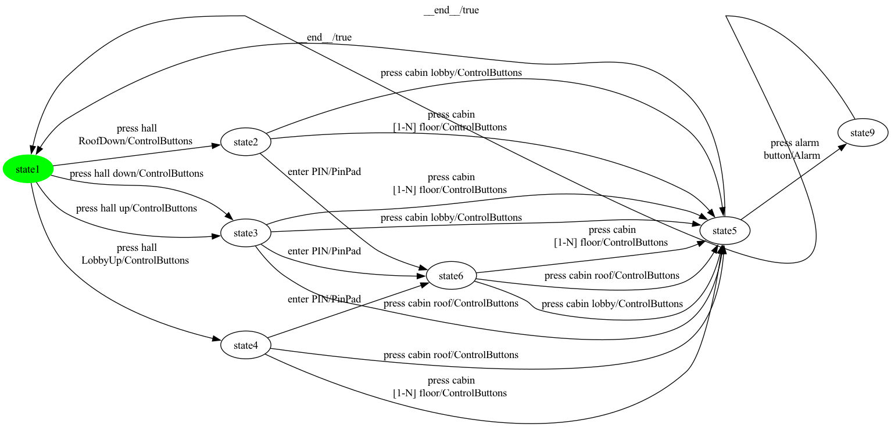

### State coverage (1 test case, 9 transitions)

```
press hall 
RoofDown -> enter PIN -> press cabin lobby -> press alarm
button -> __end__ -> press hall up -> press cabin lobby -> __end__ -> press hall 
LobbyUp
```

### All-transitions coverage (10 test cases, 18 transitions total)

- **`Elevator_p14_trans_seg0`**: `press cabin 
[1-N] floor -> press alarm
button`
- **`Elevator_p14_trans_seg1`**: `press cabin lobby`
- **`Elevator_p14_trans_seg2`**: `press hall 
RoofDown -> enter PIN -> press cabin lobby`
- **`Elevator_p14_trans_seg3`**: `enter PIN -> press cabin 
[1-N] floor`
- **`Elevator_p14_trans_seg4`**: `press hall up -> press cabin lobby`
- **`Elevator_p14_trans_seg5`**: `press hall down -> press cabin roof`
- **`Elevator_p14_trans_seg6`**: `press cabin 
[1-N] floor`
- **`Elevator_p14_trans_seg7`**: `press cabin roof`
- **`Elevator_p14_trans_seg8`**: `press hall 
LobbyUp -> press cabin 
[1-N] floor`
- **`Elevator_p14_trans_seg9`**: `enter PIN -> press cabin roof`

### All-transition-pairs coverage (25 test cases, 66 transitions total)

- **`Elevator_p14_pair_seg0`**: `press hall 
RoofDown -> press cabin lobby -> press alarm
button`
- **`Elevator_p14_pair_seg1`**: `__end__ -> press hall 
RoofDown`
- **`Elevator_p14_pair_seg2`**: `__end__ -> press hall down -> press cabin lobby -> press alarm
button`
- **`Elevator_p14_pair_seg3`**: `press hall up -> press cabin lobby`
- **`Elevator_p14_pair_seg4`**: `enter PIN -> press cabin lobby`
- **`Elevator_p14_pair_seg5`**: `enter PIN -> press cabin 
[1-N] floor -> press alarm
button`
- **`Elevator_p14_pair_seg6`**: `__end__ -> press hall up -> press cabin roof`
- **`Elevator_p14_pair_seg7`**: `press hall 
RoofDown -> enter PIN -> press cabin roof`
- **`Elevator_p14_pair_seg8`**: `__end__ -> press hall down -> press cabin roof -> press alarm
button`
- **`Elevator_p14_pair_seg9`**: `press hall down -> enter PIN -> press cabin 
[1-N] floor`
- **`Elevator_p14_pair_seg10`**: `press hall 
LobbyUp -> press cabin roof`
- **`Elevator_p14_pair_seg11`**: `__end__ -> press hall 
RoofDown`
- **`Elevator_p14_pair_seg12`**: `__end__ -> press hall 
LobbyUp`
- **`Elevator_p14_pair_seg13`**: `press cabin roof -> press alarm
button`
- **`Elevator_p14_pair_seg14`**: `press hall 
RoofDown -> press cabin 
[1-N] floor -> press alarm
button`
- **`Elevator_p14_pair_seg15`**: `press hall 
LobbyUp -> press cabin 
[1-N] floor -> press alarm
button`
- **`Elevator_p14_pair_seg16`**: `press hall down -> press cabin 
[1-N] floor -> press alarm
button`
- **`Elevator_p14_pair_seg17`**: `press hall up -> enter PIN -> press cabin roof`
- **`Elevator_p14_pair_seg18`**: `__end__ -> press hall 
LobbyUp`
- **`Elevator_p14_pair_seg19`**: `enter PIN -> press cabin 
[1-N] floor`
- **`Elevator_p14_pair_seg20`**: `press hall 
LobbyUp -> enter PIN -> press cabin roof -> press alarm
button`
- **`Elevator_p14_pair_seg21`**: `press hall 
LobbyUp`
- **`Elevator_p14_pair_seg22`**: `enter PIN -> press cabin lobby`
- **`Elevator_p14_pair_seg23`**: `__end__ -> press hall up -> press cabin 
[1-N] floor`
- **`Elevator_p14_pair_seg24`**: `enter PIN -> press cabin lobby -> press alarm
button`

## Product 15

**Selected features:** selected = {Alarm, ControlButtons, ExecutiveFloor, PinPad}

**Repaired FTS:** 8 states, 23 transitions


### State coverage (1 test case, 10 transitions)

```
press hall 
RoofDown -> enter PIN -> press cabin lobby -> press alarm
button -> __end__ -> press hall up -> enter PIN -> press cabin 
executive floor -> __end__ -> press hall 
LobbyUp
```

### All-transitions coverage (12 test cases, 20 transitions total)

- **`Elevator_p15_trans_seg0`**: `press hall 
RoofDown -> press cabin 
[1-N] floor -> press alarm
button`
- **`Elevator_p15_trans_seg1`**: `press cabin lobby`
- **`Elevator_p15_trans_seg2`**: `enter PIN -> press cabin lobby`
- **`Elevator_p15_trans_seg3`**: `press cabin 
[1-N] floor`
- **`Elevator_p15_trans_seg4`**: `press cabin roof`
- **`Elevator_p15_trans_seg5`**: `press hall up -> enter PIN -> press cabin 
executive floor -> press alarm
button`
- **`Elevator_p15_trans_seg6`**: `press hall down -> press cabin lobby`
- **`Elevator_p15_trans_seg7`**: `press cabin roof`
- **`Elevator_p15_trans_seg8`**: `press cabin 
[1-N] floor`
- **`Elevator_p15_trans_seg9`**: `press cabin roof`
- **`Elevator_p15_trans_seg10`**: `press cabin 
[1-N] floor`
- **`Elevator_p15_trans_seg11`**: `press hall 
LobbyUp -> enter PIN`

### All-transition-pairs coverage (33 test cases, 82 transitions total)

- **`Elevator_p15_pair_seg0`**: `press hall 
RoofDown`
- **`Elevator_p15_pair_seg1`**: `press cabin lobby -> press alarm
button`
- **`Elevator_p15_pair_seg2`**: `__end__ -> press hall 
RoofDown -> press cabin lobby`
- **`Elevator_p15_pair_seg3`**: `__end__ -> press hall down -> press cabin lobby -> press alarm
button`
- **`Elevator_p15_pair_seg4`**: `enter PIN -> press cabin lobby`
- **`Elevator_p15_pair_seg5`**: `enter PIN -> press cabin 
[1-N] floor -> press alarm
button`
- **`Elevator_p15_pair_seg6`**: `__end__ -> press hall 
RoofDown`
- **`Elevator_p15_pair_seg7`**: `enter PIN -> press cabin 
executive floor`
- **`Elevator_p15_pair_seg8`**: `press hall 
LobbyUp -> press cabin roof`
- **`Elevator_p15_pair_seg9`**: `__end__ -> press hall 
LobbyUp`
- **`Elevator_p15_pair_seg10`**: `__end__ -> press hall up -> press cabin lobby`
- **`Elevator_p15_pair_seg11`**: `__end__ -> press hall 
RoofDown -> enter PIN -> press cabin roof`
- **`Elevator_p15_pair_seg12`**: `__end__ -> press hall up -> press cabin roof`
- **`Elevator_p15_pair_seg13`**: `__end__ -> press hall down -> press cabin roof -> press alarm
button`
- **`Elevator_p15_pair_seg14`**: `press cabin roof -> press alarm
button`
- **`Elevator_p15_pair_seg15`**: `press hall 
LobbyUp -> press cabin 
[1-N] floor`
- **`Elevator_p15_pair_seg16`**: `press cabin 
[1-N] floor -> press alarm
button`
- **`Elevator_p15_pair_seg17`**: `__end__ -> press hall 
LobbyUp`
- **`Elevator_p15_pair_seg18`**: `press cabin 
[1-N] floor -> press alarm
button`
- **`Elevator_p15_pair_seg19`**: `press hall down -> enter PIN -> press cabin 
[1-N] floor`
- **`Elevator_p15_pair_seg20`**: `press hall 
RoofDown -> press cabin 
[1-N] floor`
- **`Elevator_p15_pair_seg21`**: `enter PIN -> press cabin 
[1-N] floor`
- **`Elevator_p15_pair_seg22`**: `__end__ -> press hall 
LobbyUp`
- **`Elevator_p15_pair_seg23`**: `enter PIN -> press cabin 
executive floor`
- **`Elevator_p15_pair_seg24`**: `__end__ -> press hall down -> press cabin 
[1-N] floor -> press alarm
button`
- **`Elevator_p15_pair_seg25`**: `press hall up -> enter PIN -> press cabin roof`
- **`Elevator_p15_pair_seg26`**: `__end__ -> press hall up`
- **`Elevator_p15_pair_seg27`**: `enter PIN -> press cabin lobby`
- **`Elevator_p15_pair_seg28`**: `press hall up -> press cabin 
[1-N] floor`
- **`Elevator_p15_pair_seg29`**: `enter PIN -> press cabin 
executive floor -> press alarm
button`
- **`Elevator_p15_pair_seg30`**: `press hall 
LobbyUp -> enter PIN -> press cabin roof -> press alarm
button`
- **`Elevator_p15_pair_seg31`**: `press hall 
LobbyUp`
- **`Elevator_p15_pair_seg32`**: `enter PIN -> press cabin lobby -> press alarm
button`

## Product 16

**Selected features:** selected = {ControlButtons, FirefighterService, Intercom}

**Repaired FTS:** 10 states, 24 transitions

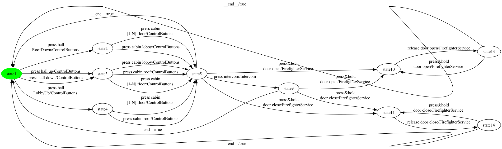

### State coverage (1 test case, 12 transitions)

```
press hall 
RoofDown -> press cabin lobby -> press intercom -> press&hold 
door open -> release door open -> __end__ -> press hall up -> press cabin lobby -> press&hold 
door close -> release door close -> __end__ -> press hall 
LobbyUp
```

### All-transitions coverage (12 test cases, 20 transitions total)

- **`Elevator_p16_trans_seg0`**: `press&hold 
door close -> release door close`
- **`Elevator_p16_trans_seg1`**: `press hall 
RoofDown`
- **`Elevator_p16_trans_seg2`**: `press intercom`
- **`Elevator_p16_trans_seg3`**: `press&hold 
door open`
- **`Elevator_p16_trans_seg4`**: `press cabin 
[1-N] floor`
- **`Elevator_p16_trans_seg5`**: `press cabin lobby -> press&hold 
door open -> release door open -> press&hold 
door open`
- **`Elevator_p16_trans_seg6`**: `press hall up -> press cabin lobby`
- **`Elevator_p16_trans_seg7`**: `press hall down -> press cabin roof -> press&hold 
door close`
- **`Elevator_p16_trans_seg8`**: `press&hold 
door close`
- **`Elevator_p16_trans_seg9`**: `press cabin 
[1-N] floor`
- **`Elevator_p16_trans_seg10`**: `press cabin roof`
- **`Elevator_p16_trans_seg11`**: `press hall 
LobbyUp -> press cabin 
[1-N] floor`

### All-transition-pairs coverage (40 test cases, 97 transitions total)

- **`Elevator_p16_pair_seg0`**: `press hall 
RoofDown`
- **`Elevator_p16_pair_seg1`**: `press cabin lobby -> press&hold 
door close`
- **`Elevator_p16_pair_seg2`**: `__end__ -> press hall 
LobbyUp -> press cabin roof`
- **`Elevator_p16_pair_seg3`**: `__end__ -> press hall down -> press cabin lobby -> press&hold 
door close`
- **`Elevator_p16_pair_seg4`**: `press cabin roof -> press&hold 
door close`
- **`Elevator_p16_pair_seg5`**: `press cabin roof -> press&hold 
door open`
- **`Elevator_p16_pair_seg6`**: `release door open -> press&hold 
door open -> release door open`
- **`Elevator_p16_pair_seg7`**: `__end__ -> press hall up -> press cabin lobby`
- **`Elevator_p16_pair_seg8`**: `__end__ -> press hall down`
- **`Elevator_p16_pair_seg9`**: `press cabin roof -> press&hold 
door open`
- **`Elevator_p16_pair_seg10`**: `press cabin roof -> press intercom -> press&hold 
door open -> release door open`
- **`Elevator_p16_pair_seg11`**: `press cabin 
[1-N] floor -> press&hold 
door open`
- **`Elevator_p16_pair_seg12`**: `__end__ -> press hall 
LobbyUp`
- **`Elevator_p16_pair_seg13`**: `press hall 
RoofDown -> press cabin lobby -> press&hold 
door open`
- **`Elevator_p16_pair_seg14`**: `press cabin lobby -> press intercom -> press&hold 
door close -> release door close`
- **`Elevator_p16_pair_seg15`**: `__end__ -> press hall 
RoofDown`
- **`Elevator_p16_pair_seg16`**: `press cabin 
[1-N] floor -> press&hold 
door open -> release door open`
- **`Elevator_p16_pair_seg17`**: `__end__ -> press hall 
RoofDown`
- **`Elevator_p16_pair_seg18`**: `press hall down`
- **`Elevator_p16_pair_seg19`**: `press cabin roof -> press intercom`
- **`Elevator_p16_pair_seg20`**: `__end__ -> press hall 
RoofDown`
- **`Elevator_p16_pair_seg21`**: `press cabin 
[1-N] floor -> press&hold 
door close -> release door close`
- **`Elevator_p16_pair_seg22`**: `__end__ -> press hall 
RoofDown -> press cabin 
[1-N] floor`
- **`Elevator_p16_pair_seg23`**: `__end__ -> press hall 
LobbyUp -> press cabin 
[1-N] floor -> press intercom`
- **`Elevator_p16_pair_seg24`**: `press cabin 
[1-N] floor -> press intercom`
- **`Elevator_p16_pair_seg25`**: `__end__ -> press hall up`
- **`Elevator_p16_pair_seg26`**: `__end__ -> press hall down -> press cabin roof`
- **`Elevator_p16_pair_seg27`**: `__end__ -> press hall up`
- **`Elevator_p16_pair_seg28`**: `press cabin lobby -> press intercom`
- **`Elevator_p16_pair_seg29`**: `__end__ -> press hall down -> press cabin 
[1-N] floor -> press&hold 
door close`
- **`Elevator_p16_pair_seg30`**: `__end__ -> press hall up`
- **`Elevator_p16_pair_seg31`**: `press cabin lobby -> press&hold 
door open`
- **`Elevator_p16_pair_seg32`**: `press hall up -> press cabin roof -> press&hold 
door close`
- **`Elevator_p16_pair_seg33`**: `press hall up -> press cabin 
[1-N] floor`
- **`Elevator_p16_pair_seg34`**: `press cabin 
[1-N] floor -> press intercom`
- **`Elevator_p16_pair_seg35`**: `__end__ -> press hall 
LobbyUp`
- **`Elevator_p16_pair_seg36`**: `press cabin 
[1-N] floor -> press&hold 
door close`
- **`Elevator_p16_pair_seg37`**: `release door close -> press&hold 
door close -> release door close`
- **`Elevator_p16_pair_seg38`**: `press cabin 
[1-N] floor -> press&hold 
door open`
- **`Elevator_p16_pair_seg39`**: `press hall 
LobbyUp`

## Product 17

**Selected features:** selected = {CardReader, ControlButtons, Intercom}

**Repaired FTS:** 7 states, 20 transitions

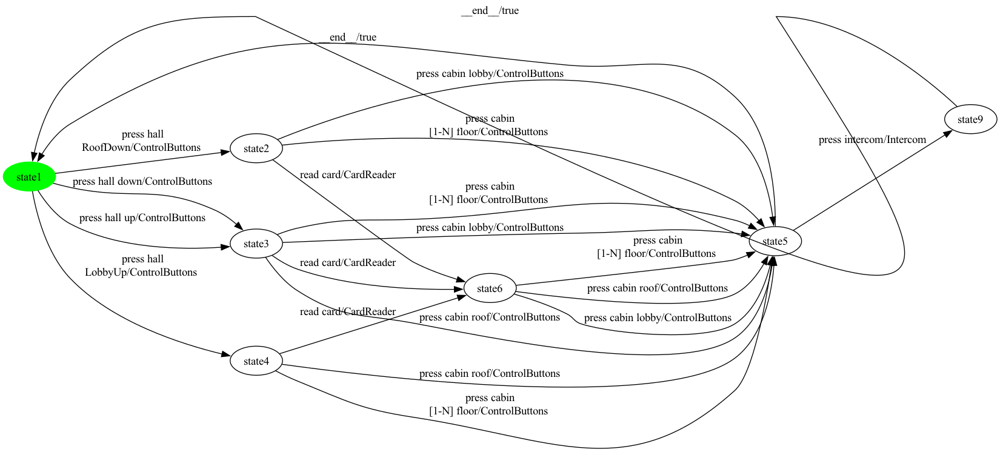

### State coverage (1 test case, 9 transitions)

```
press hall 
RoofDown -> press cabin lobby -> press intercom -> __end__ -> press hall up -> read card -> press cabin lobby -> __end__ -> press hall 
LobbyUp
```

### All-transitions coverage (10 test cases, 18 transitions total)

- **`Elevator_p17_trans_seg0`**: `press cabin 
[1-N] floor -> press intercom`
- **`Elevator_p17_trans_seg1`**: `press cabin lobby`
- **`Elevator_p17_trans_seg2`**: `press hall 
RoofDown -> read card -> press cabin lobby`
- **`Elevator_p17_trans_seg3`**: `read card -> press cabin 
[1-N] floor`
- **`Elevator_p17_trans_seg4`**: `press hall up -> press cabin lobby`
- **`Elevator_p17_trans_seg5`**: `press hall down -> press cabin roof`
- **`Elevator_p17_trans_seg6`**: `press cabin 
[1-N] floor`
- **`Elevator_p17_trans_seg7`**: `press cabin roof`
- **`Elevator_p17_trans_seg8`**: `press hall 
LobbyUp -> press cabin 
[1-N] floor`
- **`Elevator_p17_trans_seg9`**: `read card -> press cabin roof`

### All-transition-pairs coverage (25 test cases, 66 transitions total)

- **`Elevator_p17_pair_seg0`**: `press hall 
RoofDown -> read card -> press cabin 
[1-N] floor -> press intercom`
- **`Elevator_p17_pair_seg1`**: `read card -> press cabin lobby -> press intercom`
- **`Elevator_p17_pair_seg2`**: `__end__ -> press hall 
RoofDown`
- **`Elevator_p17_pair_seg3`**: `read card -> press cabin roof`
- **`Elevator_p17_pair_seg4`**: `__end__ -> press hall down -> press cabin lobby`
- **`Elevator_p17_pair_seg5`**: `press hall 
RoofDown -> press cabin lobby`
- **`Elevator_p17_pair_seg6`**: `press cabin lobby -> press intercom`
- **`Elevator_p17_pair_seg7`**: `press cabin 
[1-N] floor -> press intercom`
- **`Elevator_p17_pair_seg8`**: `press hall up -> press cabin lobby -> press intercom`
- **`Elevator_p17_pair_seg9`**: `__end__ -> press hall up -> press cabin roof -> press intercom`
- **`Elevator_p17_pair_seg10`**: `__end__ -> press hall down -> press cabin roof`
- **`Elevator_p17_pair_seg11`**: `press hall down -> read card -> press cabin 
[1-N] floor`
- **`Elevator_p17_pair_seg12`**: `press hall 
RoofDown -> press cabin 
[1-N] floor`
- **`Elevator_p17_pair_seg13`**: `__end__ -> press hall 
LobbyUp`
- **`Elevator_p17_pair_seg14`**: `read card -> press cabin 
[1-N] floor`
- **`Elevator_p17_pair_seg15`**: `__end__ -> press hall 
RoofDown`
- **`Elevator_p17_pair_seg16`**: `read card -> press cabin lobby`
- **`Elevator_p17_pair_seg17`**: `press hall 
LobbyUp -> read card -> press cabin roof`
- **`Elevator_p17_pair_seg18`**: `__end__ -> press hall 
LobbyUp -> press cabin roof`
- **`Elevator_p17_pair_seg19`**: `press cabin roof -> press intercom`
- **`Elevator_p17_pair_seg20`**: `press hall down -> press cabin 
[1-N] floor`
- **`Elevator_p17_pair_seg21`**: `__end__ -> press hall up -> press cabin 
[1-N] floor -> press intercom`
- **`Elevator_p17_pair_seg22`**: `press hall up -> read card -> press cabin lobby`
- **`Elevator_p17_pair_seg23`**: `read card -> press cabin roof -> press intercom`
- **`Elevator_p17_pair_seg24`**: `press hall 
LobbyUp -> press cabin 
[1-N] floor -> press intercom`

## Product 18

**Selected features:** selected = {Alarm, ControlButtons, ExecutiveFloor, Intercom, PinPad}

**Repaired FTS:** 8 states, 25 transitions

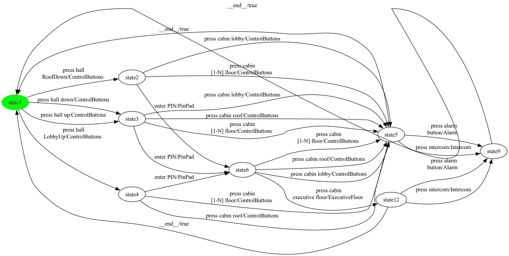

### State coverage (1 test case, 10 transitions)

```
press hall 
RoofDown -> enter PIN -> press cabin lobby -> press intercom -> __end__ -> press hall up -> enter PIN -> press cabin 
executive floor -> __end__ -> press hall 
LobbyUp
```

### All-transitions coverage (15 test cases, 22 transitions total)

- **`Elevator_p18_trans_seg0`**: `enter PIN -> press cabin lobby -> press intercom`
- **`Elevator_p18_trans_seg1`**: `press hall 
RoofDown`
- **`Elevator_p18_trans_seg2`**: `press cabin 
[1-N] floor -> press alarm
button`
- **`Elevator_p18_trans_seg3`**: `press cabin roof`
- **`Elevator_p18_trans_seg4`**: `press cabin 
executive floor -> press intercom`
- **`Elevator_p18_trans_seg5`**: `press cabin lobby`
- **`Elevator_p18_trans_seg6`**: `press cabin 
[1-N] floor`
- **`Elevator_p18_trans_seg7`**: `press cabin lobby`
- **`Elevator_p18_trans_seg8`**: `press cabin roof`
- **`Elevator_p18_trans_seg9`**: `press hall up -> press cabin 
[1-N] floor`
- **`Elevator_p18_trans_seg10`**: `press hall down -> enter PIN`
- **`Elevator_p18_trans_seg11`**: `press alarm
button`
- **`Elevator_p18_trans_seg12`**: `press cabin roof`
- **`Elevator_p18_trans_seg13`**: `press cabin 
[1-N] floor`
- **`Elevator_p18_trans_seg14`**: `press hall 
LobbyUp -> enter PIN`

### All-transition-pairs coverage (42 test cases, 102 transitions total)

- **`Elevator_p18_pair_seg0`**: `press hall 
RoofDown`
- **`Elevator_p18_pair_seg1`**: `press cabin lobby -> press alarm
button`
- **`Elevator_p18_pair_seg2`**: `__end__ -> press hall 
RoofDown`
- **`Elevator_p18_pair_seg3`**: `__end__ -> press hall down -> press cabin lobby -> press alarm
button`
- **`Elevator_p18_pair_seg4`**: `press hall 
RoofDown -> press cabin lobby`
- **`Elevator_p18_pair_seg5`**: `press cabin lobby -> press intercom`
- **`Elevator_p18_pair_seg6`**: `enter PIN -> press cabin lobby -> press intercom`
- **`Elevator_p18_pair_seg7`**: `enter PIN -> press cabin 
[1-N] floor -> press intercom`
- **`Elevator_p18_pair_seg8`**: `__end__ -> press hall 
RoofDown`
- **`Elevator_p18_pair_seg9`**: `enter PIN -> press cabin 
executive floor`
- **`Elevator_p18_pair_seg10`**: `__end__ -> press hall 
LobbyUp -> press cabin roof`
- **`Elevator_p18_pair_seg11`**: `press hall 
RoofDown -> enter PIN`
- **`Elevator_p18_pair_seg12`**: `__end__ -> press hall up -> press cabin lobby`
- **`Elevator_p18_pair_seg13`**: `__end__ -> press hall down -> press cabin roof -> press intercom`
- **`Elevator_p18_pair_seg14`**: `press cabin lobby -> press intercom`
- **`Elevator_p18_pair_seg15`**: `press hall up -> press cabin roof`
- **`Elevator_p18_pair_seg16`**: `enter PIN -> press cabin roof`
- **`Elevator_p18_pair_seg17`**: `__end__ -> press hall 
RoofDown`
- **`Elevator_p18_pair_seg18`**: `press cabin 
[1-N] floor -> press alarm
button`
- **`Elevator_p18_pair_seg19`**: `__end__ -> press hall up`
- **`Elevator_p18_pair_seg20`**: `press cabin roof -> press alarm
button`
- **`Elevator_p18_pair_seg21`**: `enter PIN -> press cabin 
[1-N] floor -> press alarm
button`
- **`Elevator_p18_pair_seg22`**: `press hall up -> enter PIN -> press cabin roof -> press alarm
button`
- **`Elevator_p18_pair_seg23`**: `__end__ -> press hall down -> enter PIN -> press cabin lobby`
- **`Elevator_p18_pair_seg24`**: `press hall 
RoofDown -> press cabin 
[1-N] floor -> press intercom`
- **`Elevator_p18_pair_seg25`**: `__end__ -> press hall 
LobbyUp`
- **`Elevator_p18_pair_seg26`**: `press cabin roof -> press alarm
button`
- **`Elevator_p18_pair_seg27`**: `press cabin roof -> press intercom`
- **`Elevator_p18_pair_seg28`**: `press hall 
LobbyUp -> press cabin 
[1-N] floor`
- **`Elevator_p18_pair_seg29`**: `press cabin 
[1-N] floor -> press intercom`
- **`Elevator_p18_pair_seg30`**: `press cabin 
[1-N] floor -> press alarm
button`
- **`Elevator_p18_pair_seg31`**: `press hall 
LobbyUp -> enter PIN -> press cabin 
[1-N] floor`
- **`Elevator_p18_pair_seg32`**: `__end__ -> press hall up`
- **`Elevator_p18_pair_seg33`**: `enter PIN -> press cabin 
executive floor -> press alarm
button`
- **`Elevator_p18_pair_seg34`**: `__end__ -> press hall 
LobbyUp`
- **`Elevator_p18_pair_seg35`**: `enter PIN -> press cabin 
executive floor -> press intercom`
- **`Elevator_p18_pair_seg36`**: `enter PIN -> press cabin roof -> press intercom`
- **`Elevator_p18_pair_seg37`**: `press hall down -> press cabin 
[1-N] floor -> press alarm
button`
- **`Elevator_p18_pair_seg38`**: `press hall up -> press cabin 
[1-N] floor`
- **`Elevator_p18_pair_seg39`**: `press cabin 
[1-N] floor -> press intercom`
- **`Elevator_p18_pair_seg40`**: `press hall 
LobbyUp`
- **`Elevator_p18_pair_seg41`**: `enter PIN -> press cabin lobby -> press alarm
button`

## Product 19

**Selected features:** selected = {Alarm, ControlButtons, ManualDoorControl, MobileKey}

**Repaired FTS:** 9 states, 26 transitions


### State coverage (1 test case, 11 transitions)

```
press hall 
RoofDown -> press cabin lobby -> press alarm
button -> __end__ -> press hall up -> tap mobile
key -> press cabin lobby -> press door open -> press door close -> __end__ -> press hall 
LobbyUp
```

### All-transitions coverage (10 test cases, 22 transitions total)

- **`Elevator_p19_trans_seg0`**: `press cabin lobby -> press alarm
button`
- **`Elevator_p19_trans_seg1`**: `press hall 
RoofDown -> press cabin 
[1-N] floor -> press door open -> press door close`
- **`Elevator_p19_trans_seg2`**: `tap mobile
key -> press cabin lobby -> press door close -> press door open`
- **`Elevator_p19_trans_seg3`**: `press hall up -> tap mobile
key -> press cabin 
[1-N] floor`
- **`Elevator_p19_trans_seg4`**: `press cabin lobby`
- **`Elevator_p19_trans_seg5`**: `press hall down -> press cabin roof`
- **`Elevator_p19_trans_seg6`**: `press cabin 
[1-N] floor`
- **`Elevator_p19_trans_seg7`**: `press cabin roof`
- **`Elevator_p19_trans_seg8`**: `press hall 
LobbyUp -> press cabin 
[1-N] floor`
- **`Elevator_p19_trans_seg9`**: `tap mobile
key -> press cabin roof`

### All-transition-pairs coverage (53 test cases, 126 transitions total)

- **`Elevator_p19_pair_seg0`**: `press hall 
RoofDown`
- **`Elevator_p19_pair_seg1`**: `press door open -> press door close -> press door open`
- **`Elevator_p19_pair_seg2`**: `__end__ -> press hall 
RoofDown`
- **`Elevator_p19_pair_seg3`**: `press cabin lobby -> press door open`
- **`Elevator_p19_pair_seg4`**: `press hall 
RoofDown -> press cabin lobby`
- **`Elevator_p19_pair_seg5`**: `press cabin lobby -> press alarm
button`
- **`Elevator_p19_pair_seg6`**: `__end__ -> press hall 
RoofDown`
- **`Elevator_p19_pair_seg7`**: `__end__ -> press hall down -> press cabin lobby -> press door open`
- **`Elevator_p19_pair_seg8`**: `__end__ -> press hall 
RoofDown`
- **`Elevator_p19_pair_seg9`**: `press door close -> press door open -> press door close`
- **`Elevator_p19_pair_seg10`**: `press cabin lobby -> press door close`
- **`Elevator_p19_pair_seg11`**: `press cabin 
[1-N] floor -> press door close`
- **`Elevator_p19_pair_seg12`**: `press cabin 
[1-N] floor -> press alarm
button`
- **`Elevator_p19_pair_seg13`**: `press cabin 
[1-N] floor -> press door open`
- **`Elevator_p19_pair_seg14`**: `__end__ -> press hall down -> press cabin roof`
- **`Elevator_p19_pair_seg15`**: `press hall 
RoofDown -> press cabin 
[1-N] floor`
- **`Elevator_p19_pair_seg16`**: `tap mobile
key -> press cabin roof`
- **`Elevator_p19_pair_seg17`**: `press hall 
LobbyUp -> press cabin roof`
- **`Elevator_p19_pair_seg18`**: `press cabin roof -> press alarm
button`
- **`Elevator_p19_pair_seg19`**: `press cabin roof -> press alarm
button`
- **`Elevator_p19_pair_seg20`**: `press hall up -> press cabin lobby -> press alarm
button`
- **`Elevator_p19_pair_seg21`**: `__end__ -> press hall up`
- **`Elevator_p19_pair_seg22`**: `__end__ -> press hall 
LobbyUp`
- **`Elevator_p19_pair_seg23`**: `press cabin roof -> press door open`
- **`Elevator_p19_pair_seg24`**: `press cabin lobby -> press door close`
- **`Elevator_p19_pair_seg25`**: `press hall 
RoofDown -> tap mobile
key -> press cabin lobby -> press door open`
- **`Elevator_p19_pair_seg26`**: `__end__ -> press hall up`
- **`Elevator_p19_pair_seg27`**: `press cabin roof -> press door open`
- **`Elevator_p19_pair_seg28`**: `press hall up -> press cabin roof -> press door close`
- **`Elevator_p19_pair_seg29`**: `press cabin roof -> press door close`
- **`Elevator_p19_pair_seg30`**: `press cabin 
[1-N] floor -> press door close`
- **`Elevator_p19_pair_seg31`**: `__end__ -> press hall 
RoofDown`
- **`Elevator_p19_pair_seg32`**: `tap mobile
key -> press cabin 
[1-N] floor -> press alarm
button`
- **`Elevator_p19_pair_seg33`**: `press cabin roof -> press alarm
button`
- **`Elevator_p19_pair_seg34`**: `press hall up -> press cabin 
[1-N] floor -> press door open`
- **`Elevator_p19_pair_seg35`**: `__end__ -> press hall 
LobbyUp -> tap mobile
key -> press cabin 
[1-N] floor -> press door open`
- **`Elevator_p19_pair_seg36`**: `tap mobile
key -> press cabin roof -> press door close`
- **`Elevator_p19_pair_seg37`**: `__end__ -> press hall 
LobbyUp`
- **`Elevator_p19_pair_seg38`**: `tap mobile
key -> press cabin lobby -> press door close`
- **`Elevator_p19_pair_seg39`**: `__end__ -> press hall down -> press cabin 
[1-N] floor -> press alarm
button`
- **`Elevator_p19_pair_seg40`**: `__end__ -> press hall up`
- **`Elevator_p19_pair_seg41`**: `press hall down`
- **`Elevator_p19_pair_seg42`**: `press hall up`
- **`Elevator_p19_pair_seg43`**: `press cabin 
[1-N] floor -> press door close`
- **`Elevator_p19_pair_seg44`**: `__end__ -> press hall up -> tap mobile
key -> press cabin 
[1-N] floor`
- **`Elevator_p19_pair_seg45`**: `press hall 
LobbyUp`
- **`Elevator_p19_pair_seg46`**: `press cabin 
[1-N] floor -> press door close`
- **`Elevator_p19_pair_seg47`**: `tap mobile
key -> press cabin roof -> press door open`
- **`Elevator_p19_pair_seg48`**: `press cabin 
[1-N] floor -> press alarm
button`
- **`Elevator_p19_pair_seg49`**: `__end__ -> press hall down -> tap mobile
key -> press cabin lobby -> press alarm
button`
- **`Elevator_p19_pair_seg50`**: `__end__ -> press hall 
LobbyUp`
- **`Elevator_p19_pair_seg51`**: `press cabin 
[1-N] floor -> press door open`
- **`Elevator_p19_pair_seg52`**: `press hall 
LobbyUp -> press cabin 
[1-N] floor`

## Product 20

**Selected features:** selected = {Alarm, ControlButtons, ExecutiveFloor, Intercom, ManualDoorControl, PinPad}

**Repaired FTS:** 10 states, 33 transitions

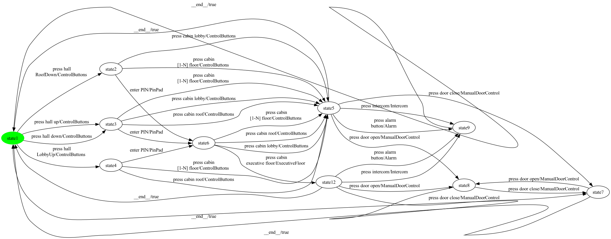

### State coverage (1 test case, 13 transitions)

```
press hall 
RoofDown -> enter PIN -> press cabin lobby -> press intercom -> __end__ -> press hall up -> press cabin lobby -> press door open -> press door close -> __end__ -> press hall 
LobbyUp -> enter PIN -> press cabin 
executive floor
```

### All-transitions coverage (17 test cases, 28 transitions total)

- **`Elevator_p20_trans_seg0`**: `enter PIN -> press cabin lobby -> press intercom`
- **`Elevator_p20_trans_seg1`**: `press cabin 
[1-N] floor -> press alarm
button`
- **`Elevator_p20_trans_seg2`**: `press hall 
RoofDown`
- **`Elevator_p20_trans_seg3`**: `press cabin roof -> press door open -> press door close`
- **`Elevator_p20_trans_seg4`**: `press cabin 
executive floor -> press intercom`
- **`Elevator_p20_trans_seg5`**: `press alarm
button`
- **`Elevator_p20_trans_seg6`**: `press door close`
- **`Elevator_p20_trans_seg7`**: `press cabin lobby -> press door close -> press door open`
- **`Elevator_p20_trans_seg8`**: `press cabin 
[1-N] floor`
- **`Elevator_p20_trans_seg9`**: `press cabin lobby`
- **`Elevator_p20_trans_seg10`**: `press cabin roof`
- **`Elevator_p20_trans_seg11`**: `press hall up -> press cabin 
[1-N] floor`
- **`Elevator_p20_trans_seg12`**: `press hall down -> enter PIN`
- **`Elevator_p20_trans_seg13`**: `press door open`
- **`Elevator_p20_trans_seg14`**: `press cabin roof`
- **`Elevator_p20_trans_seg15`**: `press cabin 
[1-N] floor`
- **`Elevator_p20_trans_seg16`**: `press hall 
LobbyUp -> enter PIN`

### All-transition-pairs coverage (71 test cases, 167 transitions total)

- **`Elevator_p20_pair_seg0`**: `press hall up`
- **`Elevator_p20_pair_seg1`**: `press cabin roof -> press intercom`
- **`Elevator_p20_pair_seg2`**: `__end__ -> press hall down -> press cabin lobby -> press door open -> press door close -> press door open`
- **`Elevator_p20_pair_seg3`**: `__end__ -> press hall down -> press cabin roof -> press door open`
- **`Elevator_p20_pair_seg4`**: `__end__ -> press hall down -> enter PIN -> press cabin lobby -> press door close -> press door open`
- **`Elevator_p20_pair_seg5`**: `__end__ -> press hall up`
- **`Elevator_p20_pair_seg6`**: `press cabin roof -> press door close`
- **`Elevator_p20_pair_seg7`**: `press cabin lobby -> press intercom`
- **`Elevator_p20_pair_seg8`**: `press cabin lobby -> press door open`
- **`Elevator_p20_pair_seg9`**: `press hall up -> press cabin roof -> press alarm
button`
- **`Elevator_p20_pair_seg10`**: `press hall 
RoofDown -> press cabin lobby`
- **`Elevator_p20_pair_seg11`**: `press hall up -> enter PIN -> press cabin 
executive floor -> press alarm
button`
- **`Elevator_p20_pair_seg12`**: `__end__ -> press hall 
RoofDown`
- **`Elevator_p20_pair_seg13`**: `press cabin lobby -> press alarm
button`
- **`Elevator_p20_pair_seg14`**: `press cabin lobby -> press door close`
- **`Elevator_p20_pair_seg15`**: `enter PIN -> press cabin lobby -> press alarm
button`
- **`Elevator_p20_pair_seg16`**: `press cabin lobby -> press door open`
- **`Elevator_p20_pair_seg17`**: `__end__ -> press hall 
RoofDown`
- **`Elevator_p20_pair_seg18`**: `press cabin lobby -> press intercom`
- **`Elevator_p20_pair_seg19`**: `enter PIN -> press cabin 
[1-N] floor -> press intercom`
- **`Elevator_p20_pair_seg20`**: `press cabin 
[1-N] floor -> press door close`
- **`Elevator_p20_pair_seg21`**: `enter PIN -> press cabin roof -> press door close`
- **`Elevator_p20_pair_seg22`**: `press cabin roof -> press intercom`
- **`Elevator_p20_pair_seg23`**: `press cabin 
executive floor -> press intercom`
- **`Elevator_p20_pair_seg24`**: `__end__ -> press hall 
LobbyUp`
- **`Elevator_p20_pair_seg25`**: `__end__ -> press hall 
RoofDown`
- **`Elevator_p20_pair_seg26`**: `__end__ -> press hall up`
- **`Elevator_p20_pair_seg27`**: `enter PIN -> press cabin 
[1-N] floor`
- **`Elevator_p20_pair_seg28`**: `__end__ -> press hall 
RoofDown`
- **`Elevator_p20_pair_seg29`**: `__end__ -> press hall down`
- **`Elevator_p20_pair_seg30`**: `press cabin 
[1-N] floor -> press alarm
button`
- **`Elevator_p20_pair_seg31`**: `enter PIN -> press cabin 
executive floor -> press door open`
- **`Elevator_p20_pair_seg32`**: `press door open -> press door close`
- **`Elevator_p20_pair_seg33`**: `press hall 
RoofDown -> enter PIN`
- **`Elevator_p20_pair_seg34`**: `press door close -> press door open -> press door close`
- **`Elevator_p20_pair_seg35`**: `__end__ -> press hall 
RoofDown`
- **`Elevator_p20_pair_seg36`**: `press cabin 
[1-N] floor -> press door close`
- **`Elevator_p20_pair_seg37`**: `press cabin 
[1-N] floor -> press door open`
- **`Elevator_p20_pair_seg38`**: `press cabin 
[1-N] floor -> press door open`
- **`Elevator_p20_pair_seg39`**: `__end__ -> press hall 
LobbyUp -> press cabin 
[1-N] floor -> press door close`
- **`Elevator_p20_pair_seg40`**: `__end__ -> press hall 
LobbyUp`
- **`Elevator_p20_pair_seg41`**: `press cabin 
[1-N] floor -> press intercom`
- **`Elevator_p20_pair_seg42`**: `press hall 
RoofDown -> press cabin 
[1-N] floor -> press alarm
button`
- **`Elevator_p20_pair_seg43`**: `enter PIN -> press cabin roof -> press alarm
button`
- **`Elevator_p20_pair_seg44`**: `press hall up -> press cabin lobby -> press alarm
button`
- **`Elevator_p20_pair_seg45`**: `__end__ -> press hall up`
- **`Elevator_p20_pair_seg46`**: `__end__ -> press hall 
LobbyUp`
- **`Elevator_p20_pair_seg47`**: `press cabin 
[1-N] floor -> press alarm
button`
- **`Elevator_p20_pair_seg48`**: `press cabin lobby -> press intercom`
- **`Elevator_p20_pair_seg49`**: `press cabin lobby -> press door close`
- **`Elevator_p20_pair_seg50`**: `press hall 
LobbyUp -> press cabin roof`
- **`Elevator_p20_pair_seg51`**: `press cabin 
[1-N] floor -> press door open`
- **`Elevator_p20_pair_seg52`**: `__end__ -> press hall up`
- **`Elevator_p20_pair_seg53`**: `press cabin 
[1-N] floor -> press alarm
button`
- **`Elevator_p20_pair_seg54`**: `press hall up -> press cabin 
[1-N] floor`
- **`Elevator_p20_pair_seg55`**: `press hall 
LobbyUp`
- **`Elevator_p20_pair_seg56`**: `press hall 
RoofDown`
- **`Elevator_p20_pair_seg57`**: `press cabin 
[1-N] floor -> press intercom`
- **`Elevator_p20_pair_seg58`**: `press cabin roof -> press alarm
button`
- **`Elevator_p20_pair_seg59`**: `__end__ -> press hall 
LobbyUp`
- **`Elevator_p20_pair_seg60`**: `press cabin roof -> press door open`
- **`Elevator_p20_pair_seg61`**: `press cabin roof -> press intercom`
- **`Elevator_p20_pair_seg62`**: `press cabin roof -> press door close`
- **`Elevator_p20_pair_seg63`**: `enter PIN -> press cabin 
[1-N] floor -> press door open`
- **`Elevator_p20_pair_seg64`**: `press hall 
LobbyUp -> enter PIN -> press cabin roof -> press door open`
- **`Elevator_p20_pair_seg65`**: `enter PIN -> press cabin 
executive floor -> press door close`
- **`Elevator_p20_pair_seg66`**: `press hall down`
- **`Elevator_p20_pair_seg67`**: `__end__ -> press hall up`
- **`Elevator_p20_pair_seg68`**: `press cabin 
[1-N] floor -> press door close`
- **`Elevator_p20_pair_seg69`**: `__end__ -> press hall down -> press cabin 
[1-N] floor -> press intercom`
- **`Elevator_p20_pair_seg70`**: `enter PIN -> press cabin lobby`

## Product 21

**Selected features:** selected = {Alarm, ControlButtons, MobileKey}

**Repaired FTS:** 7 states, 20 transitions


### State coverage (1 test case, 9 transitions)

```
press hall 
RoofDown -> press cabin lobby -> press alarm
button -> __end__ -> press hall up -> tap mobile
key -> press cabin lobby -> __end__ -> press hall 
LobbyUp
```

### All-transitions coverage (10 test cases, 18 transitions total)

- **`Elevator_p21_trans_seg0`**: `tap mobile
key -> press cabin lobby -> press alarm
button`
- **`Elevator_p21_trans_seg1`**: `press cabin 
[1-N] floor`
- **`Elevator_p21_trans_seg2`**: `press hall 
RoofDown -> press cabin lobby`
- **`Elevator_p21_trans_seg3`**: `press cabin lobby`
- **`Elevator_p21_trans_seg4`**: `press hall up -> press cabin roof`
- **`Elevator_p21_trans_seg5`**: `press hall down -> press cabin 
[1-N] floor`
- **`Elevator_p21_trans_seg6`**: `tap mobile
key -> press cabin 
[1-N] floor`
- **`Elevator_p21_trans_seg7`**: `press cabin roof`
- **`Elevator_p21_trans_seg8`**: `press hall 
LobbyUp -> press cabin 
[1-N] floor`
- **`Elevator_p21_trans_seg9`**: `tap mobile
key -> press cabin roof`

### All-transition-pairs coverage (27 test cases, 68 transitions total)

- **`Elevator_p21_pair_seg0`**: `press hall 
RoofDown`
- **`Elevator_p21_pair_seg1`**: `press cabin lobby -> press alarm
button`
- **`Elevator_p21_pair_seg2`**: `__end__ -> press hall 
RoofDown -> press cabin lobby`
- **`Elevator_p21_pair_seg3`**: `__end__ -> press hall down -> press cabin lobby -> press alarm
button`
- **`Elevator_p21_pair_seg4`**: `__end__ -> press hall up -> press cabin lobby`
- **`Elevator_p21_pair_seg5`**: `press hall down -> press cabin roof`
- **`Elevator_p21_pair_seg6`**: `press hall 
RoofDown -> press cabin 
[1-N] floor -> press alarm
button`
- **`Elevator_p21_pair_seg7`**: `__end__ -> press hall down -> press cabin 
[1-N] floor -> press alarm
button`
- **`Elevator_p21_pair_seg8`**: `press hall 
LobbyUp -> press cabin roof`
- **`Elevator_p21_pair_seg9`**: `tap mobile
key -> press cabin roof`
- **`Elevator_p21_pair_seg10`**: `press hall 
RoofDown -> tap mobile
key -> press cabin lobby`
- **`Elevator_p21_pair_seg11`**: `__end__ -> press hall 
RoofDown`
- **`Elevator_p21_pair_seg12`**: `tap mobile
key -> press cabin 
[1-N] floor -> press alarm
button`
- **`Elevator_p21_pair_seg13`**: `press cabin roof -> press alarm
button`
- **`Elevator_p21_pair_seg14`**: `__end__ -> press hall 
LobbyUp`
- **`Elevator_p21_pair_seg15`**: `tap mobile
key -> press cabin 
[1-N] floor`
- **`Elevator_p21_pair_seg16`**: `press hall 
LobbyUp -> tap mobile
key -> press cabin roof`
- **`Elevator_p21_pair_seg17`**: `__end__ -> press hall 
LobbyUp`
- **`Elevator_p21_pair_seg18`**: `tap mobile
key -> press cabin lobby`
- **`Elevator_p21_pair_seg19`**: `press hall 
LobbyUp -> press cabin 
[1-N] floor`
- **`Elevator_p21_pair_seg20`**: `__end__ -> press hall up -> press cabin roof -> press alarm
button`
- **`Elevator_p21_pair_seg21`**: `press hall down -> tap mobile
key -> press cabin 
[1-N] floor`
- **`Elevator_p21_pair_seg22`**: `press hall up -> press cabin 
[1-N] floor`
- **`Elevator_p21_pair_seg23`**: `tap mobile
key -> press cabin roof -> press alarm
button`
- **`Elevator_p21_pair_seg24`**: `press hall up -> tap mobile
key -> press cabin lobby -> press alarm
button`
- **`Elevator_p21_pair_seg25`**: `press hall 
LobbyUp`
- **`Elevator_p21_pair_seg26`**: `press cabin 
[1-N] floor -> press alarm
button`

## Product 22

**Selected features:** selected = {Alarm, ControlButtons, FirefighterService, Intercom}

**Repaired FTS:** 10 states, 25 transitions


### State coverage (1 test case, 12 transitions)

```
press hall 
RoofDown -> press cabin lobby -> press intercom -> press&hold 
door open -> release door open -> __end__ -> press hall up -> press cabin lobby -> press&hold 
door close -> release door close -> __end__ -> press hall 
LobbyUp
```

### All-transitions coverage (12 test cases, 21 transitions total)

- **`Elevator_p22_trans_seg0`**: `press intercom -> press&hold 
door open`
- **`Elevator_p22_trans_seg1`**: `press&hold 
door close -> release door close`
- **`Elevator_p22_trans_seg2`**: `press hall 
RoofDown -> press cabin lobby -> press alarm
button`
- **`Elevator_p22_trans_seg3`**: `press cabin 
[1-N] floor`
- **`Elevator_p22_trans_seg4`**: `release door open`
- **`Elevator_p22_trans_seg5`**: `press hall up -> press cabin lobby -> press&hold 
door open`
- **`Elevator_p22_trans_seg6`**: `press&hold 
door open`
- **`Elevator_p22_trans_seg7`**: `press hall down -> press cabin roof -> press&hold 
door close`
- **`Elevator_p22_trans_seg8`**: `press&hold 
door close`
- **`Elevator_p22_trans_seg9`**: `press cabin 
[1-N] floor`
- **`Elevator_p22_trans_seg10`**: `press cabin roof`
- **`Elevator_p22_trans_seg11`**: `press hall 
LobbyUp -> press cabin 
[1-N] floor`

### All-transition-pairs coverage (46 test cases, 112 transitions total)

- **`Elevator_p22_pair_seg0`**: `press hall 
RoofDown`
- **`Elevator_p22_pair_seg1`**: `press cabin lobby -> press alarm
button -> press&hold 
door close -> release door close`
- **`Elevator_p22_pair_seg2`**: `__end__ -> press hall 
LobbyUp -> press cabin roof`
- **`Elevator_p22_pair_seg3`**: `__end__ -> press hall down -> press cabin lobby -> press&hold 
door close`
- **`Elevator_p22_pair_seg4`**: `press cabin roof -> press alarm
button -> press&hold 
door open -> release door open -> press&hold 
door open -> release door open`
- **`Elevator_p22_pair_seg5`**: `__end__ -> press hall up -> press cabin lobby -> press alarm
button`
- **`Elevator_p22_pair_seg6`**: `__end__ -> press hall 
RoofDown`
- **`Elevator_p22_pair_seg7`**: `press cabin roof -> press&hold 
door close`
- **`Elevator_p22_pair_seg8`**: `press cabin roof -> press&hold 
door open`
- **`Elevator_p22_pair_seg9`**: `__end__ -> press hall down -> press cabin roof -> press&hold 
door open`
- **`Elevator_p22_pair_seg10`**: `__end__ -> press hall 
LobbyUp`
- **`Elevator_p22_pair_seg11`**: `press cabin roof -> press intercom -> press&hold 
door open`
- **`Elevator_p22_pair_seg12`**: `press hall 
LobbyUp -> press cabin 
[1-N] floor -> press&hold 
door open`
- **`Elevator_p22_pair_seg13`**: `press cabin lobby -> press&hold 
door close -> release door close`
- **`Elevator_p22_pair_seg14`**: `press cabin 
[1-N] floor -> press intercom -> press&hold 
door close`
- **`Elevator_p22_pair_seg15`**: `__end__ -> press hall 
RoofDown -> press cabin lobby`
- **`Elevator_p22_pair_seg16`**: `__end__ -> press hall 
RoofDown`
- **`Elevator_p22_pair_seg17`**: `press cabin 
[1-N] floor -> press&hold 
door close`
- **`Elevator_p22_pair_seg18`**: `__end__ -> press hall down`
- **`Elevator_p22_pair_seg19`**: `press cabin 
[1-N] floor -> press&hold 
door close`
- **`Elevator_p22_pair_seg20`**: `press cabin lobby -> press&hold 
door open`
- **`Elevator_p22_pair_seg21`**: `press cabin lobby -> press intercom`
- **`Elevator_p22_pair_seg22`**: `press cabin 
[1-N] floor -> press&hold 
door open`
- **`Elevator_p22_pair_seg23`**: `press cabin 
[1-N] floor -> press alarm
button`
- **`Elevator_p22_pair_seg24`**: `press cabin lobby -> press intercom`
- **`Elevator_p22_pair_seg25`**: `press cabin lobby -> press&hold 
door open`
- **`Elevator_p22_pair_seg26`**: `press cabin 
[1-N] floor -> press&hold 
door close`
- **`Elevator_p22_pair_seg27`**: `__end__ -> press hall up`
- **`Elevator_p22_pair_seg28`**: `press cabin roof -> press intercom`
- **`Elevator_p22_pair_seg29`**: `__end__ -> press hall 
LobbyUp`
- **`Elevator_p22_pair_seg30`**: `press cabin 
[1-N] floor -> press alarm
button`
- **`Elevator_p22_pair_seg31`**: `__end__ -> press hall up -> press cabin roof -> press&hold 
door close`
- **`Elevator_p22_pair_seg32`**: `press cabin roof -> press alarm
button`
- **`Elevator_p22_pair_seg33`**: `press hall up -> press cabin 
[1-N] floor`
- **`Elevator_p22_pair_seg34`**: `release door close -> press&hold 
door close -> release door close`
- **`Elevator_p22_pair_seg35`**: `press cabin 
[1-N] floor -> press alarm
button`
- **`Elevator_p22_pair_seg36`**: `__end__ -> press hall up`
- **`Elevator_p22_pair_seg37`**: `press cabin 
[1-N] floor -> press intercom`
- **`Elevator_p22_pair_seg38`**: `__end__ -> press hall down -> press cabin 
[1-N] floor`
- **`Elevator_p22_pair_seg39`**: `press hall 
RoofDown -> press cabin 
[1-N] floor -> press intercom`
- **`Elevator_p22_pair_seg40`**: `__end__ -> press hall 
LobbyUp`
- **`Elevator_p22_pair_seg41`**: `press hall down`
- **`Elevator_p22_pair_seg42`**: `press cabin 
[1-N] floor -> press&hold 
door open -> release door open`
- **`Elevator_p22_pair_seg43`**: `__end__ -> press hall 
RoofDown`
- **`Elevator_p22_pair_seg44`**: `press hall up`
- **`Elevator_p22_pair_seg45`**: `press hall 
LobbyUp`

## Product 23

**Selected features:** selected = {Alarm, ControlButtons, ExecutiveFloor, ManualDoorControl, PinPad}

**Repaired FTS:** 10 states, 31 transitions


### State coverage (1 test case, 13 transitions)

```
press hall 
RoofDown -> enter PIN -> press cabin lobby -> press alarm
button -> __end__ -> press hall up -> press cabin lobby -> press door open -> press door close -> __end__ -> press hall 
LobbyUp -> enter PIN -> press cabin 
executive floor
```

### All-transitions coverage (15 test cases, 26 transitions total)

- **`Elevator_p23_trans_seg0`**: `press hall 
RoofDown -> enter PIN -> press cabin lobby -> press alarm
button`
- **`Elevator_p23_trans_seg1`**: `press cabin 
[1-N] floor -> press door open -> press door close`
- **`Elevator_p23_trans_seg2`**: `press cabin roof -> press door close`
- **`Elevator_p23_trans_seg3`**: `press cabin 
executive floor -> press alarm
button`
- **`Elevator_p23_trans_seg4`**: `press door close -> press door open`
- **`Elevator_p23_trans_seg5`**: `press cabin lobby`
- **`Elevator_p23_trans_seg6`**: `press cabin 
[1-N] floor`
- **`Elevator_p23_trans_seg7`**: `press cabin lobby`
- **`Elevator_p23_trans_seg8`**: `press hall up -> press cabin roof`
- **`Elevator_p23_trans_seg9`**: `press hall down -> press cabin 
[1-N] floor`
- **`Elevator_p23_trans_seg10`**: `enter PIN`
- **`Elevator_p23_trans_seg11`**: `press door open`
- **`Elevator_p23_trans_seg12`**: `press cabin roof`
- **`Elevator_p23_trans_seg13`**: `press cabin 
[1-N] floor`
- **`Elevator_p23_trans_seg14`**: `press hall 
LobbyUp -> enter PIN`

### All-transition-pairs coverage (59 test cases, 144 transitions total)

- **`Elevator_p23_pair_seg0`**: `press hall up`
- **`Elevator_p23_pair_seg1`**: `press cabin roof -> press door open -> press door close -> press door open`
- **`Elevator_p23_pair_seg2`**: `__end__ -> press hall down -> press cabin lobby -> press door open`
- **`Elevator_p23_pair_seg3`**: `press hall up -> press cabin roof`
- **`Elevator_p23_pair_seg4`**: `__end__ -> press hall down -> press cabin roof -> press door close -> press door open`
- **`Elevator_p23_pair_seg5`**: `__end__ -> press hall up`
- **`Elevator_p23_pair_seg6`**: `press cabin roof -> press alarm
button`
- **`Elevator_p23_pair_seg7`**: `__end__ -> press hall down -> enter PIN -> press cabin lobby -> press door close`
- **`Elevator_p23_pair_seg8`**: `press cabin lobby -> press door open`
- **`Elevator_p23_pair_seg9`**: `press hall up -> enter PIN -> press cabin 
executive floor -> press alarm
button`
- **`Elevator_p23_pair_seg10`**: `__end__ -> press hall 
RoofDown -> press cabin lobby -> press alarm
button`
- **`Elevator_p23_pair_seg11`**: `press cabin lobby -> press door close`
- **`Elevator_p23_pair_seg12`**: `press cabin lobby -> press alarm
button`
- **`Elevator_p23_pair_seg13`**: `enter PIN -> press cabin lobby -> press door open`
- **`Elevator_p23_pair_seg14`**: `__end__ -> press hall 
RoofDown`
- **`Elevator_p23_pair_seg15`**: `enter PIN -> press cabin 
[1-N] floor -> press door close`
- **`Elevator_p23_pair_seg16`**: `__end__ -> press hall 
RoofDown`
- **`Elevator_p23_pair_seg17`**: `enter PIN -> press cabin roof -> press door close`
- **`Elevator_p23_pair_seg18`**: `__end__ -> press hall 
RoofDown`
- **`Elevator_p23_pair_seg19`**: `__end__ -> press hall 
LobbyUp`
- **`Elevator_p23_pair_seg20`**: `__end__ -> press hall 
LobbyUp`
- **`Elevator_p23_pair_seg21`**: `press cabin 
[1-N] floor -> press door open`
- **`Elevator_p23_pair_seg22`**: `__end__ -> press hall up`
- **`Elevator_p23_pair_seg23`**: `enter PIN -> press cabin 
[1-N] floor -> press alarm
button`
- **`Elevator_p23_pair_seg24`**: `enter PIN -> press cabin 
executive floor`
- **`Elevator_p23_pair_seg25`**: `__end__ -> press hall 
RoofDown`
- **`Elevator_p23_pair_seg26`**: `__end__ -> press hall down`
- **`Elevator_p23_pair_seg27`**: `press cabin 
[1-N] floor -> press door open`
- **`Elevator_p23_pair_seg28`**: `press cabin 
executive floor -> press door open`
- **`Elevator_p23_pair_seg29`**: `press hall 
RoofDown -> enter PIN`
- **`Elevator_p23_pair_seg30`**: `press door open -> press door close`
- **`Elevator_p23_pair_seg31`**: `press cabin 
executive floor -> press door close -> press door open -> press door close`
- **`Elevator_p23_pair_seg32`**: `press hall 
LobbyUp -> press cabin 
[1-N] floor -> press door close`
- **`Elevator_p23_pair_seg33`**: `press cabin 
[1-N] floor -> press alarm
button`
- **`Elevator_p23_pair_seg34`**: `press cabin 
[1-N] floor -> press door close`
- **`Elevator_p23_pair_seg35`**: `press hall 
LobbyUp -> press cabin roof`
- **`Elevator_p23_pair_seg36`**: `enter PIN -> press cabin roof -> press alarm
button`
- **`Elevator_p23_pair_seg37`**: `press hall 
RoofDown -> press cabin 
[1-N] floor -> press door open`
- **`Elevator_p23_pair_seg38`**: `__end__ -> press hall 
LobbyUp`
- **`Elevator_p23_pair_seg39`**: `press hall up -> press cabin lobby -> press alarm
button`
- **`Elevator_p23_pair_seg40`**: `press cabin 
[1-N] floor -> press alarm
button`
- **`Elevator_p23_pair_seg41`**: `__end__ -> press hall up`
- **`Elevator_p23_pair_seg42`**: `press cabin lobby -> press door close`
- **`Elevator_p23_pair_seg43`**: `__end__ -> press hall 
LobbyUp`
- **`Elevator_p23_pair_seg44`**: `press cabin roof -> press alarm
button`
- **`Elevator_p23_pair_seg45`**: `press cabin 
[1-N] floor -> press alarm
button`
- **`Elevator_p23_pair_seg46`**: `__end__ -> press hall 
LobbyUp`
- **`Elevator_p23_pair_seg47`**: `press cabin roof -> press door open`
- **`Elevator_p23_pair_seg48`**: `press cabin roof -> press door close`
- **`Elevator_p23_pair_seg49`**: `press hall 
LobbyUp -> enter PIN -> press cabin 
[1-N] floor -> press door open`
- **`Elevator_p23_pair_seg50`**: `enter PIN -> press cabin roof -> press door open`
- **`Elevator_p23_pair_seg51`**: `enter PIN -> press cabin 
executive floor`
- **`Elevator_p23_pair_seg52`**: `__end__ -> press hall up -> press cabin 
[1-N] floor`
- **`Elevator_p23_pair_seg53`**: `__end__ -> press hall up`
- **`Elevator_p23_pair_seg54`**: `press hall 
LobbyUp`
- **`Elevator_p23_pair_seg55`**: `enter PIN -> press cabin lobby`
- **`Elevator_p23_pair_seg56`**: `press hall 
RoofDown`
- **`Elevator_p23_pair_seg57`**: `press hall down -> press cabin 
[1-N] floor -> press door close`
- **`Elevator_p23_pair_seg58`**: `__end__ -> press hall down`

## Product 24

**Selected features:** selected = {Alarm, ControlButtons, ExecutiveFloor, MobileKey}

**Repaired FTS:** 8 states, 23 transitions


### State coverage (1 test case, 9 transitions)

```
press hall 
RoofDown -> press cabin lobby -> press alarm
button -> __end__ -> press hall up -> tap mobile
key -> press cabin 
executive floor -> __end__ -> press hall 
LobbyUp
```

### All-transitions coverage (12 test cases, 20 transitions total)

- **`Elevator_p24_trans_seg0`**: `press hall 
RoofDown -> tap mobile
key -> press cabin lobby -> press alarm
button`
- **`Elevator_p24_trans_seg1`**: `press cabin 
[1-N] floor`
- **`Elevator_p24_trans_seg2`**: `press cabin roof`
- **`Elevator_p24_trans_seg3`**: `press cabin 
[1-N] floor`
- **`Elevator_p24_trans_seg4`**: `press cabin lobby`
- **`Elevator_p24_trans_seg5`**: `press hall up -> press cabin lobby`
- **`Elevator_p24_trans_seg6`**: `press hall down -> press cabin roof`
- **`Elevator_p24_trans_seg7`**: `press cabin 
[1-N] floor`
- **`Elevator_p24_trans_seg8`**: `tap mobile
key -> press cabin 
executive floor -> press alarm
button`
- **`Elevator_p24_trans_seg9`**: `press cabin roof`
- **`Elevator_p24_trans_seg10`**: `press cabin 
[1-N] floor`
- **`Elevator_p24_trans_seg11`**: `press hall 
LobbyUp -> tap mobile
key`

### All-transition-pairs coverage (34 test cases, 83 transitions total)

- **`Elevator_p24_pair_seg0`**: `press hall 
RoofDown -> press cabin lobby -> press alarm
button`
- **`Elevator_p24_pair_seg1`**: `__end__ -> press hall down -> press cabin lobby -> press alarm
button`
- **`Elevator_p24_pair_seg2`**: `__end__ -> press hall 
RoofDown`
- **`Elevator_p24_pair_seg3`**: `press cabin 
[1-N] floor -> press alarm
button`
- **`Elevator_p24_pair_seg4`**: `__end__ -> press hall up -> press cabin lobby`
- **`Elevator_p24_pair_seg5`**: `press hall 
RoofDown -> press cabin 
[1-N] floor`
- **`Elevator_p24_pair_seg6`**: `tap mobile
key -> press cabin roof`
- **`Elevator_p24_pair_seg7`**: `tap mobile
key -> press cabin lobby`
- **`Elevator_p24_pair_seg8`**: `__end__ -> press hall 
RoofDown`
- **`Elevator_p24_pair_seg9`**: `tap mobile
key -> press cabin 
[1-N] floor -> press alarm
button`
- **`Elevator_p24_pair_seg10`**: `press hall up -> press cabin roof`
- **`Elevator_p24_pair_seg11`**: `__end__ -> press hall 
RoofDown`
- **`Elevator_p24_pair_seg12`**: `press hall 
LobbyUp -> press cabin roof`
- **`Elevator_p24_pair_seg13`**: `press hall 
RoofDown -> tap mobile
key -> press cabin 
executive floor`
- **`Elevator_p24_pair_seg14`**: `__end__ -> press hall 
LobbyUp`
- **`Elevator_p24_pair_seg15`**: `press cabin roof -> press alarm
button`
- **`Elevator_p24_pair_seg16`**: `__end__ -> press hall down -> press cabin roof -> press alarm
button`
- **`Elevator_p24_pair_seg17`**: `__end__ -> press hall 
LobbyUp`
- **`Elevator_p24_pair_seg18`**: `tap mobile
key -> press cabin 
[1-N] floor`
- **`Elevator_p24_pair_seg19`**: `__end__ -> press hall up -> press cabin 
[1-N] floor -> press alarm
button`
- **`Elevator_p24_pair_seg20`**: `press hall down -> press cabin 
[1-N] floor`
- **`Elevator_p24_pair_seg21`**: `press hall 
LobbyUp -> tap mobile
key -> press cabin roof`
- **`Elevator_p24_pair_seg22`**: `__end__ -> press hall 
LobbyUp`
- **`Elevator_p24_pair_seg23`**: `tap mobile
key -> press cabin lobby`
- **`Elevator_p24_pair_seg24`**: `tap mobile
key -> press cabin 
executive floor`
- **`Elevator_p24_pair_seg25`**: `__end__ -> press hall down -> tap mobile
key -> press cabin 
[1-N] floor`
- **`Elevator_p24_pair_seg26`**: `__end__ -> press hall up`
- **`Elevator_p24_pair_seg27`**: `tap mobile
key -> press cabin roof -> press alarm
button`
- **`Elevator_p24_pair_seg28`**: `press hall up`
- **`Elevator_p24_pair_seg29`**: `tap mobile
key -> press cabin 
executive floor -> press alarm
button`
- **`Elevator_p24_pair_seg30`**: `press hall 
LobbyUp -> press cabin 
[1-N] floor`
- **`Elevator_p24_pair_seg31`**: `press hall up -> tap mobile
key -> press cabin lobby -> press alarm
button`
- **`Elevator_p24_pair_seg32`**: `press hall 
LobbyUp`
- **`Elevator_p24_pair_seg33`**: `press cabin 
[1-N] floor -> press alarm
button`

## Product 25

**Selected features:** selected = {Alarm, ControlButtons, Intercom, ManualDoorControl, PinPad}

**Repaired FTS:** 9 states, 27 transitions


### State coverage (1 test case, 11 transitions)

```
press hall 
RoofDown -> enter PIN -> press cabin lobby -> press intercom -> __end__ -> press hall up -> press cabin lobby -> press door open -> press door close -> __end__ -> press hall 
LobbyUp
```

### All-transitions coverage (10 test cases, 23 transitions total)

- **`Elevator_p25_trans_seg0`**: `enter PIN -> press cabin lobby -> press intercom`
- **`Elevator_p25_trans_seg1`**: `press hall 
RoofDown -> press cabin lobby -> press alarm
button`
- **`Elevator_p25_trans_seg2`**: `press cabin 
[1-N] floor -> press door open -> press door close`
- **`Elevator_p25_trans_seg3`**: `press hall up -> press cabin lobby -> press door close -> press door open`
- **`Elevator_p25_trans_seg4`**: `press cabin roof`
- **`Elevator_p25_trans_seg5`**: `press hall down -> press cabin 
[1-N] floor`
- **`Elevator_p25_trans_seg6`**: `enter PIN -> press cabin 
[1-N] floor`
- **`Elevator_p25_trans_seg7`**: `press cabin roof`
- **`Elevator_p25_trans_seg8`**: `press hall 
LobbyUp -> press cabin 
[1-N] floor`
- **`Elevator_p25_trans_seg9`**: `enter PIN -> press cabin roof`

### All-transition-pairs coverage (58 test cases, 141 transitions total)

- **`Elevator_p25_pair_seg0`**: `press hall up`
- **`Elevator_p25_pair_seg1`**: `press cabin roof -> press intercom`
- **`Elevator_p25_pair_seg2`**: `__end__ -> press hall down -> press cabin lobby -> press door open -> press door close -> press door open`
- **`Elevator_p25_pair_seg3`**: `__end__ -> press hall down -> press cabin roof -> press door open`
- **`Elevator_p25_pair_seg4`**: `__end__ -> press hall down`
- **`Elevator_p25_pair_seg5`**: `press cabin roof -> press door close -> press door open -> press door close`
- **`Elevator_p25_pair_seg6`**: `press cabin lobby -> press intercom`
- **`Elevator_p25_pair_seg7`**: `__end__ -> press hall 
RoofDown`
- **`Elevator_p25_pair_seg8`**: `__end__ -> press hall up -> press cabin roof -> press alarm
button`
- **`Elevator_p25_pair_seg9`**: `press hall 
RoofDown -> press cabin lobby -> press door open`
- **`Elevator_p25_pair_seg10`**: `press hall up -> enter PIN -> press cabin lobby -> press door close`
- **`Elevator_p25_pair_seg11`**: `enter PIN -> press cabin 
[1-N] floor -> press intercom`
- **`Elevator_p25_pair_seg12`**: `press cabin lobby -> press alarm
button`
- **`Elevator_p25_pair_seg13`**: `__end__ -> press hall 
RoofDown`
- **`Elevator_p25_pair_seg14`**: `press cabin lobby -> press door close`
- **`Elevator_p25_pair_seg15`**: `press cabin lobby -> press alarm
button`
- **`Elevator_p25_pair_seg16`**: `enter PIN -> press cabin lobby -> press door open`
- **`Elevator_p25_pair_seg17`**: `__end__ -> press hall 
RoofDown`
- **`Elevator_p25_pair_seg18`**: `press cabin lobby -> press intercom`
- **`Elevator_p25_pair_seg19`**: `press cabin 
[1-N] floor -> press door close`
- **`Elevator_p25_pair_seg20`**: `enter PIN -> press cabin 
[1-N] floor`
- **`Elevator_p25_pair_seg21`**: `press cabin 
[1-N] floor -> press alarm
button`
- **`Elevator_p25_pair_seg22`**: `press cabin roof -> press door close`
- **`Elevator_p25_pair_seg23`**: `__end__ -> press hall 
RoofDown -> enter PIN -> press cabin roof -> press intercom`
- **`Elevator_p25_pair_seg24`**: `press cabin 
[1-N] floor -> press door close`
- **`Elevator_p25_pair_seg25`**: `__end__ -> press hall 
LobbyUp`
- **`Elevator_p25_pair_seg26`**: `press cabin 
[1-N] floor -> press door open`
- **`Elevator_p25_pair_seg27`**: `press cabin 
[1-N] floor -> press door open`
- **`Elevator_p25_pair_seg28`**: `__end__ -> press hall 
LobbyUp -> press cabin 
[1-N] floor -> press door close`
- **`Elevator_p25_pair_seg29`**: `__end__ -> press hall 
LobbyUp`
- **`Elevator_p25_pair_seg30`**: `press cabin 
[1-N] floor -> press intercom`
- **`Elevator_p25_pair_seg31`**: `press cabin 
[1-N] floor -> press alarm
button`
- **`Elevator_p25_pair_seg32`**: `press hall 
RoofDown -> press cabin 
[1-N] floor`
- **`Elevator_p25_pair_seg33`**: `press hall up -> press cabin lobby -> press alarm
button`
- **`Elevator_p25_pair_seg34`**: `__end__ -> press hall up`
- **`Elevator_p25_pair_seg35`**: `press cabin lobby -> press intercom`
- **`Elevator_p25_pair_seg36`**: `__end__ -> press hall up`
- **`Elevator_p25_pair_seg37`**: `press cabin lobby -> press door close`
- **`Elevator_p25_pair_seg38`**: `press cabin 
[1-N] floor -> press alarm
button`
- **`Elevator_p25_pair_seg39`**: `press cabin 
[1-N] floor -> press door open`
- **`Elevator_p25_pair_seg40`**: `press hall 
LobbyUp -> press cabin roof`
- **`Elevator_p25_pair_seg41`**: `press cabin 
[1-N] floor -> press alarm
button`
- **`Elevator_p25_pair_seg42`**: `press hall up -> press cabin 
[1-N] floor`
- **`Elevator_p25_pair_seg43`**: `press hall 
LobbyUp`
- **`Elevator_p25_pair_seg44`**: `press hall 
RoofDown`
- **`Elevator_p25_pair_seg45`**: `press cabin 
[1-N] floor -> press intercom`
- **`Elevator_p25_pair_seg46`**: `press cabin roof -> press alarm
button`
- **`Elevator_p25_pair_seg47`**: `__end__ -> press hall 
LobbyUp`
- **`Elevator_p25_pair_seg48`**: `press cabin roof -> press door open`
- **`Elevator_p25_pair_seg49`**: `press cabin roof -> press intercom`
- **`Elevator_p25_pair_seg50`**: `press cabin roof -> press door close`
- **`Elevator_p25_pair_seg51`**: `__end__ -> press hall up`
- **`Elevator_p25_pair_seg52`**: `press cabin 
[1-N] floor -> press door close`
- **`Elevator_p25_pair_seg53`**: `__end__ -> press hall down -> enter PIN -> press cabin roof -> press alarm
button`
- **`Elevator_p25_pair_seg54`**: `press hall down -> press cabin 
[1-N] floor -> press intercom`
- **`Elevator_p25_pair_seg55`**: `enter PIN -> press cabin 
[1-N] floor -> press door open`
- **`Elevator_p25_pair_seg56`**: `press hall 
LobbyUp -> enter PIN -> press cabin roof -> press door open`
- **`Elevator_p25_pair_seg57`**: `enter PIN -> press cabin lobby`

## Product 26

**Selected features:** selected = {Alarm, ControlButtons, ExecutiveFloor, ManualDoorControl, MobileKey}

**Repaired FTS:** 10 states, 31 transitions

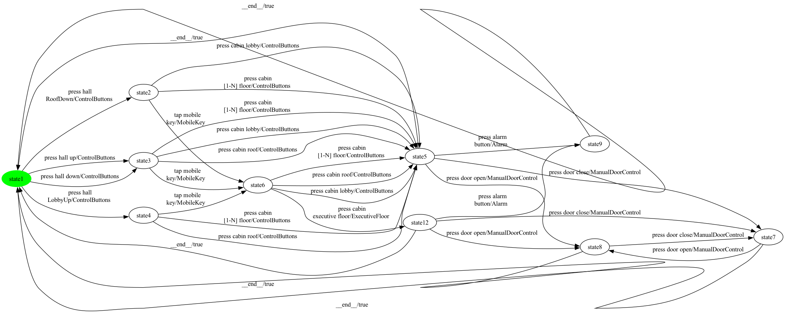

### State coverage (1 test case, 11 transitions)

```
press hall 
RoofDown -> press cabin lobby -> press alarm
button -> __end__ -> press hall up -> tap mobile
key -> press cabin 
executive floor -> press door close -> press door open -> __end__ -> press hall 
LobbyUp
```

### All-transitions coverage (15 test cases, 26 transitions total)

- **`Elevator_p26_trans_seg0`**: `press hall 
RoofDown -> press cabin lobby -> press alarm
button`
- **`Elevator_p26_trans_seg1`**: `press cabin 
[1-N] floor -> press door open -> press door close`
- **`Elevator_p26_trans_seg2`**: `tap mobile
key -> press cabin lobby -> press door close`
- **`Elevator_p26_trans_seg3`**: `press cabin 
[1-N] floor`
- **`Elevator_p26_trans_seg4`**: `press cabin roof`
- **`Elevator_p26_trans_seg5`**: `press cabin 
executive floor -> press alarm
button`
- **`Elevator_p26_trans_seg6`**: `press door close -> press door open`
- **`Elevator_p26_trans_seg7`**: `tap mobile
key`
- **`Elevator_p26_trans_seg8`**: `press door open`
- **`Elevator_p26_trans_seg9`**: `press hall up -> press cabin lobby`
- **`Elevator_p26_trans_seg10`**: `press hall down -> press cabin roof`
- **`Elevator_p26_trans_seg11`**: `press cabin 
[1-N] floor`
- **`Elevator_p26_trans_seg12`**: `press cabin roof`
- **`Elevator_p26_trans_seg13`**: `press cabin 
[1-N] floor`
- **`Elevator_p26_trans_seg14`**: `press hall 
LobbyUp -> tap mobile
key`

### All-transition-pairs coverage (61 test cases, 146 transitions total)

- **`Elevator_p26_pair_seg0`**: `press hall up`
- **`Elevator_p26_pair_seg1`**: `press cabin roof -> press door open -> press door close -> press door open`
- **`Elevator_p26_pair_seg2`**: `__end__ -> press hall down -> press cabin lobby -> press door open`
- **`Elevator_p26_pair_seg3`**: `press hall up -> press cabin roof`
- **`Elevator_p26_pair_seg4`**: `__end__ -> press hall down -> tap mobile
key -> press cabin 
[1-N] floor -> press door close -> press door open`
- **`Elevator_p26_pair_seg5`**: `__end__ -> press hall up`
- **`Elevator_p26_pair_seg6`**: `tap mobile
key -> press cabin lobby -> press door close`
- **`Elevator_p26_pair_seg7`**: `press hall up -> tap mobile
key -> press cabin roof -> press door close`
- **`Elevator_p26_pair_seg8`**: `press cabin lobby -> press door open`
- **`Elevator_p26_pair_seg9`**: `__end__ -> press hall 
RoofDown`
- **`Elevator_p26_pair_seg10`**: `__end__ -> press hall down -> press cabin roof -> press door close`
- **`Elevator_p26_pair_seg11`**: `press cabin lobby -> press alarm
button`
- **`Elevator_p26_pair_seg12`**: `press hall 
RoofDown -> press cabin lobby`
- **`Elevator_p26_pair_seg13`**: `press cabin lobby -> press door close`
- **`Elevator_p26_pair_seg14`**: `press cabin 
[1-N] floor -> press door close`
- **`Elevator_p26_pair_seg15`**: `press cabin 
[1-N] floor -> press door open`
- **`Elevator_p26_pair_seg16`**: `press cabin 
[1-N] floor -> press alarm
button`
- **`Elevator_p26_pair_seg17`**: `__end__ -> press hall 
RoofDown -> press cabin 
[1-N] floor`
- **`Elevator_p26_pair_seg18`**: `tap mobile
key -> press cabin roof`
- **`Elevator_p26_pair_seg19`**: `__end__ -> press hall 
RoofDown`
- **`Elevator_p26_pair_seg20`**: `press cabin roof -> press alarm
button`
- **`Elevator_p26_pair_seg21`**: `tap mobile
key -> press cabin lobby -> press alarm
button`
- **`Elevator_p26_pair_seg22`**: `press cabin lobby -> press door open`
- **`Elevator_p26_pair_seg23`**: `tap mobile
key -> press cabin 
[1-N] floor`
- **`Elevator_p26_pair_seg24`**: `press cabin 
[1-N] floor -> press alarm
button`
- **`Elevator_p26_pair_seg25`**: `press cabin 
executive floor -> press alarm
button`
- **`Elevator_p26_pair_seg26`**: `__end__ -> press hall 
LobbyUp`
- **`Elevator_p26_pair_seg27`**: `tap mobile
key -> press cabin 
[1-N] floor -> press door open`
- **`Elevator_p26_pair_seg28`**: `__end__ -> press hall up`
- **`Elevator_p26_pair_seg29`**: `tap mobile
key -> press cabin 
executive floor`
- **`Elevator_p26_pair_seg30`**: `__end__ -> press hall 
RoofDown`
- **`Elevator_p26_pair_seg31`**: `__end__ -> press hall down`
- **`Elevator_p26_pair_seg32`**: `press cabin roof -> press alarm
button`
- **`Elevator_p26_pair_seg33`**: `press cabin 
executive floor -> press door open`
- **`Elevator_p26_pair_seg34`**: `__end__ -> press hall 
LobbyUp -> tap mobile
key -> press cabin lobby`
- **`Elevator_p26_pair_seg35`**: `tap mobile
key -> press cabin 
executive floor`
- **`Elevator_p26_pair_seg36`**: `press door open -> press door close`
- **`Elevator_p26_pair_seg37`**: `__end__ -> press hall 
RoofDown -> tap mobile
key -> press cabin 
executive floor -> press door close -> press door open -> press door close`
- **`Elevator_p26_pair_seg38`**: `tap mobile
key -> press cabin roof -> press door open`
- **`Elevator_p26_pair_seg39`**: `press hall 
LobbyUp -> press cabin 
[1-N] floor`
- **`Elevator_p26_pair_seg40`**: `__end__ -> press hall 
LobbyUp`
- **`Elevator_p26_pair_seg41`**: `press cabin 
[1-N] floor -> press door open`
- **`Elevator_p26_pair_seg42`**: `press cabin 
[1-N] floor -> press door close`
- **`Elevator_p26_pair_seg43`**: `__end__ -> press hall 
LobbyUp`
- **`Elevator_p26_pair_seg44`**: `press cabin 
[1-N] floor -> press alarm
button`
- **`Elevator_p26_pair_seg45`**: `__end__ -> press hall up -> press cabin lobby -> press alarm
button`
- **`Elevator_p26_pair_seg46`**: `press cabin lobby -> press door close`
- **`Elevator_p26_pair_seg47`**: `press cabin 
[1-N] floor -> press door open`
- **`Elevator_p26_pair_seg48`**: `press hall 
LobbyUp -> press cabin roof`
- **`Elevator_p26_pair_seg49`**: `__end__ -> press hall up`
- **`Elevator_p26_pair_seg50`**: `press cabin 
[1-N] floor -> press alarm
button`
- **`Elevator_p26_pair_seg51`**: `__end__ -> press hall 
LobbyUp`
- **`Elevator_p26_pair_seg52`**: `press cabin roof -> press alarm
button`
- **`Elevator_p26_pair_seg53`**: `press hall 
LobbyUp`
- **`Elevator_p26_pair_seg54`**: `press cabin roof -> press door open`
- **`Elevator_p26_pair_seg55`**: `press cabin roof -> press door close`
- **`Elevator_p26_pair_seg56`**: `press hall up -> press cabin 
[1-N] floor`
- **`Elevator_p26_pair_seg57`**: `press hall 
RoofDown`
- **`Elevator_p26_pair_seg58`**: `__end__ -> press hall up`
- **`Elevator_p26_pair_seg59`**: `press hall down -> press cabin 
[1-N] floor -> press door close`
- **`Elevator_p26_pair_seg60`**: `__end__ -> press hall down`

## Product 27

**Selected features:** selected = {ControlButtons, Intercom, ManualDoorControl, PinPad}

**Repaired FTS:** 9 states, 26 transitions

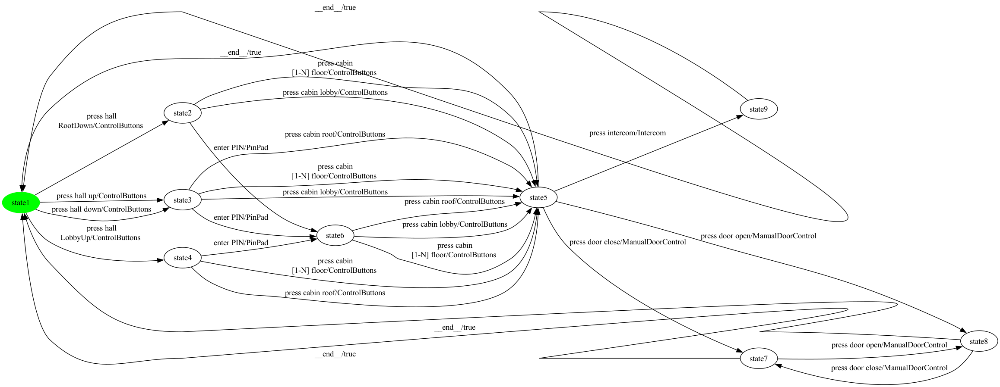

### State coverage (1 test case, 11 transitions)

```
press hall 
RoofDown -> enter PIN -> press cabin lobby -> press intercom -> __end__ -> press hall up -> press cabin lobby -> press door open -> press door close -> __end__ -> press hall 
LobbyUp
```

### All-transitions coverage (10 test cases, 22 transitions total)

- **`Elevator_p27_trans_seg0`**: `enter PIN -> press cabin lobby -> press intercom`
- **`Elevator_p27_trans_seg1`**: `press hall 
RoofDown -> press cabin lobby -> press door open -> press door close`
- **`Elevator_p27_trans_seg2`**: `press cabin 
[1-N] floor -> press door close -> press door open`
- **`Elevator_p27_trans_seg3`**: `press hall up -> press cabin lobby`
- **`Elevator_p27_trans_seg4`**: `press cabin roof`
- **`Elevator_p27_trans_seg5`**: `press hall down -> press cabin 
[1-N] floor`
- **`Elevator_p27_trans_seg6`**: `enter PIN -> press cabin 
[1-N] floor`
- **`Elevator_p27_trans_seg7`**: `press cabin roof`
- **`Elevator_p27_trans_seg8`**: `press hall 
LobbyUp -> press cabin 
[1-N] floor`
- **`Elevator_p27_trans_seg9`**: `enter PIN -> press cabin roof`

### All-transition-pairs coverage (52 test cases, 125 transitions total)

- **`Elevator_p27_pair_seg0`**: `press hall 
RoofDown`
- **`Elevator_p27_pair_seg1`**: `press door open -> press door close -> press door open`
- **`Elevator_p27_pair_seg2`**: `__end__ -> press hall 
RoofDown`
- **`Elevator_p27_pair_seg3`**: `press cabin lobby -> press door open`
- **`Elevator_p27_pair_seg4`**: `__end__ -> press hall down -> press cabin lobby -> press door open`
- **`Elevator_p27_pair_seg5`**: `__end__ -> press hall 
RoofDown -> press cabin lobby -> press intercom`
- **`Elevator_p27_pair_seg6`**: `press hall up -> press cabin lobby`
- **`Elevator_p27_pair_seg7`**: `press door close -> press door open -> press door close`
- **`Elevator_p27_pair_seg8`**: `press cabin lobby -> press door close`
- **`Elevator_p27_pair_seg9`**: `press cabin lobby -> press door open`
- **`Elevator_p27_pair_seg10`**: `__end__ -> press hall down -> press cabin roof -> press intercom`
- **`Elevator_p27_pair_seg11`**: `__end__ -> press hall up`
- **`Elevator_p27_pair_seg12`**: `press cabin lobby -> press intercom`
- **`Elevator_p27_pair_seg13`**: `press cabin lobby -> press door close`
- **`Elevator_p27_pair_seg14`**: `enter PIN -> press cabin lobby -> press intercom`
- **`Elevator_p27_pair_seg15`**: `press hall 
RoofDown -> enter PIN -> press cabin 
[1-N] floor -> press intercom`
- **`Elevator_p27_pair_seg16`**: `press hall up -> press cabin roof -> press door open`
- **`Elevator_p27_pair_seg17`**: `press cabin roof -> press door close`
- **`Elevator_p27_pair_seg18`**: `enter PIN -> press cabin roof`
- **`Elevator_p27_pair_seg19`**: `press cabin roof -> press door close`
- **`Elevator_p27_pair_seg20`**: `press cabin 
[1-N] floor -> press door close`
- **`Elevator_p27_pair_seg21`**: `__end__ -> press hall 
RoofDown`
- **`Elevator_p27_pair_seg22`**: `press cabin 
[1-N] floor -> press door open`
- **`Elevator_p27_pair_seg23`**: `__end__ -> press hall up -> enter PIN`
- **`Elevator_p27_pair_seg24`**: `press cabin 
[1-N] floor -> press door close`
- **`Elevator_p27_pair_seg25`**: `press hall 
LobbyUp -> press cabin roof`
- **`Elevator_p27_pair_seg26`**: `__end__ -> press hall 
RoofDown -> press cabin 
[1-N] floor`
- **`Elevator_p27_pair_seg27`**: `press cabin 
[1-N] floor -> press intercom`
- **`Elevator_p27_pair_seg28`**: `__end__ -> press hall down`
- **`Elevator_p27_pair_seg29`**: `enter PIN -> press cabin 
[1-N] floor -> press door open`
- **`Elevator_p27_pair_seg30`**: `enter PIN -> press cabin roof -> press intercom`
- **`Elevator_p27_pair_seg31`**: `__end__ -> press hall 
LobbyUp`
- **`Elevator_p27_pair_seg32`**: `__end__ -> press hall up`
- **`Elevator_p27_pair_seg33`**: `press cabin 
[1-N] floor -> press door open`
- **`Elevator_p27_pair_seg34`**: `__end__ -> press hall 
LobbyUp`
- **`Elevator_p27_pair_seg35`**: `press cabin roof -> press door open`
- **`Elevator_p27_pair_seg36`**: `press cabin roof -> press intercom`
- **`Elevator_p27_pair_seg37`**: `press cabin roof -> press door close`
- **`Elevator_p27_pair_seg38`**: `__end__ -> press hall 
LobbyUp`
- **`Elevator_p27_pair_seg39`**: `press cabin 
[1-N] floor -> press door close`
- **`Elevator_p27_pair_seg40`**: `press hall up -> press cabin 
[1-N] floor`
- **`Elevator_p27_pair_seg41`**: `press hall down -> enter PIN -> press cabin lobby`
- **`Elevator_p27_pair_seg42`**: `press hall up`
- **`Elevator_p27_pair_seg43`**: `press hall 
LobbyUp -> press cabin 
[1-N] floor -> press intercom`
- **`Elevator_p27_pair_seg44`**: `__end__ -> press hall 
LobbyUp`
- **`Elevator_p27_pair_seg45`**: `press cabin 
[1-N] floor -> press door open`
- **`Elevator_p27_pair_seg46`**: `enter PIN -> press cabin roof -> press door open`
- **`Elevator_p27_pair_seg47`**: `press hall 
LobbyUp -> enter PIN -> press cabin lobby -> press door close`
- **`Elevator_p27_pair_seg48`**: `__end__ -> press hall down -> press cabin 
[1-N] floor -> press door close`
- **`Elevator_p27_pair_seg49`**: `__end__ -> press hall up`
- **`Elevator_p27_pair_seg50`**: `press cabin 
[1-N] floor -> press intercom`
- **`Elevator_p27_pair_seg51`**: `enter PIN -> press cabin 
[1-N] floor`

## Product 28

**Selected features:** selected = {ControlButtons, Intercom, MobileKey}

**Repaired FTS:** 7 states, 20 transitions


### State coverage (1 test case, 9 transitions)

```
press hall 
RoofDown -> press cabin lobby -> press intercom -> __end__ -> press hall up -> tap mobile
key -> press cabin lobby -> __end__ -> press hall 
LobbyUp
```

### All-transitions coverage (10 test cases, 18 transitions total)

- **`Elevator_p28_trans_seg0`**: `tap mobile
key -> press cabin lobby -> press intercom`
- **`Elevator_p28_trans_seg1`**: `press cabin 
[1-N] floor`
- **`Elevator_p28_trans_seg2`**: `press hall 
RoofDown -> press cabin lobby`
- **`Elevator_p28_trans_seg3`**: `press cabin lobby`
- **`Elevator_p28_trans_seg4`**: `press hall up -> press cabin roof`
- **`Elevator_p28_trans_seg5`**: `press hall down -> press cabin 
[1-N] floor`
- **`Elevator_p28_trans_seg6`**: `tap mobile
key -> press cabin 
[1-N] floor`
- **`Elevator_p28_trans_seg7`**: `press cabin roof`
- **`Elevator_p28_trans_seg8`**: `press hall 
LobbyUp -> press cabin 
[1-N] floor`
- **`Elevator_p28_trans_seg9`**: `tap mobile
key -> press cabin roof`

### All-transition-pairs coverage (28 test cases, 69 transitions total)

- **`Elevator_p28_pair_seg0`**: `press hall 
RoofDown`
- **`Elevator_p28_pair_seg1`**: `__end__ -> press hall down -> press cabin lobby`
- **`Elevator_p28_pair_seg2`**: `press hall down -> press cabin roof -> press intercom`
- **`Elevator_p28_pair_seg3`**: `__end__ -> press hall 
RoofDown -> press cabin lobby -> press intercom`
- **`Elevator_p28_pair_seg4`**: `press cabin 
[1-N] floor -> press intercom`
- **`Elevator_p28_pair_seg5`**: `press hall 
RoofDown -> press cabin 
[1-N] floor`
- **`Elevator_p28_pair_seg6`**: `__end__ -> press hall up -> press cabin lobby -> press intercom`
- **`Elevator_p28_pair_seg7`**: `__end__ -> press hall down -> press cabin 
[1-N] floor`
- **`Elevator_p28_pair_seg8`**: `press hall 
LobbyUp -> press cabin roof`
- **`Elevator_p28_pair_seg9`**: `tap mobile
key -> press cabin roof`
- **`Elevator_p28_pair_seg10`**: `press hall 
RoofDown -> tap mobile
key -> press cabin lobby -> press intercom`
- **`Elevator_p28_pair_seg11`**: `press cabin roof -> press intercom`
- **`Elevator_p28_pair_seg12`**: `__end__ -> press hall 
LobbyUp`
- **`Elevator_p28_pair_seg13`**: `tap mobile
key -> press cabin 
[1-N] floor -> press intercom`
- **`Elevator_p28_pair_seg14`**: `press hall down -> tap mobile
key -> press cabin 
[1-N] floor`
- **`Elevator_p28_pair_seg15`**: `__end__ -> press hall 
RoofDown`
- **`Elevator_p28_pair_seg16`**: `tap mobile
key -> press cabin 
[1-N] floor`
- **`Elevator_p28_pair_seg17`**: `press hall 
LobbyUp -> tap mobile
key -> press cabin roof`
- **`Elevator_p28_pair_seg18`**: `__end__ -> press hall 
LobbyUp`
- **`Elevator_p28_pair_seg19`**: `tap mobile
key -> press cabin lobby`
- **`Elevator_p28_pair_seg20`**: `press hall 
LobbyUp -> press cabin 
[1-N] floor`
- **`Elevator_p28_pair_seg21`**: `__end__ -> press hall up -> press cabin roof`
- **`Elevator_p28_pair_seg22`**: `press hall up -> press cabin 
[1-N] floor -> press intercom`
- **`Elevator_p28_pair_seg23`**: `press hall up`
- **`Elevator_p28_pair_seg24`**: `tap mobile
key -> press cabin lobby`
- **`Elevator_p28_pair_seg25`**: `press hall up -> tap mobile
key -> press cabin roof -> press intercom`
- **`Elevator_p28_pair_seg26`**: `press hall 
LobbyUp`
- **`Elevator_p28_pair_seg27`**: `press cabin 
[1-N] floor -> press intercom`

## Product 29

**Selected features:** selected = {ControlButtons, Intercom, ManualDoorControl, MobileKey}

**Repaired FTS:** 9 states, 26 transitions


### State coverage (1 test case, 11 transitions)

```
press hall 
RoofDown -> press cabin lobby -> press intercom -> __end__ -> press hall up -> tap mobile
key -> press cabin lobby -> press door open -> press door close -> __end__ -> press hall 
LobbyUp
```

### All-transitions coverage (10 test cases, 22 transitions total)

- **`Elevator_p29_trans_seg0`**: `press cabin lobby -> press intercom`
- **`Elevator_p29_trans_seg1`**: `press hall 
RoofDown -> press cabin 
[1-N] floor -> press door open -> press door close`
- **`Elevator_p29_trans_seg2`**: `tap mobile
key -> press cabin lobby -> press door close -> press door open`
- **`Elevator_p29_trans_seg3`**: `press hall up -> tap mobile
key -> press cabin 
[1-N] floor`
- **`Elevator_p29_trans_seg4`**: `press cabin lobby`
- **`Elevator_p29_trans_seg5`**: `press hall down -> press cabin roof`
- **`Elevator_p29_trans_seg6`**: `press cabin 
[1-N] floor`
- **`Elevator_p29_trans_seg7`**: `press cabin roof`
- **`Elevator_p29_trans_seg8`**: `press hall 
LobbyUp -> press cabin 
[1-N] floor`
- **`Elevator_p29_trans_seg9`**: `tap mobile
key -> press cabin roof`

### All-transition-pairs coverage (55 test cases, 128 transitions total)

- **`Elevator_p29_pair_seg0`**: `press hall 
RoofDown`
- **`Elevator_p29_pair_seg1`**: `press door open -> press door close -> press door open`
- **`Elevator_p29_pair_seg2`**: `__end__ -> press hall 
RoofDown`
- **`Elevator_p29_pair_seg3`**: `press cabin lobby -> press door open`
- **`Elevator_p29_pair_seg4`**: `__end__ -> press hall down -> press cabin lobby -> press door open`
- **`Elevator_p29_pair_seg5`**: `press hall 
RoofDown -> press cabin lobby`
- **`Elevator_p29_pair_seg6`**: `__end__ -> press hall 
RoofDown`
- **`Elevator_p29_pair_seg7`**: `press cabin lobby -> press intercom`
- **`Elevator_p29_pair_seg8`**: `press hall up -> press cabin lobby`
- **`Elevator_p29_pair_seg9`**: `press door close -> press door open -> press door close`
- **`Elevator_p29_pair_seg10`**: `press cabin lobby -> press door close`
- **`Elevator_p29_pair_seg11`**: `press cabin 
[1-N] floor -> press door close`
- **`Elevator_p29_pair_seg12`**: `press cabin 
[1-N] floor -> press door open`
- **`Elevator_p29_pair_seg13`**: `__end__ -> press hall down -> press cabin roof -> press intercom`
- **`Elevator_p29_pair_seg14`**: `__end__ -> press hall up`
- **`Elevator_p29_pair_seg15`**: `press cabin lobby -> press intercom`
- **`Elevator_p29_pair_seg16`**: `press cabin lobby -> press door close`
- **`Elevator_p29_pair_seg17`**: `press hall 
RoofDown -> press cabin 
[1-N] floor`
- **`Elevator_p29_pair_seg18`**: `press cabin 
[1-N] floor -> press intercom`
- **`Elevator_p29_pair_seg19`**: `__end__ -> press hall down -> press cabin 
[1-N] floor -> press door open`
- **`Elevator_p29_pair_seg20`**: `__end__ -> press hall 
RoofDown`
- **`Elevator_p29_pair_seg21`**: `tap mobile
key -> press cabin roof`
- **`Elevator_p29_pair_seg22`**: `press hall 
RoofDown -> tap mobile
key`
- **`Elevator_p29_pair_seg23`**: `press cabin roof -> press door close`
- **`Elevator_p29_pair_seg24`**: `tap mobile
key -> press cabin lobby -> press door open`
- **`Elevator_p29_pair_seg25`**: `__end__ -> press hall up`
- **`Elevator_p29_pair_seg26`**: `press cabin roof -> press door open`
- **`Elevator_p29_pair_seg27`**: `press hall up -> press cabin roof -> press door close`
- **`Elevator_p29_pair_seg28`**: `press cabin lobby -> press intercom`
- **`Elevator_p29_pair_seg29`**: `press hall 
LobbyUp -> press cabin roof`
- **`Elevator_p29_pair_seg30`**: `__end__ -> press hall 
LobbyUp`
- **`Elevator_p29_pair_seg31`**: `__end__ -> press hall up`
- **`Elevator_p29_pair_seg32`**: `press hall up -> press cabin 
[1-N] floor -> press door close`
- **`Elevator_p29_pair_seg33`**: `__end__ -> press hall 
RoofDown`
- **`Elevator_p29_pair_seg34`**: `tap mobile
key -> press cabin 
[1-N] floor -> press intercom`
- **`Elevator_p29_pair_seg35`**: `press hall down`
- **`Elevator_p29_pair_seg36`**: `tap mobile
key -> press cabin 
[1-N] floor -> press door close`
- **`Elevator_p29_pair_seg37`**: `__end__ -> press hall 
LobbyUp`
- **`Elevator_p29_pair_seg38`**: `press cabin roof -> press door open`
- **`Elevator_p29_pair_seg39`**: `__end__ -> press hall 
LobbyUp`
- **`Elevator_p29_pair_seg40`**: `press cabin roof -> press intercom`
- **`Elevator_p29_pair_seg41`**: `press cabin roof -> press door close`
- **`Elevator_p29_pair_seg42`**: `__end__ -> press hall down -> tap mobile
key`
- **`Elevator_p29_pair_seg43`**: `press cabin 
[1-N] floor -> press door open`
- **`Elevator_p29_pair_seg44`**: `tap mobile
key -> press cabin 
[1-N] floor`
- **`Elevator_p29_pair_seg45`**: `press hall up`
- **`Elevator_p29_pair_seg46`**: `press cabin 
[1-N] floor -> press intercom`
- **`Elevator_p29_pair_seg47`**: `__end__ -> press hall 
LobbyUp -> tap mobile
key -> press cabin roof -> press intercom`
- **`Elevator_p29_pair_seg48`**: `tap mobile
key -> press cabin lobby`
- **`Elevator_p29_pair_seg49`**: `press hall 
LobbyUp`
- **`Elevator_p29_pair_seg50`**: `press cabin 
[1-N] floor -> press door close`
- **`Elevator_p29_pair_seg51`**: `tap mobile
key -> press cabin lobby -> press door close`
- **`Elevator_p29_pair_seg52`**: `__end__ -> press hall up -> tap mobile
key -> press cabin roof -> press door open`
- **`Elevator_p29_pair_seg53`**: `press hall 
LobbyUp -> press cabin 
[1-N] floor -> press intercom`
- **`Elevator_p29_pair_seg54`**: `press cabin 
[1-N] floor -> press door open`

## Product 30

**Selected features:** selected = {Alarm, ControlButtons, Intercom, PinPad}

**Repaired FTS:** 7 states, 21 transitions

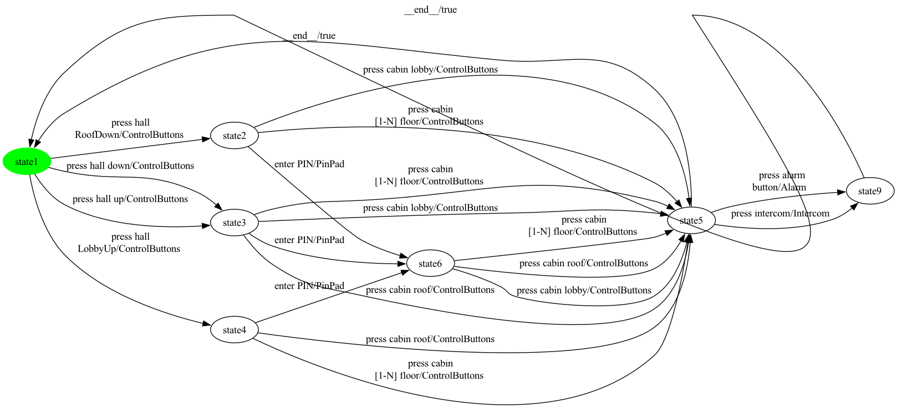

### State coverage (1 test case, 9 transitions)

```
press hall 
RoofDown -> enter PIN -> press cabin lobby -> press intercom -> __end__ -> press hall up -> press cabin lobby -> __end__ -> press hall 
LobbyUp
```

### All-transitions coverage (10 test cases, 19 transitions total)

- **`Elevator_p30_trans_seg0`**: `press cabin 
[1-N] floor -> press intercom`
- **`Elevator_p30_trans_seg1`**: `press cabin lobby -> press alarm
button`
- **`Elevator_p30_trans_seg2`**: `press hall 
RoofDown -> enter PIN -> press cabin lobby`
- **`Elevator_p30_trans_seg3`**: `enter PIN -> press cabin 
[1-N] floor`
- **`Elevator_p30_trans_seg4`**: `press hall up -> press cabin lobby`
- **`Elevator_p30_trans_seg5`**: `press hall down -> press cabin roof`
- **`Elevator_p30_trans_seg6`**: `press cabin 
[1-N] floor`
- **`Elevator_p30_trans_seg7`**: `press cabin roof`
- **`Elevator_p30_trans_seg8`**: `press hall 
LobbyUp -> press cabin 
[1-N] floor`
- **`Elevator_p30_trans_seg9`**: `enter PIN -> press cabin roof`

### All-transition-pairs coverage (36 test cases, 87 transitions total)

- **`Elevator_p30_pair_seg0`**: `press hall 
RoofDown`
- **`Elevator_p30_pair_seg1`**: `press cabin lobby -> press alarm
button`
- **`Elevator_p30_pair_seg2`**: `__end__ -> press hall 
RoofDown`
- **`Elevator_p30_pair_seg3`**: `__end__ -> press hall down -> press cabin lobby -> press alarm
button`
- **`Elevator_p30_pair_seg4`**: `press hall 
RoofDown -> press cabin lobby -> press intercom`
- **`Elevator_p30_pair_seg5`**: `enter PIN -> press cabin lobby -> press intercom`
- **`Elevator_p30_pair_seg6`**: `press hall 
RoofDown -> enter PIN -> press cabin 
[1-N] floor -> press intercom`
- **`Elevator_p30_pair_seg7`**: `press hall up -> press cabin lobby`
- **`Elevator_p30_pair_seg8`**: `enter PIN -> press cabin roof`
- **`Elevator_p30_pair_seg9`**: `press cabin 
[1-N] floor -> press alarm
button`
- **`Elevator_p30_pair_seg10`**: `press cabin lobby -> press intercom`
- **`Elevator_p30_pair_seg11`**: `__end__ -> press hall up`
- **`Elevator_p30_pair_seg12`**: `press cabin roof -> press intercom`
- **`Elevator_p30_pair_seg13`**: `press hall up -> press cabin roof`
- **`Elevator_p30_pair_seg14`**: `__end__ -> press hall 
RoofDown`
- **`Elevator_p30_pair_seg15`**: `press cabin 
[1-N] floor -> press intercom`
- **`Elevator_p30_pair_seg16`**: `press hall up -> enter PIN -> press cabin 
[1-N] floor -> press alarm
button`
- **`Elevator_p30_pair_seg17`**: `__end__ -> press hall down -> press cabin roof -> press alarm
button`
- **`Elevator_p30_pair_seg18`**: `press hall down -> enter PIN -> press cabin roof -> press alarm
button`
- **`Elevator_p30_pair_seg19`**: `press hall 
LobbyUp -> press cabin roof`
- **`Elevator_p30_pair_seg20`**: `press cabin roof -> press alarm
button`
- **`Elevator_p30_pair_seg21`**: `press cabin roof -> press intercom`
- **`Elevator_p30_pair_seg22`**: `press hall 
LobbyUp -> press cabin 
[1-N] floor`
- **`Elevator_p30_pair_seg23`**: `press hall 
RoofDown -> press cabin 
[1-N] floor`
- **`Elevator_p30_pair_seg24`**: `press cabin 
[1-N] floor -> press intercom`
- **`Elevator_p30_pair_seg25`**: `__end__ -> press hall 
LobbyUp`
- **`Elevator_p30_pair_seg26`**: `press cabin 
[1-N] floor -> press alarm
button`
- **`Elevator_p30_pair_seg27`**: `press hall down -> press cabin 
[1-N] floor -> press alarm
button`
- **`Elevator_p30_pair_seg28`**: `press hall up`
- **`Elevator_p30_pair_seg29`**: `enter PIN -> press cabin lobby`
- **`Elevator_p30_pair_seg30`**: `__end__ -> press hall 
LobbyUp -> enter PIN -> press cabin 
[1-N] floor`
- **`Elevator_p30_pair_seg31`**: `__end__ -> press hall up -> press cabin 
[1-N] floor`
- **`Elevator_p30_pair_seg32`**: `press cabin 
[1-N] floor -> press intercom`
- **`Elevator_p30_pair_seg33`**: `enter PIN -> press cabin roof -> press intercom`
- **`Elevator_p30_pair_seg34`**: `press hall 
LobbyUp`
- **`Elevator_p30_pair_seg35`**: `enter PIN -> press cabin lobby -> press alarm
button`

## Product 31

**Selected features:** selected = {Alarm, CardReader, ControlButtons, ExecutiveFloor, ManualDoorControl}

**Repaired FTS:** 10 states, 31 transitions


### State coverage (1 test case, 11 transitions)

```
press hall 
RoofDown -> press cabin lobby -> press alarm
button -> __end__ -> press hall up -> read card -> press cabin 
executive floor -> press door close -> press door open -> __end__ -> press hall 
LobbyUp
```

### All-transitions coverage (16 test cases, 26 transitions total)

- **`Elevator_p31_trans_seg0`**: `press hall 
RoofDown -> press cabin lobby -> press alarm
button`
- **`Elevator_p31_trans_seg1`**: `press cabin 
[1-N] floor -> press door open -> press door close`
- **`Elevator_p31_trans_seg2`**: `press cabin lobby -> press door close`
- **`Elevator_p31_trans_seg3`**: `press cabin 
[1-N] floor`
- **`Elevator_p31_trans_seg4`**: `press cabin roof`
- **`Elevator_p31_trans_seg5`**: `press cabin 
executive floor -> press alarm
button`
- **`Elevator_p31_trans_seg6`**: `read card`
- **`Elevator_p31_trans_seg7`**: `press door close -> press door open`
- **`Elevator_p31_trans_seg8`**: `press cabin lobby`
- **`Elevator_p31_trans_seg9`**: `press hall up -> press cabin roof`
- **`Elevator_p31_trans_seg10`**: `press hall down -> press cabin 
[1-N] floor`
- **`Elevator_p31_trans_seg11`**: `read card`
- **`Elevator_p31_trans_seg12`**: `press door open`
- **`Elevator_p31_trans_seg13`**: `press cabin roof`
- **`Elevator_p31_trans_seg14`**: `press cabin 
[1-N] floor`
- **`Elevator_p31_trans_seg15`**: `press hall 
LobbyUp -> read card`

### All-transition-pairs coverage (60 test cases, 145 transitions total)

- **`Elevator_p31_pair_seg0`**: `press hall up -> press cabin roof -> press door open -> press door close -> press door open`
- **`Elevator_p31_pair_seg1`**: `__end__ -> press hall down -> press cabin lobby -> press door open`
- **`Elevator_p31_pair_seg2`**: `read card -> press cabin 
[1-N] floor -> press door close -> press door open`
- **`Elevator_p31_pair_seg3`**: `press hall up -> read card -> press cabin lobby -> press door close`
- **`Elevator_p31_pair_seg4`**: `press hall 
RoofDown -> read card`
- **`Elevator_p31_pair_seg5`**: `press cabin 
executive floor -> press alarm
button`
- **`Elevator_p31_pair_seg6`**: `__end__ -> press hall down -> read card -> press cabin 
executive floor`
- **`Elevator_p31_pair_seg7`**: `__end__ -> press hall 
LobbyUp`
- **`Elevator_p31_pair_seg8`**: `read card -> press cabin 
[1-N] floor`
- **`Elevator_p31_pair_seg9`**: `__end__ -> press hall down`
- **`Elevator_p31_pair_seg10`**: `__end__ -> press hall 
RoofDown`
- **`Elevator_p31_pair_seg11`**: `__end__ -> press hall up`
- **`Elevator_p31_pair_seg12`**: `read card -> press cabin roof -> press door close`
- **`Elevator_p31_pair_seg13`**: `__end__ -> press hall 
RoofDown`
- **`Elevator_p31_pair_seg14`**: `__end__ -> press hall down -> press cabin roof -> press door close`
- **`Elevator_p31_pair_seg15`**: `__end__ -> press hall up -> press cabin lobby -> press alarm
button`
- **`Elevator_p31_pair_seg16`**: `press cabin 
executive floor -> press door open -> press door close`
- **`Elevator_p31_pair_seg17`**: `read card -> press cabin 
executive floor -> press door close -> press door open -> press door close`
- **`Elevator_p31_pair_seg18`**: `read card -> press cabin roof`
- **`Elevator_p31_pair_seg19`**: `press cabin roof -> press alarm
button`
- **`Elevator_p31_pair_seg20`**: `press cabin 
[1-N] floor -> press alarm
button`
- **`Elevator_p31_pair_seg21`**: `__end__ -> press hall 
RoofDown`
- **`Elevator_p31_pair_seg22`**: `read card -> press cabin 
[1-N] floor -> press door open`
- **`Elevator_p31_pair_seg23`**: `press cabin lobby -> press alarm
button`
- **`Elevator_p31_pair_seg24`**: `read card -> press cabin lobby -> press door open`
- **`Elevator_p31_pair_seg25`**: `__end__ -> press hall 
RoofDown`
- **`Elevator_p31_pair_seg26`**: `press cabin lobby -> press door open`
- **`Elevator_p31_pair_seg27`**: `press cabin lobby -> press alarm
button`
- **`Elevator_p31_pair_seg28`**: `press hall 
RoofDown -> press cabin lobby`
- **`Elevator_p31_pair_seg29`**: `__end__ -> press hall 
LobbyUp`
- **`Elevator_p31_pair_seg30`**: `read card -> press cabin roof -> press door open`
- **`Elevator_p31_pair_seg31`**: `press cabin lobby -> press door close`
- **`Elevator_p31_pair_seg32`**: `press cabin 
[1-N] floor -> press door close`
- **`Elevator_p31_pair_seg33`**: `press cabin 
[1-N] floor -> press door open`
- **`Elevator_p31_pair_seg34`**: `__end__ -> press hall 
LobbyUp`
- **`Elevator_p31_pair_seg35`**: `read card -> press cabin 
executive floor`
- **`Elevator_p31_pair_seg36`**: `__end__ -> press hall 
RoofDown`
- **`Elevator_p31_pair_seg37`**: `press cabin 
[1-N] floor -> press alarm
button`
- **`Elevator_p31_pair_seg38`**: `__end__ -> press hall up`
- **`Elevator_p31_pair_seg39`**: `press cabin lobby -> press door close`
- **`Elevator_p31_pair_seg40`**: `__end__ -> press hall 
LobbyUp -> read card -> press cabin lobby`
- **`Elevator_p31_pair_seg41`**: `press cabin 
[1-N] floor -> press door open`
- **`Elevator_p31_pair_seg42`**: `press hall 
LobbyUp -> press cabin 
[1-N] floor`
- **`Elevator_p31_pair_seg43`**: `press hall up -> press cabin 
[1-N] floor -> press alarm
button`
- **`Elevator_p31_pair_seg44`**: `press cabin 
[1-N] floor -> press door open`
- **`Elevator_p31_pair_seg45`**: `press cabin 
[1-N] floor -> press door close`
- **`Elevator_p31_pair_seg46`**: `__end__ -> press hall up`
- **`Elevator_p31_pair_seg47`**: `press hall 
LobbyUp`
- **`Elevator_p31_pair_seg48`**: `press cabin 
[1-N] floor -> press alarm
button`
- **`Elevator_p31_pair_seg49`**: `press hall 
LobbyUp -> press cabin roof`
- **`Elevator_p31_pair_seg50`**: `press hall 
RoofDown -> press cabin 
[1-N] floor`
- **`Elevator_p31_pair_seg51`**: `press hall down`
- **`Elevator_p31_pair_seg52`**: `press cabin roof -> press alarm
button`
- **`Elevator_p31_pair_seg53`**: `press cabin roof -> press alarm
button`
- **`Elevator_p31_pair_seg54`**: `__end__ -> press hall 
LobbyUp`
- **`Elevator_p31_pair_seg55`**: `press cabin roof -> press door open`
- **`Elevator_p31_pair_seg56`**: `press cabin roof -> press door close`
- **`Elevator_p31_pair_seg57`**: `__end__ -> press hall up`
- **`Elevator_p31_pair_seg58`**: `press cabin 
[1-N] floor -> press door close`
- **`Elevator_p31_pair_seg59`**: `__end__ -> press hall down -> press cabin 
[1-N] floor`

## Product 32

**Selected features:** selected = {Alarm, CardReader, ControlButtons, ManualDoorControl}

**Repaired FTS:** 9 states, 26 transitions


### State coverage (1 test case, 11 transitions)

```
press hall 
RoofDown -> press cabin lobby -> press alarm
button -> __end__ -> press hall up -> read card -> press cabin lobby -> press door open -> press door close -> __end__ -> press hall 
LobbyUp
```

### All-transitions coverage (10 test cases, 22 transitions total)

- **`Elevator_p32_trans_seg0`**: `press cabin lobby -> press alarm
button`
- **`Elevator_p32_trans_seg1`**: `press hall 
RoofDown -> press cabin 
[1-N] floor -> press door open -> press door close`
- **`Elevator_p32_trans_seg2`**: `read card -> press cabin lobby -> press door close -> press door open`
- **`Elevator_p32_trans_seg3`**: `press hall up -> press cabin lobby`
- **`Elevator_p32_trans_seg4`**: `press cabin roof`
- **`Elevator_p32_trans_seg5`**: `press hall down -> press cabin 
[1-N] floor`
- **`Elevator_p32_trans_seg6`**: `read card -> press cabin 
[1-N] floor`
- **`Elevator_p32_trans_seg7`**: `press cabin roof`
- **`Elevator_p32_trans_seg8`**: `press hall 
LobbyUp -> press cabin 
[1-N] floor`
- **`Elevator_p32_trans_seg9`**: `read card -> press cabin roof`

### All-transition-pairs coverage (51 test cases, 124 transitions total)

- **`Elevator_p32_pair_seg0`**: `press hall 
RoofDown`
- **`Elevator_p32_pair_seg1`**: `read card -> press cabin 
[1-N] floor -> press door close -> press door open`
- **`Elevator_p32_pair_seg2`**: `__end__ -> press hall 
RoofDown`
- **`Elevator_p32_pair_seg3`**: `press cabin 
[1-N] floor -> press alarm
button`
- **`Elevator_p32_pair_seg4`**: `press hall 
RoofDown -> read card`
- **`Elevator_p32_pair_seg5`**: `press cabin lobby -> press door open -> press door close -> press door open -> press door close`
- **`Elevator_p32_pair_seg6`**: `read card -> press cabin lobby`
- **`Elevator_p32_pair_seg7`**: `__end__ -> press hall down -> press cabin lobby -> press door open`
- **`Elevator_p32_pair_seg8`**: `read card -> press cabin roof`
- **`Elevator_p32_pair_seg9`**: `__end__ -> press hall 
RoofDown`
- **`Elevator_p32_pair_seg10`**: `press cabin roof -> press alarm
button`
- **`Elevator_p32_pair_seg11`**: `__end__ -> press hall 
RoofDown`
- **`Elevator_p32_pair_seg12`**: `press cabin lobby -> press door open`
- **`Elevator_p32_pair_seg13`**: `press cabin lobby -> press alarm
button`
- **`Elevator_p32_pair_seg14`**: `press hall up -> press cabin lobby -> press alarm
button`
- **`Elevator_p32_pair_seg15`**: `__end__ -> press hall up`
- **`Elevator_p32_pair_seg16`**: `press cabin lobby -> press door close`
- **`Elevator_p32_pair_seg17`**: `press hall 
RoofDown -> press cabin lobby`
- **`Elevator_p32_pair_seg18`**: `read card -> press cabin 
[1-N] floor -> press door open`
- **`Elevator_p32_pair_seg19`**: `__end__ -> press hall down -> press cabin roof`
- **`Elevator_p32_pair_seg20`**: `__end__ -> press hall 
LobbyUp`
- **`Elevator_p32_pair_seg21`**: `read card -> press cabin lobby -> press door close`
- **`Elevator_p32_pair_seg22`**: `press cabin lobby -> press door close`
- **`Elevator_p32_pair_seg23`**: `press cabin 
[1-N] floor -> press door close`
- **`Elevator_p32_pair_seg24`**: `press cabin 
[1-N] floor -> press alarm
button`
- **`Elevator_p32_pair_seg25`**: `press cabin roof -> press door open`
- **`Elevator_p32_pair_seg26`**: `press hall up -> press cabin roof -> press door close`
- **`Elevator_p32_pair_seg27`**: `press cabin 
[1-N] floor -> press door open`
- **`Elevator_p32_pair_seg28`**: `__end__ -> press hall up`
- **`Elevator_p32_pair_seg29`**: `press cabin roof -> press alarm
button`
- **`Elevator_p32_pair_seg30`**: `press hall up -> press cabin 
[1-N] floor -> press door open`
- **`Elevator_p32_pair_seg31`**: `__end__ -> press hall 
LobbyUp -> read card -> press cabin roof -> press door close`
- **`Elevator_p32_pair_seg32`**: `__end__ -> press hall 
RoofDown -> press cabin 
[1-N] floor`
- **`Elevator_p32_pair_seg33`**: `press hall 
LobbyUp -> press cabin roof`
- **`Elevator_p32_pair_seg34`**: `__end__ -> press hall up`
- **`Elevator_p32_pair_seg35`**: `press cabin 
[1-N] floor -> press alarm
button`
- **`Elevator_p32_pair_seg36`**: `__end__ -> press hall down -> read card -> press cabin 
[1-N] floor`
- **`Elevator_p32_pair_seg37`**: `press hall down -> press cabin 
[1-N] floor`
- **`Elevator_p32_pair_seg38`**: `press hall up -> read card -> press cabin roof -> press door open`
- **`Elevator_p32_pair_seg39`**: `press hall 
LobbyUp`
- **`Elevator_p32_pair_seg40`**: `press cabin roof -> press alarm
button`
- **`Elevator_p32_pair_seg41`**: `press cabin roof -> press door open`
- **`Elevator_p32_pair_seg42`**: `press cabin roof -> press door close`
- **`Elevator_p32_pair_seg43`**: `__end__ -> press hall 
LobbyUp -> press cabin 
[1-N] floor -> press door close`
- **`Elevator_p32_pair_seg44`**: `__end__ -> press hall down`
- **`Elevator_p32_pair_seg45`**: `press cabin 
[1-N] floor -> press door close`
- **`Elevator_p32_pair_seg46`**: `__end__ -> press hall up`
- **`Elevator_p32_pair_seg47`**: `read card -> press cabin lobby -> press alarm
button`
- **`Elevator_p32_pair_seg48`**: `press cabin 
[1-N] floor -> press alarm
button`
- **`Elevator_p32_pair_seg49`**: `__end__ -> press hall 
LobbyUp`
- **`Elevator_p32_pair_seg50`**: `press cabin 
[1-N] floor -> press door open`

## Product 33

**Selected features:** selected = {Alarm, ControlButtons, Intercom, ManualDoorControl, MobileKey}

**Repaired FTS:** 9 states, 27 transitions

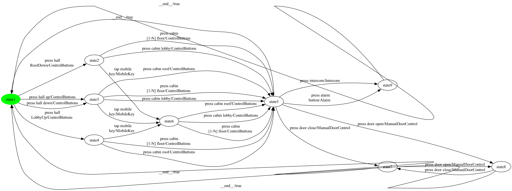

### State coverage (1 test case, 11 transitions)

```
press hall 
RoofDown -> press cabin lobby -> press intercom -> __end__ -> press hall up -> tap mobile
key -> press cabin lobby -> press door open -> press door close -> __end__ -> press hall 
LobbyUp
```

### All-transitions coverage (10 test cases, 23 transitions total)

- **`Elevator_p33_trans_seg0`**: `press cabin lobby -> press intercom`
- **`Elevator_p33_trans_seg1`**: `press hall 
RoofDown -> press cabin 
[1-N] floor -> press alarm
button`
- **`Elevator_p33_trans_seg2`**: `tap mobile
key -> press cabin lobby -> press door open -> press door close`
- **`Elevator_p33_trans_seg3`**: `press hall up -> tap mobile
key -> press cabin 
[1-N] floor -> press door close -> press door open`
- **`Elevator_p33_trans_seg4`**: `press cabin lobby`
- **`Elevator_p33_trans_seg5`**: `press hall down -> press cabin roof`
- **`Elevator_p33_trans_seg6`**: `press cabin 
[1-N] floor`
- **`Elevator_p33_trans_seg7`**: `press cabin roof`
- **`Elevator_p33_trans_seg8`**: `press hall 
LobbyUp -> press cabin 
[1-N] floor`
- **`Elevator_p33_trans_seg9`**: `tap mobile
key -> press cabin roof`

### All-transition-pairs coverage (58 test cases, 141 transitions total)

- **`Elevator_p33_pair_seg0`**: `press hall up`
- **`Elevator_p33_pair_seg1`**: `press cabin roof -> press intercom`
- **`Elevator_p33_pair_seg2`**: `__end__ -> press hall down -> press cabin lobby -> press door open -> press door close -> press door open`
- **`Elevator_p33_pair_seg3`**: `__end__ -> press hall down -> tap mobile
key -> press cabin 
[1-N] floor -> press intercom`
- **`Elevator_p33_pair_seg4`**: `press cabin lobby -> press intercom`
- **`Elevator_p33_pair_seg5`**: `press cabin lobby -> press door open`
- **`Elevator_p33_pair_seg6`**: `press cabin roof -> press door open`
- **`Elevator_p33_pair_seg7`**: `__end__ -> press hall up`
- **`Elevator_p33_pair_seg8`**: `__end__ -> press hall down -> press cabin roof -> press door close -> press door open -> press door close`
- **`Elevator_p33_pair_seg9`**: `press hall 
RoofDown -> press cabin lobby -> press alarm
button`
- **`Elevator_p33_pair_seg10`**: `__end__ -> press hall 
RoofDown`
- **`Elevator_p33_pair_seg11`**: `press cabin lobby -> press door close`
- **`Elevator_p33_pair_seg12`**: `press cabin 
[1-N] floor -> press door close`
- **`Elevator_p33_pair_seg13`**: `press cabin 
[1-N] floor -> press door open`
- **`Elevator_p33_pair_seg14`**: `press hall up -> press cabin roof -> press alarm
button`
- **`Elevator_p33_pair_seg15`**: `press cabin 
[1-N] floor -> press alarm
button`
- **`Elevator_p33_pair_seg16`**: `press hall 
RoofDown -> press cabin 
[1-N] floor`
- **`Elevator_p33_pair_seg17`**: `press cabin 
[1-N] floor -> press intercom`
- **`Elevator_p33_pair_seg18`**: `tap mobile
key -> press cabin roof -> press door close`
- **`Elevator_p33_pair_seg19`**: `__end__ -> press hall 
RoofDown`
- **`Elevator_p33_pair_seg20`**: `press cabin roof -> press intercom`
- **`Elevator_p33_pair_seg21`**: `tap mobile
key -> press cabin lobby -> press door close`
- **`Elevator_p33_pair_seg22`**: `__end__ -> press hall 
RoofDown`
- **`Elevator_p33_pair_seg23`**: `tap mobile
key -> press cabin lobby -> press alarm
button`
- **`Elevator_p33_pair_seg24`**: `press hall up -> tap mobile
key -> press cabin roof -> press alarm
button`
- **`Elevator_p33_pair_seg25`**: `__end__ -> press hall up -> press cabin lobby -> press alarm
button`
- **`Elevator_p33_pair_seg26`**: `press cabin lobby -> press door open`
- **`Elevator_p33_pair_seg27`**: `press cabin lobby -> press intercom`
- **`Elevator_p33_pair_seg28`**: `press hall 
LobbyUp -> tap mobile
key -> press cabin 
[1-N] floor -> press door close`
- **`Elevator_p33_pair_seg29`**: `press cabin lobby -> press intercom`
- **`Elevator_p33_pair_seg30`**: `tap mobile
key -> press cabin lobby`
- **`Elevator_p33_pair_seg31`**: `__end__ -> press hall 
LobbyUp`
- **`Elevator_p33_pair_seg32`**: `tap mobile
key -> press cabin roof -> press door open`
- **`Elevator_p33_pair_seg33`**: `__end__ -> press hall 
RoofDown -> tap mobile
key -> press cabin 
[1-N] floor`
- **`Elevator_p33_pair_seg34`**: `__end__ -> press hall up`
- **`Elevator_p33_pair_seg35`**: `press cabin lobby -> press door close`
- **`Elevator_p33_pair_seg36`**: `__end__ -> press hall 
LobbyUp`
- **`Elevator_p33_pair_seg37`**: `press cabin 
[1-N] floor -> press door open`
- **`Elevator_p33_pair_seg38`**: `press cabin 
[1-N] floor -> press alarm
button`
- **`Elevator_p33_pair_seg39`**: `press cabin 
[1-N] floor -> press door open`
- **`Elevator_p33_pair_seg40`**: `__end__ -> press hall 
LobbyUp -> press cabin 
[1-N] floor -> press door close`
- **`Elevator_p33_pair_seg41`**: `press cabin 
[1-N] floor -> press alarm
button`
- **`Elevator_p33_pair_seg42`**: `press cabin 
[1-N] floor -> press intercom`
- **`Elevator_p33_pair_seg43`**: `__end__ -> press hall 
LobbyUp`
- **`Elevator_p33_pair_seg44`**: `press cabin 
[1-N] floor -> press alarm
button`
- **`Elevator_p33_pair_seg45`**: `press hall 
LobbyUp -> press cabin roof`
- **`Elevator_p33_pair_seg46`**: `press hall up -> press cabin 
[1-N] floor`
- **`Elevator_p33_pair_seg47`**: `press hall 
RoofDown`
- **`Elevator_p33_pair_seg48`**: `press cabin 
[1-N] floor -> press door open`
- **`Elevator_p33_pair_seg49`**: `press cabin roof -> press alarm
button`
- **`Elevator_p33_pair_seg50`**: `press hall down`
- **`Elevator_p33_pair_seg51`**: `press cabin 
[1-N] floor -> press door close`
- **`Elevator_p33_pair_seg52`**: `__end__ -> press hall up`
- **`Elevator_p33_pair_seg53`**: `press cabin 
[1-N] floor -> press intercom`
- **`Elevator_p33_pair_seg54`**: `press cabin roof -> press door open`
- **`Elevator_p33_pair_seg55`**: `press cabin roof -> press intercom`
- **`Elevator_p33_pair_seg56`**: `press cabin roof -> press door close`
- **`Elevator_p33_pair_seg57`**: `__end__ -> press hall down -> press cabin 
[1-N] floor`

## Product 34

**Selected features:** selected = {Alarm, ControlButtons, ExecutiveFloor, Intercom, MobileKey}

**Repaired FTS:** 8 states, 25 transitions

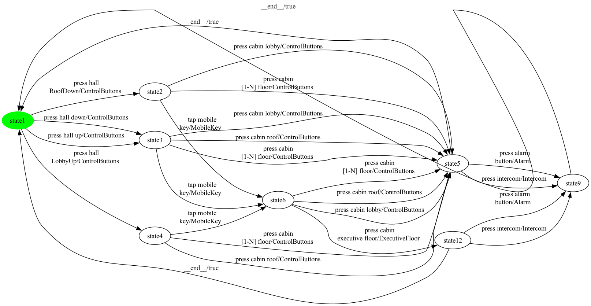

### State coverage (1 test case, 9 transitions)

```
press hall 
RoofDown -> press cabin lobby -> press intercom -> __end__ -> press hall up -> tap mobile
key -> press cabin 
executive floor -> __end__ -> press hall 
LobbyUp
```

### All-transitions coverage (14 test cases, 22 transitions total)

- **`Elevator_p34_trans_seg0`**: `press cabin lobby -> press intercom`
- **`Elevator_p34_trans_seg1`**: `press hall 
RoofDown -> press cabin 
[1-N] floor -> press alarm
button`
- **`Elevator_p34_trans_seg2`**: `press cabin lobby`
- **`Elevator_p34_trans_seg3`**: `tap mobile
key -> press cabin 
[1-N] floor`
- **`Elevator_p34_trans_seg4`**: `press cabin roof`
- **`Elevator_p34_trans_seg5`**: `press cabin 
executive floor -> press intercom`
- **`Elevator_p34_trans_seg6`**: `tap mobile
key`
- **`Elevator_p34_trans_seg7`**: `press alarm
button`
- **`Elevator_p34_trans_seg8`**: `press cabin lobby`
- **`Elevator_p34_trans_seg9`**: `press hall up -> press cabin roof`
- **`Elevator_p34_trans_seg10`**: `press hall down -> press cabin 
[1-N] floor`
- **`Elevator_p34_trans_seg11`**: `press cabin roof`
- **`Elevator_p34_trans_seg12`**: `press cabin 
[1-N] floor`
- **`Elevator_p34_trans_seg13`**: `press hall 
LobbyUp -> tap mobile
key`

### All-transition-pairs coverage (38 test cases, 98 transitions total)

- **`Elevator_p34_pair_seg0`**: `press hall 
RoofDown`
- **`Elevator_p34_pair_seg1`**: `press cabin lobby -> press alarm
button`
- **`Elevator_p34_pair_seg2`**: `__end__ -> press hall down -> press cabin lobby -> press alarm
button`
- **`Elevator_p34_pair_seg3`**: `__end__ -> press hall 
RoofDown -> press cabin lobby`
- **`Elevator_p34_pair_seg4`**: `press cabin lobby -> press intercom`
- **`Elevator_p34_pair_seg5`**: `press cabin 
[1-N] floor -> press alarm
button`
- **`Elevator_p34_pair_seg6`**: `press hall 
RoofDown -> press cabin 
[1-N] floor -> press intercom`
- **`Elevator_p34_pair_seg7`**: `tap mobile
key -> press cabin roof`
- **`Elevator_p34_pair_seg8`**: `tap mobile
key -> press cabin lobby -> press intercom`
- **`Elevator_p34_pair_seg9`**: `tap mobile
key -> press cabin 
[1-N] floor -> press intercom`
- **`Elevator_p34_pair_seg10`**: `press hall up -> press cabin lobby`
- **`Elevator_p34_pair_seg11`**: `__end__ -> press hall 
RoofDown`
- **`Elevator_p34_pair_seg12`**: `__end__ -> press hall 
RoofDown -> tap mobile
key -> press cabin 
executive floor`
- **`Elevator_p34_pair_seg13`**: `__end__ -> press hall 
LobbyUp -> press cabin roof`
- **`Elevator_p34_pair_seg14`**: `__end__ -> press hall up`
- **`Elevator_p34_pair_seg15`**: `press cabin lobby -> press intercom`
- **`Elevator_p34_pair_seg16`**: `press cabin roof -> press intercom`
- **`Elevator_p34_pair_seg17`**: `__end__ -> press hall up -> press cabin roof`
- **`Elevator_p34_pair_seg18`**: `__end__ -> press hall down -> press cabin roof -> press alarm
button`
- **`Elevator_p34_pair_seg19`**: `press cabin 
[1-N] floor -> press alarm
button`
- **`Elevator_p34_pair_seg20`**: `__end__ -> press hall down -> press cabin 
[1-N] floor`
- **`Elevator_p34_pair_seg21`**: `__end__ -> press hall 
LobbyUp`
- **`Elevator_p34_pair_seg22`**: `press cabin roof -> press alarm
button`
- **`Elevator_p34_pair_seg23`**: `press cabin roof -> press intercom`
- **`Elevator_p34_pair_seg24`**: `tap mobile
key -> press cabin 
[1-N] floor -> press alarm
button`
- **`Elevator_p34_pair_seg25`**: `press hall 
LobbyUp -> tap mobile
key -> press cabin roof -> press alarm
button`
- **`Elevator_p34_pair_seg26`**: `press hall down -> tap mobile
key -> press cabin 
[1-N] floor`
- **`Elevator_p34_pair_seg27`**: `__end__ -> press hall up -> press cabin 
[1-N] floor -> press intercom`
- **`Elevator_p34_pair_seg28`**: `tap mobile
key -> press cabin lobby`
- **`Elevator_p34_pair_seg29`**: `tap mobile
key -> press cabin roof -> press intercom`
- **`Elevator_p34_pair_seg30`**: `__end__ -> press hall 
LobbyUp`
- **`Elevator_p34_pair_seg31`**: `tap mobile
key -> press cabin 
executive floor -> press alarm
button`
- **`Elevator_p34_pair_seg32`**: `press hall 
LobbyUp -> press cabin 
[1-N] floor`
- **`Elevator_p34_pair_seg33`**: `tap mobile
key -> press cabin 
executive floor -> press intercom`
- **`Elevator_p34_pair_seg34`**: `press cabin 
[1-N] floor -> press intercom`
- **`Elevator_p34_pair_seg35`**: `press hall up -> tap mobile
key -> press cabin lobby -> press alarm
button`
- **`Elevator_p34_pair_seg36`**: `press hall 
LobbyUp`
- **`Elevator_p34_pair_seg37`**: `press cabin 
[1-N] floor -> press alarm
button`

## Product 35

**Selected features:** selected = {ControlButtons, Intercom, PinPad}

**Repaired FTS:** 7 states, 20 transitions


### State coverage (1 test case, 9 transitions)

```
press hall 
RoofDown -> enter PIN -> press cabin lobby -> press intercom -> __end__ -> press hall up -> press cabin lobby -> __end__ -> press hall 
LobbyUp
```

### All-transitions coverage (10 test cases, 18 transitions total)

- **`Elevator_p35_trans_seg0`**: `press cabin 
[1-N] floor -> press intercom`
- **`Elevator_p35_trans_seg1`**: `press cabin lobby`
- **`Elevator_p35_trans_seg2`**: `press hall 
RoofDown -> enter PIN -> press cabin lobby`
- **`Elevator_p35_trans_seg3`**: `enter PIN -> press cabin 
[1-N] floor`
- **`Elevator_p35_trans_seg4`**: `press hall up -> press cabin lobby`
- **`Elevator_p35_trans_seg5`**: `press hall down -> press cabin roof`
- **`Elevator_p35_trans_seg6`**: `press cabin 
[1-N] floor`
- **`Elevator_p35_trans_seg7`**: `press cabin roof`
- **`Elevator_p35_trans_seg8`**: `press hall 
LobbyUp -> press cabin 
[1-N] floor`
- **`Elevator_p35_trans_seg9`**: `enter PIN -> press cabin roof`

### All-transition-pairs coverage (28 test cases, 69 transitions total)

- **`Elevator_p35_pair_seg0`**: `press hall 
RoofDown -> press cabin lobby`
- **`Elevator_p35_pair_seg1`**: `__end__ -> press hall down -> press cabin lobby`
- **`Elevator_p35_pair_seg2`**: `press cabin lobby -> press intercom`
- **`Elevator_p35_pair_seg3`**: `__end__ -> press hall 
RoofDown`
- **`Elevator_p35_pair_seg4`**: `enter PIN -> press cabin lobby -> press intercom`
- **`Elevator_p35_pair_seg5`**: `press hall up -> press cabin lobby -> press intercom`
- **`Elevator_p35_pair_seg6`**: `__end__ -> press hall up -> press cabin roof -> press intercom`
- **`Elevator_p35_pair_seg7`**: `__end__ -> press hall down -> press cabin roof`
- **`Elevator_p35_pair_seg8`**: `enter PIN -> press cabin 
[1-N] floor -> press intercom`
- **`Elevator_p35_pair_seg9`**: `press hall down -> enter PIN -> press cabin 
[1-N] floor`
- **`Elevator_p35_pair_seg10`**: `press hall 
RoofDown -> enter PIN -> press cabin roof`
- **`Elevator_p35_pair_seg11`**: `press cabin 
[1-N] floor -> press intercom`
- **`Elevator_p35_pair_seg12`**: `press hall 
LobbyUp -> press cabin roof`
- **`Elevator_p35_pair_seg13`**: `__end__ -> press hall 
RoofDown`
- **`Elevator_p35_pair_seg14`**: `__end__ -> press hall 
LobbyUp`
- **`Elevator_p35_pair_seg15`**: `press cabin roof -> press intercom`
- **`Elevator_p35_pair_seg16`**: `press hall 
RoofDown -> press cabin 
[1-N] floor`
- **`Elevator_p35_pair_seg17`**: `press hall 
LobbyUp -> press cabin 
[1-N] floor -> press intercom`
- **`Elevator_p35_pair_seg18`**: `press hall down -> press cabin 
[1-N] floor`
- **`Elevator_p35_pair_seg19`**: `press hall up -> enter PIN -> press cabin roof`
- **`Elevator_p35_pair_seg20`**: `__end__ -> press hall 
LobbyUp`
- **`Elevator_p35_pair_seg21`**: `enter PIN -> press cabin 
[1-N] floor`
- **`Elevator_p35_pair_seg22`**: `press hall 
LobbyUp -> enter PIN -> press cabin roof -> press intercom`
- **`Elevator_p35_pair_seg23`**: `press hall 
LobbyUp`
- **`Elevator_p35_pair_seg24`**: `enter PIN -> press cabin lobby`
- **`Elevator_p35_pair_seg25`**: `__end__ -> press hall up`
- **`Elevator_p35_pair_seg26`**: `enter PIN -> press cabin lobby`
- **`Elevator_p35_pair_seg27`**: `press hall up -> press cabin 
[1-N] floor -> press intercom`

## Product 36

**Selected features:** selected = {CardReader, ControlButtons, Intercom, ManualDoorControl}

**Repaired FTS:** 9 states, 26 transitions


### State coverage (1 test case, 11 transitions)

```
press hall 
RoofDown -> press cabin lobby -> press intercom -> __end__ -> press hall up -> read card -> press cabin lobby -> press door open -> press door close -> __end__ -> press hall 
LobbyUp
```

### All-transitions coverage (10 test cases, 22 transitions total)

- **`Elevator_p36_trans_seg0`**: `press cabin lobby -> press intercom`
- **`Elevator_p36_trans_seg1`**: `press hall 
RoofDown -> press cabin 
[1-N] floor -> press door open -> press door close`
- **`Elevator_p36_trans_seg2`**: `read card -> press cabin lobby -> press door close -> press door open`
- **`Elevator_p36_trans_seg3`**: `press hall up -> press cabin lobby`
- **`Elevator_p36_trans_seg4`**: `press cabin roof`
- **`Elevator_p36_trans_seg5`**: `press hall down -> press cabin 
[1-N] floor`
- **`Elevator_p36_trans_seg6`**: `read card -> press cabin 
[1-N] floor`
- **`Elevator_p36_trans_seg7`**: `press cabin roof`
- **`Elevator_p36_trans_seg8`**: `press hall 
LobbyUp -> press cabin 
[1-N] floor`
- **`Elevator_p36_trans_seg9`**: `read card -> press cabin roof`

### All-transition-pairs coverage (51 test cases, 124 transitions total)

- **`Elevator_p36_pair_seg0`**: `press hall 
RoofDown`
- **`Elevator_p36_pair_seg1`**: `press cabin 
[1-N] floor -> press intercom`
- **`Elevator_p36_pair_seg2`**: `read card -> press cabin 
[1-N] floor -> press door close -> press door open`
- **`Elevator_p36_pair_seg3`**: `__end__ -> press hall 
RoofDown`
- **`Elevator_p36_pair_seg4`**: `read card -> press cabin lobby -> press door open -> press door close -> press door open -> press door close`
- **`Elevator_p36_pair_seg5`**: `press hall 
RoofDown -> read card`
- **`Elevator_p36_pair_seg6`**: `press cabin lobby -> press intercom`
- **`Elevator_p36_pair_seg7`**: `__end__ -> press hall 
RoofDown`
- **`Elevator_p36_pair_seg8`**: `read card -> press cabin roof`
- **`Elevator_p36_pair_seg9`**: `__end__ -> press hall down -> press cabin lobby -> press door open`
- **`Elevator_p36_pair_seg10`**: `press cabin roof -> press door close`
- **`Elevator_p36_pair_seg11`**: `press cabin lobby -> press door open`
- **`Elevator_p36_pair_seg12`**: `__end__ -> press hall down -> press cabin roof -> press intercom`
- **`Elevator_p36_pair_seg13`**: `press hall up -> press cabin lobby`
- **`Elevator_p36_pair_seg14`**: `__end__ -> press hall 
RoofDown -> press cabin lobby -> press intercom`
- **`Elevator_p36_pair_seg15`**: `__end__ -> press hall up`
- **`Elevator_p36_pair_seg16`**: `press cabin lobby -> press intercom`
- **`Elevator_p36_pair_seg17`**: `press cabin lobby -> press door close`
- **`Elevator_p36_pair_seg18`**: `press hall up -> press cabin roof -> press door open`
- **`Elevator_p36_pair_seg19`**: `press cabin roof -> press door close`
- **`Elevator_p36_pair_seg20`**: `press cabin lobby -> press door close`
- **`Elevator_p36_pair_seg21`**: `press cabin 
[1-N] floor -> press door close`
- **`Elevator_p36_pair_seg22`**: `press cabin 
[1-N] floor -> press door open`
- **`Elevator_p36_pair_seg23`**: `__end__ -> press hall up`
- **`Elevator_p36_pair_seg24`**: `press cabin 
[1-N] floor -> press door open`
- **`Elevator_p36_pair_seg25`**: `press hall up -> press cabin 
[1-N] floor`
- **`Elevator_p36_pair_seg26`**: `read card -> press cabin 
[1-N] floor -> press door open`
- **`Elevator_p36_pair_seg27`**: `__end__ -> press hall 
LobbyUp`
- **`Elevator_p36_pair_seg28`**: `read card -> press cabin lobby`
- **`Elevator_p36_pair_seg29`**: `__end__ -> press hall 
LobbyUp -> read card -> press cabin roof -> press intercom`
- **`Elevator_p36_pair_seg30`**: `__end__ -> press hall down -> read card -> press cabin 
[1-N] floor`
- **`Elevator_p36_pair_seg31`**: `__end__ -> press hall up`
- **`Elevator_p36_pair_seg32`**: `press hall 
RoofDown -> press cabin 
[1-N] floor`
- **`Elevator_p36_pair_seg33`**: `press hall down -> press cabin 
[1-N] floor -> press door close`
- **`Elevator_p36_pair_seg34`**: `__end__ -> press hall 
RoofDown`
- **`Elevator_p36_pair_seg35`**: `press cabin 
[1-N] floor -> press intercom`
- **`Elevator_p36_pair_seg36`**: `press hall 
LobbyUp -> press cabin roof`
- **`Elevator_p36_pair_seg37`**: `press hall up`
- **`Elevator_p36_pair_seg38`**: `read card -> press cabin roof -> press door open`
- **`Elevator_p36_pair_seg39`**: `press hall 
LobbyUp`
- **`Elevator_p36_pair_seg40`**: `press cabin roof -> press door open`
- **`Elevator_p36_pair_seg41`**: `press cabin roof -> press intercom`
- **`Elevator_p36_pair_seg42`**: `press cabin roof -> press door close`
- **`Elevator_p36_pair_seg43`**: `__end__ -> press hall 
LobbyUp`
- **`Elevator_p36_pair_seg44`**: `press cabin 
[1-N] floor -> press door close`
- **`Elevator_p36_pair_seg45`**: `__end__ -> press hall up -> read card -> press cabin lobby -> press door close`
- **`Elevator_p36_pair_seg46`**: `__end__ -> press hall down`
- **`Elevator_p36_pair_seg47`**: `press cabin 
[1-N] floor -> press intercom`
- **`Elevator_p36_pair_seg48`**: `__end__ -> press hall 
LobbyUp`
- **`Elevator_p36_pair_seg49`**: `press cabin 
[1-N] floor -> press intercom`
- **`Elevator_p36_pair_seg50`**: `press hall 
LobbyUp -> press cabin 
[1-N] floor -> press door open`

## Product 37

**Selected features:** selected = {Alarm, CardReader, ControlButtons, ExecutiveFloor, Intercom}

**Repaired FTS:** 8 states, 25 transitions

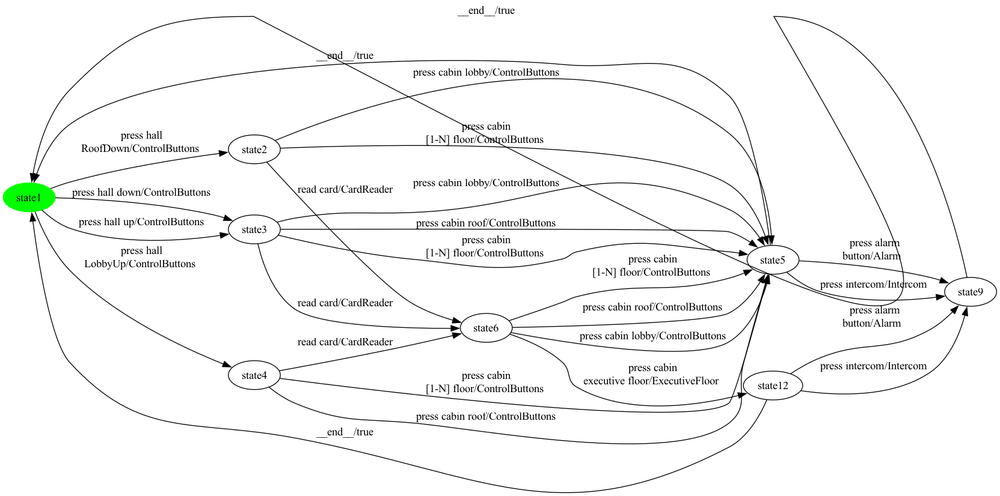

### State coverage (1 test case, 9 transitions)

```
press hall 
RoofDown -> press cabin lobby -> press intercom -> __end__ -> press hall up -> read card -> press cabin 
executive floor -> __end__ -> press hall 
LobbyUp
```

### All-transitions coverage (14 test cases, 22 transitions total)

- **`Elevator_p37_trans_seg0`**: `press cabin lobby -> press intercom`
- **`Elevator_p37_trans_seg1`**: `press hall 
RoofDown -> press cabin 
[1-N] floor -> press alarm
button`
- **`Elevator_p37_trans_seg2`**: `press cabin lobby`
- **`Elevator_p37_trans_seg3`**: `press cabin 
[1-N] floor`
- **`Elevator_p37_trans_seg4`**: `press cabin roof`
- **`Elevator_p37_trans_seg5`**: `read card -> press cabin 
executive floor -> press intercom`
- **`Elevator_p37_trans_seg6`**: `press cabin lobby`
- **`Elevator_p37_trans_seg7`**: `press cabin roof`
- **`Elevator_p37_trans_seg8`**: `press hall up -> press cabin 
[1-N] floor`
- **`Elevator_p37_trans_seg9`**: `press hall down -> read card`
- **`Elevator_p37_trans_seg10`**: `press alarm
button`
- **`Elevator_p37_trans_seg11`**: `press cabin roof`
- **`Elevator_p37_trans_seg12`**: `press cabin 
[1-N] floor`
- **`Elevator_p37_trans_seg13`**: `press hall 
LobbyUp -> read card`

### All-transition-pairs coverage (41 test cases, 101 transitions total)

- **`Elevator_p37_pair_seg0`**: `press hall 
RoofDown`
- **`Elevator_p37_pair_seg1`**: `read card -> press cabin 
[1-N] floor -> press intercom`
- **`Elevator_p37_pair_seg2`**: `__end__ -> press hall 
RoofDown -> read card`
- **`Elevator_p37_pair_seg3`**: `__end__ -> press hall 
LobbyUp`
- **`Elevator_p37_pair_seg4`**: `read card -> press cabin 
executive floor`
- **`Elevator_p37_pair_seg5`**: `__end__ -> press hall up -> press cabin lobby -> press alarm
button`
- **`Elevator_p37_pair_seg6`**: `__end__ -> press hall 
RoofDown`
- **`Elevator_p37_pair_seg7`**: `__end__ -> press hall down -> press cabin lobby`
- **`Elevator_p37_pair_seg8`**: `__end__ -> press hall down -> press cabin roof -> press intercom`
- **`Elevator_p37_pair_seg9`**: `read card -> press cabin 
executive floor -> press alarm
button`
- **`Elevator_p37_pair_seg10`**: `read card -> press cabin lobby -> press intercom`
- **`Elevator_p37_pair_seg11`**: `read card -> press cabin roof`
- **`Elevator_p37_pair_seg12`**: `press cabin lobby -> press alarm
button`
- **`Elevator_p37_pair_seg13`**: `press hall 
RoofDown -> press cabin lobby`
- **`Elevator_p37_pair_seg14`**: `press cabin lobby -> press intercom`
- **`Elevator_p37_pair_seg15`**: `press cabin lobby -> press intercom`
- **`Elevator_p37_pair_seg16`**: `press hall up -> press cabin roof`
- **`Elevator_p37_pair_seg17`**: `__end__ -> press hall 
RoofDown`
- **`Elevator_p37_pair_seg18`**: `press cabin 
[1-N] floor -> press alarm
button`
- **`Elevator_p37_pair_seg19`**: `__end__ -> press hall up`
- **`Elevator_p37_pair_seg20`**: `press cabin roof -> press alarm
button`
- **`Elevator_p37_pair_seg21`**: `press hall up -> press cabin 
[1-N] floor -> press alarm
button`
- **`Elevator_p37_pair_seg22`**: `press hall 
RoofDown -> press cabin 
[1-N] floor -> press intercom`
- **`Elevator_p37_pair_seg23`**: `__end__ -> press hall down -> read card -> press cabin 
executive floor -> press intercom`
- **`Elevator_p37_pair_seg24`**: `read card -> press cabin 
[1-N] floor -> press alarm
button`
- **`Elevator_p37_pair_seg25`**: `read card -> press cabin lobby`
- **`Elevator_p37_pair_seg26`**: `press hall 
LobbyUp -> read card -> press cabin roof -> press alarm
button`
- **`Elevator_p37_pair_seg27`**: `press hall 
LobbyUp -> press cabin roof`
- **`Elevator_p37_pair_seg28`**: `__end__ -> press hall 
LobbyUp`
- **`Elevator_p37_pair_seg29`**: `press cabin roof -> press alarm
button`
- **`Elevator_p37_pair_seg30`**: `press cabin roof -> press intercom`
- **`Elevator_p37_pair_seg31`**: `__end__ -> press hall 
LobbyUp -> press cabin 
[1-N] floor`
- **`Elevator_p37_pair_seg32`**: `__end__ -> press hall up`
- **`Elevator_p37_pair_seg33`**: `read card -> press cabin 
[1-N] floor`
- **`Elevator_p37_pair_seg34`**: `press hall up -> read card -> press cabin roof -> press intercom`
- **`Elevator_p37_pair_seg35`**: `press cabin 
[1-N] floor -> press intercom`
- **`Elevator_p37_pair_seg36`**: `press hall down -> press cabin 
[1-N] floor -> press intercom`
- **`Elevator_p37_pair_seg37`**: `press hall up`
- **`Elevator_p37_pair_seg38`**: `read card -> press cabin lobby -> press alarm
button`
- **`Elevator_p37_pair_seg39`**: `press hall 
LobbyUp`
- **`Elevator_p37_pair_seg40`**: `press cabin 
[1-N] floor -> press alarm
button`

## Product 38

**Selected features:** selected = {Alarm, CardReader, ControlButtons, Intercom, ManualDoorControl}

**Repaired FTS:** 9 states, 27 transitions

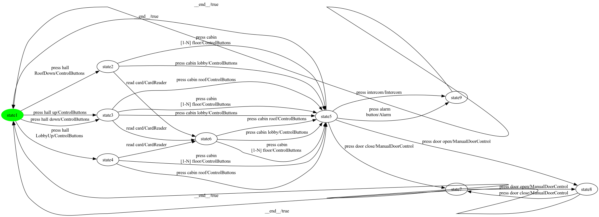

### State coverage (1 test case, 11 transitions)

```
press hall 
RoofDown -> press cabin lobby -> press intercom -> __end__ -> press hall up -> read card -> press cabin lobby -> press door open -> press door close -> __end__ -> press hall 
LobbyUp
```

### All-transitions coverage (10 test cases, 23 transitions total)

- **`Elevator_p38_trans_seg0`**: `press cabin lobby -> press intercom`
- **`Elevator_p38_trans_seg1`**: `press hall 
RoofDown -> press cabin 
[1-N] floor -> press alarm
button`
- **`Elevator_p38_trans_seg2`**: `read card -> press cabin lobby -> press door open -> press door close`
- **`Elevator_p38_trans_seg3`**: `press hall up -> press cabin lobby -> press door close -> press door open`
- **`Elevator_p38_trans_seg4`**: `press cabin roof`
- **`Elevator_p38_trans_seg5`**: `press hall down -> press cabin 
[1-N] floor`
- **`Elevator_p38_trans_seg6`**: `read card -> press cabin 
[1-N] floor`
- **`Elevator_p38_trans_seg7`**: `press cabin roof`
- **`Elevator_p38_trans_seg8`**: `press hall 
LobbyUp -> press cabin 
[1-N] floor`
- **`Elevator_p38_trans_seg9`**: `read card -> press cabin roof`

### All-transition-pairs coverage (58 test cases, 141 transitions total)

- **`Elevator_p38_pair_seg0`**: `press hall up`
- **`Elevator_p38_pair_seg1`**: `press cabin roof -> press intercom`
- **`Elevator_p38_pair_seg2`**: `__end__ -> press hall down -> press cabin lobby -> press door open -> press door close -> press door open`
- **`Elevator_p38_pair_seg3`**: `__end__ -> press hall down -> read card -> press cabin 
[1-N] floor -> press intercom`
- **`Elevator_p38_pair_seg4`**: `read card -> press cabin roof -> press door close -> press door open -> press door close`
- **`Elevator_p38_pair_seg5`**: `press hall 
RoofDown -> read card`
- **`Elevator_p38_pair_seg6`**: `press cabin roof -> press intercom`
- **`Elevator_p38_pair_seg7`**: `__end__ -> press hall down`
- **`Elevator_p38_pair_seg8`**: `press cabin roof -> press door open`
- **`Elevator_p38_pair_seg9`**: `press cabin 
[1-N] floor -> press door close`
- **`Elevator_p38_pair_seg10`**: `read card -> press cabin 
[1-N] floor`
- **`Elevator_p38_pair_seg11`**: `press cabin 
[1-N] floor -> press alarm
button`
- **`Elevator_p38_pair_seg12`**: `__end__ -> press hall 
RoofDown`
- **`Elevator_p38_pair_seg13`**: `press cabin lobby -> press door close`
- **`Elevator_p38_pair_seg14`**: `read card -> press cabin lobby -> press alarm
button`
- **`Elevator_p38_pair_seg15`**: `press cabin lobby -> press door open`
- **`Elevator_p38_pair_seg16`**: `__end__ -> press hall up -> press cabin roof -> press door close`
- **`Elevator_p38_pair_seg17`**: `press cabin lobby -> press intercom`
- **`Elevator_p38_pair_seg18`**: `press hall up -> read card -> press cabin lobby -> press intercom`
- **`Elevator_p38_pair_seg19`**: `press hall 
RoofDown -> press cabin lobby -> press door open`
- **`Elevator_p38_pair_seg20`**: `read card -> press cabin roof -> press alarm
button`
- **`Elevator_p38_pair_seg21`**: `press cabin lobby -> press alarm
button`
- **`Elevator_p38_pair_seg22`**: `press hall up -> press cabin lobby -> press alarm
button`
- **`Elevator_p38_pair_seg23`**: `__end__ -> press hall 
RoofDown`
- **`Elevator_p38_pair_seg24`**: `__end__ -> press hall 
LobbyUp`
- **`Elevator_p38_pair_seg25`**: `read card -> press cabin 
[1-N] floor -> press door open`
- **`Elevator_p38_pair_seg26`**: `__end__ -> press hall 
RoofDown`
- **`Elevator_p38_pair_seg27`**: `press cabin lobby -> press door close`
- **`Elevator_p38_pair_seg28`**: `press cabin 
[1-N] floor -> press door close`
- **`Elevator_p38_pair_seg29`**: `press cabin 
[1-N] floor -> press door open`
- **`Elevator_p38_pair_seg30`**: `press hall 
RoofDown -> press cabin 
[1-N] floor -> press alarm
button`
- **`Elevator_p38_pair_seg31`**: `__end__ -> press hall up`
- **`Elevator_p38_pair_seg32`**: `press cabin lobby -> press intercom`
- **`Elevator_p38_pair_seg33`**: `press cabin lobby -> press door close`
- **`Elevator_p38_pair_seg34`**: `__end__ -> press hall 
RoofDown`
- **`Elevator_p38_pair_seg35`**: `press cabin 
[1-N] floor -> press door open`
- **`Elevator_p38_pair_seg36`**: `__end__ -> press hall 
LobbyUp`
- **`Elevator_p38_pair_seg37`**: `read card -> press cabin roof -> press door open`
- **`Elevator_p38_pair_seg38`**: `press hall 
LobbyUp -> read card -> press cabin lobby`
- **`Elevator_p38_pair_seg39`**: `press hall up -> press cabin 
[1-N] floor -> press alarm
button`
- **`Elevator_p38_pair_seg40`**: `__end__ -> press hall up`
- **`Elevator_p38_pair_seg41`**: `press hall 
LobbyUp -> press cabin 
[1-N] floor -> press door open`
- **`Elevator_p38_pair_seg42`**: `press cabin 
[1-N] floor -> press door close`
- **`Elevator_p38_pair_seg43`**: `__end__ -> press hall 
LobbyUp`
- **`Elevator_p38_pair_seg44`**: `press cabin 
[1-N] floor -> press intercom`
- **`Elevator_p38_pair_seg45`**: `press cabin 
[1-N] floor -> press alarm
button`
- **`Elevator_p38_pair_seg46`**: `press hall 
LobbyUp -> press cabin roof`
- **`Elevator_p38_pair_seg47`**: `press hall 
RoofDown`
- **`Elevator_p38_pair_seg48`**: `press cabin 
[1-N] floor -> press intercom`
- **`Elevator_p38_pair_seg49`**: `__end__ -> press hall 
LobbyUp`
- **`Elevator_p38_pair_seg50`**: `press hall down -> press cabin roof -> press alarm
button`
- **`Elevator_p38_pair_seg51`**: `press cabin roof -> press door open`
- **`Elevator_p38_pair_seg52`**: `press cabin roof -> press intercom`
- **`Elevator_p38_pair_seg53`**: `press cabin roof -> press door close`
- **`Elevator_p38_pair_seg54`**: `__end__ -> press hall up`
- **`Elevator_p38_pair_seg55`**: `press cabin 
[1-N] floor -> press door close`
- **`Elevator_p38_pair_seg56`**: `__end__ -> press hall down -> press cabin 
[1-N] floor -> press intercom`
- **`Elevator_p38_pair_seg57`**: `press cabin roof -> press alarm
button`

## Product 39

**Selected features:** selected = {Alarm, CardReader, ControlButtons, ExecutiveFloor, Intercom, ManualDoorControl}

**Repaired FTS:** 10 states, 33 transitions

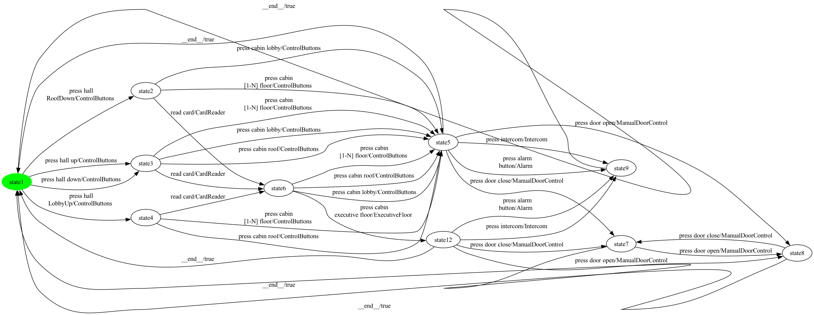

### State coverage (1 test case, 11 transitions)

```
press hall 
RoofDown -> press cabin lobby -> press intercom -> __end__ -> press hall up -> read card -> press cabin 
executive floor -> press door close -> press door open -> __end__ -> press hall 
LobbyUp
```

### All-transitions coverage (18 test cases, 28 transitions total)

- **`Elevator_p39_trans_seg0`**: `press cabin lobby -> press intercom`
- **`Elevator_p39_trans_seg1`**: `press cabin 
[1-N] floor -> press alarm
button`
- **`Elevator_p39_trans_seg2`**: `press hall 
RoofDown`
- **`Elevator_p39_trans_seg3`**: `press cabin lobby -> press door open -> press door close`
- **`Elevator_p39_trans_seg4`**: `press cabin 
[1-N] floor -> press door close`
- **`Elevator_p39_trans_seg5`**: `press cabin roof`
- **`Elevator_p39_trans_seg6`**: `press cabin 
executive floor -> press intercom`
- **`Elevator_p39_trans_seg7`**: `press alarm
button`
- **`Elevator_p39_trans_seg8`**: `read card`
- **`Elevator_p39_trans_seg9`**: `press door close -> press door open`
- **`Elevator_p39_trans_seg10`**: `press cabin lobby`
- **`Elevator_p39_trans_seg11`**: `press cabin roof`
- **`Elevator_p39_trans_seg12`**: `press hall up -> press cabin 
[1-N] floor`
- **`Elevator_p39_trans_seg13`**: `press hall down -> read card`
- **`Elevator_p39_trans_seg14`**: `press door open`
- **`Elevator_p39_trans_seg15`**: `press cabin roof`
- **`Elevator_p39_trans_seg16`**: `press cabin 
[1-N] floor`
- **`Elevator_p39_trans_seg17`**: `press hall 
LobbyUp -> read card`

### All-transition-pairs coverage (74 test cases, 170 transitions total)

- **`Elevator_p39_pair_seg0`**: `press hall up`
- **`Elevator_p39_pair_seg1`**: `press cabin roof -> press intercom`
- **`Elevator_p39_pair_seg2`**: `__end__ -> press hall down -> press cabin lobby -> press door open -> press door close -> press door open`
- **`Elevator_p39_pair_seg3`**: `__end__ -> press hall down -> read card -> press cabin 
[1-N] floor -> press intercom`
- **`Elevator_p39_pair_seg4`**: `press cabin 
executive floor -> press alarm
button`
- **`Elevator_p39_pair_seg5`**: `press hall 
RoofDown -> read card`
- **`Elevator_p39_pair_seg6`**: `press cabin 
executive floor -> press intercom`
- **`Elevator_p39_pair_seg7`**: `__end__ -> press hall 
LobbyUp`
- **`Elevator_p39_pair_seg8`**: `read card -> press cabin 
[1-N] floor -> press door close -> press door open`
- **`Elevator_p39_pair_seg9`**: `press cabin roof -> press door open`
- **`Elevator_p39_pair_seg10`**: `__end__ -> press hall up -> press cabin roof`
- **`Elevator_p39_pair_seg11`**: `__end__ -> press hall down -> press cabin roof -> press door close`
- **`Elevator_p39_pair_seg12`**: `__end__ -> press hall up`
- **`Elevator_p39_pair_seg13`**: `press cabin roof -> press alarm
button`
- **`Elevator_p39_pair_seg14`**: `__end__ -> press hall 
RoofDown`
- **`Elevator_p39_pair_seg15`**: `read card -> press cabin 
executive floor`
- **`Elevator_p39_pair_seg16`**: `__end__ -> press hall down`
- **`Elevator_p39_pair_seg17`**: `press cabin 
[1-N] floor -> press door open`
- **`Elevator_p39_pair_seg18`**: `press hall up -> read card -> press cabin lobby -> press door close`
- **`Elevator_p39_pair_seg19`**: `press cabin 
executive floor -> press door open`
- **`Elevator_p39_pair_seg20`**: `read card -> press cabin 
executive floor`
- **`Elevator_p39_pair_seg21`**: `press door open -> press door close`
- **`Elevator_p39_pair_seg22`**: `press cabin 
executive floor -> press door close -> press door open -> press door close`
- **`Elevator_p39_pair_seg23`**: `read card -> press cabin roof -> press door close`
- **`Elevator_p39_pair_seg24`**: `press cabin roof -> press intercom`
- **`Elevator_p39_pair_seg25`**: `read card -> press cabin 
[1-N] floor`
- **`Elevator_p39_pair_seg26`**: `press cabin 
[1-N] floor -> press alarm
button`
- **`Elevator_p39_pair_seg27`**: `press cabin 
[1-N] floor -> press door open`
- **`Elevator_p39_pair_seg28`**: `__end__ -> press hall 
RoofDown`
- **`Elevator_p39_pair_seg29`**: `read card -> press cabin lobby -> press alarm
button`
- **`Elevator_p39_pair_seg30`**: `press cabin lobby -> press door open`
- **`Elevator_p39_pair_seg31`**: `press cabin lobby -> press intercom`
- **`Elevator_p39_pair_seg32`**: `press cabin lobby -> press intercom`
- **`Elevator_p39_pair_seg33`**: `__end__ -> press hall 
RoofDown`
- **`Elevator_p39_pair_seg34`**: `press cabin lobby -> press door open`
- **`Elevator_p39_pair_seg35`**: `__end__ -> press hall 
LobbyUp`
- **`Elevator_p39_pair_seg36`**: `read card -> press cabin roof -> press alarm
button`
- **`Elevator_p39_pair_seg37`**: `press cabin lobby -> press alarm
button`
- **`Elevator_p39_pair_seg38`**: `press hall 
RoofDown -> press cabin lobby`
- **`Elevator_p39_pair_seg39`**: `__end__ -> press hall 
RoofDown`
- **`Elevator_p39_pair_seg40`**: `press hall 
LobbyUp -> read card -> press cabin 
executive floor`
- **`Elevator_p39_pair_seg41`**: `press cabin lobby -> press door close`
- **`Elevator_p39_pair_seg42`**: `__end__ -> press hall 
RoofDown`
- **`Elevator_p39_pair_seg43`**: `press cabin 
[1-N] floor -> press door close`
- **`Elevator_p39_pair_seg44`**: `press hall 
RoofDown -> press cabin 
[1-N] floor -> press door open`
- **`Elevator_p39_pair_seg45`**: `read card -> press cabin lobby`
- **`Elevator_p39_pair_seg46`**: `__end__ -> press hall 
LobbyUp`
- **`Elevator_p39_pair_seg47`**: `press cabin 
[1-N] floor -> press door open`
- **`Elevator_p39_pair_seg48`**: `press hall 
LobbyUp -> press cabin 
[1-N] floor -> press door close`
- **`Elevator_p39_pair_seg49`**: `__end__ -> press hall 
LobbyUp`
- **`Elevator_p39_pair_seg50`**: `press cabin 
[1-N] floor -> press intercom`
- **`Elevator_p39_pair_seg51`**: `press cabin 
[1-N] floor -> press alarm
button`
- **`Elevator_p39_pair_seg52`**: `press cabin 
[1-N] floor -> press alarm
button`
- **`Elevator_p39_pair_seg53`**: `read card -> press cabin roof -> press door open`
- **`Elevator_p39_pair_seg54`**: `press hall 
LobbyUp -> press cabin roof`
- **`Elevator_p39_pair_seg55`**: `press hall up -> press cabin lobby -> press alarm
button`
- **`Elevator_p39_pair_seg56`**: `press cabin lobby -> press intercom`
- **`Elevator_p39_pair_seg57`**: `__end__ -> press hall up`
- **`Elevator_p39_pair_seg58`**: `press cabin lobby -> press door close`
- **`Elevator_p39_pair_seg59`**: `press cabin 
[1-N] floor -> press alarm
button`
- **`Elevator_p39_pair_seg60`**: `__end__ -> press hall up`
- **`Elevator_p39_pair_seg61`**: `press hall up -> press cabin 
[1-N] floor`
- **`Elevator_p39_pair_seg62`**: `press hall 
LobbyUp`
- **`Elevator_p39_pair_seg63`**: `press hall 
RoofDown`
- **`Elevator_p39_pair_seg64`**: `press cabin 
[1-N] floor -> press intercom`
- **`Elevator_p39_pair_seg65`**: `press hall down -> press cabin 
[1-N] floor -> press door close`
- **`Elevator_p39_pair_seg66`**: `__end__ -> press hall up`
- **`Elevator_p39_pair_seg67`**: `press cabin 
[1-N] floor -> press intercom`
- **`Elevator_p39_pair_seg68`**: `press cabin roof -> press alarm
button`
- **`Elevator_p39_pair_seg69`**: `__end__ -> press hall 
LobbyUp`
- **`Elevator_p39_pair_seg70`**: `press cabin roof -> press door open`
- **`Elevator_p39_pair_seg71`**: `press cabin roof -> press intercom`
- **`Elevator_p39_pair_seg72`**: `press cabin roof -> press door close`
- **`Elevator_p39_pair_seg73`**: `__end__ -> press hall down`

## Product 40

**Selected features:** selected = {CardReader, ControlButtons, ExecutiveFloor, Intercom, ManualDoorControl}

**Repaired FTS:** 10 states, 31 transitions


### State coverage (1 test case, 11 transitions)

```
press hall 
RoofDown -> press cabin lobby -> press intercom -> __end__ -> press hall up -> read card -> press cabin 
executive floor -> press door close -> press door open -> __end__ -> press hall 
LobbyUp
```

### All-transitions coverage (16 test cases, 26 transitions total)

- **`Elevator_p40_trans_seg0`**: `press hall 
RoofDown -> press cabin lobby -> press intercom`
- **`Elevator_p40_trans_seg1`**: `press cabin 
[1-N] floor -> press door open -> press door close`
- **`Elevator_p40_trans_seg2`**: `press cabin lobby -> press door close`
- **`Elevator_p40_trans_seg3`**: `press cabin 
[1-N] floor`
- **`Elevator_p40_trans_seg4`**: `press cabin roof`
- **`Elevator_p40_trans_seg5`**: `press cabin 
executive floor -> press door close -> press door open`
- **`Elevator_p40_trans_seg6`**: `read card`
- **`Elevator_p40_trans_seg7`**: `press door open`
- **`Elevator_p40_trans_seg8`**: `press cabin lobby`
- **`Elevator_p40_trans_seg9`**: `press hall up -> press cabin roof`
- **`Elevator_p40_trans_seg10`**: `press hall down -> press cabin 
[1-N] floor`
- **`Elevator_p40_trans_seg11`**: `read card`
- **`Elevator_p40_trans_seg12`**: `press intercom`
- **`Elevator_p40_trans_seg13`**: `press cabin roof`
- **`Elevator_p40_trans_seg14`**: `press cabin 
[1-N] floor`
- **`Elevator_p40_trans_seg15`**: `press hall 
LobbyUp -> read card`

### All-transition-pairs coverage (61 test cases, 146 transitions total)

- **`Elevator_p40_pair_seg0`**: `press hall up`
- **`Elevator_p40_pair_seg1`**: `press cabin roof -> press intercom`
- **`Elevator_p40_pair_seg2`**: `__end__ -> press hall down -> press cabin lobby -> press door open -> press door close -> press door open`
- **`Elevator_p40_pair_seg3`**: `__end__ -> press hall down`
- **`Elevator_p40_pair_seg4`**: `read card -> press cabin 
[1-N] floor -> press intercom`
- **`Elevator_p40_pair_seg5`**: `__end__ -> press hall 
RoofDown -> read card`
- **`Elevator_p40_pair_seg6`**: `press cabin 
executive floor -> press intercom`
- **`Elevator_p40_pair_seg7`**: `__end__ -> press hall 
LobbyUp`
- **`Elevator_p40_pair_seg8`**: `read card -> press cabin 
[1-N] floor -> press door close -> press door open`
- **`Elevator_p40_pair_seg9`**: `press cabin roof -> press door open`
- **`Elevator_p40_pair_seg10`**: `press hall up -> press cabin roof`
- **`Elevator_p40_pair_seg11`**: `__end__ -> press hall down -> read card -> press cabin lobby -> press door close`
- **`Elevator_p40_pair_seg12`**: `__end__ -> press hall up`
- **`Elevator_p40_pair_seg13`**: `read card -> press cabin 
executive floor`
- **`Elevator_p40_pair_seg14`**: `__end__ -> press hall 
RoofDown`
- **`Elevator_p40_pair_seg15`**: `__end__ -> press hall down`
- **`Elevator_p40_pair_seg16`**: `press cabin 
executive floor -> press door open`
- **`Elevator_p40_pair_seg17`**: `__end__ -> press hall up -> read card`
- **`Elevator_p40_pair_seg18`**: `press door open -> press door close`
- **`Elevator_p40_pair_seg19`**: `read card -> press cabin 
executive floor -> press door close -> press door open -> press door close`
- **`Elevator_p40_pair_seg20`**: `read card -> press cabin roof -> press door close`
- **`Elevator_p40_pair_seg21`**: `press cabin roof -> press intercom`
- **`Elevator_p40_pair_seg22`**: `read card -> press cabin roof`
- **`Elevator_p40_pair_seg23`**: `read card -> press cabin 
[1-N] floor`
- **`Elevator_p40_pair_seg24`**: `press cabin 
[1-N] floor -> press door open`
- **`Elevator_p40_pair_seg25`**: `press hall up -> press cabin lobby`
- **`Elevator_p40_pair_seg26`**: `__end__ -> press hall 
RoofDown`
- **`Elevator_p40_pair_seg27`**: `read card -> press cabin lobby -> press door open`
- **`Elevator_p40_pair_seg28`**: `__end__ -> press hall 
RoofDown`
- **`Elevator_p40_pair_seg29`**: `press cabin lobby -> press intercom`
- **`Elevator_p40_pair_seg30`**: `press cabin lobby -> press intercom`
- **`Elevator_p40_pair_seg31`**: `press cabin lobby -> press door close`
- **`Elevator_p40_pair_seg32`**: `press cabin lobby -> press intercom`
- **`Elevator_p40_pair_seg33`**: `press hall up -> press cabin 
[1-N] floor -> press door open`
- **`Elevator_p40_pair_seg34`**: `__end__ -> press hall up`
- **`Elevator_p40_pair_seg35`**: `press hall 
RoofDown -> press cabin lobby`
- **`Elevator_p40_pair_seg36`**: `press cabin lobby -> press door open`
- **`Elevator_p40_pair_seg37`**: `__end__ -> press hall 
LobbyUp`
- **`Elevator_p40_pair_seg38`**: `read card -> press cabin roof -> press door open`
- **`Elevator_p40_pair_seg39`**: `__end__ -> press hall 
LobbyUp -> read card -> press cabin 
executive floor`
- **`Elevator_p40_pair_seg40`**: `press cabin lobby -> press door close`
- **`Elevator_p40_pair_seg41`**: `press cabin 
[1-N] floor -> press door close`
- **`Elevator_p40_pair_seg42`**: `press cabin 
[1-N] floor -> press door open`
- **`Elevator_p40_pair_seg43`**: `read card -> press cabin lobby`
- **`Elevator_p40_pair_seg44`**: `__end__ -> press hall up`
- **`Elevator_p40_pair_seg45`**: `press hall 
LobbyUp`
- **`Elevator_p40_pair_seg46`**: `press hall 
RoofDown -> press cabin 
[1-N] floor`
- **`Elevator_p40_pair_seg47`**: `press hall down -> press cabin roof -> press door close`
- **`Elevator_p40_pair_seg48`**: `__end__ -> press hall 
RoofDown`
- **`Elevator_p40_pair_seg49`**: `press cabin 
[1-N] floor -> press intercom`
- **`Elevator_p40_pair_seg50`**: `press hall 
LobbyUp -> press cabin 
[1-N] floor -> press door open`
- **`Elevator_p40_pair_seg51`**: `press cabin 
[1-N] floor -> press door close`
- **`Elevator_p40_pair_seg52`**: `__end__ -> press hall 
LobbyUp`
- **`Elevator_p40_pair_seg53`**: `press cabin 
[1-N] floor -> press intercom`
- **`Elevator_p40_pair_seg54`**: `press hall 
LobbyUp -> press cabin roof -> press door open`
- **`Elevator_p40_pair_seg55`**: `press cabin roof -> press intercom`
- **`Elevator_p40_pair_seg56`**: `__end__ -> press hall 
LobbyUp`
- **`Elevator_p40_pair_seg57`**: `press cabin roof -> press door close`
- **`Elevator_p40_pair_seg58`**: `__end__ -> press hall up`
- **`Elevator_p40_pair_seg59`**: `press cabin 
[1-N] floor -> press door close`
- **`Elevator_p40_pair_seg60`**: `__end__ -> press hall down -> press cabin 
[1-N] floor -> press intercom`

## Product 41

**Selected features:** selected = {Alarm, CardReader, ControlButtons}

**Repaired FTS:** 7 states, 20 transitions

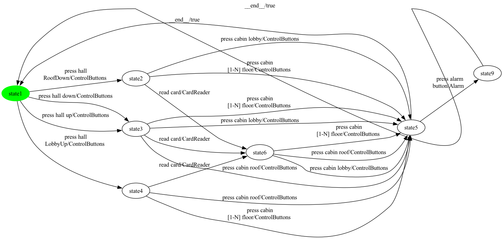

### State coverage (1 test case, 9 transitions)

```
press hall 
RoofDown -> press cabin lobby -> press alarm
button -> __end__ -> press hall up -> read card -> press cabin lobby -> __end__ -> press hall 
LobbyUp
```

### All-transitions coverage (10 test cases, 18 transitions total)

- **`Elevator_p41_trans_seg0`**: `press cabin 
[1-N] floor -> press alarm
button`
- **`Elevator_p41_trans_seg1`**: `press cabin lobby`
- **`Elevator_p41_trans_seg2`**: `press hall 
RoofDown -> read card -> press cabin lobby`
- **`Elevator_p41_trans_seg3`**: `read card -> press cabin 
[1-N] floor`
- **`Elevator_p41_trans_seg4`**: `press hall up -> press cabin lobby`
- **`Elevator_p41_trans_seg5`**: `press hall down -> press cabin roof`
- **`Elevator_p41_trans_seg6`**: `press cabin 
[1-N] floor`
- **`Elevator_p41_trans_seg7`**: `press cabin roof`
- **`Elevator_p41_trans_seg8`**: `press hall 
LobbyUp -> press cabin 
[1-N] floor`
- **`Elevator_p41_trans_seg9`**: `read card -> press cabin roof`

### All-transition-pairs coverage (24 test cases, 65 transitions total)

- **`Elevator_p41_pair_seg0`**: `press hall 
RoofDown -> read card -> press cabin 
[1-N] floor -> press alarm
button`
- **`Elevator_p41_pair_seg1`**: `read card -> press cabin lobby`
- **`Elevator_p41_pair_seg2`**: `__end__ -> press hall down -> press cabin lobby -> press alarm
button`
- **`Elevator_p41_pair_seg3`**: `__end__ -> press hall 
RoofDown`
- **`Elevator_p41_pair_seg4`**: `read card -> press cabin roof`
- **`Elevator_p41_pair_seg5`**: `press hall 
RoofDown -> press cabin lobby -> press alarm
button`
- **`Elevator_p41_pair_seg6`**: `press hall up -> press cabin lobby`
- **`Elevator_p41_pair_seg7`**: `__end__ -> press hall up -> press cabin roof`
- **`Elevator_p41_pair_seg8`**: `__end__ -> press hall down -> press cabin roof -> press alarm
button`
- **`Elevator_p41_pair_seg9`**: `press hall down -> read card -> press cabin 
[1-N] floor`
- **`Elevator_p41_pair_seg10`**: `press hall 
RoofDown -> press cabin 
[1-N] floor -> press alarm
button`
- **`Elevator_p41_pair_seg11`**: `__end__ -> press hall 
LobbyUp`
- **`Elevator_p41_pair_seg12`**: `read card -> press cabin 
[1-N] floor`
- **`Elevator_p41_pair_seg13`**: `__end__ -> press hall 
RoofDown`
- **`Elevator_p41_pair_seg14`**: `read card -> press cabin lobby`
- **`Elevator_p41_pair_seg15`**: `__end__ -> press hall 
LobbyUp -> read card -> press cabin roof`
- **`Elevator_p41_pair_seg16`**: `press hall 
LobbyUp -> press cabin roof`
- **`Elevator_p41_pair_seg17`**: `press cabin roof -> press alarm
button`
- **`Elevator_p41_pair_seg18`**: `__end__ -> press hall up -> press cabin 
[1-N] floor -> press alarm
button`
- **`Elevator_p41_pair_seg19`**: `press hall down -> press cabin 
[1-N] floor`
- **`Elevator_p41_pair_seg20`**: `press hall up -> read card -> press cabin roof -> press alarm
button`
- **`Elevator_p41_pair_seg21`**: `press hall up`
- **`Elevator_p41_pair_seg22`**: `read card -> press cabin lobby -> press alarm
button`
- **`Elevator_p41_pair_seg23`**: `press hall 
LobbyUp -> press cabin 
[1-N] floor -> press alarm
button`

## Product 42

**Selected features:** selected = {CardReader, ControlButtons, ExecutiveFloor, Intercom}

**Repaired FTS:** 8 states, 23 transitions


### State coverage (1 test case, 9 transitions)

```
press hall 
RoofDown -> press cabin lobby -> press intercom -> __end__ -> press hall up -> read card -> press cabin 
executive floor -> __end__ -> press hall 
LobbyUp
```

### All-transitions coverage (12 test cases, 20 transitions total)

- **`Elevator_p42_trans_seg0`**: `press hall 
RoofDown -> press cabin 
[1-N] floor -> press intercom`
- **`Elevator_p42_trans_seg1`**: `press cabin lobby`
- **`Elevator_p42_trans_seg2`**: `press cabin lobby`
- **`Elevator_p42_trans_seg3`**: `press cabin 
[1-N] floor`
- **`Elevator_p42_trans_seg4`**: `read card -> press cabin roof`
- **`Elevator_p42_trans_seg5`**: `press hall up -> read card -> press cabin 
executive floor -> press intercom`
- **`Elevator_p42_trans_seg6`**: `press hall down -> press cabin lobby`
- **`Elevator_p42_trans_seg7`**: `press cabin roof`
- **`Elevator_p42_trans_seg8`**: `press cabin 
[1-N] floor`
- **`Elevator_p42_trans_seg9`**: `press cabin roof`
- **`Elevator_p42_trans_seg10`**: `press cabin 
[1-N] floor`
- **`Elevator_p42_trans_seg11`**: `press hall 
LobbyUp -> read card`

### All-transition-pairs coverage (31 test cases, 80 transitions total)

- **`Elevator_p42_pair_seg0`**: `press hall 
RoofDown`
- **`Elevator_p42_pair_seg1`**: `read card -> press cabin 
[1-N] floor -> press intercom`
- **`Elevator_p42_pair_seg2`**: `press hall 
RoofDown -> read card`
- **`Elevator_p42_pair_seg3`**: `__end__ -> press hall 
RoofDown`
- **`Elevator_p42_pair_seg4`**: `read card -> press cabin 
executive floor`
- **`Elevator_p42_pair_seg5`**: `__end__ -> press hall 
LobbyUp`
- **`Elevator_p42_pair_seg6`**: `read card -> press cabin 
[1-N] floor`
- **`Elevator_p42_pair_seg7`**: `__end__ -> press hall down -> press cabin lobby`
- **`Elevator_p42_pair_seg8`**: `__end__ -> press hall up -> press cabin lobby -> press intercom`
- **`Elevator_p42_pair_seg9`**: `__end__ -> press hall 
RoofDown`
- **`Elevator_p42_pair_seg10`**: `read card -> press cabin 
executive floor`
- **`Elevator_p42_pair_seg11`**: `__end__ -> press hall down -> press cabin roof -> press intercom`
- **`Elevator_p42_pair_seg12`**: `read card -> press cabin lobby -> press intercom`
- **`Elevator_p42_pair_seg13`**: `read card -> press cabin roof`
- **`Elevator_p42_pair_seg14`**: `__end__ -> press hall 
RoofDown -> press cabin lobby -> press intercom`
- **`Elevator_p42_pair_seg15`**: `__end__ -> press hall up -> press cabin roof`
- **`Elevator_p42_pair_seg16`**: `__end__ -> press hall down -> read card -> press cabin 
executive floor -> press intercom`
- **`Elevator_p42_pair_seg17`**: `read card -> press cabin lobby`
- **`Elevator_p42_pair_seg18`**: `press hall 
RoofDown -> press cabin 
[1-N] floor -> press intercom`
- **`Elevator_p42_pair_seg19`**: `__end__ -> press hall 
LobbyUp -> read card -> press cabin roof`
- **`Elevator_p42_pair_seg20`**: `press hall 
LobbyUp -> press cabin roof`
- **`Elevator_p42_pair_seg21`**: `press cabin roof -> press intercom`
- **`Elevator_p42_pair_seg22`**: `press hall down -> press cabin 
[1-N] floor`
- **`Elevator_p42_pair_seg23`**: `__end__ -> press hall 
LobbyUp -> press cabin 
[1-N] floor`
- **`Elevator_p42_pair_seg24`**: `__end__ -> press hall up -> press cabin 
[1-N] floor -> press intercom`
- **`Elevator_p42_pair_seg25`**: `press hall up`
- **`Elevator_p42_pair_seg26`**: `read card -> press cabin 
[1-N] floor`
- **`Elevator_p42_pair_seg27`**: `press hall up -> read card -> press cabin lobby`
- **`Elevator_p42_pair_seg28`**: `read card -> press cabin roof -> press intercom`
- **`Elevator_p42_pair_seg29`**: `press hall 
LobbyUp`
- **`Elevator_p42_pair_seg30`**: `press cabin 
[1-N] floor -> press intercom`

---

Total products: 42.
