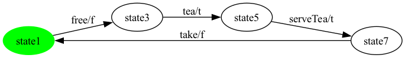
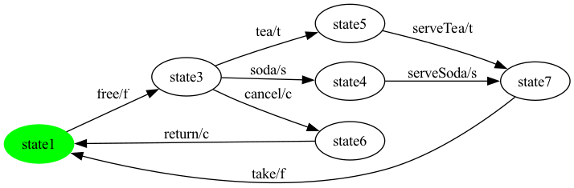
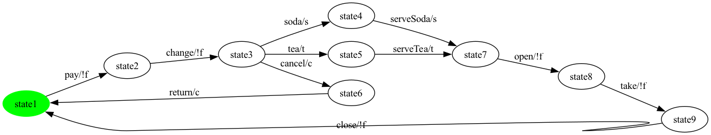

# Per-Product Report — SVM

Generated by PerProductReportGenerator. For each valid SVM configuration enumerated by Sat4JSolverFacade, this report shows the projected + SCC-repaired product-level FTS plus the test suites generated for state, all-transitions, and all-transition-pairs coverage.

Each generator produces a closed Euler cycle on the product-level FTS; the cycle is split at every return to the initial state via `TestCaseSplitter.splitAtInitialReturns(...)`, and each trip-from-initial-back-to-initial is shown as one test case. `__end__` and `__balance__N` transitions are hidden from the displayed sequence (synthetic reset markers); `<action>__dup__N` suffixes are stripped (a doubled traversal IS a real test step the tester performs a second time).

**Features actually labelling transitions in the SPL FTS** (filter applied below): `c, f, s, t`. Abstract / grouping features that do not label any transition are omitted from the per-product feature lists.

---

## Product 1

**Selected features:** selected = {c, f, t}

**Repaired FTS:** 5 states, 6 transitions

### State coverage (2 test cases)

- **test case 1**: `free -> tea -> serveTea -> take`
- **test case 2**: `free -> cancel`

### All-transitions coverage (2 test cases)

- **test case 1**: `free -> cancel -> return`
- **test case 2**: `free -> tea -> serveTea -> take`

### All-transition-pairs coverage (3 test cases)

- **test case 1**: `free -> tea -> serveTea -> take`
- **test case 2**: `free -> cancel -> return`
- **test case 3**: `free`

## Product 2

**Selected features:** selected = {s, t}

**Repaired FTS:** 8 states, 9 transitions

### State coverage (2 test cases)

- **test case 1**: `pay -> change -> soda -> serveSoda -> open -> take -> close`
- **test case 2**: `pay -> change -> tea`

### All-transitions coverage (2 test cases)

- **test case 1**: `pay -> change -> tea -> serveTea -> open -> take -> close`
- **test case 2**: `pay -> change -> soda -> serveSoda -> open -> take -> close`

### All-transition-pairs coverage (3 test cases)

- **test case 1**: `pay -> change -> tea -> serveTea -> open -> take -> close`
- **test case 2**: `pay`
- **test case 3**: `change -> soda -> serveSoda -> open`

## Product 3

**Selected features:** selected = {s}

**Repaired FTS:** 7 states, 7 transitions

### State coverage (1 test case)

- **test case 1**: `pay -> change -> soda -> serveSoda -> open -> take`

### All-transitions coverage (1 test case)

- **test case 1**: `pay -> change -> soda -> serveSoda -> open -> take -> close`

### All-transition-pairs coverage (2 test cases)

- **test case 1**: `pay -> change -> soda -> serveSoda -> open -> take -> close`
- **test case 2**: `pay`

## Product 4

**Selected features:** selected = {t}

**Repaired FTS:** 7 states, 7 transitions

### State coverage (1 test case)

- **test case 1**: `pay -> change -> tea -> serveTea -> open -> take`

### All-transitions coverage (1 test case)

- **test case 1**: `pay -> change -> tea -> serveTea -> open -> take -> close`

### All-transition-pairs coverage (2 test cases)

- **test case 1**: `pay -> change -> tea -> serveTea -> open -> take -> close`
- **test case 2**: `pay`

## Product 5

**Selected features:** selected = {f, s, t}

**Repaired FTS:** 5 states, 6 transitions

### State coverage (2 test cases)

- **test case 1**: `free -> soda -> serveSoda -> take`
- **test case 2**: `free -> tea`

### All-transitions coverage (2 test cases)

- **test case 1**: `free -> tea -> serveTea -> take`
- **test case 2**: `free -> soda -> serveSoda -> take`

### All-transition-pairs coverage (2 test cases)

- **test case 1**: `free -> tea -> serveTea -> take`
- **test case 2**: `free -> soda -> serveSoda -> take`

## Product 6

**Selected features:** selected = {c, f, s}

**Repaired FTS:** 5 states, 6 transitions

### State coverage (2 test cases)

- **test case 1**: `free -> soda -> serveSoda -> take`
- **test case 2**: `free -> cancel`

### All-transitions coverage (2 test cases)

- **test case 1**: `free -> cancel -> return`
- **test case 2**: `free -> soda -> serveSoda -> take`

### All-transition-pairs coverage (3 test cases)

- **test case 1**: `free -> cancel -> return`
- **test case 2**: `free -> soda -> serveSoda -> take`
- **test case 3**: `free`

## Product 7

**Selected features:** selected = {c, s}

**Repaired FTS:** 8 states, 9 transitions

### State coverage (2 test cases)

- **test case 1**: `pay -> change -> soda -> serveSoda -> open -> take -> close`
- **test case 2**: `pay -> change -> cancel`

### All-transitions coverage (2 test cases)

- **test case 1**: `pay -> change -> cancel -> return`
- **test case 2**: `pay -> change -> soda -> serveSoda -> open -> take -> close`

### All-transition-pairs coverage (4 test cases)

- **test case 1**: `pay -> change -> soda -> serveSoda -> open -> take -> close`
- **test case 2**: `pay`
- **test case 3**: `change -> cancel -> return`
- **test case 4**: `pay`

## Product 8

**Selected features:** selected = {f, t}

**Repaired FTS:** 4 states, 4 transitions

### State coverage (1 test case)

- **test case 1**: `free -> tea -> serveTea`

### All-transitions coverage (1 test case)

- **test case 1**: `free -> tea -> serveTea -> take`

### All-transition-pairs coverage (2 test cases)

- **test case 1**: `free -> tea -> serveTea -> take`
- **test case 2**: `free`

## Product 9

**Selected features:** selected = {c, f, s, t}

**Repaired FTS:** 6 states, 8 transitions

### State coverage (3 test cases)

- **test case 1**: `free -> soda -> serveSoda -> take`
- **test case 2**: `free -> tea -> serveTea -> take`
- **test case 3**: `free -> cancel`

### All-transitions coverage (3 test cases)

- **test case 1**: `free -> cancel -> return`
- **test case 2**: `free -> tea -> serveTea -> take`
- **test case 3**: `free -> soda -> serveSoda -> take`

### All-transition-pairs coverage (3 test cases)

- **test case 1**: `free -> tea -> serveTea -> take`
- **test case 2**: `free -> cancel -> return`
- **test case 3**: `free -> soda -> serveSoda -> take`

## Product 10

**Selected features:** selected = {c, s, t}

**Repaired FTS:** 9 states, 11 transitions

### State coverage (3 test cases)

- **test case 1**: `pay -> change -> soda -> serveSoda -> open -> take -> close`
- **test case 2**: `pay -> change -> tea -> serveTea -> open -> take -> close`
- **test case 3**: `pay -> change -> cancel`

### All-transitions coverage (3 test cases)

- **test case 1**: `pay -> change -> cancel -> return`
- **test case 2**: `pay -> change -> tea -> serveTea -> open -> take -> close`
- **test case 3**: `pay -> change -> soda -> serveSoda -> open -> take -> close`

### All-transition-pairs coverage (5 test cases)

- **test case 1**: `pay -> change -> tea -> serveTea -> open -> take -> close`
- **test case 2**: `pay`
- **test case 3**: `change -> cancel -> return`
- **test case 4**: `pay`
- **test case 5**: `change -> soda -> serveSoda -> open`

## Product 11

**Selected features:** selected = {c, t}

**Repaired FTS:** 8 states, 9 transitions

### State coverage (2 test cases)

- **test case 1**: `pay -> change -> tea -> serveTea -> open -> take -> close`
- **test case 2**: `pay -> change -> cancel`

### All-transitions coverage (2 test cases)

- **test case 1**: `pay -> change -> cancel -> return`
- **test case 2**: `pay -> change -> tea -> serveTea -> open -> take -> close`

### All-transition-pairs coverage (4 test cases)

- **test case 1**: `pay -> change -> tea -> serveTea -> open -> take -> close`
- **test case 2**: `pay`
- **test case 3**: `change -> cancel -> return`
- **test case 4**: `pay`

## Product 12

**Selected features:** selected = {f, s}

**Repaired FTS:** 4 states, 4 transitions

### State coverage (1 test case)

- **test case 1**: `free -> soda -> serveSoda`

### All-transitions coverage (1 test case)

- **test case 1**: `free -> soda -> serveSoda -> take`

### All-transition-pairs coverage (2 test cases)

- **test case 1**: `free -> soda -> serveSoda -> take`
- **test case 2**: `free`

---

Total products: 12.
