# Per-Product Report — eMail

Generated by PerProductReportGenerator. For each valid eMail configuration enumerated by Sat4JSolverFacade, this report shows the projected + SCC-repaired product-level FTS plus the test suites generated for state, all-transitions, and all-transition-pairs coverage.

Action sequences are written as `a -> b -> c -> ...`. Synthetic balancing actions (prefix `__balance__`) are not present in the final test cases.

**Features actually labelling transitions in the SPL FTS** (filter applied below): `ad, au, e, en, f, s`. Abstract / grouping features that do not label any transition are omitted from the per-product feature lists.

---

## Product 1

**Selected features:** selected = {e, f}

**Repaired FTS:** 6 states, 12 transitions

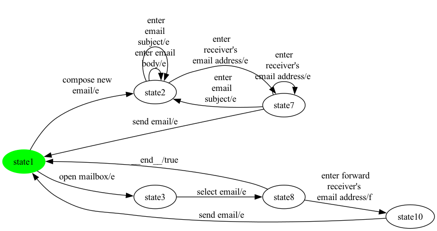

### State coverage (1 test case, 6 transitions)

```
open mailbox -> select email -> enter forward 
receiver's 
email address -> send email -> compose new 
email -> enter 
receiver's 
email address
```

### All-transitions coverage (5 test cases, 11 transitions total)

- **`eMail_p1_trans_seg0`**: `open mailbox -> select email -> enter forward 
receiver's 
email address -> send email`
- **`eMail_p1_trans_seg1`**: `compose new 
email -> enter email 
body -> enter
 email 
subject`
- **`eMail_p1_trans_seg2`**: `send email`
- **`eMail_p1_trans_seg3`**: `enter 
receiver's 
email address -> enter
 email 
subject`
- **`eMail_p1_trans_seg4`**: `enter 
receiver's 
email address`

### All-transition-pairs coverage (10 test cases, 37 transitions total)

- **`eMail_p1_pair_seg0`**: `compose new 
email -> enter
 email 
subject -> enter
 email 
subject -> enter email 
body`
- **`eMail_p1_pair_seg1`**: `enter 
receiver's 
email address -> send email -> compose new 
email -> enter email 
body -> enter 
receiver's 
email address -> enter 
receiver's 
email address -> enter 
receiver's 
email address -> enter
 email 
subject -> enter
 email 
subject`
- **`eMail_p1_pair_seg2`**: `enter 
receiver's 
email address -> send email -> open mailbox`
- **`eMail_p1_pair_seg3`**: `__end__ -> open mailbox -> select email`
- **`eMail_p1_pair_seg4`**: `__end__ -> compose new 
email -> enter 
receiver's 
email address`
- **`eMail_p1_pair_seg5`**: `select email -> enter forward 
receiver's 
email address -> send email -> open mailbox`
- **`eMail_p1_pair_seg6`**: `send email -> compose new 
email`
- **`eMail_p1_pair_seg7`**: `enter 
receiver's 
email address -> enter
 email 
subject -> enter 
receiver's 
email address`
- **`eMail_p1_pair_seg8`**: `enter
 email 
subject -> enter email 
body -> enter email 
body -> enter
 email 
subject -> enter 
receiver's 
email address`
- **`eMail_p1_pair_seg9`**: `open mailbox`

## Product 2

**Selected features:** selected = {e, s}

**Repaired FTS:** 6 states, 12 transitions


### State coverage (1 test case, 6 transitions)

```
open mailbox -> select email -> __end__ -> compose new 
email -> enter 
receiver's 
email address -> sign mail
```

### All-transitions coverage (5 test cases, 11 transitions total)

- **`eMail_p2_trans_seg0`**: `open mailbox -> select email`
- **`eMail_p2_trans_seg1`**: `compose new 
email -> enter email 
body -> enter
 email 
subject`
- **`eMail_p2_trans_seg2`**: `send email`
- **`eMail_p2_trans_seg3`**: `enter 
receiver's 
email address -> enter
 email 
subject`
- **`eMail_p2_trans_seg4`**: `enter 
receiver's 
email address -> sign mail -> send email`

### All-transition-pairs coverage (10 test cases, 38 transitions total)

- **`eMail_p2_pair_seg0`**: `compose new 
email -> enter
 email 
subject -> enter
 email 
subject -> enter email 
body`
- **`eMail_p2_pair_seg1`**: `send email -> open mailbox -> select email`
- **`eMail_p2_pair_seg2`**: `__end__ -> open mailbox`
- **`eMail_p2_pair_seg3`**: `__end__ -> compose new 
email -> enter email 
body -> enter 
receiver's 
email address -> sign mail -> send email -> compose new 
email -> enter 
receiver's 
email address`
- **`eMail_p2_pair_seg4`**: `enter 
receiver's 
email address -> send email -> compose new 
email`
- **`eMail_p2_pair_seg5`**: `enter 
receiver's 
email address -> sign mail`
- **`eMail_p2_pair_seg6`**: `enter 
receiver's 
email address -> enter 
receiver's 
email address -> enter 
receiver's 
email address -> enter
 email 
subject -> enter
 email 
subject`
- **`eMail_p2_pair_seg7`**: `enter 
receiver's 
email address -> enter
 email 
subject -> enter 
receiver's 
email address`
- **`eMail_p2_pair_seg8`**: `enter
 email 
subject -> enter email 
body -> enter email 
body -> enter
 email 
subject -> enter 
receiver's 
email address -> send email -> open mailbox`
- **`eMail_p2_pair_seg9`**: `open mailbox`

## Product 3

**Selected features:** selected = {au, e}

**Repaired FTS:** 7 states, 15 transitions


### State coverage (1 test case, 9 transitions)

```
enter email 
autoresponse 
date interval -> enter 
autoresponse 
email body -> enter email 
autoresponse 
date interval -> __end__ -> open mailbox -> select email -> __end__ -> compose new 
email -> enter 
receiver's 
email address
```

### All-transitions coverage (7 test cases, 13 transitions total)

- **`eMail_p3_trans_seg0`**: `enter email 
autoresponse 
date interval -> enter 
autoresponse 
email body -> enter email 
autoresponse 
date interval`
- **`eMail_p3_trans_seg1`**: `enter 
autoresponse 
email body`
- **`eMail_p3_trans_seg2`**: `open mailbox -> select email`
- **`eMail_p3_trans_seg3`**: `compose new 
email`
- **`eMail_p3_trans_seg4`**: `send email`
- **`eMail_p3_trans_seg5`**: `enter 
receiver's 
email address -> enter
 email 
subject -> enter email 
body -> enter
 email 
subject`
- **`eMail_p3_trans_seg6`**: `enter 
receiver's 
email address`

### All-transition-pairs coverage (19 test cases, 54 transitions total)

- **`eMail_p3_pair_seg0`**: `enter email 
autoresponse 
date interval`
- **`eMail_p3_pair_seg1`**: `__end__ -> enter 
autoresponse 
email body -> enter email 
autoresponse 
date interval`
- **`eMail_p3_pair_seg2`**: `__end__ -> open mailbox -> select email`
- **`eMail_p3_pair_seg3`**: `__end__ -> open mailbox`
- **`eMail_p3_pair_seg4`**: `__end__ -> compose new 
email -> enter
 email 
subject -> enter
 email 
subject -> enter email 
body -> enter 
receiver's 
email address`
- **`eMail_p3_pair_seg5`**: `enter 
receiver's 
email address -> send email -> enter email 
autoresponse 
date interval`
- **`eMail_p3_pair_seg6`**: `__end__ -> enter email 
autoresponse 
date interval`
- **`eMail_p3_pair_seg7`**: `__end__ -> compose new 
email -> enter email 
body -> enter email 
body -> enter
 email 
subject`
- **`eMail_p3_pair_seg8`**: `enter 
receiver's 
email address -> enter 
receiver's 
email address -> enter 
receiver's 
email address -> enter
 email 
subject -> enter
 email 
subject -> enter 
receiver's 
email address -> send email -> enter 
autoresponse 
email body`
- **`eMail_p3_pair_seg9`**: `send email -> compose new 
email -> enter 
receiver's 
email address`
- **`eMail_p3_pair_seg10`**: `compose new 
email`
- **`eMail_p3_pair_seg11`**: `send email -> open mailbox`
- **`eMail_p3_pair_seg12`**: `open mailbox`
- **`eMail_p3_pair_seg13`**: `enter 
autoresponse 
email body`
- **`eMail_p3_pair_seg14`**: `__end__ -> enter email 
autoresponse 
date interval -> enter 
autoresponse 
email body -> enter email 
autoresponse 
date interval`
- **`eMail_p3_pair_seg15`**: `__end__ -> enter 
autoresponse 
email body`
- **`eMail_p3_pair_seg16`**: `enter email 
autoresponse 
date interval -> enter 
autoresponse 
email body`
- **`eMail_p3_pair_seg17`**: `enter 
receiver's 
email address -> enter
 email 
subject -> enter 
receiver's 
email address`
- **`eMail_p3_pair_seg18`**: `enter
 email 
subject -> enter email 
body`

## Product 4

**Selected features:** selected = {au, e, f}

**Repaired FTS:** 8 states, 17 transitions

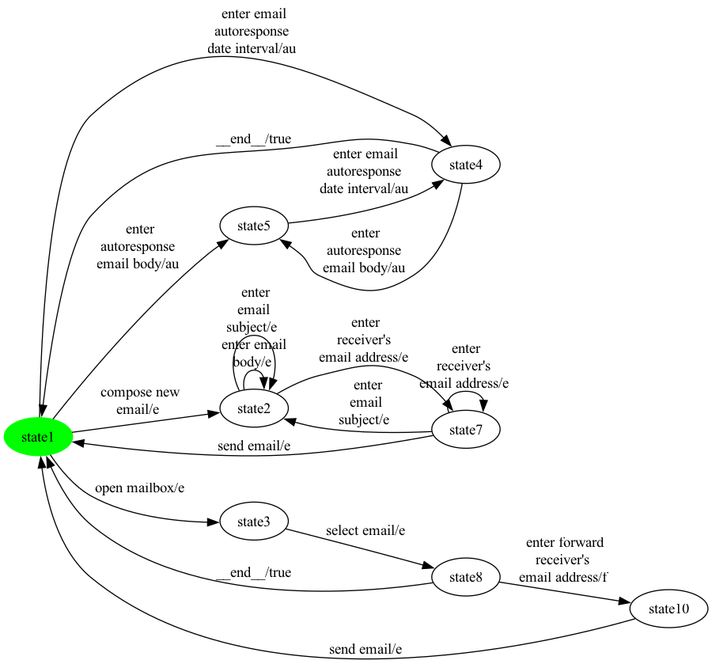

### State coverage (1 test case, 9 transitions)

```
compose new 
email -> enter 
receiver's 
email address -> send email -> open mailbox -> select email -> enter forward 
receiver's 
email address -> send email -> enter email 
autoresponse 
date interval -> enter 
autoresponse 
email body
```

### All-transitions coverage (7 test cases, 15 transitions total)

- **`eMail_p4_trans_seg0`**: `enter email 
autoresponse 
date interval -> enter 
autoresponse 
email body -> enter email 
autoresponse 
date interval`
- **`eMail_p4_trans_seg1`**: `enter 
autoresponse 
email body`
- **`eMail_p4_trans_seg2`**: `open mailbox -> select email -> enter forward 
receiver's 
email address -> send email`
- **`eMail_p4_trans_seg3`**: `compose new 
email`
- **`eMail_p4_trans_seg4`**: `send email`
- **`eMail_p4_trans_seg5`**: `enter 
receiver's 
email address -> enter
 email 
subject -> enter email 
body -> enter
 email 
subject`
- **`eMail_p4_trans_seg6`**: `enter 
receiver's 
email address`

### All-transition-pairs coverage (26 test cases, 67 transitions total)

- **`eMail_p4_pair_seg0`**: `enter email 
autoresponse 
date interval`
- **`eMail_p4_pair_seg1`**: `__end__ -> enter 
autoresponse 
email body`
- **`eMail_p4_pair_seg2`**: `__end__ -> open mailbox`
- **`eMail_p4_pair_seg3`**: `compose new 
email -> enter
 email 
subject -> enter
 email 
subject -> enter email 
body -> enter 
receiver's 
email address`
- **`eMail_p4_pair_seg4`**: `enter 
receiver's 
email address -> send email -> enter email 
autoresponse 
date interval`
- **`eMail_p4_pair_seg5`**: `open mailbox -> select email`
- **`eMail_p4_pair_seg6`**: `__end__ -> compose new 
email -> enter email 
body -> enter email 
body -> enter
 email 
subject -> enter 
receiver's 
email address -> enter 
receiver's 
email address -> enter 
receiver's 
email address -> enter
 email 
subject -> enter
 email 
subject`
- **`eMail_p4_pair_seg7`**: `compose new 
email`
- **`eMail_p4_pair_seg8`**: `enter 
receiver's 
email address -> send email -> enter 
autoresponse 
email body`
- **`eMail_p4_pair_seg9`**: `__end__ -> enter email 
autoresponse 
date interval`
- **`eMail_p4_pair_seg10`**: `__end__ -> open mailbox`
- **`eMail_p4_pair_seg11`**: `enter forward 
receiver's 
email address -> send email -> open mailbox`
- **`eMail_p4_pair_seg12`**: `send email -> compose new 
email`
- **`eMail_p4_pair_seg13`**: `send email -> compose new 
email -> enter 
receiver's 
email address`
- **`eMail_p4_pair_seg14`**: `send email -> open mailbox`
- **`eMail_p4_pair_seg15`**: `select email -> enter forward 
receiver's 
email address`
- **`eMail_p4_pair_seg16`**: `send email -> enter 
autoresponse 
email body -> enter email 
autoresponse 
date interval`
- **`eMail_p4_pair_seg17`**: `send email -> enter email 
autoresponse 
date interval`
- **`eMail_p4_pair_seg18`**: `__end__ -> compose new 
email`
- **`eMail_p4_pair_seg19`**: `enter 
receiver's 
email address -> enter
 email 
subject -> enter 
receiver's 
email address`
- **`eMail_p4_pair_seg20`**: `enter
 email 
subject -> enter email 
body`
- **`eMail_p4_pair_seg21`**: `open mailbox`
- **`eMail_p4_pair_seg22`**: `enter 
autoresponse 
email body`
- **`eMail_p4_pair_seg23`**: `__end__ -> enter email 
autoresponse 
date interval -> enter 
autoresponse 
email body -> enter email 
autoresponse 
date interval`
- **`eMail_p4_pair_seg24`**: `__end__ -> enter 
autoresponse 
email body`
- **`eMail_p4_pair_seg25`**: `enter email 
autoresponse 
date interval -> enter 
autoresponse 
email body`

## Product 5

**Selected features:** selected = {ad, au, e, s}

**Repaired FTS:** 10 states, 21 transitions


### State coverage (1 test case, 13 transitions)

```
compose new 
email -> enter 
receiver's 
email address -> sign mail -> send email -> open mailbox -> select email -> __end__ -> enter email 
autoresponse 
date interval -> enter 
autoresponse 
email body -> enter email 
autoresponse 
date interval -> __end__ -> create an 
addressbook 
for a receiver -> enter the  
receiver's 
email address
```

### All-transitions coverage (7 test cases, 19 transitions total)

- **`eMail_p5_trans_seg0`**: `enter email 
autoresponse 
date interval -> enter 
autoresponse 
email body -> enter email 
autoresponse 
date interval`
- **`eMail_p5_trans_seg1`**: `enter 
autoresponse 
email body`
- **`eMail_p5_trans_seg2`**: `open mailbox -> select email`
- **`eMail_p5_trans_seg3`**: `create an 
addressbook 
for a receiver -> enter the  
receiver's 
email address -> enter alias 
email addresses 
of receiver -> compose new 
email`
- **`eMail_p5_trans_seg4`**: `send email`
- **`eMail_p5_trans_seg5`**: `sign mail -> send email`
- **`eMail_p5_trans_seg6`**: `enter
 email 
subject -> enter email 
body -> enter
 email 
subject -> enter 
receiver's 
email address -> enter 
receiver's 
email address -> get alias 
email addresses 
of receiver`

### All-transition-pairs coverage (38 test cases, 94 transitions total)

- **`eMail_p5_pair_seg0`**: `enter email 
autoresponse 
date interval`
- **`eMail_p5_pair_seg1`**: `open mailbox -> select email`
- **`eMail_p5_pair_seg2`**: `__end__ -> open mailbox`
- **`eMail_p5_pair_seg3`**: `__end__ -> create an 
addressbook 
for a receiver`
- **`eMail_p5_pair_seg4`**: `compose new 
email -> enter email 
body -> enter
 email 
subject -> enter
 email 
subject`
- **`eMail_p5_pair_seg5`**: `enter 
receiver's 
email address -> sign mail -> send email -> enter 
autoresponse 
email body`
- **`eMail_p5_pair_seg6`**: `__end__ -> enter email 
autoresponse 
date interval`
- **`eMail_p5_pair_seg7`**: `__end__ -> open mailbox`
- **`eMail_p5_pair_seg8`**: `__end__ -> enter email 
autoresponse 
date interval`
- **`eMail_p5_pair_seg9`**: `enter alias 
email addresses 
of receiver -> compose new 
email -> enter
 email 
subject -> enter 
receiver's 
email address`
- **`eMail_p5_pair_seg10`**: `send email -> create an 
addressbook 
for a receiver`
- **`eMail_p5_pair_seg11`**: `send email -> open mailbox`
- **`eMail_p5_pair_seg12`**: `__end__ -> enter 
autoresponse 
email body -> enter email 
autoresponse 
date interval`
- **`eMail_p5_pair_seg13`**: `__end__ -> create an 
addressbook 
for a receiver`
- **`eMail_p5_pair_seg14`**: `enter 
receiver's 
email address -> get alias 
email addresses 
of receiver`
- **`eMail_p5_pair_seg15`**: `send email -> compose new 
email`
- **`eMail_p5_pair_seg16`**: `enter 
receiver's 
email address -> send email -> enter 
autoresponse 
email body`
- **`eMail_p5_pair_seg17`**: `enter alias 
email addresses 
of receiver -> enter email 
autoresponse 
date interval`
- **`eMail_p5_pair_seg18`**: `send email -> compose new 
email`
- **`eMail_p5_pair_seg19`**: `send email -> create an 
addressbook 
for a receiver`
- **`eMail_p5_pair_seg20`**: `enter alias 
email addresses 
of receiver -> open mailbox`
- **`eMail_p5_pair_seg21`**: `__end__ -> compose new 
email`
- **`eMail_p5_pair_seg22`**: `send email -> enter email 
autoresponse 
date interval`
- **`eMail_p5_pair_seg23`**: `send email -> open mailbox`
- **`eMail_p5_pair_seg24`**: `compose new 
email -> enter 
receiver's 
email address -> enter
 email 
subject -> enter email 
body -> enter 
receiver's 
email address`
- **`eMail_p5_pair_seg25`**: `enter
 email 
subject -> enter
 email 
subject -> enter email 
body -> enter email 
body`
- **`eMail_p5_pair_seg26`**: `enter 
autoresponse 
email body`
- **`eMail_p5_pair_seg27`**: `__end__ -> compose new 
email`
- **`eMail_p5_pair_seg28`**: `enter 
receiver's 
email address -> sign mail`
- **`eMail_p5_pair_seg29`**: `compose new 
email`
- **`eMail_p5_pair_seg30`**: `enter 
receiver's 
email address -> enter 
receiver's 
email address -> send email`
- **`eMail_p5_pair_seg31`**: `open mailbox`
- **`eMail_p5_pair_seg32`**: `create an 
addressbook 
for a receiver`
- **`eMail_p5_pair_seg33`**: `enter the  
receiver's 
email address -> enter alias 
email addresses 
of receiver -> create an 
addressbook 
for a receiver -> enter the  
receiver's 
email address`
- **`eMail_p5_pair_seg34`**: `enter alias 
email addresses 
of receiver -> enter 
autoresponse 
email body`
- **`eMail_p5_pair_seg35`**: `enter 
receiver's 
email address -> enter
 email 
subject -> enter 
receiver's 
email address -> enter 
receiver's 
email address -> get alias 
email addresses 
of receiver -> send email -> enter email 
autoresponse 
date interval -> enter 
autoresponse 
email body -> enter email 
autoresponse 
date interval`
- **`eMail_p5_pair_seg36`**: `__end__ -> enter 
autoresponse 
email body`
- **`eMail_p5_pair_seg37`**: `enter email 
autoresponse 
date interval -> enter 
autoresponse 
email body`

## Product 6

**Selected features:** selected = {ad, au, e, f, s}

**Repaired FTS:** 10 states, 22 transitions

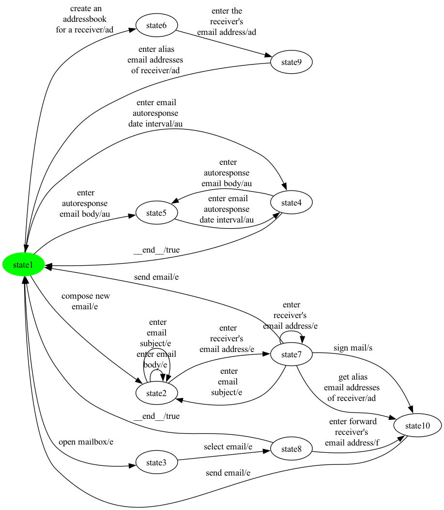

### State coverage (1 test case, 13 transitions)

```
compose new 
email -> enter 
receiver's 
email address -> sign mail -> send email -> open mailbox -> select email -> __end__ -> enter email 
autoresponse 
date interval -> enter 
autoresponse 
email body -> enter email 
autoresponse 
date interval -> __end__ -> create an 
addressbook 
for a receiver -> enter the  
receiver's 
email address
```

### All-transitions coverage (10 test cases, 20 transitions total)

- **`eMail_p6_trans_seg0`**: `enter email 
autoresponse 
date interval -> enter 
autoresponse 
email body -> enter email 
autoresponse 
date interval`
- **`eMail_p6_trans_seg1`**: `enter 
autoresponse 
email body`
- **`eMail_p6_trans_seg2`**: `open mailbox`
- **`eMail_p6_trans_seg3`**: `enter forward 
receiver's 
email address`
- **`eMail_p6_trans_seg4`**: `select email`
- **`eMail_p6_trans_seg5`**: `create an 
addressbook 
for a receiver -> enter the  
receiver's 
email address -> enter alias 
email addresses 
of receiver`
- **`eMail_p6_trans_seg6`**: `send email -> compose new 
email`
- **`eMail_p6_trans_seg7`**: `sign mail -> send email`
- **`eMail_p6_trans_seg8`**: `enter 
receiver's 
email address -> enter
 email 
subject -> enter email 
body -> enter
 email 
subject`
- **`eMail_p6_trans_seg9`**: `enter 
receiver's 
email address -> get alias 
email addresses 
of receiver`

### All-transition-pairs coverage (38 test cases, 96 transitions total)

- **`eMail_p6_pair_seg0`**: `enter email 
autoresponse 
date interval`
- **`eMail_p6_pair_seg1`**: `open mailbox -> select email`
- **`eMail_p6_pair_seg2`**: `enter forward 
receiver's 
email address -> send email -> enter 
autoresponse 
email body`
- **`eMail_p6_pair_seg3`**: `send email -> create an 
addressbook 
for a receiver`
- **`eMail_p6_pair_seg4`**: `compose new 
email -> enter email 
body -> enter
 email 
subject -> enter
 email 
subject`
- **`eMail_p6_pair_seg5`**: `enter 
receiver's 
email address -> sign mail -> send email -> open mailbox`
- **`eMail_p6_pair_seg6`**: `select email -> enter forward 
receiver's 
email address`
- **`eMail_p6_pair_seg7`**: `__end__ -> open mailbox`
- **`eMail_p6_pair_seg8`**: `__end__ -> create an 
addressbook 
for a receiver`
- **`eMail_p6_pair_seg9`**: `enter alias 
email addresses 
of receiver -> compose new 
email -> enter
 email 
subject -> enter 
receiver's 
email address -> get alias 
email addresses 
of receiver`
- **`eMail_p6_pair_seg10`**: `send email -> compose new 
email`
- **`eMail_p6_pair_seg11`**: `enter 
receiver's 
email address -> send email -> enter 
autoresponse 
email body -> enter email 
autoresponse 
date interval`
- **`eMail_p6_pair_seg12`**: `__end__ -> enter email 
autoresponse 
date interval`
- **`eMail_p6_pair_seg13`**: `__end__ -> open mailbox`
- **`eMail_p6_pair_seg14`**: `__end__ -> enter 
autoresponse 
email body`
- **`eMail_p6_pair_seg15`**: `__end__ -> enter email 
autoresponse 
date interval`
- **`eMail_p6_pair_seg16`**: `send email -> compose new 
email`
- **`eMail_p6_pair_seg17`**: `send email -> create an 
addressbook 
for a receiver`
- **`eMail_p6_pair_seg18`**: `send email -> enter email 
autoresponse 
date interval`
- **`eMail_p6_pair_seg19`**: `__end__ -> create an 
addressbook 
for a receiver`
- **`eMail_p6_pair_seg20`**: `enter alias 
email addresses 
of receiver -> enter email 
autoresponse 
date interval`
- **`eMail_p6_pair_seg21`**: `enter alias 
email addresses 
of receiver -> open mailbox`
- **`eMail_p6_pair_seg22`**: `__end__ -> compose new 
email`
- **`eMail_p6_pair_seg23`**: `send email -> open mailbox`
- **`eMail_p6_pair_seg24`**: `compose new 
email -> enter 
receiver's 
email address -> enter
 email 
subject -> enter email 
body -> enter 
receiver's 
email address`
- **`eMail_p6_pair_seg25`**: `enter
 email 
subject -> enter
 email 
subject -> enter email 
body -> enter email 
body`
- **`eMail_p6_pair_seg26`**: `enter 
autoresponse 
email body`
- **`eMail_p6_pair_seg27`**: `enter 
receiver's 
email address -> sign mail`
- **`eMail_p6_pair_seg28`**: `compose new 
email`
- **`eMail_p6_pair_seg29`**: `enter 
receiver's 
email address -> enter 
receiver's 
email address -> send email`
- **`eMail_p6_pair_seg30`**: `open mailbox`
- **`eMail_p6_pair_seg31`**: `create an 
addressbook 
for a receiver`
- **`eMail_p6_pair_seg32`**: `enter the  
receiver's 
email address -> enter alias 
email addresses 
of receiver -> create an 
addressbook 
for a receiver -> enter the  
receiver's 
email address`
- **`eMail_p6_pair_seg33`**: `enter alias 
email addresses 
of receiver -> enter 
autoresponse 
email body`
- **`eMail_p6_pair_seg34`**: `__end__ -> compose new 
email`
- **`eMail_p6_pair_seg35`**: `enter 
receiver's 
email address -> enter
 email 
subject -> enter 
receiver's 
email address -> enter 
receiver's 
email address -> get alias 
email addresses 
of receiver -> send email -> enter email 
autoresponse 
date interval -> enter 
autoresponse 
email body -> enter email 
autoresponse 
date interval`
- **`eMail_p6_pair_seg36`**: `__end__ -> enter 
autoresponse 
email body`
- **`eMail_p6_pair_seg37`**: `enter email 
autoresponse 
date interval -> enter 
autoresponse 
email body`

## Product 7

**Selected features:** selected = {ad, e, s}

**Repaired FTS:** 8 states, 16 transitions

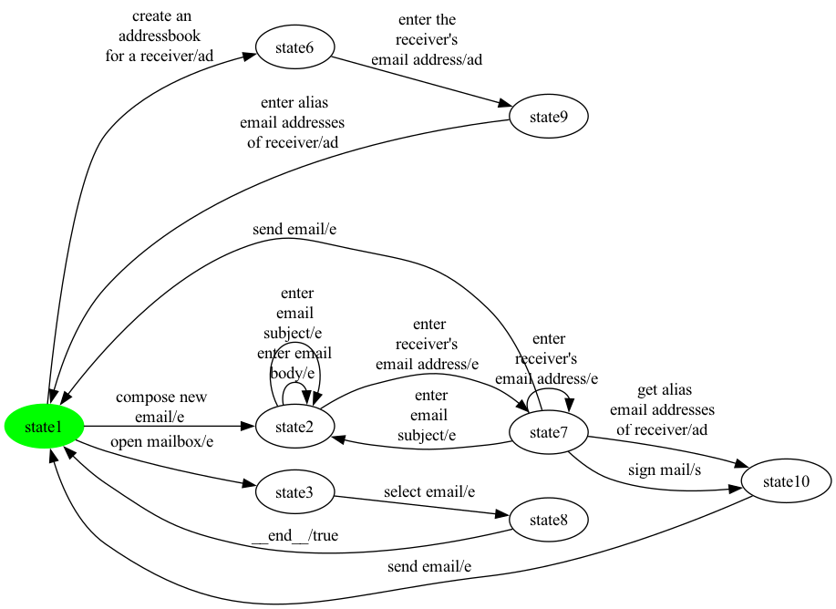

### State coverage (1 test case, 9 transitions)

```
open mailbox -> select email -> __end__ -> create an 
addressbook 
for a receiver -> enter the  
receiver's 
email address -> enter alias 
email addresses 
of receiver -> compose new 
email -> enter 
receiver's 
email address -> sign mail
```

### All-transitions coverage (7 test cases, 15 transitions total)

- **`eMail_p7_trans_seg0`**: `open mailbox -> select email`
- **`eMail_p7_trans_seg1`**: `create an 
addressbook 
for a receiver -> enter the  
receiver's 
email address -> enter alias 
email addresses 
of receiver`
- **`eMail_p7_trans_seg2`**: `send email`
- **`eMail_p7_trans_seg3`**: `enter 
receiver's 
email address -> sign mail`
- **`eMail_p7_trans_seg4`**: `compose new 
email`
- **`eMail_p7_trans_seg5`**: `enter
 email 
subject -> enter email 
body -> enter
 email 
subject`
- **`eMail_p7_trans_seg6`**: `enter 
receiver's 
email address -> get alias 
email addresses 
of receiver -> send email`

### All-transition-pairs coverage (20 test cases, 59 transitions total)

- **`eMail_p7_pair_seg0`**: `compose new 
email -> enter
 email 
subject -> enter
 email 
subject -> enter email 
body`
- **`eMail_p7_pair_seg1`**: `enter 
receiver's 
email address -> sign mail -> send email -> create an 
addressbook 
for a receiver`
- **`eMail_p7_pair_seg2`**: `enter alias 
email addresses 
of receiver -> create an 
addressbook 
for a receiver`
- **`eMail_p7_pair_seg3`**: `enter alias 
email addresses 
of receiver -> compose new 
email -> enter email 
body -> enter 
receiver's 
email address -> get alias 
email addresses 
of receiver`
- **`eMail_p7_pair_seg4`**: `send email -> open mailbox -> select email`
- **`eMail_p7_pair_seg5`**: `__end__ -> open mailbox`
- **`eMail_p7_pair_seg6`**: `__end__ -> compose new 
email`
- **`eMail_p7_pair_seg7`**: `enter 
receiver's 
email address -> send email -> compose new 
email`
- **`eMail_p7_pair_seg8`**: `enter 
receiver's 
email address -> sign mail`
- **`eMail_p7_pair_seg9`**: `send email -> compose new 
email`
- **`eMail_p7_pair_seg10`**: `enter 
receiver's 
email address -> get alias 
email addresses 
of receiver -> send email`
- **`eMail_p7_pair_seg11`**: `enter 
receiver's 
email address -> enter 
receiver's 
email address -> enter 
receiver's 
email address -> enter
 email 
subject -> enter
 email 
subject`
- **`eMail_p7_pair_seg12`**: `enter 
receiver's 
email address -> send email -> create an 
addressbook 
for a receiver`
- **`eMail_p7_pair_seg13`**: `compose new 
email -> enter 
receiver's 
email address`
- **`eMail_p7_pair_seg14`**: `__end__ -> create an 
addressbook 
for a receiver`
- **`eMail_p7_pair_seg15`**: `enter 
receiver's 
email address -> enter
 email 
subject -> enter 
receiver's 
email address`
- **`eMail_p7_pair_seg16`**: `enter
 email 
subject -> enter email 
body -> enter email 
body -> enter
 email 
subject -> enter 
receiver's 
email address`
- **`eMail_p7_pair_seg17`**: `send email -> open mailbox`
- **`eMail_p7_pair_seg18`**: `open mailbox`
- **`eMail_p7_pair_seg19`**: `create an 
addressbook 
for a receiver -> enter the  
receiver's 
email address -> enter alias 
email addresses 
of receiver -> open mailbox`

## Product 8

**Selected features:** selected = {au, e, en, s}

**Repaired FTS:** 9 states, 19 transitions


### State coverage (1 test case, 14 transitions)

```
compose new 
email -> enter 
receiver's 
email address -> sign mail -> send email -> open mailbox -> select email -> __end__ -> enter email 
autoresponse 
date interval -> enter 
autoresponse 
email body -> enter email 
autoresponse 
date interval -> __end__ -> compose new 
email -> enter 
receiver's 
email address -> get receiver's  
public key
```

### All-transitions coverage (7 test cases, 17 transitions total)

- **`eMail_p8_trans_seg0`**: `enter email 
autoresponse 
date interval -> enter 
autoresponse 
email body -> enter email 
autoresponse 
date interval`
- **`eMail_p8_trans_seg1`**: `enter 
autoresponse 
email body`
- **`eMail_p8_trans_seg2`**: `open mailbox -> select email`
- **`eMail_p8_trans_seg3`**: `compose new 
email`
- **`eMail_p8_trans_seg4`**: `send email`
- **`eMail_p8_trans_seg5`**: `get receiver's  
public key -> encrypt mail 
with receiver's 
public key -> send email`
- **`eMail_p8_trans_seg6`**: `enter
 email 
subject -> enter email 
body -> enter
 email 
subject -> enter 
receiver's 
email address -> enter 
receiver's 
email address -> sign mail`

### All-transition-pairs coverage (28 test cases, 74 transitions total)

- **`eMail_p8_pair_seg0`**: `enter email 
autoresponse 
date interval`
- **`eMail_p8_pair_seg1`**: `__end__ -> open mailbox -> select email`
- **`eMail_p8_pair_seg2`**: `__end__ -> enter email 
autoresponse 
date interval`
- **`eMail_p8_pair_seg3`**: `__end__ -> open mailbox`
- **`eMail_p8_pair_seg4`**: `__end__ -> enter email 
autoresponse 
date interval`
- **`eMail_p8_pair_seg5`**: `compose new 
email -> enter email 
body -> enter
 email 
subject -> enter
 email 
subject`
- **`eMail_p8_pair_seg6`**: `send email -> enter 
autoresponse 
email body`
- **`eMail_p8_pair_seg7`**: `compose new 
email -> enter
 email 
subject -> enter 
receiver's 
email address -> sign mail -> send email -> open mailbox`
- **`eMail_p8_pair_seg8`**: `__end__ -> enter 
autoresponse 
email body`
- **`eMail_p8_pair_seg9`**: `enter 
receiver's 
email address -> send email -> enter 
autoresponse 
email body -> enter email 
autoresponse 
date interval`
- **`eMail_p8_pair_seg10`**: `send email -> compose new 
email -> enter 
receiver's 
email address`
- **`eMail_p8_pair_seg11`**: `send email -> enter email 
autoresponse 
date interval`
- **`eMail_p8_pair_seg12`**: `__end__ -> compose new 
email`
- **`eMail_p8_pair_seg13`**: `send email -> open mailbox`
- **`eMail_p8_pair_seg14`**: `enter 
receiver's 
email address -> enter
 email 
subject -> enter email 
body -> enter 
receiver's 
email address`
- **`eMail_p8_pair_seg15`**: `enter
 email 
subject -> enter
 email 
subject -> enter email 
body -> enter email 
body`
- **`eMail_p8_pair_seg16`**: `enter 
autoresponse 
email body`
- **`eMail_p8_pair_seg17`**: `enter 
receiver's 
email address -> sign mail`
- **`eMail_p8_pair_seg18`**: `__end__ -> compose new 
email`
- **`eMail_p8_pair_seg19`**: `enter 
receiver's 
email address -> get receiver's  
public key -> encrypt mail 
with receiver's 
public key`
- **`eMail_p8_pair_seg20`**: `send email -> compose new 
email`
- **`eMail_p8_pair_seg21`**: `enter 
receiver's 
email address -> enter 
receiver's 
email address -> enter 
receiver's 
email address -> send email`
- **`eMail_p8_pair_seg22`**: `compose new 
email`
- **`eMail_p8_pair_seg23`**: `enter 
receiver's 
email address -> enter
 email 
subject -> enter 
receiver's 
email address -> get receiver's  
public key`
- **`eMail_p8_pair_seg24`**: `encrypt mail 
with receiver's 
public key -> send email -> enter email 
autoresponse 
date interval -> enter 
autoresponse 
email body -> enter email 
autoresponse 
date interval`
- **`eMail_p8_pair_seg25`**: `__end__ -> enter 
autoresponse 
email body`
- **`eMail_p8_pair_seg26`**: `enter email 
autoresponse 
date interval -> enter 
autoresponse 
email body`
- **`eMail_p8_pair_seg27`**: `open mailbox`

## Product 9

**Selected features:** selected = {ad, e, f, s}

**Repaired FTS:** 8 states, 17 transitions

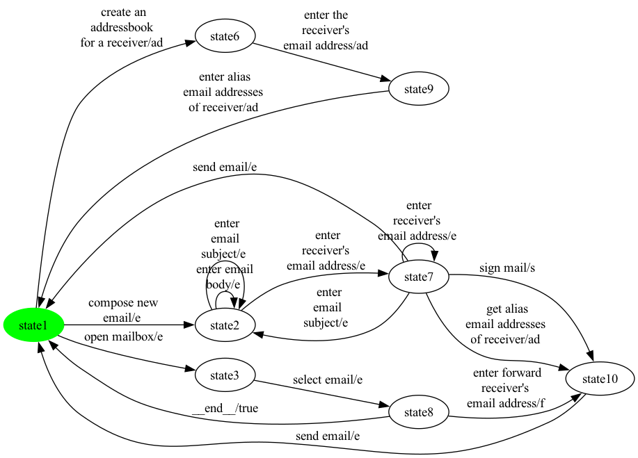

### State coverage (1 test case, 9 transitions)

```
open mailbox -> select email -> enter forward 
receiver's 
email address -> send email -> create an 
addressbook 
for a receiver -> enter the  
receiver's 
email address -> enter alias 
email addresses 
of receiver -> compose new 
email -> enter 
receiver's 
email address
```

### All-transitions coverage (6 test cases, 16 transitions total)

- **`eMail_p9_trans_seg0`**: `open mailbox -> select email -> enter forward 
receiver's 
email address`
- **`eMail_p9_trans_seg1`**: `create an 
addressbook 
for a receiver -> enter the  
receiver's 
email address -> enter alias 
email addresses 
of receiver`
- **`eMail_p9_trans_seg2`**: `send email -> compose new 
email`
- **`eMail_p9_trans_seg3`**: `enter 
receiver's 
email address -> sign mail`
- **`eMail_p9_trans_seg4`**: `enter
 email 
subject -> enter email 
body -> enter
 email 
subject`
- **`eMail_p9_trans_seg5`**: `enter 
receiver's 
email address -> get alias 
email addresses 
of receiver -> send email`

### All-transition-pairs coverage (20 test cases, 61 transitions total)

- **`eMail_p9_pair_seg0`**: `compose new 
email -> enter
 email 
subject -> enter
 email 
subject -> enter email 
body`
- **`eMail_p9_pair_seg1`**: `enter 
receiver's 
email address -> sign mail -> send email -> create an 
addressbook 
for a receiver`
- **`eMail_p9_pair_seg2`**: `enter alias 
email addresses 
of receiver -> create an 
addressbook 
for a receiver`
- **`eMail_p9_pair_seg3`**: `enter alias 
email addresses 
of receiver -> compose new 
email -> enter email 
body -> enter 
receiver's 
email address -> get alias 
email addresses 
of receiver`
- **`eMail_p9_pair_seg4`**: `send email -> open mailbox`
- **`eMail_p9_pair_seg5`**: `__end__ -> open mailbox -> select email`
- **`eMail_p9_pair_seg6`**: `__end__ -> compose new 
email`
- **`eMail_p9_pair_seg7`**: `enter 
receiver's 
email address -> send email -> compose new 
email`
- **`eMail_p9_pair_seg8`**: `enter 
receiver's 
email address -> sign mail`
- **`eMail_p9_pair_seg9`**: `__end__ -> create an 
addressbook 
for a receiver`
- **`eMail_p9_pair_seg10`**: `enter 
receiver's 
email address -> get alias 
email addresses 
of receiver -> send email -> compose new 
email`
- **`eMail_p9_pair_seg11`**: `enter 
receiver's 
email address -> enter 
receiver's 
email address -> enter 
receiver's 
email address -> enter
 email 
subject -> enter
 email 
subject`
- **`eMail_p9_pair_seg12`**: `enter 
receiver's 
email address -> send email -> create an 
addressbook 
for a receiver`
- **`eMail_p9_pair_seg13`**: `compose new 
email -> enter 
receiver's 
email address`
- **`eMail_p9_pair_seg14`**: `select email -> enter forward 
receiver's 
email address -> send email`
- **`eMail_p9_pair_seg15`**: `enter 
receiver's 
email address -> enter
 email 
subject -> enter 
receiver's 
email address`
- **`eMail_p9_pair_seg16`**: `enter
 email 
subject -> enter email 
body -> enter email 
body -> enter
 email 
subject -> enter 
receiver's 
email address`
- **`eMail_p9_pair_seg17`**: `send email -> open mailbox`
- **`eMail_p9_pair_seg18`**: `open mailbox`
- **`eMail_p9_pair_seg19`**: `create an 
addressbook 
for a receiver -> enter the  
receiver's 
email address -> enter alias 
email addresses 
of receiver -> open mailbox`

## Product 10

**Selected features:** selected = {e, f, s}

**Repaired FTS:** 6 states, 13 transitions

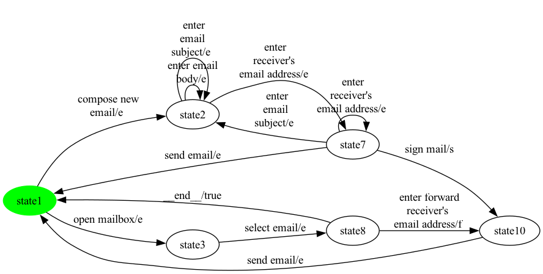

### State coverage (1 test case, 6 transitions)

```
open mailbox -> select email -> enter forward 
receiver's 
email address -> send email -> compose new 
email -> enter 
receiver's 
email address
```

### All-transitions coverage (7 test cases, 12 transitions total)

- **`eMail_p10_trans_seg0`**: `enter forward 
receiver's 
email address`
- **`eMail_p10_trans_seg1`**: `open mailbox -> select email`
- **`eMail_p10_trans_seg2`**: `send email`
- **`eMail_p10_trans_seg3`**: `enter 
receiver's 
email address`
- **`eMail_p10_trans_seg4`**: `compose new 
email`
- **`eMail_p10_trans_seg5`**: `enter
 email 
subject -> enter email 
body -> enter
 email 
subject`
- **`eMail_p10_trans_seg6`**: `enter 
receiver's 
email address -> sign mail -> send email`

### All-transition-pairs coverage (13 test cases, 43 transitions total)

- **`eMail_p10_pair_seg0`**: `compose new 
email -> enter
 email 
subject -> enter
 email 
subject -> enter email 
body`
- **`eMail_p10_pair_seg1`**: `enter 
receiver's 
email address -> sign mail -> send email -> open mailbox -> select email`
- **`eMail_p10_pair_seg2`**: `__end__ -> open mailbox`
- **`eMail_p10_pair_seg3`**: `__end__ -> compose new 
email -> enter email 
body -> enter 
receiver's 
email address`
- **`eMail_p10_pair_seg4`**: `enter 
receiver's 
email address -> send email -> compose new 
email -> enter 
receiver's 
email address`
- **`eMail_p10_pair_seg5`**: `enter 
receiver's 
email address -> sign mail`
- **`eMail_p10_pair_seg6`**: `send email -> compose new 
email`
- **`eMail_p10_pair_seg7`**: `enter 
receiver's 
email address -> enter 
receiver's 
email address -> enter 
receiver's 
email address -> enter
 email 
subject -> enter
 email 
subject`
- **`eMail_p10_pair_seg8`**: `enter 
receiver's 
email address -> send email -> open mailbox`
- **`eMail_p10_pair_seg9`**: `select email -> enter forward 
receiver's 
email address -> send email`
- **`eMail_p10_pair_seg10`**: `enter 
receiver's 
email address -> enter
 email 
subject -> enter 
receiver's 
email address`
- **`eMail_p10_pair_seg11`**: `enter
 email 
subject -> enter email 
body -> enter email 
body -> enter
 email 
subject -> enter 
receiver's 
email address`
- **`eMail_p10_pair_seg12`**: `open mailbox`

## Product 11

**Selected features:** selected = {e, en}

**Repaired FTS:** 7 states, 13 transitions


### State coverage (1 test case, 7 transitions)

```
open mailbox -> select email -> __end__ -> compose new 
email -> enter 
receiver's 
email address -> get receiver's  
public key -> encrypt mail 
with receiver's 
public key
```

### All-transitions coverage (5 test cases, 12 transitions total)

- **`eMail_p11_trans_seg0`**: `open mailbox -> select email`
- **`eMail_p11_trans_seg1`**: `compose new 
email`
- **`eMail_p11_trans_seg2`**: `send email`
- **`eMail_p11_trans_seg3`**: `enter 
receiver's 
email address -> enter
 email 
subject -> enter email 
body -> enter
 email 
subject`
- **`eMail_p11_trans_seg4`**: `enter 
receiver's 
email address -> get receiver's  
public key -> encrypt mail 
with receiver's 
public key -> send email`

### All-transition-pairs coverage (11 test cases, 40 transitions total)

- **`eMail_p11_pair_seg0`**: `compose new 
email -> enter
 email 
subject -> enter
 email 
subject -> enter email 
body`
- **`eMail_p11_pair_seg1`**: `enter 
receiver's 
email address -> send email -> compose new 
email -> enter email 
body -> enter 
receiver's 
email address`
- **`eMail_p11_pair_seg2`**: `enter 
receiver's 
email address -> get receiver's  
public key -> encrypt mail 
with receiver's 
public key -> send email -> open mailbox -> select email`
- **`eMail_p11_pair_seg3`**: `__end__ -> open mailbox`
- **`eMail_p11_pair_seg4`**: `__end__ -> compose new 
email`
- **`eMail_p11_pair_seg5`**: `enter 
receiver's 
email address -> enter 
receiver's 
email address -> enter 
receiver's 
email address -> enter
 email 
subject -> enter
 email 
subject`
- **`eMail_p11_pair_seg6`**: `compose new 
email -> enter 
receiver's 
email address -> get receiver's  
public key`
- **`eMail_p11_pair_seg7`**: `send email -> compose new 
email`
- **`eMail_p11_pair_seg8`**: `enter 
receiver's 
email address -> enter
 email 
subject -> enter 
receiver's 
email address`
- **`eMail_p11_pair_seg9`**: `enter
 email 
subject -> enter email 
body -> enter email 
body -> enter
 email 
subject -> enter 
receiver's 
email address -> send email -> open mailbox`
- **`eMail_p11_pair_seg10`**: `open mailbox`

## Product 12

**Selected features:** selected = {ad, au, e}

**Repaired FTS:** 10 states, 20 transitions

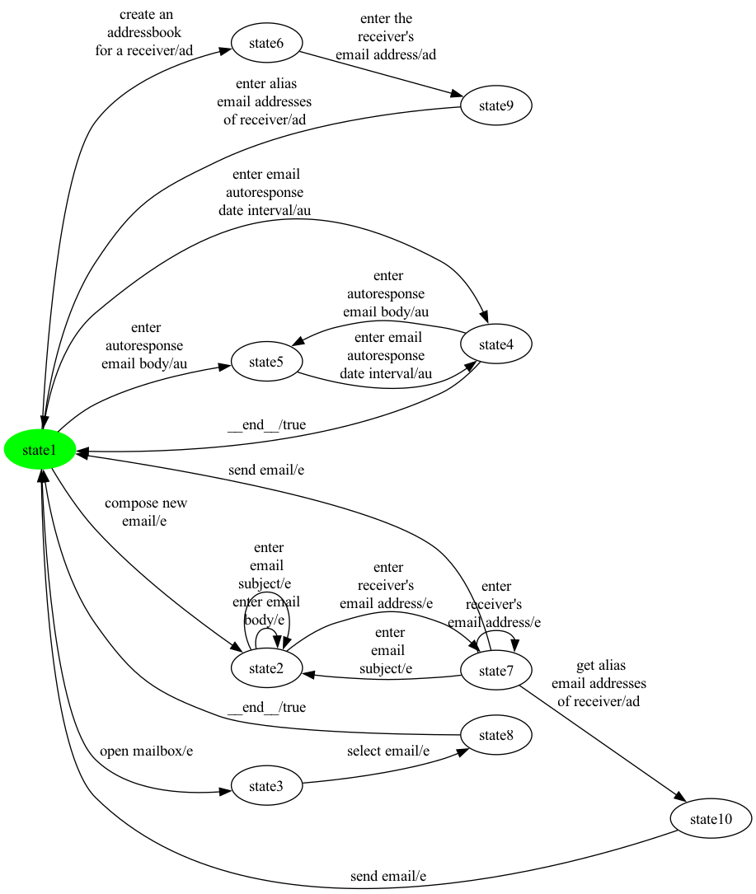

### State coverage (1 test case, 13 transitions)

```
compose new 
email -> enter 
receiver's 
email address -> get alias 
email addresses 
of receiver -> send email -> open mailbox -> select email -> __end__ -> enter email 
autoresponse 
date interval -> enter 
autoresponse 
email body -> enter email 
autoresponse 
date interval -> __end__ -> create an 
addressbook 
for a receiver -> enter the  
receiver's 
email address
```

### All-transitions coverage (7 test cases, 18 transitions total)

- **`eMail_p12_trans_seg0`**: `enter email 
autoresponse 
date interval -> enter 
autoresponse 
email body -> enter email 
autoresponse 
date interval`
- **`eMail_p12_trans_seg1`**: `enter 
autoresponse 
email body`
- **`eMail_p12_trans_seg2`**: `open mailbox -> select email`
- **`eMail_p12_trans_seg3`**: `create an 
addressbook 
for a receiver -> enter the  
receiver's 
email address -> enter alias 
email addresses 
of receiver -> compose new 
email`
- **`eMail_p12_trans_seg4`**: `send email`
- **`eMail_p12_trans_seg5`**: `enter 
receiver's 
email address -> enter
 email 
subject -> enter email 
body -> enter
 email 
subject`
- **`eMail_p12_trans_seg6`**: `enter 
receiver's 
email address -> get alias 
email addresses 
of receiver -> send email`

### All-transition-pairs coverage (35 test cases, 88 transitions total)

- **`eMail_p12_pair_seg0`**: `enter email 
autoresponse 
date interval`
- **`eMail_p12_pair_seg1`**: `__end__ -> open mailbox -> select email`
- **`eMail_p12_pair_seg2`**: `__end__ -> create an 
addressbook 
for a receiver`
- **`eMail_p12_pair_seg3`**: `compose new 
email -> enter email 
body -> enter
 email 
subject -> enter
 email 
subject -> enter 
receiver's 
email address`
- **`eMail_p12_pair_seg4`**: `send email -> enter 
autoresponse 
email body`
- **`eMail_p12_pair_seg5`**: `__end__ -> enter email 
autoresponse 
date interval`
- **`eMail_p12_pair_seg6`**: `__end__ -> open mailbox`
- **`eMail_p12_pair_seg7`**: `__end__ -> enter email 
autoresponse 
date interval`
- **`eMail_p12_pair_seg8`**: `enter alias 
email addresses 
of receiver -> compose new 
email -> enter
 email 
subject -> enter email 
body -> enter 
receiver's 
email address -> get alias 
email addresses 
of receiver`
- **`eMail_p12_pair_seg9`**: `send email -> create an 
addressbook 
for a receiver`
- **`eMail_p12_pair_seg10`**: `send email -> open mailbox`
- **`eMail_p12_pair_seg11`**: `__end__ -> enter 
autoresponse 
email body`
- **`eMail_p12_pair_seg12`**: `__end__ -> create an 
addressbook 
for a receiver`
- **`eMail_p12_pair_seg13`**: `get alias 
email addresses 
of receiver -> send email -> compose new 
email`
- **`eMail_p12_pair_seg14`**: `enter 
receiver's 
email address -> send email -> enter 
autoresponse 
email body`
- **`eMail_p12_pair_seg15`**: `enter alias 
email addresses 
of receiver -> enter email 
autoresponse 
date interval`
- **`eMail_p12_pair_seg16`**: `send email -> compose new 
email`
- **`eMail_p12_pair_seg17`**: `send email -> create an 
addressbook 
for a receiver -> enter the  
receiver's 
email address`
- **`eMail_p12_pair_seg18`**: `enter alias 
email addresses 
of receiver -> open mailbox`
- **`eMail_p12_pair_seg19`**: `__end__ -> compose new 
email`
- **`eMail_p12_pair_seg20`**: `send email -> enter email 
autoresponse 
date interval`
- **`eMail_p12_pair_seg21`**: `compose new 
email -> enter 
receiver's 
email address -> enter
 email 
subject -> enter email 
body -> enter email 
body`
- **`eMail_p12_pair_seg22`**: `enter 
autoresponse 
email body -> enter email 
autoresponse 
date interval`
- **`eMail_p12_pair_seg23`**: `enter
 email 
subject -> enter
 email 
subject`
- **`eMail_p12_pair_seg24`**: `compose new 
email`
- **`eMail_p12_pair_seg25`**: `enter 
receiver's 
email address -> enter 
receiver's 
email address -> send email -> open mailbox`
- **`eMail_p12_pair_seg26`**: `open mailbox`
- **`eMail_p12_pair_seg27`**: `create an 
addressbook 
for a receiver`
- **`eMail_p12_pair_seg28`**: `enter alias 
email addresses 
of receiver -> create an 
addressbook 
for a receiver`
- **`eMail_p12_pair_seg29`**: `enter the  
receiver's 
email address -> enter alias 
email addresses 
of receiver -> enter 
autoresponse 
email body`
- **`eMail_p12_pair_seg30`**: `__end__ -> compose new 
email`
- **`eMail_p12_pair_seg31`**: `enter 
receiver's 
email address -> enter
 email 
subject -> enter 
receiver's 
email address -> enter 
receiver's 
email address -> get alias 
email addresses 
of receiver`
- **`eMail_p12_pair_seg32`**: `send email -> enter email 
autoresponse 
date interval -> enter 
autoresponse 
email body -> enter email 
autoresponse 
date interval`
- **`eMail_p12_pair_seg33`**: `__end__ -> enter 
autoresponse 
email body`
- **`eMail_p12_pair_seg34`**: `enter email 
autoresponse 
date interval -> enter 
autoresponse 
email body`

## Product 13

**Selected features:** selected = {au, e, en}

**Repaired FTS:** 9 states, 18 transitions

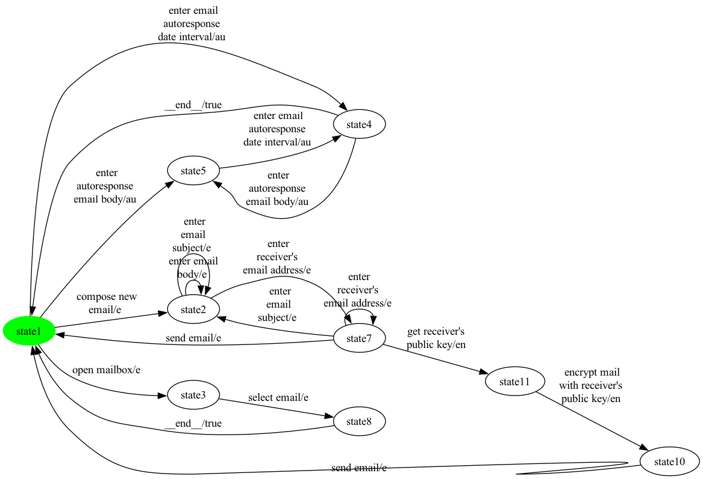

### State coverage (1 test case, 10 transitions)

```
compose new 
email -> enter 
receiver's 
email address -> get receiver's  
public key -> encrypt mail 
with receiver's 
public key -> send email -> open mailbox -> select email -> __end__ -> enter email 
autoresponse 
date interval -> enter 
autoresponse 
email body
```

### All-transitions coverage (7 test cases, 16 transitions total)

- **`eMail_p13_trans_seg0`**: `enter email 
autoresponse 
date interval -> enter 
autoresponse 
email body -> enter email 
autoresponse 
date interval`
- **`eMail_p13_trans_seg1`**: `enter 
autoresponse 
email body`
- **`eMail_p13_trans_seg2`**: `open mailbox -> select email`
- **`eMail_p13_trans_seg3`**: `compose new 
email`
- **`eMail_p13_trans_seg4`**: `send email`
- **`eMail_p13_trans_seg5`**: `enter 
receiver's 
email address -> enter
 email 
subject -> enter email 
body -> enter
 email 
subject`
- **`eMail_p13_trans_seg6`**: `enter 
receiver's 
email address -> get receiver's  
public key -> encrypt mail 
with receiver's 
public key -> send email`

### All-transition-pairs coverage (30 test cases, 73 transitions total)

- **`eMail_p13_pair_seg0`**: `enter email 
autoresponse 
date interval`
- **`eMail_p13_pair_seg1`**: `__end__ -> open mailbox`
- **`eMail_p13_pair_seg2`**: `__end__ -> enter email 
autoresponse 
date interval`
- **`eMail_p13_pair_seg3`**: `__end__ -> open mailbox -> select email`
- **`eMail_p13_pair_seg4`**: `__end__ -> enter email 
autoresponse 
date interval`
- **`eMail_p13_pair_seg5`**: `compose new 
email -> enter email 
body -> enter
 email 
subject -> enter
 email 
subject`
- **`eMail_p13_pair_seg6`**: `enter 
receiver's 
email address -> send email -> enter 
autoresponse 
email body`
- **`eMail_p13_pair_seg7`**: `compose new 
email -> enter
 email 
subject -> enter 
receiver's 
email address`
- **`eMail_p13_pair_seg8`**: `send email -> compose new 
email`
- **`eMail_p13_pair_seg9`**: `send email -> enter email 
autoresponse 
date interval`
- **`eMail_p13_pair_seg10`**: `send email -> open mailbox`
- **`eMail_p13_pair_seg11`**: `__end__ -> enter 
autoresponse 
email body`
- **`eMail_p13_pair_seg12`**: `__end__ -> compose new 
email`
- **`eMail_p13_pair_seg13`**: `enter 
receiver's 
email address -> enter
 email 
subject -> enter email 
body -> enter 
receiver's 
email address`
- **`eMail_p13_pair_seg14`**: `enter
 email 
subject -> enter
 email 
subject -> enter email 
body -> enter email 
body`
- **`eMail_p13_pair_seg15`**: `enter 
autoresponse 
email body -> enter email 
autoresponse 
date interval`
- **`eMail_p13_pair_seg16`**: `compose new 
email -> enter 
receiver's 
email address`
- **`eMail_p13_pair_seg17`**: `enter 
receiver's 
email address -> get receiver's  
public key -> encrypt mail 
with receiver's 
public key`
- **`eMail_p13_pair_seg18`**: `send email -> enter 
autoresponse 
email body`
- **`eMail_p13_pair_seg19`**: `enter 
receiver's 
email address -> enter 
receiver's 
email address -> send email`
- **`eMail_p13_pair_seg20`**: `__end__ -> compose new 
email`
- **`eMail_p13_pair_seg21`**: `enter 
receiver's 
email address -> enter 
receiver's 
email address -> enter
 email 
subject -> enter 
receiver's 
email address`
- **`eMail_p13_pair_seg22`**: `encrypt mail 
with receiver's 
public key -> send email -> open mailbox`
- **`eMail_p13_pair_seg23`**: `compose new 
email`
- **`eMail_p13_pair_seg24`**: `send email -> compose new 
email`
- **`eMail_p13_pair_seg25`**: `enter 
receiver's 
email address -> get receiver's  
public key`
- **`eMail_p13_pair_seg26`**: `send email -> enter email 
autoresponse 
date interval -> enter 
autoresponse 
email body -> enter email 
autoresponse 
date interval`
- **`eMail_p13_pair_seg27`**: `__end__ -> enter 
autoresponse 
email body`
- **`eMail_p13_pair_seg28`**: `enter email 
autoresponse 
date interval -> enter 
autoresponse 
email body`
- **`eMail_p13_pair_seg29`**: `open mailbox`

## Product 14

**Selected features:** selected = {ad, e, en}

**Repaired FTS:** 9 states, 17 transitions

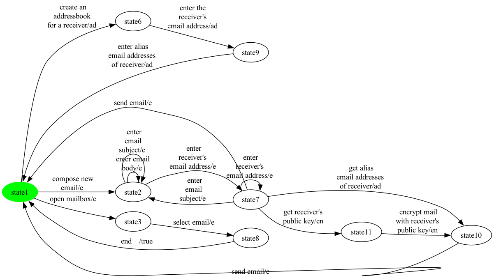

### State coverage (1 test case, 10 transitions)

```
open mailbox -> select email -> __end__ -> create an 
addressbook 
for a receiver -> enter the  
receiver's 
email address -> enter alias 
email addresses 
of receiver -> compose new 
email -> enter 
receiver's 
email address -> get receiver's  
public key -> encrypt mail 
with receiver's 
public key
```

### All-transitions coverage (7 test cases, 16 transitions total)

- **`eMail_p14_trans_seg0`**: `open mailbox -> select email`
- **`eMail_p14_trans_seg1`**: `create an 
addressbook 
for a receiver -> enter the  
receiver's 
email address -> enter alias 
email addresses 
of receiver`
- **`eMail_p14_trans_seg2`**: `send email`
- **`eMail_p14_trans_seg3`**: `enter 
receiver's 
email address -> get receiver's  
public key -> encrypt mail 
with receiver's 
public key`
- **`eMail_p14_trans_seg4`**: `compose new 
email`
- **`eMail_p14_trans_seg5`**: `enter
 email 
subject -> enter email 
body -> enter
 email 
subject`
- **`eMail_p14_trans_seg6`**: `enter 
receiver's 
email address -> get alias 
email addresses 
of receiver -> send email`

### All-transition-pairs coverage (22 test cases, 62 transitions total)

- **`eMail_p14_pair_seg0`**: `compose new 
email -> enter
 email 
subject -> enter
 email 
subject -> enter email 
body`
- **`eMail_p14_pair_seg1`**: `enter 
receiver's 
email address -> get alias 
email addresses 
of receiver`
- **`eMail_p14_pair_seg2`**: `send email -> create an 
addressbook 
for a receiver`
- **`eMail_p14_pair_seg3`**: `enter alias 
email addresses 
of receiver -> create an 
addressbook 
for a receiver`
- **`eMail_p14_pair_seg4`**: `compose new 
email -> enter email 
body -> enter 
receiver's 
email address`
- **`eMail_p14_pair_seg5`**: `enter 
receiver's 
email address -> send email -> compose new 
email`
- **`eMail_p14_pair_seg6`**: `enter 
receiver's 
email address -> get alias 
email addresses 
of receiver -> send email`
- **`eMail_p14_pair_seg7`**: `enter 
receiver's 
email address -> get receiver's  
public key -> encrypt mail 
with receiver's 
public key`
- **`eMail_p14_pair_seg8`**: `send email -> open mailbox`
- **`eMail_p14_pair_seg9`**: `__end__ -> open mailbox`
- **`eMail_p14_pair_seg10`**: `__end__ -> compose new 
email -> enter 
receiver's 
email address -> enter 
receiver's 
email address -> enter 
receiver's 
email address -> enter
 email 
subject -> enter
 email 
subject`
- **`eMail_p14_pair_seg11`**: `enter 
receiver's 
email address -> get receiver's  
public key`
- **`eMail_p14_pair_seg12`**: `encrypt mail 
with receiver's 
public key -> send email -> compose new 
email`
- **`eMail_p14_pair_seg13`**: `enter 
receiver's 
email address -> send email -> create an 
addressbook 
for a receiver -> enter the  
receiver's 
email address`
- **`eMail_p14_pair_seg14`**: `enter alias 
email addresses 
of receiver -> compose new 
email`
- **`eMail_p14_pair_seg15`**: `enter 
receiver's 
email address -> enter
 email 
subject -> enter 
receiver's 
email address`
- **`eMail_p14_pair_seg16`**: `enter
 email 
subject -> enter email 
body -> enter email 
body -> enter
 email 
subject -> enter 
receiver's 
email address`
- **`eMail_p14_pair_seg17`**: `send email -> open mailbox -> select email`
- **`eMail_p14_pair_seg18`**: `__end__ -> create an 
addressbook 
for a receiver`
- **`eMail_p14_pair_seg19`**: `enter the  
receiver's 
email address -> enter alias 
email addresses 
of receiver -> open mailbox`
- **`eMail_p14_pair_seg20`**: `open mailbox`
- **`eMail_p14_pair_seg21`**: `create an 
addressbook 
for a receiver`

## Product 15

**Selected features:** selected = {au, e, f, s}

**Repaired FTS:** 8 states, 18 transitions


### State coverage (1 test case, 9 transitions)

```
compose new 
email -> enter 
receiver's 
email address -> sign mail -> send email -> open mailbox -> select email -> __end__ -> enter email 
autoresponse 
date interval -> enter 
autoresponse 
email body
```

### All-transitions coverage (6 test cases, 16 transitions total)

- **`eMail_p15_trans_seg0`**: `enter email 
autoresponse 
date interval -> enter 
autoresponse 
email body -> enter email 
autoresponse 
date interval`
- **`eMail_p15_trans_seg1`**: `enter 
autoresponse 
email body`
- **`eMail_p15_trans_seg2`**: `open mailbox -> select email -> enter forward 
receiver's 
email address -> send email`
- **`eMail_p15_trans_seg3`**: `compose new 
email`
- **`eMail_p15_trans_seg4`**: `send email`
- **`eMail_p15_trans_seg5`**: `enter
 email 
subject -> enter email 
body -> enter
 email 
subject -> enter 
receiver's 
email address -> enter 
receiver's 
email address -> sign mail`

### All-transition-pairs coverage (25 test cases, 69 transitions total)

- **`eMail_p15_pair_seg0`**: `enter email 
autoresponse 
date interval`
- **`eMail_p15_pair_seg1`**: `enter forward 
receiver's 
email address -> send email -> enter 
autoresponse 
email body`
- **`eMail_p15_pair_seg2`**: `select email -> enter forward 
receiver's 
email address`
- **`eMail_p15_pair_seg3`**: `send email -> open mailbox`
- **`eMail_p15_pair_seg4`**: `send email -> compose new 
email -> enter email 
body -> enter
 email 
subject -> enter
 email 
subject`
- **`eMail_p15_pair_seg5`**: `enter 
receiver's 
email address -> sign mail -> send email -> enter email 
autoresponse 
date interval`
- **`eMail_p15_pair_seg6`**: `__end__ -> open mailbox -> select email`
- **`eMail_p15_pair_seg7`**: `__end__ -> enter email 
autoresponse 
date interval`
- **`eMail_p15_pair_seg8`**: `__end__ -> open mailbox`
- **`eMail_p15_pair_seg9`**: `__end__ -> enter 
autoresponse 
email body`
- **`eMail_p15_pair_seg10`**: `__end__ -> enter email 
autoresponse 
date interval`
- **`eMail_p15_pair_seg11`**: `compose new 
email -> enter
 email 
subject -> enter 
receiver's 
email address -> send email -> enter 
autoresponse 
email body`
- **`eMail_p15_pair_seg12`**: `send email -> compose new 
email -> enter 
receiver's 
email address`
- **`eMail_p15_pair_seg13`**: `send email -> enter email 
autoresponse 
date interval -> enter 
autoresponse 
email body -> enter email 
autoresponse 
date interval`
- **`eMail_p15_pair_seg14`**: `__end__ -> compose new 
email`
- **`eMail_p15_pair_seg15`**: `send email -> open mailbox`
- **`eMail_p15_pair_seg16`**: `enter 
receiver's 
email address -> enter
 email 
subject -> enter email 
body -> enter 
receiver's 
email address`
- **`eMail_p15_pair_seg17`**: `enter
 email 
subject -> enter
 email 
subject -> enter email 
body -> enter email 
body`
- **`eMail_p15_pair_seg18`**: `enter 
autoresponse 
email body`
- **`eMail_p15_pair_seg19`**: `__end__ -> enter 
autoresponse 
email body -> enter email 
autoresponse 
date interval -> enter 
autoresponse 
email body`
- **`eMail_p15_pair_seg20`**: `compose new 
email`
- **`eMail_p15_pair_seg21`**: `enter 
receiver's 
email address -> sign mail`
- **`eMail_p15_pair_seg22`**: `open mailbox`
- **`eMail_p15_pair_seg23`**: `__end__ -> compose new 
email`
- **`eMail_p15_pair_seg24`**: `enter 
receiver's 
email address -> enter 
receiver's 
email address -> enter
 email 
subject -> enter 
receiver's 
email address -> enter 
receiver's 
email address -> send email`

## Product 16

**Selected features:** selected = {ad, au, e, f}

**Repaired FTS:** 10 states, 21 transitions


### State coverage (1 test case, 13 transitions)

```
compose new 
email -> enter 
receiver's 
email address -> get alias 
email addresses 
of receiver -> send email -> open mailbox -> select email -> __end__ -> enter email 
autoresponse 
date interval -> enter 
autoresponse 
email body -> enter email 
autoresponse 
date interval -> __end__ -> create an 
addressbook 
for a receiver -> enter the  
receiver's 
email address
```

### All-transitions coverage (6 test cases, 19 transitions total)

- **`eMail_p16_trans_seg0`**: `enter email 
autoresponse 
date interval -> enter 
autoresponse 
email body -> enter email 
autoresponse 
date interval`
- **`eMail_p16_trans_seg1`**: `enter 
autoresponse 
email body`
- **`eMail_p16_trans_seg2`**: `open mailbox -> select email -> enter forward 
receiver's 
email address -> send email`
- **`eMail_p16_trans_seg3`**: `create an 
addressbook 
for a receiver -> enter the  
receiver's 
email address -> enter alias 
email addresses 
of receiver -> compose new 
email`
- **`eMail_p16_trans_seg4`**: `send email`
- **`eMail_p16_trans_seg5`**: `enter
 email 
subject -> enter email 
body -> enter
 email 
subject -> enter 
receiver's 
email address -> enter 
receiver's 
email address -> get alias 
email addresses 
of receiver`

### All-transition-pairs coverage (35 test cases, 90 transitions total)

- **`eMail_p16_pair_seg0`**: `enter email 
autoresponse 
date interval`
- **`eMail_p16_pair_seg1`**: `enter forward 
receiver's 
email address -> send email -> enter 
autoresponse 
email body`
- **`eMail_p16_pair_seg2`**: `open mailbox -> select email -> enter forward 
receiver's 
email address`
- **`eMail_p16_pair_seg3`**: `send email -> create an 
addressbook 
for a receiver`
- **`eMail_p16_pair_seg4`**: `compose new 
email -> enter email 
body -> enter
 email 
subject -> enter
 email 
subject -> enter 
receiver's 
email address -> get alias 
email addresses 
of receiver -> send email -> open mailbox`
- **`eMail_p16_pair_seg5`**: `send email -> compose new 
email -> enter
 email 
subject -> enter email 
body -> enter 
receiver's 
email address -> send email -> enter 
autoresponse 
email body`
- **`eMail_p16_pair_seg6`**: `__end__ -> open mailbox`
- **`eMail_p16_pair_seg7`**: `__end__ -> create an 
addressbook 
for a receiver`
- **`eMail_p16_pair_seg8`**: `enter alias 
email addresses 
of receiver -> compose new 
email`
- **`eMail_p16_pair_seg9`**: `send email -> compose new 
email`
- **`eMail_p16_pair_seg10`**: `send email -> create an 
addressbook 
for a receiver`
- **`eMail_p16_pair_seg11`**: `send email -> enter email 
autoresponse 
date interval`
- **`eMail_p16_pair_seg12`**: `__end__ -> enter email 
autoresponse 
date interval`
- **`eMail_p16_pair_seg13`**: `__end__ -> open mailbox`
- **`eMail_p16_pair_seg14`**: `__end__ -> enter 
autoresponse 
email body`
- **`eMail_p16_pair_seg15`**: `__end__ -> enter email 
autoresponse 
date interval`
- **`eMail_p16_pair_seg16`**: `compose new 
email -> enter 
receiver's 
email address -> enter
 email 
subject -> enter email 
body -> enter email 
body`
- **`eMail_p16_pair_seg17`**: `enter 
autoresponse 
email body -> enter email 
autoresponse 
date interval`
- **`eMail_p16_pair_seg18`**: `__end__ -> create an 
addressbook 
for a receiver`
- **`eMail_p16_pair_seg19`**: `enter alias 
email addresses 
of receiver -> enter email 
autoresponse 
date interval`
- **`eMail_p16_pair_seg20`**: `create an 
addressbook 
for a receiver -> enter the  
receiver's 
email address`
- **`eMail_p16_pair_seg21`**: `enter alias 
email addresses 
of receiver -> open mailbox`
- **`eMail_p16_pair_seg22`**: `__end__ -> compose new 
email`
- **`eMail_p16_pair_seg23`**: `enter
 email 
subject -> enter
 email 
subject`
- **`eMail_p16_pair_seg24`**: `compose new 
email`
- **`eMail_p16_pair_seg25`**: `enter 
receiver's 
email address -> enter 
receiver's 
email address -> send email -> open mailbox`
- **`eMail_p16_pair_seg26`**: `open mailbox`
- **`eMail_p16_pair_seg27`**: `create an 
addressbook 
for a receiver`
- **`eMail_p16_pair_seg28`**: `enter alias 
email addresses 
of receiver -> create an 
addressbook 
for a receiver`
- **`eMail_p16_pair_seg29`**: `enter the  
receiver's 
email address -> enter alias 
email addresses 
of receiver -> enter 
autoresponse 
email body`
- **`eMail_p16_pair_seg30`**: `__end__ -> compose new 
email`
- **`eMail_p16_pair_seg31`**: `enter 
receiver's 
email address -> enter
 email 
subject -> enter 
receiver's 
email address -> enter 
receiver's 
email address -> get alias 
email addresses 
of receiver`
- **`eMail_p16_pair_seg32`**: `send email -> enter email 
autoresponse 
date interval -> enter 
autoresponse 
email body -> enter email 
autoresponse 
date interval`
- **`eMail_p16_pair_seg33`**: `__end__ -> enter 
autoresponse 
email body`
- **`eMail_p16_pair_seg34`**: `enter email 
autoresponse 
date interval -> enter 
autoresponse 
email body`

## Product 17

**Selected features:** selected = {ad, au, e, en}

**Repaired FTS:** 11 states, 22 transitions


### State coverage (1 test case, 17 transitions)

```
compose new 
email -> enter 
receiver's 
email address -> get alias 
email addresses 
of receiver -> send email -> open mailbox -> select email -> __end__ -> enter email 
autoresponse 
date interval -> enter 
autoresponse 
email body -> enter email 
autoresponse 
date interval -> __end__ -> create an 
addressbook 
for a receiver -> enter the  
receiver's 
email address -> enter alias 
email addresses 
of receiver -> compose new 
email -> enter 
receiver's 
email address -> get receiver's  
public key
```

### All-transitions coverage (7 test cases, 20 transitions total)

- **`eMail_p17_trans_seg0`**: `enter email 
autoresponse 
date interval -> enter 
autoresponse 
email body -> enter email 
autoresponse 
date interval`
- **`eMail_p17_trans_seg1`**: `enter 
autoresponse 
email body`
- **`eMail_p17_trans_seg2`**: `open mailbox -> select email`
- **`eMail_p17_trans_seg3`**: `create an 
addressbook 
for a receiver -> enter the  
receiver's 
email address -> enter alias 
email addresses 
of receiver -> compose new 
email`
- **`eMail_p17_trans_seg4`**: `send email`
- **`eMail_p17_trans_seg5`**: `get receiver's  
public key -> encrypt mail 
with receiver's 
public key -> send email`
- **`eMail_p17_trans_seg6`**: `enter
 email 
subject -> enter email 
body -> enter
 email 
subject -> enter 
receiver's 
email address -> enter 
receiver's 
email address -> get alias 
email addresses 
of receiver`

### All-transition-pairs coverage (39 test cases, 96 transitions total)

- **`eMail_p17_pair_seg0`**: `enter email 
autoresponse 
date interval`
- **`eMail_p17_pair_seg1`**: `open mailbox -> select email`
- **`eMail_p17_pair_seg2`**: `__end__ -> open mailbox`
- **`eMail_p17_pair_seg3`**: `__end__ -> create an 
addressbook 
for a receiver`
- **`eMail_p17_pair_seg4`**: `compose new 
email -> enter email 
body -> enter
 email 
subject -> enter
 email 
subject`
- **`eMail_p17_pair_seg5`**: `enter 
receiver's 
email address -> get alias 
email addresses 
of receiver`
- **`eMail_p17_pair_seg6`**: `send email -> enter 
autoresponse 
email body`
- **`eMail_p17_pair_seg7`**: `__end__ -> enter email 
autoresponse 
date interval`
- **`eMail_p17_pair_seg8`**: `__end__ -> open mailbox`
- **`eMail_p17_pair_seg9`**: `__end__ -> enter 
autoresponse 
email body`
- **`eMail_p17_pair_seg10`**: `__end__ -> enter email 
autoresponse 
date interval`
- **`eMail_p17_pair_seg11`**: `enter alias 
email addresses 
of receiver -> compose new 
email -> enter
 email 
subject -> enter 
receiver's 
email address`
- **`eMail_p17_pair_seg12`**: `send email -> create an 
addressbook 
for a receiver`
- **`eMail_p17_pair_seg13`**: `enter 
receiver's 
email address -> send email -> enter 
autoresponse 
email body`
- **`eMail_p17_pair_seg14`**: `__end__ -> create an 
addressbook 
for a receiver`
- **`eMail_p17_pair_seg15`**: `send email -> compose new 
email`
- **`eMail_p17_pair_seg16`**: `send email -> create an 
addressbook 
for a receiver`
- **`eMail_p17_pair_seg17`**: `enter alias 
email addresses 
of receiver -> enter email 
autoresponse 
date interval`
- **`eMail_p17_pair_seg18`**: `enter alias 
email addresses 
of receiver -> open mailbox`
- **`eMail_p17_pair_seg19`**: `__end__ -> compose new 
email`
- **`eMail_p17_pair_seg20`**: `send email -> enter email 
autoresponse 
date interval`
- **`eMail_p17_pair_seg21`**: `send email -> open mailbox`
- **`eMail_p17_pair_seg22`**: `enter 
receiver's 
email address -> enter
 email 
subject -> enter email 
body -> enter 
receiver's 
email address`
- **`eMail_p17_pair_seg23`**: `enter
 email 
subject -> enter
 email 
subject -> enter email 
body -> enter email 
body`
- **`eMail_p17_pair_seg24`**: `enter 
autoresponse 
email body`
- **`eMail_p17_pair_seg25`**: `compose new 
email -> enter 
receiver's 
email address`
- **`eMail_p17_pair_seg26`**: `enter 
receiver's 
email address -> get receiver's  
public key -> encrypt mail 
with receiver's 
public key`
- **`eMail_p17_pair_seg27`**: `send email -> open mailbox`
- **`eMail_p17_pair_seg28`**: `compose new 
email`
- **`eMail_p17_pair_seg29`**: `enter 
receiver's 
email address -> enter 
receiver's 
email address -> send email`
- **`eMail_p17_pair_seg30`**: `open mailbox`
- **`eMail_p17_pair_seg31`**: `create an 
addressbook 
for a receiver -> enter the  
receiver's 
email address -> enter alias 
email addresses 
of receiver -> create an 
addressbook 
for a receiver`
- **`eMail_p17_pair_seg32`**: `enter alias 
email addresses 
of receiver -> enter 
autoresponse 
email body -> enter email 
autoresponse 
date interval`
- **`eMail_p17_pair_seg33`**: `__end__ -> compose new 
email`
- **`eMail_p17_pair_seg34`**: `enter 
receiver's 
email address -> get alias 
email addresses 
of receiver -> send email -> compose new 
email`
- **`eMail_p17_pair_seg35`**: `enter 
receiver's 
email address -> enter 
receiver's 
email address -> enter
 email 
subject -> enter 
receiver's 
email address -> get receiver's  
public key`
- **`eMail_p17_pair_seg36`**: `encrypt mail 
with receiver's 
public key -> send email -> enter email 
autoresponse 
date interval -> enter 
autoresponse 
email body -> enter email 
autoresponse 
date interval`
- **`eMail_p17_pair_seg37`**: `__end__ -> enter 
autoresponse 
email body`
- **`eMail_p17_pair_seg38`**: `enter email 
autoresponse 
date interval -> enter 
autoresponse 
email body`

## Product 18

**Selected features:** selected = {ad, e, f}

**Repaired FTS:** 8 states, 16 transitions

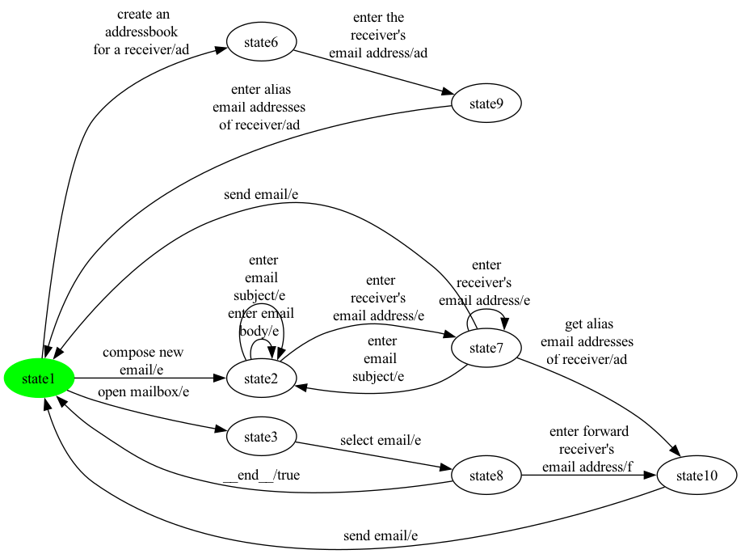

### State coverage (1 test case, 9 transitions)

```
open mailbox -> select email -> enter forward 
receiver's 
email address -> send email -> create an 
addressbook 
for a receiver -> enter the  
receiver's 
email address -> enter alias 
email addresses 
of receiver -> compose new 
email -> enter 
receiver's 
email address
```

### All-transitions coverage (8 test cases, 15 transitions total)

- **`eMail_p18_trans_seg0`**: `enter forward 
receiver's 
email address`
- **`eMail_p18_trans_seg1`**: `open mailbox -> select email`
- **`eMail_p18_trans_seg2`**: `create an 
addressbook 
for a receiver -> enter the  
receiver's 
email address -> enter alias 
email addresses 
of receiver`
- **`eMail_p18_trans_seg3`**: `send email`
- **`eMail_p18_trans_seg4`**: `enter 
receiver's 
email address`
- **`eMail_p18_trans_seg5`**: `compose new 
email`
- **`eMail_p18_trans_seg6`**: `enter
 email 
subject -> enter email 
body -> enter
 email 
subject`
- **`eMail_p18_trans_seg7`**: `enter 
receiver's 
email address -> get alias 
email addresses 
of receiver -> send email`

### All-transition-pairs coverage (23 test cases, 61 transitions total)

- **`eMail_p18_pair_seg0`**: `compose new 
email -> enter
 email 
subject -> enter
 email 
subject -> enter email 
body`
- **`eMail_p18_pair_seg1`**: `enter 
receiver's 
email address -> get alias 
email addresses 
of receiver`
- **`eMail_p18_pair_seg2`**: `send email -> create an 
addressbook 
for a receiver`
- **`eMail_p18_pair_seg3`**: `enter alias 
email addresses 
of receiver -> create an 
addressbook 
for a receiver`
- **`eMail_p18_pair_seg4`**: `enter alias 
email addresses 
of receiver -> compose new 
email -> enter email 
body -> enter 
receiver's 
email address`
- **`eMail_p18_pair_seg5`**: `enter 
receiver's 
email address -> send email -> compose new 
email`
- **`eMail_p18_pair_seg6`**: `enter 
receiver's 
email address -> get alias 
email addresses 
of receiver -> send email -> open mailbox -> select email`
- **`eMail_p18_pair_seg7`**: `__end__ -> open mailbox`
- **`eMail_p18_pair_seg8`**: `__end__ -> compose new 
email`
- **`eMail_p18_pair_seg9`**: `enter 
receiver's 
email address -> enter 
receiver's 
email address -> enter 
receiver's 
email address -> enter
 email 
subject -> enter
 email 
subject`
- **`eMail_p18_pair_seg10`**: `enter 
receiver's 
email address -> send email -> create an 
addressbook 
for a receiver`
- **`eMail_p18_pair_seg11`**: `enter the  
receiver's 
email address -> enter alias 
email addresses 
of receiver`
- **`eMail_p18_pair_seg12`**: `compose new 
email -> enter 
receiver's 
email address`
- **`eMail_p18_pair_seg13`**: `send email -> open mailbox`
- **`eMail_p18_pair_seg14`**: `__end__ -> create an 
addressbook 
for a receiver`
- **`eMail_p18_pair_seg15`**: `enter forward 
receiver's 
email address -> send email`
- **`eMail_p18_pair_seg16`**: `select email -> enter forward 
receiver's 
email address`
- **`eMail_p18_pair_seg17`**: `send email -> compose new 
email`
- **`eMail_p18_pair_seg18`**: `enter 
receiver's 
email address -> enter
 email 
subject -> enter 
receiver's 
email address`
- **`eMail_p18_pair_seg19`**: `enter
 email 
subject -> enter email 
body -> enter email 
body -> enter
 email 
subject -> enter 
receiver's 
email address`
- **`eMail_p18_pair_seg20`**: `open mailbox`
- **`eMail_p18_pair_seg21`**: `create an 
addressbook 
for a receiver -> enter the  
receiver's 
email address`
- **`eMail_p18_pair_seg22`**: `enter alias 
email addresses 
of receiver -> open mailbox`

## Product 19

**Selected features:** selected = {au, e, s}

**Repaired FTS:** 8 states, 17 transitions

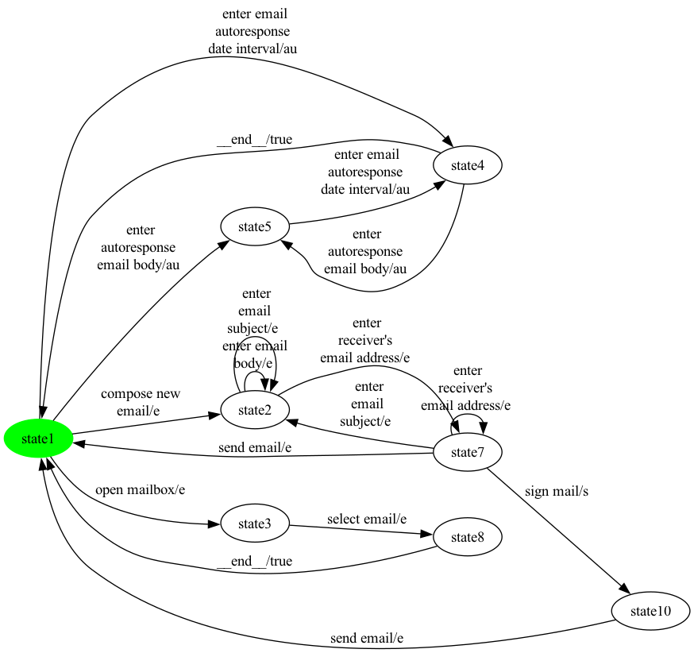

### State coverage (1 test case, 9 transitions)

```
compose new 
email -> enter 
receiver's 
email address -> sign mail -> send email -> open mailbox -> select email -> __end__ -> enter email 
autoresponse 
date interval -> enter 
autoresponse 
email body
```

### All-transitions coverage (7 test cases, 15 transitions total)

- **`eMail_p19_trans_seg0`**: `enter email 
autoresponse 
date interval -> enter 
autoresponse 
email body -> enter email 
autoresponse 
date interval`
- **`eMail_p19_trans_seg1`**: `enter 
autoresponse 
email body`
- **`eMail_p19_trans_seg2`**: `open mailbox -> select email`
- **`eMail_p19_trans_seg3`**: `compose new 
email`
- **`eMail_p19_trans_seg4`**: `send email`
- **`eMail_p19_trans_seg5`**: `enter 
receiver's 
email address -> enter
 email 
subject -> enter email 
body -> enter
 email 
subject`
- **`eMail_p19_trans_seg6`**: `enter 
receiver's 
email address -> sign mail -> send email`

### All-transition-pairs coverage (27 test cases, 69 transitions total)

- **`eMail_p19_pair_seg0`**: `enter email 
autoresponse 
date interval`
- **`eMail_p19_pair_seg1`**: `__end__ -> open mailbox`
- **`eMail_p19_pair_seg2`**: `__end__ -> enter email 
autoresponse 
date interval`
- **`eMail_p19_pair_seg3`**: `__end__ -> open mailbox -> select email`
- **`eMail_p19_pair_seg4`**: `__end__ -> enter email 
autoresponse 
date interval`
- **`eMail_p19_pair_seg5`**: `compose new 
email -> enter email 
body -> enter
 email 
subject -> enter
 email 
subject`
- **`eMail_p19_pair_seg6`**: `sign mail -> send email -> enter 
autoresponse 
email body`
- **`eMail_p19_pair_seg7`**: `compose new 
email -> enter
 email 
subject -> enter 
receiver's 
email address`
- **`eMail_p19_pair_seg8`**: `send email -> open mailbox`
- **`eMail_p19_pair_seg9`**: `__end__ -> enter 
autoresponse 
email body`
- **`eMail_p19_pair_seg10`**: `enter 
receiver's 
email address -> sign mail`
- **`eMail_p19_pair_seg11`**: `send email -> compose new 
email`
- **`eMail_p19_pair_seg12`**: `send email -> enter email 
autoresponse 
date interval`
- **`eMail_p19_pair_seg13`**: `compose new 
email -> enter 
receiver's 
email address -> send email -> enter 
autoresponse 
email body`
- **`eMail_p19_pair_seg14`**: `__end__ -> compose new 
email`
- **`eMail_p19_pair_seg15`**: `send email -> compose new 
email`
- **`eMail_p19_pair_seg16`**: `send email -> enter email 
autoresponse 
date interval -> enter 
autoresponse 
email body -> enter email 
autoresponse 
date interval`
- **`eMail_p19_pair_seg17`**: `send email -> open mailbox`
- **`eMail_p19_pair_seg18`**: `enter 
receiver's 
email address -> enter
 email 
subject -> enter email 
body -> enter 
receiver's 
email address`
- **`eMail_p19_pair_seg19`**: `enter
 email 
subject -> enter
 email 
subject -> enter email 
body -> enter email 
body`
- **`eMail_p19_pair_seg20`**: `enter 
autoresponse 
email body`
- **`eMail_p19_pair_seg21`**: `__end__ -> enter 
autoresponse 
email body -> enter email 
autoresponse 
date interval -> enter 
autoresponse 
email body`
- **`eMail_p19_pair_seg22`**: `compose new 
email`
- **`eMail_p19_pair_seg23`**: `enter 
receiver's 
email address -> sign mail`
- **`eMail_p19_pair_seg24`**: `open mailbox`
- **`eMail_p19_pair_seg25`**: `__end__ -> compose new 
email`
- **`eMail_p19_pair_seg26`**: `enter 
receiver's 
email address -> enter 
receiver's 
email address -> enter
 email 
subject -> enter 
receiver's 
email address -> enter 
receiver's 
email address -> send email`

## Product 20

**Selected features:** selected = {ad, au, e, en, s}

**Repaired FTS:** 11 states, 23 transitions

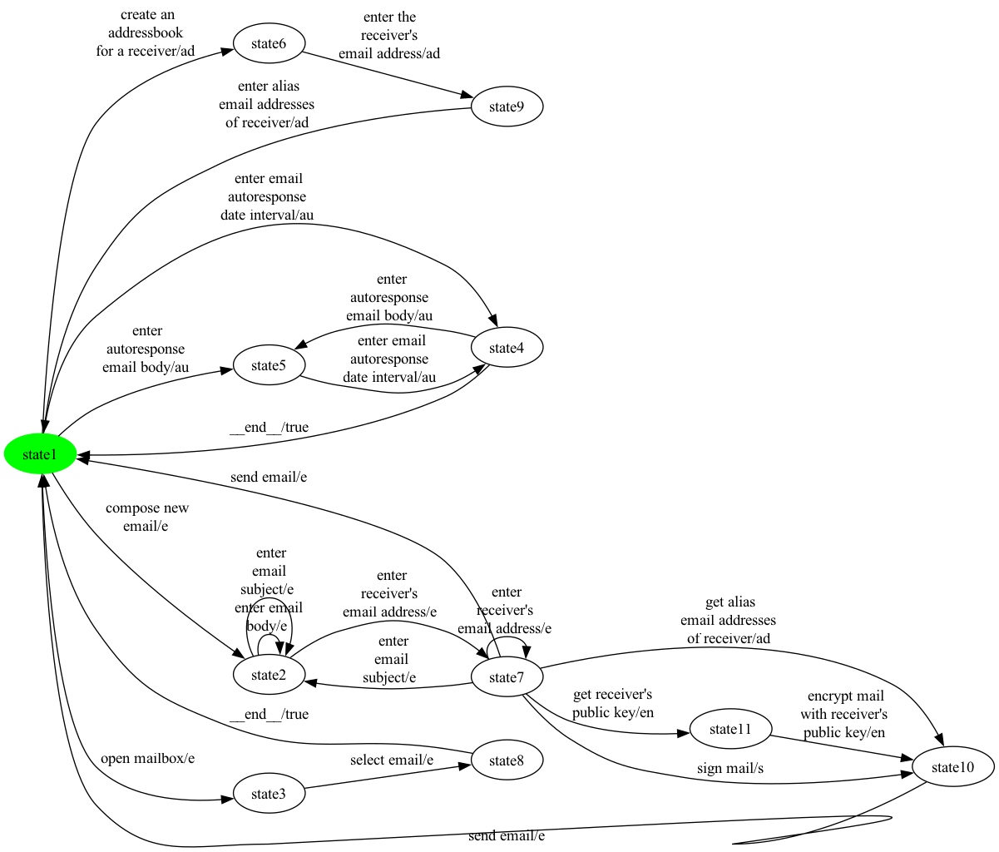

### State coverage (1 test case, 17 transitions)

```
compose new 
email -> enter 
receiver's 
email address -> sign mail -> send email -> open mailbox -> select email -> __end__ -> enter email 
autoresponse 
date interval -> enter 
autoresponse 
email body -> enter email 
autoresponse 
date interval -> __end__ -> create an 
addressbook 
for a receiver -> enter the  
receiver's 
email address -> enter alias 
email addresses 
of receiver -> compose new 
email -> enter 
receiver's 
email address -> get receiver's  
public key
```

### All-transitions coverage (9 test cases, 21 transitions total)

- **`eMail_p20_trans_seg0`**: `enter email 
autoresponse 
date interval -> enter 
autoresponse 
email body -> enter email 
autoresponse 
date interval`
- **`eMail_p20_trans_seg1`**: `enter 
autoresponse 
email body`
- **`eMail_p20_trans_seg2`**: `open mailbox -> select email`
- **`eMail_p20_trans_seg3`**: `create an 
addressbook 
for a receiver -> enter the  
receiver's 
email address -> enter alias 
email addresses 
of receiver`
- **`eMail_p20_trans_seg4`**: `send email -> compose new 
email`
- **`eMail_p20_trans_seg5`**: `get receiver's  
public key -> encrypt mail 
with receiver's 
public key`
- **`eMail_p20_trans_seg6`**: `sign mail -> send email`
- **`eMail_p20_trans_seg7`**: `enter 
receiver's 
email address -> enter
 email 
subject -> enter email 
body -> enter
 email 
subject`
- **`eMail_p20_trans_seg8`**: `enter 
receiver's 
email address -> get alias 
email addresses 
of receiver`

### All-transition-pairs coverage (39 test cases, 99 transitions total)

- **`eMail_p20_pair_seg0`**: `enter email 
autoresponse 
date interval`
- **`eMail_p20_pair_seg1`**: `open mailbox -> select email`
- **`eMail_p20_pair_seg2`**: `__end__ -> open mailbox`
- **`eMail_p20_pair_seg3`**: `__end__ -> create an 
addressbook 
for a receiver`
- **`eMail_p20_pair_seg4`**: `compose new 
email -> enter email 
body -> enter
 email 
subject -> enter
 email 
subject`
- **`eMail_p20_pair_seg5`**: `enter 
receiver's 
email address -> sign mail -> send email -> enter 
autoresponse 
email body`
- **`eMail_p20_pair_seg6`**: `__end__ -> open mailbox`
- **`eMail_p20_pair_seg7`**: `__end__ -> enter email 
autoresponse 
date interval`
- **`eMail_p20_pair_seg8`**: `__end__ -> enter 
autoresponse 
email body -> enter email 
autoresponse 
date interval`
- **`eMail_p20_pair_seg9`**: `__end__ -> enter email 
autoresponse 
date interval`
- **`eMail_p20_pair_seg10`**: `compose new 
email -> enter
 email 
subject -> enter 
receiver's 
email address -> get alias 
email addresses 
of receiver -> send email -> create an 
addressbook 
for a receiver`
- **`eMail_p20_pair_seg11`**: `enter alias 
email addresses 
of receiver -> compose new 
email`
- **`eMail_p20_pair_seg12`**: `enter 
receiver's 
email address -> send email -> enter 
autoresponse 
email body`
- **`eMail_p20_pair_seg13`**: `__end__ -> create an 
addressbook 
for a receiver`
- **`eMail_p20_pair_seg14`**: `enter alias 
email addresses 
of receiver -> enter email 
autoresponse 
date interval`
- **`eMail_p20_pair_seg15`**: `send email -> compose new 
email`
- **`eMail_p20_pair_seg16`**: `send email -> create an 
addressbook 
for a receiver`
- **`eMail_p20_pair_seg17`**: `enter alias 
email addresses 
of receiver -> open mailbox`
- **`eMail_p20_pair_seg18`**: `send email -> enter email 
autoresponse 
date interval`
- **`eMail_p20_pair_seg19`**: `send email -> open mailbox`
- **`eMail_p20_pair_seg20`**: `__end__ -> compose new 
email`
- **`eMail_p20_pair_seg21`**: `enter 
receiver's 
email address -> enter
 email 
subject -> enter email 
body -> enter 
receiver's 
email address`
- **`eMail_p20_pair_seg22`**: `enter
 email 
subject -> enter
 email 
subject -> enter email 
body -> enter email 
body`
- **`eMail_p20_pair_seg23`**: `enter 
autoresponse 
email body`
- **`eMail_p20_pair_seg24`**: `__end__ -> compose new 
email -> enter 
receiver's 
email address`
- **`eMail_p20_pair_seg25`**: `enter 
receiver's 
email address -> sign mail`
- **`eMail_p20_pair_seg26`**: `send email -> open mailbox`
- **`eMail_p20_pair_seg27`**: `enter 
receiver's 
email address -> get receiver's  
public key -> encrypt mail 
with receiver's 
public key -> send email`
- **`eMail_p20_pair_seg28`**: `compose new 
email`
- **`eMail_p20_pair_seg29`**: `enter 
receiver's 
email address -> enter 
receiver's 
email address -> send email`
- **`eMail_p20_pair_seg30`**: `open mailbox`
- **`eMail_p20_pair_seg31`**: `create an 
addressbook 
for a receiver -> enter the  
receiver's 
email address -> enter alias 
email addresses 
of receiver -> create an 
addressbook 
for a receiver`
- **`eMail_p20_pair_seg32`**: `enter alias 
email addresses 
of receiver -> enter 
autoresponse 
email body`
- **`eMail_p20_pair_seg33`**: `enter 
receiver's 
email address -> enter 
receiver's 
email address -> get alias 
email addresses 
of receiver`
- **`eMail_p20_pair_seg34`**: `send email -> compose new 
email`
- **`eMail_p20_pair_seg35`**: `enter 
receiver's 
email address -> enter
 email 
subject -> enter 
receiver's 
email address -> get receiver's  
public key`
- **`eMail_p20_pair_seg36`**: `send email -> enter email 
autoresponse 
date interval -> enter 
autoresponse 
email body -> enter email 
autoresponse 
date interval`
- **`eMail_p20_pair_seg37`**: `__end__ -> enter 
autoresponse 
email body`
- **`eMail_p20_pair_seg38`**: `enter email 
autoresponse 
date interval -> enter 
autoresponse 
email body`

## Product 21

**Selected features:** selected = {e, en, s}

**Repaired FTS:** 7 states, 14 transitions


### State coverage (1 test case, 7 transitions)

```
open mailbox -> select email -> __end__ -> compose new 
email -> enter 
receiver's 
email address -> get receiver's  
public key -> encrypt mail 
with receiver's 
public key
```

### All-transitions coverage (6 test cases, 13 transitions total)

- **`eMail_p21_trans_seg0`**: `open mailbox -> select email`
- **`eMail_p21_trans_seg1`**: `send email`
- **`eMail_p21_trans_seg2`**: `enter 
receiver's 
email address -> get receiver's  
public key -> encrypt mail 
with receiver's 
public key`
- **`eMail_p21_trans_seg3`**: `compose new 
email`
- **`eMail_p21_trans_seg4`**: `enter
 email 
subject -> enter email 
body -> enter
 email 
subject`
- **`eMail_p21_trans_seg5`**: `enter 
receiver's 
email address -> sign mail -> send email`

### All-transition-pairs coverage (15 test cases, 47 transitions total)

- **`eMail_p21_pair_seg0`**: `compose new 
email -> enter
 email 
subject -> enter
 email 
subject -> enter email 
body`
- **`eMail_p21_pair_seg1`**: `enter 
receiver's 
email address -> sign mail -> send email -> open mailbox -> select email`
- **`eMail_p21_pair_seg2`**: `__end__ -> open mailbox`
- **`eMail_p21_pair_seg3`**: `compose new 
email -> enter email 
body -> enter 
receiver's 
email address`
- **`eMail_p21_pair_seg4`**: `enter 
receiver's 
email address -> send email -> compose new 
email`
- **`eMail_p21_pair_seg5`**: `enter 
receiver's 
email address -> sign mail`
- **`eMail_p21_pair_seg6`**: `send email -> compose new 
email -> enter 
receiver's 
email address`
- **`eMail_p21_pair_seg7`**: `enter 
receiver's 
email address -> get receiver's  
public key -> encrypt mail 
with receiver's 
public key -> send email`
- **`eMail_p21_pair_seg8`**: `enter 
receiver's 
email address -> enter 
receiver's 
email address -> enter 
receiver's 
email address -> enter
 email 
subject -> enter
 email 
subject`
- **`eMail_p21_pair_seg9`**: `enter 
receiver's 
email address -> get receiver's  
public key`
- **`eMail_p21_pair_seg10`**: `enter 
receiver's 
email address -> send email -> open mailbox`
- **`eMail_p21_pair_seg11`**: `__end__ -> compose new 
email`
- **`eMail_p21_pair_seg12`**: `enter 
receiver's 
email address -> enter
 email 
subject -> enter 
receiver's 
email address`
- **`eMail_p21_pair_seg13`**: `enter
 email 
subject -> enter email 
body -> enter email 
body -> enter
 email 
subject -> enter 
receiver's 
email address`
- **`eMail_p21_pair_seg14`**: `open mailbox`

## Product 22

**Selected features:** selected = {ad, e}

**Repaired FTS:** 8 states, 15 transitions

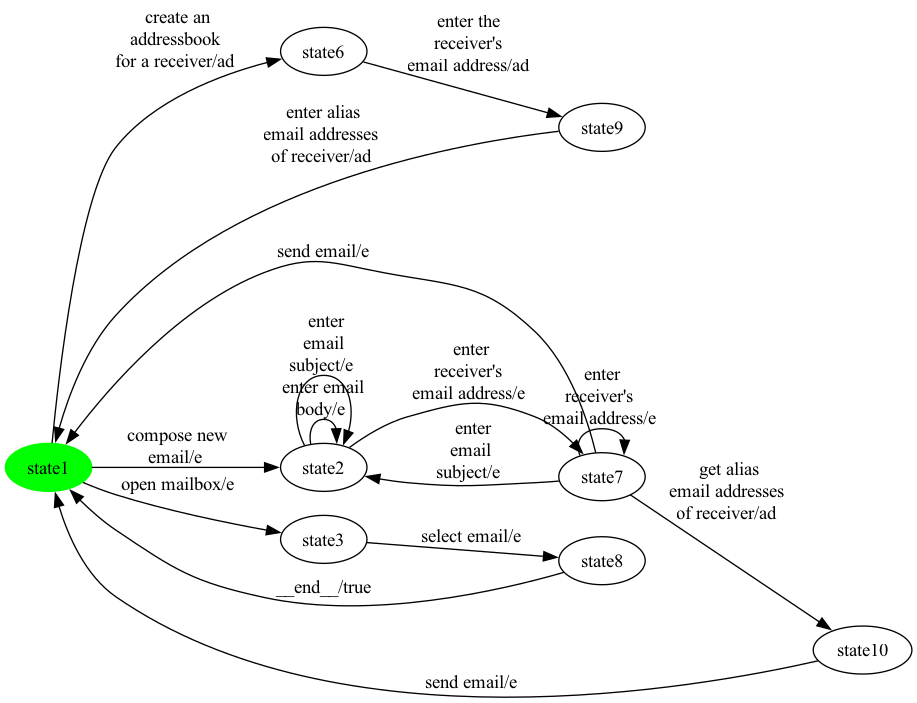

### State coverage (1 test case, 9 transitions)

```
open mailbox -> select email -> __end__ -> create an 
addressbook 
for a receiver -> enter the  
receiver's 
email address -> enter alias 
email addresses 
of receiver -> compose new 
email -> enter 
receiver's 
email address -> get alias 
email addresses 
of receiver
```

### All-transitions coverage (5 test cases, 14 transitions total)

- **`eMail_p22_trans_seg0`**: `open mailbox -> select email`
- **`eMail_p22_trans_seg1`**: `create an 
addressbook 
for a receiver -> enter the  
receiver's 
email address -> enter alias 
email addresses 
of receiver -> compose new 
email`
- **`eMail_p22_trans_seg2`**: `send email`
- **`eMail_p22_trans_seg3`**: `enter 
receiver's 
email address -> enter
 email 
subject -> enter email 
body -> enter
 email 
subject`
- **`eMail_p22_trans_seg4`**: `enter 
receiver's 
email address -> get alias 
email addresses 
of receiver -> send email`

### All-transition-pairs coverage (21 test cases, 57 transitions total)

- **`eMail_p22_pair_seg0`**: `compose new 
email -> enter
 email 
subject -> enter
 email 
subject -> enter email 
body`
- **`eMail_p22_pair_seg1`**: `enter 
receiver's 
email address -> get alias 
email addresses 
of receiver`
- **`eMail_p22_pair_seg2`**: `send email -> create an 
addressbook 
for a receiver`
- **`eMail_p22_pair_seg3`**: `enter alias 
email addresses 
of receiver -> create an 
addressbook 
for a receiver`
- **`eMail_p22_pair_seg4`**: `enter alias 
email addresses 
of receiver -> compose new 
email -> enter email 
body -> enter 
receiver's 
email address`
- **`eMail_p22_pair_seg5`**: `send email -> open mailbox -> select email`
- **`eMail_p22_pair_seg6`**: `__end__ -> open mailbox`
- **`eMail_p22_pair_seg7`**: `__end__ -> compose new 
email`
- **`eMail_p22_pair_seg8`**: `enter 
receiver's 
email address -> send email -> compose new 
email`
- **`eMail_p22_pair_seg9`**: `enter 
receiver's 
email address -> get alias 
email addresses 
of receiver -> send email -> compose new 
email`
- **`eMail_p22_pair_seg10`**: `enter 
receiver's 
email address -> enter 
receiver's 
email address -> enter 
receiver's 
email address -> enter
 email 
subject -> enter
 email 
subject`
- **`eMail_p22_pair_seg11`**: `enter 
receiver's 
email address -> send email -> create an 
addressbook 
for a receiver`
- **`eMail_p22_pair_seg12`**: `enter the  
receiver's 
email address -> enter alias 
email addresses 
of receiver`
- **`eMail_p22_pair_seg13`**: `compose new 
email -> enter 
receiver's 
email address`
- **`eMail_p22_pair_seg14`**: `send email -> open mailbox`
- **`eMail_p22_pair_seg15`**: `__end__ -> create an 
addressbook 
for a receiver`
- **`eMail_p22_pair_seg16`**: `enter 
receiver's 
email address -> enter
 email 
subject -> enter 
receiver's 
email address`
- **`eMail_p22_pair_seg17`**: `enter
 email 
subject -> enter email 
body -> enter email 
body -> enter
 email 
subject -> enter 
receiver's 
email address`
- **`eMail_p22_pair_seg18`**: `open mailbox`
- **`eMail_p22_pair_seg19`**: `create an 
addressbook 
for a receiver -> enter the  
receiver's 
email address`
- **`eMail_p22_pair_seg20`**: `enter alias 
email addresses 
of receiver -> open mailbox`

## Product 23

**Selected features:** selected = {ad, e, en, s}

**Repaired FTS:** 9 states, 18 transitions

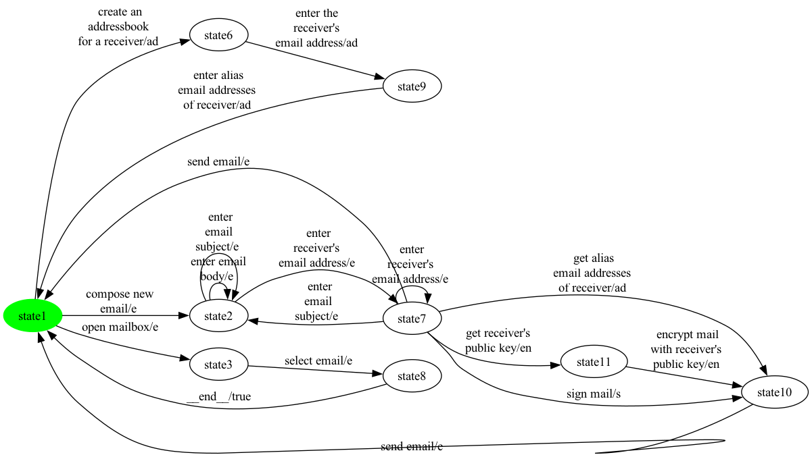

### State coverage (1 test case, 10 transitions)

```
open mailbox -> select email -> __end__ -> create an 
addressbook 
for a receiver -> enter the  
receiver's 
email address -> enter alias 
email addresses 
of receiver -> compose new 
email -> enter 
receiver's 
email address -> get receiver's  
public key -> encrypt mail 
with receiver's 
public key
```

### All-transitions coverage (7 test cases, 17 transitions total)

- **`eMail_p23_trans_seg0`**: `open mailbox -> select email`
- **`eMail_p23_trans_seg1`**: `create an 
addressbook 
for a receiver -> enter the  
receiver's 
email address -> enter alias 
email addresses 
of receiver`
- **`eMail_p23_trans_seg2`**: `send email -> compose new 
email`
- **`eMail_p23_trans_seg3`**: `get receiver's  
public key -> encrypt mail 
with receiver's 
public key`
- **`eMail_p23_trans_seg4`**: `enter 
receiver's 
email address -> sign mail`
- **`eMail_p23_trans_seg5`**: `enter
 email 
subject -> enter email 
body -> enter
 email 
subject`
- **`eMail_p23_trans_seg6`**: `enter 
receiver's 
email address -> get alias 
email addresses 
of receiver -> send email`

### All-transition-pairs coverage (25 test cases, 68 transitions total)

- **`eMail_p23_pair_seg0`**: `compose new 
email -> enter
 email 
subject -> enter
 email 
subject -> enter email 
body`
- **`eMail_p23_pair_seg1`**: `enter 
receiver's 
email address -> sign mail -> send email`
- **`eMail_p23_pair_seg2`**: `enter alias 
email addresses 
of receiver -> create an 
addressbook 
for a receiver`
- **`eMail_p23_pair_seg3`**: `compose new 
email -> enter email 
body -> enter 
receiver's 
email address -> get alias 
email addresses 
of receiver`
- **`eMail_p23_pair_seg4`**: `send email -> create an 
addressbook 
for a receiver`
- **`eMail_p23_pair_seg5`**: `enter 
receiver's 
email address -> send email -> compose new 
email`
- **`eMail_p23_pair_seg6`**: `enter 
receiver's 
email address -> sign mail`
- **`eMail_p23_pair_seg7`**: `enter alias 
email addresses 
of receiver -> compose new 
email`
- **`eMail_p23_pair_seg8`**: `enter 
receiver's 
email address -> get alias 
email addresses 
of receiver -> send email -> open mailbox -> select email`
- **`eMail_p23_pair_seg9`**: `__end__ -> open mailbox`
- **`eMail_p23_pair_seg10`**: `__end__ -> compose new 
email`
- **`eMail_p23_pair_seg11`**: `enter 
receiver's 
email address -> enter 
receiver's 
email address -> get receiver's  
public key -> encrypt mail 
with receiver's 
public key`
- **`eMail_p23_pair_seg12`**: `send email -> compose new 
email`
- **`eMail_p23_pair_seg13`**: `enter 
receiver's 
email address -> enter 
receiver's 
email address -> enter
 email 
subject -> enter
 email 
subject`
- **`eMail_p23_pair_seg14`**: `enter 
receiver's 
email address -> get receiver's  
public key`
- **`eMail_p23_pair_seg15`**: `encrypt mail 
with receiver's 
public key -> send email`
- **`eMail_p23_pair_seg16`**: `compose new 
email -> enter 
receiver's 
email address -> send email -> create an 
addressbook 
for a receiver`
- **`eMail_p23_pair_seg17`**: `enter the  
receiver's 
email address -> enter alias 
email addresses 
of receiver`
- **`eMail_p23_pair_seg18`**: `enter 
receiver's 
email address -> enter
 email 
subject -> enter 
receiver's 
email address`
- **`eMail_p23_pair_seg19`**: `enter
 email 
subject -> enter email 
body -> enter email 
body -> enter
 email 
subject -> enter 
receiver's 
email address`
- **`eMail_p23_pair_seg20`**: `send email -> open mailbox`
- **`eMail_p23_pair_seg21`**: `__end__ -> create an 
addressbook 
for a receiver -> enter the  
receiver's 
email address`
- **`eMail_p23_pair_seg22`**: `enter alias 
email addresses 
of receiver -> open mailbox`
- **`eMail_p23_pair_seg23`**: `open mailbox`
- **`eMail_p23_pair_seg24`**: `create an 
addressbook 
for a receiver`

---

Total products: 23.
