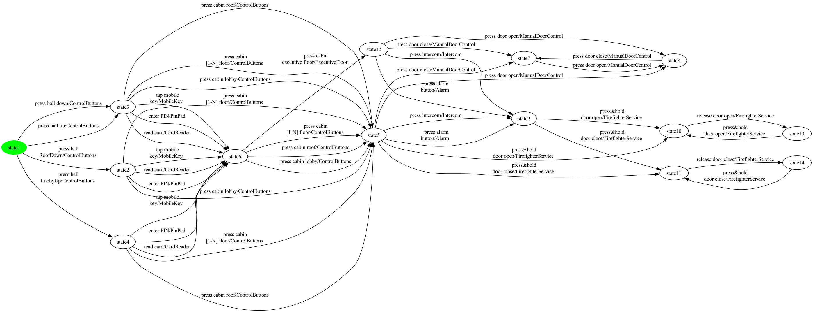
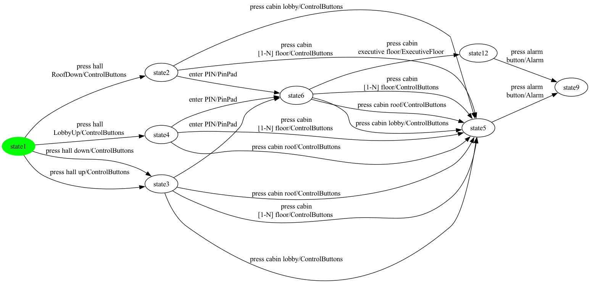

# SCC Walkthrough — Elevator (product 2)

Stepwise rendering of the M2 SCC repair pipeline on one hand-picked product of Elevator. Each step shows the FTS as a PNG and a one-paragraph summary of what changed. Synthetic balancing edges (introduced later by EulerianBalancer in M3) are not present here.

**Chosen configuration:** selected = {Alarm, ControlButtons, ExecutiveFloor, PinPad}

## Step 1 — SPL-level FTS (initial input to the pipeline)

**Size:** 14 states, 42 transitions

This is the bisimulation-minimized FTS produced by MxeToFtsConverter from the MXE ESG-Fx model. Every transition still carries its feature expression for traceability. The same FTS is the input for every product.

## Step 2 — Projected FTS (after applying the configuration)

**Size:** 8 states, 20 transitions

FExpressionPreservingProjection keeps only transitions whose feature expression evaluates to true under the chosen configuration. 22 transition(s) were dropped relative to step 1. After projection the graph has 8 strongly-connected component(s); the SCC containing the initial state has 1 state(s). If that count is less than the total state count, the next step removes the unreachable / non-returnable portions.

## Step 3 — Repaired FTS (initial-state SCC only)

**Size:** 1 states, 0 transitions

InitialSccFilter keeps only the SCC containing the initial state and drops every other state along with the transitions touching them. 7 state(s) and 20 transition(s) were removed. The result is strongly connected by construction and feeds the EulerianBalancer + Hierholzer pipeline in M3 and the coverage generators in M4 / M5 / M6. — NOTE: the repaired FTS for this product is degenerate (only the initial state survives). This indicates a structural limitation in the current MXE-to-FTS conversion: when an ESG vertex has both ]-edges and non-]-edges (a 'mixed terminal'), the converter currently drops its ]-edges silently. With no back-to-INIT transitions remaining, the initial state ends up in a singleton SCC and InitialSccFilter collapses the FTS. Elevator is the SPL where this matters most — every event there is mixed-terminal. A planned Phase-1 algorithm refinement will add a synthetic 'end-of-test' transition from each mixed-terminal vertex back to INIT, which should restore meaningful connectivity for Elevator products.

