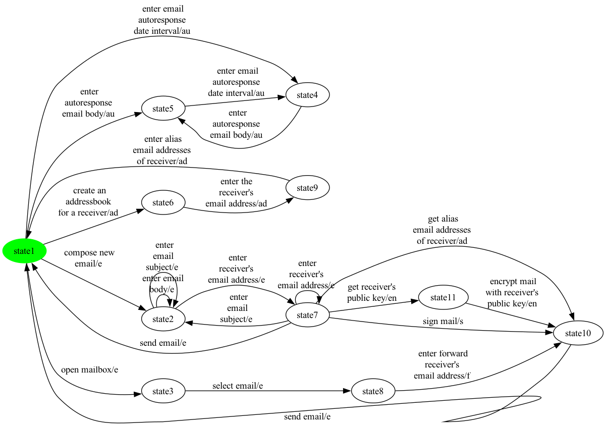
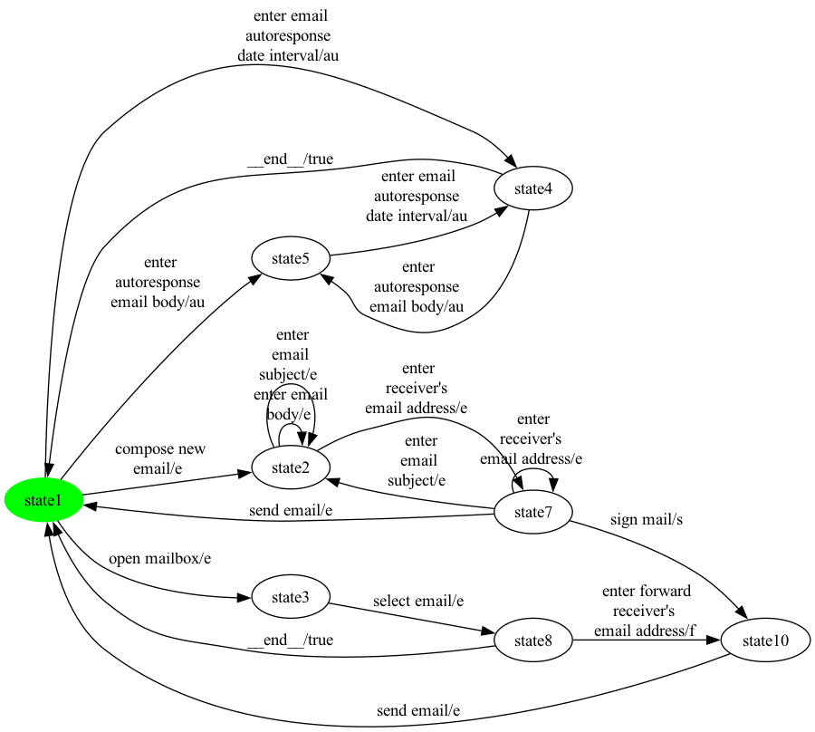

# SCC Walkthrough — eMail (product 7)

Stepwise rendering of the M2 SCC repair pipeline on one hand-picked product of eMail. Each step shows the FTS as a PNG and a one-paragraph summary of what changed. Synthetic balancing edges (introduced later by EulerianBalancer in M3) are not present here.

**Chosen configuration:** selected = {au, e, f, s}

## Step 1 — SPL-level FTS (initial input to the pipeline)

**Size:** 11 states, 24 transitions

This is the bisimulation-minimized FTS produced by MxeToFtsConverter from the MXE ESG-Fx model. Every transition still carries its feature expression for traceability. The same FTS is the input for every product.

## Step 2 — Projected FTS (after applying the configuration)

**Size:** 8 states, 18 transitions

FExpressionPreservingProjection keeps only transitions whose feature expression evaluates to true under the chosen configuration. 6 transition(s) were dropped relative to step 1. After projection the graph has 1 strongly-connected component(s); the SCC containing the initial state has 8 state(s). If that count is less than the total state count, the next step removes the unreachable / non-returnable portions.

## Step 3 — Repaired FTS (initial-state SCC only)

**Size:** 8 states, 18 transitions

InitialSccFilter keeps only the SCC containing the initial state and drops every other state along with the transitions touching them. 0 state(s) and 0 transition(s) were removed. The result is strongly connected by construction and feeds the EulerianBalancer + Hierholzer pipeline in M3 and the coverage generators in M4 / M5 / M6.

